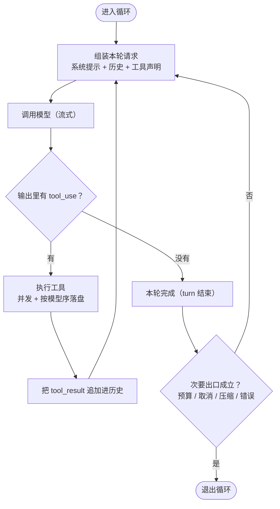

# 第 1 章：Agent 主循环 —— 一次「模型 → 工具 → 决策」如何被驱动

本章回答整个运行时最基础的一个问题：**谁在驱动这个循环、它什么时候停、停在哪里**。四个项目在这一层的骨架几乎同源——都是「外层续接 + 内层工具」的双层结构——但**「谁才是状态的主人」给出了四个完全不同的答案**：内存闭包、append-only 日志、`ContextManager`、显式传递的 `State` 对象。这个分歧决定了后面每一层的设计走向。

> **本层定位**：L1，Agent 运行时的心脏。回答「谁在驱动模型 → 工具 → 决策这个循环、它何时停、停在哪里」。
>
> **前置依赖**：无（全系列的起点）。
>
> **分析对象**：
> - **pi** —— `packages/agent/src/agent-loop.ts`（TypeScript，事件流驱动）
> - **deepseek-harness** —— `packages/core/agent-loop/src/agent.ts`（TypeScript，事件溯源 + turn/step 状态机）
> - **codex** —— `codex-rs/core/src/session/turn.rs`（Rust，async 采样循环 + 内建压缩）
> - **Claude-Code** —— `src/query.ts` + `src/QueryEngine.ts`（TypeScript，async 生成器 + 显式 `next: State`）

---

## 一、核心结论速览

1. **骨架同源，差异在「谁是状态的主人」**：四家都是「外层续接循环 + 内层工具循环」，但 pi 把状态放在内存闭包里、dsh 放在 append-only 日志里、codex 放在 `ContextManager` + rollout 里、Claude-Code 放在显式传递的 `State` 对象里。
2. **停止判定四家完全一致**：「本轮没有工具调用即完成」是唯一主出口；差异全在**次要出口的丰富度**——pi 约 3 个、dsh 4 个、codex 6 个、Claude-Code 11+ 个。
3. **压缩与循环的耦合度呈阶梯**：pi 完全解耦（靠 `prepareNextTurn` 回调外挂）→ dsh 半解耦（`agent/pre-step` + `agent/request-error` 两路事件驱动）→ codex 深度耦合（`run_turn` 内直接调 pre/mid/post 三阶段压缩）→ Claude-Code 最耦合（每轮开头串起 snip → microcompact → contextCollapse → autocompact 四条流水线）。
4. **只有 dsh 与 Claude-Code 把「这轮是被截断的」当作一等状态**：dsh 的 max-tokens **粘性**（`:331-336`）保证后续正常 step 不降级 turn 结果；Claude-Code 用 `MAX_OUTPUT_TOKENS_RECOVERY_LIMIT=3`（`query.ts:164`）做恢复式续写。
5. **防死循环四家各有招式，唯 Claude-Code 的阈值有生产数据背书**：`MAX_CONSECUTIVE_AUTOCOMPACT_FAILURES=3`（`autoCompact.ts:70`）注释里记着「1,279 个会话连续失败 50+ 次、全站每天浪费约 25 万次 API 调用」——全系列唯一给出量化依据的熔断阈值。

---

## 二、本层职责与边界

### 2.1 本层解决什么问题

主循环只做四件事，但每件都有取舍：

| 职责 | 问题 | 四家分歧点 |
|---|---|---|
| **① 驱动迭代** | 谁来发起下一次模型调用？ | 外层 while / kick 驱动 / 生成器 yield / turn 递归 |
| **② 判定终止** | 何时算「这一轮结束了」？ | 出口枚举的粒度（3 个 vs 11 个） |
| **③ 接纳 steering** | 模型运行时用户插话怎么进循环？ | 循环条件 / 瀑布钩子 / pending_input drain / 队列 |
| **④ 隔离边界** | 截断、超窗、错误、中断怎么处理？ | 保守失败 vs 自动补偿 vs 熔断 |

### 2.2 层次定位

```text
┌──────────────────────────────────────┐
│ L1 主循环（本章）                    │
│ 驱动「模型 → 工具 → 决策」的重复轮次 │
│ 决定：何时停 · 停在哪里 · 状态放在哪 │
└───────────────────┬──────────────────┘
                    │ 每一轮都要问的三个问题
      ┬─────────────┼─────────────┬
      ▼             ▼             ▼
 L3 工具定义  L4 上下文压缩  L2 工具调用
能用哪些工具  能装多少历史  怎么并发执行
      └─────────────┼─────────────┘
                    ▼
                    L5 消息 · Session（状态的落点）
                    ▼
                    L6 持久化与恢复（跨进程存活）
```

**图 1-1**：L1 在运行时栈中的位置。主循环本身极薄，它的复杂度全部来自「它要向谁取状态」——这个答案由下面的 L2–L6 决定。

```text
        ┌───────────── 上游：用户 / 上层任务 ──────────────────────────┐
        │ 用户输入 · steering 队列 · follow-up · 子 agent 任务         │
        └───────────────────────────────┬──────────────────────────────┘
                                        │ 进入
        ┌───────────────────────────────▼──────────────────────────────┐
        │   L1  主循环（本篇）                                         │
        │   · 组装请求    · 收流                                       │
        │   · 判定终止    · 决定续跑                                   │
        └────────┬──────────────┬──────────────┬──────────────┬────────┘
                 │              │              │              │
           ┌─────▼─────┐  ┌─────▼─────┐  ┌─────▼─────┐  ┌─────▼─────┐
           │ L2 工具   │  │ L4 压缩   │  │ L5 消息   │  │ L6 持久化 │
           │ 调度      │  │ 触发点    │  │ 组装      │  │ 落盘/恢复 │
           └───────────┘  └───────────┘  └───────────┘  └───────────┘
                 │              │              │              │
                 └──────────────┴───────┬──────┴──────────────┘
                                        │
                                  ┌─────▼─────┐
                                  │ LLM 流    │
                                  └───────────┘
```

**关键**：L1 是唯一同时触碰 L2/L4/L5/L6 的层次。压缩在哪一步被触发（L1 内 vs L1 外），直接决定了这个项目的可恢复性与复杂度。

### 2.3 四家在本层的边界差异

| 边界定义 | pi | dsh | codex | Claude-Code |
|---|---|---|---|---|
| 「一轮」的名字 | turn | turn / step | turn / sampling request | query 迭代 / turn |
| 内层循环条件 | `hasMoreToolCalls \|\| pendingMessages.length>0` | `while(true)` + `turnEnds` | `loop{}` + `needs_follow_up` | `while(true)` + `next:State` |
| 循环归属 | 顶层函数 `runLoop` | 类方法 `turn()`/`step()` | 自由函数 `run_turn` | 生成器 `queryLoop()` |
| 压缩是否在循环内 | 否（回调外挂） | 否（事件驱动） | **是**（直接调） | **是**（流水线） |

---

## 三、概念对齐表

**读法**：同一行是同一个概念，四列是它在各项目里的原名（`—` 表示无对应物）。

| 概念 | pi | deepseek-harness | codex | Claude-Code |
|---|---|---|---|---|
| 主循环入口 | `runLoop` `agent-loop.ts:162` | `kick()` `agent.ts:251` | `run_turn` `turn.rs:163` | `queryLoop` `query.ts:241` |
| 外层续接循环 | `while(true)` `:178` | `while(await this.turn())` `:253` | `loop{}` `turn.rs:423` | `while(true)` `query.ts:307` |
| 内层工具循环 | `while(hasMoreToolCalls\|\|pending)` `:182` | `while(true)` `agent.ts:312` | 无独立内层，与 `loop{}` 合并 | 无独立内层，靠 `next:State` 续 |
| 单次模型调用 | `streamAssistantResponse` `:380` | `step()` `agent.ts:380` | `run_sampling_request` `turn.rs:1584` | `deps.callModel` `query.ts:659` |
| 停止判定（主出口） | 无 toolCall `:258` | `finish.kind==='completed'` | `needs_follow_up=false` | `!needsFollowUp` `:1062` |
| 退出原因枚举 | 隐式（stopReason + 无工具） | `TurnEndReason`（日志事件） | `break` 分支 + 错误分类 | 显式 `Terminal.reason`（11 种） |
| steering 注入 | 内层循环条件 `pendingMessages` | `agent/pre-step` 瀑布 `:275` | `pending_input` drain `turn.rs:423` | 命令队列 + `consumedCommandUuids` `:223` |
| 扩展钩子 | 4 个回调（prepareNextTurn/finishTurn/before/afterToolCall） | 4 个命名瀑布（pre-step/request/request-error/turn-stopping） | stop hooks + PreToolUse | stop hooks `stopHooks.ts:65` |
| hook 调用语义 | 回调可抛错 | **瀑布**（可链式改写决策） | 顺序执行 | 顺序执行（异常降级为 warning） |
| 截断处理 | 全批工具失败 `:475` | max-tokens **粘性** `:331` | mid-turn compact `:610` | 恢复式续写（上限 3）`query.ts:164` |
| token 预算 | 无 | 无（README 明示） | `compact_token_budget.rs` | `query/tokenBudget.ts:45` |
| 状态载体 | 内存 `currentContext.messages` | Session 日志（append-only） | `ContextManager` + rollout | 显式 `State` 对象 |
| 循环可重入/可恢复 | 否 | **是**（日志回放即测试） | 是（rollout 重建） | 部分（next State 显式） |
| abort 分类 | 裸 `AbortSignal` | 分类（user/parent/hook/disposed） | `CancellationToken` + `TurnAborted` | 5 类 abort reason `StreamingToolExecutor.ts:210` |
| 每轮压缩流水线 | 无 | 无 | pre/mid/post 三阶段 | snip→micro→collapse→auto 四段 |

---

## 四、逐项目实现



**图 1-2**：四家共用的主循环骨架。四家在此完全一致的主干是「无工具调用即完成」；差异全部落在右下的「次要出口」分支——出口数量从 3 个（pi）到 11+ 个（Claude-Code）。

### 4.1 pi —— 双层 while + 事件流

#### 4.1.1 循环骨架

```ts
// packages/agent/src/agent-loop.ts:162
async function runLoop(initialContext, newMessages, initialConfig, signal, emit, streamFunction) {
  // :178 外层：等 follow-up 消息
  while (true) {
    let hasMoreToolCalls = true;
    // :182 内层：工具循环 + steering
    while (hasMoreToolCalls || pendingMessages.length > 0) {
      const nextTurnSnapshot = await config.prepareNextTurn?.(lastCompletedTurn);   // :185

      // :241 调模型 → :258-269 停止判定与截断分支 → :273-276 工具结果入上下文

      ...
    }

    // :251 / :285 finishTurn 决策：action 为 end 则退出，否则继续下一轮

    ...
  }
}
```

**三层结构**：外层 `while(true)`（`:178`）等 follow-up；内层（`:182`）跑「模型 + 工具」；`prepareNextTurn`（`:185`）是唯一在每轮**模型调用之前**的扩展点——压缩就是挂在这里的。

#### 4.1.2 一轮的五个步骤

| # | 步骤 | 锚点 |
|---|---|---|
| 1 | 调模型并收流 | `streamAssistantResponse` `:241`（定义 `:380`） |
| 2 | 停止判定：过滤出 toolCall | `:258-262` |
| 3 | 分支：截断 or 正常执行 | `:263-269` |
| 4 | 工具结果入 context 与 newMessages | `:273-276` |
| 5 | `finishTurn` 决策 end / continue | `:251`（异常退出）/ `:285`（正常） |

```ts
// :258  停止判定：这是内层循环的唯一收敛点
const toolCalls = message.content.filter((c) => c.type === "toolCall");
if (toolCalls.length === 0) { hasMoreToolCalls = false; }
// :263  截断时不做任何工具执行，全部物化为失败
message.stopReason === "length"
  ? await failToolCallsFromTruncatedMessage(...)   // :475
  : await executeToolCalls(...)                    // :505
```

#### 4.1.3 扩展点：4 个回调

`prepareNextTurn`（`types.ts:274`）、`finishTurn`（`types.ts:260`）、`beforeToolCall`/`afterToolCall`。这是**回调式扩展**：简单、直观，但多个插件难以协作（无优先级、无链式改写、无法 reject 后由他人接管）。

#### 4.1.4 状态：全内存

循环的整个状态是 `currentContext.messages`（`AgentMessage[]`）。**没有持久化、没有日志、没有回放**。崩溃即丢失。这是 pi 换取「简单可嵌入」的代价——它可以挂在任意 UI 上，但无法做崩溃恢复。

---

### 4.2 deepseek-harness —— 日志驱动的 turn/step 状态机

#### 4.2.1 kick 驱动与阶段机

```ts
// packages/core/agent-loop/src/agent.ts:251
while (await this.turn()) {}          // :253 —— turn 返回 false 才停

// :295 turn()：阶段机 idle / maintenance / running
private async turn(): Promise<boolean> {
  // :312
  while (true) {
    signal.throwIfAborted();
    const step = phase.step + 1;

    // :275-281 pre-step 瀑布 → :331-336 / :512 max-tokens 粘性
    // :342 turn-stopping（serial 广播）→ :516-519 工具调度

    ...
  }
}
```

**与 pi 的根本差异**：pi 的 while 条件读内存数组，dsh 的 while 条件读 `turn()` 的返回值——而 `turn()` 的返回值由**日志事件**（`turn/end`）决定。循环是日志之上的派生结构。

#### 4.2.2 turn 与 step 的职责切分

| 层 | 职责 | 锚点 |
|---|---|---|
| `turn()` | 驱动 step 序列、**判定 turn 何时结束** | `:295` |
| `step()` | 一次「pre-step → 请求 → 收流 → 工具 → 结果」 | `:380` |
| step 内层 | 请求重试循环（由 `request-error` 瀑布决定） | `:389` |

`turn-stopping` 用的是 `serial`（顺序广播，不可改写）而非 waterfall（`:342`，注释明确）——因为「这一轮结束了」是事实广播，不是决策点。

#### 4.2.3 四个命名瀑布钩子

| 钩子 | 类型 | 位置 | 可做什么 |
|---|---|---|---|
| `agent/pre-step` | waterfall | `:275-281` | 改写 claim 的消息、reject 进入 |
| `agent/request` | waterfall | `:558-561` | 改写模型/参数（seedConfig → proposedConfig） |
| `agent/request-error` | waterfall | `:476-486` | 决定 retry / 抛错 |
| `agent/turn-stopping` | serial | `:342` | 只通知 |

```ts
// :275  pre-step 是压缩的挂载点：拿到 claim 的消息，可以改写
const decision = await this.dispatch.waterfall('agent/pre-step',
  { messages: claimed, ...position, signal },
  () => Promise.resolve(seed));
```

#### 4.2.4 max-tokens 粘性

```ts
// :331-336 —— 一旦本轮出现 max-tokens，不被后续正常 step 降级
if (turnEnds === null || turnEnds.kind !== 'max-tokens') turnEnds = stepEnd;
// :512
if (finish.kind === 'max-tokens') return { kind: 'max-tokens' };
```

这是四家中唯一显式实现的「截断粘性」：即使后面某步正常完成，turn 的终态仍是 `max-tokens`。**理由**（`[注释]`）：一次被截断的输出意味着模型没说完，若被后续 step 覆盖，上层就失去了「该续写」的信号。

#### 4.2.5 状态：日志即事实源

`turn/start`、`step/start`、`assistant/message`、`tool/call`、`tool/result`、`turn/end` 全部落盘（`session/src/types.ts:288-427`）。每一次请求都从日志 derive 出来。**红利**：回放即测试（`invariant.spec.ts`）。**代价**：复杂度最高。

---

### 4.3 codex —— async 采样循环 + 内建三阶段压缩

#### 4.3.1 run_turn 骨架

```rust
// codex-rs/core/src/session/turn.rs:163
pub(crate) async fn run_turn(
    sess: Arc<Session>,
    turn_context: Arc<TurnContext>,
    mut input: Vec<TurnInput>,
    mcp_startup_requirements: &mut McpStartupRequirements,
    prewarmed_client_session: Option<ModelClientSession>,
    cancellation_token: CancellationToken,
) -> CodexResult<Option<String>> {
    let mut client_session =
        prewarmed_client_session.unwrap_or_else(|| sess.services.model_client.new_session());

    // :183 采样前压缩
    if let Err(err) = run_pre_sampling_compact(&sess, &turn_context, &mut client_session, &cancellation_token).await {
        // Compaction runs before the new input is recorded, so preserve it on every failure.
        run_hooks_and_record_inputs(
            &sess,
            &turn_context,
            &turn_context.capture_current_model_info(),
            &input,
            PersistContext::Standard,
        )
        .await;

        // TurnAborted 上抛，其余失败保留输入后继续本轮

        ...
    }

    // :423 主采样循环
    loop {
        // :598-600 should_roll_over / allow_auto_compact_fallback
        // :610-622 mid-turn compact → :703-731 post-turn 阈值压缩

        ...
    }
}
```

**判定入口**：codex 的压缩判定是 `turn.rs:598` 内联的 `should_roll_over`，而非某个独立的 `should_auto_compact` 函数：

```rust
// :598-600
let should_roll_over = needs_follow_up
    && (sess.take_new_context_window_request().await || token_limit_reached);
let allow_auto_compact_fallback = !should_roll_over && !token_limit_reached;
```

#### 4.3.2 采样与工具：工具不打断流

`run_sampling_request`（`:1584`）→ `try_run_sampling_request`（`:2448`）内是流式事件循环。工具调用被推入 `FuturesOrdered`（`turn.rs:129` 导入、`:2502` 实例化、`:2680` push_back），模型继续输出，流结束后 `drain_in_flight`（`:2395`）统一收割。

#### 4.3.3 压缩内建：三阶段 + guardian 守卫

| 阶段 | 触发 | 锚点 |
|---|---|---|
| pre-sampling | turn 开始时 | `:183` |
| mid-turn | `should_roll_over` | `:610-622`（`CompactionReason::ContextLimit` + `CompactionPhase::MidTurn`） |
| post-turn | 模型完成且超过阈值 | `:703-731` |

```rust
// :610-622 —— mid-turn 压缩后 continue，靠 guardian 防死循环
if should_roll_over {
    if let Err(err) = run_auto_compact(
        &sess,
        Arc::clone(&step_context),
        &mut client_session,
        CompactionReason::ContextLimit,
        CompactionPhase::MidTurn,
    )
    .await
    {
        // TurnAborted 上抛，其余记错后继续

        ...
    }
    continue;
}
```

**guardian 机制**（`:422` 声明 / `:535` 重置 / `:737-750` 守卫与置位）：`guardian_budget_compacted` 标志保证**每个 step 至多压缩一次**。源码注释（`[注释]`）：「每次模型 step 只重试一次，这样无效的压缩不可能造成循环。」

#### 4.3.4 错误分类驱动续跑

`ContextWindowExceeded` 出现三处（`:334` 采样前 / `:737` guardian 分支 / `:1659` 流内），处理方式为「压缩后重试」。除此之外还有换模型/压缩哈希变更触发的预压缩（`:1365-1412`）：当 `old_context_window > new_context_window` 时才压缩。

---

### 4.4 Claude-Code —— async 生成器 + 显式 next: State

#### 4.4.1 入口与循环

```ts
// src/query.ts:219 —— 薄包装，负责命令生命周期收尾
export async function* query(params): AsyncGenerator<StreamEvent | ... | TombstoneMessage, Terminal> {
  const consumedCommandUuids: string[] = []
  const terminal = yield* queryLoop(params, consumedCommandUuids)   // :241
  for (const uuid of consumedCommandUuids) notifyCommandLifecycle(uuid, 'completed')
  return terminal
}
// :307
while (true) {
  ...
  yield* /* 下一轮 */ { ...next: State }    // :1715-1727 -> 回到 :307
}
```

**独特点**：循环体末尾不「继续」，而是产出 `next: State`（`:1715-1727`）——把「下一轮的全部状态」显式物化。这让每轮可被外部中断、可在任意轮之间插入逻辑（比如 hook 决定不续跑）。

#### 4.4.2 一轮的七个阶段

| # | 阶段 | 锚点 |
|---|---|---|
| 1 | 解构 State + 发 `stream_request_start` | `:311` / `:337` |
| 2 | **压缩流水线**（见 4.4.3） | `:379-460` |
| 3 | 阻塞上限预判 | `:628-648` |
| 4 | 调模型 | `:659` |
| 5 | 流式解析 + 收集 tool_use + 流式投机执行 | `:826-845` |
| 6 | 执行/收割工具 | `:1380-1408` |
| 7 | 收尾附件/队列 → 产出 next State | `:1580-1643` / `:1715-1727` |

#### 4.4.3 每轮开头的压缩流水线（四段）

```ts
// src/query.ts:379-460
applyToolResultBudget()      // :379  工具结果预算
snip()                       // :401  片段裁剪
microcompact()               // :414  微压缩（不摘要，直接清缓存块）
contextCollapse()            // :441  上下文折叠投影
autoCompact()                // :454  自动压缩（唯一会调模型摘要的）
```

**这是四家中唯一把「每轮上下文治理」做成固定流水线的实现**。理由（`[推断]`）：多路径分离可以让不同粒度的手段各自在最便宜的时刻生效——microcompact 不需要模型调用，能在 autoCompact 之前把问题解决掉就避免了一次昂贵的摘要。

#### 4.4.4 停止出口清单（11 个）

| 出口 | 锚点 | 含义 |
|---|---|---|
| `completed` | `:518` 附近 | 无 tool_use（主出口） |
| `blocking_limit` | `:628-648` | 主动 413 预判 |
| `aborted_streaming` | `:1015-1052` | 流式中断 |
| `prompt_too_long` | `:1070-1183` | 超窗（先 collapse drain 再 reactiveCompact） |
| `image_error` | `:969-978` | 图片尺寸/格式 |
| max_output_tokens 恢复 | `:1188-1256` | 升档或恢复重试 |
| API error | `:1262-1265` | **跳过 stop hooks 防死亡螺旋** |
| `stop_hook_prevented` | `:1267-1306` | hook 决定不续跑 |
| `completed`（token budget） | `:1308-1357` | token 预算耗尽 |
| `aborted_tools` | `:1485-1516` | 工具期中断 |
| `hook_stopped` | `:1519-1521` | hook 硬停 |
| `max_turns` | `:1705-1712` | 轮数上限 |

SDK 层还有两个（`QueryEngine.ts`）：`error_max_budget_usd`（`:972-1002`）、`error_max_structured_output_retries`（`:1004-1048`，默认 5 次）。

**注意** `stop_reason === 'tool_use'` 在这里被判为不可靠（`query.ts:554` 注释 `[注释]`），真实 stop_reason 在 `claude.ts:2266`（max_tokens）/`:2279`（model_context_window_exceeded）处理。

#### 4.4.5 stop hooks 与 token budget

```ts
// src/query/stopHooks.ts:65
handleStopHooks()        // 核心实现 :180-189
// 支持 preventContinuation（阻止续跑）、blockingErrors（要求继续）、
// teammate TaskCompleted / TeammateIdle（:334-453）
```

```ts
// src/query/tokenBudget.ts:45
checkTokenBudget()
const COMPLETION_THRESHOLD = 0.9    // :3
const DIMINISHING_THRESHOLD = 500   // :4
// :59-62 收敛判据：连续 3 次增量 < 500 tokens 即止损，不再续写
```

token budget 是「让模型把活干完」的机制：当模型输出结束但 token 预算未用满 90% 时，注入 nudge 让它继续（文案在 `utils/tokenBudget.ts:72`）。**收敛保护**：增量连续低于 500 就停，避免模型低效刷 token。

#### 4.4.6 状态：State 显式传递 + 墓碑撤销

循环状态是显式 `State` 对象（第 1 步解构、第 7 步新建）。当流式 fallback 发生时（`StreamingToolExecutor` 侧失败），已产出的 partial assistant 消息被逐条 **tombstone**（`:713-724`）：

```ts
// :713-724
if (streamingFallbackOccured) {
  for (const msg of assistantMessages) yield { type: 'tombstone' as const, message: msg }
  logEvent('tengu_orphaned_messages_tombstoned', {...})
  assistantMessages.length = 0; toolResults.length = 0
}
```

用墓碑而不是删除，是因为 transcript 是 append-only、有多个消费者（UI / 磁盘 / SDK）。详见 第 5 章。

---

## 五、横向对比矩阵

> 每张表最后一列是**共识度**：四家中几家采用同一做法（0/4 = 无共识，即设计自由度最大处）。

### 5.1 循环骨架

| 维度 | pi | dsh | codex | Claude-Code | 共识度 |
|---|---|---|---|---|---|
| 外层驱动 | `while(true)` + 队列 | `while(await turn())` | `loop{}` | `while(true)` + next State | 4/4 双层 |
| 停止信号来源 | 内存数组 | 日志事件 | 返回值 | 显式 State | 0/4（四种世界观） |
| 循环体形态 | 函数 | 类方法 | 自由函数 | **async 生成器** | 1/4 |
| 轮内可插入性 | 弱（回调点固定） | 强（4 瀑布） | 中（hooks） | 强（next State + 每轮流水线） | 2/4 |

### 5.2 状态载体与可恢复性

| 维度 | pi | dsh | codex | Claude-Code | 共识度 |
|---|---|---|---|---|---|
| 状态载体 | 内存 context | append-only 日志 | ContextManager + rollout | 显式 State + transcript | 0/4 |
| 崩溃可恢复 | ✗ | ✓ 全量回放 | ✓ rollout 重建 | 部分（transcript 落盘） | 3/4 |
| 回放可测试 | ✗ | ✓ 一等能力 | ✓ | ✗ 未内建 | 2/4 |
| 状态越界写 | 任意 | 仅通过事件 | 仅通过 ContextManager | 任意（State 可变） | 1/4 |

### 5.3 steering 注入

| 维度 | pi | dsh | codex | Claude-Code | 共识度 |
|---|---|---|---|---|---|
| 注入点 | 内层循环条件 `:182` | `agent/pre-step` `:275` | `pending_input` drain `turn.rs:423` | 命令队列 `:223` | 4/4 都支持 |
| 是否可拦截 | 否 | **可 reject/改写** | 否 | 否 | 1/4 |
| 与压缩的关系 | 无 | pre-step 内联 | 独立分支 | 独立队列 | — |

### 5.4 停止判定与出口枚举

| 维度 | pi | dsh | codex | Claude-Code | 共识度 |
|---|---|---|---|---|---|
| 主出口 | 无 toolCall | completed | `needs_follow_up=false` | `!needsFollowUp` | **4/4** |
| 出口数量 | ~3 | 4 | ~6 | 11+ | 0/4 |
| 退出原因是否落盘 | 否 | ✓ 日志事件 | 部分 | ✓ transcript | 2/4 |
| 截断是否为一等状态 | 否（即时处理） | **✓ 粘性** | 否（转压缩） | ✓ 恢复计数 | 1/4 |

### 5.5 重试与降级

| 维度 | pi | dsh | codex | Claude-Code | 共识度 |
|---|---|---|---|---|---|
| 模型调用重试 | 无（上层负责） | `request-error` 瀑布 | 采样本层 `loop{}` `turn.rs:1611` | `withRetry.ts:170`（默认 10 次） | 3/4 |
| 限流/高负载降级 | 无 | 无 | 无 | **fallback model** `withRetry.ts:335-351` | 1/4 |
| 重试上限常量 | — | — | — | `DEFAULT_MAX_RETRIES=10`、`MAX_529_RETRIES=3` | 1/4 |
| 超窗恢复 | 无 | 无 | 压缩重试（guardian 限一次） | collapse drain → reactiveCompact（`hasAttemptedReactiveCompact` 防螺旋 `:1292-1297`） | 2/4 |

### 5.6 压缩与循环的耦合度

| 维度 | pi | dsh | codex | Claude-Code | 共识度 |
|---|---|---|---|---|---|
| 耦合方式 | 回调外挂 | 事件驱动 | **循环内直调** | **每轮固定流水线** | 0/4 |
| 压缩触发点数量 | 2 | 2 | 3（pre/mid/post） | 4（snip/micro/collapse/auto） | 0/4 |
| 压缩失败是否影响循环 | 否 | 否（busy 分类） | 否（guardian 限次） | **是**（`consecutiveFailures` 传播 `:536-543`） | 1/4 |

---

## 六、异常与降级

> 每条统一格式：**场景 → 四家做法 → 源码依据 → 设计理由**。理由若是源码注释原文，标 `[注释]`；若是反推，标 `[推断]`。

### 6.1 输出被 max-tokens 截断

- **pi**：整批工具调用全体失败（`:263-269` → `:475`），要求模型重发。
- **dsh**：turn 终态粘在 `max-tokens`（`:331-336`、`:512`），后续正常 step 不降级。
- **codex**：转 mid-turn compact 后 continue（`:598-622`）。
- **Claude-Code**：升档重试（8k→64k，`ESCALATED_MAX_TOKENS=64_000` `utils/context.ts:25`）或恢复式续写，上限 `MAX_OUTPUT_TOKENS_RECOVERY_LIMIT=3`（`:164`，恢复循环 `:1223-1252`）。

**依据汇总**：pi `agent-loop.ts:263`、dsh `agent.ts:331`、codex `turn.rs:598`、CC `query.ts:164/1195-1221`。

**设计理由**：截断意味着「参数可能不完整」。pi 选择最保守（一律重发），代价是浪费一次往返；dsh 着眼**信号保真**（让上层知道该续写）；codex 选择**自动补救**（压缩腾出空间重试）；CC 两者都做（先升档，再恢复计数）。四家没有共识，因为这是「安全 vs 效率」的经典取舍。

### 6.2 上下文窗口超限

- **pi**：无内置（`[注释]` 靠 `prepareNextTurn` 外挂）。
- **dsh**：无内置 token 预算（README 明示 「No built-in turn budget」），靠 `request-error` 瀑布。
- **codex**：三阶段压缩 + `ContextWindowExceeded` 错误分类驱动重试（`:334`/`:737`/`:1659`）。
- **Claude-Code**：阻塞上限**预判**（`:628-648`，`AUTOCOMPACT_BUFFER_TOKENS=13_000` `autoCompact.ts:62-65`）+ 事后 `prompt_too_long` 处理（`:1070-1183`）。

**设计理由**：codex 与 CC 都做**事前预判**，因为它能避免一次注定失败的 API 调用；pi/dsh 把它留给上层，保持核心循环的最小化。`[推断]`：预判需要准确的 token 计量，而这依赖对 provider 计费口径的掌握——codex/CC 与 provider 关系更紧密。

### 6.3 API 错误与重试

- **pi**：无（`:244` 遇 `stopReason === "error"` 直接 return）。
- **dsh**：`agent/request-error` 瀑布决定 retry，复用 `preparedCall`（`:476-486`）。
- **codex**：采样本层重试 `loop{}`（`turn.rs:1611`）+ 错误分类（`TurnAborted` 逐层返回）。
- **Claude-Code**：`withRetry.ts:170`（默认 10 次）、`MAX_529_RETRIES=3`（`:54`）、`shouldRetry` 判定（`:696`）；529 触发**模型降级**（`:335-351` 抛 `FallbackTriggeredError` → `query.ts:893-950` 捕获切换，并 strip thinking 签名 `:927-929`）。

**设计理由**（`[注释]`）：CC 的 API 错误分支**显式跳过 stop hooks**（`:1262-1265`），注释意为「不要在错误上再跑用户 hook，否则可能触发死亡螺旋」。这是四家中唯一考虑到「hook 本身可能放大故障」的实现。

### 6.4 用户中断 / 取消

- **pi**：`AbortSignal` 层层传递，`:572/610/617/638/732/751` 六处检查；保留 partialMessage。
- **dsh**：分类（user/parent/hook/disposed），写入 `turn/end`；保留已交付文本为 `interrupted: true`。
- **codex**：`CancellationToken` → `dispatch_handle.abort()`（`parallel.rs:243`）；已完成 lifecycle 不重写。
- **Claude-Code**：5 类 abort reason（`StreamingToolExecutor.ts:210` `getAbortReason`：`sibling_error`/`user_interrupted`/`streaming_fallback`/…）；中断时 `getRemainingResults` 生成**合成 tool_result**（`:1015-1052`），保证 tool_use/result 配对。

**设计理由**（`[注释]` 见 第 6 章）：dsh 的分类最细，因为它要落盘；CC 的合成结果最实用，因为 Anthropic API **强制**要求 tool_use 与 tool_result 严格配对，缺一个就 400。

### 6.5 流中断（idle watchdog）与 fallback

- **pi / dsh / codex**：无内建 watchdog。
- **Claude-Code**：`claude.ts:2310-2334` 抛流中断错误 → **非流式 fallback**（`:2508-2531`）；fallback 触发时 `onStreamingFallback` 置位（`:2509-2511`/`:2629-2630`），query 侧作废孤儿消息并重建执行器（`query.ts:712-741`）。

**设计理由**（`[注释]`）：fallback 后已流出的 thinking 块签名失效，必须撤销；CC 用 tombstone 广播给所有消费者，而不是就地删除（见 第 5 章 5.3）。

### 6.6 空转 / 无限循环防护

| 项目 | 机制 | 锚点 |
|---|---|---|
| pi | 全批 terminate 才停 | `shouldTerminateToolBatch` `:685` |
| dsh | `turnEnds && inbox.nextStep.length===0` | `agent.ts:312` |
| codex | `guardian_budget_compacted` 每 step 限一次压缩 | `turn.rs:422/535/737-750` |
| Claude-Code | `hasAttemptedReactiveCompact`（`:1157`/`:1292-1297`）+ `MAX_CONSECUTIVE_AUTOCOMPACT_FAILURES=3`（`autoCompact.ts:70`，检查 `:260-265`，计数 `:341-349`） | — |

**设计理由**（`[注释]`）：CC 的常量注释记录「1,279 个会话连续压缩失败 50+ 次、全站每天浪费约 25 万次 API 调用」——**熔断阈值来自生产数据而非拍脑袋**，这是全系列唯一。

### 6.7 工具失败与兄弟失败

- **pi**：prepare/execute 全 catch → 错误 toolResult，**零逃逸**（`:703`/`:773`/`:816`）。
- **dsh**：调度器失败**不伪造结果**，抛第一个失败（`tool-calls.ts:219-236` 注释 `[注释]`：避免假结果造成死循环）。
- **codex**：payload 类型级错误升级为 `Fatal`，其余 `RespondToModel`。
- **Claude-Code**：四条错误→tool_result 路径（未知工具 `toolExecution.ts:369-411`、zod 失败 `:616-680`、validateInput `:687-733`、执行抛错 `:1691-1737`）；**Bash 出错会取消兄弟工具**（`StreamingToolExecutor.ts:354-364`），Read/WebFetch 不会。

**设计理由**（`[注释]`）：CC 的「Bash 失败级联取消兄弟」反映了实际使用模式——shell 命令之间常有隐含依赖，一个失败后继续跑其余命令通常无意义且会产生误导性输出。

### 6.8 预算耗尽（turn / token / USD）

| 项目 | 预算类型 | 锚点 |
|---|---|---|
| pi | 无 | — |
| dsh | 无 | — |
| codex | token（compact_token_budget.rs） | `run_compact_task_inner` |
| Claude-Code | **turn + token + USD** 三种 | maxTurns `query.ts:1705-1712`；token `tokenBudget.ts:45`；USD `QueryEngine.ts:972-1002` |

**设计理由**（`[推断]`）：只有 CC 做 USD 预算，因为它作为商业产品必须给用户设成本上限；maxTurns 是防失控的兜底；token budget 反而是「**鼓励模型多干活**」的正向机制——这与另外三家「限制」的语义相反。

---

## 七、设计建议

### 7.1 共识（可直接采纳，无需权衡）

1. **双层循环结构**：外层管续接（follow-up / steering / hook 决定），内层管工具。四家全部采用。
2. **「无工具调用即完成」作为主出口**，其余出口必须显式枚举并命名。
3. **退出原因落盘**：至少记录 `completed / max-tokens / aborted / error / blocked`，这是可观测性的最小成本。
4. **abort 全程传递**，每个 `await` 点检查，且**保留已交付给用户的文本**。
5. **工具失败物化为错误结果，不中断循环**（结构性失败除外）。
6. **压缩必须有防重入/防死循环标志**——四家无一例外。

### 7.2 推荐（按收益排序）

1. **把状态做成可回放的**（学 dsh）：即使不落全量日志，至少让「每一轮的输入」可由外部重建。收益是崩溃恢复 + 回放测试 + 便于压缩审计。
2. **截断信号要「粘」**（学 dsh `:331-336`）：一次 max-tokens 不应被后续正常 step 覆盖，否则上层失去续写信号。
3. **压缩前先预判上下文上限**（学 codex `:598` / CC `:628-648`）：能省掉注定 413 的往返；但要求准确的 token 计量。
4. **熔断阈值要有数据支撑**（学 CC `autoCompact.ts:70`）：记录连续失败并给出代价估计，阈值调整才有依据。
5. **正反两向的 token 预算**（学 CC `tokenBudget.ts`）：既能「限制不失控」（maxTurns），也能「催促把活干完」（token budget + 收敛判据）。
6. **API 错误路径跳过用户 hook**（学 CC `:1262-1265`）：避免 hook 放大故障形成死亡螺旋。

### 7.3 权衡（取决于产品形态）

1. **压缩放循环内还是循环外**：内（codex/CC）省控制流复杂度但耦合重；外（pi/dsh）核心干净但需要成熟的钩子体系。**选中型项目**：循环外挂 + 事件驱动（dsh 路线）。
2. **循环体是函数还是生成器**：生成器（CC）天然支持中断和「逐轮让出」，但对调用方的流式处理能力有要求；函数（pi）最易嵌入。
3. **状态显式传递 vs 隐式可变**：显式（CC 的 `next: State`）便于拆解测试，但每轮都要重建对象；可变（pi）高效但难以推理。
4. **重试放在循环内还是循环外**：内（codex/CC）能结合上下文做智能降级（换模型）；外（pi/dsh）职责更清晰。

### 7.4 反例（明确不该做什么）

1. **不要把「模型没调工具」等同于「任务完成」**。四家都是这样实现的，但 CC 额外用 stop hooks + token budget 做二次确认（`:1267-1357`）——因为模型经常在活没干完时提前收尾。
2. **不要在错误路径上跑用户可编程的 hook**（CC 反例见 `:1262-1265`）。hooks 是用户代码，可能比 API 更脆弱。
3. **不要用「压缩后 token 低于阈值」当成功判据**（详见 第 4 章 7.4）。压缩可能「成功但无效」，下一轮立刻又超限。
4. **不要让取消留下不配对的 tool_use**。Anthropic API 会直接 400；必须合成 tool_result（CC `:1015-1052`）。
5. **不要把截断当普通错误处理**。截断是可预期的高频事件，需要专门的恢复路径与预算，而不是走通用 error 分支。

---

## 附录：关键文件索引

### pi

| 文件 | 关键行号 | 用途 |
|---|---|---|
| `packages/agent/src/agent-loop.ts` | 162 / 178 / 182 / 185 | `runLoop` 入口、双层 while、`prepareNextTurn` |
| `packages/agent/src/agent-loop.ts` | 241 / 258-269 / 273-276 | 调模型、停止判定、工具结果入上下文 |
| `packages/agent/src/agent-loop.ts` | 251 / 285 | `finishTurn` 两处调用 |
| `packages/agent/src/agent-loop.ts` | 380 / 475 / 505 | `streamAssistantResponse`、截断失败物化、`executeToolCalls` |
| `packages/agent/src/types.ts` | 260 / 274 / 443 | `finishTurn` / `prepareNextTurn` 类型、`AgentTool` 契约 |
| `packages/agent/src/harness/messages.ts` | 19 / 40 / 47 | `BashExecutionMessage` / `BranchSummaryMessage` / `CompactionSummaryMessage` |

### deepseek-harness

| 文件 | 关键行号 | 用途 |
|---|---|---|
| `packages/core/agent-loop/src/agent.ts` | 251-253 | `kick()` 驱动 |
| `packages/core/agent-loop/src/agent.ts` | 295 / 312 | `turn()` 定义、turn 内层 while |
| `packages/core/agent-loop/src/agent.ts` | 380 / 389 | `step()` 定义、step 重试循环 |
| `packages/core/agent-loop/src/agent.ts` | 275-281 / 558-561 / 476-486 / 342 | 四个钩子（pre-step / request / request-error / turn-stopping） |
| `packages/core/agent-loop/src/agent.ts` | 331-336 / 512 | max-tokens 粘性 |
| `packages/core/agent-loop/src/agent.ts` | 516-519 | 工具调度调用点 |
| `packages/core/agent-loop/src/tool-calls.ts` | 60 / 89-94 / 122 / 147 / 199-243 | 工具调度（见 第 2 章） |

### codex

| 文件 | 关键行号 | 用途 |
|---|---|---|
| `codex-rs/core/src/session/turn.rs` | 163 / 183 | `run_turn`、pre-sampling compact |
| `codex-rs/core/src/session/turn.rs` | 423 / 521 / 1584 / 2448 | 主循环、sampling 调用、`run_sampling_request`、流式实现 |
| `codex-rs/core/src/session/turn.rs` | **598-600** | `should_roll_over` / `allow_auto_compact_fallback`（压缩判定） |
| `codex-rs/core/src/session/turn.rs` | 610-622 / 703-731 / 1443 | mid-turn compact、post-turn 阈值、`run_auto_compact` |
| `codex-rs/core/src/session/turn.rs` | 422 / 535 / 737-750 | `guardian_budget_compacted` 声明/重置/守卫/置位 |
| `codex-rs/core/src/session/turn.rs` | 334 / 737 / 1659 | `ContextWindowExceeded` 三处 |
| `codex-rs/core/src/session/turn.rs` | 129 / 2395 / 2502 / 2680 / 3041 | `FuturesOrdered` 相关（导入 / `drain_in_flight` / 实例化 / 入队） |
| `codex-rs/core/src/compact_token_budget.rs` | 全文件（84 行） | token 预算重置式压缩 |

### Claude-Code

| 文件 | 关键行号 | 用途 |
|---|---|---|
| `src/query.ts` | 219 / 241 / 307 | `query()` / `queryLoop()` / 主 while |
| `src/query.ts` | 379 / 401 / 414 / 441 / 454 | 每轮压缩流水线四段 |
| `src/query.ts` | 628-648 / 659 / 826-845 | 阻塞预判、调模型、收集 tool_use |
| `src/query.ts` | 1015-1052 / 1070-1183 / 1188-1256 | 流式中断、超窗、max output tokens |
| `src/query.ts` | 1267-1306 / 1308-1357 / 1705-1712 | stop hooks、token budget、max turns |
| `src/query.ts` | 164 / 713-724 | 恢复上限、墓碑广播 |
| `src/QueryEngine.ts` | 675 / 757-969 / 972-1002 / 1004-1048 | `submitMessage`、事件 switch、USD 预算、结构化输出重试 |
| `src/query/stopHooks.ts` | 65 / 180-189 / 334-453 | stop hooks 入口/核心/teammate 分支 |
| `src/query/tokenBudget.ts` | 3 / 4 / 45 / 59-62 | 阈值常量、`checkTokenBudget`、收敛判据 |
| `src/services/compact/autoCompact.ts` | 62-65 / 70 / 260-265 / 341-349 | 缓冲常量、熔断阈值、检查、计数 |
| `src/utils/context.ts` | 25 | `ESCALATED_MAX_TOKENS` |
| `src/services/api/withRetry.ts` | 52 / 54 / 170 / 335-351 / 696 | 重试常量、retry 入口、降级、判定 |
| `src/utils/StreamingToolExecutor.ts` | 76 / 129 / 140-151 / 210 / 354-364 / 412-440 | 流式执行器（见 第 2 章） |
