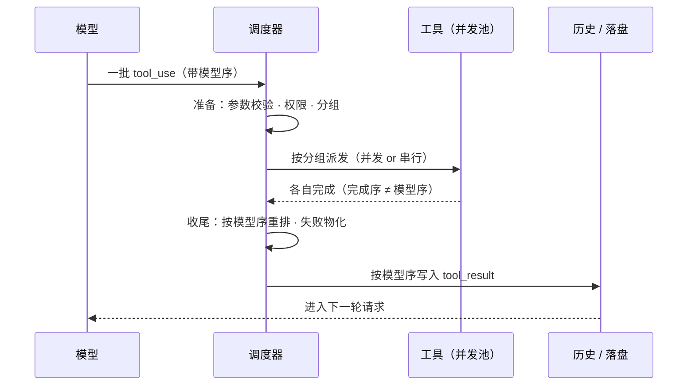

# 第 2 章：工具调用 —— 从模型吐出 tool_use 到结果安全回灌

本章追踪模型输出的 `tool_use` 块如何被**安全、保序、可观测**地变成 `tool_result`。四个项目的骨架高度一致——「准备 → 执行 → 收尾」加四条铁律——**真正的差距在并发模型的成熟度**：从批级二元，到池 + 独占屏障，到读写锁，再到连续段分区加流式投机执行。

> **本层定位**：L2，把模型输出的 `tool_use` 块，安全、保序、可观测地变成 `tool_result`。
>
> **前置依赖**：01（主循环收齐一批 tool_use 之后调入本层）。
>
> **分析对象**：
> - **pi** —— `packages/agent/src/agent-loop.ts`（prepare/execute/finalize 三段式）
> - **deepseek-harness** —— `packages/core/agent-loop/src/tool-calls.ts` + `core/tools/src/index.ts`（四阶段调度器）
> - **codex** —— `codex-rs/core/src/tools/{parallel,router}.rs` + `session/turn.rs`（读写锁 + `FuturesOrdered`）
> - **Claude-Code** —— `src/services/tools/{toolExecution,toolOrchestration}.ts` + `src/utils/StreamingToolExecutor.ts` + `src/utils/permissions/permissions.ts`

---

## 一、核心结论速览

1. **四家骨架完全共识**：`准备 → 执行 → 收尾`，加上四条铁律——**并发执行但按模型序落盘**、**失败物化为结果不抛穿**、**取消要补合成结果**、**执行与展示解耦**。
2. **差异全在并发模型的成熟度**：pi 是**批级二元**（整批并行或整批串行）→ dsh 是**池 + 独占屏障**（唯一把并发做完整的）→ codex 是**读写锁**（read 并发 / write 互斥）→ Claude-Code 是**连续段分区 + 流式投机执行**。
3. **只有 Claude-Code 做「流式投机执行」**：模型还没输出完，工具就开始跑（`StreamingToolExecutor.addTool` `:76`），并配套了 fallback 撤销机制（tombstone 作废孤儿消息）。
4. **保序机制四家四种解法**：pi 用「预准备阶段已确定顺序」（并发前序列化）；dsh 用「连续模型序栅栏」`commitReady`（`:147`）；codex 用「FuturesOrdered 完成序 + 上层重建」；CC 用「按插入序遍历 + 遇到未完成的非并发工具即 break」（`:412-440`）。
5. **权限系统只有 Claude-Code 把它做成调用流程的一等阶段**：7 级判定链（`permissions.ts:1158`），且明确「hook allow 不越权绕过 deny/ask 规则」（`toolHooks.ts:332`、`:372-405`）——其余三家只有简单的执行前拦截点。

---

## 二、本层职责与边界

### 2.1 本层解决什么问题

| 职责 | 具体问题 | 四家分歧 |
|---|---|---|
| **① 准备** | 工具存在吗？参数合法吗？允许执行吗？ | 准备与执行是否分离、拦截点的位置与数量 |
| **② 执行** | 并发还是串行？并发上限？ | 批级二元 / 池+屏障 / 读写锁 / 连续段分区 |
| **③ 保序** | 并发结果怎么按模型序落盘？ | 预序列化 / 栅栏 / 完成序重建 / 插入序遍历 |
| **④ 物化** | 失败、拒绝、取消怎么变成 tool_result？ | 全部 catch / 不伪造 / 类型级升级 / 四路径分类 |
| **⑤ 呈现** | 进度与结果怎么给 UI？ | 回调 / meta 载荷 / 流式输出 / Progress 通道 |

### 2.2 层次定位

```text
┌─────────────────────────────────────────────────────────┐
│ L2 工具调用（本章）                                     │
│ 把 tool_use 变成 tool_result                            │
│ 四条铁律：并发执行 · 按模型序落盘 · 失败物化 · 取消补全 │
└────────────────────────────┬────────────────────────────┘
                             │ 需要向四处取答案
             ┬───────────────┼───────────────┬───────────────┬
             ▼               ▼               ▼               ▼
          L3 定义        L6 持久化      取消 / 中断     权限与沙箱
         能并发吗        落盘顺序        如何传播       （后续章）
```

**图 2-1**：L2 在运行时栈中的位置。「这个工具能否与其他工具并发」在调用层被使用，但答案来自定义层（L3）——这是本系列里最典型的一处跨层耦合。

```text
        ┌─────── L1 主循环（收集 tool_use） ────────────────────────┐
        │ toolUseBlocks[]（严格保持模型输出顺序）                   │
        └─────────────────────────────┬─────────────────────────────┘
                                      │
        ┌─────────────────────────────▼─────────────────────────────┐
        │  L2 工具调用调度（本篇）                                  │
        │  ①准备：查找 → 解析 → 校验 → 权限 → 前置 hook             │
        │  ②执行：并发池 / 屏障 / 锁 + 中止令牌                     │
        │  ③保序：按模型序落盘                                      │
        │  ④物化：失败 / 拒绝 / 取消 → tool_result                  │
        │  ⑤呈现：进度通道（与执行解耦）                            │
        └────────┬─────────────┬─────────────┬─────────────┬────────┘
                 │             │             │             │
           ┌─────▼─────┐ ┌─────▼─────┐ ┌─────▼─────┐ ┌─────▼─────┐
           │ L3 工具   │ │ 权限 /    │ │ L5 会话   │ │ L1 主循环 │
           │ 实现      │ │ hook      │ │ 日志      │ │ （续跑）  │
           └───────────┘ └───────────┘ └───────────┘ └───────────┘
```

### 2.3 四家边界差异

| 边界问题 | pi | dsh | codex | Claude-Code |
|---|---|---|---|---|
| 有无「调度器」概念 | 无（函数） | **有**（`ToolRuntimeScheduler`） | 有（`ToolRouter` + runtime） | 有（`partitionToolCalls` + executor） |
| 准备与执行是否分离 | 是（prepare/execute） | 是（prepare/dispatch） | 是（build/dispatch） | 是（校验/执行） |
| 结果何时落盘 | 一批结束后逐条 | 槽位就绪即落（栅栏） | 流结束后统一 drain | 完成即 yield（流式） |

---

## 三、概念对齐表

| 概念 | pi | deepseek-harness | codex | Claude-Code |
|---|---|---|---|---|
| 调度入口 | `executeToolCalls` `agent-loop.ts:505` | `executeToolCalls` `tool-calls.ts:60` | `dispatch_tool_call_with_state` `router.rs:323` | `runTools` / `StreamingToolExecutor` `toolOrchestration.ts:19` |
| 准备阶段 | `prepareToolCall` `:703` | `scheduler.prepare()` `tool-calls.ts:153` | `build_tool_call` `router.rs:244` | `checkPermissionsAndCallTool` `toolExecution.ts:599` |
| 执行阶段 | `executePreparedToolCall` `:773` | `scheduler.dispatch()` `:154` | `handle_tool_call` `parallel.rs:76` | `tool.call(...)` `toolExecution.ts:1207` |
| 收尾阶段 | `finalizeExecutedToolCall` `:816` | `scheduler.finalize()` `:170` / `finish()` `:174` | `notify_tool_finish` | `addToolResult` `:1403` + PostToolUse hooks `:1483` |
| 并发判定 | `executionMode === "sequential"` `:513-519` | `executionMode(exec)` → `isConcurrencySafe`（fail-closed） | `tool_supports_parallel` `router.rs:233` | `isConcurrencySafe(input)` `Tool.ts:402`（默认 `false` `:759`） |
| 并发上界 | 无（整批 Promise.all） | `maxParallelToolCalls` `tool-calls.ts:214` | 无显式上界（每调用一 task） | `CLAUDE_CODE_MAX_TOOL_USE_CONCURRENCY` 默认 10 `toolOrchestration.ts:8-12` |
| 独占语义 | 整批降级为串行 | 独占屏障（drain 池后独占） | `write` 锁（与全体互斥） | 非安全工具单独成批（串行） |
| 保序机制 | 预准备保序 `:643-651` | 连续模型序栅栏 `commitReady` `:147` | FuturesOrdered `turn.rs:2502` + drain `:3041` | 插入序遍历 `getCompletedResults` `:412-440` |
| 失败物化 | 错误 toolResult | 合成 `ABORTED_BEFORE_DISPATCH` `:238-243` | `RespondToModel` / `Fatal` | 四路径 → `is_error` tool_result |
| 前置拦截 | `beforeToolCall` 回调 | `tools/pre-execute` 瀑布 + guard | `PreToolUseHook` | `runPreToolUseHooks` + `resolveHookPermissionDecision` |
| 权限确认 | 无内建 | `approval(ask → serviceAsk)` | 工具内 handler 审批 | 7 级判定链 + 交互确认对话框 |
| 取消补结果 | `"Operation aborted"` | `ABORTED_BEFORE_DISPATCH` | `aborted_response`（带耗时） | 合成 tool_result `:1015-1052` |
| 进度通道 | `onUpdate` 回调 | 结果 `meta` 载荷 | `FunctionCallOutput` 流式 | `Progress` 通道 + `pendingProgress` `:366-378` |
| 展示解耦方式 | 事件流 | 日志 + meta 重放 | 事件 + trace | `renderTool*` 接口方法 |

---

## 四、逐项目实现



**图 2-2**：三段式调度与保序落盘的时序。「完成序 ≠ 模型序」是这一层唯一真正的难点：并发提高吞吐，但写回历史必须还原模型给出的顺序，否则转录不可重放。

### 4.1 pi —— 三段式 + 批级终止判定

#### 4.1.1 调度入口与并发选择

```ts
// packages/agent/src/agent-loop.ts:505
async function executeToolCalls(currentContext, assistantMessage, config, signal, emit) {
  // :513-519
  const hasSequentialToolCall = toolCalls.some((tc) => ...executionMode === "sequential");
  if (config.toolExecution === "sequential" || hasSequentialToolCall)
    return executeToolCallsSequential(...);     // :527
  return executeToolCallsParallel(...);         // :583
}
```

**批级二元**：只要批内有任意一个 sequential 工具，**整批串行**。没有「部分并行」的概念——这是四家中最粗的并发粒度，换来的是实现最简单。

#### 4.1.2 三段式职责

| 段 | 做什么 | 锚点 |
|---|---|---|
| prepare | 查工具 → 工具不存在则立即产生 error result；`prepareArguments` 改写参数 → `validateToolArguments` 校验 → `beforeToolCall` 回调（可 block） | `:703` |
| execute | 并发 `Promise.all`，每个执行可 `onUpdate` 推流式进度 | `:773` |
| finalize | 结果按模型顺序 `createToolResultMessage` → emit | `:816` |

**关键点**：prepare 阶段是**同步防线**（顺序执行），所有校验与拦截都在这层完成；只有确认可执行的调用才进入并发执行阶段。

#### 4.1.3 保序与批终止

```ts
// :643-651 —— 并发后按下标顺序收尾并串行 emit
const orderedFinalizedCalls = await Promise.all(finalizedCalls.map((entry) => ...));
for (const finalized of orderedFinalizedCalls) { ...; messages.push(toolResultMessage); }
// :685
function shouldTerminateToolBatch(finalizedCalls) { /* 所有结果 terminate === true 才整批终止 */ }
```

`terminate` 是 pi 独有的「单工具结果能终止整轮」通道：由 `afterToolCall` 回调设置，解决「工具发现任务已无意义，应直接结束」的场景。

---

### 4.2 deepseek-harness —— 四阶段调度器 + 池/屏障混合

#### 4.2.1 调度器接口显式化

```ts
// packages/core/tools/src/index.ts:455-470
export interface ToolRuntimeScheduler {
  prepare(...); dispatch(...); finalize(...); finish(...);
}
export const TOOL_RUNTIME_SCHEDULER: unique symbol
```

**这是四家中唯一把「调度器」定义成可替换接口的**。调度器只管**并发与保序**，所有策略（校验、审批、guard、结果改写）都在工具注册表内。`tool-calls.ts:153/154/170/174` 四处消费这四个阶段。

#### 4.2.2 分组：每次重新评估

```ts
// packages/core/agent-loop/src/tool-calls.ts:89-94
const mode = ctx.tools.executionMode(first.exec).kind;
const group = mode === 'parallel' ? planned.slice(next) : [first];   // exclusive → 单元素组（屏障）
```

**比 pi 精细的地方**：分组时**逐个重新查询** `executionMode`，因此工具注册表在运行时变化（作用域 shadowing、限制生效）会实时反映到并发调度（`fillPool` `:199-214` 中若下一调用被重分类为非 parallel，立即停止补充形成新屏障）。

#### 4.2.3 并发池与保序栅栏

```ts
// :199-214
while (!aborted && nextToStart < group.length && inFlight.size < maxParallelToolCalls) {
  startCall(nextToStart++)
}
// :219-236
const settledIndex = await Promise.race(inFlight.values())
...
catch { schedulerFailure ??= { error }; await Promise.allSettled(inFlight.values()); throw schedulerFailure.error }
// :147
// `committed` advances only across contiguous model-order slots.   ← 源码注释
```

**三层并发语义**（唯一做完整的）：
```text
parallel（可入池，受上限）
  → exclusive（屏障：drain 池后独占执行，之后再恢复池）
  → 调度器失败（不伪造结果，抛第一个错）
```

#### 4.2.4 失败 / 取消物化

```ts
// :238-243 —— 失败或 abort 时，剩余未启动调用补合成结果
for (const call of group.slice(started)) appendSkippedToolCall(...);   // :250
return { consumed: group.length, aborted: true, concluded }
```

`appendSkippedToolCall` 生成 `ABORTED_BEFORE_DISPATCH` 结果——**目的不是给模型看，而是保证日志回放完备**（每个 tool/call 都有对应的 tool/result，回放时不会出现悬空引用）。

---

### 4.3 codex —— 流式不打断 + 读写锁 + FuturesOrdered

#### 4.3.1 工具调用完全不打断响应流

```rust
// codex-rs/core/src/session/turn.rs 的流式循环中
ResponseEvent::OutputItemDone(item) => {
    match ToolRouter::build_tool_call(item) {
        Ok(Some(call)) => {
            // 持久化 call → 包装成 InFlightFuture → 入队
            in_flight.push_back(tool_future);        // :2680
            needs_follow_up = true;
        }
        ...
    }
    // 流继续（工具执行不阻塞接收）
}
// 流结束
drain_in_flight(&mut in_flight, ...).await;          // :3041
```

**这是四家中唯一让工具执行与模型输出真正重叠的设计**（Claude-Code 也做了，但走的是独立的 `StreamingToolExecutor` 组件）。`FuturesOrdered` 定义在 `turn.rs`（导入 `:129`、实例化 `:2502`、`drain_in_flight` `:2395`），**不在 `parallel.rs`**。

#### 4.3.2 并发门：读写锁

```rust
// codex-rs/core/src/tools/parallel.rs:43/53/62
parallel_execution: Arc<RwLock<()>>
// :191-195
let guard = if supports_parallel { Either::Left(lock.read().await) }
            else { Either::Right(lock.write().await) };
// :183  每个调用独立 task
let mut dispatch_handle = AbortOnDropHandle::new(tokio::spawn(async move { ... }));
```

**语义**：`read` 锁 = 可并行（`tool_supports_parallel` 为真），`write` 锁 = 与全体互斥。用 Rust 的 `RwLock` 天然实现了 dsh 手工搭建的「池 + 屏障」，但**没有池上限**——并发度等于模型一次输出的工具数。

`AbortOnDropHandle` 保证 task 被 abort 或 drop 时不会泄漏。

#### 4.3.3 取消

```rust
// parallel.rs:237-243
_ = cancellation_token.cancelled() => {
    abort_dispatch_span.record("aborted", true);
    dispatch_handle.abort();
}
```

取消即 abort task，产生 `aborted_response`（文案带耗时：「aborted by user after Xs」）。**已完成的生命周期不重写**（`terminal_outcome_reached` 检查，有专门测试 `cancellation_after_handler_finishes_preserves_completed_lifecycle`）。

---

### 4.4 Claude-Code —— 连续段分区 + 流式投机执行 + 7 级权限链

#### 4.4.1 完整链路（12 步）

| # | 步骤 | 函数 | 锚点 |
|---|---|---|---|
| 1 | 流式 tool_use 入队 | `StreamingToolExecutor.addTool` | `StreamingToolExecutor.ts:76` |
| 2 | 工具查找（含 alias 回退） | `findToolByName` | `Tool.ts:358` / `toolExecution.ts:350` |
| 3 | 单工具执行入口 | `runToolUse` | `toolExecution.ts:337` |
| 4 | 流式包装 | `streamedCheckPermissionsAndCallTool` | `:492` |
| 5 | 校验 + 权限 + 调用主体 | `checkPermissionsAndCallTool` | `:599` |
| 6 | zod 输入校验 | `inputSchema.safeParse` | `:615` |
| 7 | 工具级校验 | `tool.validateInput` | `:683` |
| 8 | PreToolUse hooks | `runPreToolUseHooks` | `:800` → `toolHooks.ts:435` |
| 9 | 权限决策（含 hook 合流） | `resolveHookPermissionDecision` | `toolHooks.ts:332` |
| 10 | 通用权限 | `hasPermissionsToUseTool` | `useCanUseTool.tsx:32` → `permissions.ts:473` |
| 11 | 实际执行 + 进度回调 | `tool.call(...)` | `:1207` |
| 12 | PostToolUse hooks + 结果映射 | `runPostToolUseHooks` / `addToolResult` | `:1483` / `:1403` |

结果回灌：`toolResults.push(...normalizeMessagesForAPI)`（`query.ts:1395`）→ 下一轮 `[...messagesForQuery, ...assistantMessages, ...toolResults]`（`:1716`）。

#### 4.4.2 并发：连续段分区（非批级二元）

```ts
// src/services/tools/toolOrchestration.ts:91-116
if (isConcurrencySafe && acc[acc.length - 1]?.isConcurrencySafe) {
  acc[acc.length - 1]!.blocks.push(toolUse)      // 并入上一批（连续段才合并）
} else {
  acc.push({ isConcurrencySafe, blocks: [toolUse] })   // 否则新开一批
}
```

**比 pi 精细**：pi 是「批内有 sequential 就整批串行」；CC 是「**连续的** concurrency-safe 工具才合并成一批」，非安全工具单独成批。因此 `[Read, Read, Bash, Read]` 会切成 `[Read,Read]（并发）→[Bash]（串行）→[Read]（并发）`，而 pi 会把整批降级成串行。

- 安全批 → `runToolsConcurrently`（`:152`），上限 `getMaxToolUseConcurrency()` 默认 10（`:8-12`），底层是 Promise.race 池（`generators.ts:32-72`）。
- 非安全批 → `runToolsSerially`（`:118`）。

#### 4.4.3 流式投机执行器

```ts
// src/utils/StreamingToolExecutor.ts
canExecuteTool()   // :129  规则：无正在执行者，或自身安全且所有执行者都安全
processQueue()     // :140-151  遇到不可并发工具即 break
getCompletedResults()  // :412-440  按 this.tools 插入顺序遍历；遇 executing && !isConcurrencySafe 即 break
```

**独有能力**：模型一边输出，工具一边开始执行。因此：
- **进度不阻塞顺序**：`pendingProgress` 立即 yield（`:419-422`）；
- **必须处理 fallback**：若模型流在工具执行中途失败（`streaming_fallback`），已执行的结果必须作废——由 query 侧 tombstone 完成（`query.ts:712-741`）；
- **兄弟取消**：`siblingAbortController`（`:48`）是 query 控制器的子；每个工具再派生 `toolAbortController`（`:301`），其 abort 会冒泡（`:304-318`），**除非 reason 为 `sibling_error`**。

#### 4.4.4 取消语义：5 类 reason

```ts
// :210
getAbortReason()   // 区分 sibling_error / user_interrupted / streaming_fallback / ...
// :354-364  Bash 出错会取消兄弟工具
```

**唯一把「哪个工具失败要级联取消兄弟」做成工具属性的实现**：Bash 失败级联（因为 shell 命令常有依赖），Read/WebFetch 不级联（独立的只读操作）。`signal.reason === 'interrupt'` 时仅取消 `interruptBehavior() === 'cancel'` 的工具（`Tool.ts:416`，默认 `block`）。

#### 4.4.5 权限：7 级判定链

```ts
// src/utils/permissions/permissions.ts:1158
hasPermissionsToUseToolInner() {
  // :1163  abort 检查
  // :1171  整工具 deny 规则
  // :1184  整工具 ask 规则（sandbox auto-allow 例外）
  // :1216  工具自实现 tool.checkPermissions
  // :1226-1260  工具 deny / 内容级 ask / safetyCheck → 优先返回
  // :1268-1281  模式旁路（bypassPermissions / plan+available）
  // :1284  整工具 allow 规则
  // :1300  passthrough → ask
}
```

**优先级明确**：`deny > 内容级 ask/safetyCheck > mode bypass > allow 规则 > passthrough→ask`。

模式（`PermissionMode.ts:42-91`）：`default` / `plan` / `acceptEdits` / `bypassPermissions` / `dontAsk`（+ `[门控]` 的 `auto`）。

**hook 与规则的合流**（`toolHooks.ts:332` `resolveHookPermissionDecision`）： hook 说 allow **不能**绕过 deny/ask 规则——仍会调用 `checkRuleBasedPermissions`（`permissions.ts:1071`），deny 覆盖、ask 仍弹窗（`toolHooks.ts:372-405`）。**理由**（`[推断]`）：hook 来自用户配置（可能被提示注入影响），而规则是显式的用户策略，后者优先级必须更高。

**用户交互**（`interactiveHandler.ts:57`）：对话框 → `onAllow`（`:154`）/`onReject`（`:183`），经 `claim()` 原子抢占后 `resolveOnce`（防重复响应）。

#### 4.4.6 拒绝与错误如何回灌

**拒绝**（`toolExecution.ts:995-1071`）：构造 `is_error: true` 的 tool_result，并**附加拒绝的图片 block（顶层而非 tool_result 内）**；auto 模式 classifier 拒绝可触发 `executePermissionDeniedHooks`，`retry: true` 时追加「可重试」提示（`:1075-1101`）。

**错误四路径**（均 `is_error: true`）：

| 路径 | 锚点 | 文案 |
|---|---|---|
| 未知工具 | `:369-411` | `<tool_use_error>Error: No such tool available: ...</tool_use_error>` |
| zod 校验失败 | `:616-680` | `formatZodValidationError`（`toolErrors.ts:66`）人类可读信息 |
| `validateInput` 失败 | `:687-733` | `message` + `errorCode` |
| 执行抛错 | `:1691-1737` | `formatError`（`toolErrors.ts:5-22`） |

```ts
// :1691-1737 执行抛错的核心
const content = formatError(error)
const isInterrupt = error instanceof AbortError
for await (const hookResult of runPostToolUseFailureHooks(...)) hookMessages.push(hookResult)
return [{ message: createUserMessage({ content: [{ type: 'tool_result', content, is_error: true, tool_use_id: toolUseID }] ... }) }, ...hookMessages]
```

`formatError`：`AbortError` → 中断文案；`ShellError` → 拼 `Exit code + stderr + stdout`；超 10000 字符做**首尾截断**。

**注意**：工具错误本身**不自动重试**（回灌给模型由其决定）。模型层高负载走 fallback model（`query.ts:922`），且会 `streamingToolExecutor.discard()` + 重建 executor 以防孤儿 tool_result（`:910-917`）。

#### 4.4.7 进度与展示解耦

执行侧只暴露回调：`ToolCallProgress<P>`（`Tool.ts:338`）、`Progress = ToolProgressData | HookProgress`（`:305`）。进度经 `streamedCheckPermissionsAndCallTool` 的 `Stream` 合并进结果流（`toolExecution.ts:509-569`），用 `createProgressMessage` 包装（`:550`）。

流式执行器把 `type === 'progress'` 存入 `pendingProgress` 并唤醒 `progressAvailableResolve`（`:366-378`），`getRemainingResults` 用 `Promise.race([...executingPromises, progressPromise])` 等待（`:477-483`）。

展示侧：`filterToolProgressMessages` 过滤 hook 进度（`Tool.ts:312`）；`renderToolUseProgressMessage` 适配器（`AssistantToolUseMessage.tsx:328-359`）在未 resolve / 未排队 / 非等待权限时渲染；**渲染函数全部 try/catch 兜底，渲染失败不影响执行**。

---

## 五、横向对比矩阵

### 5.1 调度骨架

| 维度 | pi | dsh | codex | Claude-Code | 共识度 |
|---|---|---|---|---|---|
| 三段式 | 显式 prepare/execute/finalize | prepare/dispatch/finalize/finish（四段） | build/dispatch/finish | 校验/权限/执行/hook 四段 | **4/4 分离** |
| 调度器是否可替换 | ✗（函数） | ✓ `TOOL_RUNTIME_SCHEDULER` | ✗（router 固定） | ✗ | 1/4 |
| 阶段数 | 3 | 4 | 3 | 4 | 2/4 |

### 5.2 并发模型

| 维度 | pi | dsh | codex | Claude-Code | 共识度 |
|---|---|---|---|---|---|
| 粒度 | 批级二元 | 池 + 独占屏障 | 读写锁 | 连续段分区 | 0/4 |
| 并发上限 | 无 | `maxParallelToolCalls` | 无 | 默认 10（可配） | 2/4 |
| 运行时重分类 | ✗ | ✓（每次重新评估） | ✗（step 快照） | ✗（批内固定） | 1/4 |
| 独占实现 | 整批降级 | drain 池后独占 | write 锁 | 单独成批 | 0/4 |

### 5.3 保序机制

| 维度 | pi | dsh | codex | Claude-Code | 共识度 |
|---|---|---|---|---|---|
| 机制 | 预准备保序 | 连续序栅栏 | 完成序 + 上层重建 | 插入序遍历 + break | 0/4 |
| 保序保证强度 | 强（顺序在并发前确定） | 强（显式栅栏断言） | 中（依赖 drain 逻辑） | 强（结构性） | — |
| 是否可测 | 难 | 易（有 `tool-order.spec`） | 中（有 parallel.rs 测试） | 中 | — |

### 5.4 准备期校验与拦截

| 维度 | pi | dsh | codex | Claude-Code | 共识度 |
|---|---|---|---|---|---|
| 参数校验 | TypeBox `validateToolArguments` | `validateArgs` + 软校验降级 | `build_tool_call`（serde + payload 类型校验） | zod `safeParse` + `validateInput` | **4/4** |
| 非法 JSON 处理 | 报错 | **保留原文交工具自判** `parseArguments` | 报错 | 报错 + 人类可读提示 | 1/4 |
| 前置拦截 | `beforeToolCall`（可 block） | `tools/pre-execute` 瀑布 + guard | `PreToolUseHook`（Blocked / 改写 input） | `runPreToolUseHooks` + 7 级权限链 | **4/4** |
| 拦截能否携带终止信号 | ✓ `terminate` | ✓ `concludesTurn` | 由 stop hooks 决定 | ✗（无工具级终止） | 2/4 |

### 5.5 取消语义

| 维度 | pi | dsh | codex | Claude-Code | 共识度 |
|---|---|---|---|---|---|
| 取消分类 | 无（裸 signal） | **4 类**（user/parent/hook/disposed） | `TurnAborted` | **5 类**（含 sibling_error / streaming_fallback） | 2/4 |
| 已启动调用 | drain 完再标 aborted | **不 abandon，drain 到 quiescence** | abort task | 兄弟可级联取消 | 2/4 |
| 未启动调用 | 补 `Operation aborted` | 补 `ABORTED_BEFORE_DISPATCH` | — | 合成 tool_result | 3/4 |
| 已完成生命周期不重写 | — | ✓ | ✓（有测试） | ✓ | 2/4 |

### 5.6 失败物化

| 维度 | pi | dsh | codex | Claude-Code | 共识度 |
|---|---|---|---|---|---|
| 工具不存在 | 错误 result | `UNKNOWN_TOOL` result | `RespondToModel` | `is_error` result | **4/4 不中断** |
| 参数非法 | 错误 result | 错误 result（保留原文） | payload 类型不符 → **Fatal** | 错误 result | 3/4 |
| 执行抛错 | 错误 result | 错误 result | 错误 result | 错误 result + 首尾截断 | **4/4** |
| 调度器自身失败 | — | **抛错不伪造** | — | — | 1/4 |
| 错误后是否继续 | 是 | 是 | 是 | 是 | **4/4** |

### 5.7 执行与展示解耦

| 维度 | pi | dsh | codex | Claude-Code | 共识度 |
|---|---|---|---|---|---|
| 进度通道 | `onUpdate` 回调 | 结果 `meta` | `FunctionCallOutput` 流 | `Progress` 消息 `:366-378` | **4/4 有通道** |
| 防执行后补推 | `acceptingUpdates` | — | — | `pendingProgress` 状态机 | 2/4 |
| 展示函数隔离 | 事件流消费者 | UI bridge 纯函数 | 事件消费者 | `renderTool*` 方法 + try/catch | 2/4 |

---

## 六、异常与降级

### 6.1 单个工具执行失败

- **pi**：prepare/execute 全 catch → `createErrorToolResult`，**零逃逸**（`:703`/`:773`/`:816`）。
- **dsh**：dispatch catch → 错误 result；但**调度器自身失败不伪造结果**（`tool-calls.ts:219-236` 注释 `[注释]`）。
- **codex**：`RespondToModel`（写回 transcript，不执行）或 `Fatal`（类型级）。
- **Claude-Code**：四路径分类 + `formatError` 截断（超 10000 字符首尾截断）+ PostToolUseFailure hooks。

**设计理由**（`[注释]` dsh）：伪造结果会让模型基于假信息继续，可能造成死循环——「宁可让循环退出，也不给模型假数据」。

### 6.2 兄弟工具失败（一个失败，其余要不要取消）

| 项目 | 行为 |
|---|---|
| pi | **不级联**（各工具独立，全部执行完） |
| dsh | 池中某调用失败 → 记录 `schedulerFailure`，`allSettled` 排空后抛错（`:219-236`） |
| codex | **不级联**（各 task 独立） |
| Claude-Code | **Bash 失败级联取消兄弟**（`:354-364`），Read/WebFetch 不级联 |

**设计理由**（`[推断]`）：CC 的做法最贴近实际——shell 命令间常有隐含依赖（`mkdir && cd`），一个失败后继续跑其余命令会产生误导性输出；而只读操作之间无依赖，取消反而浪费。

### 6.3 用户中断（工具执行期间）

- **pi**：`:572`/`:610`/`:617`/`:638`/`:732`/`:751` 六处检查，未执行调用物化为 `"Operation aborted"`。
- **dsh**：已启动 **drain 到 quiescence 再标 ABORTED**（不 abandon）；未启动补 `ABORTED_BEFORE_DISPATCH`。
- **codex**：`dispatch_handle.abort()`（`:243`），产生 `aborted_response`。
- **Claude-Code**：`getRemainingResults` 生成合成 tool_result（`query.ts:1015-1052`），保证 API 配对。

**设计理由**（`[注释]` 强制约束）：Anthropic API **强制要求** `tool_use` 与 `tool_result` 严格一一配对，缺一个直接 400。因此 `ensureToolResultPairing`（`utils/messages.ts:5133`，在 `claude.ts:1301` 调用）是最后一道兜底。

### 6.4 输出截断导致参数不完整

- **pi**：`stopReason === "length"` → **整批工具不执行**，全部物化为失败（`:263-269`）。
- **dsh**：参数照常解析（保留非法原文），工具照常执行。
- **codex**：转 mid-turn compact。
- **Claude-Code**：无特殊处理（走 zod 校验失败路径）。

**设计理由**（`[推断]`）：pi 最保守，因为被截断的 JSON 参数可能「看起来合法但语义残缺」（比如 `path` 写了一半却仍是合法字符串），执行风险高于重发成本。

### 6.5 工具执行超时

- **pi**：无内建（工具自己实现）。
- **dsh**：无内建。
- **codex**：无内建。
- **Claude-Code**：`BashTool` 独有——`timeoutMs`（`BashTool.tsx:860`），超时且允许自动后台则 `onTimeout → startBackgrounding`（`:965-971`）；显式 `run_in_background: true` → `spawnBackgroundTask`（`:989`）；assistant 模式超预算自动后台（`:976-983`）。

**设计理由**（`[注释]`）：只有 CC 做了超时→后台转换，因为长命令（构建、测试）是真实高频场景，直接杀进程会丢失工作成果。

### 6.6 工具调用数量失控

- **pi**：无上限。
- **dsh**：`maxParallelToolCalls` 限制并发，无总量上限。
- **codex**：`active_turn.tool_calls` 计数（防失控）。
- **Claude-Code**：并发上限 10，`maxTurns` 兜底（`query.ts:1705-1712`）。

### 6.7 参数非法 JSON（流式中断产生的半截 JSON）

- **pi / codex / Claude-Code**：解析失败即报错。
- **dsh**：`parseArguments` catch → **返回 raw string 交给工具自判**（`[注释]`：模型可能在合法 JSON 流式中断时产生半截参数，保留原文比直接报错更鲁棒）。

### 6.8 执行与展示的失败隔离

- **Claude-Code**：渲染函数全部 try/catch 兜底（**渲染失败不影响执行**）；`filterToolProgressMessages` 隔离 hook 进度（`Tool.ts:312`）。
- **其余三家**：展示层通过事件流 / 日志消费，天然不侵入执行路径。

**设计理由**（`[推断]`）：CC 作为交互式产品，UI 组件（React 渲染）出错概率显著高于后端逻辑；把渲染异常隔离掉是必要的健壮性投资。

---

## 七、设计建议

### 7.1 共识（可直接采纳）

1. **三段式骨架**：准备（校验+权限+拦截）→ 执行（可并发）→ 收尾（物化+落盘）。**准备阶段必须顺序执行**，它是并发前的唯一防线。
2. **结果按模型序落盘**：硬约束，任何并发方案都必须满足。
3. **失败一律物化为 tool_result，不抛穿主循环**。唯二例外：调度器结构性失败、参数类型级错误。
4. **执行前拦截点必须可拒绝**（block），最好也能改写参数。
5. **取消时未启动的调用要补合成结果**，保证会话历史完整（对 Anthropic API 是硬要求）。
6. **执行与展示解耦**：执行侧只暴露进度回调，渲染逻辑不进入执行路径。

### 7.2 推荐（按收益排序）

1. **并发用「池 + 独占屏障」**（学 dsh）：既保吞吐又保顺序依赖，且能在运行时重新分类。批级二元（pi）在混合工具场景下退化为串行，吞吐损失大。
2. **并发上限可配**（学 dsh/CC）：默认 10 左右，避免一次几十个工具调用打爆资源。
3. **失败物化要分类型**（学 CC 四路径）：未知工具 / 参数非法 / 权限拒绝 / 执行失败给出不同文案与 `errorCode`，模型才能正确纠错。
4. **取消原因分类**（学 dsh/CC）：至少在日志里记录 `user_interrupted` / `sibling_error` / `streaming_fallback`，否则无法定位「为什么工具没跑」。
5. **`completed` 生命周期不重写**（学 codex）：取消竞态下已完成的结果必须保持原样，需要显式检查 + 测试覆盖。
6. **参数非法 JSON 保留原文交工具自判**（学 dsh）：比表面鲁棒性更实用。
7. **工具级「终止整轮」通道**（学 pi 的 `terminate`）：让工具能声明「任务已无意义」。

### 7.3 权衡

1. **流式投机执行（CC 路线）值不值得**：收益是首工具延迟降低一个流式往返；代价是必须实现 fallback 撤销（tombstone + 执行器重建）和更复杂的保序。**只有当工具延迟远大于模型输出延迟时才值得**（编码场景符合）。
2. **并发上限 vs 无上限**：有上限更安全但会排队；无上限（codex）最快但依赖模型自律。
3. **权限做多细**：CC 的 7 级链是商业产品必需（多用户、可审计）；内部工具 2~3 级即可。
4. **超时→后台转换**：只有长命令场景需要；否则增加状态复杂度。

### 7.4 反例

1. **不要在并发结果上依赖完成顺序**。四家都在保序上花了力气；如果图省事直接用完成序，工具输出与调用错位会导致模型彻底混乱。
2. **不要用「统一错误文案」覆盖所有失败**（对照 CC 的四路径）。模型无法区分「工具不存在」与「参数写错」，会陷入无效重试。
3. **不要让 hook 的 allow 覆盖显式 deny 规则**（对照 `toolHooks.ts:372-405`）。hook 可被间接控制（提示注入），显式策略必须优先。
4. **不要在渲染层抛错影响执行**。UI 崩溃不能导致工具结果丢失。
5. **不要伪造调度器失败的结果**（对照 dsh 注释）。假结果会让模型基于错误前提继续，且污染日志回放。

---

## 附录：关键文件索引

### pi

| 文件 | 行号 | 用途 |
|---|---|---|
| `packages/agent/src/agent-loop.ts` | 505 | `executeToolCalls` 入口 |
| `packages/agent/src/agent-loop.ts` | 513-519 / 527 / 583 | 并发选择、串行实现、并行实现 |
| `packages/agent/src/agent-loop.ts` | 703 / 773 / 816 | prepare / execute / finalize 三段 |
| `packages/agent/src/agent-loop.ts` | 643-651 / 685 | 保序收尾、批终止判定 |

### deepseek-harness

| 文件 | 行号 | 用途 |
|---|---|---|
| `packages/core/agent-loop/src/tool-calls.ts` | 60 | 调度入口 |
| `packages/core/agent-loop/src/tool-calls.ts` | 89-94 / 122 / 147 | 分组、`runGroup`、`commitReady` 栅栏 |
| `packages/core/agent-loop/src/tool-calls.ts` | 165 / 199-214 / 219-236 | `startCall`、并发池、race 与失败处理 |
| `packages/core/agent-loop/src/tool-calls.ts` | 238-243 / 250 | 失败物化、`appendSkippedToolCall` |
| `packages/core/tools/src/index.ts` | 455-470 | `ToolRuntimeScheduler` 接口 + symbol |

### codex

| 文件 | 行号 | 用途 |
|---|---|---|
| `codex-rs/core/src/tools/parallel.rs` | 43 / 53 / 62 | 读写锁定义与初始化 |
| `codex-rs/core/src/tools/parallel.rs` | 76 / 124 | `handle_tool_call` / `handle_tool_call_with_source` |
| `codex-rs/core/src/tools/parallel.rs` | 183 / 191-195 / 237-243 | spawn task、读写锁语义、取消 abort |
| `codex-rs/core/src/tools/router.rs` | 233 / 239 / 244 | `tool_supports_parallel` / `tool_runtime` / `build_tool_call` |
| `codex-rs/core/src/tools/router.rs` | 300 / 323 / 346 | dispatch 三入口 |
| `codex-rs/core/src/session/turn.rs` | 129 / 2395 / 2502 / 2680 / 3041 | FuturesOrdered 导入/定义/实例化/入队/drain |

### Claude-Code

| 文件 | 行号 | 用途 |
|---|---|---|
| `src/services/tools/toolOrchestration.ts` | 8-12 / 19 / 64-79 / 91-116 / 118 / 152 | 并发上限、`runTools`、串行批、分区逻辑、`runToolsSerially`、`runToolsConcurrently` |
| `src/utils/StreamingToolExecutor.ts` | 48 / 76 / 129 / 140-151 | 兄弟控制器、`addTool`、`canExecuteTool`、`processQueue` |
| `src/utils/StreamingToolExecutor.ts` | 153-205 / 210-231 / 301-318 | 合成结果、`getAbortReason`、工具级 abort 冒泡 |
| `src/utils/StreamingToolExecutor.ts` | 354-364 / 366-378 / 412-440 / 477-483 | Bash 级联取消、进度唤醒、保序收割、race 等待 |
| `src/services/tools/toolExecution.ts` | 337 / 350 / 369-411 | `runToolUse`、alias 回退、未知工具错误 |
| `src/services/tools/toolExecution.ts` | 492 / 509-569 / 599 / 615 / 616-680 | 流式包装、进度合并、权限主体、zod 校验、zod 失败文案 |
| `src/services/tools/toolExecution.ts` | 683 / 687-733 / 800 / 995-1071 | `validateInput`、失败路径、pre hooks、拒绝回灌 |
| `src/services/tools/toolExecution.ts` | 1075-1101 / 1207 / 1403 / 1483 / 1691-1737 | 可重试提示、`tool.call`、`addToolResult`、post hooks、执行抛错 |
| `src/hooks/toolHooks.ts` | 39 / 332 / 372-405 / 435 | post hooks、权限合流、hook 不越权、pre hooks |
| `src/utils/permissions/permissions.ts` | 473 / 1071 / 1158 / 1163-1300 | 通用权限、规则检查、7 级判定链 |
| `src/Tool.ts` | 180 / 305 / 312 / 338 / 402 / 404 / 416 / 759 | abort 上下文、`Progress`、进度过滤、`ToolCallProgress`、并发/只读/中断行为/默认值 |
| `src/tools/BashTool/BashTool.tsx` | 860 / 965-971 / 976-983 / 989 | 超时、超时转后台、预算转后台、显式后台 |
