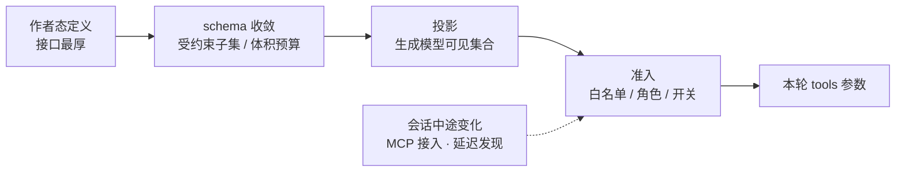

# 第 3 章：工具定义 —— 工具如何被描述、投影与准入

本章回答「一个工具是什么」：它有几个面（模型可见 / 可执行 / 可展示）、这些面如何被投影给模型、可见集合如何随会话演化。**这一层的设计决定了调用层能做什么**——例如「这个工具能否与兄弟工具并发」这个看似调用层的问题，答案其实是定义层的一个字段。

> **本层定位**：L3，回答「一个工具是什么、它有几个面（模型可见 / 可执行 / 可展示）、这些面如何被投影，以及可见集合如何随会话演化」。
>
> **前置依赖**：02（调用层的自由度由本层字段决定：能否并发、是否可见）。
>
> **分析对象**：
> - **pi** —— `packages/ai/src/types.ts`（`Tool`）+ `packages/agent/src/types.ts`（`AgentTool`）+ `packages/coding-agent/src/core/extensions/types.ts`（`ToolDefinition`/`defineTool`）+ `packages/ai/src/utils/transcript.ts`（差分投影）+ `validation.ts`（参数校验）
> - **deepseek-harness** —— `packages/core/tools/src/{schema,index,ptc}.ts`（`defineTool` / `ToolDefinition` / `ToolRuntime` / 呈现模式）
> - **codex** —— `codex-rs/tools/src/{tool_spec,tool_executor,tool_definition,responses_api,json_schema/*}.rs` + `core/src/tools/{registry,spec_plan}.rs` + `ext/extension-api/src/tool_policy.rs`
> - **Claude-Code** —— `src/Tool.ts`（`Tool` 接口 + `buildTool` 默认值）+ `src/tools.ts`（注册表与可见集合）+ `src/utils/api.ts`（投影）+ `src/tools/ToolSearchTool/*`（延迟发现）
>
> **与 第 2 章的分工**：02 讲「调用怎么调度」，本篇讲「定义怎么组织」。定义层的设计决定了调用层能做什么（例如 dsh 的 `isConcurrencySafe` 就是定义层字段）。

---

## 一、核心结论速览

1. **四家共识：一次定义、多面投影**，且「模型可见」「可执行」「可展示」三面必须**物理分离**——pi 用 `toToolDeclaration` 剥离、dsh 用白名单投影、codex 用 `#[serde(skip)]`、Claude-Code 用 `toolToAPISchema` 显式构造。
2. **只有 dsh 强制输出契约**（`ToolDefinition.output` 必填，`index.ts:223`）；其余三家输出是 `unknown`。
3. **schema 体积治理只有 codex 与 Claude-Code 落地**：codex 做**有损压缩**（5000 字节 / 深度 3 预算，`json_schema/compaction.rs:16-17`）；CC 做**延迟发现**（ToolSearch + `defer_loading`），且两者的触发思路一致——「先 defer，再压缩」。
4. **可见集合的演化机制四家四种**：pi 靠**转录差分**（`declareToolChanges` `agent-loop.ts:332`，模型可见集是回放的派生结果）；dsh 靠**分层作用域 + 白名单投影**；codex 靠**每 step 现场组装**（`spec_plan`）；CC 靠**数组注册表 + deny 规则过滤 + uniqBy 合并**（`tools.ts:271-367`）。
5. **Claude-Code 独有的两个机制**：① **`shouldDefer` + `tool_reference` 回溯**（从消息历史里扫出「模型已发现的延迟工具」，只发送已发现的，`toolSearch.ts:545-592`）；② **`fail-closed` 的并发/只读默认值**（`Tool.ts:757-769`，未声明即视为不安全/非只读）。

---

## 二、本层职责与边界

### 2.1 本层解决什么问题

| 职责 | 问题 |
|---|---|
| **① 定义** | 一个工具由哪些字段构成？（schema / 执行 / 展示 / 权限 / 并发语义） |
| **② 注册** | 工具从哪来（内置 / MCP / 扩展 / 动态 / 托管）、重名怎么办、如何撤销 |
| **③ 投影** | 怎么从完整定义算出「发给模型的那一小块」？体积超限怎么办？ |
| **④ 演化** | 会话中途工具集变了，模型怎么知道？历史怎么保持一致？ |
| **⑤ 校验** | 模型给的参数不合法时，在定义层挡还是执行层挡？ |

### 2.2 层次定位

```text
┌────────────────────────────────────────────────────────────────┐
│ 一个工具定义（作者态：字段最厚）                               │
│   name · description · inputSchema · execute() · 权限 · 渲染 … │
└────────────────────────────────────────────────────────────────┘
        │
        ├────────────────┬────────────────┐
        ▼                ▼                ▼
   模型可见面         可执行面          可展示面
   名字 / 描述        参数校验           进度与结果渲染
   JSON Schema       权限检查           折叠与摘要策略
        │                │                │
        ▼                ▼                ▼
   投影给模型          运行时调用         UI / 转录
  （体积可裁剪）      （模型看不到）    （可重放）
```

**图 3-1**：一个定义、三个面。四家在「三面必须物理分离」上是共识；分歧在于分离手段——剥离函数、白名单投影、序列化跳过、或显式构造。

```text
        ┌───────── L1 / L2 需要「模型可见 schema」与「可执行实现」 ──────┐
        └───────────────────────────────┬────────────────────────────────┘
                                        │
        ┌───────────────────────────────▼────────────────────────────────┐
        │  L3 工具定义（本篇）                                           │
        │                                                                │
        │  ┌────────────────┐   投影（白名单 / 剥离 / 压缩）             │
        │  │ 完整定义       │   ─────────────────────────────┐           │
        │  │ schema         │                                ▼           │
        │  │ execute        │                       ┌────────▼─────────┐ │
        │  │ 展示·权限·并发 │                       │  模型可见 schema │ │
        │  └────────────────┘                       └──────────────────┘ │
        │          │                                                     │
        │          └──→ 执行期策略（并发分类、超时、审批）               │
        └───────────────────────────────┬────────────────────────────────┘
                                        │
        ┌───────────────────────────────▼────────────────────────────────┐
        │  下游：L2 调度（并发分组）· 权限系统 · UI 渲染 · L5 消息       │
        └────────────────────────────────────────────────────────────────┘
```

### 2.3 四家边界差异

| 边界问题 | pi | dsh | codex | Claude-Code |
|---|---|---|---|---|
| 「完整定义」是什么 | `ToolDefinition`（三层中最厚） | `ToolDefinition`（单一类型） | `ToolExecutor` trait 实现 | `Tool` 接口 + `buildTool` 填充默认值 |
| 模型可见层 | `Tool`（`pi-ai`，最薄） | `ToolSchema` | `ToolSpec`（线格式） | `toolToAPISchema()` 的产物 |
| 投影时机 | 每轮请求前差分 | 按 scope 计算 | 每 step 组装（`spec_plan`） | 每次 API 调用前（带会话级缓存） |

---

## 三、概念对齐表

| 概念 | pi | deepseek-harness | codex | Claude-Code |
|---|---|---|---|---|
| 模型可见 schema | `Tool` `ai/src/types.ts` | `ToolSchema`（dsh-llm） | `ToolSpec`（线格式）`tool_spec.rs:22` | `toolToAPISchema()` 产物 `utils/api.ts:119` |
| 可执行契约 | `AgentTool` `agent/src/types.ts:443` | `ToolDefinition` `tools/src/index.ts:223` | `ToolExecutor` trait `tool_executor.rs:106` | `Tool.call()` `Tool.ts:379` |
| 宿主定义（最厚） | `ToolDefinition` `extensions/types.ts:455` | 同 `ToolDefinition` | `CoreToolRuntime`（`registry.rs`） | 同 `Tool`（含 render* 方法） |
| 定义工厂 | `defineTool` `extensions/types.ts:515`（纯类型恒等） | `defineTool` `schema.ts:547`（编译 + 校验包装） | `impl ToolExecutor` | `buildTool` `Tool.ts:783`（填默认值） |
| 输出契约 | ✗ | **✓ 强制** `output: {schema, render}` | `output_schema`（`#[serde(skip)]`） | ✗（`unknown`） |
| 参数 schema 载体 | TypeBox `TSchema` | 自有 DSL → JSON Schema 子集 | `JsonSchema`（`json_schema.rs:25`） | **Zod v4** → JSON Schema |
| 可见性控制 | 转录差分（`declareToolChanges`） | 分层 scope + `restrict()` `index.ts:1084` | `ToolExposure` `tool_executor.rs:51` + `ToolExposures` bitflags `:17` | `getTools()` 过滤 `tools.ts:271` |
| 上限策略 | ✗ | ✗ | `ToolPolicy.allowed_tools` `tool_policy.rs:14` | deny 规则 + `isEnabled()` |
| 延迟加载 | ✗ | `deferLoading` | `Deferred` exposure + tool_search | `shouldDefer` + `tool_reference` |
| 体积治理 | ✗ | PTC 折叠（N→1） | **有损压缩** `json_schema/compaction.rs` | defer + `MAX_MCP_DESCRIPTION_LENGTH` |
| 展示契约 | `renderCall`/`renderResult`（不进转录） | `presentCall`/`presentResult`（纯函数 + `presentationMeta`） | 无（走事件流） | `renderToolUseMessage` 等 7 个方法 |
| 重名处理 | Map 覆盖 | 层内重复抛错 + `run_code` 保留名 | `error_or_panic` + collision 记录 | `uniqBy(name)` 内置优先 `tools.ts:363` |

---

## 四、逐项目实现



**图 3-2**：定义到投影的管线。四条边都是「单向收窄」——任何一步只做减法，不做加法；「可见集合」因此永远是作者态定义的一个子集，可被审计。

### 4.1 pi —— 三层定义 + 转录差分投影

#### 4.1.1 三层定义（逐层加厚）

| 层 | 类型 | 关键字段 | 位置 |
|---|---|---|---|
| 模型可见（最薄） | `Tool` | `name` / `description` / `parameters`（TypeBox） | `ai/src/types.ts` |
| 运行时可执行 | `AgentTool extends Tool` | `+ label` / `prepareArguments?` / `execute(...)` / `replay?: "never"\|"safe"` / `executionMode?` | `agent/src/types.ts:443` |
| 宿主定义（最厚） | `ToolDefinition` | `+ promptSnippet?` / `promptGuidelines?` / `renderShell?` / `renderCall?` / `renderResult?` | `extensions/types.ts:455` |

```ts
// packages/agent/src/types.ts:443
export interface AgentTool<TParameters, TDetails> extends Tool<TParameters> {
  label: string; execute(...); replay?: "never" | "safe"; executionMode?: ToolExecutionMode
}
// packages/coding-agent/src/core/extensions/types.ts:515  —— 注意：纯类型恒等函数，无运行时逻辑
export function defineTool<TParams, TDetails, TState>(...)
```

**契约归属**：`packages/agent/src/harness/tools/` 的工具工厂（`read.ts:47`、`bash.ts:51`）返回的是 `AgentHarnessTool`；**运行时契约是 `AgentTool`**（`packages/agent/src/types.ts:443`），`ToolDefinition` 则位于 `coding-agent` 包的扩展层（`coding-agent/src/core/extensions/types.ts:455`）。降层转换由 `tool-definition-wrapper.ts` 完成（`:5` `wrapToolDefinition` / `:23` `wrapToolDefinitions` / `:36` `createToolDefinitionFromAgentTool` 反向合成）。

#### 4.1.2 转录差分投影（pi 的核心创新）

```ts
// packages/ai/src/utils/transcript.ts:123 —— 剥离非模型可见字段
export function toToolDeclaration(tool: Tool): Tool {
  // JSON 往返：丢掉 typebox symbol key 与 undefined，保证两侧可比
}
// :141
return JSON.stringify(toToolDeclaration(left)) === JSON.stringify(toToolDeclaration(right));
// :226
export function resolveTranscriptTools(messages, supportsToolAdditions): TranscriptTools
```

```ts
// packages/agent/src/agent-loop.ts:332
function declareToolChanges(context: AgentContext, pendingMessages: AgentMessage[]): AgentMessage[] {
  // :348
  (context.tools ?? []).map(toToolDeclaration),
  // 与「回放历史 system 消息得到的已知工具集」做差分 → { toolsAdded, toolsRemoved }
}
```

**机制**：每轮请求前（`:109` 初始化 / `:210` 循环内），pi 回放全部历史 system 消息得到「模型已知工具集」，再与当前 `context.tools` 做差分，把增删写进新的 system 消息。

**收益**：
- 「模型看到的工具」≡「运行时可执行集」是一个**可被断言的不变量**（源码注释明示）；
- 中途增删工具不破坏历史与 KV Cache（只有变化时才发 system 消息）。

**代价**：`declarationsEqual` 必须做精确比较，JSON 往返是为此服务的手段（`:135` 注释说明）。

#### 4.1.3 参数校验：宽容优先

`validateToolArguments`（`ai/src/utils/validation.ts:317`，辅助 `:302`）的顺序是「**先修再验**」：
`structuredClone` → 归一化可选字段的 `null` → `Value.Convert` 强转 → 对纯 JSON Schema 再补一层数值/布尔/字符串互转 → 最后 `Check`。失败时抛带**格式化路径 + 原始参数回显**的错误。

**理由**（`[推断]`）：LLM 产出的参数经常「语义正确但类型不对」（`"10"` vs `10`），宽容修复比直接报错更能推进任务。

---

### 4.2 deepseek-harness —— 强制输出契约 + 白名单投影 + PTC 折叠

#### 4.2.1 单一 ToolDefinition，但契约严

```ts
// packages/core/tools/src/index.ts:213/223/225
export interface ToolOutputDefinition { ... }
export interface ToolDefinition extends ToolSchema {
  readonly output: ToolOutputDefinition     // :225 —— 强制
  ...
}
```

**输出契约是四家中独有的**：工具必须声明「成功返回值的规范 schema + 如何渲染成模型内容」，把「返回任意对象靠工具自己拼文本」变成契约。附带收益：结构化返回值可用于测试断言、可生成文档、可作为复合工具（PTC 的 `run_code` 子调用）的稳定接口。

#### 4.2.2 作者态 schema → 受约束 JSON Schema 子集

```ts
// packages/core/tools/src/schema.ts:449
export function parameterSchemaSpecToJsonSchema(spec: ParameterSchemaSpec): ParameterJsonSchema {
  // :456
  assertSupportedJsonSchema(schema)      // 不支持的写法 → 注册期直接失败
}
// :479
return validateJsonSchemaValue(parameterSchemaSpecToJsonSchema(spec), args, '')
// :547 defineTool：编译 parameters（:568）→ 包装 execute 先 validateArgs
// :570 const validate = (args) => validateJsonSchemaValue(parameters, args, '')
// :589 const violations = validate(args)   —— 违规 > 0 → 抛 ToolArgsError('INVALID_ARGS')
```

**关键决策：注册期断言子集**（`:440`/`:456` `assertSupportedJsonSchema`）。把「模型看到的 schema 无法解释」这类问题挡在启动阶段，而不是运行期。

#### 4.2.3 白名单投影

```ts
// packages/core/tools/src/index.ts:1246 / 1252 / 1268
schemas(scope?: ScopeKey): ToolSchema[]
private sdkSchemas(scope?): ToolSdkSchema[]
private schemaOf(definition, detachParameters)
```

投影只取 `{ name, description, parameters, deferLoading }`——**执行/展示回调绝不外泄**，参数经深拷贝为无损 JSON。

#### 4.2.4 呈现模式：native / ptc / both

```ts
// packages/core/tools/src/index.ts:660-672
export type ToolPresentationMode = 'native' | 'ptc' | 'both'
// ptc 模式：只发 run_code + 生成的 SDK 段落给模型
// packages/core/tools/src/ptc.ts:30
export const RUN_CODE_NAME = 'run_code'      // :162 未注册语言 → 抛错
// :92 RUN_CODE_FLAVORS（每语言一份 schema）· :333 createRunCodeTool
// :557/622/637 PTC 内子调度复用调度器四阶段（见 第 2 章）
```

**PTC（Programmatic Tool Calling）**把 N 个工具折叠成 1 个 `run_code`，模型通过生成的 TypeScript/Python SDK 调用其他工具。**这是四家中唯一改变工具呈现形态的设计**——不只是裁剪 schema，而是替换交互范式（从「工具调用」变成「写程序调用工具」）。

折叠后的调用走**确定性拒绝**（绕过策略管道，`[注释]`：不允许审批放行一个必然失败的调用，见 第 2 章 6.x）。

---

### 4.3 codex —— 线格式驱动 + Exposure/Policy + spec_plan 组装

#### 4.3.1 三个角色彻底分离

| 角色 | 类型 | 位置 | 说明 |
|---|---|---|---|
| 线格式 | `ToolSpec` enum | `tool_spec.rs:22` | `Function` / `Namespace` / `ToolSearch` / `WebSearch` / `Freeform`，`#[serde(tag="type")]` **直接序列化成 Responses API 的 Tool JSON** |
| 门面工具 | `ResponsesApiTool` | `responses_api.rs:32` | `{name, description, strict, defer_loading?, parameters, output_schema}` |
| 中立元数据 | `ToolDefinition` | `tool_definition.rs:7` | 供上层适配（`:16` `renamed` / `:21` `into_deferred`） |
| 运行时契约 | `ToolExecutor` trait | `tool_executor.rs:106` | `spec()` / `exposure()` / `handle()` / `supports_parallel_tool_calls()` |
| 可见性 | `ToolExposure` enum + `ToolExposures` bitflags | `tool_executor.rs:51` / `:17` | `Direct` / `Deferred` / `CodeModeOnly` / `Hidden`…，bitflags 表达「可同时出现在多个面」 |

```rust
// codex-rs/tools/src/tool_executor.rs:106-127
/// Shared runtime contract for model-visible tools.
pub trait ToolExecutor<Invocation>: Send + Sync {
    /// The concrete tool name handled by this runtime instance.
    fn tool_name(&self) -> ToolName;

    fn spec(&self) -> ToolSpec;

    /// The preferred exposure before the host applies step-specific policy.
    fn exposure(&self) -> ToolExposure {
        ToolExposure::Direct
    }

    fn handle<'a>(&'a self, invocation: Invocation) -> ToolExecutorFuture<'a>;
}
```

**核心设计**：`spec()` 与 `exposure()` 分离 → 同一实现可被不同 step 策略投影到不同面（直连 / 延迟发现 / Code Mode 脚本内）。`ToolSpec` 即线格式，**没有独立的「声明」中间态**（对比 pi 的 `Tool` 与 dsh 的 `ToolSchema`）。

#### 4.3.2 投影：直接 serde

```rust
// codex-rs/tools/src/tool_spec.rs:82 / :95
pub fn create_tools_json_for_responses_api(specs) -> ...   // 直出 Responses API Tool JSON
pub fn create_tools_json_for_responses_lite(specs) -> ...  // 命名空间展平变体
```

投影 = 序列化。没有字段挑选逻辑，因为 `ToolSpec` 本身就只有模型需要的字段（`output_schema` 用 `#[serde(skip)]`）。

#### 4.3.3 schema 体积治理：唯一做有损压缩的实现

```rust
// codex-rs/tools/src/json_schema/compaction.rs:16-17
const MAX_COMPACT_TOOL_SCHEMA_BYTES: usize = 5_000;
const MAX_COMPACT_TOOL_SCHEMA_DEPTH: usize = 3;
// :46  compact_normalized_schema_len(value) <= MAX_COMPACT_TOOL_SCHEMA_BYTES
// :122 if depth >= MAX_COMPACT_TOOL_SCHEMA_DEPTH && is_complex_schema_object(map)
```

**四道逐级降级**：去 description → 丢 `$defs` → 折叠深层对象 → 剪组合关键字。解析入口在 `json_schema.rs:25`（`parse_tool_input_schema`，含压缩）/ `:32`（`parse_tool_input_schema_without_compaction`）。

**注意**（`[注释]`）：压缩是 best-effort，**不是硬上限**——降级后可能仍超预算。

#### 4.3.4 组装与准入

```rust
// codex-rs/core/src/tools/spec_plan.rs
:122 pub(crate) fn build_tool_router(...) -> CodexResult<ToolRouter>
:273 build_core_tool_registry          // 核心注册表
:301 append_source_tools               // 追加 MCP / 扩展 / 动态 / hosted
:348 finalize_tool_router              // 终结
:528 build_model_visible_specs         // 模型可见 specs
:900 merge_into_namespaces             // Function 规整进命名空间
```

```rust
// codex-rs/ext/extension-api/src/tool_policy.rs:10/14/35
pub struct ToolPolicy { pub allowed_tools: Option<Vec<ToolName>>, ... }
pub fn allows(&self, tool: &ToolName) -> bool {
    self.allowed_tools.as_ref().is_none_or(...)     // :35
}
```

**`ToolPolicy` 是启动期一次捕获的 allowlist 上限**，注释明确「之后的扩展状态变化无法放宽它」（`[注释]`）——安全边界清晰且不可提升。

工具集**每个 step 现场组装**（`StepContext` 快照），注册表只存实现。

---

### 4.4 Claude-Code —— 接口最厚 + 数组注册表 + 延迟发现

#### 4.4.1 Tool 接口：四家中最厚的定义

```ts
// src/Tool.ts:362-695（泛型 Tool<Input, Output, P>）
export type Tool<Input, Output, P> = {
  // —— 身份/元数据
  aliases?: string[]                    // :371 重命名后的兼容别名
  searchHint?: string                   // :378 供 ToolSearch 关键词匹配
  readonly name: string                 // :456
  readonly inputSchema: Input           // :394 Zod v4
  readonly inputJSONSchema?: ...        // :397 MCP 直接给的 JSON Schema
  outputSchema?: z.ZodType<unknown>     // :400
  readonly shouldDefer?: boolean        // :442 需先 ToolSearch 加载
  readonly alwaysLoad?: boolean         // :449 永不 defer
  readonly strict?: boolean             // :472 API strict 模式
  maxResultSizeChars: number            // :466 结果落盘阈值
  // —— 行为/权限
  call() / description() :386 / prompt() :518 / validateInput() :489 / checkPermissions() :500
  isEnabled() :403 / isReadOnly() :404 / isConcurrencySafe() :402 / isDestructive?() :406
  interruptBehavior?() :416 / getPath?() :506 / preparePermissionMatcher?() :514
  // —— UI 渲染（7 个）
  renderToolUseMessage() :605 / renderToolResultMessage?() :566 / renderToolUseProgressMessage?() :625
  renderToolUseRejectedMessage?() :641 / renderToolUseErrorMessage?() :659 / renderGroupedToolUse?() :678
  renderToolUseTag?() :621 / userFacingName() :524 / getToolUseSummary?() :539
  // —— 投影
  mapToolResultToToolResultBlockParam() :557 / toAutoClassifierInput() :556 / extractSearchText?() :599
}
```

**默认值由 `buildTool` 填充**（`:783-792`），默认键见 `TOOL_DEFAULTS`（`:757-769`）：

```ts
// src/Tool.ts:757-769 —— fail-closed 默认值
isEnabled → true          // 默认启用
isConcurrencySafe → false // 默认不安全（不进并发批）
isReadOnly → false        // 默认非只读
isDestructive → false
checkPermissions → allow
userFacingName → name
```

**注意**（`[代码]`）：`isConcurrencySafe` / `isReadOnly` 默认 `false` 是**保守**的——新工具若不显式声明只读，会被排除在并发批之外（对比 pi 的 `executionMode` 默认并行）。

#### 4.4.2 注册表：数组 + 条件加载

```ts
// src/tools.ts:193-251  getAllBaseTools() —— 顺序显式列出的数组
return [
  AgentTool, TaskOutputTool, BashTool,
  ...(hasEmbeddedSearchTools() ? [] : [GlobTool, GrepTool]),   // 环境条件
  ExitPlanModeV2Tool, FileReadTool, FileEditTool, FileWriteTool, ...
]
// src/tools.ts:14-135  feature flag：条件 require 做成 null
//   feature('PROACTIVE') ? require(...).SleepTool : null
```

#### 4.4.3 可见集合的过滤链

```ts
// src/tools.ts:271-327  getTools(permissionContext)
// :301-307  special tools 剔除
// :262-269  filterToolsByDenyRules（deny 规则过滤）
// :314-323  REPL 模式隐藏原语工具
// :325-326  isEnabled() 最终过滤
// src/tools.ts:345-367  assembleToolPool
uniqBy([...builtIn].sort(byName).concat(mcpTools.sort(byName)), 'name')
//  ↑ 内置优先；排序只为 prompt-cache 稳定（[注释]）
```

**工具数量没有硬上限**，策略是 **defer_loading + ToolSearch**：`tst-auto` 模式按 context window 百分比（默认 10%，`utils/toolSearch.ts:49`）自动启用；token 计不上时退化为字符启发（`:742-755`）。

#### 4.4.4 投影：显式构造（不依赖序列化副作用）

```ts
// src/utils/api.ts:119-266  toolToAPISchema()
let input_schema = (
  'inputJSONSchema' in tool && tool.inputJSONSchema
    ? tool.inputJSONSchema                    // MCP 直接用原 schema
    : zodToJsonSchema(tool.inputSchema)        // 其余走 Zod → JSON Schema
) as Anthropic.Tool.InputSchema
base = {
  name: tool.name,
  description: await tool.prompt({...}),       // ← 动态函数，可含 few-shot / 环境信息
  input_schema,
}
// :185-206  strict / eager_input_streaming 由 flag + tool.strict + 模型能力决定
// :243-260  非白名单字段（defer_loading 等）在 CLAUDE_CODE_DISABLE_EXPERIMENTAL_BETAS 下剥离
```

- Zod 转换：`utils/zodToJsonSchema.ts:17-23`（用 zod/v4 原生 `toJSONSchema`）。
- **描述即提示词**：`description` 字段等于 `tool.prompt()` 的返回值，是一个可含环境变量与 few-shot 的动态函数（如 `BashTool/prompt.ts` 拼装 git / undercover / timeout 指令）。
- 会话级缓存：以 `name`（或 `name + inputJSONSchema`）为 key（`tools/toolSchemaCache.ts:18`）。
- 调用点：`services/api/claude.ts:1235-1246` 并行投影并传 `deferLoading: willDefer(tool)`。

#### 4.4.5 延迟发现：tool_reference 回溯（CC 独有）

```ts
// src/tools/ToolSearchTool/prompt.ts:62-108  isDeferredTool()
//   alwaysLoad 优先 → false；isMcp 恒 true；ToolSearch/Agent/Brief 例外；否则看 shouldDefer
// src/utils/toolSearch.ts:172-198  getToolSearchMode() → 'tst' | 'tst-auto' | 'standard'
// src/utils/toolSearch.ts:545-592  extractDiscoveredToolNames()
//   扫描消息历史中的 tool_reference 块
// src/services/api/claude.ts:1158-1167  只发送「已发现」的 deferred 工具
```

**机制**：模型第一次看到的是「延迟工具清单 + ToolSearch 工具」；调 `ToolSearch('select:A,B')` 或关键词搜索后，结果以 `tool_reference` 块返回（`ToolSearchTool.ts:304-471`，`:462-469`）；后续请求只发送**已在历史里被发现过**的延迟工具（`claude.ts:1158-1167`）。

**这是「可见集合随会话演化」的一种全新解法**——pi 用差分、dsh 用 scope、codex 用 step 快照，CC 用**消息历史驱动的发现状态**。

#### 4.4.6 MCP 与动态工具

```ts
// src/services/mcp/client.ts:1743-1832  fetchToolsForClient
{ ...MCPTool, name: mcp__server__tool, isMcp: true,
  inputJSONSchema: tool.inputSchema,                             // :1767-1813
  alwaysLoad: _meta['anthropic/alwaysLoad'],
  searchHint: _meta['anthropic/searchHint'] }
// :218  MAX_MCP_DESCRIPTION_LENGTH = 2048
// :1791-1793  超出截断加 '… [truncated]'
// :1773  MCP skip-prefix 模式可覆写内置名
```

Agent/Skill 工具：`AgentTool`（数组注册 `tools.ts:195`，由 `filterToolsForAgent` 控制可见性，`agentToolUtils.ts:70-116`，依据 `constants/tools.ts:36-112` 的三份白名单）；`SkillTool`（`SkillTool.ts:331-344`，`prompt: async () => getPrompt(getProjectRoot())`）。

---

## 五、横向对比矩阵

### 5.1 定义的层次划分

| 维度 | pi | dsh | codex | Claude-Code | 共识度 |
|---|---|---|---|---|---|
| 层数 | **3**（Tool / AgentTool / ToolDefinition） | 2（ToolSchema / ToolDefinition） | 3+（ToolSpec / ToolDefinition / ToolExecutor） | 2（Tool 接口 / API schema） | 2/4 三层 |
| 模型可见层是否独立类型 | ✓ | ✓ | ✓（线格式） | ✗（产物，非类型） | 3/4 |
| 展示契约位置 | 定义层（剥除） | 定义层（白名单） | 无 | 定义层（`render*` 方法） | 3/4 有 |

### 5.2 输出契约与参数校验

| 维度 | pi | dsh | codex | Claude-Code | 共识度 |
|---|---|---|---|---|---|
| 输出契约 | ✗ | **✓ 强制** `index.ts:225` | `output_schema`（skip 序列化） | ✗ | 1/4 |
| 参数 schema 载体 | TypeBox | 自有 DSL | `JsonSchema` | **Zod v4** | 0/4 |
| 子集断言 | ✗ | **✓ 注册期** `schema.ts:456` | `parse_tool_input_schema` | ✗（Zod 天然受限） | 2/4 |
| 校验失败处理 | 宽容修复优先（`validation.ts:317`） | 逐条路径违规 | 解析失败即错 | 人类可读提示（`toolErrors.ts:66`） | 0/4 |

### 5.3 投影与体积

| 维度 | pi | dsh | codex | Claude-Code | 共识度 |
|---|---|---|---|---|---|
| 投影方式 | 差分（增量） | 白名单字段 | 序列化 | 显式构造 + 会话缓存 | 0/4 |
| 体积治理 | ✗ | PTC 折叠（结构级） | **有损压缩**（5KB/深度3） | defer + 描述截断 | 3/4 |
| 延迟加载 | ✗ | `deferLoading` | `Deferred` exposure | `shouldDefer` + `tool_reference` | 3/4 |
| 描述长度限制 | ✗ | ✗ | ✗ | ✓ 2048（MCP） | 1/4 |

### 5.4 可见集合的演化

| 维度 | pi | dsh | codex | Claude-Code | 共识度 |
|---|---|---|---|---|---|
| 演化机制 | **转录差分** | 分层 scope | step 现场组装 | 数组 + 过滤 + 发现状态 | 0/4 |
| 是否可精确断言 | ✓（不变量） | ✓（scope 可枚举） | ✓（specs 可枚举） | 部分 | — |
| 是否保 KV Cache 友好 | ✓（仅变化时发） | ✓（scope 稳定） | ✓（step 内稳定） | ✓（排序固定） | **4/4 都考虑** |

### 5.5 来源治理与重名

| 维度 | pi | dsh | codex | Claude-Code | 共识度 |
|---|---|---|---|---|---|
| 来源种类 | 内置 + 扩展 + MCP | 内置 + 扩展（scope 注册） | **5 类**（内置/MCP/扩展/动态/hosted） | 内置 + MCP + Agent + Skill | 2/4 系统化 |
| 统一组装阶段 | ✗ | ✗ | **✓ `spec_plan`** | 部分（`assembleToolPool`） | 1/4 |
| 重名处理 | Map 覆盖 | 层内抛错 | `error_or_panic` + collision | `uniqBy` 内置优先 | 0/4 |
| 保留名清单 | ✗ | ✓ `run_code` | ✓ `exec_command`/`shell_command` | ✗ | 2/4 |
| 上限 | ✗ | ✗ | **✓ `ToolPolicy`（不可放宽）** | deny 规则 | 1/4 |

### 5.6 展示与可重放性

| 维度 | pi | dsh | codex | Claude-Code | 共识度 |
|---|---|---|---|---|---|
| 展示契约 | `renderCall`/`renderResult` | `presentCall`/`presentResult` | 无（事件流） | 7 个 `render*` 方法 | 3/4 有 |
| 是否要求纯函数 | ✗ | **✓ 明确要求** | — | ✗ | 1/4 |
| 是否可从日志重放 | 宿主自决 | **✓ `presentationMeta` 落盘** | 事件重放 | 部分 | 1/4 |
| 渲染失败隔离 | — | 软校验降级 | — | **✓ try/catch 兜底** | 2/4 |

---

## 六、异常与降级

### 6.1 参数非法

- **pi**：宽容修复优先（`:317`），失败抛带路径与原文回显的错误。
- **dsh**：注册期子集断言 + 运行期逐条违规，包装为 `ToolArgsError('INVALID_ARGS')`。
- **codex**：解析失败返回错误；运行时用 `matches_kind(payload)` 拦截类型不匹配 → `Fatal`。
- **Claude-Code**：Zod `safeParse`（`toolExecution.ts:615`）→ `formatZodValidationError`（`:66`）；注释直白（`[注释]`）：「the model is not great at generating valid input」——即校验错误是**常态**，必须给人话提示。

### 6.2 schema 不合法 / 不支持

- **dsh**：`assertSupportedJsonSchema` 注册期拒绝（`schema.ts:440`/`:456`）。
- **codex**：`parse_tool_input_schema` 规格化 + 裁剪不可达定义。
- **pi / CC**：由类型系统承载（TypeBox / Zod），无法表达非法 schema。

**设计理由**（`[推断]`）：dsh 与 codex 都在**注册期**做这个检查，因为它们的 schema 来自外部（MCP、扩展）；pi/CC 的 schema 来自 TypeScript 代码，类型系统已经保证了大部分。

### 6.3 schema 体积超限

- **codex**：有损压缩四道降级（`compaction.rs:16-122`）。
- **Claude-Code**：先 defer（`shouldDefer`）→ ToolSearch 按需加载；MCP 描述超 2048 截断。
- **dsh**：PTC 折叠（N→1 个 `run_code`）+ 生成的 SDK 文本。
- **pi**：无治理。

**设计理由**（`[注释]` codex）：压缩是 best-effort——降级后可能仍超预算，因此不能把「压缩成功」当作「一定装得下」。

### 6.4 会话中途工具集变化

- **pi**：`declareToolChanges` 重算差分（`agent-loop.ts:332`）；被改写定义视为「移除 + 新增」；transport 不支持锚定增量时回退全量发送。
- **dsh**：`register()` 返回精确 disposer；`tools/change` 广播给所有 scope（`index.ts:1084` `restrict`）。
- **codex**：每 step 重新组装（`StepContext` 快照），天然支持变化。
- **Claude-Code**：`getTools()` 每次计算；发现状态由消息历史决定（`extractDiscoveredToolNames`）。

### 6.5 重名与保留名

| 项目 | 做法 | 依据 |
|---|---|---|
| pi | Map 覆盖（后注册生效） | — |
| dsh | 作用域内重复抛错；`run_code` 无条件保留 | `index.ts:660-672` |
| codex | `error_or_panic` + `record_collision`；外部撞保留名静默跳过 | `spec_plan.rs` |
| Claude-Code | `uniqBy(..., 'name')` 内置优先；MCP skip-prefix 模式可覆写 | `tools.ts:363-366`、`client.ts:1773` |

### 6.6 工具不可用（flag 关闭 / 环境不满足）

- **Claude-Code**：`isEnabled()` 在 `getTools` 末尾过滤（`tools.ts:325-326`）；`ToolSearchTool` 仅在 `isToolSearchEnabledOptimistic()` 时进池（`:247-249`）；`feature` 条件 require 直接变 `null`（`:14-135`）。
- **codex**：`ToolPolicy` 准入（启动期上限）。
- **dsh**：`restrict()` 掩码（不能动作用域内注册）。
- **pi**：无（调用方决定传什么）。

### 6.7 旧 schema 的历史参数（回放场景）

- **dsh**：`presentCall`/`presentResult`/`isConcurrencySafe` 一律**先软校验**，不过则返回 `undefined`/`false`（降级为通用展示 / 视为独占）。
- **Claude-Code**：渲染函数 try/catch 兜底。
- **pi / codex**：无对应机制（pi 靠宿主自决，codex 无展示契约）。

**设计理由**（`[注释]` dsh）：回放旧日志时参数可能不满足当前 schema，**展示路径的失败不应影响回放**。

### 6.8 beta 字段与 provider 兼容

- **Claude-Code**：`CLAUDE_CODE_DISABLE_EXPERIMENTAL_BETAS` 会把白名单外字段（`defer_loading` 等）从 schema 剥离（`utils/api.ts:243-260`）。
- **其余三家**：无此机制（由 provider 能力探测或编译期决定）。

**设计理由**（`[推断]`）：CC 面向多 provider（Bedrock / Vertex / 直连），同一份 schema 需要按 provider 能力裁剪。

---

## 七、设计建议

### 7.1 共识（可直接采纳）

1. **至少分两层：模型可见 schema 与可执行实现**。四家无一例外。
2. **模型可见层只投影白名单字段**（`{name, description, parameters}`），执行/展示/策略字段绝不外泄。
3. **按名解析 + schema 驱动参数校验**：调用时查表定位实现，再用 schema 校验参数。
4. **执行元数据（并发语义、超时、渲染器）不进线格式**。
5. **描述即提示词**：`description` 应当是**动态生成的**（可注入环境信息），而不是静态字符串。
6. **排序要稳定**（按 name 排序），否则每次请求 schema 顺序变化会破坏 prompt cache。

### 7.2 推荐（按收益排序）

1. **输出契约值得强制**（学 dsh `index.ts:225`）：要求工具声明返回值的规范 schema 与渲染方法。收益：测试断言、文档生成、复合工具接口稳定。
2. **注册期断言 schema 子集**（学 dsh `schema.ts:456`）：把「模型看不懂的 schema」挡在启动阶段。
3. **可见集合做成「可断言的派生结果」**（学 pi）：无论是差分、scope 还是 step 组装，都要能断言「模型看到的 ≡ 设计想给的」。
4. **延迟加载优先于压缩**（学 CC/codex 的共同顺序）：先 defer 大块，再对剩下的做有损压缩。defer 是无损的。
5. **可见性表达为独立维度**（学 codex `ToolExposure`）：`Direct/Deferred/CodeModeOnly/Hidden`，与 `spec()` 解耦。
6. **多来源工具统一在组装阶段收纳**（学 codex `spec_plan`）：内置/MCP/扩展/动态各注册，最后统一应用策略 → 合并命名空间 → 挂发现工具 → 检测冲突 → 输出线格式。
7. **`fail-closed` 的并发/只读默认值**（学 CC `Tool.ts:757-769`）：未声明即视为不安全。
8. **展示回调是纯函数 + 软校验降级**（学 dsh）：才能在实时流与日志回放中复用同一套渲染。

### 7.3 权衡

1. **schema 载体选型**：TypeBox（pi）类型推断最好；Zod（CC）生态最好；自有 DSL（dsh）可控性最好但学习成本高；Rust 侧 `JsonSchema`（codex）无选择。**TS 项目建议 Zod v4 或 TypeBox**——dsh 的自有 DSL 只有在需要「严格子集 + 可编译」时才值得。
2. **PTC 折叠（dsh）是范式级改动**：它把 N 个工具的 schema 成本降到 1 个，但引入「写程序调工具」的认知负担，且要求模型有较强的代码能力。**只在工具数量极大且模型能力强时考虑**。
3. **差分投影（pi）vs 每轮全量**：差分保缓存但需要精确比较（JSON 往返有成本）；全量简单但每次请求都要传完整 schema。
4. **有损压缩（codex）的边界**：压缩后 schema 可能语义变化（删 description 影响模型理解）。**应当只压缩尾部/次要字段**，核心参数结构不能动。

### 7.4 反例

1. **不要把 `execute` 和渲染器放在模型可见类型上**（对照 pi 用 `toToolDeclaration` 剥离、dsh 白名单、codex `#[serde(skip)]`）。一次误传就把实现细节（甚至内部路径）泄露给模型。
2. **不要用静态字符串做 `description`**（对照 CC 的 `async prompt()`）。工具说明几乎总需要环境信息（cwd、git 状态、可用命令）。
3. **不要在 schema 顺序上不稳定**（未排序的注册表）。会让 prompt cache 每轮失效。
4. **不要让「压缩成功」等于「装得下」**（codex `[注释]`）。压缩是 best-effort，需要外层兜底。
5. **不要在展示路径抛错**（对照 dsh 软校验、CC try/catch）。旧日志回放失败会让整个会话打不开。

---

## 附录：关键文件索引

### pi

| 文件 | 行号 | 用途 |
|---|---|---|
| `packages/ai/src/types.ts` | — | `Tool`（模型可见，最薄） |
| `packages/agent/src/types.ts` | **443** | `AgentTool`（运行时契约） |
| `packages/coding-agent/src/core/extensions/types.ts` | 455 / 515 | `ToolDefinition` / `defineTool`（纯类型恒等） |
| `packages/coding-agent/src/core/tools/tool-definition-wrapper.ts` | 5 / 23 / 36 | 三层降层与反向合成 |
| `packages/ai/src/utils/transcript.ts` | 123 / 141 / 226 | `toToolDeclaration` / `declarationsEqual` / `resolveTranscriptTools` |
| `packages/agent/src/agent-loop.ts` | 109 / 210 / 332 / 348 | `declareToolChanges` 调用与定义 |
| `packages/ai/src/utils/validation.ts` | 302 / 317 | `validateToolCall` / `validateToolArguments` |
| `packages/agent/src/harness/tools/{read,bash}.ts` | 47 / 51 | 工具工厂（返回 `AgentHarnessTool`） |

### deepseek-harness

| 文件 | 行号 | 用途 |
|---|---|---|
| `packages/core/tools/src/index.ts` | 213 / 223 / 225 | `ToolOutputDefinition` / `ToolDefinition` / 强制 `output` |
| `packages/core/tools/src/index.ts` | 660-672 / 689 / 1084 | 呈现模式 / `ToolRestriction` / `restrict` |
| `packages/core/tools/src/index.ts` | 1246 / 1252 / 1268 | `schemas` / `sdkSchemas` / `schemaOf` 白名单投影 |
| `packages/core/tools/src/schema.ts` | 440 / 449 / 456 / 479 | 子集断言 / 参数编译 / 输出编译 / 校验 |
| `packages/core/tools/src/schema.ts` | 547 / 568 / 570 / 589 | `defineTool` / 编译 parameters / 校验包装 / 违规抛出 |
| `packages/core/tools/src/ptc.ts` | 2 / 30 / 92 / 162 / 333 | PTC 传输 / `RUN_CODE_NAME` / 语言 flavors / 错误 / `createRunCodeTool` |
| `packages/core/tools/src/ptc.ts` | 557 / 622 / 637 | PTC 内子调度复用四阶段 |

### codex

| 文件 | 行号 | 用途 |
|---|---|---|
| `codex-rs/tools/src/tool_spec.rs` | 22 / 82 / 95 | `ToolSpec` 枚举 / API JSON 输出 / lite 变体 |
| `codex-rs/tools/src/tool_executor.rs` | 11 / 17 / 51 / 106 | `ToolExecutorFuture` / `ToolExposures` bitflags / `ToolExposure` / trait |
| `codex-rs/tools/src/tool_definition.rs` | 7 / 16 / 21 | `ToolDefinition` / `renamed` / `into_deferred` |
| `codex-rs/tools/src/responses_api.rs` | 32 / 49 / 90 / 157 | `ResponsesApiTool` / `LoadableToolSpec` / 合并 / 投影 |
| `codex-rs/tools/src/json_schema.rs` | 25 / 32 | 解析（含压缩/不含压缩） |
| `codex-rs/tools/src/json_schema/compaction.rs` | 16 / 17 / 46 / 122 | 压缩预算与降级 |
| `codex-rs/core/src/tools/spec_plan.rs` | 122 / 273 / 301 / 348 / 528 / 900 | 组装全流程 |
| `codex-rs/ext/extension-api/src/tool_policy.rs` | 10 / 14 / 35 | `ToolPolicy` / allowlist / `allows` |

### Claude-Code

| 文件 | 行号 | 用途 |
|---|---|---|
| `src/Tool.ts` | 362-695 | `Tool` 接口全字段 |
| `src/Tool.ts` | 348 / 358 / 757-769 / 783-792 | `toolMatchesName` / `findToolByName` / 默认值 / `buildTool` |
| `src/tools.ts` | 14-135 / 193-251 / 262-269 / 271-327 / 345-367 | feature 条件加载 / `getAllBaseTools` / deny 过滤 / `getTools` / `assembleToolPool` |
| `src/utils/api.ts` | 119-266 | `toolToAPISchema` 投影 |
| `src/utils/zodToJsonSchema.ts` | 17-23 | Zod → JSON Schema |
| `src/services/api/claude.ts` | 1158-1167 / 1168-1172 / 1235-1246 | 已发现工具发送 / ToolSearch 剔除 / 投影调用点 |
| `src/services/mcp/client.ts` | 218 / 1743-1832 / 1767-1813 | 描述上限 / MCP 工具注入 |
| `src/tools/ToolSearchTool/prompt.ts` | 62-108 | `isDeferredTool` |
| `src/tools/ToolSearchTool/ToolSearchTool.ts` | 304-471 | 搜索实现与 `tool_reference` 返回 |
| `src/utils/toolSearch.ts` | 49 / 172-198 / 545-592 / 742-755 | 阈值 / 模式 / 发现回溯 / 字符启发 |
| `src/tools/AgentTool/agentToolUtils.ts` | 70-116 | `filterToolsForAgent` |
| `src/constants/tools.ts` | 36-112 | 三份 agent 工具白名单 |
| `src/services/tools/toolExecution.ts` | 615-680 | zod 校验与错误格式化 |
