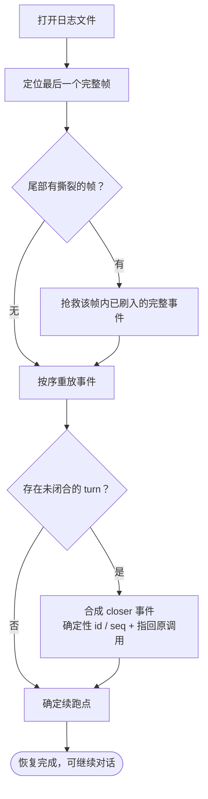

# 第 6 章：会话持久化与恢复 —— 对话怎么落盘、怎么读回

本章追踪第 5 章确立的事实源如何落盘、如何读回、读回时如何保证语义一致。四个项目**都选了 JSONL**——这一点惊人的一致；差异全部落在「**如何保证这一行行文本可信**」，而严谨程度呈明显阶梯。

> **本层定位**：L6，回答「第 5 章确立的事实源怎么落盘、怎么读回、读回时如何保证语义一致」。
>
> **前置依赖**：05（事实源的定义决定了落盘协议要保住什么）、04（压缩产物的持久化格式）。
>
> **分析对象**：
> - **pi** —— `packages/agent/src/harness/session/jsonl/*` + `session/commit.ts` + `jsonl/legacy-v3.ts`
> - **deepseek-harness** —— `packages/session/session-persistence-jsonl/src/*` + `core/session/src/{invariant,repair}.ts`
> - **codex** —— `codex-rs/rollout/src/*` + `codex-rs/history/src/lib.rs`
> - **Claude-Code** —— `src/utils/{sessionStorage,sessionStoragePortable,listSessionsImpl}.ts` + `src/utils/conversationRecovery.ts` + `src/main.tsx`（迁移）

---

## 一、核心结论速览

1. **四家都选了 JSONL**——这一点惊人的一致。差异全部落在「**如何保证这一行行文本可信**」，严谨程度呈明显阶梯：pi（最简）→ codex（居中）→ Claude-Code（工程化）→ dsh（最严）。
2. **写入协议四分**：pi 用 `tmp + rename` **整文件替换**（事务行批量提交）；dsh 用 `link()` **no-clobber 不可变代际发布**；codex 用**后台 writer task + 不可变文件 + revert 生成新文件**；Claude-Code 用**非原子的 `appendFile` + 定时批量 drain**（唯一不做原子性的）。
3. **崩溃恢复的四种哲学**：pi **丢弃**尾部残缺行并重写全文件；codex **跳过**坏行并计数、不修文件；Claude-Code **静默容忍**（外层 try/catch）；dsh **抢救**——完整帧内损坏直接报错，但最后一个撕裂帧里**已刷入的完整事件必须抢救**（`recoveredTail`）。
4. **「未闭合 turn」只有两家处理**：dsh 通过 `repair.ts:63` **合成 closer 事件**（含确定性 id/seq + `sourceEventSeqs` 指回原调用 + 给模型的处置指引）；其余三家无此概念。
5. **最值得抄的三条**：dsh 的**撕裂尾部抢救**（理由：这些事件「模型与 UI 可能已经见过」，静默丢弃会让恢复后的会话与用户实际经历不一致）；dsh 的**刻意不给写锁加超时**（超时夺取活着的写者会撕裂日志，损害远大于等待）；codex 的**「只在可安全修正时才修正」**（元数据长度不符时宁可报错也不做错位剥离）。

---

## 二、本层职责与边界

### 2.1 本层解决什么问题

| 职责 | 问题 |
|---|---|
| **① 格式** | 存成什么？一条记录多大粒度？目录怎么布局？ |
| **② 写入协议** | 何时写？原子吗？崩溃时最后一条怎么办？ |
| **③ 恢复** | 怎么找到会话？怎么重建状态？续跑点怎么定？ |
| **④ 写者所有权** | 多个进程/实例能同时写吗？锁怎么设计？ |
| **⑤ 版本演进** | schema 变了怎么办？旧版本能读新数据吗？ |
| **⑥ 损坏与失效** | 悬空引用、截断、配置不匹配时的行为？ |

### 2.2 层次定位

```text
┌───────────────────────────────────────────────┐
│ L6 持久化与恢复（本章）                       │
│ 写入：事实源 → 磁盘（协议 · 原子性 · 所有权） │
│ 读取：磁盘 → 事实源（校验 · 重放 · 续跑点）   │
└───────────────────────┬───────────────────────┘
                        │
               ┬────────┼─────────┬
               ▼                  ▼
               L5 消息 / Session  L7 任务与子 Agent
               （事实源是什么）   （子会话也落盘）
```

**图 6-1**：L6 在运行时栈中的位置。它是 L5 的落地实现：L5 决定「事实源是什么」，L6 决定「它如何跨进程存活」。

```text
        ┌─── L5 消息 / 事件 / Session（事实源定义） ───────────┐
        └──────────────────────────┬───────────────────────────┘
                                   │ 序列化 / 反序列化
        ┌──────────────────────────▼───────────────────────────┐
        │  L6 持久化与恢复（本篇）                             │
        │  格式 → 写入协议 → 崩溃恢复 → 写者所有权             │
        │         → 版本演进 → 损坏处理                        │
        └─────────┬───────────────────────────────┬────────────┘
                  │                               │
          ┌───────▼──────┐            ┌───────────▼──────────┐
          │ 磁盘（JSONL）│            │ L1 恢复续跑点        │
          └──────────────┘            │ L4 压缩 checkpoint   │
                                      └──────────────────────┘
```

### 2.3 四家边界差异

| 边界问题 | pi | dsh | codex | Claude-Code |
|---|---|---|---|---|
| 落盘粒度 | 事务行（一行 = 一批写） | 单事件行 | 单 item 行 | 单消息/单条目行 |
| 原子性 | ✓ `tmp + rename` 整文件 | ✓ `link()` 代际发布 | 部分（不可变文件 + revert） | ✗ 追加 + 定时 drain |
| 文件数 | 1 个（每 session） | 多代际（current + 历史代） | 多文件（不可变 + revert） | 1 个（每 session） |
| 写者保护 | 进程内队列 | **内核 flock** | 文件锁 + 陈旧清理 | 进程内队列 |

---

## 三、概念对齐表

| 概念 | pi | deepseek-harness | codex | Claude-Code |
|---|---|---|---|---|
| 存盘路径 | session 目录下 `.jsonl` | 会话目录 + `session.lock` | `~/.codex/sessions/**/*.jsonl` | `~/.claude/projects/<sanitized-cwd>/<sessionId>.jsonl` |
| 记录单元 | 事务行 `Write[]` | 单事件行（帧） | `RolloutLine`（含 ordinal） | JSONL 条目（`Entry` union） |
| 帧/压缩 | ✗（纯 JSONL） | **zstd 帧**（可撕裂） | ✗ | ✗ |
| 原子发布 | `tmp + rename` `io.ts:81-97` | `link()` no-clobber `generation.ts:828` | revert 生成新文件 | ✗ |
| 撕裂尾处理 | 丢弃 + 重写（`storage.ts:30`） | **抢救**（`recoveredTail`） | 跳过 + 计数 | 静默容忍 |
| 未闭合 turn | 无概念 | **合成 closer**（`repair.ts:63`） | 不合成 | 不合成 |
| 序号/高水位 | `header.nextSeq` | branded 连续 seq | `ordinal` 单调递增 | 文件行序 + `uuid` |
| 写锁 | 进程内 | **flock + 无过期 + inode 校验** | 文件锁 + 陈旧清理 | 进程内队列 |
| 写者所有权标识 | — | `LEASE_FILENAME='session.lock'` | `WriterLockCoordinator` | — |
| 列举会话 | `repo.list` `repo.ts:109` | 目录扫描 | rollout 扫描 + ordinal | `listSessionsImpl.ts:439` |
| 迁移 | `legacy-v3.ts` 单跳 + 版本强校验 | 不可变代际 + 迁移包链 + fail-closed | 双模式并存 | **整体重跑 + 幂等**（`main.tsx:325`） |
| 版本标识 | `storageVersion` | `SESSION_FORMAT_VERSION` | `ThreadHistoryMode` | `CURRENT_MIGRATION_VERSION=11` |

---

## 四、逐项目实现

```text
              写入协议              崩溃后怎么办               写者所有权
  ──────────────────────────────────────────────────────────────────────────
  pi          tmp + rename          丢弃残缺行 + 重写全文件    仅进程内队列
              整文件原子替换                                  （无跨进程保护）
  ──────────────────────────────────────────────────────────────────────────
  dsh         link() no-clobber     撕裂尾部抢救 + 合成 closer 内核 flock
              不可变代际发布         已刷入事件必须救回        （刻意无过期）
  ──────────────────────────────────────────────────────────────────────────
  codex       后台 writer task      跳过坏行 + 计数，不修文件  文件锁
              不可变 rollout                                   + 陈旧锁清理
  ──────────────────────────────────────────────────────────────────────────
  Claude-Code appendFile            静默容忍（外层 try/catch） 无锁
              定时批量 drain         四家中唯一不做原子写
```

**图 6-2**：四家的写入协议与崩溃恢复。三列合起来看才是完整的工程决策——「怎么写得可靠」与「写坏了怎么办」是同一个问题的两面。

### 4.1 pi —— 事务行 + 整文件原子替换

#### 4.1.1 格式与发布

```ts
// packages/agent/src/harness/session/jsonl/io.ts
:66  parseJsonlTransaction(...)
:76  export function serializeJsonlTransaction(...)
:107 export function publishJsonl(...)
// :81 / :87  —— tmp + rename 原子发布
const tempPath = `${destinationPath}.tmp`;
renameFile(tempPath, destinationPath, ...)
```

**「一行 = 一批写」**：pi 的事务行把多条 `Write`（EntryWrite/UsageWrite/ValueWrite/ListWrite）打包成一行 JSON。这样一次提交只需一次追加，且**重放时可以按事务为单位保证原子性**。

#### 4.1.2 写入：commitQueue 串行 + 整文件重写

```ts
// packages/agent/src/harness/session/jsonl/storage.ts
:128 async commit(writes: Write[], context: Context)      // commitQueue 串行化
:138 applyCommit(...)
:154 upgradeLegacyV3ToV4(...)
:173 const nextSeq = prepared.result.firstSeq + prepared.writes.length;   // nextSeq 高水位
// packages/agent/src/harness/session/commit.ts（注意：在 session/，不是 session/jsonl/）
:61  commitWrite(...)
:82  export function prepareStorageCommit(writes, firstSeq, timestamp): PreparedCommit
:90  validateCommittedWrites(...)
```

**文件位置**：`session/commit.ts`，`prepareStorageCommit` 在 `:82`。

#### 4.1.3 崩溃恢复：丢弃 + 重写

```ts
// storage.ts:30
function splitCompleteLines(content: string): { lines: string[]; torn: boolean }
// :74 static async open(...)   :85 openV4（重放 + 修尾）
// :107 advanceNextSeq(header.nextSeq)
// :108-111 若 torn → 原子重写整个文件（丢掉残缺尾行）
```

**pi 的恢复策略是四家中最「暴力」的**：发现尾部残缺就**重写整个文件**。好处是恢复后文件始终自洽；代价是大文件恢复代价高，且**丢弃的那部分内容无法找回**。

#### 4.1.4 写者所有权：仅进程内

`commitQueue` 保证同一进程内的提交串行。**没有跨进程保护**——若两个进程打开同一 session，会互相覆盖。pi 的定位是嵌入式库，默认使用者会保证单实例。

#### 4.1.5 迁移

`legacy-v3.ts:563` `LegacyV3Source.read(...)`（`:184` `normalizeLegacyV3Header` / `:165` `metadataFromLegacyV3Header`）；`storage.ts:154` `upgradeLegacyV3ToV4`。**单跳迁移 + 版本强校验**：版本不符即拒绝（不尝试猜测）。

---

### 4.2 deepseek-harness —— 不可变代际 + 撕裂尾部抢救 + 合成闭合



**图 6-3**：恢复流程（以 dsh 为例）。中间两个判定是四家分野最明显的地方：是否抢救已刷入的事件、是否为未闭合的 turn 合成收尾。

#### 4.2.1 帧格式：zstd + 显式头行

```ts
// packages/session/session-persistence-jsonl/src/format.ts
:83  HeaderLine        :119 toHeaderLine(...)     :141 fromHeaderLine(...)
:96  const HEADER_REQUIRED_KEYS = [...]     // 头部字段闭合白名单
:313 eventLines(...)   :322 eventLine(...)  :386 SessionLogScanner   :532 scanLog(...)
```

**头部字段闭合白名单**（`:96`）：多余字段即拒——防止「看起来像新格式但其实是另一个东西」的文件被误读。

#### 4.2.2 写入协议：`link()` no-clobber 不可变代际

```ts
// packages/session/session-persistence-jsonl/src/generation.ts
:817 async function publishCurrentExclusive(...)
:828   await internals.fs.link(staged, currentPath)   // EEXIST 返回 false（不覆盖）
:834 ...
// :162 / :243  物理身份（用于迁移前后比对）
export interface JsonlPhysicalIdentity { readonly dev: bigint; readonly ino: bigint; size; mtime; ctime }
// :492 / :502  verifyJsonlCurrentGeneration / verifyCurrentGeneration
```

**机制**：新代际写入 staging 文件，然后用 `fs.link()` 原子地创建 `current` 链接——**若 `current` 已存在则失败**（EEXIST），绝不覆盖。写成功后旧的代际文件保留（成为历史）。

**为什么不可变代际是最佳迁移载体**（`[推断]`）：迁移 = 读旧代际 + 写新代际 + 原子切换 `current` 链接。失败时 `current` 仍指向旧文件，**没有中间态**。

**物理身份比对**（`:162`）：迁移前后比对 `dev:ino:size:mtime:ctime`，确保「我迁移的就是我刚读的那个文件」（防 TOCTOU）。

#### 4.2.3 写锁：flock + 刻意无过期 + inode 复核

```ts
// packages/session/session-persistence-jsonl/src/lease.ts
:40  export const LEASE_FILENAME = 'session.lock'
:48  isLockContention(...)
:58  export class SessionWriteLease
:70  static async acquire(dir, id): Promise<SessionWriteLease>   // flock(2)
:124 release(...)
```

**刻意不给锁加超时**——这是全系列最值得引用的设计决策之一。源码注释（`[注释]`）的论证：

> 超时夺取一个「活着但卡住」的写者，会让两个写者交错追加、撕裂日志，损害远大于等待；崩溃进程的锁由内核随描述符关闭自动释放，真正的失败模式已被覆盖。

配套两个细节：
- **POSIX `dev+ino` 复核**：防止锁住一个已被 unlink 的孤儿文件；
- **锁文件永不删除**：保住稳定 inode（否则新进程会锁到新 inode 上，形成两个「持有者」）。

#### 4.2.4 恢复：撕裂尾部抢救

```ts
// packages/session/session-persistence-jsonl/src/index.ts
:342 async open(id, access, ...)
:113 readonly recoveredTail: SessionEvent[]      // ← 抢救出来的事件
:396 ...
:1013 prefix.events.slice(complete.eventCount)   // 提取撕裂帧中已完整的事件
:772 / :947  解码时收集 recoveredTail
:889 async truncateTornTail(header, truncateTo)
:1365 await this.repair(header, truncateTo)
```

**核心主张**（源码注释 `[注释]`）：完整帧内的损坏直接报错，但**最后一个撕裂 zstd frame 里已经刷入的完整事件必须抢救**——因为「这些是真实已发出的事件，模型/UI 可能已见过它们」，静默丢弃会导致恢复后的会话与用户实际经历不一致。

对比：pi 直接丢弃，codex 直接跳过，CC 静默容忍。**只有 dsh 区分了「损坏」与「已发出但未被确认」**。

#### 4.2.5 合成 closer：把恢复语义做到「模型行为」层

```ts
// packages/core/session/src/repair.ts
:63  export function openTurnClosers(events, cause): SessionEvent[]
:160   合成 step/end
:162   合成 turn/end
:175 interruptedTurnClosers(...)
// packages/core/session/src/invariant.ts
:42  requireOpenStep     :55 validateEvent     :176 applyTransition     :257 export const apply = ...
```

崩溃时若存在「有 tool_call 无 tool_result」的未闭合 turn，dsh **合成一条 `tool/result` 写入日志**：
- 确定性 id / seq（同输入必然同输出，可重放）
- 复用最后时间戳
- `sourceEventSeqs` 指回原调用
- **附带给模型的处置指引**：只读或幂等才重试；有副作用先验证外部状态或问用户；不要盲目重试

**这是四家中唯一把恢复语义下沉到「模型行为」层的实现**——其余三家只保证数据结构完整，不管模型拿到后会不会误重试。

#### 4.2.6 契约与准备层

```ts
// packages/session/session-persistence/src/storage-contract.ts —— 断言与物化函数
// :35 assertStoredId   :112 materializeCreateHeader   :131 materializeAppendBatch   :145 assertContiguous
// 契约 interface 在：
// packages/session/session-persistence/src/index.ts:50/62/92/98/104
// packages/session/session-persistence/src/handle.ts:59  export interface SessionHandle extends AsyncDisposable
// packages/core/session/src/preparation.ts:9/20  SessionPreparationOptions / SessionPreparation
// packages/core/session/src/seq-ranges.ts:7/18/37  EncodedSeq / encodeSeqRanges / decodeSeqRanges
```

---

### 4.3 codex —— 不可变 rollout + 后台 writer + 双模式并存

#### 4.3.1 写入：后台 writer task

```rust
// codex-rs/rollout/src/recorder.rs
:884  pub async fn new_with_writer_lock(...)
:1035 record_canonical_items(...)     // 记录规范 item
:1053 persist(...)
:1074 flush(...)
:1091 load_rollout_items(...)
:1176 shutdown(...)
```

写入由**后台 task** 承接（调用方不阻塞在 IO 上）。对比 CC 的 100ms 定时 drain，codex 用了真正的异步任务。

#### 4.3.2 恢复：反向扫描定位 + ordinal 续接

```rust
// codex-rs/rollout/src/ordinal.rs
:17  RolloutOrdinalState
:23  for_new_rollout(...)      :35 current(...)      :46 advance(...)      // 单调递增
:55  ordinal_state_for_rollout(...)     // 反向扫描定位
:102 read_history_metadata(...)
// :46  —— 校验溢出
pub(crate) fn advance(&mut self) { *next = ordinal.checked_add(1); }
```

```rust
// codex-rs/rollout/src/recorder.rs
:1156 pub async fn get_rollout_history(path) -> InitialHistory
:1223 reject_unknown_thread_history_mode(...)     // 未知模式拒绝
```

**双历史模式**：`ThreadHistoryMode::Legacy` / `Paginated`。`reject_unknown_thread_history_mode`（`:1223`）保证遇到不认识的模式**直接拒绝**而不是猜测。

**符号位置**：`record_initial_history` 定义在 `core/src/session/mod.rs:1537`；`strip_rollout_prefix` 全仓未定义。

#### 4.3.3 持久化策略：durable / transient 分类表

```rust
// codex-rs/rollout/src/policy.rs
:10  is_persisted_rollout_item(...)
:44  should_persist_response_item(...)
:94  pub fn should_persist_event_msg(ev: &EventMsg, history_mode: ThreadHistoryMode) -> bool
// :113 / :123  durable 臂
// :142         transient 臂（注释：// Transient, non-durable events.）
```

**把「哪些事件要落盘」收敛成一张可审计的表**，且带 `history_mode` 维度（不同模式下持久化集合不同）。这是 CC 与 pi/dsh 都没有的——它们要么全落（dsh）、要么由调用方决定（pi）。

#### 4.3.4 写锁：文件锁 + 陈旧清理

```rust
// codex-rs/rollout/src/writer_lock.rs
:21  WriterLockCoordinator
:27  WriterLockGuard
:43  pub fn acquire(self: &Arc<Self>, thread_id) -> io::Result<WriterLockGuard>   // try_lock
:108 lock_coordination(...)
:124 remove_stale_thread_locks(...)        // 陈旧锁清理
```

**与 dsh 相反的选择**：codex **做陈旧锁清理**，dsh **刻意不做**。两者的前提不同——codex 是 CLI 场景（进程可能被强杀），dsh 依赖内核自动释放（flock 随 fd 关闭释放）。

#### 4.3.5 历史读取与线格式

```rust
// codex-rs/history/src/lib.rs
:159 pub enum RolloutItem        :230 pub struct CompactedItem
:302 pub struct RolloutLine      :311 pub struct ResumedHistory     :318 pub enum InitialHistory
```

`RolloutLine` 是带 ordinal 的一行；`RolloutItem` 手写 serde 走 `*Wire` 层（隔离线格式与内部类型）。`InitialHistory` 三态（New / Resumed / Forked）决定启动时如何回填 history。

#### 4.3.6 「只在可安全修正时才修正」

`strip_legacy_ghost_snapshot_rollout_line` 的核心约束（`[注释]`）：**元数据长度与预期不符时放弃剥离，宁可报错也不错位**。

**语义载体**：「不可变文件 + revert 生成新文件」以**注释形式**散落在 `recorder.rs:101`、`list.rs:1643/1668`、`metadata.rs:109`；`rollout/src/lib.rs` 中没有对应的类型或函数定义。

---

### 4.4 Claude-Code —— 追加写 + 定时 drain + 整体重跑迁移

#### 4.4.1 目录布局与文件名

```ts
// src/utils/sessionStoragePortable.ts
:325 getProjectsDir()  →  ~/.claude/projects
:311-319 sanitizePath(originalCwd)   // 非字母数字 → '-'；超 200 字符截断加 hash
:354-380 findProjectDir(...)         // 前缀扫描兜底（Bun.hash vs djb2 不一致）
// src/utils/sessionStorage.ts
:198 / :202-205  getTranscriptPath  →  <projectDir>/<sessionId>.jsonl
:207-225  getTranscriptPathForSession
:247-258  子 agent：<sessionId>/subagents/[<subdir>/]agent-<agentId>.jsonl
:260-289  伴随 <...>.meta.json 侧车
```

**`sanitizePath` 的 hash 不一致问题**（`:354-380`）是真实踩坑：Bun 用 `Bun.hash`、Node SDK 用 djb2，同一路径算出不同目录名，于是需要前缀扫描兜底。

#### 4.4.2 写入协议：非原子追加 + 定时 drain

```ts
// src/utils/sessionStorage.ts
:634-643  Project.appendToFile → fsAppendFile（失败先 mkdir 再重试）
:645-686  drainWriteQueue（批量拼 jsonStringify(entry)+'\n'，100MB 分块）
:618-632  scheduleDrain（FLUSH_INTERVAL_MS=100；远程 CCR 模式 10ms）
:841-861  flush()（取消定时器 → await drain → 再 drain → 等 pendingWriteCount 归零）
:976-991  materializeSessionFile（首条 user/assistant 才创建文件）
:1128-1265 appendEntry（message 类先查 UUID 去重，新 UUID 才写）
:960-970  shouldSkipPersistence（test / cleanupPeriodDays===0 / --no-session-persistence）
:1339-1342  远程失败 → gracefulShutdownSync(1)
```

**这是四家中唯一不做原子发布的**（无 tmp+rename、无 link）。**理由**（`[推断]`）：CC 的写入是**单条追加**，每条 JSON 独立成行——即使崩溃，最坏情况是最后一行不完整，逐行解析天然容忍。原子性由「行格式 + 逐行解析」在读取侧提供，而非写入侧。

**`materializeSessionFile`**（`:976-991`）：在首条真实消息到达前，metadata 只进 `pendingEntries`——避免产生「只有元数据的空会话文件」。

**UUID 去重**（`:1242`）：写入前查 `getSessionMessages` 的 memoized UUID 集合，只写新 UUID。

#### 4.4.3 列举：两级策略

```ts
// src/utils/listSessionsImpl.ts
:439 listSessionsImpl(...)        :446 limit/offset 决定是否 doStat
:309 gatherProjectCandidates(...)  :406 gatherAllCandidates(...)
:235 applySortAndLimit(...)       :278 readAllAndSort(...)
:230 compareDesc = mtime 降序（tie 用 sessionId 降序）
:169 listCandidates（只认 .jsonl 且 validateUuid 通过）
:79  parseSessionInfoFromLite（从 head/tail 抽字段）
:89-94   跳过 isSidechain
:115-119 summary 优先级：customTitle > lastPrompt > summary > firstPrompt
:122     无 summary 直接丢弃
```

**性能设计**：有 `limit` 时先按 `mtime` 排序，再**按 32 个一批读头尾**（`:224`/`:252-268`），避免全量解析。

#### 4.4.4 恢复流程（6 步）

```ts
// src/utils/conversationRecovery.ts:456-597  loadConversationForResume
1. source 分流：undefined → loadMessageLogs()（跳过 live bg/daemon 会话，:490-512）
   string → getLastSessionLog   LogOption → 直接用   .jsonl 路径 → loadMessagesFromJsonlPath（:416-440）
2. lite log → loadFullLog（sessionStorage.ts:2949-3060）
3. loadTranscriptFile（:3472-3813）
   → 找 leafUuids 中最新的 user/assistant leaf → buildConversationChain
   → removeExtraFields（:1814-1821，仅剥 isSidechain/parentUuid）
4. checkResumeConsistency（:2224-2243，对比 turn_duration.messageCount）
5. restoreSkillStateFromMessages（:382）→ deserializeMessagesWithInterruptDetection（:164）
6. 追加 SessionStart hooks（:565）
```

**大文件特化**：`>SKIP_PRECOMPACT_THRESHOLD (5MB)`（`sessionStoragePortable.ts:480`）时走 `readTranscriptForLoad`（`:717-793`）**单次前向分块读**，fd 级跳过 `attribution-snapshot`，**遇 compact boundary 就地截断累积器**；再 `scanPreBoundaryMetadata`（`:3550`）回收 pre-boundary 元数据。

#### 4.4.5 损坏处理：静默容忍

```ts
// sessionStorage.ts
:3614 parseJSONL（逐行解析）
:3700-3702 整段外层 try/catch 静默
:2077-2085 buildConversationChain 遇环 → 记 tengu_chain_parent_cycle → 返回部分链
:3788-3790 leafUuids 计算遇环 → 记 tengu_transcript_parent_cycle
// sessionStoragePortable.ts
:239-241 / :279-281  读头尾出错 → 返回空
:418-420 resolveSessionFilePath 用 stat 且 size>0 才算存在
:393-395 零字节文件视作 not-found，继续在兄弟目录找
:699-715 finalizeOutput（处理崩溃截断的非 LF 结尾）
```

**静默容忍 + 遥测**：损坏不报错，但记事件名——比 pi 的丢弃与 codex 的计数更轻，依赖「部分可用好过完全打不开」。

#### 4.4.6 迁移：整体重跑 + 幂等

```ts
// src/main.tsx:325-352
const CURRENT_MIGRATION_VERSION = 11;
function runMigrations(): void {
  if (getGlobalConfig().migrationVersion !== CURRENT_MIGRATION_VERSION) {
    migrateAutoUpdatesToSettings(); migrateBypassPermissionsAcceptedToSettings();
    migrateEnableAllProjectMcpServersToSettings(); resetProToOpusDefault();
    migrateSonnet1mToSonnet45(); migrateLegacyOpusToCurrent(); migrateSonnet45ToSonnet46();
    migrateOpusToOpus1m(); migrateReplBridgeEnabledToRemoteControlAtStartup();
    if (feature('TRANSCRIPT_CLASSIFIER')) resetAutoModeOptInForDefaultOffer();
    if ("external" === 'ant') migrateFennecToOpus();
    saveGlobalConfig(prev => prev.migrationVersion === CURRENT_MIGRATION_VERSION ? prev : {...prev, migrationVersion: CURRENT_MIGRATION_VERSION });
  }
  migrateChangelogFromConfig().catch(() => {});   // 异步：失败下轮重试
}
```

**没有「按版本号逐个迁移」的机制**：只要 `migrationVersion !== 11`（无论更高还是更低）**都会重跑全部迁移**，靠**每个迁移自身幂等**保证无害。

幂等的两种实现：
- **读同一 source 再写**（`migrateFennecToOpus.ts:23-44`，注释明确 「reading and writing same source keeps this idempotent」）；
- **独立 completion flag**（`resetProToOpusDefault.ts:10` 的 `opusProMigrationComplete`）。

**关键边界**：迁移**只作用于设置/模型字符串，不触碰会话 JSONL**。会话格式的兼容靠**读取侧的向后兼容**（`migrateLegacyAttachmentTypes` `:77-132`、legacy progress bridge `:3623-3645`），而不是迁移脚本。

这是与另外三家**根本不同**的哲学：pi/dsh/codex 迁移数据，CC 迁移配置 + 让读取侧宽容。

#### 4.4.7 与压缩的交互

- **落盘内容**：`compact_boundary` 系统消息（`createCompactBoundaryMessage`，`utils/messages.ts:4530-4555`，含 `compactMetadata.{trigger,preTokens,userContext,messagesSummarized}` + 可选 `logicalParentUuid`）+ 摘要消息（`isCompactSummary: true, isVisibleInTranscriptOnly: true`）。
- **boundary 的 parentUuid 特殊处理**（`sessionStorage.ts:1040-1041`）：`parentUuid: null` + `logicalParentUuid: <前一条>`——使 `--continue` 时**不跨 boundary 回溯**。
- **preservedSegment**（`compact.ts:349-367`）：`{headUuid, anchorUuid, tailUuid}` 写进 boundary metadata；加载时 `applyPreservedSegmentRelinks`（`:1839`）把保留消息重接到 anchor 后，并**物理裁剪** boundary 之前的未保留消息（`:1944-1955`）。
- **清 stale usage**（`:1920-1939`）：对 preserved 段清零旧 `usage`，**防 resume 后立即 autocompact**。
- **API 前切段**：`findLastCompactBoundaryIndex`（`messages.ts:4618`）/ `getMessagesAfterCompactBoundary`（`:4643`）。

---

## 五、横向对比矩阵

### 5.1 格式与写入协议

| 维度 | pi | dsh | codex | Claude-Code | 共识度 |
|---|---|---|---|---|---|
| 落盘格式 | JSONL（事务行） | JSONL（zstd 帧） | JSONL（带 ordinal） | JSONL（单条目） | **4/4 JSONL** |
| 原子发布 | `tmp + rename` | **`link()` no-clobber** | revert 新文件 | ✗ | 2/4 |
| 写入时机 | 批量事务提交 | 事件即时 | 后台 task | 100ms 定时 drain | 0/4 |
| 文件可变性 | 可变（重写） | **不可变代际** | **不可变 + revert** | 可变（追加） | 2/4 |
| 写失败处理 | 抛错 | 分类（busy/cancelled/…） | 抛错 | mkdir 重试 / 远程 `gracefulShutdownSync(1)` | 2/4 |

### 5.2 崩溃恢复

| 维度 | pi | dsh | codex | Claude-Code | 共识度 |
|---|---|---|---|---|---|
| 残缺尾策略 | **丢弃 + 重写全文件** | **抢救已刷入事件** | 跳过 + 计数 | 静默容忍 | 0/4 |
| 完整帧内损坏 | 抛错 | **抛错** | 跳过 | 容忍 | 1/4 |
| 未闭合 turn | 无概念 | **合成 closer** | 不合成 | 不合成 | 1/4 |
| 给模型的处置指引 | ✗ | **✓ 独有** | ✗ | ✗ | 1/4 |
| 是否修文件 | ✓ 重写 | ✓ truncate + repair | ✗ 不修 | ✗ 不修 | 2/4 |
| 遥测 | ✗ | 事件 | 计数 | 事件名（`tengu_*`） | 2/4 |

### 5.3 写者所有权

| 维度 | pi | dsh | codex | Claude-Code | 共识度 |
|---|---|---|---|---|---|
| 跨进程保护 | ✗ | **内核 flock** | 文件锁 | ✗ | 2/4 |
| 锁过期 | — | **刻意无过期** | 有陈旧清理 | — | 0/4 |
| inode 复核 | — | **✓ dev+ino** | — | — | 1/4 |
| 锁文件生命周期 | — | **永不删除** | 可清理 | — | 1/4 |
| 单实例假设 | 依赖调用方 | 内核保证 | 锁保证 | 依赖调用方 | 2/4 |

### 5.4 版本演进与兼容

| 维度 | pi | dsh | codex | Claude-Code | 共识度 |
|---|---|---|---|---|---|
| 版本标识 | `storageVersion` | `SESSION_FORMAT_VERSION` | `ThreadHistoryMode` | `migrationVersion` | 4/4 有 |
| 迁移方式 | 单跳 + 版本强校验 | 代际 + 迁移包链 | 双模式并存 | **整体重跑 + 幂等** | 0/4 |
| 未知版本/模式 | 拒绝 | **fail-closed 词汇表** | **拒绝**（`:1223`） | 重跑（无害） | 3/4 拒绝 |
| 未知字段 | 严格 | **闭合白名单**（多余即拒） | serde 严格 | **宽松容忍** | 0/4 |
| 兼容责任方 | 迁移脚本 | 迁移 + 读取 | 读取（形状级） | **读取侧**（迁移只碰配置） | 0/4 |

### 5.5 损坏与失效处理

| 维度 | pi | dsh | codex | Claude-Code | 共识度 |
|---|---|---|---|---|---|
| 悬空父引用 | 抛错 | `sourceEventSeqs` 校验 | 元数据关联 | **截断链 + 环检测 + 遥测** | 4/4 有检测 |
| 半写记录 | 丢弃重写 | 抢救 | 跳过 | **非 LF 结尾收尾**（`:699-715`） | 0/4 |
| 零字节文件 | 报错 | 报错 | 跳过 | 视作 not-found 继续找 | 1/4 |
| 修正边界 | — | 严格 | **「只在可安全修正时才修正」** | 宽松 | 0/4 |

### 5.6 列举与加载性能

| 维度 | pi | dsh | codex | Claude-Code | 共识度 |
|---|---|---|---|---|---|
| 列举策略 | `repo.list` | 目录扫描 | rollout 扫描 | 两级（stat 排序 + 32 批读头尾） | 0/4 |
| 大文件特化 | ✗ | 帧级扫描 | ordinal 反向扫描 | **>5MB 前向分块 + boundary 截断** | 2/4 |
| 加载校验 | 版本 | invariant + repair | 模式拒绝 | `checkResumeConsistency` | 2/4 |

---

## 六、异常与降级

### 6.1 崩溃时最后一条记录不完整

- **pi**：`splitCompleteLines`（`storage.ts:30`）判定撕裂 → **重写整个文件**（`:108-111`），丢弃残缺尾行。
- **dsh**：`recoveredTail`（`index.ts:113`）**抢救**撕裂帧里已完整的事件；`truncateTornTail`（`:889`）+ `repair`（`:1365`）修文件。
- **codex**：逐行容错跳过 + 计数，**不修文件**（下次加载仍会跳过）。
- **Claude-Code**：整段 try/catch 静默（`:3700-3702`）；`finalizeOutput`（`sessionStoragePortable.ts:699-715`）处理非 LF 结尾。

**设计理由**（`[注释]` dsh）：这些事件「真的发生过且可能已被模型/UI 见过」，静默丢弃会让恢复后的会话与用户实际经历不一致。**「抢救 > 丢弃」这个论点四家里只有 dsh 写清楚了**。

### 6.2 写入过程中崩溃导致 turn 未闭合

- **dsh**：`openTurnClosers`（`repair.ts:63`）**合成 step/end + turn/end**；合成 tool/result 时附带**给模型的处置指引**（只读/幂等才重试，有副作用先验证或问用户）。
- **其余三家**：无此概念。

**设计理由**（`[推断]`）：一个「有 tool_call 无 result」的历史会让模型面对一个未完成的动作；不给指引，模型很可能盲目重试一个已经执行过的副作用操作（如已提交的 git commit）。

### 6.3 多进程/多实例同时打开同一会话

- **pi**：无保护（调用方负责）。
- **dsh**：**内核 flock**（`lease.ts:70`），拒绝过期/争用；`dev+ino` 复核；锁文件永不删除。
- **codex**：文件锁 + `remove_stale_thread_locks`（`writer_lock.rs:124`）。
- **Claude-Code**：无跨进程保护（进程内队列）。

**设计理由**（`[注释]` dsh，值得整段引用）：超时夺取活着的写者会撕裂日志，损害远大于等待；崩溃进程的锁由内核随 fd 关闭自动释放，真正的失败模式已被覆盖。**「锁应绑定进程存活而非操作时长」**——这是 第 6 章最重要的一条结论。

### 6.4 未知版本 / 未知模式 / 未知字段

- **pi**：版本不符**拒绝**。
- **dsh**：fail-closed 词汇表；头部**闭合白名单**（多余字段即拒）；未知事件需 `ignorable` 标记。
- **codex**：`reject_unknown_thread_history_mode`（`recorder.rs:1223`）**拒绝**。
- **Claude-Code**：`migrationVersion !== 11` 就重跑迁移（幂等所以无害）；未知字段**宽松容忍**。

**设计理由**：pi/dsh/codex 三家都选 fail-closed，理由是「旧运行时读错新日志」是静默灾难；CC 选 fail-open 是因为它必须保证旧版本能打开新版本写的会话（商业产品的用户不会有「不能打开」的选项）。

### 6.5 悬空引用（parentUuid / callId / seq）

| 项目 | 行为 |
|---|---|
| pi | `findTurnStartIndex` 上溯遇缺失 → 抛 `SessionInvariantError` |
| dsh | `tool/result` 必须配对 `tool/call`；`surfaceOp.replace` 的 `startSeq/endSeq` 必须在当前 surface 上 |
| codex | `response_id`/`window_ids`/`model_hash` 随 `CompactedHistoryMetadata` 持久化，rollback 靠它关联 |
| Claude-Code | `buildConversationChain` 遇 undefined **截断链**；`recoverOrphanedParallelToolResults`（`:2118`）修并行分叉；`applySnipRemovals`（`:1982`）**重连**跨 gap 的 parentUuid |

### 6.6 元数据不一致（「能读出来」≠「可以续写」）

- **codex**：`strip_legacy_ghost_snapshot_rollout_line` 的核心约束——**元数据长度不符时放弃剥离，宁可报错也不错位**；子 agent 前缀完整性校验。
- **Claude-Code**：`checkResumeConsistency`（`:2224-2243`）对比 `turn_duration.messageCount`。
- **pi**：`validateCommittedWrites`（`commit.ts:90`）。
- **dsh**：`invariant.ts` 全量校验（`:55` `validateEvent` / `:257` `apply`）。

**设计理由**（`[注释]` codex）：错位剥离比不剥离危险得多——它会静默产生一个「看起来正常但内容错位」的历史。

### 6.7 迁移失败与部分完成

- **dsh**：不可变代际 + `link()` no-clobber → 失败时 `current` 仍指旧代际，**没有中间态**；迁移前后 `dev:ino:size:mtime:ctime` 比对（`generation.ts:162`）。
- **Claude-Code**：每个迁移幂等，可安全重跑；异步迁移（`migrateChangelogFromConfig`）失败下轮重试。
- **pi**：版本强校验 + 单跳迁移。
- **codex**：双模式并存（不需迁移，两种都能读）。

### 6.8 resume 一个已压缩的会话

- **Claude-Code**：`applyPreservedSegmentRelinks`（`:1839`）重接 + **物理裁剪** pre-boundary 未保留消息（`:1944-1955`）；**清 preserved 段的 stale usage**（`:1920-1939`）防「刚打开就压缩」；`getMessagesAfterCompactBoundary`（`:4643`）在 API 前切段；tail→head 链断裂则**整体 no-op**（`:1888-1902`，宁可多加载也不丢历史）。
- **codex**：`InitialHistory::Resumed` + `CompactedItem` 回填。
- **dsh**：`foldSurface` 折叠出当前 surface。
- **pi**：`newestCompactionIndex` 检测已有更新压缩即跳过。

**设计理由**（`[注释]` CC 的清 usage）：这解决了 第 4 章「压缩后立即再次压缩」的一个具体成因——**旧 token 计数在加载后不成立**。

---

## 七、设计建议

### 7.1 共识（可直接采纳）

1. **JSONL 是 Agent 会话存储的最佳默认格式**：四家独立选择。理由：逐行追加、逐行容错、可读可 diff、无需整体重写。
2. **一行一条记录，且自带足够上下文**（id/seq/时间戳）——恢复时可独立判断该行的可用性。
3. **必须有版本标识**，且遇到不认识的高版本要拒绝而不是猜测。
4. **参考完整性检测是刚需**：悬空父引用、未配对 tool 调用四家都有检测路径。
5. **序号单调**：pi 的 `nextSeq` 高水位、codex 的 `ordinal.checked_add`、dsh 的 branded seq——都在防「序号回退/冲突」。
6. **列举会话要能按时间排序且不必全量解析**（codex 反向扫描、CC 带头尾批读）。

### 7.2 推荐（按收益排序）

1. **撕裂尾部要「抢救」而不是「丢弃」**（学 dsh）：完整帧内损坏报错，但最后一个撕裂帧里已刷入的完整事件要保留。理由：它们真的发生过，用户可能已经看到了。
2. **未闭合 turn 要显式闭合，并给模型处置指引**（学 dsh `repair.ts`）：合成 closer 保证结构完整；指引防止模型盲目重试有副作用的操作。**这是四家中收益最被低估的一条**。
3. **写锁绑定进程存活，不绑定操作时长**（学 dsh）：不要让超时夺取活着的写者。配套：`dev+ino` 复核、锁文件永不删除。
4. **不可变代际文件是迁移的最佳载体**（学 dsh）：读旧代际 → 写新代际 → 原子切换 `current` 链接。失败无中间态。
5. **「只在可安全修正时才修正」**（学 codex）：元数据不一致时宁可报错，也不要错位剥离。
6. **持久化策略收敛成可审计的表**（学 codex `policy.rs`）：明确哪些记录 durable、哪些 transient，并带模式维度。
7. **大文件要有特化加载路径**（学 CC `>5MB` 走前向分块 + boundary 截断）。
8. **加载后必须重算 token 计数**（学 CC 清 stale usage `:1920-1939`）：否则会「刚打开就压缩」。

### 7.3 权衡

1. **原子发布（pi/dsh）vs 逐行容忍（CC）**：前者保证文件永远自洽，代价是每次提交可能重写全文件；后者写入最便宜，代价是文件可能带残缺尾行，**正确性责任转移到读取侧**。**大批量写入场景选前者，高频小写入选后者**。
2. **fail-closed（dsh/codex/pi）vs fail-open（CC）**：前者保证「不会静默读错」，后者保证「旧版本总能打开」。取决于是否有多版本并存的用户群。
3. **锁过期 vs 无过期**：无过期（dsh）更安全但依赖内核语义（flock）；有过期（codex）适合进程可能被强杀的场景，但需要 inode 校验兜底。
4. **迁移数据 vs 迁移配置**（CC 的独特路线）：迁移配置 + 读取侧宽容，成本低但要求读取路径长期背兼容负担；迁移数据则把成本前置到迁移脚本。

### 7.4 反例

1. **不要在崩溃恢复时丢弃「已发出但未确认」的记录**（对照 dsh 的论证）。会话历史与用户的实际体验必须一致。
2. **不要用超时夺取写锁**（对照 dsh 的论证）。两个写者交错追加撕裂的日志，比等待更致命。
3. **不要做「错位剥离」式的容错**（对照 codex）。静默产生内容错位的历史，比直接报错难排查得多。
4. **不要在 resume 后立即触发压缩**（对照 CC 清 stale usage）。旧 token 计数不成立。
5. **不要把「能读出来」当作「可以续写」**（对照 codex 的子 agent 前缀完整性校验）。截断的历史能解析但会误导模型。

---

## 附录：关键文件索引

### pi

| 文件 | 行号 | 用途 |
|---|---|---|
| `packages/agent/src/harness/session/jsonl/io.ts` | 66 / 76 / 81 / 87 / 97 / 107 | 事务解析/序列化、**tmp+rename**、`publishJsonl` |
| `packages/agent/src/harness/session/jsonl/storage.ts` | 30 / 74 / 85 / 107 / 108-111 | `splitCompleteLines`、`open`/`openV4`、nextSeq、撕裂重写 |
| `packages/agent/src/harness/session/jsonl/storage.ts` | 128 / 138 / 154 / 173 | `commit`（commitQueue）/ `applyCommit` / v3→v4 / nextSeq 高水位 |
| `packages/agent/src/harness/session/jsonl/repo.ts` | 95 / 109 / 146 / 352 | `open` / `list` / `fork` / `loadStorage` |
| `packages/agent/src/harness/session/jsonl/codec.ts` | 4 / 34 / 49 / 53 | v3 header / 类型判定 / 解析 |
| `packages/agent/src/harness/session/commit.ts` | 61 / 82 / 90 | `commitWrite` / `prepareStorageCommit` / `validateCommittedWrites` |
| `packages/agent/src/harness/session/jsonl/legacy-v3.ts` | 165 / 184 / 528 / 563 | 迁移入口与规整 |
| `packages/agent/src/harness/session/in-memory-storage-state.ts` | 85 / 236 / 347 | nextSeq 高水位字段与推进 |

### deepseek-harness

| 文件 | 行号 | 用途 |
|---|---|---|
| `packages/session/session-persistence-jsonl/src/index.ts` | 342 / 113 / 396 / 1013 | `open` / **`recoveredTail`** / 抢救提取 |
| `packages/session/session-persistence-jsonl/src/index.ts` | 772 / 947 / 889 / 1365 | 解码收集 / `truncateTornTail` / `repair` |
| `packages/session/session-persistence-jsonl/src/format.ts` | 83 / 96 / 119 / 141 / 313 / 322 / 386 / 532 | 头行、**闭合白名单**、事件行、扫描器 |
| `packages/session/session-persistence-jsonl/src/generation.ts` | 162 / 243 / 817 / 828 / 834 / 492 | 物理身份 / **`link()` no-clobber** / 校验 |
| `packages/session/session-persistence-jsonl/src/lease.ts` | 40 / 48 / 58 / 70 / 124 | 锁文件名 / 争用判定 / **flock 写租约** |
| `packages/session/session-persistence/src/storage-contract.ts` | 35 / 112 / 131 / 145 | 断言与物化（`assertStoredId` / `materializeAppendBatch` / `assertContiguous`） |
| `packages/session/session-persistence/src/index.ts` + `handle.ts` | 50-104 / 59 | **真正的契约**：`SessionHandle` 等 |
| `packages/core/session/src/repair.ts` | **63 / 160 / 162 / 175** | **合成 closer** / step/end / turn/end |
| `packages/core/session/src/invariant.ts` | 42 / 55 / 176 / 257 | 校验全套 |
| `packages/core/session/src/seq-ranges.ts` | 7 / 18 / 37 | seq 区间编码 |
| `packages/core/session/src/preparation.ts` | 9 / 20 | `SessionPreparation` |

### codex

| 文件 | 行号 | 用途 |
|---|---|---|
| `codex-rs/rollout/src/recorder.rs` | 884 / 1035 / 1053 / 1074 / 1091 / 1176 | 后台 writer 全套 |
| `codex-rs/rollout/src/recorder.rs` | 1156 / 1223 | `get_rollout_history` / `reject_unknown_thread_history_mode` |
| `codex-rs/core/src/session/mod.rs` | 1537 | `record_initial_history` |
| `codex-rs/rollout/src/policy.rs` | 10 / 44 / 94 / 113 / 123 / 142 | durable/transient 分类表 |
| `codex-rs/rollout/src/ordinal.rs` | 17 / 23 / 35 / 46 / 55 / 102 | ordinal 状态、单调递增、反向扫描 |
| `codex-rs/rollout/src/writer_lock.rs` | 21 / 27 / 43 / 108 / 124 | 写锁协调、陈旧清理 |
| `codex-rs/rollout/src/lib.rs` | 26-37 / 50 / 75 / 80 | re-export、rollout 行解析 |
| `codex-rs/history/src/lib.rs` | 159 / 230 / 302 / 311 / 318 | `RolloutItem` / `CompactedItem` / `RolloutLine` / `ResumedHistory` / `InitialHistory` |

### Claude-Code

| 文件 | 行号 | 用途 |
|---|---|---|
| `src/utils/sessionStoragePortable.ts` | 311-319 / 325 / 354-380 | `sanitizePath` / 项目目录 / hash 不一致兜底 |
| `src/utils/sessionStoragePortable.ts` | 239-241 / 279-281 / 393-395 / 418-420 | 读错误容忍 / 零字节处理 / 存在性判定 |
| `src/utils/sessionStoragePortable.ts` | 480 / 699-715 / 717-793 | 5MB 阈值 / 截断收尾 / 前向分块加载 |
| `src/utils/sessionStorage.ts` | 198 / 202-205 / 247-258 / 260-289 | 路径与子 agent 布局 |
| `src/utils/sessionStorage.ts` | 618-632 / 634-643 / 645-686 / 841-861 / 960-970 | drain 调度 / 追加 / 队列 / flush / 跳过条件 |
| `src/utils/sessionStorage.ts` | 976-991 / 1128-1265 / 1408-1449 | 文件物化 / `appendEntry` / `recordTranscript` |
| `src/utils/sessionStorage.ts` | 1839 / 1888-1902 / 1920-1939 / 1944-1955 / 1982 | preservedSegment 重连 / 断裂 no-op / **清 stale usage** / 物理裁剪 / snip 重连 |
| `src/utils/sessionStorage.ts` | 2069-2094 / 2118 / 2224-2243 / 2949-3060 / 3472-3813 | 链构建 / 孤儿修复 / resume 一致性 / `loadFullLog` / `loadTranscriptFile` |
| `src/utils/sessionStorage.ts` | 3550 / 3614 / 3700-3702 / 3788-3790 / 3842 | pre-boundary 元数据 / 逐行解析 / 静默容忍 / 环记录 / memoized UUID |
| `src/utils/listSessionsImpl.ts` | 79 / 115-119 / 122 / 169 / 224 / 230 / 235 / 278 / 309 / 406 / 439 | 列举全套 |
| `src/utils/conversationRecovery.ts` | 164 / 382 / 416-440 / 456-597 | 恢复全流程 |
| `src/main.tsx` | 325-352 | `runMigrations` + `CURRENT_MIGRATION_VERSION=11` |
| `src/migrations/migrateFennecToOpus.ts` | 23-44 | 幂等迁移范例 |
| `src/migrations/resetProToOpusDefault.ts` | 10 | completion flag 范例 |
