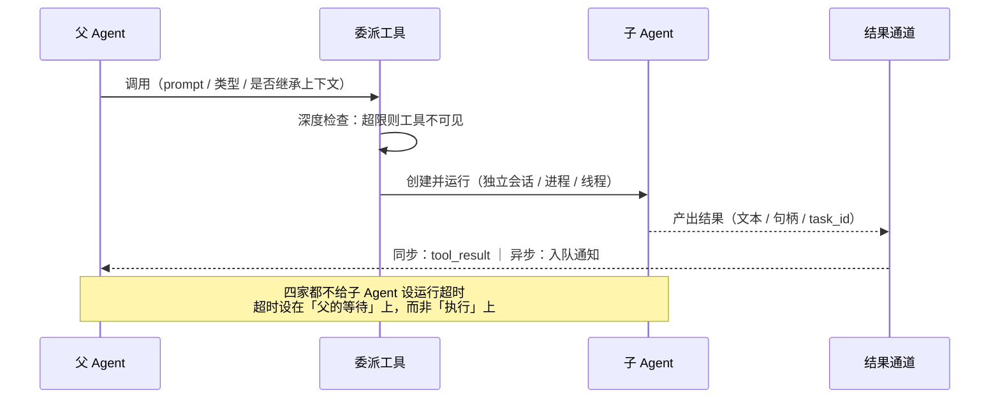

# 第 7 章：任务与子 Agent —— 把工作交给另一个 Agent

本章回答一个 Agent 如何把工作委派给「另一个 Agent」，以及被委派者如何被创建、驱动、通信、回收。**这一层的分歧是四家中最大的**：子 Agent 的本体是另一个操作系统进程、一个可被驱动的会话、线程图上的一个节点，还是一个一等任务对象——四种答案互不兼容，且各自推导出完全不同的上下文继承、深度限制与结果回灌策略。

> **本层定位**：L7，委派层。回答「一个 Agent 如何把工作交给另一个 Agent」，以及被委派者如何被创建、驱动、通信、回收。
>
> **前置依赖**：01（主循环，谁拥有调度权）、02（工具调用，委派入口本身是一个工具）、03（工具定义，子 Agent 工具如何被描述）、05（消息 / 会话模型，子 Agent 的上下文从哪来）、06（持久化，被委派者的会话如何落盘）。
>
> **分析对象**：
> - **pi** —— `packages/agent/src/harness/session/{types,session}.ts` + `harness/runtime/lane.ts`（Branch 游标与 lane 串行化）+ `packages/coding-agent/examples/extensions/subagent/index.ts`（子 Agent 是示例扩展，内核无此概念）
> - **deepseek-harness** —— `packages/subagent/subagent/src/{index,types,child-agent,depth,continuation}.ts` + `subagent-{in-process-driver,fork-in-process,spawn-in-process,acp,claude-code,codex}/src/*`
> - **codex** —— `codex-rs/core/src/agent/*` + `core/src/tools/handlers/multi_agents*.rs` + `agent-graph-store/src/*` + `ext/agent-message-board/src/*`
> - **Claude-Code** —— `src/Task.ts` + `src/tasks/*` + `src/tools/AgentTool/*` + `src/tools/Task{Output,Stop,Update}Tool/*`
>
> **易混点**：本层是四家**分歧最大**的一层，其中两处形态与直觉不同（见 4.1 与 4.3 开头）。

---

## 一、核心结论速览

1. **「子 Agent 是什么」没有共识，四家给出了四种本体**：pi 认为它是**另一个操作系统进程**（内核里甚至没有这个概念）；dsh 认为它是**一个可被「驱动」的会话**；codex 认为它是**线程图上的一个节点**；Claude-Code 认为它是**可创建、可观察、可停止的一等任务对象**。

2. **委派入口高度一致，返回契约高度不一致**：四家都是「给模型一个工具」，但工具返回的是**最终文本**（pi 示例、dsh 前台模式）、**agent 句柄**（codex 的 `agent_id`）、还是**task_id + 输出文件路径**（Claude-Code）——这决定了父 Agent 后续能否「再问一次」。

3. **「默认不继承父上下文」是 3/4 家的共识**：pi 的示例用 `--no-session`、dsh 的 `inheritsParentContext=false`、Claude-Code 的普通子 Agent 只拿到 `prompt` 一个字符串。**唯一例外是 Claude-Code 的 fork agent**，它继承父的完整消息历史 + 渲染好的 system prompt + 精确工具数组。

4. **深度限制上四家都选了最保守的值**：dsh `maxDepth` 默认 **1**、codex 有 thread spawn 深度上限（超限返回模型可见错误）、Claude-Code 在非内部构建下**直接禁用子 Agent 的 AgentTool**。只有 pi 的示例扩展未设限——因为它压根不在内核里。

5. **结果回灌分「同步」与「异步」两代，异步路径都刻意不唤醒空闲 Agent**：同步走 `tool_result`（pi / dsh 前台 / Claude-Code 同步）；异步走**入队消息**（Claude-Code 的 `<task-notification>`、codex 的 `notify_parent_of_terminal_turn`），且 codex 的消息板明确规定「通知准纳入与 turn 完成原子绑定，不启动新工作、不跨 turn 存活」。

---

## 二、本层职责与边界

### 2.1 子职责拆解

本层可拆成 7 个子职责。四家的架构差异，本质上是**对这 7 个问题给出的答案不同**：

| # | 子职责 | 要回答的问题 |
|---|---|---|
| ① | **委派决策** | 模型通过什么工具发起委派？是否存在「何时该委派」的引导？ |
| ② | **实体建模** | 子 Agent 在系统里是什么？有无独立 ID、状态、生命周期？ |
| ③ | **上下文构造** | 子 Agent 看到什么历史？什么工具？什么 system prompt？ |
| ④ | **驱动与生命周期** | 进程内还是进程外？前台还是后台？怎么结束？ |
| ⑤ | **通信** | 父↔子怎么传消息？平级 Agent 之间呢？ |
| ⑥ | **结果回灌** | 产物以什么形式回到父 Agent 的上下文？ |
| ⑦ | **资源与配额** | 递归深度、并发上限、内存、取消级联、孤儿回收 |

### 2.2 本层不管什么

- **不管单个 Agent 内部怎么循环** —— 那是 L1（主循环）的职责；本层只负责「把另一个 Agent 跑起来」。
- **不管工具怎么并发调度** —— 那是 L2（工具调度）。但两层有咬合：**子 Agent 通常以「工具」形式暴露给模型**，所以委派动作会经过 L2 的调度器与 L3 的 schema 投影。
- **不管上下文怎么压缩、会话怎么落盘** —— 那是 L4 / L6。但「子 Agent 的会话是否落盘、如何与父会话关联」是**本层**必须回答的（见 5.6）。

### 2.3 层次定位

```text
┌────────────────────────────────┐
│ L7 任务与子 Agent（本章）      │
│ 创建 → 驱动 → 通信 → 回收      │
│ 子 Agent 内部又是一整套 L1–L6  │
│ ⇒ 唯一会「递归回卷到自身」的层 │
└────────────────────────────────┘
   ▲
   │ 委派入口本身就是一个工具（L2 调用、L3 定义）
   │
 L1 主循环 ──── 单轮：模型 → 工具 → 决策
   │
   └─ L7 做的事：把「整件事」而非「一次调用」外包出去
```

**图 7-1**：L7 在运行时栈中的位置。它的特殊之处在于「递归回卷」——子 Agent 会再跑一遍 L1–L6，这也是深度限制必须存在的根本原因。

```text
L1 主循环 ──┬── L2 工具调用调度 ──→ L3 工具定义/投影
            │                          ↑
            └── L7 任务与子 Agent ──────┘   子 Agent 以「工具」形式暴露
                     │
                     ├── 复用 L5：消息模型 / 会话组织（子 Agent 的会话长什么样）
                     └── 复用 L6：持久化（子 Agent 的状态是否落盘、如何恢复）
```

**关键洞察**：本层是**唯一一层会递归回卷到自身**的层——子 Agent 内部同样运行 L1–L6 的完整栈（这正是「深度限制」必须存在的原因，见 6.1）。

---

## 三、概念对齐表

**同一个概念，四家分别叫什么、有没有这个能力**。空白格本身就是结论。

| 概念 | pi | deepseek-harness | codex | Claude-Code |
|---|---|---|---|---|
| **委派入口（模型侧工具）** | 扩展自定义（示例 `subagent`） | `subagent` | `spawn_agent`（V1 / V2 两代） | `Agent`（legacy 名 `Task`） |
| **子 Agent 实体** | 独立 `pi` 进程 | `SubagentRun` + 独立 Session | Thread（线程图节点） | Task（`taskId` + 输出文件） |
| **内核是否有一等概念** | **无**（`packages/agent` 零命中） | 有（10 个包） | 有（`core/src/agent` 12,298 行） | 有（7 种 TaskType） |
| **上下文继承** | 无（`--no-session`） | `spawn`=false / `fork`=true | `fork_turns: none \| all \| N` | 普通不继承 / `fork` 全量继承 |
| **驱动模型** | OS 进程 + stdout JSONL | 4 种 driver（进程内 2 + 进程外 2） | fork 线程 | 同进程 AsyncLocalStorage / 子进程 |
| **深度限制** | 示例未设限 | `maxDepth` 默认 **1** | thread spawn depth 上限 | 非 ant 构建禁用 AgentTool |
| **并发上限** | 示例 `MAX_CONCURRENCY=4` | `maxActiveSubagents` 默认 **8** | `max_threads`（CAS 递增） | 工具并发 10 / batch 建议 30 |
| **结果回灌** | 子进程输出文本 | `SubagentResult` | `notify_parent_of_terminal_turn` | `tool_result` 或 `<task-notification>` |
| **平级协作** | 无 | `send_message` / `interrupt_agent` | 消息板（channel/thread/post） | teammate + mailbox |
| **子会话持久化** | 不落盘（`--no-session`） | 独立 session 日志 + descriptor v3 | SQLite agent graph | sidechain transcript + outputFile |
| **角色 / 类型体系** | `~/.pi/agent/agents/*.md`（含 frontmatter） | `provider` + `persona` | `explorer` / `worker` 角色 TOML | `subagent_type`（6–7 种内置） |
| **只读探索特化** | 示例含 scout / planner / reviewer | 无专属角色 | `explorer`（鼓励并行多开） | `Explore`（禁 Edit/Write/Agent） |
| **「队友」（平级 Agent）** | 无 | 无 | 消息板 + 订阅 | `in_process_teammate` |
| **超时** | 无（未实现） | **运行本身无 wall-clock 超时** | 未提及 | `TaskOutput` 30s 默认 / 600s 上限 |

---

## 四、逐项目实现

```text
四家对「子 Agent 是什么」的四种答案（互不兼容）

  pi            另一个操作系统进程
                内核里甚至没有这个概念；由扩展层 spawn 一个独立 pi 进程

  dsh           一个可被「驱动」的会话
                10 个包构成驱动抽象：fork / in-process / spawn / ACP / SDK

  codex         线程图上的一个节点
                主体在 core/src/agent（12,298 行），沿线程 spawn 拓扑连接

  Claude-Code   可创建、可观察、可停止的一等任务对象
                Task 接口 + 7 种 TaskType + 7 个任务管理工具
```

**图 7-2**：四种本体论。后面所有维度（上下文继承、深度限制、结果回灌、回收方式）都是从这一句话推导出来的。

### 4.1 pi：两套正交机制，内核没有子 Agent

> **关键结论**：pi 有**两套互不相干**的机制——`Branch` 是「回到历史某点」的游标（同 session 内串行切换、不产生新实例、不隔离上下文），**不是子 Agent**；真正的子 Agent 由**扩展层 spawn 一个新进程**承担。

#### 4.1.1 内核的 `Branch` / `Lane`：游标 + 视图，不产生新 Agent

`Branch` 本身**不含历史**，历史在 `Entry` 的 `parentId` 链上；「当前活跃分支」由一个标量 tip 指定：

```ts
// packages/agent/src/harness/session/types.ts:521-528
export interface Branch {
	readonly name: string;
	getTipId(context: Context): Promise<string | null>;
	findEntries(query: BranchScan | undefined, context: Context): Promise<Entry[]>;
	findEntry(query: BranchScan | undefined, context: Context): Promise<Entry | undefined>;
	appendMessage(message: AgentMessage, context: Context): Promise<string>;
	appendCustomEntry(customType: string, data: JsonValue | undefined, context: Context): Promise<string>;
}
```

```ts
// packages/agent/src/harness/session/values.ts:158
export const branchTip = (branch: string) => value<string | null>("pi.branch.tip", branch);
```

创建分支**不复制历史**，只写一条 `branchTip(name) = at` 的指针：

```ts
// packages/agent/src/harness/session/session.ts:355-368
async createBranch(name: string, at: string | null, context: Context): Promise<Branch> {
	this.assertOpen();
	this.assertValidBranchName(name);
	await this.mutate(async (mutator) => {
		if ((await mutator.getValue(branchTip(name), context)) !== undefined) {
			throw new SessionBranchExistsError(name);
		}
		if (at !== null && !(await mutator.getEntries([at], context)).has(at)) {
			throw new SessionUnknownTargetError(at);
		}
		await mutator.commit([setValueWrite(branchTip(name), at)], context);
	}, context);
	return this.getOrCreateBranchObject(name);
}
```

**关键结论：同 session 内是串行切换，不支持并行驱动多分支。** 依据：每条 lane 命令都排在同一条 session mutation line 上（`packages/agent/src/harness/runtime/lane.ts:328-368` → `session.ts:243-270` 的 `beginMutation` 串行化）；单 lane 还有 `LaneBusy` 拒绝并发 operation（`lane.ts:575-587`）。应用层只驱动固定的 `"main"` lane。

分支的「探索结果回收」靠 `branch_summary`：当**带 `summarize` 的导航**离开分支时，计算 old/new 路径的最近公共祖先，把被放弃的那段压成摘要，写成 `branch_summary` entry 挂在返回点上：

```ts
// packages/agent/src/harness/runtime/drive/structural.ts:278-298（节选）
} else if (outcome.kind === "branch_summary") {
	const boundary = navigationBoundary(current.task);
	const entry: NewEntry<BranchSummaryEntry> = {
		id: outcome.resultEntryId,
		parentId: boundary.targetId,
		type: "branch_summary",
		fromId: meta.sourceTipId,
		summary: outcome.result.summary,
		details: { readFiles: ..., modifiedFiles: ... },
	};
	writes.push(setValue(branchTip(lane.name), boundary.targetId));
	...
	writes.push(insertEntry(entry), setValue(branchTip(lane.name), outcome.resultEntryId));
```

#### 4.1.2 真正的子 Agent：扩展层 spawn 独立进程

唯一示例位于 `packages/coding-agent/examples/extensions/subagent`，其自述第一句就是「**Spawns a separate `pi` process** for each subagent invocation, giving it an isolated context window」。

```ts
// packages/coding-agent/examples/extensions/subagent/index.ts:300-307, 344-350（节选）
const args: string[] = ["--mode", "json", "-p", "--no-session"];
const inheritsDispatchConfig = !agent.model;
const model = agent.model ?? dispatchDefaults.model;
if (model) args.push("--model", model);
...
const proc = spawn(invocation.command, invocation.args, {
	cwd: cwd ?? defaultCwd,
	shell: false,
	stdio: ["ignore", "pipe", "pipe"],
});
```

- **隔离来自新进程，不是分支树**：`--no-session` 意味着连 session 都不落盘。
- **结果解析**：逐行读 stdout 的 JSONL 事件流，抽取 `message_end` / `tool_result_end`（`index.ts:353-388`）。
- **三种编排模式**：single / parallel / chain（`index.ts:8-10, 471-721`），并行上限 `MAX_PARALLEL_TASKS = 8`、`MAX_CONCURRENCY = 4`（`index.ts:33-34`），用 `mapWithConcurrencyLimit` 调度（`index.ts:219-237, 645`）。
- **Agent 定义**从 `~/.pi/agent/agents/*.md`（带 frontmatter）发现。

#### 4.1.3 内核确实没有子 Agent 概念

在 `packages/` 内 grep `subagent|delegate|spawn`：**`packages/agent` 零命中**。所有命中都是无关物（chord 服务容器的 `spawn<T>`、`child_process.spawn` 工具调用、session 文件的 `newSession`）。

**pi 的答案**：内核只提供「会话树 + 游标」这一原语；「子 Agent」是**扩展作者用进程 + 事件流自己搭的东西**。这是四家中唯一的「框架不做、留给扩展」路线。

---

### 4.2 deepseek-harness：驱动抽象 + 跨项目适配

dsh 是四家中**子 Agent 抽象最完整**的：把「子 Agent」抽象成**一个可被多种 driver 驱动的会话**。

#### 4.2.1 包结构（10 个包）

| 包 | 职责 | src 行数 |
|---|---|---|
| `subagent` | 服务定义层：`ctx.subagents` provider 注册表 + 能力校验 + 会话编排 | 5,489 |
| `subagent-in-process-driver` | 共享 driver：在 `ctx.agents` 上驱动一个进程内子 Agent | 380 |
| `subagent-spawn-in-process` | 进程内 spawn 后端：全新子 Agent，无父上下文 | 70 |
| `subagent-fork-in-process` | 进程内 fork 后端：用父日志**已完成 turn 前缀**播种子 Agent | 96 |
| `subagent-acp` | 进程外 ACP 后端（Agent Client Protocol over ndjson stdio） | 825 |
| `subagent-dsh-sdk` | 进程外 SDK 后端：stdio JSON-RPC 驱动完整 DSH 运行时子进程 | 559 |
| **`subagent-claude-code`** | 一次性 Claude Code 后端（官方 Agent SDK） | 903 |
| **`subagent-codex`** | 一次性 Codex 后端（官方 `app-server` 协议） | 1,282 |
| `tool-subagent` | 模型面向的委派工具（`subagent`） | 1,215 |
| `tool-subagent-control` | 全局工具 `send_message` / `interrupt_agent` / `list_agents` | 303 |

#### 4.2.2 抽象接口：`SubagentProvider`

dsh 的接口不是 start/send/stop，而是「**能力声明 + 一次性启动 + 可选的可续会话**」：

```ts
// packages/subagent/subagent/src/types.ts:344（节选）
export interface SubagentProvider {
  readonly name: string
  readonly capabilities: SubagentCapabilities          // types.ts:130
  readonly inheritsParentContext: boolean
  readonly agentRouteDefaults?: { provider; model }
  start(request: ResolvedSubagentStartRequest): Promise<SubagentRun>
  prepareContinuable?(request: ContinuableCreateRequest): Promise<ContinuableCreateSpec>
}
```

运行句柄的语义很关键——**`result` 永不 reject**，失败转成 `stopReason: 'error'`：

```ts
// packages/subagent/subagent/src/types.ts:308-334（节选）
export interface SubagentRun {
  readonly id: SessionId
  readonly localAgent: Agent | undefined     // 进程外为 undefined
  readonly result: Promise<SubagentResult>   // 不 reject；失败转 stopReason:'error'
  dispose(): Promise<void>                   // 幂等
}
```

#### 4.2.3 四种驱动的取舍

| 后端 | 进程模型 | 上下文继承 | 能力 | 适用 |
|---|---|---|---|---|
| `spawn` | 同进程，全新子 Agent | `false` | 全 5 项 | 明确不需要父上下文的独立任务 |
| `fork` | 同进程，seed = 父日志前缀 | `true` | 全 5 项 | 需要「接着父的思路往下做」 |
| `acp` | 独立子进程 | `false` | **无** | 任意实现 ACP 的外部 agent |
| `dsh-sdk` | 独立完整 DSH 运行时子进程 | `false` | 仅 `agentOptions` | 需要完整隔离的 DSH |

fork 的 seed **只取到最后一个 `turn/end`**，避免把不完整的 turn 播进子 Agent（`packages/subagent/subagent-fork-in-process/src/index.ts:48-55`）。

#### 4.2.4 跨项目驱动：把 Claude-Code 与 codex 当作子 Agent

这是整个系列里最特别的一处——**dsh 能把本次研究的另外两个对象直接驱动为子 Agent**。

**Claude-Code 后端**用官方 Agent SDK，接入方式是把 SDK 的 CLI 子进程「投影」到共享的 subprocess 拥有者：

```ts
// packages/subagent/subagent-claude-code/src/run.ts:370-375
spawnClaudeCodeProcess: (options: SpawnOptions) => {
  const child = spec.spawn(claudeSpawnSpec(options, spec.disposeGraceMs))
  const process = new ManagedClaudeCodeProcess(child)
  capture(child, process); return process
}
```

`ManagedClaudeCodeProcess`（`.../claude-code/src/process.ts:67-159`）把 `SubprocessHandle` 适配为 SDK 的 `SpawnedProcess`。无人值守配置：`canUseTool` 恒 deny、`onElicitation` decline、`onUserDialog` cancel，`permissionMode` 默认 `dontAsk`（`run.ts:338-368, 56`）。

**Codex 后端**不用 SDK，直接跑官方包内的 `app-server --stdio`，协议是 JSON-RPC over stdio（行分帧）：

```ts
// packages/subagent/subagent-codex/src/run.ts:135-137
export function codexAppServerArgv(): string[] {
  return [process.execPath, CODEX_PACKAGE_BIN, 'app-server', '--stdio']
}
```

`CodexAppServerWire`（`.../codex/src/wire.ts:192`）管理单一 ephemeral thread/turn：`initialize` → `startThread(cwd)` → `runTurn(texts)`。权限模式映射到 `thread/start` 参数（`never` / `approve-for-me` / `dangerously-bypass-approvals-and-sandbox`，`wire.ts:32-43`）。

两者的共同点：**一次性、`inheritsParentContext=false`、无启动能力、workspace 来自父 session 的 cwd、失败文本只含固定安全事实、`dispose` 走 terminate → waitForExit 阶梯**。

#### 4.2.5 深度与配额

```ts
// packages/subagent/subagent/src/index.ts:200-203（节选）
// maxDepth 默认 1、maxActiveSubagents 默认 8
```

```ts
// packages/subagent/subagent/src/depth.ts:28-36（节选）
export function delegationDepthOf(agent: Agent): number {
  const runtime = agent.options.subagentDepth
  ...
  return Math.max(agent.session.header.delegationDepth ?? 0, runtime ?? 0)
}
```

注意 `Math.max`——**header 里的深度是单调下界，resume 不能降级**（否则一个被恢复的深子树可以绕过限制重新爆炸）。

```ts
// packages/subagent/subagent/src/child-agent.ts:50-59（节选）
export function resolveChildDepth(parent: Agent, maxDepth: number | undefined): number {
  const childDepth = delegationDepthOf(parent) + 1
  if (!Number.isSafeInteger(childDepth)) throw new RangeError(...)
  if (maxDepth !== undefined && childDepth > maxDepth) {
    throw new SubagentDepthError(childDepth, maxDepth)   // child-agent.ts:33-37
  }
  return childDepth
}
```

**工具白名单收窄**用 scoped `restrict()`：既从 prompt 里消失，也拒绝执行；未知名字 fail loud（`child-agent.ts:218`）。另外每个子 Agent 都会被注入一段「权限范围已冻结、不可扩权」的上下文，并把 approval 策略钉为 `never`（`child-agent.ts:172-176, 232, 246-253`）。

#### 4.2.6 可续会话与 cold resume

「可续子 Agent」 = **一个持久 Session + 至多一个进程内 Activation**。关联靠 session header 的 `parentSession` + `origin:'subagent'` + `delegationDepth`，父侧追加 `subagent/catalog` 事件、子侧追加 `subagent/descriptor`。

cold resume 时用 `sessionQuery.observeSession` 读子 session → `foldSubagentDescriptor` 还原 provider/persona/toolFilter → `materialize` → `agents.resume`（`packages/subagent/subagent/src/continuation.ts:406-456`）。`SUBAGENT_DESCRIPTOR_VERSION = 3`。descriptor **刻意不含** `subagentDepth`（防篡改）与 `outputSchema` / `maxTokens`（`descriptor.ts:12-19`）。

#### 4.2.7 四个模型侧工具

- **`subagent`**（`packages/subagent/tool-subagent/src/index.ts:381`）：参数 `description`、`prompt`，可选 `provider` / `model` / `reasoning_effort` / `run_in_background`。输出是 **oneOf 三态**：`{kind:'background', jobId}` / `{kind:'continuable', subagentId}` / `{kind:'foreground', runId, output}`（`:430-459`）。
- **`send_message`**（`packages/subagent/tool-subagent-control/src/index.ts:29`）：`{agent_id, message}` → `{messageId}`；**仅对直接可续子或直接父生效**（`:66-72`）。
- **`interrupt_agent`**（`:77`）：`{agent_id}` → `{accepted}`，以 `{kind:'ancestor', agent:caller}` 授权（`:113`）。
- **`list_agents`**（`.../list-agents.ts:87`）：`scope ∈ children|descendants`；`children` 只列**可续**子，一次性子仅作遍历节点。

---

### 4.3 codex：线程图 + 两代协议

> **关键结论**：codex 多 Agent 的实现主体在 **`core/src/agent/`（12,298 行）** 与 **`core/src/tools/handlers/multi_agents*.rs`（约 5,300 行）**；独立 crate 中有一部分并未接入主循环。

#### 4.3.1 crate 盘点：哪些在用、哪些没用

| crate | 行数 | 状态 |
|---|---|---|
| `agent-graph-store` | 505 | **在用**：`core/Cargo.toml:22-23` 依赖，`ThreadManagerState.agent_graph_store` 持有（`core/src/thread_manager.rs:26-27`） |
| `agent-roles` | 615 | **在用**：角色发现与解析（`loader.rs:23-117`） |
| `collaboration-mode-templates` | 163 | **在用**：仅两段 prompt 文本，运行期经 `CollaborationMode` 注入 world state |
| `ext/agent-message-board` | 3,259 | **门控**：需 `AgentMessageBoard` + `MultiAgentV2` 同时开启且非 ephemeral |
| `cloud-tasks` / `-client` | 5,418 / 1,142 | **与子 Agent 无关**：这是「云端任务」功能（`TaskId`/`TaskStatus`），走 `chatgpt.com/backend-api` |
| `external-agent-migration` | 16,405（多测试） | 导入外部 agent 配置，含 `subagents.rs:57-87` 把外部 `*.md` 转成 `agents/<name>.toml` |
| **`ext/agent`** | 194 | **未接入**：`AgentRunner` 在 `core/src` 内零引用 |
| **`agent-identity`** | 1,000 | **无关**：加密身份（ed25519/crypto_box），消费方是 `login` / `cloud-config` / `model-provider`，**core 不依赖它** |

#### 4.3.2 Agent 图的真实形态：线程 spawn 拓扑

```rust
// codex-rs/agent-graph-store/src/store.rs:13-60（节选）
pub trait AgentGraphStore: Send + Sync {
    fn upsert_thread_spawn_edge(&self, parent_thread_id: ThreadId, child_thread_id: ThreadId,
        status: ThreadSpawnEdgeStatus) -> AgentGraphStoreFuture<'_, ()>;
    fn set_thread_spawn_edge_status(&self, child_thread_id: ThreadId,
        status: ThreadSpawnEdgeStatus) -> AgentGraphStoreFuture<'_, ()>;
    fn list_thread_spawn_children(&self, parent_thread_id: ThreadId,
        status_filter: Option<ThreadSpawnEdgeStatus>) -> AgentGraphStoreFuture<'_, Vec<ThreadId>>;
    fn list_thread_spawn_descendants(&self, root_thread_id: ThreadId,
        status_filter: Option<ThreadSpawnEdgeStatus>) -> AgentGraphStoreFuture<'_, Vec<ThreadId>>;
}
```

```rust
// codex-rs/agent-graph-store/src/types.rs:5-12
pub enum ThreadSpawnEdgeStatus { Open, Closed }
```

要点：
- **节点 = `ThreadId`**（一个 thread 就是一个 agent），**边 = 有向 parent → child**，带 `Open`/`Closed` 生命周期状态。
- 每个 child 只允许一个父；`status_filter` **作用于每一跳**（关闭的边其整棵子树被剪掉）。
- `list_..._descendants` 按「深度优先 → thread id」**稳定排序**（便于确定性重放）。
- 存储是 SQLite（`codex_state::StateRuntime`），`LocalAgentGraphStore` 只是薄适配层。

#### 4.3.3 角色体系：只能裁剪，不能扩权

```rust
// codex-rs/agent-roles/src/agent_role_config.rs:9-18
pub struct AgentRoleConfig {
    pub description: Option<String>,       // spawn 工具里展示的角色说明
    pub config_file: Option<PathBuf>,      // 角色专属 config 层
    pub nickname_candidates: Option<Vec<String>>,
}
```

内置角色集中在 `core/src/agent/role.rs:341-401`：`default`、`explorer`（只读式代码问答，**鼓励并行多开**）、`worker`（执行/生产工作，强调写入所有权）；`awaiter` 被注释掉并标注 「Awaiter is temp removed」。

权限模型写得很明确：

```rust
// codex-rs/core/src/agent/role.rs:1-4
//! Roles may customize the child or reduce its capabilities, but never replace the parent
//! session's authority.
```

```rust
// codex-rs/core/src/agent/role.rs:91-105（节选）
if let Some(features) = role_config.features {
    for (key, enabled) in features.entries() {
        if !enabled
            && let Some(feature @ (Feature::ShellTool | Feature::Apps | Feature::Plugins
                | Feature::MemoryTool | Feature::RequestPermissionsTool)) = feature_for_key(&key)
        { overrides.features.insert(feature.key().to_string(), false); }
    }
}
```

即**只有白名单内的 feature 可以被「关闭」**，skills 同样只保留 `!enabled` 项。子角色永远无法获得父角色没有的权限。

#### 4.3.4 两代委派协议

| | V1（`multi_agent_v1`，默认开） | V2（`multi_agent_v2`，**默认 false**） |
|---|---|---|
| 工具集 | `spawn_agent` / `send_input` / `resume_agent` / `wait_agent` / `close_agent` | `spawn_agent` / `send_message` / `followup_task` / `wait_agent` / `interrupt_agent` / `list_agents` |
| `spawn_agent` 参数 | `message \| items \| agent_type \| fork_context \| model \| reasoning_effort` | 额外必填 `task_name`，用 `fork_turns: none\|all\|N` 取代 `fork_context` |
| 返回值 | `agent_id` + `nickname` | `task_name`（+ `nickname`） |
| 寻址 | `agent_id` | `AgentPath`（`task_name` 拼在父路径下） |

**关键的分级门控**：深度超限时，**连工具都不给模型**，而不是给了再报错：

```rust
// codex-rs/core/src/tools/spec_plan.rs（节选，collab_tools_enabled）
match turn_context.multi_agent_version {
    MultiAgentVersion::Disabled => false,
    MultiAgentVersion::V1 => !exceeds_thread_spawn_depth_limit(...), // 超深度连工具都不给
    MultiAgentVersion::V2 => turn_context.session_source.get_agent_path().is_none()
        || model_info.multi_agent_version == Some(MultiAgentVersion::V2),
}
```

超限时模型收到的是可直接执行的指引，而不是一个技术错误码：`"Agent depth limit reached. Solve the task yourself."`（`multi_agents/spawn.rs:71-77`）。

#### 4.3.5 消息板：不唤醒空闲 Agent

数据模型：`PostMetadata{ message_id, channel_name, author: AgentPath, thread_id, created_at }` + `SubscriptionState{ channel_name, thread_id, target_agent, enabled, last_message_id }`（`ext/agent-message-board/src/types.rs:12-64`）。

投递语义**以定向为主、非广播**：`PostDestination = Channel(String) | NewChannel(String) | Thread(Uuid)`，另有 `agents_to_notify: Vec<AgentPath>`（≤256，重复只通知一次）。整个 board 由一个 `SessionId` 限定，「每次操作都校验调用者成员资格」。

最有价值的一条设计约束写在注释里：

```rust
// codex-rs/ext/agent-message-board/src/host.rs:17-37（注释）
/// Notification admission is atomic with turn completion: inactive agents
/// are skipped, and no notification may start work or survive into a later turn.
```

core 侧的适配器落成 `inject_if_running(...)`：找不到线程即 `SkippedInactive`，且用 `InterAgentCommunication::new(..., trigger_turn=false)`（`core/src/agent_message_board.rs:143-189`）。**发布后即便通知失败，内容仍可读**（写与通知解耦，`local.rs:166-175`）；`MAX_POST_BYTES = 64KiB`。

工具 9 个：`create_channel / get_channels / list_threads / search_posts / read_thread / read_post / subscribe / unsubscribe / post`。

#### 4.3.6 与主循环的集成：深度集成，不是「未启用」

证据链：`core/Cargo.toml:22-23` 依赖 graph-store 与 roles → `core/src/lib.rs:57` 重导出 `AgentControl` → `Session` 持有 `agent_control: LocalAgentControl`（`session/mod.rs:460`）→ turn 级注入 `multi_agent_version`（`session/turn_context.rs:345, 1184-1194`）与 `collaboration_mode`（`turn.rs:1263`）→ 工具面由 `tools/spec_plan.rs:1246` 装配。

明确**未启用/骨架**的部分已在 (1) 表中列出（`ext/agent`、`agent-identity`、`cloud-tasks`，以及默认关闭的 V2 与消息板）。

#### 4.3.7 并发与回收

- **并发上限**：`AgentRegistry.total_count` CAS 递增 + `max_threads`（`core/src/agent/registry.rs:89-108, 330-346`），槽位由 `SpawnReservation::Drop` **自动回收**；V2 上限 = `max_concurrent_threads_per_session - 1`。执行期另有 `AgentExecutionLimiter`（仅 V2 SubAgent 生效）与 LRU 驱逐 `V2Residency`。
- **中断**：`interrupt_spawned_agent` 拒绝 root 与自身目标；对已卸载/已死的目标视为成功且**不重载**（`control/interrupt.rs:17-52`）。
- **孤儿回收**：`close` 关闭 agent **及其全部 descendants**（`agent/api.rs:74-75`）；**已完成 agent 仍占用并发额度直到被 close**（工具描述 `spec.rs:328`）；V2 驱逐时保存 `evicted_environments` 以便恢复。
- **结果回传**：子 agent 终态由 `notify_parent_of_terminal_turn` 以 `trigger_turn=false` 投给父（`control/completion.rs:25-130`）。

---

### 4.4 Claude-Code：任务对象化 + 队友

Claude-Code 把子 Agent 做成**一等任务对象**：有 ID、有状态机、有输出文件、有 6 个专用管理工具。

#### 4.4.1 Task 的本体：接口极薄，状态在 AppState

```ts
// src/Task.ts:6-57（节选）
export type TaskType =
  | 'local_bash' | 'local_agent' | 'remote_agent'
  | 'in_process_teammate' | 'local_workflow' | 'monitor_mcp' | 'dream'

export type TaskStatus = 'pending' | 'running' | 'completed' | 'failed' | 'killed'

export function isTerminalTaskStatus(status: TaskStatus): boolean {
  return status === 'completed' || status === 'failed' || status === 'killed'
}
export type TaskStateBase = {
  id: string; type: TaskType; status: TaskStatus; description: string
  toolUseId?: string; startTime: number; endTime?: number
  totalPausedMs?: number; outputFile: string; outputOffset: number
  notified: boolean
}
```

```ts
// src/Task.ts:69-76
export type Task = {
  name: string
  type: TaskType
  kill(taskId: string, setAppState: SetAppState): Promise<void>
}
```

`Task` 只暴露 `kill` 一个方法——**创建与渲染不再多态**。ID 前缀表在 `Task.ts:79-87`：`b`=bash、`a`=local_agent、`r`=remote_agent、`t`=teammate、`w`=workflow、`m`=monitor、`d`=dream。

**注意 `outputFile` + `outputOffset`**：子 Agent 的输出落磁盘，父用 offset 增量读取。这是「任务对象化」的物理基础。

#### 4.4.2 七种 Task 与两种非标准语义

| TaskType | 何时创建 | 职责 |
|---|---|---|
| `local_bash` | BashTool 后台化 / 长命令 | 托管后台 shell 进程，含 stall watchdog |
| `local_agent` | AgentTool（同步或异步） | 子 Agent 后台执行容器 |
| `remote_agent` | 远程会话 / `ultraplan` / `ultrareview` | 轮询远端会话事件、日志 |
| `in_process_teammate` | 团队 `spawnTeammate`（同进程） | 队友生命周期、计划审批、收发消息 |
| `local_workflow` | workflow 脚本 | **本构建为 stub**（`isX = () => false`） |
| `monitor_mcp` | monitor 工具 | **本构建为 stub** |
| `dream` | `autoDream` 记忆整合子 Agent | 把隐藏的 fork agent **显式化为 UI 任务** |

**「Dream」**：记忆整合子 Agent（4 阶段 orient / gather / consolidate / prune），原本不可见；`DreamTask` 只做 UI 暴露，不改变 dream agent 本身——源码注释直言 「pure UI surfacing via the existing task registry」（`src/tasks/DreamTask/DreamTask.ts:1-4`）。其 `kill` 会 `abortController.abort()` 并 `rollbackConsolidationLock(priorMtime)` 回滚锁（`:136-155`）。

**「Teammate」**：团队协作实体，`agentId` 形如 `researcher@my-team`：

```ts
// src/tasks/InProcessTeammateTask/types.ts:13-20
export type TeammateIdentity = {
  agentId: string   // e.g., "researcher@my-team"
  agentName: string // e.g., "researcher"
  teamName: string
  color?: string
  planModeRequired: boolean
  parentSessionId: string // Leader's session ID
}
```

与 `local_agent` 的关键差异：同 Node 进程用 **AsyncLocalStorage** 隔离；带 `isIdle` / `shutdownRequested` / `awaitingPlanApproval` 状态。

这里有一条**极有价值的线上数据**：

```ts
// src/tasks/InProcessTeammateTask/types.ts:96-101（注释）
// BQ 分析记录鲸鱼会话 2 分钟起 292 个 agent 达 36.8GB RSS
```

即：进程内 Agent 的**内存爆炸风险是被实测证实过的**，这也是为什么 roster 必须扁平（见 6.8）。

#### 4.4.3 模型侧工具：AgentTool + 6 个任务管理工具

```ts
// src/tools/AgentTool/AgentTool.tsx:82-101（节选）
const baseInputSchema = lazySchema(() => z.object({
  description: z.string().describe('A short (3-5 word) description of the task'),
  prompt: z.string().describe('The task for the agent to perform'),
  subagent_type: z.string().optional().describe('The type of specialized agent...'),
  model: z.enum(['sonnet','opus','haiku']).optional(),
  run_in_background: z.boolean().optional(),
}));
// fullInputSchema 追加: name / team_name / mode / isolation('worktree'|'remote') / cwd
```

六个任务管理工具（`TaskCreateTool` / `TaskGetTool` / `TaskListTool` / `TaskUpdateTool` / `TaskStopTool` / `TaskOutputTool`）都 `isEnabled: isTodoV2Enabled()` 且标记 `isConcurrencySafe`。

其中 `TaskOutputTool` 的语义值得单独看——**它是父观察子的唯一通道**：

```ts
// src/tools/TaskOutputTool/TaskOutputTool.tsx:30-34
const inputSchema = lazySchema(() => z.strictObject({
  task_id: z.string().describe('The task ID to get output from'),
  block: semanticBoolean(z.boolean().default(true)).describe('Whether to wait for completion'),
  timeout: z.number().min(0).max(600000).default(30000).describe('Max wait time in ms')
}))
```

返回 `retrieval_status: 'success' | 'timeout' | 'not_ready'`；对 `local_agent` 优先返回内存中的 `result`（干净的最终答案）而非磁盘 JSONL（`:91-105`）。

`TaskStopTool` 带一个 legacy 别名：`aliases: ['KillShell']`，输入同时接受 `task_id` 与已废弃的 `shell_id`（`src/tools/TaskStopTool/TaskStopTool.ts:10-19, 44`）。

#### 4.4.4 内置 Agent 类型与工具白名单收窄

`getBuiltInAgents()`（`src/tools/AgentTool/builtInAgents.ts:22-72`）装配：`general-purpose`（`tools:['*']`）、`Explore`（只读，disallowed 含 Edit/Write/NotebookEdit/**Agent**/ExitPlanMode，外部 model 用 `haiku`）、`Plan`（复用 Explore 工具、`model:'inherit'`）、`statusline-setup`、`claude-code-guide`、门控的 `verification`，以及 `FORK_AGENT`（`agentType:'fork'`，`tools:['*']`，`permissionMode:'bubble'`，`maxTurns 200`）。

收窄逻辑是一个显式白名单过滤器：

```ts
// src/tools/AgentTool/agentToolUtils.ts:70-116（节选）
export function filterToolsForAgent({ tools, isBuiltIn, isAsync=false, permissionMode }) {
  return tools.filter(tool => {
    if (tool.name.startsWith('mcp__')) return true          // MCP 全放行
    if (toolMatchesName(tool, EXIT_PLAN_MODE_V2_TOOL_NAME) && permissionMode === 'plan') return true
    if (ALL_AGENT_DISALLOWED_TOOLS.has(tool.name)) return false
    if (!isBuiltIn && CUSTOM_AGENT_DISALLOWED_TOOLS.has(tool.name)) return false
    if (isAsync && !ASYNC_AGENT_ALLOWED_TOOLS.has(tool.name)) {
      if (isAgentSwarmsEnabled() && isInProcessTeammate()) {
        if (toolMatchesName(tool, AGENT_TOOL_NAME)) return true
        if (IN_PROCESS_TEAMMATE_ALLOWED_TOOLS.has(tool.name)) return true
      }
      return false
    }
    return true
  })
}
```

白名单常量在 `src/constants/tools.ts`，其中**递归防护**直接写在一行里：

```ts
// src/constants/tools.ts:36-46（节选）
// ALL_AGENT_DISALLOWED_TOOLS
...(process.env.USER_TYPE === 'ant' ? [] : [AGENT_TOOL_NAME]),  // 非内部构建禁 Agent，防递归嵌套
```

三份白名单的语义边界很清楚：
- `ASYNC_AGENT_ALLOWED_TOOLS`（:55-71）：Read/WebSearch/TodoWrite/Grep/WebFetch/Glob/Shell 组/Edit/Write/NotebookEdit/Skill/SyntheticOutput/ToolSearch/Enter&ExitWorktree
- `IN_PROCESS_TEAMMATE_ALLOWED_TOOLS`（:77-88）：TaskCreate/Get/List/Update + SendMessage（+ `AGENT_TRIGGERS` 时 Cron 组）
- `COORDINATOR_MODE_ALLOWED_TOOLS`（:107-112）：Agent/TaskStop/SendMessage/SyntheticOutput

#### 4.4.5 上下文继承：普通子 Agent 不继承，fork 全量继承

**普通子 Agent 只看一个 prompt 字符串**：

```ts
// src/tools/AgentTool/AgentTool.tsx:538-540（节选）
promptMessages = [createUserMessage({ content: prompt })]
```

**fork 子 Agent 继承父的完整历史**（`AgentTool.tsx:630` 的 `forkContextMessages = toolUseContext.messages`）：`buildForkedMessages` 克隆父 assistant 的全量 `tool_use` + 相同的占位 `tool_result` + 每个子 Agent 独享的 directive（`forkSubagent.ts:107-169`）；`useExactTools:true` 还会继承 `thinkingConfig` / `querySource`（`runAgent.ts:668-694`）。system prompt 侧，fork 直接用父**已渲染好的字节**（`AgentTool.tsx:495-512`），普通路径才走 `getSystemPrompt()`（`:513-541`）。

**这是四家中唯一的「全量继承」路径**，目的是最大化 prompt cache 命中。

#### 4.4.6 结果回灌：两条通道

- **同步子 Agent** → 走 `tool_result`。`mapToolResultToToolResultBlockParam` 在 `status:'completed'` 分支拼 `contentOrMarker + agentId/usage trailer`（`AgentTool.tsx:1340-1373`）。
- **异步子 Agent** → 走 **`<task-notification>` XML 消息**入队给模型，**不是** tool_result。`enqueueAgentNotification` 组装 `task_id / output_file / status / summary / result / usage / worktree`（`src/tasks/LocalAgentTask.tsx:197-262`），且**仅在 `notified` 原子翻转后发送**，防重复通知（`:224-240`）。

#### 4.4.7 生命周期与并发

- **创建**：`registerAsyncAgent`（`LocalAgentTask.tsx:466-515`）或 `registerAgentForeground`（`:526-614`，带 auto-background 定时器，默认 120s）。
- **后台化**：前台同步 agent 用 `Promise.race([nextMessage, backgroundSignal])`（`AgentTool.tsx:883-897`）；Ctrl+B 走 `backgroundAll`。
- **并发上限**：工具批次并发 `CLAUDE_CODE_MAX_TOOL_USE_CONCURRENCY` 默认 **10**（`src/services/tools/toolOrchestration.ts:8-12`）；只读/并发安全工具批并发执行、否则串行（`:26-67`）。内置 batch skill 另外建议单次 `MAX_AGENTS = 30`。

---

## 五、横向对比矩阵

### 5.1 委派入口与实体建模

| 维度 | pi | dsh | codex | Claude-Code | 共识度 |
|---|---|---|---|---|---|
| 模型侧入口 | 扩展自定义工具 | `subagent` | `spawn_agent` | `Agent` | 4/4 都是工具 |
| 实体 ID | 无（仅进程） | `SessionId` | `ThreadId` / `AgentPath` | `taskId`（带类型前缀） | 3/4 有显式 ID |
| 实体状态机 | 无 | Activation（至多一个） | `PendingInit/Running/Interrupted/Completed/Errored/Shutdown/NotFound` | `pending/running/completed/failed/killed` | 3/4 有状态机 |
| 返回值 | 最终文本 | oneOf 三态（前台/后台/可续） | `agent_id` + nickname | `task_id` + outputFile | **0/4 相同** |
| 能否「再问一次」 | 否（一次性进程） | 可（可续会话） | 可（`send_input`/`send_message`） | 可（SendMessage / TaskOutput 轮询） | 3/4 支持 |

### 5.2 上下文继承

| 维度 | pi | dsh | codex | Claude-Code | 共识度 |
|---|---|---|---|---|---|
| 默认继承 | 否（`--no-session`） | 否（spawn） | `fork_turns: none` | 否（仅 prompt） | **4/4 默认不继承** |
| 可选继承 | 无 | 有（fork 后端） | 有（`all` / `N`） | 有（fork agent 全量） | 3/4 提供但非默认 |
| 继承粒度 | — | 父日志**已完成 turn** 前缀 | 前 N 轮 / 全部 | 完整消息 + 渲染好的 prompt + 精确工具数组 | 3/4 按轮次 |
| 工具集 | 由 CLI 参数 | scoped `restrict()` | 角色 feature 裁剪 | 三份白名单 | 4/4 都会收窄 |
| 是否可扩权 | — | 否（冻结） | 否（只能关闭 feature） | 否（白名单） | **3/3 都不可扩权** |

### 5.3 驱动与进程模型

| 维度 | pi | dsh | codex | Claude-Code | 共识度 |
|---|---|---|---|---|---|
| 进程内 | 无 | spawn / fork | **是**（fork 线程） | `in_process_teammate` | 3/4 有 |
| 进程外 | **是**（唯一的） | acp / dsh-sdk / claude-code / codex | 无 | `local_agent` 子进程 / `remote_agent` | 3/4 有 |
| 隔离手段 | OS 进程边界 | 进程边界 / Cordis scope | 线程 + `AgentExecutionLimiter` | AsyncLocalStorage / 独立进程 | 4/4 各不同 |
| 前台/后台 | 无此区分 | `run_in_background` | `wait_agent` 阻塞或不等 | `run_in_background` + 120s 自动转后台 | 3/4 有 |
| 跨实现驱动 | 无 | **有（claude-code / codex）** | 无 | 无 | **仅 dsh** |

### 5.4 通信与结果回灌



**图 7-3**：委派链路的时序。注意两处四家共识：深度检查放在「工具是否可见」而非「调用是否报错」，以及超时只加在父的等待侧。

| 维度 | pi | dsh | codex | Claude-Code | 共识度 |
|---|---|---|---|---|---|
| 父→子（增量指令） | 无 | `send_message` | `send_input` / `send_message` | SendMessage | 3/4 |
| 子→父（结果） | 进程 stdout | `SubagentResult` | `notify_parent_of_terminal_turn` | tool_result / `<task-notification>` | 4/4 方式不同 |
| 父观察子进度 | 无 | `list_agents` | `list_agents` | `TaskOutput`（阻塞/轮询） | 3/4 |
| 平级通信 | 无 | `send_message`（限直接父/子） | 消息板（channel/thread/subscription） | teammate + mailbox | 3/4 |
| 广播 | 无 | 无 | 有（`agents_to_notify`，非默认） | `to: "*"` | 2/4 |
| 空闲 Agent 是否被唤醒 | — | 否 | **明确否**（通知与 turn 原子绑定） | 否（终态丢弃） | 2/2 一致 |

### 5.5 资源配额

| 维度 | pi | dsh | codex | Claude-Code | 共识度 |
|---|---|---|---|---|---|
| 递归深度 | 示例未设限 | `maxDepth` 默认 **1** | thread spawn depth 上限 | 非 ant 禁 AgentTool | **3/4 严格限制** |
| 超限行为 | — | 启动前抛 `SubagentDepthError` | **连工具都不给** + 模型可见错误 | 工具不存在 | 3/3 都在**工具层**拦截 |
| 并发上限 | 示例 4 | `maxActiveSubagents` 默认 **8** | `max_threads` CAS + 槽位自动回收 | 工具并发 10 / batch 30 | 4/4 都有 |
| 额度回收 | — | 子优先 dispose + slot 归还 | `SpawnReservation::Drop` | `evictTerminalTask` 终态 GC | 3/3 自动回收 |
| 取消级联 | 无 | 父取消 → 子先于父释放 | `close` 关闭全体 descendants | 子随父 abort，**但后台 agent 故意不链接父** | 3/4 全量，1/4 故意断开 |

### 5.6 持久化与恢复

| 维度 | pi | dsh | codex | Claude-Code | 共识度 |
|---|---|---|---|---|---|
| 子会话是否落盘 | 否（`--no-session`） | 是（独立 session 日志） | 是（SQLite agent graph） | 是（sidechain transcript） | 3/4 落盘，pi 不做 |
| 与父的关联 | — | header `parentSession` + `origin:'subagent'` | 图中 parent→child 边 | `parentSessionId` | 3/4 有显式父子关联 |
| 恢复能力 | 无 | **cold resume**（descriptor v3） | 图可查，env 驱逐后可恢复 | 从 sidechain 重建 | 3/4 可恢复，机制各异 |
| 输出形态 | 进程 stdout | Result 对象 | 父收通知 | `outputFile` + `outputOffset` 增量读 | 4/4 都有，形态各异 |

---

## 六、异常与降级

格式：**场景 → 四家做法 → 源码依据 → 设计理由**。

### 6.1 递归委派（子 Agent 再开子 Agent）

- **pi**：无内核约束。示例扩展本身不支持嵌套（它 spawn 的是无 session 的进程）。
- **dsh**：`delegationDepth + 1 > maxDepth` 即拒。**默认 1，也就是默认禁止嵌套**。
- **codex**：`exceeds_thread_spawn_depth_limit` → 直接不给工具。
- **Claude-Code**：非内部构建下，子 Agent 的工具池里**根本没有 `Agent` 工具**。
- **依据**：`child-agent.ts:50-59`；`spec_plan.rs`（`collab_tools_enabled`）；`constants/tools.ts:40-41`。
- **设计理由**：本层会**递归回卷**到完整运行时栈（2.3）。每多一层，token 成本、延迟、内存、失败面都是**乘性**增长，而边际收益通常递减。四家中有三家选了「默认只允许一层」，是经过权衡的保守选择。

### 6.2 深度超限的表现形式

- **dsh**：启动前抛 `SubagentDepthError`（异常路径）。
- **codex**：**工具根本不出现**在模型的可用工具列表里；若在边缘情况下触发，返回的是可执行的建议 `"Agent depth limit reached. Solve the task yourself."`。
- **Claude-Code**：工具缺失（与 codex 同路）。
- **依据**：`spec_plan.rs`；`multi_agents/spawn.rs:71-77`。
- **设计理由**：**「不存在的工具」优于「会报错的工具」**。给模型一个它不该用的工具，就等于邀请它去试探；而缺失的工具会自然引导模型「自己解决」。codex 的错误文案甚至直接把替代策略写进去了。

### 6.3 并发超限

- **dsh**：`ActivationPool.reserve` 超限返回 `ACTIVATION_LIMIT_REACHED`（默认 8）。
- **codex**：`AgentRegistry.total_count` CAS 递增 + `max_threads`；槽位由 `SpawnReservation::Drop` 自动归还。**注意：已完成的 agent 仍占用额度直到被 `close`**。
- **Claude-Code**：工具批次并发默认 10；只读批并发、写入批串行。
- **依据**：`continuation-activation.ts:45-56`；`registry.rs:89-108, 330-346`；`toolOrchestration.ts:8-12, 26-67`。
- **设计理由**：codex「完成不等于释放」这一点值得注意——它把额度回收与**生命周期显式关闭**绑定，而不是与任务结束绑定。好处是父 Agent 可以在子任务完成后仍然向它追问（`send_input`）；代价是父必须记得 `close`，否则额度会被已完成的僵尸占满。

### 6.4 子 Agent 失败或崩溃

- **pi**：子进程非零退出，示例里按 exit code 处理。
- **dsh**：`result` **永不 reject**，统一转 `stopReason: 'error'` + ≤4096B 诊断文本。
- **codex**：终态进 `Errored(String)`，经 `notify_parent_of_terminal_turn` 回传。
- **Claude-Code**：异步走 `failAgentTask` + `enqueueAgentNotification(status:'failed')` 并附 error；同步则保留部分消息，**只有当整轮没有产生任何 assistant 消息时才 rethrow**。
- **依据**：`types.ts:308-334`；`out-of-process.ts:192-219`；`agentToolUtils.ts:670-681`；`AgentTool.tsx:1223-1234`。
- **设计理由**：两处设计很有代表性——① dsh 用「**用值表达失败而非异常**」让父 Agent 的代码路径统一；② Claude-Code 同步路径「**尽量保留部分产出**」，因为子 Agent 跑到一半的中间结果对父通常仍有价值，直接 rethrow 会让这些工作白费。

### 6.5 父 Agent 被取消

- **dsh**：父取消 → 子收到 `agent.cancel({kind:'parent'})`，**子先于父释放**（保证子不会在父已死的情况下继续写）。
- **codex**：`close` 会关闭目标 agent **及其全部 descendants**。
- **Claude-Code**：`registerAsyncAgent(parentAbortController)` 用 `createChildAbortController` 让子随父 abort；**但后台 agent 故意不链接父 controller**——ESC 不会杀掉后台任务，必须显式 `TaskStop`。
- **依据**：`continuation-activation.ts:808-830`；`agent/api.rs:74-75`；`LocalAgentTask.tsx:460-486`；`AgentTool.tsx:694-697`。
- **设计理由**：这里有一个真实的取舍冲突——「级联取消」保证一致性，但用户按 ESC 的本意往往是「停下当前这轮对话」，不是「杀掉我刚派出去跑 10 分钟的后台任务」。Claude-Code 选择**按意图区分**（前台随父死、后台独立生存），代价是可能留下孤儿（由 6.6 的回收机制兜底）。

### 6.6 孤儿回收

- **dsh**：子优先 dispose + slot 归还；归档 session 会**取消其 running 后代**（`archive-admission.ts:30-39`）；`inbox.close` 与 `subprocessRunHandle.dispose` 都做**幂等记忆化**。
- **codex**：`close` 递归关闭 descendants；V2 驱逐时保存 `evicted_environments` 以便恢复。
- **Claude-Code**：四层防护——① `registerCleanup` 进程退出清理；② `killShellTasksForAgent` 杀掉 agent 遗留的 bash 并 `dequeueAllMatching`；③ `runAgent` 的 finally 清 todos/MCP/skills/perfetto；④ `evictTerminalTask` 仅在「终态 + 已通知」后 GC（保留/驱逐宽限 30s）。
- **依据**：`continuation-activation.ts:841-867`；`killShellTasks.ts:53-76`；`runAgent.ts:816-859`；`framework.ts:125-144`。
- **设计理由**：**子 Agent 会衍生出不属于它的资源**（bash 进程、MCP 连接、临时目录）。只回收「agent 对象」是不够的，必须追踪「它曾经创建了什么」。Claude-Code 的 `killShellTasksForAgent` 是四家中唯一显式处理「agent 遗留子进程」的实现。

### 6.7 运行超时

- **dsh**：**运行本身没有 wall-clock 超时**；只有 teardown/shutdown 有界（ACP EOF 6s、SIGTERM→KILL 3s、SDK shutdown 1s）。
- **Claude-Code**：`TaskOutput` 的等待有超时（默认 30s / 上限 600s），但这只约束「父等多久」，**不杀子**。
- **pi / codex**：未发现运行期超时机制。
- **依据**：`acp/src/run.ts:83-86, 193-213`；`dsh-sdk/src/index.ts:90`；`TaskOutputTool.tsx:33`。
- **设计理由**：**四家都不给子 Agent 设运行超时**，这不是遗漏。Agent 任务的时长分布极长尾（一次重构可能跑 20 分钟），硬超时会杀掉正在做正确工作的 Agent；而「父等待超时」是可恢复的（父可以先回去做别的，之后再来 `TaskOutput`）。**超时应设在「等待」上，不设在「执行」上。**

### 6.8 平级 Agent 的嵌套限制

- **Claude-Code**：`teammate` **不能再 spawn teammate**（roster 扁平），进程内 teammate 也禁止再开后台 agent。依据是显式 throw（`AgentTool.tsx:272-280, 361-363`）。
- **codex**：消息板由单一 `SessionId` 限定成员，任何成员可改**他人**订阅（`api.rs:79-81`）。
- **依据**：`AgentTool.tsx:272-280`；`agent-message-board/src/api.rs:24-34, 79-81`。
- **设计理由**：平级 Agent 的组织若允许无限嵌套，会退化成一张**无界的通信图**（N 个 Agent 两两通信 = O(N²) 条通道）。Claude-Code 选择扁平的 team 结构，配合 `TEAMMATE_MESSAGES_UI_CAP = 50`，把复杂度钉死在可控范围。**注意配套的实测数据**：进程内 agent 在鲸鱼会话中「2 分钟起 292 个 agent 达 36.8GB RSS」——扁平化不是洁癖，是内存安全的必要约束。

### 6.9 消息/通知的投递语义

- **codex**：通知准入与 turn 完成**原子绑定**；空闲 agent 被跳过；通知**不启动新工作、不跨 turn 存活**；发布与通知**解耦**（通知失败内容仍可读）。
- **Claude-Code**：`<task-notification>` 仅在 `notified` 原子翻转后发送一次；终态任务的消息被 `isTerminalTaskStatus` 守卫丢弃。
- **依据**：`host.rs:17-37`；`agent_message_board.rs:143-189`；`local.rs:166-175`；`LocalAgentTask.tsx:224-240`；`InProcessTeammateTask.tsx:68-84`。
- **设计理由**：**「给 Agent 发消息」实质上是一张隐式的 turn 触发器**。若允许消息唤醒空闲 Agent，就产生了「谁来为这次唤醒付费、若唤醒风暴如何处理」的失控面。codex 的做法是把通知降格为**纯投递**——只在接收方本来就要跑下一轮时顺带送达，从根上消除了唤醒风暴与跨 turn 状态泄漏。

---

## 七、设计建议

### 7.1 四家共识（可直接采纳）

1. **子 Agent 必须有一个显式 ID 与状态机** —— 无论是 `SessionId`、`ThreadId` 还是 `taskId`，父需要能「指名道姓」地引用它、查询它、停止它。pi 是唯一例外，代价是父无法再与子交互。
2. **默认不继承父上下文** —— 4/4 家的默认值都是「不继承」。子 Agent 的价值来自**上下文隔离**；把父的全部历史灌进去，等于把父的 token 成本与注意力污染一并复制。
3. **工具集必须收窄，且绝不可扩权** —— dsh 的 `maxDepth` 冻结、codex 的「只能关闭 feature」、Claude-Code 的三份白名单，三种实现三种语法，但**语义完全一致**：子 Agent 是父的能力子集，不是超集。
4. **深度限制设在工具层，而不是运行期** —— 让不该委派的 Agent **看不到**委派工具，优于让它看到再报错。
5. **输出落盘 + 增量读取** —— Claude-Code 的 `outputFile` + `outputOffset` 是解决「子 Agent 输出很长、父只想拿一段」的标准做法，也让父可以在子运行期间观察进度。
6. **取消要区分前台与后台** —— 前台随父中止，后台独立生存，是符合用户直觉的选择。

### 7.2 推荐做法（有明确收益）

1. **优先做「进程内 + 进程外」双驱动** —— dsh 的 `spawn` / `fork`（进程内，低成本、可共享内存）与 `acp` / `dsh-sdk`（进程外，强隔离）并存，让使用方按任务性质选择。只有进程内会带来内存风险（36.8GB 案例），只有进程外会带来启动开销。**`fork` 与 `spawn` 的差别值得单独设计**：fork 用「父日志已完成 turn 前缀」播种，是一个很优雅的折中（既有上下文，又不会把不完整的 turn 播进去）。
2. **把「失败」表达为值而非异常** —— dsh 的 `result` 永不 reject、统一转 `stopReason:'error'` + 有界诊断文本，使父 Agent 的调用点只需一条路径。
3. **保留部分产出** —— Claude-Code 同步路径「有 assistant 消息就不 rethrow」值得学：子 Agent 半途的产出通常有价值。
4. **通知投递与 turn 绑定，绝不用消息唤醒空闲 Agent** —— codex 的这条约束从根上避免唤醒风暴。
5. **提供「可续子 Agent」** —— dsh 的 continuable + `send_message` 让父可以追问、修正、给增量指令；一次性子 Agent 只适合「分头搜索」这类无状态任务。
6. **角色只做减法** —— codex 的 `explorer`（只读、鼓励并行多开）与 `worker`（强调写入所有权）是一个好的角色划分起点。
7. **子 Agent 的资源要追踪「它创建了什么」** —— 不只是回收 agent 对象，还要回收它遗留的进程、连接、临时目录。

### 7.3 权衡（没有最优解，取决于场景）

1. **继承 vs 隔离**：全量继承（Claude-Code 的 fork）能最大化 prompt cache 命中、让子 Agent「懂父的上下文」，但会显著提高成本与污染风险。**建议只在「需要接着父的思路继续做」的场景提供 fork 路径。**
2. **同步 vs 异步回灌**：`tool_result` 让模型在同一个 turn 里直接看到结果（简单、可预测）；入队消息允许父先去做别的事（灵活、但需要额外机制保证不重复通知）。Claude-Code 两者都保留，说明**这取决于任务时长分布**。
3. **进程内 vs 进程外**：进程内省启动开销、可共享状态，但有内存爆炸先例；进程外隔离彻底，但每次委派都要付出进程启动 + 协议握手成本。
4. **平级协作要不要做**：codex 的消息板与 Claude-Code 的 teammate 都很复杂（3,259 / 数百行），且都需要额外的组织约束（扁平 roster、成员校验）。**如果任务是「主从委派」而非「多 Agent 协作」，不做平级通信是更划算的选择**——pi 就是这条路。

### 7.4 反例（明确不该做什么）

1. **不要给子 Agent 设「执行超时」** —— 四家都没做，也都不该做。Agent 任务时长是长尾分布；硬超时会杀掉正在正确工作的子 Agent，且**被杀掉的工作无法恢复**。要设就设在「父的等待」上。
2. **不要允许无限制的递归委派** —— 本层会递归回卷完整运行时栈，深度每 +1，成本、延迟、内存、失败面都是乘性增长。默认 1 层是经过验证的保守值。
3. **不要用消息去唤醒空闲 Agent** —— 这会产生唤醒风暴、隐式的费用归属问题、以及跨 turn 的状态泄漏。通知必须是「顺带送达」，不能是「启动工作」。
4. **不要让子 Agent 拥有父没有的权限** —— 三种实现（版本冻结 / feature 关闭 / 白名单）都指向同一条铁律。一旦允许扩权，「父 Agent 的权限边界」这个安全假设就失效了。
5. **不要把「子 Agent 完成」等同于「资源已释放」** —— codex 的额度直到 `close` 才归还，这是有意的：若完成即释放，父就无法再追问。但反过来说，**若你的父 Agent 不会追问，就应当完成即释放**，否则额度会被僵尸占满。
6. **不要用「分支切换」冒充「子 Agent 委派」** —— pi 的案例说明这是两件事：分支是**同一上下文内的视图切换**（串行、共享历史、无新实例），委派是**新上下文窗口**（隔离、可并行）。把两者混为一谈会导致「以为在并行探索、实际在串行切换」。

---

## 附录：关键文件索引

### pi

| 文件 | 行号 | 用途 |
|---|---|---|
| `packages/agent/src/harness/session/types.ts` | 521-528 | `Branch` 接口（游标 + 视图） |
| `packages/agent/src/harness/session/types.ts` | 18-25 / 64 | `EntryBase`（节点）/ `Entry` 联合 |
| `packages/agent/src/harness/session/values.ts` | 158 | `branchTip` 值定义 |
| `packages/agent/src/harness/session/session.ts` | 355-368 | `createBranch`（不复制历史） |
| `packages/agent/src/harness/session/session.ts` | 243-270 | `beginMutation`（mutation line 串行化） |
| `packages/agent/src/harness/runtime/lane.ts` | 575-587 / 798-809 | `LaneBusy` 拒绝并发 operation |
| `packages/agent/src/harness/runtime/lane.ts` | 762-796 | `acceptNavigation`（分支摘要触发） |
| `packages/agent/src/harness/runtime/drive/structural.ts` | 278-298 | `branch_summary` entry 写入 |
| `packages/agent/src/harness/compaction/branch-summarization.ts` | 87-118 / 219-234 | 分支摘要收集与生成 |
| `packages/coding-agent/examples/extensions/subagent/index.ts` | 300-307 / 344-350 | spawn 独立 pi 进程（`--no-session`） |
| `packages/coding-agent/examples/extensions/subagent/index.ts` | 33-34 / 219-237 / 645 | `MAX_PARALLEL_TASKS=8` / `MAX_CONCURRENCY=4` |
| `packages/coding-agent/examples/extensions/subagent/index.ts` | 8-10 / 471-721 | single / parallel / chain 三种编排 |

### deepseek-harness

| 文件 | 行号 | 用途 |
|---|---|---|
| `packages/subagent/subagent/src/index.ts` | 200-203 | `maxDepth` 默认 1 / `maxActiveSubagents` 默认 8 |
| `packages/subagent/subagent/src/types.ts` | 344 / 130 | `SubagentProvider` 接口 / 能力声明 |
| `packages/subagent/subagent/src/types.ts` | 308-334 / 271-297 | `SubagentRun` / `SubagentResult` |
| `packages/subagent/subagent/src/depth.ts` | 28-36 | `delegationDepthOf`（取 max，resume 不降级） |
| `packages/subagent/subagent/src/child-agent.ts` | 50-59 / 33-37 | `resolveChildDepth` / `SubagentDepthError` |
| `packages/subagent/subagent/src/child-agent.ts` | 172-176 / 218 / 232 | 权限冻结 / `restrict()` 收窄 / approval 钉为 never |
| `packages/subagent/subagent-in-process-driver/src/index.ts` | 104 | `startInProcessRun` |
| `packages/subagent/subagent-fork-in-process/src/index.ts` | 48-55 / 72 | seed 取到最后 `turn/end` / `inheritsParentContext=true` |
| `packages/subagent/subagent-spawn-in-process/src/index.ts` | 50 | `inheritsParentContext=false` |
| `packages/subagent/subagent-acp/src/index.ts` | 132-139 / 147-153 / 155 | cwd 传递 / 无启动能力 / 不继承上下文 |
| `packages/subagent/subagent-claude-code/src/run.ts` | 370-375 / 338-368 / 56 | 进程投影 / 无人值守配置 / `permissionMode` |
| `packages/subagent/subagent-claude-code/src/process.ts` | 67-159 | `ManagedClaudeCodeProcess` 适配 |
| `packages/subagent/subagent-codex/src/run.ts` | 135-137 | `codexAppServerArgv`（`app-server --stdio`） |
| `packages/subagent/subagent-codex/src/wire.ts` | 192 / 32-43 / 114-148 | `CodexAppServerWire` / 权限映射 / 失败分类 |
| `packages/subagent/subagent/src/continuation.ts` | 406-456 / 204 | cold resume / `sendMessage` |
| `packages/subagent/subagent/src/descriptor.ts` | 48 / 12-19 | descriptor v3 / 刻意不含的字段 |
| `packages/subagent/subagent/src/continuation-activation.ts` | 45-56 / 808-830 / 841-867 | ActivationPool / 取消级联 / 孤儿回收 |
| `packages/subagent/tool-subagent/src/index.ts` | 381 / 390-429 / 430-459 | `subagent` 工具 / 参数 / oneOf 三态输出 |
| `packages/subagent/tool-subagent-control/src/index.ts` | 29 / 77 / 113 | `send_message` / `interrupt_agent` / 祖先授权 |
| `packages/subagent/tool-subagent-control/src/list-agents.ts` | 87 / 101-106 | `list_agents` / scope 语义 |
| `packages/core/session/src/types.ts` | 123 | `delegationDepth` 字段 |
| `packages/core/agent/src/index.ts` | 84 | `AgentOptions.subagentDepth` |

### codex

| 文件 | 行号 | 用途 |
|---|---|---|
| `codex-rs/core/src/agent/` | 全目录 | **主体实现（12,298 行）** |
| `codex-rs/core/src/tools/handlers/multi_agents*.rs` | 全 | 工具 handler（约 5,300 行） |
| `codex-rs/core/src/agent/types.rs` | 11-19 | `AgentMetadata` |
| `codex-rs/core/src/agent/role.rs` | 1-4 / 91-105 / 341-401 / 405-413 | 权限哲学 / 只能关闭 feature / 内置角色 / assets |
| `codex-rs/core/src/agent/registry.rs` | 80-86 / 89-108 / 330-346 / 386-395 | 深度判定 / CAS 计数 / 上限 / `Drop` 回收 |
| `codex-rs/core/src/agent/control/interrupt.rs` | 17-52 | 中断语义（拒绝 root 与自身） |
| `codex-rs/core/src/agent/control/completion.rs` | 25-130 | `notify_parent_of_terminal_turn` |
| `codex-rs/core/src/agent/control/residency.rs` | 80-158 / 147-154 | V2 驻留 LRU / `evicted_environments` |
| `codex-rs/core/src/agent/api.rs` | 74-75 | `close` 递归关闭 descendants |
| `codex-rs/core/src/session/mod.rs` | 460 | `Session.agent_control` |
| `codex-rs/core/src/session/turn_context.rs` | 345 / 1184-1194 | `multi_agent_version` 注入 |
| `codex-rs/core/src/session/turn.rs` | 1263 | `collaboration_mode` 入 turn |
| `codex-rs/core/src/tools/spec_plan.rs` | 1246-1367 | `collab_tools_enabled` 分级门控 |
| `codex-rs/core/src/tools/handlers/multi_agents_spec.rs` | 591-628 / 630-666 | V1 / V2 `spawn_agent` schema |
| `codex-rs/agent-graph-store/src/store.rs` | 13-60 | `AgentGraphStore` trait |
| `codex-rs/agent-graph-store/src/types.rs` | 5-12 | `ThreadSpawnEdgeStatus` |
| `codex-rs/agent-roles/src/agent_role_config.rs` | 9-18 | `AgentRoleConfig` |
| `codex-rs/agent-roles/src/loader.rs` | 23-117 | 角色发现与层合并 |
| `codex-rs/collaboration-mode-templates/src/templates/plan.md` | 1-128 | Plan 模式提示词 |
| `codex-rs/ext/agent-message-board/src/types.rs` | 12-64 | 消息板数据模型 |
| `codex-rs/ext/agent-message-board/src/api.rs` | 24-34 / 35-87 / 129-145 | 成员校验 / 接口 / 投递目标 |
| `codex-rs/ext/agent-message-board/src/host.rs` | 17-37 | **通知准入与 turn 原子绑定** |
| `codex-rs/core/src/agent_message_board.rs` | 44-49 / 143-189 | 启用条件 / `inject_if_running` |
| `codex-rs/protocol/src/protocol.rs` | 1823-1839 / 3077-3081 | Agent 状态枚举 / `MultiAgentVersion` |
| `codex-rs/external-agent-migration/src/subagents.rs` | 57-87 | 外部 subagent 定义导入 |

### Claude-Code

| 文件 | 行号 | 用途 |
|---|---|---|
| `src/Task.ts` | 6-57 / 69-76 / 79-87 / 108-125 | TaskType·Status / `Task` 接口 / ID 前缀 / 初始状态 |
| `src/tasks.ts` | 22-39 | 任务注册表（4 静态 + 2 门控） |
| `src/tasks/types.ts` | 12-19 / 37-46 | `TaskState` 联合 / 后台任务判定 |
| `src/tasks/DreamTask/DreamTask.ts` | 1-4 / 20-23 / 52-74 / 136-155 | Dream 语义 / 两态状态机 / 注册 / kill 回滚 |
| `src/tasks/InProcessTeammateTask/types.ts` | 13-20 / 41-67 / 96-101 | Teammate 身份 / 状态 / **36.8GB RSS 实测注释** |
| `src/tasks/LocalAgentTask.tsx` | 460-486 / 466-515 / 526-614 | abort 链接策略 / 异步注册 / 前台注册 |
| `src/tasks/LocalAgentTask.tsx` | 197-262 / 224-240 / 309-332 | `<task-notification>` / 去重 / 批量 kill |
| `src/tasks/LocalShellTask/LocalShellTask.tsx` | 180-252 / 259-287 / 390-410 / 24-42 | shell 托管 / 前台登记 / Ctrl+B / stall watchdog |
| `src/tasks/LocalMainSessionTask.ts` | 54-57 / 338-479 | 主会话后台化类型 / `startBackgroundSession` |
| `src/tasks/RemoteAgentTask/RemoteAgentTask.tsx` | 60-61 / 808-847 | 远程任务类型 / archive 清理 |
| `src/tasks/stopTask.ts` | 10-18 / 38-99 | 错误码 / 终止流程 |
| `src/tools/AgentTool/AgentTool.tsx` | 82-101 / 1273-1275 | 输入 schema / 并发安全 |
| `src/tools/AgentTool/AgentTool.tsx` | 538-540 / 630 / 495-512 | 普通子 Agent 仅 prompt / fork 继承 / fork 用父渲染字节 |
| `src/tools/AgentTool/AgentTool.tsx` | 1340-1373 / 1223-1234 | 同步结果映射 / 失败保留部分产出 |
| `src/tools/AgentTool/AgentTool.tsx` | 272-280 / 361-363 / 325-334 / 694-697 | teammate 禁嵌套 / 后台 agent 不链接父 abort |
| `src/tools/AgentTool/agentToolUtils.ts` | 70-116 / 122-225 | `filterToolsForAgent` / `resolveAgentTools` |
| `src/tools/AgentTool/agentToolUtils.ts` | 508-686 / 670-681 | 异步生命周期 / 失败通知 |
| `src/tools/AgentTool/builtInAgents.ts` | 22-72 | 内置 agent 装配 |
| `src/tools/AgentTool/forkSubagent.ts` | 60-71 / 78-89 / 107-169 | `FORK_AGENT` 定义 / 双层防递归 / `buildForkedMessages` |
| `src/constants/tools.ts` | 36-46 / 55-71 / 77-88 / 107-112 | 三份白名单 + 递归防护 |
| `src/tools/TaskOutputTool/TaskOutputTool.tsx` | 30-34 / 91-105 / 219-253 | 输出 schema / 内存优先 / 轮询实现 |
| `src/tools/TaskStopTool/TaskStopTool.tsx` | 10-19 / 44 | 输入 schema / `KillShell` 别名 |
| `src/tools/TaskUpdateTool/TaskUpdateTool.tsx` | 37-65 / 188-199 / 277-298 | 输入 schema / owner 自动置 / mailbox 通知 |
| `src/services/tools/toolOrchestration.ts` | 8-12 / 26-67 | 并发上限 10 / 只读批并发 |
| `src/utils/swarm/permissionSync.ts` / `utils/teammateMailbox.ts` | — | 团队 mailbox 与权限同步 |
