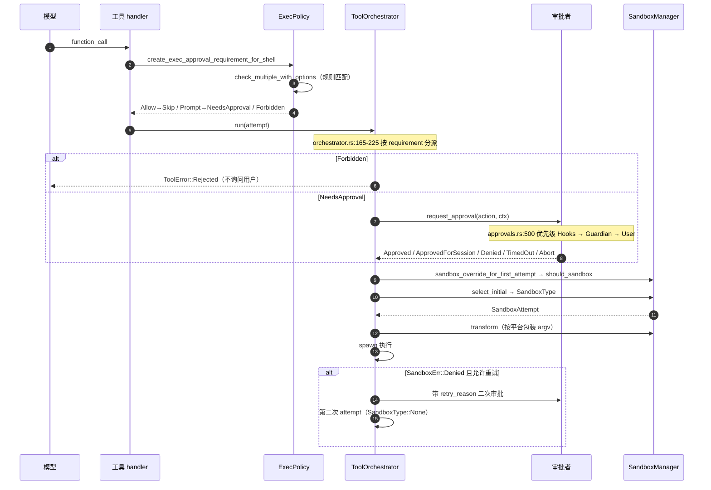
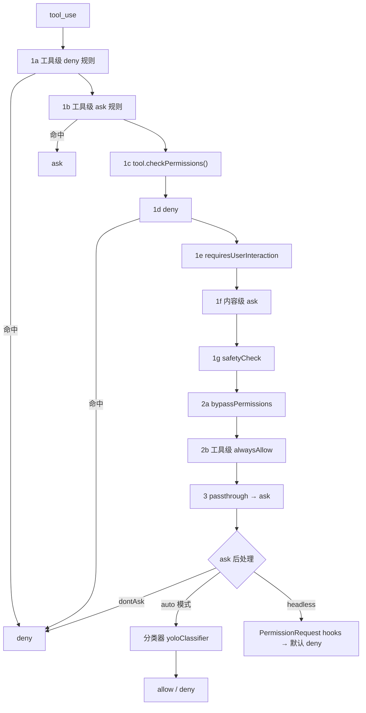

# 第 8 章：权限与沙箱 —— 谁有权说「这条命令可以跑」

一个 Agent 能改文件、能跑 shell、能发网络请求，那么「它想做的这件事，谁说了算」就是必须回答的问题。本章拆开四家的答案：**判定发生在哪个环节、由谁判定、判定结果怎么落到操作系统层面**。读完能看清一条分界线——大多数 Agent 框架把「问不问用户」和「以什么隔离运行」混成一个概念，而这一层真正的设计空间在于它们是**两个正交的维度**。

> **本层定位**：L8，把工具执行前的**判定**（是否放行、是否询问、是否拒绝）与执行时的**隔离**（以什么能力边界运行这条命令）一路落到操作系统。
>
> **前置依赖**：02（工具调用调度，权限判定是准备阶段的第三步）、03（工具定义，工具需声明自己的权限需求）、07（子 Agent 的权限继承与收窄）。
>
> **跨层联动**：11 —— 见 5.3。规则的「来源层级」在本层只作为**优先级顺序**被消费；这些来源怎么被读出来、怎么合并、谁覆盖谁，属于配置层。
>
> **分析对象**：
> - **pi** —— `packages/agent/src/agent-loop.ts`（`beforeToolCall` 是唯一拦截点）+ `packages/coding-agent/src/core/{agent-session,project-trust}.ts` + `examples/extensions/{permission-gate,tool-override}.ts`；内核**明确声明不内建**
> - **deepseek-harness** —— `packages/sandbox/sandbox/src/*` + `sandbox/sandbox-policy/src/*` + `sandbox/sandbox-{local,windows-acl}/src/*` + `interaction/user-approval/src/index.ts`
> - **codex** —— `codex-rs/execpolicy/src/*` + `core/src/exec_policy.rs` + `core/src/tools/{orchestrator,sandboxing,approvals}.rs` + `sandboxing/src/*`
> - **Claude-Code** —— `src/utils/permissions/*`（目录，非单文件）+ `src/hooks/toolPermission/*` + `src/utils/sandbox/sandbox-adapter.ts`
>
> **易混点**：pi 在这一层的形态是**明确声明不做**（README 与 `SECURITY.md` 均写明「intentionally does not have a sandbox」），而不是「做得薄」（见 4.1）。Claude-Code 的权限实现是目录而非单文件，路径写法见 4.4 开头。

---

## 一、核心结论速览

1. **四家对「这层要不要存在」给出三种回答**：pi **明确声明不内建**（README 与 SECURITY.md 都写明「intentionally does not have a sandbox」），把边界推到扩展层与容器外；dsh、codex、Claude-Code 都内建，但内建的**不是同一个东西**——dsh 内建的是**沙箱**（审批只有两值，且仅用于升级）、codex 内建的是**审批 × 沙箱两个正交维度**、Claude-Code 内建的是**决策引擎**（规则 + 模型分类器 + 交互三路并行）。

2. **「决策」与「隔离」是两件事，只有 codex 把它们显式拆成两个独立枚举**。`AskForApproval`（4 值）与 `SandboxPolicy`（4 值）自由组合，`AskForApproval::Never` 下命令仍可在沙箱内执行——源码注释写明这是「relying on the sandbox for protection」（`core/src/exec_policy.rs:809-814`）。其余三家把二者混在一个概念里：dsh 用 `PresetSpec` 把沙箱模式与审批策略**捆绑**销售，Claude-Code 的 `PermissionMode` 同时表达两者，pi 两者都没有。

3. **规则表达分三代，没有一家用自由文本策略**：**声明式 DSL**（codex，Starlark 的 `prefix_rule` / `network_rule`，落在 `<codex_home>/rules/*.rules`）→ **结构化规则 + 多来源优先级**（Claude-Code，8 类来源、shell 字符串解析、还配了「遮蔽检测」）→ **闭集枚举**（dsh，模式只有 3 值，放宽靠「升级阶梯」而非规则）。

4. **「用模型判断命令危不危险」是 Claude-Code 独有的第四条路**，且它的存在本身是个自白：**静态规则无法穷举 shell 的自由度**。`yoloClassifier` 只在规则判定为 `ask` 时接管（`permissions.ts:518-526`），且整个特性被 `feature('TRANSCRIPT_CLASSIFIER')` 门控。

5. **失败默认几乎全是 fail-closed，但只有 dsh 把「没有沙箱可用」做成了类型**（`SandboxUnavailableError`，无 runner 即拒绝执行）；codex 缺 bwrap 时降级到 bundled bwrap、WSL1 直接报错；Claude-Code 分类器不可用时由远端门决定 fail-open 还是 fail-closed；pi 因为无层可降级，退化成「扩展不在就没人拦」。

---

## 二、本层职责与边界

### 2.1 子职责拆解

本层可拆成 7 个子职责。四家的差异，本质是对这 7 问的答案组合不同：

| # | 子职责 | 要回答的问题 |
|---|---|---|
| ① | **判定入口** | 哪些调用需要判定？判定在链路的哪一步？ |
| ② | **策略表达** | 规则/策略用什么形式写？由谁写？ |
| ③ | **策略加载与优先级** | 从哪些来源加载？冲突时谁覆盖谁？ |
| ④ | **决策** | 允许 / 询问 / 拒绝，三值与「最严优先」如何实现？ |
| ⑤ | **人机交互与记忆** | 怎么问？问什么粒度？「始终允许」记在哪、活多久？ |
| ⑥ | **系统级隔离** | 上层策略如何翻译成 OS 能力（Seatbelt / Landlock / 令牌 / 容器）？ |
| ⑦ | **失败与降级** | 沙箱不可用、分类器不可用、无 UI 时，往哪边倒？ |

### 2.2 本层不管什么

- **不管工具怎么调度** —— 那是 L2（工具调用流程）。但两层严格咬合：权限判定是 L2 准备阶段的**第三步**，排在「参数校验」之后、「前置 hook」之前（见第 2 章 2.3 的三段式）。本章是把那一步放大来看。
- **不管工具长什么样、有几种** —— 那是 L3。但 L3 决定了本层的**输入**：工具必须能声明「我需要什么权限」（Claude-Code 的 `tool.checkPermissions()`、codex 的规则需要知道命令前缀），否则本层无从判定。
- **不管子 Agent 怎么创建** —— 那是 L7。但「子 Agent 继承父的什么权限」是**本层**必须回答的（见 6.7）。
- **不管凭据怎么存、模型怎么调** —— 那是 Provider 层。本层只到「这条命令能不能以这个身份、这个能力边界跑起来」。

### 2.3 层次定位

```text
┌──────────────────────────────────────────────────┐
│ L8 权限与沙箱（本章）                            │
│   判定：放行 / 询问 / 拒绝                       │
│   隔离：把「允许的能力边界」翻译成 OS 级约束     │
│   ⇒ 唯一一层「其产出直接约束 L2 的执行」         │
└──────────────────────────────────────────────────┘
         ▲                                   │
         │ 输入                              │ 输出
         │                                   ▼
 L3 工具定义（我需要什么权限）                L2 执行（以什么身份跑）
         ▲
         │ 继承
 L7 子 Agent（我拥有父的多少权限）
```

**图 8-1**：L8 在运行时栈中的位置。它的特殊之处在于「外向性」——其余各层的产物都在进程内流转，只有本层的产物要落到操作系统（系统调用过滤、令牌、命名空间），因此它的失败模式与平台强绑定。

```text
            决策维度（要不要问人）
            ────────────────────────────────
            ┌────────────────┬────────────────┐
            │    无决策      │    有决策      │
            ├────────────────┼────────────────┤
无          │      pi        │       —        │     pi：两层都不做，
    隔      │ （推给扩展）   │                │     边界外包给容器
    离      ├────────────────┼────────────────┤
    维      │      dsh       │     codex      │     dsh：有隔离但不问人
    度      │ （沙箱为主）   │ （两维正交）   │     codex：两维都是枚举
            ├────────────────┼────────────────┤
有          │                │      CC        │     CC：决策做得最重，
            │                │ （决策引擎）   │     隔离外包给 SDK
            └────────────────┴────────────────┘
```

**图 8-2**：四家在「决策 × 隔离」两个正交维度上的落点。这张图的重点不是谁强谁弱，而是**没有一家把两维都做满**——codex 是唯一把两维都显式建模的，但它的决策维度主要为了「减少摩擦」而非「增加控制」。

---

## 三、概念对齐表

**同一个概念，四家分别叫什么、有没有这个能力**。空白格本身就是结论。

| 概念 | pi | deepseek-harness | codex | Claude-Code |
|---|---|---|---|---|
| **是否有内建层** | **无**（自述声明） | 有（沙箱为主） | 有（审批 + 沙箱双维） | 有（决策引擎） |
| **审批模式** | — | `ApprovalPolicy = ask / never` | `AskForApproval` 4 值 | `PermissionMode` 5 外部 + 2 内部 |
| **沙箱模式** | — | `SandboxMode` 3 值 | `SandboxPolicy` 4 值 / `SandboxMode` 3 值 | 无独立枚举（并入 mode） |
| **单次放宽机制** | `beforeToolCall` 拦截 | `sandbox_permissions` + `justification` | `SandboxPermissions` 3 值 | 规则 allow / 用户当场选择 |
| **策略表达形式** | 扩展代码 | TS 配置 + 预设表 | Starlark DSL | 结构化规则（工具名 + 内容） |
| **策略存放位置** | — | `bundle/base/cordis.patch.yml` | `<codex_home>/rules/*.rules` | settings 文件（user / project / local） |
| **策略来源数** | — | 1 层（+ 预设） | 多层 overlay + requirements | **8 类**（含 cliArg / session） |
| **「最严优先」实现** | — | 闭集比较 | `Decision` 的 `Ord` + `max()` | 固定顺序 deny → ask → allow |
| **模型分类器** | — | — | — | `yoloClassifier` `[门控]` |
| **系统隔离实现** | 无 | bwrap→landlock / seatbelt / windows-acl | Seatbelt / Landlock+bwrap / Windows 令牌 + MXC | 委托 `@anthropic-ai/sandbox-runtime` |
| **隔离强制度声明** | — | `full` / `partial` | `SandboxType` 5 值 | 未声明 |
| **拒绝的记录** | — | 事件（可重建） | `ApprovalStore` + violation 上报 | `denialTracking` 计数 |
| **会话级「始终允许」** | — | 显式授权随会话 | `ApprovedForSession` 存 `ApprovalStore`，另可回写 `.rules` | `PermissionUpdate` 落盘 settings（仅 3 个来源可写） |
| **子 Agent 权限继承** | 无（扩展自行决定） | 只继承父的**显式覆盖** + approval 钉 `never` | 继承 turn 有效配置，可再叠角色配置 | 父模式优先，异步子 Agent 强制无提示 |
| **无 UI / headless 时** | 扩展自行 fail-closed | 归一为 `unavailable` → 拒绝 | `Never` 直接允许（靠沙箱）；规则要求 prompt 则拒绝 | 先跑 PermissionRequest hooks，再默认拒绝 |
| **支持平台** | — | linux / darwin / win32 | macOS / Linux / Windows | macOS seatbelt / Linux bubblewrap |

> **读法提示**：本表第 1 行是最重要的一行——它决定了后面所有行的空白是「没实现」还是「不需要实现」。pi 的空白属于后者。

---

## 四、逐项目实现

```text
四家对「谁有权说这条命令可以跑」的四种答案

  pi            没有人，这是明确的设计声明
                README/SECURITY.md 自述不做沙箱；只留一个 beforeToolCall 钩子

  dsh           沙箱说了算：模式是事件，runner 链是执行者，审批只用于升级
                权限模式进入事件溯源，可凭日志重建

  codex         两个正交枚举：先算审批要求，再选沙箱
                规则是 Starlark，允许的决定可回写磁盘

  CC            三路并行：规则引擎 → 模型分类器 → 交互弹窗
                路径防逃逸做到 shell 展开层
```

**图 8-3**：四种答案。注意 pi 的「没有人」是**有意的空位**——它把安全性假设整体外包，因此它的扩展层反而必须承担更重的安全设计（见 7.2）。

### 4.1 pi：没有权限层，而且这是一个设计声明

> **先说结论**：pi 不存在独立的权限/沙箱层。这不是「做得薄」，而是**写在文档里的设计选择**。写报告时若按「pi 的权限模块在哪」去找，会一无所获；正确的问题是「pi 用什么替代了它，代价是什么」。

#### 4.1.1 自述与反证过程

项目自己的两处声明最直接：

```md
# README.md:40-42
## Permissions & Containerization

Pi does not include a built-in permission system for restricting filesystem,
process, network, or credential access. By default, it runs with the
permissions of the user and process that launched it.
```

```md
# SECURITY.md:50
- Local code execution or sandboxing behavior (the Pi coding agent
  intentionally does not have a sandbox)
```

反证同样干净。`packages/` 下 11 个包（`agent` / `ai` / `chord` / `client` / `coding-agent` / `durable` / `evals` / `protocol` / `server` / `telemetry` / `tui`）中，**没有任何以 permission / sandbox / security / policy / guard 命名的包**；全仓搜 `canUseTool` / `autoApprove` / `yolo` 均无权限语义命中（唯一的 `dangerously` 命中是 OpenAI SDK 的 `dangerouslyAllowBrowser`，与权限无关）。

#### 4.1.2 唯一的内建拦截点：`beforeToolCall`

内核提供的唯一执行前钩子在循环层，且契约极简——返回 `block: true` 即阻止：

```ts
// packages/agent/src/types.ts:66-76
export interface BeforeToolCallResult {
	block?: boolean;
	reason?: string;
	/**
	 * Hint that the agent should stop after the current tool batch when this call is blocked.
	 * Early termination only happens when every finalized tool result in the batch sets this to true.
	 */
	terminate?: boolean;
}
```

循环里据此短路，把「被拦」物化成一次**错误的工具结果**（而不是异常）：

```ts
// packages/agent/src/agent-loop.ts:739-749
if (beforeResult?.block) {
	const result = createErrorToolResult(beforeResult.reason || "Tool execution was blocked");
	if (beforeResult.terminate === true) result.terminate = true;
	return { kind: "immediate", result, isError: true };
}
```

**这个设计的含义**：拦截是「钩子」而非「策略」——内核不知道什么是危险，它只提供一次否决机会。判定逻辑（危险模式匹配、是否需要 UI、无 UI 时怎么办）全部在被钩子调用的那一侧。

#### 4.1.3 替代路径：扩展层承担了全部安全设计

pi 把权限外置到三条路径，其中前两条是「进程内」的：

**路径一：扩展的 `tool_call` 事件。** 扩展可以阻止、也可以原地改写 `input`：

```ts
// packages/coding-agent/examples/extensions/permission-gate.ts:13-28
pi.on("tool_call", async (event, ctx) => {
	if (event.toolName !== "bash") return undefined;
	const command = event.input.command as string;
	const isDangerous = dangerousPatterns.some((p) => p.test(command));
	if (isDangerous) {
		if (!ctx.hasUI) {
			return { block: true, reason: "Dangerous command blocked (no UI for confirmation)" };
		}
		const choice = await ctx.ui.select(`⚠️ Dangerous command:\n\n  ${command}\n\nAllow?`, ["Yes", "No"]);
		if (choice !== "Yes") return { block: true, reason: "Blocked by user" };
	}
	return undefined;
});
```

**注意这是示例而不是内建**——它在 `examples/extensions/` 下，不装扩展就没有任何拦截。同一目录下还有 `tool-override.ts`，用**同名覆盖内建工具**的方式做敏感路径拒绝：

```ts
// packages/coding-agent/examples/extensions/tool-override.ts:69
pi.registerTool({
	name: "read", // Same name as built-in - this will override it

	...

});
```

覆盖之所以可行，是因为工具注册表按名字归档，同名即替换（`extensions/loader.ts:280`；`agent-session.ts:3171-3176` 同样按 name `set`）。也就是说 pi 的扩展不仅能「拦」，还能「换」——**权限可以被实现为对工具实现的整体替换**。

**路径二：项目信任。** 它管的是「加载项目自带资源」这个代码注入面，**不管工具执行**：

```ts
// packages/coding-agent/src/core/project-trust.ts:46-52
// 若无 project-local 资源（.pi 下信任相关项、.agents/skills），直接 return true
```

**路径三：容器 / 微 VM。** README 推荐的容器化外包。这也是为什么远程模式下的信任边界只剩传输层——`packages/server/src/transports/unix/types.ts:5` 的 socket 默认权限 `0o600` 是唯一一处「权限」代码。

#### 4.1.4 两个容易混淆的点

**易混点一：`sandbox-env-setup.ts` 不是沙箱。** 它只读写 `/proc/self/environ`，没有任何 seccomp / landlock / sandbox-exec 调用：

```ts
// packages/coding-agent/src/bun/restore-sandbox-env.ts:19-22
export function restoreSandboxEnv(): void {
	if (!process.versions?.bun) return;
	// If process.env already has entries, nothing to fix.
	if (Object.keys(process.env).length > 0) return;

	...

}
```

文件头注释说明它是为绕开 Bun issue #27802：Bun 编译产物在**外部**沙箱（如 nono）中 `process.env` 为空，故从 `/proc/self/environ` 恢复——**它是「外部已有沙箱」的适配代码，恰好反证了 pi 自己不做沙箱**。值得留意的是它恢复的是**全部**环境变量（含 API key），说明 pi 的假设是「环境变量应完整可见」，凭据隔离完全依赖外部容器。

**易混点二：pi 的拦截并不完备。** 存在一个明确的缺口：扩展改写 `input` 后**不做重新校验**（`extensions/types.ts:1026-1027` 注释 `No re-validation is performed after mutation`）。这意味着若把权限检查写成「先看一遍参数、再放行给原工具」，改写后的参数不会再过一遍 schema。

### 4.2 deepseek-harness：模式即事件，fail-closed 的 runner 链

> dsh 是四家中**唯一把权限模式纳入事件溯源**的。沙箱不是配置项，而是一条会话事件；因此「这个会话以什么权限跑过」可以仅凭日志重建。

#### 4.2.1 三值闭集与升级阶梯

```ts
// packages/sandbox/sandbox/src/index.ts:29
export type SandboxMode = 'read-only' | 'workspace-write' | 'danger-full-access'
```

放宽不是靠规则，而是靠**闭表定义的升级阶梯**：

```ts
// packages/sandbox/sandbox/src/escalation.ts:28
export const WIDER_MODES: Record<string, readonly SandboxMode[]> = {
  'read-only': ['workspace-write', 'danger-full-access'],
  'workspace-write': ['danger-full-access'],
}
```

**这个表是整个设计的枢纽**：因为目标是闭集，所以「越权」可以被形式化定义——请求的目标模式只要不在 `WIDER_MODES[current]` 里就是非法请求，直接抛错（`escalation.ts:159-161`）。不需要任何规则解析就能判定。

#### 4.2.2 模式变更是一条事件

写路径只有一条，且它是 append 一条事件而非改内存：

```ts
// packages/sandbox/sandbox-policy/src/session-mode.ts:53
export function setSandboxMode(session: Session, mode: SandboxMode): void {
  session.append('sandbox/mode', { mode })
}
```

配套的不变式插件会拒绝越界值，且**同时覆盖历史与新派发**：

```ts
// packages/sandbox/sandbox-policy/src/invariant.ts:18
if (event.type === 'sandbox/mode' && !SANDBOX_MODES.includes(event.data.mode)) {
  fail(`sandbox/mode carries unknown mode ${JSON.stringify(event.data.mode)}`)
}
```

校验范围见 `invariant.ts:24-34`：既 `ctx.sessions.list()` 遍历已加载历史校验 `snapshotEvents()`，也挂 `internal/dispatch` 钩子校验新事件。

**设计理由**：权限提升是一个**需要事后可审计**的事实。若它只存在于内存配置里，会话回放时就无法解释「为什么这条命令当时被允许」。把它做成事件后，子 Agent 的关键决策也以 `source: 'delegation'` 写入子日志（`child-agent.ts:246-253`），保证仅凭日志可重建。

#### 4.2.3 策略解析的三层优先级与 runner 链

模式有三个来源，优先级从高到低：

```ts
// packages/sandbox/sandbox-policy/src/index.ts:164-167
mode: request.mode ?? (session === undefined ? undefined : this.overrideOf(session)) ?? this.defaultMode,
```

即「本次调用的显式授权」>「会话级 `sandbox/mode` 事件」>「部署默认」（默认 `read-only`，`index.ts:113`；装配来源见 `packages/bundle/base/cordis.patch.yml:228-232`，可用 `DSH_PERMISSION_MODE` 环境变量覆盖）。

执行侧不建容器，只把 argv 包一层。平台链是静态表：

```ts
// packages/sandbox/sandbox-local/src/index.ts:160-167
linux: ['bwrap', 'landlock'],
darwin: ['seatbelt'],
win32: ['windows-acl'],
```

`confine()` 返回包裹后的 argv 与三样元信息：

```ts
// packages/sandbox/sandbox-local/src/index.ts:332-337
return Promise.resolve<ConfinedArgv>({
  argv: [...runnerArgv, '--', ...argv],
  enforcement: selected.enforcement,
  denialSignatures: DENIAL_SIGNATURES[selected.runner],
  runnerFailureRules: RUNNER_FAILURE_RULES[selected.runner],
})
```

**注意最后两项**：它把「这个 runner 被拒绝时输出长什么样」也一并返回，让调用方能区分**沙箱拦截**与**runner 自身崩溃**（见 6.3）。

#### 4.2.4 审批只在一个点上存在

审批策略只有两个值（`packages/interaction/user-approval/src/index.ts:67`）：`ask` 与 `never`。而真正需要问人的场合**只有升级**——即工具主动携带 `sandbox_permissions` 请求放宽时：

```ts
// packages/sandbox/sandbox/src/escalation.ts:153-186（approveEscalation）
// 请求与当前模式相同的目标 → 直接返回（:155）
// 请求更窄的目标 → 抛错（:159-161）
```

参数校验也在这里：`sandbox_permissions` 与 `justification` 必须成对且非空（`escalation.ts:51-61`）——即**不允许「无理由提权」**。

#### 4.2.5 `sandbox-windows-acl` 为什么必须独立成包

POSIX 侧是内核机制（bwrap / Landlock / Seatbelt），Windows 侧则是**令牌与 ACL 的改写**，机理完全不同，无法共用代码路径：需要复制进程令牌为 `WRITE_RESTRICTED` 并把完整性降到 Low（`sandbox-windows-acl/src/token.ts:216` `createRestrictedToken`）、需要原生 Win32 FFI（`src/ffi.ts` / `src/win32-abi.ts`）、需要独立的授予与撤销（`src/grant.ts:32/65/105` 的 `AclWriteGrant`）、还需要独立的 runner 入口（`src/runner.ts`）。README 里专门解释了为什么选原始 ACL 受限令牌而不是 mxc 或 AppContainer（`README.md:44`）。

**顺带一个诚实的工程细节**：Windows 侧被标记为 `partial` 强制度——

```ts
// packages/sandbox/sandbox-local/src/index.ts:178-189（STATIC_ENFORCEMENT）
// windows-acl: 'partial'
```

理由写得很清楚：硬链接别名、读取不受限、AppContainer 下部分 ACL 目录不可读，导致绝对边界不成立。**把不完美显式声明出来**，比声称「已隔离」更可取。

### 4.3 codex：审批 × 沙箱两个正交维度 + Starlark 规则

> codex 是四家中权限层代码量最大的一家（相关 crate 合计约 7.5 万行），也是唯一把「要不要问人」与「以什么隔离跑」建模成两个可独立组合枚举的一家。

#### 4.3.1 两套枚举，彼此正交

审批侧：

```rust
// protocol/src/protocol.rs:986
pub enum AskForApproval {
    /// Internal policy for projects marked untrusted. Commands require
    /// approval unless an explicit exec policy rule allows them.
    UnlessTrusted,                     // :991
    OnRequest,                         // :996  (#[default])
    Granular(GranularApprovalConfig),  // :1004
    Never,                             // :1008
}
```

`Granular` 携带一个五个 bool 的配置（`protocol.rs:1012`）：`sandbox_approval` / `rules` / `skill_approval` / `request_permissions` / `mcp_elicitations`。

沙箱侧：

```rust
// protocol/src/protocol.rs:1072
pub enum SandboxPolicy {
    DangerFullAccess,   // :1075
    ReadOnly { network_access },                       // :1079
    ExternalSandbox { network_access },                // :1089
    WorkspaceWrite { writable_roots, network_access,   // :1098
                     exclude_tmpdir_env_var, exclude_slash_tmp },
}
```

**正交的证据**在源码里，不在文档里：

```rust
// core/src/exec_policy.rs:809-838
match approval_policy {
    AskForApproval::Never => {
        // We allow the command to run, relying on the sandbox for
        // protection.
        Decision::Allow
    }
    AskForApproval::UnlessTrusted => {
        // Projects marked untrusted require approval for every command
        // that is not explicitly allowed by an exec policy rule.
        Decision::Prompt
    }
    AskForApproval::OnRequest => match file_system_sandbox_policy.kind {
        FileSystemSandboxKind::Unrestricted | FileSystemSandboxKind::ExternalSandbox => {
            // The user has indicated we should "just run" commands in their
            // unrestricted environment, so we do so since the command has not
            // been flagged as dangerous.
            Decision::Allow
        }
        FileSystemSandboxKind::Restricted => {
            // In restricted sandboxes, do not prompt for non-escalated,
            // non-dangerous commands; let the sandbox enforce restrictions
            // without a user prompt.
            if sandbox_permissions.requests_sandbox_override() {
                Decision::Prompt
            } else {
                Decision::Allow
            }
        }
    },
    AskForApproval::Granular(_) => match file_system_sandbox_policy.kind {
        // 按工具类别逐项判定

        ...
    },
}
```

只有在需要**完全绕过沙箱**时两者才耦合，此时用独立的 `ExecApprovalRequirement::Skip { bypass_sandbox }` / `SandboxOverride` 表达。

#### 4.3.2 完整链路



**图 8-4**：codex 的判定链路。**顺序是本图的关键**：先算「要不要问」（规则驱动），再决定「以什么隔离」（可用性驱动），最后才执行；沙箱被拒后可以带着一个明确的 `retry_reason` 回来再问一次，而不是静默失败。

#### 4.3.3 规则是一段可执行脚本

codex 的规则不是配置文件，而是 **Starlark**：

```rust
// execpolicy/src/parser.rs:61
let ast = AstModule::parse(policy_identifier, policy_file_contents.to_string(), &dialect)
```

内置三个函数：`prefix_rule`（默认 `decision="allow"`，`parser.rs:347`）、`network_rule`（`:410`）、`host_executable`（`:437`）。

加载位置固定在 codex home 下：常量 `RULES_DIR_NAME="rules"` / `DEFAULT_POLICY_FILE="default.rules"`（`core/src/exec_policy.rs:54-56`）。

多层叠加的注释把意图写得很明确：

```rust
// core/src/exec_policy.rs:665
// Iterate the layers in increasing order of precedence, adding the *.rules
// from each layer, so that higher-precedence layers can override
// rules defined in lower-precedence ones.
```

**冲突取最严**由类型序保证——`Decision` 的 `Ord` 顺序即严重度（`execpolicy/src/decision.rs:7`：`Allow` < `Prompt` < `Forbidden`）：

```rust
// execpolicy/src/policy.rs:401-411
/// Caller is responsible for ensuring that `matched_rules` is non-empty.
fn from_matches(matched_rules: Vec<RuleMatch>) -> Self {
    let decision = matched_rules.iter().map(RuleMatch::decision).max();
    let decision = decision.expect("invariant failed: matched_rules must be non-empty");

    Self {
        decision,
        matched_rules,
    }
}
```

**`amend.rs` 解决的是「记住这次允许」**：用户选择允许并记住后，追加一条 `prefix_rule(...)` 写回 `default.rules`，并且做了 flock + 去重：

```rust
// execpolicy/src/amend.rs:79
let rule = format!(r#"prefix_rule(pattern={pattern}, decision="allow")"#);
```

```rust
// execpolicy/src/amend.rs:147-182
fn append_locked_line(policy_path: &Path, line: &str) -> Result<(), AmendError> {
    let mut file = OpenOptions::new().create(true).read(true).append(true).open(policy_path)?;
    file.lock()?;

    // 读回全文，用于去重与补换行

    ...

    if contents.lines().any(|existing| existing == line) {
        return Ok(());   // 已在规则文件中，直接跳过
    }

    file.write_all(format!("{line}\n").as_bytes())?;
    Ok(())
}
```

**为什么值得单独写**：这是「用户的学习成本应当被系统吸收」的具体实现——用户回答一次，规则文件里多一行，以后同类命令不再问。代价是**规则文件成了状态**，因此必须处理并发写与重复行。

#### 4.3.4 三平台隔离如何落地

| 平台 | 机制 | 关键锚点 |
|---|---|---|
| macOS | Seatbelt：把策略编译成 `.sbpl` 文本，前置 `/usr/bin/sandbox-exec` | `sandboxing/src/seatbelt.rs:59` / `:883` / `:1048` |
| Linux | 生成 helper CLI，helper 内部做 bwrap + seccomp | `landlock.rs:45`、`linux-sandbox/src/lib.rs:1`、`linux_run_main.rs:162` |
| Windows | 受限令牌 / MXC，由 spawn 阶段走原生后端 | `sandboxing/src/spawn.rs:65`、`manager.rs:513` |

macOS 的策略是**封闭默认**起步——`seatbelt_base_policy.sbpl:8` 以 `(deny default)` 开头，再由运行时按序拼接文件读、文件写、网络三段（`seatbelt.rs:1048`）。这是「白名单」式系统隔离的教科书写法。

`policy_transforms.rs` 负责把「基础 `PermissionProfile` + 本次命令的 `additional_permissions`」合成有效策略（文件系统 `:582`、网络 `:615`、总入口 `:630`），并判定「是否真的需要平台沙箱」（`:646`）；`manager.rs:364-365` 在 `transform` 开头即调用它。

#### 4.3.5 Guardian：把「问人」替换成「问另一个模型」

codex 的审批者不必是人。`ApprovalsReviewer` 有两个值（`protocol/src/config_types.rs:183`）：`User`（默认）与 `AutoReview`（别名 `guardian_subagent`）。

```rust
// core/src/tools/approvals.rs:500
// Approval precedence is:
// 1. Hooks
// 2. If StrictAutoReview || Guardian enabled, then Guardian. Else, user.
```

`core/src/guardian/` 的定位在模块注释里写得很清楚：

```rust
// core/src/guardian/mod.rs:1
//! Hosts approval decisions and the isolated synchronous reviewer.
```

它的产物是一个 `Option<ReviewDecision>`（`guardian/decision.rs:52`），即一个自动审批结论；`guardian-context/` 只是为这次审查拼装上下文（`guardian-context/src/lib.rs:1`），不执行判定。

**这带来的一个结构性发现**：审批优先级是 **Hooks > Guardian > User**——也就是说，在 codex 里**扩展（hooks）可以在审批之前先做决定**，而人排在最后。这与直觉相反（通常以为「人最大」），但从工程上看是合理的：hook 是部署方写的确定性策略，人只处理前两者都未覆盖的边角。

### 4.4 Claude-Code：规则引擎 + 模型分类器 + 交互三路

> **路径写法**：Claude-Code 的权限实现是**目录** `src/utils/permissions/`（24 个文件、9,409 行），主判定链在该目录下的 `permissions.ts:1158`。本章统一采用目录形式。

#### 4.4.1 模式与规则的结构

```ts
// src/types/permissions.ts:16
export const EXTERNAL_PERMISSION_MODES = ['acceptEdits','bypassPermissions','default','dontAsk','plan'] as const
export type InternalPermissionMode = ExternalPermissionMode | 'auto' | 'bubble'
```

`auto` 需要门控才进入 UI（`PermissionMode.ts:80-90`）；非法字符串回落 `default`（`PermissionMode.ts:117-121`）。

规则的三要素与来源：

```ts
// src/types/permissions.ts:54
export type PermissionRuleSource = 'userSettings'|'projectSettings'|'localSettings'|'flagSettings'|'policySettings'|'cliArg'|'command'|'session'
export type PermissionRule = { source: PermissionRuleSource; ruleBehavior: PermissionBehavior; ruleValue: PermissionRuleValue }
```

```ts
// src/types/permissions.ts:44
export type PermissionBehavior = 'allow' | 'deny' | 'ask'
```

**8 类来源**中，前 5 类来自 settings（`src/utils/settings/constants.ts:7`），后 3 类（`cliArg` / `command` / `session`）是运行时来源；后者**不可落盘**——这是有意的：

```ts
// src/utils/permissions/PermissionUpdate.ts:208
export function supportsPersistence(destination): destination is EditableSettingSource {
  return destination === 'localSettings' || destination === 'userSettings' || destination === 'projectSettings'
}
```

即「SDK 显式授权」与「本会话允许」不写进磁盘，避免临时决定被固化。

规则字符串有专门的解析器（`permissionRuleParser.ts:93`，处理 `\(` `\)` 转义、`Bash(*)` 工具级规则）。

#### 4.4.2 判定链



**图 8-5**：Claude-Code 的判定链（`permissions.ts:1158` 起的 `hasPermissionsToUseToolInner`）。**顺序即优先级**：deny 先于 ask 先于 allow，这是安全默认的直接体现。

工具自己的判定插在链中间，且**解析失败不与权限失败混淆**：

```ts
// src/utils/permissions/permissions.ts:1214-1219
try {
  const parsedInput = tool.inputSchema.parse(input)
  toolPermissionResult = await tool.checkPermissions(parsedInput, context)
} catch (e) { /* abort 重抛，其余 logError */ }
```

#### 4.4.3 分类器：第四条路

它只在规则判定为 `ask` 之后接管（`permissions.ts:518-526`），且为结构化输出——模型必须调用一个固定工具：

```ts
// src/utils/permissions/yoloClassifier.ts:260
export const YOLO_CLASSIFIER_TOOL_NAME = 'classify_result'   // {thinking, shouldBlock, reason}
```

防注入的设计值得注意：送进分类器的转录**只保留 user 文本与 assistant 的 tool_use**，屏蔽模型自述文本（`buildTranscriptEntries:302`、`:344-352`）——因为模型自述可以声称「这是安全的」，不能作为判据。

分类器不可用时按远端门决定倒向哪边：

```ts
// src/utils/permissions/permissions.ts:845
if (classifierResult.unavailable) {
  if (getFeatureValue_CACHED_WITH_REFRESH('tengu_iron_gate_closed', true, 30*60*1000)) {
    return { behavior:'deny', ... 'Classifier unavailable' ... }
  }
  return result   // fail open：落回普通问询
}
```

**注意 `bashClassifier` 在还原版里是桩**（`bashClassifier.ts:1,24-26` 注释 「classifier permissions feature is ANT-ONLY」，外部构建 `isClassifierPermissionsEnabled()` 恒 `false`），且分类器 prompt 的 `.txt` 在还原版是占位符，**实际提示词不可恢复**。因此这一路只能标 `[门控]` 描述结构，不能评价其效果。

#### 4.4.4 路径防逃逸做到了 shell 展开层

这一层是 Claude-Code 的独有深度，防护点全部集中在 `pathValidation.ts`：

| 检查 | 目的 | 锚点 |
|---|---|---|
| UNC 路径 | 防凭据泄漏（远端 SMB） | `:383` |
| `~root` / `~+` 变体 | 防 TOCTOU（`expandTilde` 只处理 `~` 与 `~/`，其余交给 shell 会解析成别处） | `:401` |
| `$VAR` / `${...}` / `$(cmd)` / `%VAR%` / `=cmd` | 防 shell 展开绕过路径检查 | `:423` |
| 写/创建操作禁 glob | 只校验基目录等于没校验 | `:443` |

`isPathAllowed` 的顺序是：deny 规则 → 内部可编辑路径 → 路径安全检查（Windows 下**保留原始与解析后两条路径**）→ 工作目录包含判定（`pathInWorkingPath` 用 `containsPathTraversal`，并做大小写归一以防 `.cLaDe` 绕过）。

**为什么值得单列**：其余三家的路径检查都停在「是否在工作目录内」，而 shell 展开、符号链接与 UNC 是三种能让「字符串检查通过、实际落到别处」的经典手法。这一层是把权限检查从「字符串层面」提升到「语义层面」。

#### 4.4.5 headless、熔断与拒绝预算

**headless 的默认是拒绝**，但给 hooks 留了唯一出口：

```ts
// src/utils/permissions/permissions.ts:932-937
if (appState.toolPermissionContext.shouldAvoidPermissionPrompts) {
  const hookDecision = await runPermissionRequestHooksForHeadlessAgent(...)
  if (hookDecision) return hookDecision
  return { behavior:'deny', ... 'Permission prompts are not available in this context' ... }
}
```

注意分类器检查被**刻意放在这个判断之前**（`permissions.ts:519` 注释 「classifiers work in headless mode」）——即无人环境下仍然可以自动放行。

**拒绝预算**防止「拒绝—重试—拒绝」空转：

```ts
// src/utils/permissions/denialTracking.ts:12
export const DENIAL_LIMITS = { maxConsecutive: 3, maxTotal: 20 } as const
```

超限后由 `handleDenialLimitExceeded` 转人工（`permissions.ts:890` / `:984`），headless 下直接 `AbortError`（`:1023-1027`）。

**远端熔断**（bypass 模式可被平台方关掉）：

```ts
// src/utils/permissions/bypassPermissionsKillswitch.ts:19-30
if (!toolPermissionContext.isBypassPermissionsModeAvailable) return
const shouldDisable = await shouldDisableBypassPermissions()
// permissionSetup.ts:1265 → checkSecurityRestrictionGate('tengu_disable_bypass_permissions_mode')
```

触发后把 `bypassPermissions` 降回 `default` 并关闭可用位（`permissionSetup.ts:1389`）。

---

## 五、横向对比矩阵

### 5.1 决策机制

| 维度 | pi | dsh | codex | CC | 共识度 |
|---|---|---|---|---|---|
| 判定入口 | 扩展 `tool_call` | 沙箱策略 + 升级审批 | 工具 handler 内算 requirement | 工具调用前置链 | **4/4 有位置** |
| 决策主体 | 扩展作者 | 策略（闭集） | 规则 + 审批者 | 规则 + 分类器 + 人 | 1/4 |
| 询问粒度 | 由扩展决定 | 仅升级 | 每命令 + 可 granual | 每工具 + 每内容 | 1/4 |
| 最严优先 | — | 闭集比较 | `Ord` + `max()` | 固定顺序 | 2/4 |
| 自动判定 | — | 闭集（无需判定） | 规则脚本 | 模型分类器 | — |

### 5.2 系统隔离落地

| 维度 | pi | dsh | codex | CC | 共识度 |
|---|---|---|---|---|---|
| macOS | 无 | Seatbelt | Seatbelt（`.sbpl`） | 委托 sandbox-runtime | **3/4 用 Seatbelt** |
| Linux | 无 | bwrap → landlock | Landlock + bwrap | bubblewrap | **3/4 用 bwrap 系** |
| Windows | 无 | 受限令牌 + ACL | 受限令牌 / MXC | 未支持（POSIX-only） | 2/4 |
| 缺依赖时 | 无层可降 | **拒绝执行** | 降级 bundled bwrap；WSL1 报错 | 依赖探测，禁用沙箱 | 分化 |
| 隔离强制度声明 | 无 | `full` / `partial` | `SandboxType` 5 值 | 无 | 1/4 |

> **一个跨项目的收敛**：三个内建沙箱的项目**都选了 Seatbelt + bwrap/Landlock 这套组合**，没有一家自研内核机制。这说明这一层的正确做法是把「策略表达」留在应用层，把「强制」交给操作系统。

### 5.3 规则表达与来源

| 维度 | pi | dsh | codex | CC | 共识度 |
|---|---|---|---|---|---|
| 表达形式 | 代码 | TS 配置 + 预设 | Starlark DSL | 结构化规则串 | 无共识 |
| 来源层级 | — | 部署默认 + 会话 + 单次 | 多层 overlay + requirements | 8 类 | 无共识 |
| 规则可被用户改写 | 扩展代码 | 改配置 | **可回写 `.rules`** | 可写 3 个 settings 来源 | 2/4 |
| 冲突检测 | — | 闭集天然无冲突 | 取最严 | **遮蔽检测** | 1/4 |
| 规则可达性检测 | — | — | — | `detectUnreachableRules` | **1/4（独有）** |

> **「来源层级」这一行统计的是优先级，不是加载**：这些来源从哪读、多份配置如何合并与覆盖、环境变量与 CLI 开关谁最终说了算，属于启动区第 11 章（配置 · 凭据与启动引导）。本层与它的接口接近单向——上游给出一份合并后的规则集合，本层负责把它接进判定链；唯一的反向写入是「允许的决定可回写磁盘」，且被限定在 3 个可落盘来源内（`PermissionUpdate.ts:208`），这条写回同样要回到配置层去解释。

### 5.4 失败的降级方向

| 场景 | pi | dsh | codex | CC |
|---|---|---|---|---|
| 沙箱不可用 | 无（外包） | **拒执行**（`SandboxUnavailableError`） | 换 bundled bwrap / 报错 | 禁用沙箱能力 |
| 自动判定不可用 | 无 | — | 回落人工审批 | 门控决定 fail-open/closed |
| 无 UI / headless | 扩展自行 fail-closed | 归一 `unavailable` → 拒绝 | `Never` 直接允许（靠沙箱） | hooks → 默认 deny |
| 用户拒绝后 | 扩展决定 | 事件记录 | `Denied`（继续）/ `Abort`（停止） | 计数，超限转人工 |

### 5.5 记忆与作用域

| 维度 | pi | dsh | codex | CC |
|---|---|---|---|---|
| 单次覆盖 | 扩展改 input | `sandbox_permissions` + 理由 | `SandboxPermissions` | 规则 / 当场选择 |
| 会话级记忆 | — | 会话事件 | `ApprovalStore` 的 `ApprovedForSession` | `session` 来源规则（内存） |
| 跨会话记忆 | — | — | **回写 `.rules`**（`amend.rs`） | 落盘 settings |
| 可审计性 | — | **事件日志可重建** | 规则文件 + violation 上报 | denial 计数 + 持久化规则 |

### 5.6 子 Agent 的权限继承

| 维度 | pi | dsh | codex | CC | 共识度 |
|---|---|---|---|---|---|
| 继承内容 | — | 仅父的**显式**覆盖 | turn 有效配置（provider / approval / sandbox / cwd） | 父 mode 优先，子可声明但受限 | 3/4 继承 |
| 是否可扩权 | 扩展自行决定 | **不可**（approval 钉 `never`） | 不可（只能叠加更严的角色配置） | 不可（父为 bypass/acceptEdits/auto 时不覆盖） | **3/4 禁止** |
| 无提示环境 | — | 强制 `never` | 继承 `Never` | 异步子 Agent 强制 `shouldAvoidPermissionPrompts` | 3/4 强制 |

> **最强共识的一条**：**子 Agent 不得获得父 Agent 没有的权限**。四家（含 pi 的「扩展决定」这一空位）都指向同一结论，与第 7 章 7.4 的观察完全一致。

---

## 六、异常与降级

### 6.1 命令不在任何规则覆盖范围内

| 项目 | 做法 | 源码依据 | 设计理由 |
|---|---|---|---|
| codex | 启发式回退：按 `AskForApproval` × `FileSystemSandboxKind` 渲染判定 | `core/src/exec_policy.rs:770`、`:290`、`:809-854` | 规则文件是**稀疏**的（用户只写关心的），未覆盖命令仍必须有确定判定，否则系统不可用 |
| dsh | 无需回退：模式是闭集，默认即 `read-only` | `sandbox-policy/src/index.ts:113` | 闭集设计消除了「未覆盖」这一状态 |
| CC | 落到第 3 步 `passthrough → ask` | `permissions.ts:1300-1310` | 未知即询问，安全默认 |
| pi | 取决于扩展是否安装 | — | 无内建策略 |

> **设计理由（对比）**：codex 与 CC 都把「未知」映射到一个**确定的默认动作**（codex 按策略渲染，CC 落 ask），而不是抛错或静默放行。这是权限系统能用起来的前提。

### 6.2 规则冲突 / 遮蔽

| 项目 | 做法 | 源码依据 |
|---|---|---|
| codex | 取最严：`Decision` 的 `Ord` + `max()` | `decision.rs:7`、`policy.rs:402` |
| CC | 固定顺序 deny → ask → allow；并**主动检测不可达规则** | `permissions.ts:1171/1184/1284`、`shadowedRuleDetection.ts:111/160/193` |
| dsh | 闭集无冲突概念 | — |
| pi | — | — |

**为什么「遮蔽检测」值得单独实现**：工具级 `deny`/`ask` 会遮蔽同工具的内容级 `allow`，导致用户写了 allow 却每次都被拦——这是**静默失效**，用户不会收到任何提示。`detectUnreachableRules` 把它变成显式告警并给出修复建议（`shadowedRuleDetection.ts:151-159` 的注释解释了顺序即遮蔽原因）。

### 6.3 沙箱不可用

| 项目 | 做法 | 源码依据 | 设计理由 |
|---|---|---|---|
| dsh | **拒绝执行**，抛出类型化错误 | `sandbox/src/index.ts:124/131-144`、`sandbox-local/src/index.ts:499` | 宁可拒绝，也不静默无约束运行（fail-closed 的强形式） |
| codex | 系统 bwrap 缺失时用 bundled；WSL1 直接报错 | `sandboxing/src/bwrap.rs:16`、`manager.rs:487-494` | 尽量可用，但明确不支持的环境**不做假装** |
| CC | 依赖探测（`isSandboxingEnabled`）决定能力 | `sandbox-adapter.ts:532` | 沙箱只是增强，禁用后仍可用（回到权限询问） |
| pi | 无层 | — | — |

> **dsh 还区分了「runner 崩了」与「沙箱拦了」**：返回的 argv 里带 `runnerFailureRules`（如 `windows-acl` 退出码 127 + `windows-acl-run: ` 前缀，`sandbox-local/src/index.ts:233-242`），并由 `classifyRunnerFailure` / `classifyDenial` 分别归类（`sandbox/src/diagnostics.ts:65`）。**「命令根本没跑起来」与「沙箱正确拦截」必须可区分**——否则会把环境问题误报成安全拦截，或反过来。

### 6.4 审批被拒绝之后

| 项目 | 做法 | 源码依据 | 设计理由 |
|---|---|---|---|
| codex | 区分 `Denied`（继续会话）与 `Abort`（停止至用户下一条指令） | `protocol.rs:4180/4187` | 「这条不行」与「别问了」是两种意图，混用会让模型反复试探 |
| CC | 计数，连续 3 次或累计 20 次转人工；headless 直接 Abort | `denialTracking.ts:12`、`permissions.ts:1005/1023-1027` | 防「拒绝—重试—拒绝」空转 |
| dsh | 记录为事件 | `sandbox/mode` 事件族 | 可审计 |
| pi | 扩展决定 | `permission-gate.ts:26` | — |

### 6.5 「始终允许」记在哪、活多久

| 项目 | 落点 | 生命周期 | 源码依据 |
|---|---|---|---|
| codex | `ApprovalStore`（内存）**或** 回写 `.rules`（磁盘） | 会话级 / 永久 | `tools/sandboxing.rs:41/109`、`amend.rs:65` |
| CC | `session` 来源（内存）或 3 个 settings 来源（磁盘） | 会话级 / 永久 | `PermissionUpdate.ts:208` |
| dsh | 会话事件 | 会话级 | `session-mode.ts:53` |
| pi | — | — | — |

**分化点**：codex 允许把「允许」**写回规则文件**，这是四家中唯一「用户的答复会改变策略文件」的设计；CC 只允许写入 3 个配置来源，`cliArg` / `command` / `session` 一律不落盘（`permissions.ts:1334-1340` 对不可删除来源直接抛错）。

### 6.6 无 UI / headless

| 项目 | 默认方向 | 出口 | 源码依据 |
|---|---|---|---|
| CC | **deny** | PermissionRequest hooks；分类器在判断之前仍可自动放行 | `permissions.ts:932`、`:519` |
| dsh | **rejected** | 无（`'never'` 在派发前确定性拒绝；缺应答者归一 `unavailable`） | `user-approval/src/index.ts:267-292` |
| codex | **allow**（`Never` 下不询问，靠沙箱兜底）；但规则要求 prompt 时改为拒绝 | 记录明确原因 | `exec_policy.rs:809`、`PROMPT_CONFLICT_REASON`（`:48`，映射 `:220-221`） |
| pi | 扩展自行 fail-closed | — | `permission-gate.ts:20-22` |

> **这是四家分歧最实质的一处**：codex 认为「无人可问时，**沙箱就是答案**」（放行 + 隔离），CC 与 dsh 认为「无人可问时**拒绝**」。两种都自洽，取决于对沙箱的信任度。codex 敢这么选，前提是它有三平台系统级隔离；dsh 选择拒绝，正与它 `partial` 的 Windows 强制度相符。

### 6.7 子 Agent 的权限继承

| 项目 | 做法 | 源码依据 | 设计理由 |
|---|---|---|---|
| dsh | 只捕获父的**显式覆盖**（不继承部署默认与一次性授权），并把 approval 强制钉为 `never` | `subagent/src/child-agent.ts:246-253/264-277` | 一次性授权是「为这个动作开的例外」，不应随委派传播 |
| codex | 继承 turn 的有效配置（provider / approval policy / sandbox / cwd），可再叠角色配置 | `core/src/tools/handlers/multi_agents.rs:5` | 子 Agent 默认与父同权，收窄靠角色配置 |
| CC | 父模式优先；父为 `bypassPermissions` / `acceptEdits` / `auto` 时不覆盖；异步子 Agent 强制无提示 | `tools/AgentTool/runAgent.ts:421/446/469` | Agent 工具自身 `isReadOnly() = true`，权限下放给内层工具（`AgentTool.tsx:1264-1266`） |
| pi | 无机制（子 Agent 是独立进程） | — | — |

### 6.8 路径逃逸

| 项目 | 防护深度 | 源码依据 |
|---|---|---|
| CC | 到 shell 展开层：UNC / tilde 变体 / `$VAR` / glob 写操作 / 大小写归一 | `pathValidation.ts:383/401/423/443`、`filesystem.ts:141/201/709` |
| dsh | 进程内包含检查 + 「新鲜规范化路径」重做校验（记录 TOCTOU 取舍） | `fs-sandbox/src/index.ts:129-141`、`:16` |
| codex | 交给系统沙箱（`.sbpl` / Landlock 的文件白名单） | `seatbelt.rs:1048`、`policy_transforms.rs:582` |
| pi | 仅示例扩展的 `isBlockedPath` 模式匹配 | `tool-override.ts:81-91` |

> **两条路线**：CC / pi 在**应用层**校验路径字符串，codex / dsh 在**系统层**限制实际可达范围。后者无法被字符串技巧绕过，前者能给出更好的错误信息。理想做法是两者都有——CC 也走 sandbox-runtime 正是这个意图。

### 6.9 运行中的权限变更

| 项目 | 做法 | 源码依据 | 设计理由 |
|---|---|---|---|
| dsh | **有会话开启时禁止改模式** | `terminal-bash/src/index.ts:37-60`、`:203` | 防止「以更宽权限打开的持久终端」在降级后继续存活 |
| codex | 沙箱失败后可二次审批并**以 `SandboxType::None` 重跑**（带 `retry_reason`） | `orchestrator.rs:326-521` | 明确地把「这次例外」变成一次显式决策，而非静默提权 |
| CC | 模式可随时切换（含 killswitch 强制降级） | `permissionSetup.ts:1389` | 产品化场景需要 |
| pi | — | — | — |

---

## 七、设计建议

### 7.1 共识（四家一致，照做）

1. **判定必须发生在执行之前，一个位置，顺序执行** —— 四家都把权限放在 L2 准备阶段，且是并发前的串行段（见第 2 章 2.3）。判定不能下沉到工具内部，否则每个工具都要自己实现一遍。
2. **「未知」要有确定默认，不能静默放行** —— codex 用启发式渲染、CC 落 ask、dsh 用闭集消除未知。三家的共同点是：**不存在「没匹配上所以放过去」这条路径**。
3. **子 Agent 不得扩权** —— dsh 钉 `never`、codex 只能叠更严的角色配置、CC 父模式优先。这是第 7 章与本章共同指向的铁律。
4. **隔离交给操作系统，策略留在应用层** —— 三家内建沙箱的都选了 Seatbelt + bwrap/Landlock，无人自研内核机制。

### 7.2 推荐（至少一家验证有效）

1. **把「问不问」与「怎么隔离」拆成两个正交维度**（学 codex）。混成一个枚举后，会出现「我要不问人，但也不想关沙箱」这类需求无处表达的情况——codex 的正交建模让 `AskForApproval::Never` + `WorkspaceWrite` 成为一个合法组合。
2. **「记住这次允许」要落成可读写的规则**（学 codex 的 `amend.rs`）。用户回答一次就应当被系统吸收。若只存在内存里，下次会话还得再问一遍；实现时注意**并发写要加锁、重复行要去重**。
3. **主动检测不可达规则**（学 CC 的 `detectUnreachableRules`）。只要规则系统里存在「工具级规则遮蔽内容级规则」这种结构，就一定会有人写出永不生效的 allow；静默失效比拒绝更危险。
4. **为「沙箱不可用」和「runner 崩溃」分别建模**（学 dsh）。把两类失败混成一个「执行失败」，会让环境问题伪装成安全拦截，反之亦然。
5. **无 UI 时先给自动判定一次机会，再拒绝**（学 CC：分类器在 headless 判断之前）。纯拒绝会让 CI 场景完全不可用，纯放行则等于没有权限层。

### 7.3 权衡（没有最优，看场景）

1. **规则表达：DSL vs 结构化规则 vs 闭集**。
   - codex 的 Starlark 最灵活（可写 `network_rule`、可编程组合），代价是**引入了可执行代码**（策略文件本身成了新的攻击面与运维负担）；
   - CC 的结构化规则易写易查（string + 来源），代价是表达力上限低，覆盖不足时只能靠分类器补；
   - dsh 的闭集最安全（无解析器 = 无注入面），代价是**无法表达「只允许这条命令」**，只能整体放宽一个档位。
   - 若你的用户会自己写规则，选第二种；若规则由平台方下发，第一种更值；若只是防止 Agent 越界，第三种足够。

2. **自动判定：规则 vs 模型分类器**。规则确定、可审计、零延迟；分类器能覆盖规则的盲区（shell 的写法无限），但是它**本身是一次模型调用**——引入延迟、引入不确定性、还可能被提示注入。CC 的组合（规则先跑，ask 时才问模型）是当前能看到的最合理折中：**分类器只做「该不该问人」的降级，不做「允不允许」的最终裁决**。

3. **是否允许「永久允许」写回磁盘**。写回后用户体验最好，但策略文件会随使用持续漂移，且在多用户/多项目中同步麻烦。若写回，务必像 codex 一样只允许写**一条最窄的规则**（`prefix_rule` 具体命令前缀），而不是写一个宽泛模式。

### 7.4 反例（明确不该做什么）

1. **不要用「字符串包含」式检查替代权限层**。pi 的示例扩展用 `dangerousPatterns.some(p => p.test(command))` 匹配危险命令，这类检查会被 `sh -c`、`env`、`python -c`、base64 管道、`$(...)` 展开等无数种写法绕过。它适合做**提醒**，不适合做**边界**。真要拦，就得像 CC 那样把路径检查做到 shell 展开层，或者像 codex 那样交给系统沙箱。

2. **不要让扩展在改写输入后免于重新校验**。pi 明确记录了这一点（`extensions/types.ts:1026-1027` 「No re-validation is performed after mutation」）。如果权限检查依赖参数内容，而参数可在检查后被改写，那么检查与执行之间就存在一个**必然被利用的窗口**。正确顺序是：改写 → 重校验 → 判定。

3. **不要把权限模式只存在内存里**。dsh 把它做成事件是四家中最值得抄的一处。模式变更往往是「为什么这条当时被放行」的唯一解释，若只存在配置对象里，会话回放、事故复盘、子 Agent 归因都会缺证据。

4. **不要宣称「已隔离」而不声明强制度**。dsh 在 Windows 上老实标 `partial` 并写清原因（硬链接别名、读取不受限、ACL 目录不可读）是正确做法。凡是宣称强隔离的实现，都应同时给出它在哪个平台上、对哪类绕过无效——否则使用者会基于错误假设做出更危险的决定。

---

## 附录：关键文件索引

### pi

| 文件 | 关键行号 | 用途 |
|---|---|---|
| `README.md` | 40-48 | 自述「不含内建权限系统」，推荐容器化 |
| `SECURITY.md` | 50 | 自述「intentionally does not have a sandbox」 |
| `packages/agent/src/types.ts` | 66-68 / 443 | `BeforeToolCallResult`（唯一拦截点契约）/ `AgentTool`（无权限字段） |
| `packages/agent/src/agent-loop.ts` | 722-723 / 739-749 | 调用 `beforeToolCall` / 按 `block` 短路为错误结果 |
| `packages/coding-agent/src/core/agent-session.ts` | 530-542 / 3144-3235 | 桥接扩展 `tool_call` / 工具注册表 allow-deny 与同名覆盖 |
| `packages/coding-agent/src/core/extensions/types.ts` | 319 / 1026-1027 / 1029 / 1217 | `hasUI` / 「改写后不重校验」 / `ToolCallEvent` / 结果类型 |
| `packages/coding-agent/src/core/project-trust.ts` | 46-52 / 86-88 | 项目信任决策；非交互默认拒绝 |
| `packages/coding-agent/src/bun/restore-sandbox-env.ts` | 19-32 | 从 `/proc/self/environ` 恢复环境变量（**非**沙箱） |
| `packages/coding-agent/examples/extensions/permission-gate.ts` | 13-28 | 示例权限门（危险命令确认/拦截） |
| `packages/coding-agent/examples/extensions/tool-override.ts` | 69-70 / 81-91 | 同名覆盖内建工具 + 敏感路径阻断 |
| `packages/server/src/transports/unix/types.ts` | 5 | socket `0o600`（唯一传输层权限） |

### deepseek-harness

| 文件 | 关键行号 | 用途 |
|---|---|---|
| `packages/sandbox/sandbox/src/index.ts` | 29 / 32 / 39-52 / 59 / 124 / 131-144 | `SandboxMode` / `ConfinedSandboxMode` / 策略类型 / `SandboxEnforcement` / `SandboxUnavailableError` |
| `packages/sandbox/sandbox/src/escalation.ts` | 28 / 41 / 51-61 / 153-186 | 升级阶梯 `WIDER_MODES` / 目标词表 / 参数校验 / `approveEscalation` |
| `packages/sandbox/sandbox-policy/src/index.ts` | 71-79 / 113 / 164-167 / 178 | 配置 / 部署默认 / 三层优先级解析 / `overrideOf` |
| `packages/sandbox/sandbox-policy/src/session-mode.ts` | 24-39 / 42 / 53 | `sandbox/mode` 事件 / `SANDBOX_MODES` / `setSandboxMode` |
| `packages/sandbox/sandbox-policy/src/invariant.ts` | 18 / 24-34 | 越界模式拒绝 / 历史 + 新派发双重校验 |
| `packages/sandbox/sandbox-local/src/index.ts` | 160-167 / 178-189 / 233-242 / 332-337 / 499 / 504-515 | 平台链 / 强制度表 / runner 失败规则 / 返回 argv / 无 runner 抛错 / 链仲裁 |
| `packages/sandbox/sandbox-local/src/profiles.ts` | 16-23 / 30-36 / 51-58 | bwrap / Landlock / Seatbelt profile 构造 |
| `packages/sandbox/sandbox-windows-acl/src/token.ts` | 216 | `createRestrictedToken`（`WRITE_RESTRICTED` + Low 完整性） |
| `packages/sandbox/sandbox-windows-acl/src/grant.ts` | 32 / 65 / 105 | `AclWriteGrant` 授予与撤销 |
| `packages/sandbox/sandbox-windows-acl/README.md` | 44 | 为何选原始 ACL 令牌而非 mxc / AppContainer |
| `packages/sandbox/sandbox/src/diagnostics.ts` | 65 | `classifyRunnerFailure` |
| `packages/shell/bash-sandbox/src/index.ts` | 89 / 99-103 / 118-124 / 187-189 | 沙箱执行器 / `confine` / 失败优先于 denial |
| `packages/interaction/user-approval/src/index.ts` | 67 / 70 / 267-292 | `ApprovalPolicy` / `ask`-`never` / headless fail-closed |
| `packages/interaction/permission-presets/src/index.ts` | 64 / 397-411 | `PresetSpec`（沙箱模式 + 审批策略捆绑） |
| `packages/subagent/subagent/src/child-agent.ts` | 172-176 / 246-253 / 264-277 | 权限范围冻结 / 只继承显式覆盖 / approval 钉 `never` |
| `packages/terminal/terminal-bash/src/index.ts` | 37-60 / 203 | 持久终端存在时禁止改模式 |
| `packages/fs/fs-sandbox/src/index.ts` | 16 / 122-141 | TOCTOU 取舍 / 进程内写围栏 |
| `packages/subprocess/subprocess/src/index.ts` | 47 / 66 | `SENSITIVE_ENV_PATTERN` / 子进程环境擦洗 |
| `packages/bundle/base/cordis.patch.yml` | 228-232 / 249-261 | 沙箱策略装配 / 预设表 |
| `packages/guard/*/src/index.ts` | — | loop guard（**不属于**权限层） |

### codex

| 文件 | 关键行号 | 用途 |
|---|---|---|
| `codex-rs/protocol/src/protocol.rs` | 986 / 1012 / 1072 / 4153 / 4180 / 4187 | `AskForApproval` / `GranularApprovalConfig` / `SandboxPolicy` / `ReviewDecision` / `Denied` / `Abort` |
| `codex-rs/protocol/src/config_types.rs` | 104 / 183 | `SandboxMode` / `ApprovalsReviewer`（User / AutoReview） |
| `codex-rs/protocol/src/models.rs` | 61 / 421 | `SandboxPermissions` / `PermissionProfile` |
| `codex-rs/protocol/src/sandbox.rs` | 10 | `SandboxType`（5 值） |
| `codex-rs/execpolicy/src/decision.rs` | 7 / 9 | `Ord` 即严重度 / `Decision` 三值 |
| `codex-rs/execpolicy/src/parser.rs` | 61 / 347 / 410 / 437 | Starlark 解析 / `prefix_rule` / `network_rule` / `host_executable` |
| `codex-rs/execpolicy/src/policy.rs` | 178 / 402 | overlay 合并 / 取最严 |
| `codex-rs/execpolicy/src/amend.rs` | 65 / 79 / 147-150 | 追加允许规则 / 规则文本 / flock + 去重 |
| `codex-rs/core/src/exec_policy.rs` | 48 / 54-56 / 220-221 / 290 / 337 / 375 / 394 / 464 / 665 / 770 / 809-854 / 867 | 常量 / 规则目录 / prompt 冲突 / 匹配与回退 / 审批要求构造 / overlays / 回写 / 启发式渲染 |
| `codex-rs/core/src/tools/orchestrator.rs` | 122 / 165-225 / 227-286 / 315 / 326-521 | 编排入口 / requirement 分派 / 沙箱选择 / 执行 / 失败升级重跑 |
| `codex-rs/core/src/tools/sandboxing.rs` | 41 / 109 / 239 / 244 / 475 | `ApprovalStore` / `ApprovedForSession` 写入 / `sandbox_override_for_first_attempt` / deny-read 不可绕过 / `env_for` |
| `codex-rs/core/src/tools/approvals.rs` | 474 / 500 / 519 / 538-542 / 554 | `request_approval` / 优先级注释 / Guardian 调用 / 取消处理 |
| `codex-rs/core/src/guardian/mod.rs` · `decision.rs` | 1 / 52 | 审批决策宿主 / 产物为 `ReviewDecision` |
| `codex-rs/sandboxing/src/manager.rs` | 42 / 48-62 / 301 / 322 / 343 / 364-365 / 378 / 425 / 465 / 487-494 / 513 | `SandboxablePreference` / 平台可用性 / `select_initial` / `should_sandbox` / `transform` / 调用策略合成 / MXC / Seatbelt/Linux/Windows 分支 / WSL1 报错 |
| `codex-rs/sandboxing/src/policy_transforms.rs` | 582 / 615 / 630 / 646 | 文件系统合成 / 网络合成 / 总入口 / 是否需要平台沙箱 |
| `codex-rs/sandboxing/src/seatbelt.rs` | 21-25 / 59 / 883 / 1048 | 内嵌 `.sbpl` / `sandbox-exec` 路径 / 策略编译 / 分段拼接 |
| `codex-rs/sandboxing/src/seatbelt_base_policy.sbpl` | 8 | `(deny default)` 封闭默认 |
| `codex-rs/sandboxing/src/landlock.rs` | 45 | 生成 helper CLI 参数 |
| `codex-rs/sandboxing/src/spawn.rs` | 44 / 65 | 进程 spawn / Windows 原生后端分派 |
| `codex-rs/sandboxing/src/denial.rs` · `violation.rs` | 9 / 41 / 48 / 79 / 206-232 | 无副作用判定 / 违规分类与上报 |
| `codex-rs/sandboxing/src/bwrap.rs` | 15 / 16 / 25 / 40 | 缺 bwrap 警告 / bundled 降级 / WSL1 警告 |
| `codex-rs/linux-sandbox/src/lib.rs` · `linux_run_main.rs` | 1 / 162 | Linux helper 说明 / `run_main` |
| `codex-rs/core/src/tools/handlers/multi_agents.rs` | 5 | 子 Agent 继承 turn 有效配置 |
| `codex-rs/core/src/session/mod.rs` | 3020-3022 | `PermissionGrantScope`（Turn / Session） |

### Claude-Code

| 文件 | 关键行号 | 用途 |
|---|---|---|
| `src/types/permissions.ts` | 16 / 44 / 54 / 67 | 外部模式 / `PermissionBehavior` / `PermissionRule` + 8 类来源 / 规则值 |
| `src/utils/permissions/permissions.ts` | 109-114 / 473 / 505-517 / 518-526 / 688 / 845 / 890 / 932-937 / 984 / 1005 / 1023-1027 / 1158 / 1171 / 1184 / 1214 / 1226 / 1231 / 1244 / 1255 / 1268 / 1284 / 1300-1310 / 1334-1340 | 规则来源 / 入口 / `dontAsk` 转 deny / 分类器分支 / 分类器调用 / 不可用降级 / 拒绝超限 / headless / 文案 / AbortError / 判定链各步 / 不可删除来源 |
| `src/utils/permissions/permissionSetup.ts` | 94 / 157 / 240 / 1265 / 1389 | 危险 bash/PowerShell/Task 权限识别 / 熔断门 / 降级上下文 |
| `src/utils/permissions/yoloClassifier.ts` | 54 / 260 / 302 / 344-352 / 1012 / 1334 / 1374 / 1487 | 基础 prompt `[门控]` / 工具名 / 转录构造与屏蔽 / 判定 / 模型选择 / 两阶段 / 动作序列化 |
| `src/utils/permissions/filesystem.ts` | 141 / 151 / 169 / 201 / 620 / 709 | 路径判定主体 / deny 规则 / 内部可编辑路径 / 工作目录包含 / 自动编辑安全检查 / 大小写归一 |
| `src/utils/permissions/pathValidation.ts` | 269 / 331 / 383 / 401 / 423 / 443 | glob 基目录 / 危险删除路径 / UNC / tilde / shell 展开 / 写操作禁 glob |
| `src/utils/permissions/permissionRuleParser.ts` | 93 | 规则字符串 ↔ 对象（含转义） |
| `src/utils/permissions/permissionsLoader.ts` | 31-36 / 91 / 120 / 122-124 / 239-242 | managed-only / settings 展开 / 全量加载 / 只读 managed / 禁写 |
| `src/utils/permissions/shadowedRuleDetection.ts` | 111 / 139-144 / 151-159 / 160 / 193 | 遮蔽检测三函数与理由注释 |
| `src/utils/permissions/dangerousPatterns.ts` | 18 / 44 | 跨平台代码执行前缀 / 危险模式清单 |
| `src/utils/permissions/denialTracking.ts` | 1-4 / 12 / 40 | 设计意图 / 阈值 / 回落判定 |
| `src/utils/permissions/bypassPermissionsKillswitch.ts` | 19 / 30 / 74 | 是否需检查 / 降级执行 / auto 模式熔断 |
| `src/utils/permissions/PermissionUpdate.ts` | 208 / 349 | `supportsPersistence` / 规则落盘 |
| `src/hooks/useCanUseTool.tsx` | 32-37 / 64-168 | canUseTool 入口 / deny-ask 分流与竞速 |
| `src/hooks/toolPermission/PermissionContext.ts` | 139 / 291 | 持久化 / `handleUserAllow` |
| `src/hooks/toolPermission/handlers/interactiveHandler.ts` | 57 / 92 / 154 / 172 | 弹窗队列 / hooks-分类器竞速 |
| `src/utils/sandbox/sandbox-adapter.ts` | 2 / 18 / 172 / 532 / 587 / 880 / 927 | 适配层 / 委托 sandbox-runtime / 配置转换 / 启用判定 / 依赖安装提示 / `ISandboxManager` |
| `src/utils/settings/constants.ts` | 7 | `SETTING_SOURCES` 5 类 |
| `src/tools/AgentTool/runAgent.ts` | 421 / 446 / 469 | 子 Agent 模式 / 强制无提示 / allowedTools 作用域 |
| `src/tools/AgentTool/AgentTool.tsx` | 1264-1266 / 1287-1291 | `isReadOnly` 与权限下放 / auto 下 passthrough |

---

*本章所有断言均经 `grep -n` / Read 实测核验；Claude-Code 的实现均标注门控状态。*
