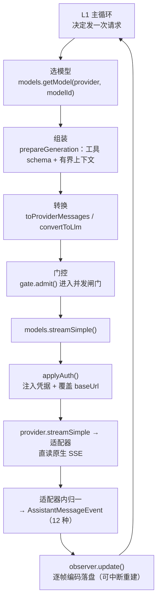
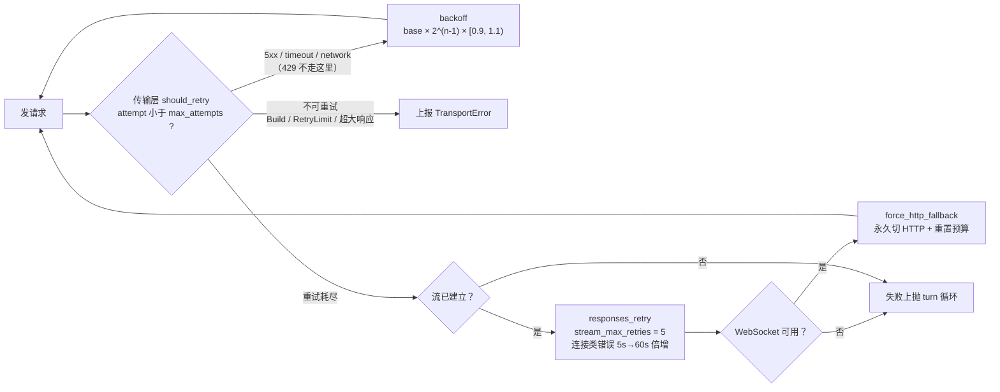

# 第 9 章：模型调用与 Provider 抽象 —— 把 N 种线协议归一成一套事件词汇表

前八章看的都是 Agent 自己的骨架；本章拆的是那个一直被当作黑盒的部件：它怎么把「我要一段回复」翻译成一次 HTTP 流式请求，怎么把各家千奇百怪的 SSE 事件收敛成循环能消费的东西，以及在限流、截断、超窗、参数非法时如何不失体面地收场。四家的选择差异极大——codex 把协议收敛到只剩一种，pi 支持 41 家但把重试默认关掉，dsh 干脆借用了 pi 的库并给它打了补丁，Claude-Code 则连归一化都不做。读完能拿到一个判断标准：**这一层真正的产出不是「能调通模型」，而是一套词汇表——它的宽度决定了上层循环要写多复杂，也决定了换 provider 时哪一层的代码要动。**

> **本层定位**：L9，把「一次模型调用」这层不稳定、多变、易失败的外部依赖，收敛成循环可以稳定消费的**事件序列 + 计量数据**。
>
> **前置依赖**：01（主循环如何消费流式事件）、03（工具 schema 如何投影给 provider）、04（usage 如何参与压缩预算）、05（消息类型与跨 provider 转换损失）。
>
> **跨层联动**：12 —— 见 4.4.4。缓存断点打在哪个位置不是本层的自由，它由提示词组装层给出的**静态/动态分界**决定，本层只负责把那个分界翻译成 API 参数。
>
> **分析对象**：
> - **pi** —— `packages/ai/src/{types,models}.ts` + `ai/src/api/{anthropic-messages,openai-completions,lazy}.ts` + `ai/src/utils/{retry,provider-retry,overflow}.ts` + `agent/src/harness/runtime/drive/{response,generation}.ts`
> - **deepseek-harness** —— `packages/llm/llm/src/*`（`StreamChunk` 契约）+ `llm/llm-deepseek/src/adapter.ts`（自写）+ `llm/llm-pi-ai/src/*`（复用 pi-ai 并打补丁）+ `llm/llm-retry/src/index.ts`
> - **codex** —— `codex-rs/model-provider-info/src/lib.rs`（`WireApi`）+ `codex-api/src/sse/responses.rs`（唯一原生事件消化点）+ `model-provider/src/*` + `core/src/client.rs`
> - **Claude-Code** —— `src/services/api/claude.ts`（流式事件机，核心）+ `api/{client,withRetry,errors}.ts` + `utils/model/*`
>
> **易混点**：codex 的 `WireApi` 枚举只有 `Responses` 一个变体，Chat Completions 协议不在本版本源码中（配置里写 `wire_api = "chat"` 会直接报错并附修复指引，见 4.3.1）。Claude-Code 不定义自己的事件词汇表，而是把 Anthropic 原生 `stream_event` 透给上层（见 2.3 与 4.4.3）。
>
> **门控提示**：Claude-Code 在本层大量能力由 `feature()` 编译开关门控，逐文件清单见附录。

---

## 一、核心结论速览

1. **这一层的真正产物是一套「事件词汇表」，四家的宽度差了 2.4 倍**：pi 收敛出 **12 种** `AssistantMessageEvent`；dsh 压到 **7 种** `StreamChunk`——四家最窄；codex 有 **17 种** `ResponseEvent`（因为它把控制面事件如 `RateLimits` / `ModelsEtag` / `ServerModel` 也塞进了同一条流）；**Claude-Code 一种都不定义**，直接把 Anthropic 原生 `stream_event` 透给上层 `switch`。

2. **归一化的边界位置，决定了换 provider 要改哪一层**：pi 与 dsh 的边界画在**适配器之内**（对外只出统一事件，原生形态不外泄）；codex 画在 **SSE 解析层**（`codex-api/src/sse/responses.rs` 是唯一的原生事件消化点）；CC 画在**调用方**（`claude.ts:1979` 的 `switch (part.type)`）——只有「全世界只有一家 provider」才付得起这个代价。

3. **codex 走的是收敛路线，且执行得非常彻底**：`WireApi` 枚举**只剩 `Responses` 一个变体**，配置里写 `wire_api = "chat"` 会直接报错并附修复指引与讨论区链接（`model-provider-info/src/lib.rs:95`、`:125`），内置 provider 也从 5 个降到 4 个（`ollama-chat` 一并移除）。**这与 pi 的 41 家 provider 是两个极端**——一个赌「协议会统一」，一个赌「长尾永远存在」。

4. **两个项目在核心层真的打通了**：dsh 的 `llm-pi-ai` 直接依赖 `@earendil-works/pi-ai ^0.85.1`（`llm-pi-ai/package.json:44`），并且**给它打了补丁**——`patches/@earendil-works__pi-ai@0.85.1.patch` 删掉了 4 个适配器里「每收一个 delta 就全量重解析参数 JSON」的 O(n²) 调用。配套的设计方法论更值得记：dsh 让 `llm-deepseek`（自己写）与 `llm-pi-ai`（借用）跑**同一套 `StreamChunk`**，并在注释里写下「**任何两者都表达不了的东西，就是核心词汇表的 bug**」——用双实现验证抽象的完备性。

5. **重试次数四家全不同，而 pi 在 provider 层默认不重试**：pi 请求级 `maxRetries` 默认 **0**（`provider-retry.ts:109`），重试改由 harness 层 `DEFAULT_RETRY_POLICY.maxRetries = 3` 承担；dsh **5** 次；codex 请求级 **4** / 流级 **5**；Claude-Code **10** 次（529 另限 3 次）。分歧的实质不是「几次」，而是**重试归传输层还是归会话层**——前者重发 HTTP，后者重放一整轮。

---

## 二、本层职责与边界

### 2.1 子职责拆解

本层可拆成 7 个子职责。四家的差异，本质是对这 7 问的答案组合不同：

| # | 子职责 | 要回答的问题 |
|---|---|---|
| ① | **模型标识** | 「一个模型」是什么？字符串、别名、还是带元数据的对象？provider 与 model 是两套标识还是一套？ |
| ② | **清单与能力** | 清单从哪来（硬编码 / 生成 / 远端拉取）？上下文窗口、最大输出、是否支持 thinking 与缓存写在哪？ |
| ③ | **请求组装** | 消息怎么转成 provider 形态？工具 schema 怎么投影？缓存断点打在哪？不支持的参数怎么裁？ |
| ④ | **传输** | HTTP/SSE 怎么发？超时、代理、取消信号怎么接？ |
| ⑤ | **事件归一** | 原生流怎么变成统一事件？归一化边界画在适配器内还是调用方？ |
| ⑥ | **容错** | 哪些错误重试、退避怎么算、几层重试、流断了能否续、模型失败有无 fallback？ |
| ⑦ | **计量与鉴权** | usage 四类 token 怎么统计、算不算钱、在哪累计？凭据从哪解析、优先级如何？ |

### 2.2 本层不管什么

- **不管消息是什么形状** —— 那是 L5。但**跨 provider 的转换损失全部发生在本层**（例如 pi 把后置 system 折叠成 user，见 4.1.5）。
- **不管什么时候该压缩** —— 那是 L4。但**超窗信号由本层识别、预算由本层上报**：codex 的 `context_window.rs` 拿本层累计的 usage 去比阈值。
- **不管工具怎么定义** —— 那是 L3。但工具 schema 的**最终投影形态**由本层决定（哪些字段发给哪家）。
- **不管主循环怎么写** —— 那是 L1。但本层的事件词汇表**反过来决定了循环能写多简单**：dsh 的 7 种事件对应一个瘦循环，CC 的原生透传对应一屏 `switch`。
- **不管谁有权调用** —— 那是 L8。本层只管「凭据能不能拿到」，不管「这次调用该不该被批」。

### 2.3 层次定位

```text
┌────────────────────────────────────────────────────────┐
│ L9 模型调用与 Provider 抽象（本章）                    │
│   把 N 种外部线协议 → 1 套事件词汇表 + 1 套计量口径    │
│   ⇒ 唯一一层「其抽象宽度决定上层复杂度」的适配层       │
└────────────────────────────────────────────────────────┘
        ▲                                        │
        │ 消费                                   │ 上报
        │                                        ▼
  L1 主循环（流式事件驱动；词汇表多宽，循环就多胖）
        │
        ├── L3 工具定义（schema 投影到各家 wire 格式）
        ├── L4 上下文压缩（超窗信号 + usage 预算来自本层）
        ├── L5 消息模型（跨 provider 转换损失发生在本层）
        └── L8 权限（本层只解析凭据，不判定该不该调）
```

**图 9-1**：L9 的位置。它的特殊性在于「**反向约束**」——前八章都是本层向上提供能力，只有本层的事件词汇表**反过来框住了 L1 的形状**。因此这一层真正的设计问题是抽象问题：**归一化边界画在哪，以及词汇表留多宽**。

```text
四家的 Provider 层骨架（越靠上，抽象越厚）

  pi      ai 整包：41 家 provider shard + 20 个 api 模块（去掉 helper 约 13 个真适配器）
          └─ 归一在适配器内：对外只出 12 种 AssistantMessageEvent
          └─ 元数据构建期生成（providers/*.models.ts 41 个 shard）

  dsh     契约层：llm（StreamChunk 仅 7 种） + 孪生适配器
          ├─ llm-deepseek      自写：直连 fetch + 自实现 wire 映射
          ├─ llm-pi-ai         借用：包住 @earendil-works/pi-ai，含上游 patch
          ├─ llm-retry         无配置插件，策略由 adapter 拥有
          └─ token-meter       从 durable 日志回放测量，不算钱

  codex   协议收敛：WireApi 只剩 Responses 一个变体
          └─ codex-api（SSE 唯一消化点） → ResponseEvent（17 种）
          └─ model-provider-info（20 字段配置）/ models-manager（目录+缓存）

  CC      单一 provider 家族：不做归一
          └─ claude.ts 直接 switch Anthropic 原生 part.type
          └─ utils/model 用「别名表 7 个 + 子串归并」代替模型目录
```

**图 9-2**：四种骨架。pi 与 codex 是「厚适配层」的两个方向——pi 用**广度**（41 家）换通用性，codex 用**收敛**（1 种协议）换简单性；dsh 用**契约**（7 种事件、双实现验证）换可替换性；CC 用**不做抽象**换取零转换损失。
---

## 三、概念对齐表

**同一个概念，四家分别叫什么、有没有这个东西**。空白格本身就是结论。

| 概念 | pi | deepseek-harness | codex | Claude-Code |
|---|---|---|---|---|
| **provider 标识** | `ProviderId = KnownProvider \| string`（41 项已知，`types.ts:35`） | 路由键字符串 `LlmProviderInfo.id`（`llm/src/types.ts:224`） | `ModelProviderInfo`（20 字段配置结构，`model-provider-info/src/lib.rs:134`） | `APIProvider` 四值枚举（`model/providers.ts:4`） |
| **模型标识** | `Model<TApi>` 对象（`types.ts:982`），含 cost / contextWindow / maxTokens | `(provider, id)` 二元组 → `LlmResolvedModelInfo`（`llm/src/types.ts:400`） | `ModelInfo`（`models-manager`），provider 侧只有 slug 字符串 | 仅 `ModelName: string`（`model/model.ts:32`），无结构 |
| **provider × model 是否两套标识** | **是**（`provider` + `api` + `id` 三个维度） | **是**（路由键 + 模型 id） | **是**（provider 配置 + 模型 slug） | **否**（模型名自带 provider 语义，由 env 决定走哪家） |
| **模型清单来源** | **构建期生成**：`providers/*.models.ts`（41 个 shard）+ `data/*.json` | 各 adapter 的 `listModels()` / `resolveModel()`，可注册模型发现 | **远端 `/models` + 磁盘缓存**（TTL 300s）+ 内置 bundled `models.json` | **硬编码矩阵**：4 provider × 11 模型的 ID 常量表（`model/configs.ts:87-97`） |
| **未知模型怎么办** | `getModel` 返回 undefined → 调用方处理 | adapter `resolveModel()` 决定，凭据缺失则 `MISSING_CREDENTIAL` fail-loud | **最长前缀匹配 → 失败回落 fallback 元数据 + `warn!`（按 272k 上下文）** | `getModelCosts` 回退默认价并打点 `tengu_unknown_model_cost` |
| **协议数** | 10 个 `KnownApi` 线协议（`types.ts:17`） | 由 adapter 决定（pi-ai 侧 3 个 `PROTOCOLS`） | **1 个**（`WireApi::Responses`，chat 已删） | 1 个（Anthropic Messages，含 3P 变体） |
| **统一事件词汇表** | `AssistantMessageEvent`，**12 种**（`types.ts:652`） | `StreamChunk`，**7 种**（`llm/src/types.ts:440`） | `ResponseEvent`，**17 种**（`codex-api/src/common.rs:80`） | **无**（原生 `stream_event` 直通） |
| **归一化边界** | 适配器内部 | 契约层（adapter 的 `translate`） | SSE 解析层（`sse/responses.rs`） | 调用方（`claude.ts:1979`） |
| **请求级重试默认** | **0 次**（`provider-retry.ts:109`，交由 harness 层 3 次） | **5 次**（`retry-policy.ts:14`） | **4 次**（请求）/ **5 次**（流，`model-provider-info/src/lib.rs:64-65`） | **10 次**（`withRetry.ts:52`），529 另限 3 次 |
| **退避算法** | `min(0.5·2^n, 8)s` × 25% 抖动 | `min(initial·2^(n-1), max)` × 10% 抖动，initial 500ms / max 10s | `base·2^(n-1)` × **0.9~1.1 抖动**，base 200ms | `min(500·2^(n-1), max)` + 25% 抖动 |
| **`Retry-After` 是否遵守** | 是（优先 `retry-after-ms`/`retry-after`） | 是（provider 值覆盖本地退避） | **否**（`codex-client/src/retry.rs:101` 留有 TODO） | 是（`x-should-retry` 头优先） |
| **429 是否在传输层重试** | 是 | 是（`RATE_LIMIT` 在默认可重试集） | **否**（`retry_429 = false`，避免与业务层重复退避） | 是（非订阅者或 Enterprise） |
| **模型 fallback** | harness 层按 `isRetryableAssistantError` 重试同一模型 | adapter 级，无跨模型 fallback | 重试耗尽后 WebSocket → HTTP 降级（`force_http_fallback`） | **有**：连续 529 ≥3 且配了 `fallbackModel` 时切模型重放整请求 |
| **usage 字段** | `input`/`output`/`cacheRead`/`cacheWrite`（+`cacheWrite1h`/`reasoning`） | `uncachedInputTokens`/`outputTokens`/`cacheReadTokens`/`cacheWriteTokens` | `input_tokens`/`cached_input_tokens`/`cache_write_input_tokens`/`output_tokens`/`reasoning_output_tokens` | 四类 token + `cache_creation.ephemeral_1h/5m` |
| **是否算钱** | **是**（`calculateCost`，含 Anthropic 1h 缓存写 2x） | **否**（`NO_COST`，注释明说不读 pi-ai 的成本元数据） | **否**（`TokenUsage` 无 cost 字段，只有 `codex_rollout_budget_units`） | **是**（`tokensToUSDCost` + `MODEL_COSTS` 价目表） |
| **计量累计方式** | 内存累加（`addUsage`），逐轮写 `usage` 行 | **从 durable 日志回放重算**（`logRevision` 作锚点） | 内存累加（`update_token_info_from_usage`），参与压缩预算 | 内存累加（`accumulateUsage`），`message_delta` 处算 session 成本 |
| **凭据来源** | 显式 override → 存储凭据 → ambient env；含 **8 种 OAuth 订阅登录** | 继承 env → `.credentials.yaml` → cwd `.env` → `$DSH_HOME/.env` | provider 自身凭据 > 托管登录（`CODEX_API_KEY` 优先）> ChatGPT 订阅；AWS SigV4 | OAuth 订阅 vs API key 二选一；3P 走 AWS/GCP 各自刷新 |
| **prompt cache 控制** | `Model.promptCache` + `resolveCacheRetention()` | 由 adapter / pi-ai 侧处理 | 服务端自动（客户端不发 cache 断点） | **显式断点**：`addCacheBreakpoints` 只打一个，TTL 5m/1h |

> **读法提示**：第 7 行（事件词汇表宽度）与第 8 行（归一化边界）是本章的核心。**词汇表越窄，上层循环越瘦，但适配器要做的事越多**——dsh 的 7 种事件意味着每个 adapter 都承担了「把自家语义压进 7 个格子」的全部压力；CC 的 0 种则把压力全部转移给了 `query.ts`。

---

## 四、逐项目实现

### 4.1 pi：41 家 provider，构建期生成元数据

> pi 的 ai 包是四家里**最像「独立 SDK」**的一个——它不假设自己服务于一个 Agent，因此把「支持多少家」当成核心指标。

#### 4.1.1 三层标识：provider / api / model

pi 把标识拆成三个正交维度，这是它能支持 41 家的前提：

```ts
// packages/ai/src/types.ts:17 —— 线协议（怎么说话）
export type KnownApi = "openai-completions" | "mistral-conversations" | "openai-responses"
	| "azure-openai-responses" | "openai-codex-responses" | "anthropic-messages"
	| "bedrock-converse-stream" | "google-generative-ai" | "google-vertex" | "pi-messages";
export type Api = KnownApi | (string & {});
```

```ts
// packages/ai/src/types.ts:35 —— 供应商（谁家）
export type KnownProvider = "amazon-bedrock" | "ant-ling" | "anthropic" | ... | "xiaomi-token-plan-sgp";  // 共 41 项
export type ProviderId = KnownProvider | string;
```

```ts
// packages/ai/src/types.ts:982 —— 模型（具体哪个）
export interface Model<TApi extends Api> {
	id: string; name: string; api: TApi; provider: ProviderId; baseUrl: string;
	reasoning: boolean; input: ("text" | "image")[];
	cost: ModelCost; promptCache?: ModelPromptCache;
	contextWindow: number; maxTokens: number;
}
```

**关键设计**：`api` 与 `provider` 解耦，所以「同一个 provider 走不同协议」或「不同 provider 共用同一协议」都能表达。`Model` 自带 `baseUrl`，为后面的凭据级端点覆盖留了钩子（4.1.4）。

#### 4.1.2 元数据是构建期生成的，不是运行时拉的

```ts
// packages/ai/src/models.generated.ts:3
// This file is auto-generated by scripts/generate-models.ts
```

每个 provider 一个 shard，共 41 个 `providers/*.models.ts`，内容从 `data/*.json` 展平（该目录在 `.gitignore` 中生成）：

```ts
// packages/ai/src/providers/anthropic.models.ts:4
import values from "./data/anthropic.json" with { type: "json" };
export const ANTHROPIC_MODELS: ModelCatalog<typeof values, "anthropic"> =
	flattenModelCatalog("anthropic", values);
```

**唯一的运行时动态目录是 `radius`**（网关型 provider）：

```ts
// packages/ai/src/providers/radius.ts:49
refreshModels: async (context) => { ... await loadRadiusGatewayConfig(gateway, apiKey, ...) }
```

> **设计理由** [`推断`]：构建期生成让**成本、窗口、能力都变成编译期常量**，代价是模型上线要重新发版。pi 用「只给网关开动态口子」折中了这一点——因为网关后面的模型清单本来就无法预知。

#### 4.1.3 主流程：从选模型到事件进循环



**图 9-3**：pi 的一次生成请求全链路。注意 `applyAuth` 位于适配器**之前**且能改写 `baseUrl`——这让「同一模型走不同端点」成为纯配置行为。

关键行号：

| 步骤 | 位置 |
|---|---|
| 选模型（harness） | `packages/agent/src/harness/runtime/drive/generation.ts:74` |
| 组装（工具 + 上下文） | `generation.ts:68` `prepareGeneration()`，`:90` 构造 `Tool[]`，`:117` 应用 `before_request` hook |
| 消息转换 | `packages/agent/src/harness/execution/assistant.ts:146` |
| 并发闸门 + 发起 | `generation.ts:216` `drive.gate.admit(() => lane.models.streamSimple(...))` |
| 凭据注入 | `packages/ai/src/models.ts:648` `applyAuth()`，`:671` 覆盖 `baseUrl` |
| 适配器循环 | `packages/ai/src/api/anthropic-messages.ts:601` `for await (const event of iterateAnthropicEvents(...))` |
| 消费侧 | `assistant.ts:108` 区分 `start` / `isUpdateEvent` → `observer.start/update` |
| 帧编码（可恢复） | `packages/agent/src/harness/runtime/drive/response.ts:70` `frameEncoder.encode(event)` |

#### 4.1.4 鉴权：三层回退 + 8 种订阅登录

```ts
// packages/ai/src/auth/resolve.ts:63  resolveProviderAuthWithSignal
//   ① 显式 overrides.apiKey  →  ② 存储凭据  →  ③ ambient
// packages/ai/src/auth/resolve.ts:106
// Ambient (env vars, AWS profiles, ADC files).
return provider.auth.apiKey ? resolveApiKey(requestAuthContext, provider.auth.apiKey, provider.id, undefined, signal) : undefined;
```

环境变量名表集中在 `env-api-keys.ts:79`（`envMap`）；特殊项单独处理：`envMap` 里 anthropic 走三变量（`:75`）、bedrock 支持六种 AWS 来源（`:168`）、vertex 走 ADC（`:156`）。

**OAuth / 订阅登录有 8 种**（`auth/oauth/load.ts:14`）：anthropic、openaiCodex、githubCopilot、openrouter、kimiCoding、meta、xai、radius。刷新用双检锁：

```ts
// packages/ai/src/auth/resolve.ts:127  resolveStoredOAuth
//   默认 5 分钟有效期窗口（:119）
```

`provider-env.ts` 做的是 **provider 级 env 覆盖 + Bun 沙箱兜底**（不是沙箱本身）：

```ts
// packages/ai/src/utils/provider-env.ts:45
export function getProviderEnvValue(name: string, env?: ProviderEnv): string | undefined {
	return env?.[name] || (typeof process !== "undefined" ? process.env[name] : undefined) || getBunSandboxEnvValue(name) || undefined;
}
```

> **说明**：`getBunSandboxEnvValue` 读 `/proc/self/environ`——因为 Bun 的沙箱模式会清洗 `process.env`，凭据只能从原始终环境块里捞。这与第 8 章「pi 不做权限层」是一回事：环境隔离由宿主（Bun 沙箱）提供，pi 只负责把它读回来。

#### 4.1.5 重试分三层，且请求级默认关闭

```ts
// packages/ai/src/utils/provider-retry.ts:109
const maxRetries = options.maxRetries ?? 0;   // ← 默认 0
```

文件头注释解释了原因（`provider-retry.ts:100`）：适配器必须以 `maxRetries: 0` 调用底层 SDK，**因为取消信号由自己掌控**。真正生效的重试在 harness 层：

```ts
// packages/agent/src/harness/config.ts:4
export const DEFAULT_RETRY_POLICY: RetryPolicy = { enabled: true, maxRetries: 3, baseDelayMs: 1_000, maxAgentDelayMs: DEFAULT_MAX_AGENT_RETRY_DELAY_MS };
```

决策点是一个**显式状态机**（`assistant.effect_pending` → `assistant.retry_wait`）：

```ts
// packages/agent/src/harness/runtime/drive/response.ts:276-295 —— if/else 链中的 error 分支
if (response.stopReason === "error") {
	if (
		current.at === "assistant.effect_pending" &&
		(options.recovery === true || isRetryableAssistantError(response)) &&
		current.attempt < current.generationContext.retryPolicy.maxAttempts
	) {
		settled = {
			...scope,
			at: "assistant.retry_wait",
			generationContext: current.generationContext,
			nextAttempt: current.attempt + 1,
			notBefore: retryNotBefore(current.generationContext.retryPolicy, current.attempt),
			errorMessage: response.errorMessage ?? "Assistant request failed",
		};
	} else {
		failure = providerError(source, response);
	}
}
```

请求级重试若被显式打开，判定优先看服务端提示：

```ts
// packages/ai/src/utils/provider-retry.ts:23
function isRetryableProviderError(error: ProviderError): boolean {
	const shouldRetry = error.headers?.get("x-should-retry");
	if (shouldRetry === "true") return true;
	if (shouldRetry === "false") return false;
	if (error.status === undefined) return true;
	return error.status === 408 || error.status === 409 || error.status === 429 || error.status >= 500;
}
```

退避 `getRetryDelayMs`（`:51`）优先 `retry-after-ms`/`retry-after`，否则 `Math.min(0.5 * 2 ** retryIndex, 8) * 1000` 再乘 25% 抖动。

**额度类错误被刻意排除在可重试之外**：

```ts
// packages/ai/src/utils/retry.ts:8-9（注释）
// These are subscription/account limits, not transient throttles
```

#### 4.1.6 计量：算钱，且把 1h 缓存写按 2 倍价

```ts
// packages/ai/src/types.ts:396
export interface Usage {
	input: number; output: number; cacheRead: number; cacheWrite: number;
	cacheWrite1h?: number; // 仅 Anthropic 报告
	reasoning?: number;    // output 的子集
	totalTokens: number;
	cost: { input: number; output: number; cacheRead: number; cacheWrite: number; total: number };
}
```

```ts
// packages/ai/src/models.ts:900-917
export function calculateCost<TApi extends Api>(model: Model<TApi>, usage: Usage): Usage["cost"] {
	const inputTokens = usage.input + usage.cacheRead + usage.cacheWrite;
	let rates: ModelCostRates = model.cost;
	let matchedThreshold = -1;
	for (const tier of model.cost.tiers ?? []) {
		if (inputTokens > tier.inputTokensAbove && tier.inputTokensAbove > matchedThreshold) {
			rates = tier;
			matchedThreshold = tier.inputTokensAbove;
		}
	}

	// Anthropic charges 2x base input for 1h cache writes.
	const longWrite = usage.cacheWrite1h ?? 0;
	const shortWrite = usage.cacheWrite - longWrite;

	usage.cost.input = (rates.input / 1000000) * usage.input;
	usage.cost.output = (rates.output / 1000000) * usage.output;
	usage.cost.cacheRead = (rates.cacheRead / 1000000) * usage.cacheRead;
	usage.cost.cacheWrite = (rates.cacheWrite * shortWrite + rates.input * 2 * longWrite) / 1000000;
	usage.cost.total = usage.cost.input + usage.cost.output + usage.cost.cacheRead + usage.cost.cacheWrite;
	return usage.cost;
}
```

缺 usage 时回落字符估算：`packages/ai/src/utils/estimate.ts:97` `estimateContextTokens`（`:15` 每 token 4 字符，`:16` 图片按 4800 字符）。

#### 4.1.7 两个适配器的差异，说明归一化成本在哪

| 维度 | Anthropic | OpenAI Completions |
|---|---|---|
| 流形态 | **按块驱动**，块内有明确起止 | **扁平 chunk**，无块概念 |
| 文本累积 | `block.text += event.delta.text`（`anthropic-messages.ts:676-685`） | 惰性建块 `ensureTextBlock()`（`openai-completions.ts:474`） |
| 工具参数 | `input_json_delta` 累积 `partialJson` 后 `parseStreamingJson`（`:699-710`、`:740`） | 按 `tool_calls[].index`/`id` **自建块**（`:494` `ensureToolCallBlock()`、`:401` `toolCallBlocksByIndex`） |
| 停因映射 | `:1494` `mapStopReason` | `openai-completions.ts:1554` 把 `content_filter` 映射为错误 |

> **设计理由** [`注释`]：这两个适配器合计 3,246 行（1520 + 1726），其中大半是「把扁平流补成块结构」和「跨 SDK 探测错误字段」。**归一化的成本不会消失，只会转移**——pi 选择让适配器承担，换来上层只认 12 种事件。

---

### 4.2 dsh：契约先行，孪生适配器验证抽象

> dsh 的做法与 pi 正相反：它先定**最窄的词汇表**，再拿两个完全不同的实现去撞它。

#### 4.2.1 只有 7 种事件

```ts
// packages/llm/llm/src/types.ts:440-452
export type StreamChunk =
  | { type: 'block-start'; index: number; blockType: ContentBlockType }
  | { type: 'text-delta'; index: number; text: string }
  | { type: 'reasoning-delta'; index: number; text: string }
  | { type: 'tool-call-delta'; index: number; id: ToolCallId; name?: string; argumentsDelta: string }
  | { type: 'block-end'; index: number; block: ContentBlock }
  | { type: 'usage'; usage: TokenUsage }
  | { type: 'finish'; reason: FinishReason; replayState?: ReplayEnvelope }
```

块类型 6 种（`types.ts:138-146`）：`text` / `reasoning` / `image` / `file` / `tool-call` / `tool-addition` / `tool-removal`。终止原因 5 种（`types.ts:157-163`）：`stop` / `tool-calls` / `max-tokens` / `aborted` / `error`。

**注意 `block-start` + `block-end` 的设计**：dsh 把「块」显式建模成事件，所以**任何流形态都能被压平**——扁平 chunk（OpenAI 系）在 adapter 里补出块边界，天然分块的（Anthropic）直接映射。这是 7 种事件能覆盖 3 种协议的真正原因。

#### 4.2.2 Adapter 契约：7 个方法，策略归 adapter

```ts
// packages/llm/llm/src/index.ts:204  abstract class LlmAdapter
providerInfo():210 · providerRetryPolicy():219 · imageRequestPricing():232
listModels():243 · resolveModel():256 · prepareCall():273 · abstract stream():285
```

服务类 `LlmRuntime`（`index.ts:337`）对外公开 `listProviders` / `discoverModels` / `resolveModelInfo` / `resolveCallConfig` / `prepareCall` / `stream` 等（`:473`–`:1112`）。

**`providerRetryPolicy()` 在 adapter 上，不在 runtime 上**——这是关键分工：重试策略是**provider 的属性**，不是运行时的全局配置。

#### 4.2.3 主流程

| 步骤 | 位置 |
|---|---|
| 组装（含 `agent/request` 瀑布，扩展可改请求） | `packages/core/agent-loop/src/agent.ts:529` `prepareRequest()`，`:558` `dispatch.waterfall('agent/request', ...)` |
| 冻结请求 | `agent.ts:638` `Object.freeze({ ... })`（不可变） |
| 准备调用 | `agent.ts:569` `loopCtx.llm.prepareCall(proposedConfig, signal)` → `llm/src/index.ts:921` → `deepFreeze(structuredClone(...))`（`:926`） |
| 发起流 | `agent.ts:418` `preparedCall?.stream(request) ?? loopCtx.llm.stream(request)` |
| 流式边界（**扩展可介入**） | `llm/src/index.ts:1120` `ctx.waterfall(this, 'llm/stream', options, () => this.adapterStream(options, prepared))` |
| 能力降级（图片→占位文本） | `llm/src/index.ts:1057` `projectImagesForTextModel(...)`；文件永外发 `:1051` `projectFilesToText(...)` |
| 消费 | `agent.ts:422` `for await (const chunk of stream)` |
| 累积 | `packages/llm/llm/src/assembler.ts:38` `BlockAssembler`（chunk → block） |

`llm/stream` 是一个**瀑布钩子**——这意味着扩展可以整体替换流实现。这与第 10 章「dsh 把扩展语义收敛成 5 种调度模式」完全一致。

#### 4.2.4 孪生适配器：本章最值得抄的方法论

```json
// packages/llm/llm-pi-ai/package.json:4
"description": "pi-ai-backed DeepSeek adapter for the DeepSeek Harness LLM seam (design-verification twin of dsh-llm-deepseek)",
// :44
"@earendil-works/pi-ai": "^0.85.1"
```

设计文档把意图写得非常明确：

```md
// .agents/notes/implemented/architecture/2026-06-13-twin-llm-adapters.md:14-18
- `dsh-llm-deepseek` — direct `fetch` + in-repo translation against the DeepSeek API ...
- `dsh-llm-pi-ai`     — the same endpoint through the `@earendil-works/pi-ai` library (its own event vocabulary).
... anything the StreamChunk vocabulary cannot express for BOTH implementations is a core-vocabulary bug
```

**这是本报告里唯一一处「用两个独立实现来证伪抽象」的工程实践**：同一个端点，一条路自己写 wire 映射，另一条路穿过一整个第三方 ai 库。如果两者都能被 `StreamChunk` 表达，说明这套词汇表是够用的；如果某处只有一方能表达，那就是词汇表的缺陷，不是适配器的问题。

```text
孪生适配器：同一端点，两条极不相干的路（出口必须是同一套词汇表）

   同一个 DeepSeek 端点
        │
        ├─ dsh-llm-deepseek ── 自写 wire 映射
        │     index.ts:57    PROVIDER = 'deepseek-official'
        │     adapter.ts:113 直接 fetch Messages 端点
        │     serialize.ts / translate.ts   手工做 wire 映射
        │     file-store.ts / files-api.ts  管 Files API 图片上传
        │
        └─ dsh-llm-pi-ai ───── 穿过 @earendil-works/pi-ai ^0.85.1
              models.ts:31    createModels() 后 clearProviders()
              provider.ts:47  PROTOCOLS = { openai-completions,
                                            openai-responses,
                                            anthropic-messages }
              adapter.ts:326  stream → streamWithSnapshot
              stream.ts:142   toStreamChunks(...)  ← 事件词汇表在此对齐
                    │
                    ▼
   StreamChunk（7 种）  ← 唯一出口；两者都表达不了的 = 词汇表的 bug
```

**图 9-4**：孪生适配器的结构。这张图的价值在于**它把「契约是否合格」变成了一个可执行的判据**——不需要设计评审，跑两个实现即可。注意 `llm-pi-ai` 那一侧同时被 41 家 provider 的元数据能力（来自 pi）与 dsh 自己的凭据、附件、超时服务（来自 `peerDependencies`）夹在中间，这个夹层才是「借用别家 ai 层」真正的成本所在。

它包住的是 pi-ai 的 `Models`/`Provider` 集合，并**补/改**了这些：

| 补什么 | 位置 |
|---|---|
| 按路由重建 provider（清空内置集合） | `llm-pi-ai/src/models.ts:31` `createModels()` → `:42` `createProvider()` |
| 协议表（三种） | `llm-pi-ai/src/provider.ts:47` `PROTOCOLS = { openai-completions, openai-responses, anthropic-messages }` |
| 复用 pi-ai 的 catalog provider 实现 | `provider.ts:144` `reuseCatalogProvider()` |
| per-request 凭据解析 | `llm-pi-ai/src/index.ts:183` `resolveApiKey` |
| 凭据记账（写回 `llm-pi-ai/<id>`） | `llm-pi-ai/src/auth.ts:36` `recordKeyFor` |
| **显式拒绝 `stop` 参数** | `llm-pi-ai/src/adapter.ts:334` |
| 非图片模型的图片 → `UNSUPPORTED_CONTENT` | `adapter.ts:359` |

**并且 dsh 给上游提交了性能修复**：

```diff
# patches/@earendil-works__pi-ai@0.85.1.patch
# 在 4 个适配器里删掉「每 delta 全量重解析参数 JSON」
-                            block.arguments = parseStreamingJson(block.partialJson);
# 命中：anthropic-messages.js / bedrock-converse-stream.js / mistral-conversations.js / openai-completions.js
```

> **设计理由** [`注释`]：这是 O(n²) 开销——参数 JSON 每增长一个 delta 就整体重解析一次。dsh 的 README 记录了这件事。**一个下游消费者主动修上游库的性能 bug，是「这层抽象真的被两家共用」的最硬证据**。

#### 4.2.5 重试：无配置插件，策略归 provider

```ts
// packages/llm/llm/src/retry-policy.ts:14-24
const DEFAULT_MAX_RETRIES = 5
const DEFAULT_INITIAL_DELAY_MS = 500
const DEFAULT_MAX_DELAY_MS = 10_000
const DEFAULT_JITTER_RATIO = 0.1
const DEFAULT_RETRYABLE_CODES = Object.freeze([EMPTY_RESPONSE_CODE, 'RATE_LIMIT', 'SERVER', 'TIMEOUT', 'TRANSPORT'])
```

两种模式（`retry-policy.ts:37` / `:49`）：`normal`（有界，仅白名单码）与 `always`（无上限，重试一切）。

执行器 `llm-retry` 是**无配置的 function plugin**（`llm-retry/src/index.ts:24-28`），监听 `agent/request-error`（`:243`）。它的**先落盘后等待**顺序值得单独记一笔：

```ts
// packages/llm/llm-retry/src/index.ts:188-191
agent.session.append('llm/retry')        // ← 先把「要重试」写进日志
→ agent.session.append('llm/retry-started')
→ return { kind: 'retry' }
```

> **设计理由**：与第 6 章「日志即事实源」一致——**重试这件事本身也是会话历史的一部分**。崩溃后从日志回放，能知道「当时重试到第几次了」。这解释了为什么 dsh 的重试器需要拿到 `session`。

**流式中断与请求失败被区分对待**：只在 durable 的 agent-step 边界重试；直接调 `ctx.llm.stream()` 保持单次尝试（README:132）。失败归一：

```ts
// packages/llm/llm/src/index.ts:1130-1138
function adapterFailureChunk(error: unknown, signal?: AbortSignal): StreamChunk {
  const failure = normalizeLlmFailure(error)
  return { type: 'finish', reason: signal?.aborted || failure.code === 'ABORTED'
      ? { kind: 'aborted', failure } : { kind: 'error', failure } }
}
```

注意这里的产物是 **`StreamChunk`**——连异常也被归一成词汇表内的事件，而不是抛出。这是「词汇表必须完备」的另一面。

#### 4.2.6 计量：不算钱，而且是从日志回放出来的

```ts
// packages/llm/token-meter/src/types.ts:22-35
export interface TokenMeasurement {
  readonly logRevision: SessionLogOffset     // ← 锚点：这是针对哪个日志版本测的
  readonly baseline: TokenMeasurementBaseline
  readonly surfaceDeltaTokens: number
  readonly totalTokens: number
  readonly surfaceTokens: number
  readonly nodes: readonly TokenSurfaceNode[]
}
```

`TokenMeter` 服务（`token-meter/src/index.ts:101`，`inject = ['sessionProjections'] :106`）从 **durable session log 回放**测量，而非内存累加。无 usage 时回落 `baseline.kind='estimated'`（`:176-180`）。

**明确不算钱**：

```ts
// packages/llm/llm-pi-ai/src/catalog.ts:37
NO_COST   // 注释：harness never reads pi-ai's cost metadata
```

> **设计理由** [`注释`]：dsh 的计量目标是**预算**（窗口压力），不是账单。`logRevision` 这个字段说明它把「测量」也当成日志的派生视图——同一份日志可以重放出任意时刻的 token 分布，而累加器做不到这一点。

#### 4.2.7 鉴权：分层且 fail-loud

```text
// packages/credentials/credentials-local/src/index.ts:5-10
 * inherited process environment      (read-only, wins)
 * > $DSH_HOME/.credentials.yaml      (provider-managed, writable)
 * > <invocation cwd>/.env            (read-only fallback)
 * > $DSH_HOME/.env                   (read-only fallback)
```

```ts
// packages/credentials/credentials-local/src/index.ts:609-617 —— 三层回退
override resolve(ref: CredentialRef): Promise<ResolvedCredential | undefined> {
  const inherited = this.inherited(ref)
  if (inherited !== undefined) return Promise.resolve({ value: inherited, source: 'env' })
  const stored = this.values.get(ref)
  if (stored !== undefined) return Promise.resolve({ value: stored, source: 'file' })
  const fallback = this.dotenvFallback(ref)
  if (fallback !== undefined) return Promise.resolve({ value: fallback.value, source: fallback.source })
  return Promise.resolve(undefined)
}
```

**关键纪律**：已命名但解析不到的引用**直接 fail-loud 为 `MISSING_CREDENTIAL`，不回退到环境发现**（`llm-pi-ai/src/index.ts:189-205`）；只有未命名时才下探 ambient。格式错误另码 `INVALID_CREDENTIAL`（`llm/src/index.ts:149` `assertUsableApiKey`）。

> **设计理由** [`推断`]：静默回退是凭据系统最危险的失败模式——用户以为在用 A 账号，实际用了环境里残留的 B 账号。dsh 选择「宁可启动失败也不猜」。

---

### 4.3 codex：协议收敛到一种，配置开放到 20 个字段

> codex 的路线与 pi 截然相反：不追求支持多少家，而是**把协议统一掉**，让所有 provider 都来适配 Responses 形状。

#### 4.3.1 只有一种 wire 协议：Responses

```rust
// codex-rs/model-provider-info/src/lib.rs:102-106
pub enum WireApi {
    /// The Responses API exposed by OpenAI at `/v1/responses`.
    #[default]
    Responses,
}
```

```rust
// codex-rs/model-provider-info/src/lib.rs:95
const CHAT_WIRE_API_REMOVED_ERROR: &str = "`wire_api = \"chat\"` is no longer supported.\nHow to fix: set `wire_api = \"responses\"` in your provider config.\nMore info: https://github.com/openai/codex/discussions/7782";
```

```rust
// codex-rs/model-provider-info/src/lib.rs:124-126
"responses" => Ok(Self::Responses),
"chat" => Err(serde::de::Error::custom(CHAT_WIRE_API_REMOVED_ERROR)),
_ => Err(serde::de::Error::unknown_variant(&value, &["responses"])),
```

同一文件还移除了 `ollama-chat` provider（`:96-99` `OLLAMA_CHAT_PROVIDER_REMOVED_ERROR`）。

> **设计理由** [`注释`]：错误信息**同时给出修复动作和讨论区链接**——这是把「破坏性变更」当产品来做的写法。内置 provider 从 5 个减到 4 个（`openai` / `amazon-bedrock` / `amazon-bedrock-runtime` / `ollama` / `lmstudio` 中的 chat 变体消失，见 `:656-674`）也确认了这次收敛是彻底的。

#### 4.3.2 provider 配置有 20 个字段

```rust
// codex-rs/model-provider-info/src/lib.rs:134-194
pub struct ModelProviderInfo {
    pub name: String,
    pub base_url: Option<String>,
    pub model_catalog_url: Option<RedactedString>,
    pub env_key: Option<String>,
    pub env_key_instructions: Option<String>,
    pub experimental_bearer_token: Option<RedactedString>,
    pub auth: Option<ModelProviderAuthInfo>,
    pub gateway_oauth: Option<GatewayOAuthConfig>,
    pub aws: Option<ModelProviderAwsAuthInfo>,
    pub wire_api: WireApi,
    pub query_params: Option<HashMap<String, RedactedString>>,
    pub http_headers: Option<HashMap<String, RedactedString>>,
    pub env_http_headers: Option<HashMap<String, String>>,
    pub request_max_retries: Option<u64>,
    pub stream_max_retries: Option<u64>,
    pub stream_idle_timeout_ms: Option<u64>,
    pub websocket_connect_timeout_ms: Option<u64>,
    pub requires_openai_auth: bool,
    pub supports_websockets: bool,
    pub supports_standalone_web_search: bool,
}
```

注意**重试次数、超时、WebSocket 开关都是 provider 级字段**——与 dsh 的 `providerRetryPolicy()` 思路一致，都认为「容错是 provider 的属性」。自定义 provider 从 `~/.codex/config.toml` 的 `model_providers` 合并，**内置项不可覆写**（Bedrock 例外）：

```rust
// model-provider-info/src/lib.rs:698-715
if let Some(built_in_provider) = model_providers.get_mut(&key) {
    // 内建 provider 已存在：把用户配置叠加到它上面
    built_in_provider.base_url = base_url_override;
    built_in_provider.auth = auth_override;

    ...

} else {
    // 内建没有的 key：作为自定义 provider 插入
    model_providers.entry(key).or_insert(provider);
}
```

#### 4.3.3 主流程：SSE 是唯一的原生事件消化点

| 步骤 | 位置 |
|---|---|
| turn 循环发起采样 | `codex-rs/core/src/session/turn.rs:1584` `run_sampling_request` → `:2448` `try_run_sampling_request` |
| client 按 wire_api 分派 | `core/src/client.rs:2132` `ModelClientSession::stream`（`:2143-2145`） |
| 走 Responses 路径 | `core/src/client.rs:1609` `stream_responses_api` |
| 构造请求体 | `core/src/client.rs:881` `build_responses_request` |
| 发流式请求 | `codex-api/src/endpoint/responses.rs:70` `stream_request` → `:123` `stream_encoded` |
| 重试包裹 | `codex-client/src/retry.rs:82` `run_with_retry` |
| **原生事件消化** | `codex-api/src/sse/responses.rs:575` `process_sse_with_treatment` → `:353` `process_responses_event` |
| 映射为内部事件 | `core/src/client.rs:2257` `map_response_stream`、`:2280` `map_response_events` |
| turn 消费 | `session/turn.rs:2547` `stream.next()`、`:2574` `match event` |

```rust
// codex-rs/core/src/session/turn.rs:2827-2875
ResponseEvent::Completed {
    response_id,
    token_usage,
    usage_metadata,
    end_turn,
} => {
    // 落盘点：上报响应完成、结算 token 用量

    ...

    let budget_result = sess
        .record_token_usage_info(&turn_context, &step_context.settings, token_usage.as_ref())
        .await;
    if let Err(err) = budget_result {
        break Err(err);
    }

    // end_turn == Some(false) 表示服务端认为对话尚未结束
    if let Some(false) = end_turn {
        needs_follow_up = true;
    }
    break Ok(SamplingRequestResult { needs_follow_up, last_agent_message });
}
```

工具调用的识别（全部在 `sse/responses.rs`）：

```rust
// codex-api/src/sse/responses.rs:353-383 —— process_responses_event 内 match event.kind.as_str() 的代表分支
"response.output_item.done" => {
    if let Some(item_val) = event.item {
        if let Ok(item) = serde_json::from_value::<ResponseItem>(item_val) {
            return Ok(Some(ResponseEvent::OutputItemDone(item)));
        }
        debug!("failed to parse ResponseItem from output_item.done");
    }
}
"response.output_text.delta" => {
    if let Some(delta) = event.delta {
        return Ok(Some(ResponseEvent::OutputTextDelta(delta)));
    }
}
"response.custom_tool_call_input.delta" => {
    if let (Some(delta), Some(item_id)) =
        (event.delta, event.item_id.clone().or(event.call_id.clone()))
    {
        return Ok(Some(ResponseEvent::ToolCallInputDelta {
            item_id,
            call_id: event.call_id,
            delta,
        }));
    }
}
```

三类工具调用定义在 `protocol/src/models.rs`：`LocalShellCall`（`:1060`）、`FunctionCall`（`:1073`）、`CustomToolCall`（`:1133`）。**参数是字符串，服务端不预解析**（`:1081-1084`）——与 pi/CC 的「客户端累积 partial JSON」是同一个现实约束。

#### 4.3.4 事件词汇表最宽：17 种，因为塞进了控制面

`ResponseEvent`（`codex-api/src/common.rs:80-133`）的 17 个变体里，只有一半是内容事件：

| 类别 | 变体 |
|---|---|
| 生命周期 | `Created`、`Completed` |
| 内容项 | `OutputItemAdded`、`OutputItemDone` |
| 文本/推理增量 | `OutputTextDelta`、`ReasoningSummaryDelta`、`ReasoningSummaryDone`、`ReasoningContentDelta`、`ReasoningSummaryPartAdded` |
| 工具参数增量 | `ToolCallInputDelta` |
| **控制面** | `ServerModel`、`ModelVerifications`、`TurnModerationMetadata`、`ServerReasoningIncluded`、`RateLimits`、`ModelsEtag` |
| 安全 | `SafetyBuffering` |

> **设计理由** [`注释`]：`ServerModel` 的注释写着 「This can differ from the requested model when backend safety routing applies」——**服务端可能把请求路由到另一个模型**，客户端必须知道。`ServerReasoningIncluded` 则在告诉客户端「服务端已经算过历史推理 token 了，别再估一遍」。这些字段的存在说明 codex 把这层当作**与服务端的双向协议**，而不只是「取文本」。

#### 4.3.5 重试与降级：WebSocket 失败永久退到 HTTP

```rust
// codex-rs/codex-client/src/retry.rs:22-38
pub fn should_retry(&self, err: &TransportError, attempt: u64, max_attempts: u64) -> bool {
    if attempt >= max_attempts { return false; }
    match err {
        TransportError::Http { status, .. } => {
            (self.retry_429 && status.as_u16() == 429) || (self.retry_5xx && status.is_server_error())
        }
        TransportError::Timeout | TransportError::Connection(_) | TransportError::Network(_) => self.retry_transport,
        TransportError::Build(_) | TransportError::RetryLimit | TransportError::ResponseTooLarge { .. } => false,
    }
}
```

```rust
// codex-rs/codex-client/src/retry.rs:41-50 —— 唯一带双向抖动的实现
pub fn backoff(base: Duration, attempt: u64) -> Duration {
    if attempt == 0 { return base; }
    let exp = 2u64.saturating_pow(attempt as u32 - 1);
    let millis = base.as_millis() as u64;
    let raw = millis.saturating_mul(exp);
    let jitter: f64 = rand::rng().random_range(0.9..1.1);
    Duration::from_millis((raw as f64 * jitter) as u64)
}
```

**默认参数与「故意不在传输层重试 429」**：

```rust
// codex-rs/model-provider-info/src/lib.rs:440-446
let retry = ApiRetryConfig {
    max_attempts: self.request_max_retries(),     // 默认 4（:65）
    base_delay: Duration::from_millis(200),
    retry_429: false,                             // ← 429 交给业务层
    retry_5xx: true,
    retry_transport: true,
};
```

```rust
// codex-rs/model-provider-info/src/lib.rs:63-73
const DEFAULT_STREAM_IDLE_TIMEOUT_MS: u64 = 300_000;
const DEFAULT_STREAM_MAX_RETRIES: u64 = 5;
const DEFAULT_REQUEST_MAX_RETRIES: u64 = 4;
const MAX_STREAM_MAX_RETRIES: u64 = 100;
const MAX_REQUEST_MAX_RETRIES: u64 = 100;
```

429 的延迟不用退避算，而是**从错误文本里抠出来**：

```rust
// codex-rs/codex-api/src/sse/responses.rs:462-469、:692-719
// rate_limit_exceeded | slow_down → ApiError::RateLimitExceeded { delay }
// 从 "try again in Ns" 解析延迟
```

> **设计理由** [`推断`]：`retry_429 = false` 的理由是避免**双重退避**——传输层算一次、业务层按服务端建议再等一次，会等出两倍时间。这与 pi 优先读 `x-should-retry` 是同一种「服务端比客户端更知道该等多久」的判断。

**流中断重试与最终降级**（`core/src/responses_retry.rs`）：

| 场景 | 行为 | 位置 |
|---|---|---|
| 流中断 | 按 `stream_max_retries` 重试（默认 5） | `:50-66`、`:113-134` |
| 连接类错误 | 专用退避 **5s → 60s 倍增** | `:16-17`、`:89-91` |
| 重试耗尽且 WebSocket 可用 | **永久切 HTTP 并重置预算** | `:96-111`，`core/src/client.rs:644-663` `force_http_fallback` |



**图 9-5**：codex 的三级容错路径。三个细节值得注意：① **429 被挡在传输层之外**（`retry_429 = false`），因为它的等待时长由服务端文本给出，不容客户端再算一遍；② **退避抖动是双向的**（0.9~1.1），四家里唯一——单向抖动（0~25%）在大量客户端同时重试时仍有对齐风险；③ **重试耗尽不是终点而是降级点**：`force_http_fallback` 会永久切换到 HTTP 并重置预算，避免在一条走不通的通道上反复烧光重试配额。

#### 4.3.6 模型目录：远端 + 缓存 + 最长前缀匹配

```rust
// codex-rs/models-manager/src/lib.rs:13-16
pub fn bundled_models_response() -> Result<ModelsResponse, serde_json::Error> {
    serde_json::from_str(include_str!("../models.json"))
}
```

缓存 TTL 300s、文件 `models_cache.json`（`models-manager/src/manager.rs:31-32`）；刷新策略三态 `Online` / `Offline` / `OnlineIfUncached`（`:85-92`）。

**找不到模型时不报错，而是回落到 fallback 元数据**：

```rust
// codex-rs/models-manager/src/manager.rs:789-800
let remote = find_model_by_longest_prefix(model, candidates)
    .or_else(|| find_model_by_namespaced_suffix(model, candidates));
let model_info = if let Some(remote) = remote {
    ModelInfo { slug: model.to_string(), used_fallback_model_metadata: false, ..remote }
} else {
    model_info::model_info_from_slug(model)      // ← 回落：warn + 按 272k 上下文
};
```

预算与压缩阈值（与第 4 章对齐）：

```rust
// codex-rs/protocol/src/openai_models.rs:514-537
// usable_context_window       = 窗口 × effective_context_window_percent(95)
// auto_compact_token_limit    = 90% 且被 config 取 min
```

> **设计理由** [`推断`]：`used_fallback_model_metadata` 这个布尔字段是**把不确定性显式记在数据里**——上层可以据此提示用户「你在用一个我不认识的模型，窗口是我猜的」。

#### 4.3.7 参数裁剪由能力元数据驱动

```rust
// codex-rs/core/src/client.rs:959-965 —— verbosity 不支持：告警后丢弃
// codex-rs/core/src/client.rs:936-947 —— 非 OpenAI：清除内部元数据与加密参数
// codex-rs/core/src/client.rs:973-976 —— Bedrock：强制默认 service tier
// codex-rs/core/src/client.rs:869-870 —— reasoning.summary 仅在 supports_reasoning_summary_parameter 时发送
```

鉴权优先级（provider 自身凭据 > 托管登录）：

```rust
// codex-rs/model-provider/src/auth.rs:201-207
if let Some(auth) = bearer_auth_for_provider(provider)? { return Ok(Arc::new(auth)); }
if !provider.requires_openai_auth && provider.auth.is_none() { return Ok(unauthenticated_auth_provider()); }
```

```rust
// codex-rs/login/src/auth/manager.rs:1484-1490
// API key via env var takes precedence over any other auth method.
if enable_codex_api_key_env && auth_mode_is_allowed(allowed_login_methods, AuthMode::ApiKey)
    && let Some(api_key) = read_codex_api_key_from_env() {
    return Ok(Some(CodexAuth::from_api_key(api_key.as_str())));
}
```

AWS 走 SigV4（`aws-auth/src/signing.rs:17` `sign_request`），且**配置校验禁止 aws 与 env_key/bearer_token/requires_openai_auth 组合出现**（`model-provider-info/src/lib.rs:297-316`）。

#### 4.3.8 计量：字段最细，但不算钱

```rust
// codex-rs/protocol/src/protocol.rs:2235-2253
pub struct TokenUsage {
    pub input_tokens: i64,
    pub cached_input_tokens: i64,
    pub cache_write_input_tokens: i64,
    pub output_tokens: i64,
    pub reasoning_output_tokens: i64,
    pub total_tokens: i64,
    /// Provider-reported units consumed from the shared rollout budget.
    pub codex_rollout_budget_units: Option<serde_json::Number>,
}
```

**没有 cost 字段**——全仓搜索 `usd`/`price_per` 在 `protocol/` 与 `core/src/session/` 下零命中。取而代之的是 `codex_rollout_budget_units`：一个「共享 rollout 预算单位」，配合 `RateLimits(RateLimitSnapshot)` 事件构成订阅制的额度模型。

累计点 `codex-rs/core/src/session/mod.rs:4675-4686` `record_token_usage_info`（仅 `Some` 时累计）。参与压缩预算：`core/src/session/context_window.rs:58-110`（`active_context_tokens = sess.get_total_token_usage()` 与阈值比较）。

---

### 4.4 Claude-Code：不做归一，因为只有一家 provider 家族

> CC 是四家中唯一「Provider 层几乎不存在」的实现——它的「抽象」只有一层薄薄的别名映射。

#### 4.4.1 模型标识就是字符串

```ts
// src/utils/model/model.ts:32
export type ModelShortName = string
export type ModelName = string
export type ModelSetting = ModelName | ModelAlias | null
```

provider 只有 4 种，且**完全由环境变量决定，无运行时热切换**：

```ts
// src/utils/model/providers.ts:4
export type APIProvider = 'firstParty' | 'bedrock' | 'vertex' | 'foundry'
// :6
export function getAPIProvider(): APIProvider {
  return isEnvTruthy(process.env.CLAUDE_CODE_USE_BEDROCK) ? 'bedrock'
    : isEnvTruthy(process.env.CLAUDE_CODE_USE_VERTEX) ? 'vertex'
    : isEnvTruthy(process.env.CLAUDE_CODE_USE_FOUNDRY) ? 'foundry'
    : 'firstParty'
}
```

> **说明**：`ANTHROPIC_BASE_URL` **不参与** provider 选择，只用于判定「是否官方端点」（`providers.ts:25` `isFirstPartyAnthropicBaseUrl`）。这与 pi/CC 之间一个易混点：baseURL 在 pi 里是 provider 路由的一部分，在 CC 里只是一个安全判断。

#### 4.4.2 别名表只有 7 项，解析靠子串归并

```ts
// src/utils/model/aliases.ts:1
export const MODEL_ALIASES = ['sonnet','opus','haiku','best','sonnet[1m]','opus[1m]','opusplan'] as const
```

```ts
// src/utils/model/model.ts:449-451（parseUserSpecifiedModel，定义于 :445）
const normalizedModel = modelInputTrimmed.toLowerCase()
const has1mTag = has1mContext(normalizedModel)
const modelString = has1mTag ? normalizedModel.replace(/\[1m]$/i, '').trim() : normalizedModel
```

解析链：trim → 小写 → 拆 `[1m]` 后缀 → 别名展开（`:456-470`）→ 首方 API 下旧 Opus 静默重映射（`:477-483`）→ **自定义模型名保留原始大小写**（`:500-505`，为 Azure Foundry 的 deployment ID）。

**没有 `-latest` 别名，也不做版本号 parse**，而是子串归并：

```ts
// src/utils/model/model.ts:217-271
export function firstPartyNameToCanonical(name: ModelName): ModelShortName {
  name = name.toLowerCase()
  // Order matters: check more specific versions first (4-5 before 4)
  if (name.includes('claude-opus-4-6')) return 'claude-opus-4-6'
  if (name.includes('claude-opus-4-5')) return 'claude-opus-4-5'
  if (name.includes('claude-opus-4')) return 'claude-opus-4'

  // claude-3.x 走另一套命名（claude-3-{family}），同样逐条 includes

  ...

  const match = name.match(/(claude-(\d+-\d+-)?\w+)/)
  if (match && match[1]) {
    return match[1]
  }
  // Fall back to the original name if no pattern matches
  return name
}
```

模型常量是 **4 provider × 11 模型**的 ID 矩阵：

```ts
// src/utils/model/configs.ts:72-77
export const CLAUDE_OPUS_4_6_CONFIG = {
  firstParty: 'claude-opus-4-6',
  bedrock: 'us.anthropic.claude-opus-4-6-v1',
  vertex: 'claude-opus-4-6',
  foundry: 'claude-opus-4-6',
} as const satisfies ModelConfig
// :87-97  ALL_MODEL_CONFIGS 共 11 项（haiku35/45、sonnet35/37/40/45/46、opus40/41/45/46）
```

发送前再去掉 `[1m]`：

```ts
// src/utils/model/model.ts:616
export function normalizeModelStringForAPI(model: string): string {
  return model.replace(/\[(1|2)m\]/gi, '')
}
```

**显示名与 foundry 的断裂点**：`getMarketingNameForModel`（`:570`）在 foundry 下**直接返回 undefined**——因为 deployment ID 与模型名没有对应关系。

#### 4.4.3 主流程：归一化发生在调用方

| 步骤 | 位置 |
|---|---|
| 主循环发起 | `src/query.ts:659` `for await (const message of deps.callModel({...}))`（参数拼装 `:670-707`） |
| 入口包装 | `src/services/api/claude.ts:752` `queryModelWithStreaming` → `:1017` `queryModel` |
| 选模型 / beta 头 / 工具 schema | `claude.ts:1057-1062`（Bedrock profile 反查）、`:1071` `getMergedBetas`、`:1235` 工具 schema |
| 消息归一 | `claude.ts:1266` `normalizeMessagesForAPI`、`:1301` `ensureToolResultPairing` |
| 构造请求 | `claude.ts:1538` `paramsFromContext`（返回体 `:1699`） |
| 发流式 | `claude.ts:1778` `withRetry` 包裹 → `:1822-1832` `anthropic.beta.messages.create({...}, { signal }).withResponse()` |
| **原生事件循环** | `claude.ts:1940` `for await (const part of stream)` → `:1979` `switch (part.type)` |
| usage 累积 | `claude.ts:2214` `updateUsage(usage, part.usage)`，回写 `:2244-2248` |
| 交给循环 | `src/QueryEngine.ts:788` `case 'stream_event'`，`:810-816` 汇总 |

```ts
// src/services/api/claude.ts:1699
return {
  model: normalizeModelStringForAPI(options.model),
  messages: addCacheBreakpoints(messagesForAPI, enablePromptCaching, options.querySource, ...),
  system, tools: allTools, tool_choice: options.toolChoice,
  ...(useBetas && { betas: betasParams }), metadata: getAPIMetadata(),
  max_tokens: maxOutputTokens, thinking, ...
}
```

> **设计理由** [`推断`]：`switch (part.type)` 少说十几个分支，且每个分支都要处理「SDK 类型丢状态」的问题（例如 529 在流式下状态码丢失，只能匹配 `"type":"overloaded_error"` 文本）。**这是「不做抽象」的完整账单**：省下了适配层的数千行，代价是调用方与某一家 API 的事件名永久绑定。

#### 4.4.4 缓存：只打一个断点，且位置会因场景前移

```ts
// src/services/api/claude.ts:3089
const markerIndex = skipCacheWrite ? messages.length - 2 : messages.length - 1
```

```ts
// src/services/api/claude.ts:358
export function getCacheControl({ scope, querySource } = {}) {
  return { type: 'ephemeral', ...(should1hCacheTTL(querySource) && { ttl: '1h' }),
           ...(scope === 'global' && { scope }) }
}
```

1h TTL 的资格判定：Bedrock 显式开关 `ENABLE_PROMPT_CACHING_1H_BEDROCK`（`:396-401`），或订阅者 + GrowthBook allowlist（`:406-433`）。system prompt 的断点另走 `buildSystemPromptBlocks`（`:3213`、`:3228-3234`）。全局关闭开关 `getPromptCachingEnabled`（`:333`）。

> **设计理由** [`推断`]：`skipCacheWrite` 时断点前移一位，是因为最后一个块刚被追加、写缓存不划算。**「只打一个断点」与 pi 的 `promptCache` 字段形成对照**——CC 把缓存策略放进发送逻辑（因为它知道对话结构），pi 把它放进模型元数据（因为它不知道调用方怎么用）。

**但断点打在哪里，本层说了不算**：system 块的断点位置由提示词组装层给出的静态/动态分界决定——分界之前的段可跨会话共享缓存，之后的段每段自带策略甚至显式声明不可缓存（第 12 章 4.4.2）。本层只做两件事：把那个分界翻译成 `cache_control` 参数，以及为「追加了最后一个块」这类**此刻才成立的条件**把断点前移一位。换言之，**缓存命中率的决定权在第 12 章那一层，本层只承担执行与计量**——这也解释了为什么四家在这一维度的差异（`promptCache` 字段 / 服务端自动 / 显式断点）远小于它们在前缀治理上的差异。

#### 4.4.5 重试：次数最多，且唯一的模型 fallback

```ts
// src/services/api/withRetry.ts:52 / :54 / :55
const DEFAULT_MAX_RETRIES = 10
const MAX_529_RETRIES = 3
export const BASE_DELAY_MS = 500
```

```ts
// src/services/api/withRetry.ts:542
const baseDelay = Math.min(BASE_DELAY_MS * Math.pow(2, attempt - 1), maxDelayMs)
const jitter = Math.random() * 0.25 * baseDelay
return baseDelay + jitter
```

判定 `shouldRetry`（`:696`）：408/409、429、401（清 key 缓存）、403 revoked、`>=500`；`x-should-retry` 头优先（`:732-751`）。

**529 单独处理**（`is529Error` `:610`，兼容流式下 SDK 丢状态码 → 匹配 `"type":"overloaded_error"`）；且**非前台调用不放大重试**：

```ts
// src/services/api/withRetry.ts:62
FOREGROUND_529_RETRY_SOURCES   // 前台白名单；非前台立即抛 CannotRetryError（:318-324）
```

> **设计理由** [`注释`]：注释写明了原因——前台用户正阻塞等结果，值得重试；后台任务（摘要、标题、分类器）重试只会加剧过载。

**唯一的模型 fallback**：

```text
// src/services/api/withRetry.ts:347
连续 529 ≥ 3 且有 fallbackModel → 抛 FallbackTriggeredError
// src/query.ts:894 捕获 → 切换 currentModel = fallbackModel 重放整请求
//   :900-950 同时清空 assistantMessages、丢弃流式工具执行器
```

> **设计理由** [`推断`]：注意它**丢弃流式工具执行器**——因为降级重放会让工具跑第二遍。这与第 2 章「工具调用保序与去重」是同一个坑的两处防御。

**流式失败降级到非流式**（`claude.ts:2551` `executeNonStreamingRequest`），可用门控关闭：

```text
// src/services/api/claude.ts:2469-2474  [门控] tengu_disable_streaming_to_non_streaming_fallback
//                                      或 CLAUDE_CODE_DISABLE_NONSTREAMING_FALLBACK
// 注释解释：为避免工具重复执行（inc-4258）
```

超时：请求级 `timeout: API_TIMEOUT_MS || 600s`（`client.ts:144`）；非流式 fallback 独立超时（远程 120s / 否则 300s，`claude.ts:807`）；流式静默看门狗 `[门控]` 走 `CLAUDE_ENABLE_STREAM_WATCHDOG`，空闲 90s 主动 abort（`claude.ts:1874-1927`）。

#### 4.4.6 计量：算钱，且对 0 值做守卫

```ts
// src/services/api/claude.ts:2924  updateUsage —— 用 > 0 守卫
// src/services/api/claude.ts:2993  accumulateUsage —— 逐轮相加，含 cache_creation.ephemeral_1h/5m_input_tokens（:3014-3021）
```

```ts
// src/utils/modelCost.ts:131  tokensToUSDCost —— 四类 token + web_search 各自单价
// :104  MODEL_COSTS 价目表（按 canonical 名索引）
// :144  getModelCosts —— 未知模型回退默认并打点 tengu_unknown_model_cost（:166）
```

> **设计理由** [`注释`]：`> 0` 守卫的理由写得很清楚——`message_delta` 经常带 0，直接赋值会把 `message_start` 里的真实值覆盖掉。**这是流式 usage 的通用陷阱**，但只有 CC 与 pi 显式防御（pi 注释为 「Preserves input_tokens from message_start when proxies omit it in message_delta」，`anthropic-messages.ts:764`）。

#### 4.4.7 鉴权：OAuth 与 API key 二选一

```ts
// src/services/api/client.ts:302
apiKey: isClaudeAISubscriber() ? null : apiKey || getAnthropicApiKey(),
authToken: isClaudeAISubscriber() ? getClaudeAIOAuthTokens()?.accessToken : undefined,
```

OAuth 走 PKCE 授权码（`src/services/oauth/index.ts:32` `startOAuthFlow` → `oauth/client.ts:107` `exchangeCodeForTokens`），刷新带 5 分钟缓冲：

```ts
// src/services/oauth/client.ts:344
const bufferTime = 5 * 60 * 1000
return expiresWithBuffer >= expiresAt
```

**OAuth 会被外部 token 关闭**：`isAnthropicAuthEnabled`（`auth.ts:100`）在 3P、或存在 `ANTHROPIC_AUTH_TOKEN`/`ANTHROPIC_API_KEY`/apiKeyHelper 时返回 false。刷新与失效重试：`checkAndRefreshOAuthTokenIfNeededImpl`（`auth.ts:1447`，文件锁 + 最多 5 次 + 双重检查）；401/403 revoked 时 `withRetry` 调 `handleOAuth401Error`（`withRetry.ts:241-249`）。

---

## 五、横向对比矩阵

### 5.1 抽象与归一化

| 维度 | pi | dsh | codex | CC | 共识度 |
|---|---|---|---|---|---|
| 统一事件词汇表 | 12 种 | **7 种** | 17 种 | 无 | 低（各走极端） |
| 是否保留原生事件 | 否 | 否 | 否（`ResponseItem` 是协议原生，非内部投影） | **是（直通）** | 中（3:1 归一） |
| 归一化边界 | 适配器内 | 契约层 | SSE 解析层 | 调用方 | 低 |
| 是否建模「块」 | 隐式（`contentIndex`） | **显式**（`block-start`/`block-end`） | 隐式（item 级） | 隐式（`part.index` 槽位） | 中 |
| 异常是否入词汇表 | 是（`error` 事件） | 是（`finish.reason='error'`） | 是（`ApiError` 另道） | 否（抛错） | 中 |
| 支持协议数 | 10 | adapter 决定 | **1** | 1 | — |
| 支持 provider 数 | **41** | 路由键，可注册 | 4 内置 + 自定义 | 4 | — |

### 5.2 容错与计量

| 维度 | pi | dsh | codex | CC | 共识度 |
|---|---|---|---|---|---|
| 请求级重试默认 | **0**（harness 层 3） | 5 | 4（请求）/ 5（流） | **10** | 低 |
| 退避抖动 | 25% 单向 | 10% 对称 | **0.9~1.1 双向** | 25% 单向 | 高（都加抖动） |
| 遵守 `Retry-After` | 是 | 是 | **否**（TODO） | 是 | 中 |
| 额度错与非额度错分离 | 是（注释明说） | 是（`QUOTA` vs `RATE_LIMIT`） | 是（`codex_rollout_budget_units`） | 是（订阅者判定） | **高** |
| 模型 fallback | 无跨模型 | 无跨模型 | 无跨模型 | **有**（529 触发） | 低 |
| 上下文超限检测方式 | **3 类**（正则 + 静默 + length-零输出） | 稳定错误码 `CONTEXT_WINDOW_EXCEEDED` | 错误枚举 `ContextWindowExceeded` | `stop_reason` + 400 文本双路 | 低 |
| 参数 JSON 非法 | 三级兜底 → `{}` | patch 后不再中途重解析；结束时还原原始串 | 字符串直传，不预解析 | parse 失败 → `{}` + 打点 | **高（都不崩）** |
| usage 四类 token | 是（+1h 缓存写单列） | 是 | 是（+rollout 预算单位） | 是（+1h/5m 分列） | **高** |
| 算钱 | 是 | **否** | **否** | 是 | 2:2 |
| 计量存储 | 内存累加 | **日志回放** | 内存累加 | 内存累加 | 中 |

### 5.3 共识度小结

- **真正四家一致的只有三条**：退避必须带抖动、参数 JSON 非法不能崩、usage 必须收四类 token。**这三条可以直接当规范抄**。
- **分歧最大的是重试层级与计数**（0/3/4/5/10）——说明这层没有公认答案，只能按自己的会话模型选。
- **「算不算钱」是商业模式决定的，不是技术决定**：订阅制（codex）与自托管（dsh）都不算；面向个人开发者的（pi、CC）都算。
- **上下文超限的检测方式差异最大**，因为四家面对的 provider 数量差异最大——pi 要对 20+ 家做文本嗅探，codex 只对一家拿错误码。

---

## 六、异常与降级

### 6.1 上下文超限：四种检测路径

| 项目 | 做法 | 源码依据 | 设计理由 |
|---|---|---|---|
| pi | `isContextOverflow()` 覆盖 **3 类**：报错文本（约 24 条正则）、静默溢出（usage 超窗）、length-零输出；另设 `NON_OVERFLOW_PATTERNS` 排除误判 | `packages/ai/src/utils/overflow.ts:136`、`:37`、`:152`、`:162`、`:75` | `[注释]` 排除表专门防 Bedrock 限流被误判为溢出——**误判会导致不必要的压缩，压缩又可能丢上下文** |
| dsh | 用**稳定错误码** `CONTEXT_WINDOW_EXCEEDED` | `packages/llm/llm/src/error.ts:25`；pi-ai 侧 `llm-pi-ai/src/stream.ts:80-93` | `[注释]` 「consumers 不解析 message」——错误码是可路由的，文本不是 |
| codex | 错误枚举 `ContextWindowExceeded`，在 `retry_delay` 中列为**不可重试** | `protocol/src/error.rs:396`、`:406`；turn 层 `session/turn.rs:1659-1662` | `[推断]` 重试同一超长请求必然再失败，不如直接置满并交给压缩 |
| CC | 双路：`stop_reason==='model_context_window_exceeded'` 复用 max_output 恢复路径；旧 400 文本解析后**下调 `max_tokens` 重试** | `claude.ts:2279-2292`；`withRetry.ts:388-425`；预检 `query.ts:641-646` | `[注释]` 新老 API 双兼容——用户可能用旧版端点 |

**共识**：四家都**没有**把超限当致命错误。差异在于**识别手段**——provider 越多，越只能靠文本嗅探。

### 6.2 工具参数 JSON 截断/非法

| 项目 | 做法 | 源码依据 |
|---|---|---|
| pi | 三级兜底：`JSON.parse` → `repairJson` → `partial-json`，最终返回 `{}` | `packages/ai/src/utils/json-parse.ts:104`（注释 `:98` 「Always returns a valid object」） |
| dsh | 上游 patch 后**不再每个 delta 重解析**；适配层只读 delta 串，结束时 `JSON.stringify(event.toolCall.arguments)` 还原原始 JSON 约定 | patch 文件；`llm-pi-ai/src/stream.ts:183-192`、`:204` |
| codex | 参数**始终是字符串**，服务端不预解析，客户端也不在流中解析 | `protocol/src/models.rs:1081-1084` |
| CC | 流中按字符串累加，结束时 `normalizeContentFromAPI` 递归 parse，失败回退 `{}` 并打点 | `claude.ts:2111`；`src/utils/messages.ts:2677` |

> **设计理由** [`注释`]：CC 的注释写明「宁可空输入走下游校验，也不让半截 JSON 崩掉整轮」。**四家在此高度一致**——这是流式工具调用的共同现实：JSON 是增量拼出来的，任何时刻都可能不完整。

### 6.3 限流（429）：谁负责退避

| 项目 | 做法 | 源码依据 |
|---|---|---|
| pi | 请求级读 `x-should-retry` 头；额度类错误（`insufficient_quota`/billing）**刻意不重试** | `provider-retry.ts:23`；`utils/retry.ts:7-9` |
| dsh | `RATE_LIMIT` 在默认可重试集；有效 `providerRetryAfterMs` **覆盖**本地退避 | `retry-policy.ts:20`；`llm-retry/src/index.ts:227` |
| codex | 传输层 `retry_429 = false`，**429 只走业务层**；延迟从 `try again in Ns` 文本抠出 | `model-provider-info/src/lib.rs:445`；`sse/responses.rs:692-719` |
| CC | 429 在重试集内（非订阅者或 Enterprise）；`x-should-retry` 头优先 | `withRetry.ts:696`、`:732-751` |

> **设计理由** [`推断`]：codex 的 `retry_429 = false` 是最有信息量的一个选择——它明确避免**双重退避**（传输层 + 业务层各等一次 = 等两倍）。**若服务端给了等待时长，客户端就不该再自己算一遍。**

### 6.4 流式中断

| 项目 | 做法 | 源码依据 |
|---|---|---|
| pi | 主动抛错并把临时字段（`index`/`partialJson`）剥掉，**不让流式草稿进入会话历史** | `anthropic-messages.ts:791`、`:817`（注释 `:820`） |
| dsh | 未完成时关闭上游迭代器；只保留**可见前缀**（`live.interruptedBlocks()`） | `llm/src/index.ts:1093-1098`；`agent.ts:431` |
| codex | 未收到 `response.completed` 即关闭 → 报错；**SSE 无 `Last-Event-ID` 续传**，只能整请求重发 | `sse/responses.rs:603-609`；重试 `core/src/responses_retry.rs:113-134` |
| CC | 只有 `content_block_stop` 才产出消息，故 partial 不落库；流式失败降级到非流式 | `claude.ts:2171`、`:2551` |

> **设计理由** [`注释`]：pi 的注释 「partialJson is only a streaming scratch buffer; never persist it」 与 CC 的「只有块结束才产出」是同一个原则——**流式中间态一律不得污染事实源**。这与第 5 章「消息模型」互相印证。

### 6.5 usage 缺失

| 项目 | 做法 | 源码依据 |
|---|---|---|
| pi | Anthropic 只覆盖非 null 字段（保 `message_start` 真值）；OpenAI 兜底读 `choice.usage`（Moonshot 等） | `anthropic-messages.ts:763-765`；`openai-completions.ts:569-571` |
| dsh | `usage` chunk 可选；无 usage 时回落 `baseline.kind='estimated'` | `token-meter/src/index.ts:176-180` |
| codex | `Completed.token_usage` 是 `Option`；仅 `Some` 时累计 | `codex-api/src/common.rs:99-106`；`session/mod.rs:4675` |
| CC | `updateUsage` 对 undefined 直接返回拷贝；输入类 token 用 `> 0` 守卫 | `claude.ts:2928`、`:2932-2945` |

> **设计理由** [`注释]`：四家都不因缺 usage 而失败。CC 与 pi 更进一步做**零值守卫**，因为流式协议里「缺失」常被表达成 `0`，和「真的是 0」无法区分。

### 6.6 provider 不支持某能力：三种态度

| 项目 | 态度 | 源码依据 |
|---|---|---|
| pi | **静默降级**：图片 → 占位文本；redacted thinking 跨模型时降级或丢弃；maxTokens 超窗自动夹紧 | `utils/transform-messages.ts:35`、`:100-148`；`api/simple-options.ts:15` |
| dsh | **显式拒绝**：`UNSUPPORTED_CONTENT`；文件永不外发只换 handle | `llm-pi-ai/src/adapter.ts:359`；`llm/src/index.ts:1051` |
| codex | **元数据驱动裁剪**：不支持就 `warn!` 后丢弃参数 | `core/src/client.rs:959-965`、`:936-947`、`:973-976` |
| CC | **按 provider 分集合**：`modelSupportsThinking` 决定发不发 `thinking`；可被环境变量覆盖 | `utils/model/thinking.ts:90`；`claude.ts:1604`；`modelSupportOverrides.ts:30` |

> **设计理由**：dsh 的选择最值得记——README 与源码注释都写明「以 capability 显式拒绝而非静默丢弃」。**静默降级会让模型收到一个它以为完整的上下文**（图片变占位文本后，模型可能基于「[image omitted]」编造内容）。三种态度都合理，但「静默降级」是唯一会让用户误判的。

### 6.7 模型不存在 / 未知模型

| 项目 | 做法 | 源码依据 |
|---|---|---|
| pi | `getModel` 返回 undefined，由调用方处理 | `models.ts` |
| dsh | 凭据已命名但解析不到 → `MISSING_CREDENTIAL` **fail-loud，不回退** | `llm-pi-ai/src/index.ts:189-205`；`llm/src/index.ts:149` |
| codex | 最长前缀匹配失败 → 回落 fallback 元数据并**显式标记** `used_fallback_model_metadata` | `models-manager/src/manager.rs:789-800` |
| CC | 未知模型成本回退默认价并打点 `tengu_unknown_model_cost` | `modelCost.ts:144`、`:166` |

> **设计理由** [`推断`]：这一组的差异揭示了两类失败观。codex/CC 选择「**继续跑但留痕**」，dsh 选择「**直接失败**」。dsh 的理由在凭据那条已经写过：静默猜错比启动失败代价更高。**注意 codex 的 `used_fallback_model_metadata` 其实是折中——既继续跑，又把不确定性写进数据结构**，这是四家里最精细的处理。

### 6.8 鉴权失效（401）

| 项目 | 做法 | 源码依据 |
|---|---|---|
| pi | OAuth 双检锁刷新（5 分钟窗口） | `auth/resolve.ts:119`、`:127` |
| dsh | 凭据服务 `resolve()` 分层；不自动重试凭据错误 | `credentials-local/src/index.ts:609-617` |
| codex | **仅 401 视为可恢复**；刷新令牌后重试一次 | `model-provider/src/provider.rs:194-199`；`core/src/client.rs:2531` |
| CC | 401 清 key 缓存后重试；403 revoked 调 `handleOAuth401Error` | `withRetry.ts:696`、`:241-249` |

**共识**：都区分「凭据过期（可刷新）」与「凭据无效（不可恢复）」。**只有 codex 把 401 单列为唯一的可恢复鉴权状态**（`provider.rs:194-199`）——这个窄口径是刻意的：403 通常代表权限问题，刷新也没用。

---

## 七、设计建议

### 7.1 共识（四家一致，可直接采纳）

1. **退避必须带抖动**。四家全做，幅度 10%~25%。没有抖动的指数退避在服务端故障时会形成重试风暴——这不是理论问题，是会真实压垮恢复中的服务。
2. **参数 JSON 非法绝不能让整轮崩掉**。三级兜底（严格 parse → 修复 → 部分解析）→ `{}`，然后交给下游校验。流式参数本来就是增量拼的，不完整是常态而非异常。
3. **usage 必须收四类 token**：输入、输出、缓存读、缓存写。只收输入输出会让 prompt cache 的成本完全不可见。
4. **流式中间态不得进入事实源**。只在块结束时产出可落库的消息，临时字段（part 累积、JSON 草稿）一律剥掉。
5. **额度类错误（配额耗尽/订阅上限）不能当瞬时限流重试**。pi 与 CC 都明确排除——重试一个已经用完的额度只是浪费时间和日志。

### 7.2 推荐（多数做对，值得抄）

6. **服务端给了等待时长就别自己算退避**。优先 `Retry-After` / `retry-after-ms` / `x-should-retry`，本地退避只作兜底。codex 更进一步：**别在两层各退避一次**（它是唯一显式关掉传输层 429 重试的）。
7. **把重试策略放在 provider 上，而不是运行时上**。dsh 的 `providerRetryPolicy()` 与 codex 的 `request_max_retries` provider 字段是同一个判断：不同 provider 的失败特征不同。
8. **抽象要用两个实现去验证**。dsh 的孪生适配器（自写 vs 借用 pi-ai）配那句「两者都表达不了的就是词汇表的 bug」，是本报告里最可复用的抽象设计方法。**如果你只有一个 provider 实现，你无法知道你的抽象是否够用**。
9. **把不确定性显式写进数据结构**。codex 的 `used_fallback_model_metadata` 比「打个 warn 日志」有用得多——上层可以据此提示用户、也可以据此放宽/收紧压缩阈值。
10. **未知/不支持的能力要按 provider 元数据裁剪，并留在日志里**。codex 的 `warn!` + 丢弃、CC 的 `modelSupportsThinking` 分集合，都比「发出去让服务端报 400」好。

### 7.3 权衡（各有代价，按场景选）

| 选择 | 收益 | 代价 | 适合谁 |
|---|---|---|---|
| **窄事件词汇表**（dsh 7 种） | 上层循环极薄；换 provider 不动循环 | 适配器压力最大；某些 provider 独有语义会丢失 | 契约稳定、provider 可替换的基础设施 |
| **宽事件词汇表**（codex 17 种，含控制面） | 上层能看到服务端的全部信号（限流、路由、验证） | 词汇表需要随服务端演进；上层要处理更多分支 | 深度绑定单一服务端的产品 |
| **构建期生成模型元数据**（pi） | 成本/窗口/能力都是常量；无网络依赖 | 模型上线要发版 | 支持大量 provider 的通用 SDK |
| **远端目录 + 缓存**（codex） | 新模型无需发版 | 需要缓存/ETag/离线策略；网络失败要降级 | 绑定自有服务端 |
| **不做归一**（CC） | 零转换损失；能立刻用上 API 新特性 | 调用方与单一 API 永久绑定 | 只有一家 provider 家族 |
| **算钱**（pi、CC） | 用户能看到真实成本；可做预算告警 | 需要维护价目表；价格变动要跟版 | 按次/按量计费面向个人 |

### 7.4 反例（明确不该做的）

11. **反例：把重试默认打开但不管额度错误**。pi 与 CC 都专门维护了「不可重试」的模式表（`insufficient_quota` / `billing` / `GoUsageLimitError`）。**漏掉这一类，用户会看到应用在额度耗尽后安静地重试十次再失败。**
12. **反例：静默把不支持的输入降级成占位内容**。dsh 的注释给出了明确理由——模型会把占位文本当成真实内容。要么显式拒绝（`UNSUPPORTED_CONTENT`），要么在上下文里明确声明「此处有内容被省略」。
13. **反例：同一层里既算退避又让上层再算一遍**。codex 的 `retry_429 = false` 是正面示范；反之会出现「客户端等 3 秒 × 服务端建议等 5 秒 = 实际等 15 秒」的雪崩式延迟。
14. **反例：凭据解析静默回退**。dsh 的 `MISSING_CREDENTIAL` fail-loud 是有意的：**静默回退到环境变量会导致「以为在用 A 账号，实际在用 B 账号」**，这种 bug 在生产上极难定位。
15. **反例：把流式草稿写进会话历史**。pi 的注释（「never persist it」）与 CC 的「块结束才产出」是同一课。写入草稿会导致下一轮请求带上半截工具参数，服务端大概率报 400。

---

## 附录：关键文件索引

### pi

| 文件 | 职责 | 行数 |
|---|---|---|
| `packages/ai/src/types.ts` | 全部核心类型：`Api` / `ProviderId` / `Model` / `Message` / `Usage` / `AssistantMessageEvent` | 1024 |
| `packages/ai/src/models.ts` | `Provider` / `Models` 接口、`applyAuth`（凭据 + baseUrl 注入）、`calculateCost` | 966 |
| `packages/ai/src/providers/all.ts` | 41 个内置 provider 注册与 `builtinModels()` | 157 |
| `packages/ai/src/models.generated.ts` | 生成式 provider → 模型聚合表 | 130 |
| `packages/ai/src/api/anthropic-messages.ts` | Anthropic 流适配、块事件归一、usage / cost | 1520 |
| `packages/ai/src/api/openai-completions.ts` | OpenAI completions 适配、`parseChunkUsage`、`detectCompat` | 1726 |
| `packages/ai/src/api/lazy.ts` | `lazyStream()` / `lazyApi()`：同步返回流、setup 失败降级为 error 事件 | 98 |
| `packages/ai/src/utils/event-stream.ts` | `AssistantMessageEventStream` 异步事件队列 | 111 |
| `packages/ai/src/utils/provider-env.ts` | provider 级 env 覆盖 + Bun 沙箱 `/proc/self/environ` 兜底 | 53 |
| `packages/ai/src/utils/retry.ts` | 助手轮级重试、可重试分类、退避 | 243 |
| `packages/ai/src/utils/provider-retry.ts` | 请求级重试与 `retry-after` 解析 | 126 |
| `packages/ai/src/utils/overflow.ts` | 跨 20+ provider 的上下文溢出检测 | 188 |
| `packages/ai/src/auth/resolve.ts` | 凭据解析与 OAuth 双检锁刷新 | 206 |
| `packages/agent/src/harness/runtime/drive/response.ts` | 响应分类落库：溢出压缩、重试调度、deferred、usage 行写入 | 485 |
| `packages/agent/src/harness/runtime/drive/generation.ts` | 生成准备与 `models.streamSimple` 调用 | 302 |
| `packages/coding-agent/src/core/provider-composer.ts` | models.json / 扩展 provider 组合、apiKey / baseUrl / headers 三层覆盖 | 611 |

### deepseek-harness

| 文件 | 职责 | 行数 |
|---|---|---|
| `packages/llm/llm/src/types.ts` | `StreamChunk` / 块 / 终止原因 / `GenerateOptions` 契约 | 526 |
| `packages/llm/llm/src/index.ts` | `LlmRuntime` 注册表 + 流式边界 + `LlmAdapter` | 1153 |
| `packages/llm/llm/src/message.ts` | 不可变消息构造与角色联合 | 307 |
| `packages/llm/llm/src/assembler.ts` | `BlockAssembler`：chunk → block | 208 |
| `packages/llm/llm/src/retry-policy.ts` | provider 级重试策略 schema 与解析 | 195 |
| `packages/llm/llm-deepseek/src/adapter.ts` | 直连 Messages 请求生命周期 | 144 |
| `packages/llm/llm-pi-ai/src/adapter.ts` | pi-ai 适配器快照与分派 | 425 |
| `packages/llm/llm-pi-ai/src/stream.ts` | pi-ai 事件 → `StreamChunk` 归一 | 234 |
| `packages/llm/llm-pi-ai/src/provider.ts` | 协议表与 provider 构造 | 192 |
| `packages/llm/llm-pi-ai/src/context.ts` | 历史 → pi-ai `Context` 转换 | 339 |
| `packages/llm/deepseek-llm-api-extensions/src/index.ts` | 顶层请求字段注册表 | 132 |
| `packages/llm/llm-retry/src/index.ts` | `agent/request-error` 重试执行器 | 259 |
| `packages/llm/token-meter/src/index.ts` | `TokenMeter` 回放测量服务 | 342 |
| `packages/credentials/credentials-local/src/index.ts` | 分层凭据解析与环境优先级 | 918 |
| `packages/core/agent-loop/src/agent.ts` | 主循环：`prepareRequest` / `buildRequest` / 消费流 | 647 |
| `patches/@earendil-works__pi-ai@0.85.1.patch` | 给上游库的性能修复（去掉 O(n²) 参数重解析） | 4.5 KB |

### codex

| 文件 | 职责 | 行数 |
|---|---|---|
| `codex-rs/model-provider-info/src/lib.rs` | provider 注册表、`ModelProviderInfo` / `WireApi`、内置与合并、`to_api_provider` | 765 |
| `codex-rs/model-provider/src/provider.rs` | `ModelProvider` trait、`create_model_provider`、能力与账户状态 | 1430 |
| `codex-rs/model-provider/src/auth.rs` | provider 鉴权解析优先级与 scope | 854 |
| `codex-rs/model-provider/src/models_endpoint.rs` | `/models` 远端目录拉取与 identity | 928 |
| `codex-rs/models-manager/src/manager.rs` | 目录刷新 / 缓存 / ETag / 模型查找 | 805 |
| `codex-rs/models-manager/models.json` | 内置模型清单 | 1125 |
| `codex-rs/protocol/src/openai_models.rs` | `ModelInfo` / `ModelPreset` / 上下文窗口与压缩预算 | 1935 |
| `codex-rs/codex-api/src/common.rs` | `ResponseEvent`（17 变体）、`ResponsesApiRequest`、`ResponseStream` | 406 |
| `codex-rs/codex-api/src/sse/responses.rs` | SSE 消费、事件 → `ResponseEvent` 映射、错误分类 | 2106 |
| `codex-rs/codex-api/src/endpoint/responses.rs` | HTTP 流式请求构造与发送 | 159 |
| `codex-rs/codex-client/src/retry.rs` | `RetryPolicy` / `should_retry` / `backoff` / `run_with_retry` | 110 |
| `codex-rs/http-client/src/client_builder.rs` | HTTP client 构建、代理策略、connect timeout、TLS 回退 | 343 |
| `codex-rs/core/src/client.rs` | `ModelClient` / `ModelClientSession`、请求构造、事件映射、401 恢复 | 2851 |
| `codex-rs/core/src/session/turn.rs` | turn 循环消费 `ResponseEvent`、采样重试入口 | 3083 |
| `codex-rs/core/src/responses_retry.rs` | 流重试 / 连接退避 / 降级到 HTTP | 180 |
| `codex-rs/core/src/session/context_window.rs` | token 预算与自动压缩阈值判定 | 130 |

**辅助 crate 概览**：`chatgpt`（仅后台任务/PR 拉取，非推理入口，`chatgpt/src/chatgpt_client.rs:62`）；`ollama`（本地就绪检查与模型拉取，`ollama/src/lib.rs:21`，要求 ≥ 0.13.4 才支持 Responses）；`lmstudio`（本地就绪检查/加载，`lmstudio/src/lib.rs:12`）；`aws-auth`（SigV4 签名，`aws-auth/src/signing.rs:17`）。

### Claude-Code

| 文件 | 行数 | 职责 |
|---|---|---|
| `src/services/api/claude.ts` | 3419 | 请求构造、流式事件机、usage / 缓存断点、降级（**核心**） |
| `src/services/api/client.ts` | 389 | `getAnthropicClient`：4 provider SDK 分支、鉴权、fetch 包装 |
| `src/services/api/withRetry.ts` | 822 | 重试 / 退避 / jitter、529 与 fallback 触发 |
| `src/services/api/errors.ts` | 1207 | 错误 → 用户消息映射、refusal、429 / 529 分类 |
| `src/services/api/errorUtils.ts` | 260 | 连接层错误 cause 链解析、SSL 提示 |
| `src/services/api/promptCacheBreakDetection.ts` | 727 | prompt cache 断点记录与命中检测 `[门控]` |
| `src/services/api/emptyUsage.ts` | 23 | 零值 usage 常量 |
| `src/utils/model/model.ts` | 618 | 别名解析、canonical 归并、显示名、默认模型选择 |
| `src/utils/model/configs.ts` | 118 | 4 provider × 11 模型的 ID 常量表 |
| `src/utils/model/providers.ts` | 40 | provider 枚举与 env 判定 |
| `src/utils/model/modelStrings.ts` | 166 | provider 相关模型串解析、overrides、Bedrock profile |
| `src/utils/modelCost.ts` | 231 | 价格档与四类 token 计费 |
| `src/services/oauth/client.ts` | 577 | OAuth 换取 / 刷新 token、过期判定 |
| `src/services/oauth/index.ts` | 198 | PKCE 授权码流程编排 |
| `src/utils/model/modelAllowlist.ts` | 170 | `availableModels` 白名单匹配（企业管控） |

**本章范围的门控清单**：`claude.ts` — `TRANSCRIPT_CLASSIFIER`(`:105`/`:1413`/`:1661`)、`ANTI_DISTILLATION_CC`(`:303`)、`CONNECTOR_TEXT`(`:661`/`:2067`/`:2129`)、`CACHED_MICROCOMPACT`(`:1190`/`:1432`/`:2834`/`:2970`/`:3024`)、`PROMPT_CACHE_BREAK_DETECTION`(`:1460`/`:2383`)；`withRetry.ts` — `BASH_CLASSIFIER`(`:81`)、`UNATTENDED_RETRY`(`:101`)；`query.ts` — `REACTIVE_COMPACT` / `CONTEXT_COLLAPSE` / `CACHED_MICROCOMPACT` / `CHICAGO_MCP` / `TOKEN_BUDGET` / `HISTORY_SNIP` / `BG_SESSIONS` / `TEMPLATES` / `EXPERIMENTAL_SKILL_SEARCH`；`QueryEngine.ts` — `COORDINATOR_MODE`(`:115`)、`HISTORY_SNIP`(`:122`/`:125`/`:1276`)。
