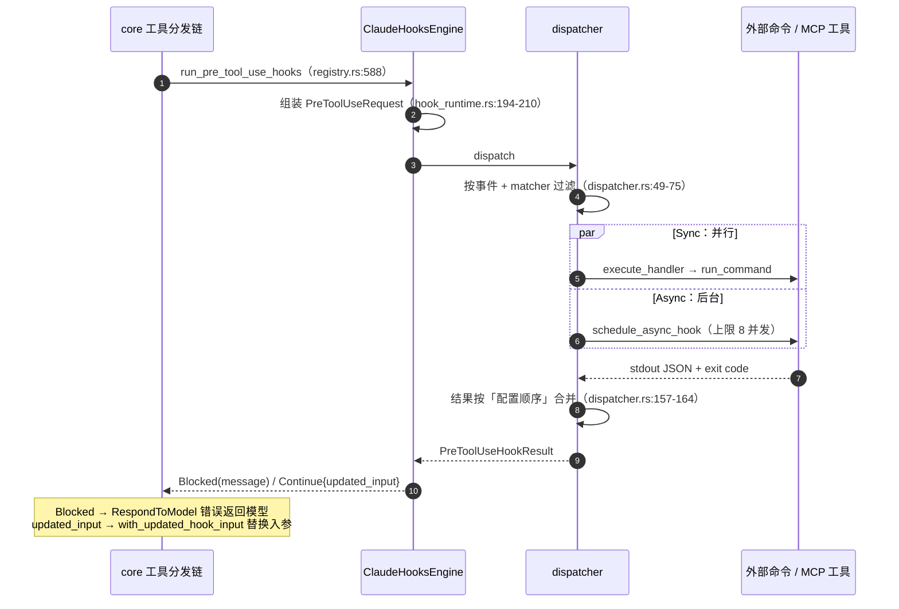
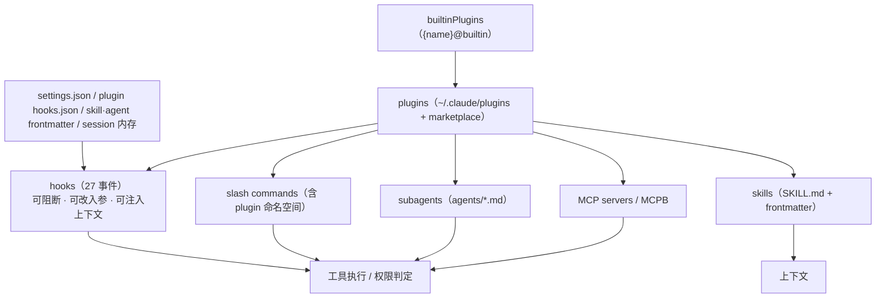

# 第 10 章：Hook 与扩展机制 —— 在哪一层留口子，留多大的口子

前九章看的都是 Agent 「自己怎么做」；本章看的是「别人能让它做什么」。四家的扩展体系挂在完全不同的层次上：pi 在内核留 11 个回调、在外壳给 36 个事件；dsh 只有一种扩展单位，但配了 5 种调度模式；codex 同时开了**进程外**与**进程内**两条互不相通的通道；Claude-Code 则并置了六层能力面。读完能看清一个判断标准——**扩展点的价值不在数量，而在「它能改写什么、以及改写之后谁负责重新校验」**。

> **本层定位**：L10，把运行时内部的事件与能力暴露给外部代码，并规定这些外部代码**能观察什么、能否阻断、能改写什么**。
>
> **前置依赖**：01（主循环，扩展点挂在循环的哪一步）、02（工具调度，工具级拦截的插入位置）、03（工具定义，扩展如何注册工具）、08（权限，hook 与审批的优先级关系）。
>
> **分析对象**：
> - **pi** —— `packages/agent/src/{types,agent,agent-loop}.ts`（内核 11 个生命周期回调）+ `packages/coding-agent/src/core/extensions/{types,loader,runner}.ts`（外壳 36 个事件 + 10 个 `register*`）
> - **deepseek-harness** —— `vendor/cordis/src/{events,registry}.ts`（插件与 5 种调度模式）+ `packages/hooks/hook-protocol/src/*` + `hooks/hooks-{claude-code,codex}/src/*`（协议兼容层）+ `extensions/cordis-host-runner/src/*`
> - **codex** —— `codex-rs/hooks/src/*`（进程外）+ `config/src/hook_config.rs` + `core/src/hook_runtime.rs` + `ext/extension-api/src/*`（进程内）+ `app-server/src/extensions.rs`
> - **Claude-Code** —— `src/utils/hooks.ts` + `src/entrypoints/sdk/core{Types,Schemas}.ts`（`HOOK_EVENTS` 27 项）+ `src/services/tools/toolHooks.ts` + `src/utils/plugins/*` + `src/skills/loadSkillsDir.ts`
>
> **易混点**：codex 的 `ext/` 目录**同时装着框架与内置扩展**，6.2 万行里只有约 2,900 行属于扩展机制本身，统计规模前需先扣除内置扩展（见 4.3）。

---

## 一、核心结论速览

1. **「扩展机制」不是一个东西，四家把口子开在了不同楼层**：pi 在**内核**留 11 个生命周期回调、在**外壳**给 36 个事件加 10 个 `register*`；dsh 只提供**一种扩展单位**（Cordis 插件），靠 5 种调度模式区分语义；codex 开了**两条互不相通的通道**——进程外的 hooks 与进程内的 `extension-api`；Claude-Code 则把 hooks / plugins / skills / commands / MCP / subagents **并置成六层**。

2. **只有 codex 同时提供进程外与进程内两种扩展，而且源码里写明了分工线**：要改写工具 payload 用 hooks，要拥有工具实现用 `ToolContributor`（`ext/extension-api/src/contributors.rs:346-351` 的注释）。**这条分工线是全章最值得抄的一句话**——它解释了为什么单靠 hook 做不了完整扩展。

3. **hook 协议正在形成事实标准，而 dsh 用代码把它证明了**：`hooks-claude-code` 与 `hooks-codex` 两个包把 CC 与 codex 的 hook 协议**各实现了一遍**——配置结构、stdin JSON、`exit 2` 语义、matcher 语义全部对齐。但兼容的是**子集**：CC 的 27 个事件里只接线 7 个、codex 的 12 个里只接线 5 个，未支持字段采取「解析后跳过 + 告警」的有界降级。

4. **「阻断」的语义三家完全统一在一个数字上：`exit code 2`**。codex、Claude-Code、dsh 都复刻这一约定，dsh 甚至明确写下「忠实复刻两个参考实现，不发明第三种阈值」。与之配套的是一条同样统一的纪律：**其他非零退出码不是阻断**，只是把 stderr 展示给用户。

5. **设计成熟度体现在「明确不做什么」上**：codex 显式拒绝 `updatedMCPToolOutput` 与 `updatedPermissions`，CC 保证 hook 的 `allow` **不越过** settings 的 deny 规则，dsh 有一份「永不支持」清单。**唯一的反例是 pi**——它的扩展改写工具输入之后**不做重新校验**（`extensions/types.ts:1026` 的注释直说了这一点），这是本章唯一一处明示的缺口。

---

## 二、本层职责与边界

### 2.1 子职责拆解

本层可拆成 7 个子职责。四家的差异，本质是对这 7 问的答案组合不同：

| # | 子职责 | 要回答的问题 |
|---|---|---|
| ① | **扩展单位** | 一个「扩展」在系统里是什么？一段脚本、一个进程、一个类、还是一棵插件树？ |
| ② | **挂载点** | 能挂在哪些事件上？事件的粒度是「轮次/步骤」还是「工具调用/消息」？ |
| ③ | **调度语义** | 多个扩展同时挂一个点时：并行、顺序、可短路、可改写，还是可否决？ |
| ④ | **能力面** | 除监听外能做什么？注册工具/命令/UI、注入上下文、影响主循环？ |
| ⑤ | **发现与装配** | 从哪发现扩展？如何加载、依赖如何解析、失败怎么办？ |
| ⑥ | **协议契约** | 与外部进程交互的输入输出格式、退出码语义、超时。 |
| ⑦ | **信任与降级** | 谁写的扩展可信？不可信时如何不执行？能力不支持时如何诚实降级？ |

### 2.2 本层不管什么

- **不管主循环怎么跑** —— 那是 L1。但本层的全部挂载点都定义在循环的骨架上，所以**没有稳定的循环阶段划分，就不可能有干净的扩展点**（pi 的 11 个内核回调就是一例）。
- **不管工具怎么调度** —— 那是 L2。但 `PreToolUse` 这类钩子正是在 L2 的准备阶段插入的，且**权限判定的优先级低于 hook**（见第 8 章 4.3.5）。
- **不管权限规则怎么写** —— 那是 L8。本层只负责「让外部代码有机会介入权限决策」（CC 的 `PermissionRequest`、codex 的 `run_permission_request_hooks`）。
- **不管具体某个扩展的功能** —— 那是扩展自己的事。本章只分析**机制**：口子开在哪、能改什么、改完谁复核。

### 2.3 层次定位

```text
┌──────────────────────────────────────────────────────┐
│ L10 Hook 与扩展机制（本章）                          │
│   把内部事件暴露给外部代码，并规定其权力边界         │
│   ⇒ 唯一一层「其设计决定别人能怎么改这个 Agent」     │
└──────────────────────────────────────────────────────┘
         ▲                                      │
         │ 挂载                                 │ 反作用
         │                                      ▼
   L1 主循环（11 个内核回调 / 27 个 hook 事件 / 5 种调度模式）
        │
        ├── L2 工具调度（PreToolUse / PostToolUse 的插入点）
        ├── L8 权限（PermissionRequest hook 优先于审批者）
        └── L3 工具定义（扩展注册工具、同名覆盖）
```

**图 10-1**：L10 的位置。它的特殊之处在于「反向性」——前九章都是 Agent 内部的机制，只有本层是**外部代码反向伸进运行时**。因此这一层真正的设计问题是权限问题：**给外部代码多大的权力，以及改完之后由谁兜底**。

```text
四家的扩展体系骨架（框越靠上，越接近"外部可写"）

  CC       六层并置：hooks(27 事件) · plugins · skills · commands · MCP · subagents
           └─ hooks 是最强的一层：可阻断、可改写入参、可注入上下文

  codex    双通道：plugins ─┬─ hooks（进程外，12 事件，可阻断/改写）
                           └─ extension-api（进程内，12 类 contributor trait）

  dsh      一种单位：Cordis 插件
           └─ 语义全靠调度模式区分：emit / parallel / serial / bail / waterfall

  pi       两层分工：内核 11 个回调 → 外壳 36 个事件 + 10 个 register*
           └─ 内核不知道"扩展"这个概念，只暴露回调
```

**图 10-2**：四种骨架。注意 dsh 的形态最「统一」——它没有为不同扩展能力设计不同机制，而是**把差异全部收敛到调度模式里**；codex 则相反，用两条物理隔离的通道处理两类需求。

---

## 三、概念对齐表

**同一个概念，四家分别叫什么、有没有这个能力**。空白格本身就是结论。

| 概念 | pi | deepseek-harness | codex | Claude-Code |
|---|---|---|---|---|
| **扩展单位** | 进程内模块（jiti 加载） | Cordis 插件（`apply(ctx, config)`） | ① 外部命令/MCP ② Rust trait contributor | 六层：hook / plugin / skill / command / MCP / subagent |
| **内核是否知道「扩展」** | **否**（只有回调） | 是（插件即唯一单位） | 是（注册表） | 是 |
| **挂载点数量** | 内核 11 回调 + 外壳 36 事件 | 7 个拦截点 + 5 种调度 | hooks 12 事件 + 12 类 contributor | hooks 27 事件 |
| **调度模式** | 逐个 try/catch 顺序 | **emit / parallel / serial / bail / waterfall** | Sync 并行 `FuturesUnordered` + Async 后台 | 并行执行 + 按来源优先级合并 |
| **能否阻断** | 只有 `tool_call`（`block`） | 视模式：waterfall 可否决、serial 不可 | PreToolUse 可阻断 | 多事件可阻断（`exit 2`） |
| **能否改写输入** | `tool_call` 原地改（**不重校验**） | waterfall 可改写 | 仅 `permissionDecision:allow` 时可改 | `updatedInput`（deny 时丢弃） |
| **能否改写输出** | `tool_result` 可替换 | post-execute 可 `block`/挂 context | **不能**（显式拒绝 `updatedMCPToolOutput`） | 走 `PostToolUse` 反馈 |
| **上下文注入** | `context` / `context_with_system` | 事件可挂 `additionalContexts` | `additionalContext` → developer message | `additionalContext` → 附件 |
| **注册新工具** | `registerTool`（**同名即覆盖内建**） | 插件即定义工具 | `ToolContributor`（进程内） | plugin / MCP server |
| **注册 UI/命令** | `registerCommand` / `registerShortcut` / 完整 `ctx.ui` | `ui-cordis`（页面半边） | 无（TUI 不开放） | slash command / output-style |
| **外部进程协议** | 无（进程内） | **兼容 CC 与 codex 两套** | stdin/stdout JSON + MCP | stdin/stdout JSON |
| **阻断信号** | 返回 `{block:true}` | 决策枚举 `deny` | JSON `decision:block` | **exit code 2** |
| **配置位置** | `.pi/extensions/` + `~/.pi/agent/extensions/` | profile 的 `cordis.patch.yml` | `config.toml` / `hooks.json` / plugin bundle | `settings.json` + plugin `hooks/hooks.json` |
| **信任机制** | 项目信任（只管加载资源） | 明确声明「不是安全边界」 | **hook trust hash + Manage/Untrusted 状态** | 交互式信任校验（防 RCE） |
| **失败是否影响主流程** | 普通事件不影响；`tool_call` 抛错**阻断** | **永不抛进循环**（包容式） | 非零退出不阻断 | 非 `exit 2` 不阻断 |

> **读法提示**：第 2 行是最重要的一行。pi 的内核完全不知道「扩展」这个概念，只提供回调——这个设计让内核保持了最小依赖，代价是**扩展能力的强弱完全取决于外壳怎么接**。

---

## 四、逐项目实现

### 4.1 pi：内核留回调，外壳给事件

> pi 是四家中**唯一把「扩展点」与「扩展机制」分成两层**做的：内核（`packages/agent`）只暴露一组通用回调，外壳（`packages/coding-agent`）才把它们接到事件总线上。

#### 4.1.1 内核的 11 个回调

内核的扩展面就是 `AgentLoopConfig` 上的 11 个回调（`packages/agent/src/types.ts:189`），每个都在循环的固定位置被调用：

| 回调 | 定义行 | 调用点（`agent-loop.ts`） |
|---|---|---|
| `convertToLlm` | `types.ts:218` | `:394` |
| `transformContext` | `types.ts:240` | `:389-390` |
| `getApiKey` | `types.ts:250` | `:400` |
| `finishTurn` | `types.ts:260` | `:251`、`:285` |
| `prepareRequest` | `types.ts:267` | `:218` |
| `prepareNextTurn` | `types.ts:274` | `:185` |
| `getSteeringMessages` | `types.ts:289` | `:175`、`:204`、`:294` |
| `getFollowUpMessages` | `types.ts:302` | `:301` |
| `toolExecution` | `types.ts:313` | `:516` |
| `beforeToolCall` | `types.ts:322` | `:722` |
| `afterToolCall` | `types.ts:337` | `:827` |

```ts
// packages/agent/src/types.ts:322
beforeToolCall?: (context: BeforeToolCallContext, signal?: AbortSignal) => Promise<BeforeToolCallResult | undefined>;
```

**为什么这样分层**：内核不引入任何「扩展」抽象（没有 registry、没有插件概念），只留回调，因此 `packages/agent` 可以被任何宿主复用。**代价**是：内核能给的粒度就是这 11 个位置，想要更细的扩展点必须由外壳自己造。

#### 4.1.2 外壳的 36 个事件与 10 个 register

外壳把内核回调接到自己的事件总线上（`transformContext` → `emitContext`，`sdk.ts:390-393`；`beforeToolCall`/`afterToolCall` → `emitToolCall`/`emitToolResult`，`agent-session.ts:530-584`），对外暴露 `ExtensionAPI`（`extensions/types.ts:1349-1624`）。它的 `on()` 有 **36 个重载**（`types.ts:1354-1419`），可按粒度分五组：

| 粒度 | 事件 | 能力 |
|---|---|---|
| **会话级** | `session_start` / `session_before_switch` / `_fork` / `_compact` / `_tree` / `session_shutdown` … | `session_before_*` 可 `cancel`；`_compact` 可改写压缩结果与摘要指令 |
| **轮次级** | `before_agent_start` / `agent_start` / `turn_start` / `turn_end` / `agent_before_settle` | `before_agent_start` 可注入消息、**整体替换 system prompt**；边界可 `continue` |
| **请求级** | `context` / `context_with_system` / `before_provider_request` / `before_provider_headers` / `after_provider_response` | 可改 messages、可换 payload、可原地改 headers |
| **消息级** | `message_start` / `_update` / `_end` | `message_end` 可替换（**必须同 role**） |
| **工具级** | `tool_execution_start` / `_update` / `_end` / `tool_call` / `tool_result` | `tool_call` 可 `block`、可原地改 `input`；`tool_result` 可替换结果 |

外加 10 个注册与动作方法：`registerTool` / `registerCommand` / `registerShortcut` / `registerFlag` / `registerMessageRenderer` / `registerMarkdownTransformer` / `registerEntryRenderer` / `registerProvider` / `sendMessage` / `appendEntry` 等（`types.ts:1426-1620`），以及一个完整的 `ctx.ui`（`types.ts:137-288`，含 `select` / `confirm` / `custom` / `setWidget` / `setFooter` / `addAutocompleteProvider` 等）。

**扩展生态最直接的证据是示例数量**：`examples/extensions/` 下有 **50 余个示例**，涵盖危险命令确认、同名覆盖只读工具、动态注册工具、自定义 provider、自绘 UI 覆层、微 VM 路由、会话摘要等（完整清单一句话描述见 `examples/extensions/README.md:17-137`）。**能写出来的示例覆盖面，本身就是扩展能力的度量**。

#### 4.1.3 发现、加载与「同名覆盖」

目录约定两条（`loader.ts:770`）：项目级 `<cwd>/.pi/extensions/` 与全局级 `~/.pi/agent/extensions/`，加载顺序决定优先级（`resource-loader.ts:627-634`）。发现规则：目录下一层的 `*.ts` / `*.js` 直接加载；子目录含 `package.json` 的 `pi.extensions` 字段则按声明加载，否则回退 `index.ts`。

进程内加载用 jiti，并注入别名把 `@earendil-works/pi-coding-agent` 指回宿主（`loader.ts:97-118`），因此扩展可以直接 import 宿主类型。**依赖自带**：扩展可自带 `node_modules`，示例 `with-deps/package.json` 就声明了 `ms`。单个扩展加载失败只记录并继续（`loader.ts:622-625`）。

**最有份量的一个机制是「同名覆盖」**：

```ts
// packages/coding-agent/src/core/agent-session.ts:3206
const toolRegistry = new Map(wrappedBuiltInTools.map((tool) => [tool.name, tool]));
for (const tool of wrappedExtensionTools as AgentTool[]) {
	toolRegistry.set(tool.name, tool);
}
```

先建内置表，再让扩展工具 `set` 覆盖。示例 `tool-override.ts:69` 用同名 `read` 替换了内建实现，并在其中做敏感路径拦截。**这是 pi 在没有权限层的前提下，把安全能力下放给扩展的具体路径**（见第 8 章 4.1.3）。

#### 4.1.4 异常与降级：一处有意的例外

pi 的错误处理有一条清晰但**不完全一致**的规则：

- **普通事件处理器抛错不影响主流程**：`emit` 逐个 try/catch，记录后继续下一个（`runner.ts:1003`）——事件是旁路通知。
- **`tool_call` 处理器抛错会阻断该工具**：`emitToolCall` **故意没有 try/catch**（`runner.ts:1134-1152`），错误冒泡并被包成阻断错误：

```ts
// packages/coding-agent/src/core/agent-session.ts:547
throw new Error(`Extension failed, blocking execution: ${String(err)}`);
```

随后内核在 `prepareToolCall` 捕获，转成错误的工具结果（`agent-loop.ts:764-770`）。设计意图是「安全的默认是拒绝」——权限钩子崩了不能当作通过。

其他值得一提的边界：`message_end` 替换若改变了 role 则报错并忽略（`runner.ts:1055-1062`）；边界 `entries` 非法时**整体丢弃**并清空 `continue`（`runner.ts:962-976`），保证坏状态不写进会话树；热重载后旧 `ctx` 再被调用会抛错（`loader.ts:185-192`）。

> **唯一的明示缺口**：`tool_call` 允许原地修改 `event.input`，但**改完不重新校验**：
> ```ts
> // packages/coding-agent/src/core/extensions/types.ts:1026-1027
> * `event.input` is mutable. Mutate it in place to patch tool arguments before execution.
> * Later `tool_call` handlers see earlier mutations. No re-validation is performed after mutation.
> ```
> 也就是说：**检查与执行之间没有第二次 schema 校验**。若权限逻辑依赖参数内容，而参数可被后续处理器改写，这个窗口必然被利用（已在第 8 章 7.4 列为反例）。

#### 4.1.5 skills 与子 Agent 不是扩展机制

需要区分清楚：`skills`（`SKILL.md` + frontmatter，`skills.ts:409-509`）与 prompt templates（`prompt-templates.ts:222-298`）走**资源加载器**管线，与扩展是两套。子 Agent 更明确——pi 的 README 直接写 「No sub-agents」（`README.md:539`），`~/.pi/agent/agents/*.md` 这套约定由**示例扩展**自己实现（`examples/extensions/subagent/agents.ts:88-129`），通过 spawn 独立 `pi` 进程执行（见第 7 章 4.1）。

### 4.2 deepseek-harness：一种扩展单位，五种调度语义

> dsh 的形态在四家中最「统一」——它不为不同扩展能力设计不同机制，而是**把全部差异收敛到调度模式里**：`emit` / `parallel` / `serial` / `bail` / `waterfall`。理解这 5 个词，就理解了 dsh 的整个扩展层。

#### 4.2.1 Cordis：唯一扩展单位

dsh 直接 vendor 了 Cordis（`vendor/cordis/src/events.ts`，352 行），并在 README 里界定它的用途：

```md
# vendor/cordis/README.md:3
Cordis is a TypeScript plugin framework for applications that need explicit
dependency injection, scoped services, lifecycle-managed cleanup, and optional
configuration-driven loading.
```

插件是函数或含 `apply(ctx, config)` 的对象，元数据包括 `name` / `Config` / `inject` / `provide` / `intercept`（`vendor/cordis/src/registry.ts:92`）。`inject` 决定插件何时可启动，effect / listener / service 随所属 fiber 销毁一起移除——**「插件卸载即无残留」是框架级保证**，而不是各插件自觉遵守。

#### 4.2.2 五种调度模式就是全部语义

```ts
// vendor/cordis/src/events.ts:24
/**
 * `emit` runs synchronous listeners without awaiting them, `parallel` awaits
 * all listeners together, `serial` awaits them in order until one bails,
 * `bail` stops on the first synchronous bail value, and `waterfall` composes
 * listeners around a final `next` callback.
 */
export type DispatchMode = 'emit' | 'parallel' | 'serial' | 'bail' | 'waterfall'
```

| 模式 | 语义 | 扩展能做什么 |
|---|---|---|
| `emit` | 同步广播，忽略返回值 | 只能观察 |
| `parallel` | 全部并发 await，错误聚成 `AggregateError` | 只能观察（但可并发） |
| `serial` | 顺序 await，遇到第一个 bail 值即停 | 能「短路」，**不能改写** |
| `bail` | serial 的同步版 | 同 `serial`：能「短路」，**不能改写** |
| `waterfall` | 每个 listener 包住后续链，**不调 `next()` 即否决** | 能改写、能否决 |

`waterfall` 的实现只有十几行，但它是整个扩展层最有表达力的部分：

```ts
// vendor/cordis/src/events.ts:234
  waterfall(...args: any[]) {
    const cbs = this.dispatch('waterfall', args)
    const inner = args.pop()
    const next = () => {
      const cb = cbs.shift() ?? inner
      return cb(...args)
    }
    args.push(next)
    return next()
  }
```

**注意 `next()` 的语义**：listener 拿到的是「继续链」而不是「下一个 listener」，因此它可以**先调 `next()` 拿到下游结果、再在结果上叠加自己的贡献**。dsh 的 CC hook 桥就是这么做的：

```ts
// packages/hooks/hooks-claude-code/src/index.ts:232
// Delegate so later listeners may still rewrite or reject, then prepend our
// context only to a downstream enter decision.
const downstream = await next()
const ours = contextFrom(merged)
if (!ours || downstream.kind !== 'enter') return downstream
return { ...downstream, messages: [...downstream.messages, ours] }
```

#### 4.2.3 自身只有 7 个拦截点

dsh 自己声明的事件（`packages/core/agent/src/runtime-types.ts` 与 `packages/core/tools/src/index.ts`）只有 7 个——**是四家中最少的**：

| 拦截点 | 模式 | 触发时机 | 能否阻断 / 改写 |
|---|---|---|---|
| `agent/created` | serial | agent 进注册表后、创建 resolve 前 | 不可阻断；可注入 context |
| `agent/pre-step` | waterfall | 每 step 提议前 | **可 reject 整步**，可改写 `messages` |
| `tools/pre-execute` | waterfall | 工具执行前 | 可 `deny` / `ask` / `allow` |
| `tools/post-execute` | waterfall | 结果归一化后 | 可 `block`（反馈）/ `accept`，可挂 context |
| `agent/turn-stopping` | serial | turn 将闭合时 | **不可改写**，只能靠 `steer()` 副作用 |
| `subagent/start` | emit | 子 agent 发布 | 只能注入 context |
| `subagent/end` | emit | 子 agent 结束 | 只能观察 |

`agent/turn-stopping` 的注释把 `serial` 的设计意图写得很清楚——**「数据决定结果，因此监听器顺序不能改变结论」**：

```ts
// packages/core/agent/src/runtime-types.ts:364
/**
 * The turn is about to close: the model owes no response (no live tool
 * calls, no fresh steering). Awaited before the boundary commits — a
 * listener that objects steers (`agent.steer(...)`) and the machine
 * re-reads its inbox. ... Data decides, so listener order cannot change the outcome.
 * @mode serial
 */
```

也就是说：想让 turn 别结束，**不能否决，只能「加活」**——`steer()` 注入一条消息让循环重新启动。这是「用副作用表达意图」的一种极端形式，好处是不会有扩展「卡住」turn。

#### 4.2.4 协议兼容层：把 CC 与 codex 各实现一遍

这是全报告最有价值的一处交叉印证。两个桥包各自把对手的事件映射到 dsh 自己的 7 个拦截点上：

| dsh 拦截点（模式） | CC 事件 | codex 事件 | CC 挂载 | codex 挂载 |
|---|---|---|---|---|
| `agent/created`（serial） | SessionStart | SessionStart | `hooks-claude-code/src/index.ts:209` | `hooks-codex/src/index.ts:191` |
| `agent/pre-step`（waterfall） | UserPromptSubmit | UserPromptSubmit | `:225` | `:205` |
| `tools/pre-execute`（waterfall） | PreToolUse | PreToolUse | `:244` | `:231` |
| `tools/post-execute`（waterfall） | PostToolUse | PostToolUse | `:253` | `:240` |
| `agent/turn-stopping`（serial） | Stop | Stop | `:276` | `:266` |
| `subagent/start`（emit） | SubagentStart | — | `:287` | — |
| `subagent/end`（emit） | SubagentStop | — | `:297` | — |

**配置侧只认一个子集**，且是硬编码白名单：

```ts
// packages/hooks/hooks-claude-code/src/config.ts:11
const CLAUDE_EVENTS = [
  'SessionStart', 'UserPromptSubmit', 'PreToolUse', 'PostToolUse',
  'Stop', 'SubagentStart', 'SubagentStop',
] as const
```

```ts
// packages/hooks/hooks-codex/src/config.ts:11
export const CODEX_EVENTS = ['PreToolUse', 'PostToolUse', 'SessionStart', 'UserPromptSubmit', 'Stop'] as const
```

**子集规模值得对照**：CC 的 hook 事件全集是 27 个、codex 是 12 个，而兼容层只实现 7 个与 5 个。这个差距不是偷懒——它恰好说明了**事件全集的膨胀远快于扩展点的稳定核心**：真正跨实现稳定的只有「会话开始 / 提示提交 / 工具前后 / 停止」这 5 个。

两方言的差异也用参数收敛，而不是分叉代码。唯一分叉轴是 matcher 语义：

```ts
// packages/hooks/hook-protocol/src/matcher.ts:57
export function matchesMatcher(matcher: string | undefined, query: string, mode: MatcherMode): boolean {
  if (isMatchAll(matcher)) return true
  const pattern = matcher as string
  if (mode === 'claude-code' && CLAUDE_LITERAL.test(pattern)) {
    return pattern.split('|').includes(query)
  }
  return compileRegex(pattern)?.test(query) ?? false
}
```

CC 侧还额外支持变量替换（`${CLAUDE_PLUGIN_ROOT}` / `${CLAUDE_PROJECT_DIR}`，`config.ts:57`）、stdin 加尾换行、注入 `CLAUDE_PROJECT_DIR` 环境变量；codex 侧不加尾换行、无变量替换、改为在 payload 里带 `model` / `permission_mode`（`hooks-codex/src/index.ts:297`）。

**dsh 自己新增、两方言都没有的三件事**：

1. **决策通道折叠**：把两套不同的决策表达折叠成单一枚举，再按 most-restrictive 合并：

```ts
// packages/hooks/hook-protocol/src/merge.ts:35
function rank(decision: HookOutput['decision']): number {
  switch (decision) {
    case 'deny': case 'block': return 3
    case 'ask': return 2
    case 'approve': case 'allow': return 1
    default: return 0
  }
}
```

2. **事件名守卫**：`hookSpecificOutput.hookEventName` 与当前触发点不符时，丢弃该 block 的事件级字段（`codec.ts:122`）——防止扩展把 A 事件的输出错用在 B 事件上。

3. **hook 调用的持久化审计**：`hook/invoked` + `hook/result` 按 `handlerId` 配对写入会话日志（`events.ts:75`、`:92`），且被不变式约束为「必须在 open turn 内」（`invariant.ts:37`）。

#### 4.2.5 扩展加载：静态装配 + 运行时动态定义

**静态面**：profile 位于 `$DSH_HOME/profiles/<name>`，bundle 通过 `dsh.bundle.patch` 指向 patch 文件；patch 支持 `insert` 新增行与按 id 整体替换 config（`packages/bundle/base/cordis.patch.yml:1` 的注释写明「后写覆盖」）。

**运行时段**：`DynamicCordisRunnerService` 提供 `define` / `run` / `stop` / `undefine`（`cordis-host-runner/src/index.ts:129/156/253/461/215`），在 `node:vm` 里求值扩展源码，并检查返回值类型：

```ts
// packages/extensions/cordis-host-runner/src/index.ts:902-907
const evaluated = await evaluateHostCode(sandbox, hostCode, plugin.pluginId, this.resolved.vmTimeoutMs)
if (!isPlugin(evaluated)) {
  throw new Error(evaluated === undefined
    ? 'the Host half returned `undefined` — did you forget `return`?'
    : 'the Host half must return a Plugin function or an object with apply(ctx)')
}
```

沙箱的 `ctx` 是**白名单 façade**（`guard.ts:631` 列出允许的动词：`effect` / `on` / `once` / `provide` / timer 系列），Node 原生 `require` / `setTimeout` / `fetch` 被 trap 重定向到 `ctx.fs` / `ctx.web` / `ctx.bash`。但——**作者明确写了它不是安全边界**：

```text
packages/extensions/cordis-host-runner/src/sandbox.ts:2-7
（注释声明该沙箱是"教学/一致性"用途，不是安全隔离）
```
配套的 README 要求把它「当 bash 访问看待」（`cordis-host-runner/README.md:54`）。

> **这个诚实值得单独记一笔**：四家中有两家（codex 用 hook trust hash、CC 用交互式信任校验）把「信任」做成机制，dsh 选择**明确声明不是边界**并要求使用者按 bash 对待。三种态度都合理，但**「声称是沙箱其实不是」是唯一不可接受的**。

#### 4.2.6 异常与降级：一份「有界降级」清单

dsh 在错误处理上是四家中最系统的，核心原则写在文件里：**「Never throw into the loop」**——钩子不能拖垮调用它的那一轮：

```ts
// packages/hooks/hook-protocol/src/runner.ts:86-101
try {
  const result = await (await bash.execute(bash.resolve(request))).result()
  // ShellRunResult.exitCode is `number | null` (null = died by signal); the
  // protocol's exit-code contract is numeric, so a signal death maps to
  // `undefined` (a non-blocking error — no clean exit code to act on).
  const exitCode = result.exitCode ?? undefined
  return {
    output: parseHookOutput(exitCode, result.stdout.text, result.stderr.text, options.expectedEventName),
    durationMs: now() - started,
  }
} catch (error: unknown) {
  // The executor rejects only on infrastructure faults (unusable workdir,
  // missing shell). A hook that cannot run is a non-blocking error: no exit
  // code, the failure on stderr for the record. The turn proceeds.
  const message = error instanceof Error ? error.message : String(error)
  return {
    output: parseHookOutput(undefined, '', message),
    durationMs: now() - started,
  }
}
```

其余几条同样值得记：

- **超时**：默认 600,000ms（`runner.ts:20`），与 CC/codex 默认一致；超时与进程组取消交给 `dsh-shell` executor，**协议层不重复实现进程控制**。
- **配置读不了就不注册**：解析失败只 warn 并 return，agent 照常启动（`hooks-claude-code/src/index.ts:119`）——「它是兼容适配器而非动力工具」。
- **非法输出按纯文本处理**，不当错误：顶层 `decision` 只接受 `approve` / `block`，`allow` / `deny` / `ask` 只在 `hookSpecificOutput.permissionDecision` 里（`codec.ts:32` 的注释明确解释了这个 schema 约束）。
- **合并与顺序无关**：串行执行只为让 `hook/invoked` 与 `hook/result` 在日志里相邻，**结论必须与顺序无关**（`merge.ts:91`、`hooks-claude-code/README.md:95/107`）。
- **detached 运行与 dispose 静止**：SessionStart / SubagentStart / SubagentStop 无人 await，用 `createDetachedRuns` 追踪整条链，dispose 时先 abort 再 drain，保证 `fiber.dispose()` 返回即无残留回调（`detached.ts:53`）。
- **有界降级而非伪造能力**：CC 侧 `updatedInput` 只解析不生效（只 warn，`hooks-claude-code/src/index.ts:181`）；codex 侧 PreToolUse 只支持 `deny`。设计原则写在类型定义里：

```ts
// packages/hooks/hook-protocol/src/types.ts:81
 * is OPTIONAL because a hook may exercise any subset; the bridge decides which
 * fields are meaningful for its hook point and which it ignores (faithful-but-
 * degraded — e.g. Codex ignores `allow`/`ask`).
```

### 4.3 codex：两条互不相通的通道

> **先做一处必须的事实辨析**：`codex-rs/` 下有三个容易误判的目录。实测结论是——`hooks/`（15,671 行）是**机制**；`ext/extension-api/`（2,932 行）是**机制**；`core-plugins/`（47,669 行）是**机制**（加载器/市场/存储）；而 `ext/` 下**其余 15 个 crate 是「用机制实现的内置扩展内容」**（`ext/skills` 非测试 11,582 行、`ext/guardian-v2` 4,057 行、`ext/goal` 3,325 行…）。**判定依据**：机制没有 `install()`；内置扩展有，且被统一注册。

#### 4.3.1 五层与两条通道

| 层 | 形态 | 定位 |
|---|---|---|
| **hooks** | 进程外，事件驱动 | 用户/插件在生命周期事件上挂外部命令或 MCP 工具，可阻断、改输入、注入上下文 |
| **extension-api + ext/\\*** | 进程内，编译期 | Rust trait 级贡献点（12 类 contributor），注册进 `ExtensionRegistry` |
| **plugins** | 包分发 | marketplace 安装的插件包，内部可带 hooks（`hooks/hooks.json`）、skills、MCP servers |
| **skills** | 内容 | 技能目录 + 模型可见清单 |
| **connectors** | 集成 | 外部连接器 / Apps |

**两条通道的分工线写在源码注释里**，这是本章最值得抄的一句设计说明：

```rust
// ext/extension-api/src/contributors.rs:341-365
/// Contributor for host-owned tool lifecycle gates.
///
/// Implementations can observe tool execution and process MCP responses without
/// rewriting the invocation. Use `ToolContributor` for owning a tool implementation
/// and hooks for policy that changes tool payloads.
pub trait ToolLifecycleContributor: Send + Sync {
    /// Called after pre-tool hooks finalize an invocation and before execution.
    fn on_tool_start<'a>(&'a self, _input: ToolStartInput<'a>) -> ToolLifecycleFuture<'a> {
        Box::pin(std::future::ready(()))
    }

    /// Called for a resolved builtin command before attribution and execution.
    fn on_command_start<'a>(&'a self, _input: CommandStartInput<'a>) -> ToolLifecycleFuture<'a> {
        Box::pin(std::future::ready(()))
    }

    // 其余生命周期回调同构，默认实现均为空操作

    ...
}
```

即：**要「改 payload」用 hooks，要「拥有工具实现」用 contributor**。这条线解释了为什么 codex 需要两条通道——hook 是外部进程，无法安全地持有一个工具的实现与状态；而进程内 contributor 改动工具输入又会让 hook 的契约失效。

#### 4.3.2 hooks 的 12 个事件与配置形态

```rust
// protocol/src/protocol.rs:1577-1592
pub enum HookEventName {
    PreToolUse, PermissionRequest, PostToolUse, PreCompact, PostCompact,
    SessionStart, SessionEnd, UserPromptSubmit, SubagentStart, SubagentStop,
    Stop, Interrupt,
}
```

配套枚举刻画了完整的协议面：`HookHandlerType{Command,McpTool,Prompt,Agent}`（`:1594`）、`HookExecutionMode{Sync,Async}`（`:1603`）、`HookScope{Thread,Turn}`（`:1610`）、`HookSource`（10 类来源，`:1617`）、`HookTrustStatus{Managed,Untrusted,Trusted,Modified}`（`:1634`）、`HookRunStatus{Running,Completed,Failed,Blocked,Stopped}`（`:1643`）、`HookOutputEntryKind{Warning,Stop,Feedback,Context,Error}`（`:1653`）。

声明有 4 处来源：`config.toml` 的 `hooks` 表、配置层目录的 `hooks.json`、插件包的 `hooks/hooks.json`、托管 MDM/requirements。schema 类型在 config crate：

```rust
// config/src/hook_config.rs:161-201
#[serde(tag = "type")]
pub enum HookHandlerConfig {
    #[serde(rename = "command")] Command { command, command_windows, timeout_sec, r#async, status_message, additional_context_limit },
    #[serde(rename = "mcp_tool")] McpTool { server, tool, input, timeout_sec, status_message },
    #[serde(rename = "prompt")] Prompt {},
    #[serde(rename = "agent")] Agent {},
}
```

**注意后两种是「可解析但未实现」**——引擎会明确跳过并记录原因：

```rust
// hooks/src/engine/discovery.rs:635-643
HookHandlerConfig::Prompt {} => {
    source.record_load_failure(format!("skipping prompt hook in {}: prompt hooks are not supported yet", ...), warnings);
    continue;
}
```

事件级的 stdin/stdout 结构在 `hooks/src/schema.rs`（1,254 行）逐事件定义，并由 `write_schema_fixtures`（`:640`）生成 23 个 JSON schema 文件、编译期内嵌（`engine/schema_loader.rs:37` 用 `include_str!`）。**这是四家中对 hook 协议最「形式化」的一家**：协议不是文档，而是可生成、可校验的 schema。

#### 4.3.3 一次 hook 的完整链路



**图 10-3**：codex 的 PreToolUse 链路。两个细节值得注意：**Sync handler 是并行的**（进 `FuturesUnordered`），但结果**按配置顺序合并**；而 `PreToolUse` 的输入改写却**按完成顺序取最后一个完成者**——报告顺序与裁决顺序故意不同：

```rust
// hooks/src/events/pre_tool_use.rs:149-153
/// Chooses the rewrite from the hook that actually finished last.
/// Hook results stay in configured order for stable reporting, but the `PreToolUse` contract resolves competing rewrites by completion order.
```

#### 4.3.4 能力边界：能做什么、明确不能做什么

| 能力 | 结论 | 源码依据 |
|---|---|---|
| 阻断工具调用 | ✅ PreToolUse → `Blocked` → `RespondToModel` 错误 | `core/src/tools/registry.rs:598-611` |
| 阻断工具结果 | ✅ PostToolUse 阻断的是**结果**而非已完成的执行 | `registry.rs:728-748` |
| 改写工具输入 | ✅ 但**仅当** `permissionDecision:allow` | `engine/output_parser.rs:162-170` |
| 改写工具输出 | ❌ **显式拒绝** `updatedMCPToolOutput` | `output_parser.rs:434-435` |
| 替换模型可见文本 | ✅ 用 `feedback_message` 包装而不是替换 | `registry.rs:749-757` |
| 影响审批 | ✅ **优先级最高**（Hooks > Guardian > User） | `tools/approvals.rs:500-519` |
| 注入上下文 | ✅ `additionalContext` → developer message | `hook_runtime.rs:846-855` |
| 让 turn 继续 | ✅ Stop hook 的 `continuation_fragments` | `session/turn.rs:659-676` |
| 改权限/控制流 | ❌ `updatedPermissions` / `interrupt` 被拒 | `output_parser.rs:405-410` |

**审批合并规则是「任一 deny 胜出」**（`events/permission_request.rs:156-166`），而不是「第一个决定生效」——这与 dsh 的 most-restrictive 合并思路一致。

#### 4.3.5 异常与降级：超时与信任是重点

- **超时按事件分级**：默认 600s，但 SessionEnd 与 Interrupt 默认 1s、上限 3s 并告警——理由是这两个事件处在**会话收尾路径**，长等待会拖死退出。同时**超时与 stdin 写入共用同一个 deadline**，防止 hook 不读 stdin 造成管道互锁：

```rust
// hooks/src/engine/command_runner.rs:290-302
let timeout_duration = Duration::from_secs(handler.timeout_sec);
// Drain output while sending input so neither pipe can block the other, and
// include stdin writes in the deadline even when the hook never reads them.
match timeout(timeout_duration, try_join(write_stdin, wait_with_output)).await {
    Ok(Ok(((), output))) => finish_command_run(
        started_at,
        started,
        CommandRunCompletion {
            exit_code: output.status.code(),
            stdout: String::from_utf8_lossy(&output.stdout).to_string(),
            stderr: String::from_utf8_lossy(&output.stderr).to_string(),
            error: None,
            outcome: "completed",
        },
    ),

    // 其余两个分支（基础设施失败、超时）都归为非阻断错误，exit_code 记为 None

    ...
}
```

- **非零退出不阻断**：只有显式 `decision:block` 且带非空 reason 才阻断；无 reason 视为无效并降级为 Failed（`output_parser.rs:216-226`）。
- **输出过大落盘**：默认 2,500 token 以上落盘，只用头尾预览 + 恢复路径进模型（`output_spill.rs:11-12`），`limit=0` 可关闭。
- **信任门槛**：只有 Managed、或 hash 校验为 Trusted、或显式 bypass 的 handler 才会**真正执行**，其余的只出现在列表里：

```rust
// hooks/src/engine/discovery.rs:713-719
if enabled && (source.bypass_hook_trust || matches!(trust_status, HookTrustStatus::Managed | HookTrustStatus::Trusted)) {
    handlers.push(ConfiguredHandler { ... });
}
```
设计意图是**把「配置可见」与「配置可信可执行」解耦**——hook 是任意命令执行，看见不等于该跑。

- **无 hooks 配置时零开销**：feature 关闭且无插件 hook 时引擎直接空构造，不做发现（`engine/mod.rs:238-246`）。
- **legacy `notify` 与新引擎隔离**：旧 `notify` 被包装成一个独立 `Hook` 挂在 `AfterAgent` 上，**不进** `ClaudeHooksEngine`（`registry.rs:124-129`），且源码里有待删除标记（`legacy_notify.rs:44-45` 的 TODO）。

### 4.4 Claude-Code：六层并置，hooks 是最强的一层

> CC 的扩展体系是四家中「面最宽」的：hooks / plugins / skills / slash commands / MCP / subagents 六层并列。其中 **hooks 是唯一能阻断与改写的一层**，其余五层都是「提供内容」。

#### 4.4.1 27 个 hook 事件

```ts
// src/entrypoints/sdk/coreTypes.ts:25
export const HOOK_EVENTS = [
  'PreToolUse', 'PostToolUse', 'PostToolUseFailure', 'Notification',
  'UserPromptSubmit', 'SessionStart', 'SessionEnd', 'Stop', 'StopFailure',
  'SubagentStart', 'SubagentStop', 'PreCompact', 'PostCompact',
  'PermissionRequest', 'PermissionDenied', 'Setup', 'TeammateIdle',
  'TaskCreated', 'TaskCompleted', 'Elicitation', 'ElicitationResult',
  'ConfigChange', 'WorktreeCreate', 'WorktreeRemove', 'InstructionsLoaded',
  'CwdChanged', 'FileChanged',
] as const
```

同一列表在 `src/entrypoints/sdk/coreSchemas.ts:355` 以 Zod enum 复述（`:385`）。每个事件的语义描述、matcher 字段与退出码语义集中在 `src/utils/hooks/hooksConfigManager.ts:26-267`（例如 PreToolUse 的 matcher 字段是 `tool_name`，Notification 是 `notification_type`）。

**27 个事件这个数字本身就是结论**：它比 codex 的 12 个多一倍有余，且包含大量产品化细节事件（`WorktreeCreate` / `FileChanged` / `Elicitation` / `TeammateIdle`）。**事件全集膨胀是产品成熟的自然结果**——这一点与 dsh 兼容层只取 5 个核心事件形成鲜明对照（见 4.2.4）。

#### 4.4.2 声明、类型与执行

声明结构是 `事件 → matcher[]` 的 partialRecord：

```ts
// src/schemas/hooks.ts:211
export const HooksSchema = lazySchema(() =>
  z.partialRecord(z.enum(HOOK_EVENTS), z.array(HookMatcherSchema())),
)
```

**可持久化的 hook 类型有 4 种**（`HookCommandSchema = z.discriminatedUnion('type', [BashCommandHook, PromptHook, AgentHook, HttpHook])`，`src/schemas/hooks.ts:176-189`），另有 2 种仅内存（`callback` / `function`）。通用字段含 `if`（**权限规则预过滤**）、`timeout`、`statusMessage`、`once`、`async`、`asyncRewake`、`shell`（`hooks.ts:32-65`）。

执行特征三条：**全部匹配的 hook 并行执行**（`src/utils/hooks.ts:3084`）；超时按类型独立默认为 command 10min / prompt 30s / agent 60s / http 10min / async 后台 15s；超时通过 `createCombinedAbortSignal` 与父级 abort 合流（`:3089`）。

输入契约是写 stdin：`child.stdin.write(jsonInput + '\n', 'utf8')`（`:1210`），基础字段由 `createBaseHookInput` 构造（`session_id` / `transcript_path` / `cwd` / `permission_mode` / `agent_id` / `agent_type`，`:301-328`）。输出契约是一个大联合：

```ts
// src/types/hooks.ts:50-60
export const syncHookResponseSchema = lazySchema(() =>
  z.object({
    continue: z.boolean().optional(),
    suppressOutput: z.boolean().optional(),
    stopReason: z.string().optional(),
    decision: z.enum(['approve', 'block']).optional(),
    reason: z.string().optional(),
    systemMessage: z.string().optional(),
    hookSpecificOutput: z.union([/* 各事件专属字段 */]).optional(),
  }),
)
```

**注意顶层 `decision` 只有两个取值 `approve` / `block`**——`allow` / `deny` / `ask` 只存在于 `hookSpecificOutput.permissionDecision`。**dsh 的 codec 专门为这条约束写了注释并在解码时拒绝越界值**（见 4.2.6），这是一处协议细节被第三方实现正确复刻的证据。

#### 4.4.3 能力边界与权限合流

| 能力 | 机制 | 源码依据 |
|---|---|---|
| 阻断工具调用 | `exit 2` → `blockingError` → `behavior:'deny'` | `utils/hooks.ts:2648-2667`、`services/tools/toolHooks.ts:481-497` |
| 阻断工具调用（JSON 路径） | `decision:block` 或 `permissionDecision:deny` | `utils/hooks.ts:525-543/592-614` |
| 改写工具输入 | `hookSpecificOutput.updatedInput`，**deny 时丢弃** | `utils/hooks.ts:618-620`、`:2850-2880` |
| 注入上下文 | `additionalContext` → `hook_additional_context` 附件 | `utils/hooks.ts:2783-2790` |
| 强制继续 | Stop 的 `blockingError` 被追加进消息并 `continue` | `query.ts:1282` |
| 阻止继续 | `continue:false` → `preventContinuation` | `query.ts:1278-1280` |

**与权限系统的合流点是最关键的一条**：hook 的 allow **不越过** settings 的 deny/ask 规则，仍要回调 `checkRuleBasedPermissions`（`toolHooks.ts:373-405`）。也就是说 CC 的优先级是「settings 硬规则 > hook 决策 > 交互询问」——**hook 不能提权，只能降摩擦**。这与 codex 的「hook 优先于人和 Guardian」不同：codex 的 hook 是审批链的第一环，CC 的 hook 是规则链之后的一环。

#### 4.4.4 六层的装配关系



**图 10-4**：CC 六层的装配。plugin 是**分发容器**（能携带 commands / agents / hooks / skills / MCP / output-styles / LSP / settings），`builtinPlugins` 与用户 plugin 走同一 `LoadedPlugin` 抽象、在 `/plugin` UI 里可开关（`src/plugins/builtinPlugins.ts:57-102`）。

#### 4.4.5 异常与降级：信任校验是核心防线

- **hook 超时不阻断**：由 `createCombinedAbortSignal` 触发 abort，子进程清理并产出 `hook_cancelled` 附件，主流程继续（`utils/hooks.ts:2473-2497`）。
- **只有 `exit 2` 是阻断**：其余非零、JSON 校验失败、spawn 异常（含 EPIPE）一律降级为 `non_blocking_error`（`:2670-2730`、`:1288-1299`）。理由很明确：**区分「有意阻断」与「脚本 bug」**。
- **多 hook 合并**：matcher 按来源优先级排序（`SOURCES=[localSettings, projectSettings, userSettings]`，插件/内置最低，`hooksSettings.ts:230-271`），权限结论按 `deny > ask > allow` 归并（`utils/hooks.ts:2820-2847`）。
- **输出安全校验**：所有 JSON 过 `safeParse`，且校验 `hookSpecificOutput.hookEventName` 必须等于期望事件（`:382-397`、`:583-590`）——**与 dsh 的事件名守卫是同一个设计**。HTTP hook 另有 SSRF 守卫（屏蔽私有/链路本地/云元数据地址，放行 loopback，`ssrfGuard.ts:42-53`）。
- **两个开关**：`policySettings.disableAllHooks` 全部停（含 managed）；非 managed 设置置 `true` 则只保留 managed（`hooksConfigSnapshot.ts:18-53`）。
- **信任校验是统一 RCE 防线**：非交互（SDK）视为已信任、跳过交互校验（`utils/hooks.ts:286-296`）；`CLAUDE_CODE_SIMPLE` 直接跳过全部 hooks。注释把意图写得很直白：

```ts
// src/utils/hooks.ts:3029-3036
（注释：信任校验 prevents RCE vulnerabilities for all current and future hooks）
```

- **plugin 加载容错逐级降级**：manifest 缺失 → 合成默认继续；manifest 非法 → 抛错并记 `PluginError`；commands/skills 加载失败 → catch 成空数组继续（`pluginLoader.ts:1154-1160/1189-1211`、`commands.ts:361-372`）。**单组件损坏不拖垮整个 plugin**。
- **skill 名冲突**：按文件 realpath 去重（首见优先，`loadSkillsDir.ts:753-762`），plugin command 强制命名空间前缀（`loadPluginCommands.ts:80`）。

**门控提示**：`src/utils/hooks/` 目录内仅 1 处 `feature()` 门控（`skillImprovement.ts:177` 的 `[门控 SKILL_IMPROVEMENT]`），主执行器 `src/utils/hooks.ts` **无门控**，可作 `[代码]` 采信。其余门控集中在命令层（`WORKFLOW_SCRIPTS`、`MCP_SKILLS`）与 settings schema 层。

---

## 五、横向对比矩阵

### 5.1 扩展单位与挂载点

| 维度 | pi | dsh | codex | CC | 共识度 |
|---|---|---|---|---|---|
| 扩展单位 | 进程内模块 | Cordis 插件 | 外部命令 / MCP / Rust trait | 六层 | 无共识 |
| 内核是否知「扩展」 | **否** | 是 | 是 | 是 | 3/4 |
| 挂载点数量 | 11 内核回调 + 36 事件 | 7 | 12 事件 + 12 contributor | 27 事件 | 无共识 |
| 提供「注册型」能力 | ✅ 10 个 register* | ✅ 插件即注册 | ✅ contributor | ✅ plugin / MCP | **4/4** |
| 提供 UI 扩展 | ✅ 完整 `ctx.ui` | ✅ `ui-cordis` | ❌ | ⚠️ 仅 output-style | 2/4 |

### 5.2 调度语义

| 维度 | pi | dsh | codex | CC | 共识度 |
|---|---|---|---|---|---|
| 多扩展执行 | 逐个 try/catch | 5 种模式可选 | Sync 并行 + Async 后台 | **并行** | 2/4 并行 |
| 能否否决 | 仅 `tool_call` | waterfall 可、serial 不可 | PreToolUse 可 | 多事件可 | 3/4 |
| 结果合并顺序 | 注册顺序 | **与顺序无关**（most-restrictive） | 报告按配置序、改写按完成序 | 来源优先级 | 1/4 明确声明无关 |
| 异步扩展 | ❌ | ✅ detached + drain | ✅ Async + 8 并发上限 | ✅ async + `asyncRewake` | 3/4 |
| 卸载即无残留 | ⚠️ `invalidate()` | ✅ fiber 保证 | ✅ shutdown abort_all | ⚠️ 热重载 | 1/4 框架级 |

### 5.3 协议契约

| 维度 | pi | dsh | codex | CC | 共识度 |
|---|---|---|---|---|---|
| 外部进程协议 | 无 | **兼容 CC + codex 两套** | stdin/stdout JSON | stdin/stdout JSON | — |
| 输入格式 | — | 逐事件 payload | 逐事件 schema（23 个 JSON） | 逐事件 input schema | — |
| 阻断信号 | 返回值 | 决策枚举 | `decision:block` | **exit 2** | 3/4 用 exit 2 |
| 事件名守卫 | — | ✅（`codec.ts:122`） | ✅（按事件 schema） | ✅（`hooks.ts:583-590`） | 3/4 |
| 超时默认 | — | 600s | 600s（SessionEnd 1s） | 600s（SessionEnd 1.5s） | **3/4 一致** |
| 输出过大处理 | — | — | 落盘 + 预览（2,500 token） | 附件化 | 1/4 |

> **两处跨实现收敛值得记下**：① 默认超时都是 600 秒；② 会话结束类事件都单独大幅缩短（1s / 1.5s）——因为那里的等待会阻塞退出。

### 5.4 失败与降级

| 场景 | pi | dsh | codex | CC |
|---|---|---|---|---|
| 普通事件抛错 | 记录后继续 | **永不抛进循环** | 记 Failed 不阻断 | 记 non_blocking |
| 工具级钩子抛错 | **阻断该工具** | 决策为 deny | 不阻断 | 不阻断 |
| 配置解析失败 | 跳过该扩展 | warn 且不注册 | 记 load_failure | 降级跳过 |
| 输出非法 | — | 按纯文本处理 | 降级 Failed | 降级 plainText |
| 超时 | — | 非阻断 | 非阻断（分级） | 非阻断 |
| 未支持字段 | `updatedInput` 不重校验 | **有界降级 + warn** | 显式拒绝 | `deny` 时丢弃 |

### 5.5 信任模型

| 维度 | pi | dsh | codex | CC |
|---|---|---|---|---|
| 机制 | 项目信任（管资源加载） | **声明「不是安全边界」** | hook trust hash + 状态枚举 | 交互式信任校验 |
| 默认 | 无项目资源则放行 | 按 bash 对待 | Untrusted 只列表不执行 | 需校验通过才执行 |
| 关闭开关 | — | — | bypass_hook_trust | `disableAllHooks` / managed-only |
| 覆盖范围 | 扩展/技能/安装包 | 全部扩展 | hooks | hooks |

---

## 六、异常与降级

### 6.1 钩子抛错时是否阻断

| 项目 | 做法 | 源码依据 | 设计理由 |
|---|---|---|---|
| dsh | **永不抛进循环**：executor reject 转成「无 exit code」的非阻断 outcome | `hook-protocol/src/runner.ts:96-99` | 钩子不能拖垮 calling turn |
| CC | 非 `exit 2` 一律 non_blocking | `utils/hooks.ts:2670-2730` | 区分「有意阻断」与「脚本 bug」 |
| codex | 记 Failed/Error entry，继续其他 handler 与该次调用 | `events/permission_request.rs:265-271` | 单个 hook 失败不中断该次调用 |
| pi | **普通事件不阻断，但 `tool_call` 抛错阻断该工具** | `runner.ts:1003` vs `runner.ts:1134-1152` | 「安全的默认是拒绝」——权限钩子崩了不能当通过 |

> **四家的分歧点很清晰**：dsh / CC / codex 都选择「钩子是增强，坏了不该影响主流程」；pi 只在**工具级**选择相反方向。两种都自洽，但要注意 pi 的规则是**按事件类型**区分的——这要求扩展作者记住「哪个事件的异常会阻断」。

### 6.2 扩展改写输入之后谁复核

| 项目 | 做法 | 源码依据 |
|---|---|---|
| pi | **不重校验**（明示） | `extensions/types.ts:1026-1027` |
| CC | `updatedInput` 仅在 `allow`/`ask` 下生效，`deny` 时丢弃；且仍过 `checkRuleBasedPermissions` | `utils/hooks.ts:2850-2880`、`toolHooks.ts:373-405` |
| codex | 仅 `permissionDecision:allow` 时可改写；改后由 `with_updated_hook_input` 走工具自己的接受路径 | `engine/output_parser.rs:162-170`、`core/src/tools/registry.rs:598-617` |
| dsh | waterfall 可改写，但改写结果要满足下游的判别（`kind !== 'enter'` 即返回下游原值） | `hooks-claude-code/src/index.ts:232` |

**这是本章最重要的一张表**：三家都把「改写」与「授权」绑定（要么限定在 allow 前提下、要么由下游重新判别），只有 pi 允许无条件改写且不重校验。

### 6.3 多个扩展同时命中时的裁决

| 项目 | 做法 | 源码依据 | 设计理由 |
|---|---|---|---|
| dsh | most-restrictive 折叠，**结论与顺序无关**；串行只为日志相邻 | `hook-protocol/src/merge.ts:35/91` | 让「谁先注册」不影响安全结论 |
| CC | 权限结论按 `deny > ask > allow`；matcher 按来源优先级排序（本地 > 项目 > 用户，插件最低） | `utils/hooks.ts:2820-2847`、`hooksSettings.ts:230-271` | 越靠近本地的配置越优先 |
| codex | 报告按配置顺序；**输入改写按完成顺序取最后完成者** | `dispatcher.rs:157-164`、`events/pre_tool_use.rs:149-153` | 报告要稳定，裁决要「最新」 |
| pi | 按注册顺序，`tool_call` 后写覆盖前写（同一事件内先到先得） | `runner.ts:1134-1152`、`:586-597` | 简单可预测 |

### 6.4 输出格式非法时如何处理

| 项目 | 做法 | 源码依据 |
|---|---|---|
| dsh | JSON 仅在 `exit 0` 且 stdout 以 `{` 开头才解析；解析失败按纯文本；顶层 `decision` 越界值忽略（避免产生真实阻断） | `codec.ts:66/32/71/80` |
| CC | `safeParse` 失败降级 plainText + non_blocking error | `utils/hooks.ts:399-451` |
| codex | 逐事件 schema 解析，失败记 Failed | `engine/output_parser.rs` |
| pi | —（进程内调用，无序列化协议） | — |

### 6.5 hook 输出过大

| 项目 | 做法 | 源码依据 | 设计理由 |
|---|---|---|---|
| codex | 默认超过 2,500 token 落盘 `hook_outputs/`，只给头尾预览 + 恢复路径；`limit=0` 关闭 | `output_spill.rs:11-12` | hook 输出吃爆上下文比 hook 失败更危险（且用户不可见） |
| CC | 输出转为附件参与聚合 | `utils/hooks.ts:2783-2790` | 避免 hook 输出直接挤占上下文，阈值交给上下文机制 |
| dsh / pi | 无专门机制 | — | — |

### 6.6 无 UI / 非交互环境

| 项目 | 做法 | 源码依据 |
|---|---|---|
| pi | 默认 `noOpUIContext`，`hasUI()` 据此判断；示例权限门在 `!ctx.hasUI` 时直接 block | `runner.ts:320-351/578`、`permission-gate.ts:20-23` |
| CC | 非交互（SDK）视为已信任、跳过交互校验；`CLAUDE_CODE_SIMPLE` 跳过全部 hooks | `utils/hooks.ts:286-296/1982` |
| codex | 按 `HookScope{Thread,Turn}` 区分作用域；无 UI 不影响 hooks（hooks 本身就是非交互的） | `protocol.rs:1610` |
| dsh | 兼容层无 UI 依赖；`ui-cordis` 由页面半边承担 | `cordis-client-runner/src/client/orchestrator.ts:56-83` |

### 6.7 能力降级时如何对待「未支持」

| 项目 | 做法 | 源码依据 | 设计理由 |
|---|---|---|---|
| dsh | **有界降级 + 显式告警**：CC 的 `updatedInput` 只 warn 不生效；codex 只支持 `deny` | `hooks-claude-code/src/index.ts:181`、`hook-protocol/src/types.ts:81` | 「宁可显式降级也不伪造能力」 |
| codex | **显式拒绝**未实现的 handler 类型（`prompt` / `agent` 解析后跳过并记原因） | `engine/discovery.rs:635-643` | 配置能解析不代表能执行，必须让人看见差距 |
| CC | 类型层面就是联合，不存在的字段无法表达 | `types/hooks.ts:70-164` | 用 schema 消除歧义 |
| pi | —（无跨实现兼容问题） | — | — |

### 6.8 扩展加载失败

| 项目 | 做法 | 源码依据 |
|---|---|---|
| pi | 单个扩展失败只记录并继续 | `loader.ts:622-625` |
| dsh | preset 服务泄漏到 root realm 直接拒绝挂载；host-half 启动失败先 dispose 再抛 | `agent-preset-registry/src/mount.ts:261`、`lifecycle.ts:29` |
| codex | 记 `load_failure` 进 warnings；`required_load_errors` 另分一类 | `engine/discovery.rs` |
| CC | 逐级降级：manifest 缺失合成默认 → 非法抛错 → commands/skills 失败 catch 成空数组 | `pluginLoader.ts:1154-1211`、`commands.ts:361-372` |

### 6.9 资源清理与残留

| 项目 | 做法 | 源码依据 | 设计理由 |
|---|---|---|---|
| dsh | **框架级保证**：effect/listener/service 随 fiber dispose 一起移除；detached 链 dispose 时先 abort 再 drain | `vendor/cordis/README.md:61`、`hook-protocol/src/detached.ts:53` | `dispose()` 返回即代表无残留回调 |
| codex | `shutdown()` 关闭信号量 → `abort_all` → join，避免会话残留进程 | `engine/command_runner.rs:180-187` | `shutdown()` 返回即代表无残留子进程 |
| pi | 重载时 `invalidate()` 旧 runner，旧 `ctx` 再调用会抛错 | `loader.ts:185-192`、`agent-session.ts:3295-3315` | 用抛错代替静默失效 |
| CC | 热重载 plugin hooks；子进程由套在 `Promise.race` 的 abort 收束 | `loadPluginHooks.ts:147-148`、`utils/hooks.ts:1273` | — |

---

## 七、设计建议

### 7.1 共识（四家一致，照做）

1. **扩展点必须挂在稳定的事件名上，而不是内部函数上** —— 四家全部用「事件名 + payload」解耦，无一让扩展直接调内部方法。
2. **阻断信号要单一且明确** —— 三家外部协议实现都用 `exit 2`，其他非零一律非阻断。**这个统一不是巧合，而是「阻断必须罕见且显式」这一诉求的自然结果**。
3. **扩展抛错默认不阻断主流程** —— 除 pi 的工具级钩子外，四家都选择「扩展坏了不影响 Agent 干活」。
4. **注册即扩展** —— 四家都允许扩展注册工具/命令等一等能力，而不只是「监听」。

### 7.2 推荐（至少一家验证有效）

1. **把「改 payload」与「拥有实现」分成两条通道**（学 codex）。这是本章最值得抄的一条。只用 hook 做扩展，会陷入两难：要么让外部进程持有工具实现（不安全、状态无法同步），要么让 hook 改写输入（那就必须规定谁来重新校验）。codex 的注释把这条线写得很清楚。
2. **把调度语义做成可选模式，而不是一种固定行为**（学 dsh 的 5 模式）。同一个事件在不同场景下的正确语义不同：会话收尾要「只读广播」（`serial`），上下文改写要「可包裹可否决」（`waterfall`），启动通知要「并发不等」（`emit`）。**用一张枚举表把语义说清楚，比为每个事件单独设计行为更省事**。
3. **扩展的合并结论必须与注册顺序无关**（学 dsh）。串行执行可以保留（为了日志可读），但裁决要用 most-restrictive 折叠。否则「谁先装谁赢」会变成一个难以排查的安全问题。
4. **对未支持的能力做「有界降级 + 显式告警」**（学 dsh 的兼容层）。兼容对手协议时，与其假装支持（静默忽略），不如解析后跳过并 warn。codex 连「配置里能写但引擎不支持」都要记一条 `load_failure`。
5. **给 hook 输出设体积上限并落盘**（学 codex 的 `output_spill`）。扩展输出吃爆上下文是最隐蔽的故障——用户看不见原因，只看到上下文变短了。

### 7.3 权衡（没有最优，看场景）

1. **进程内 vs 进程外**。
   - 进程内（pi / codex contributor）：启动快、可持有状态、可注册工具；但扩展与宿主同生共死，一个段错误带走一切，且版本兼容是编译期问题。
   - 进程外（codex hooks / CC hooks）：隔离好、语言无关、可热插拔；但每次调用有进程开销、无法持有状态、协议要版本化。
   - **判据**：需要持有工具实现 → 进程内；只需要策略与观察 → 进程外。两者都要就学 codex 开两条通道。

2. **事件多还是少**。
   - CC 27 个（产品化，覆盖 worktree / file change / teammate 等场景），dsh 只 7 个（最小核心）。
   - 事件越多，扩展能贴合细节；但**每个事件都是一份兼容承诺**——dsh 兼容层只覆盖 CC 27 个中的 7 个，正是这个成本的实证。
   - **建议**：核心事件少而稳（5–7 个），其余按需扩展并明确标注「非稳定面」。

3. **信任机制做成机制还是声明**。codex 用 hash + 状态枚举（可执行）；CC 用交互校验（用户确认）；dsh 明确声明不是边界（要求当 bash 对待）。**最不可取的做法是「做了个沙箱但没说它不防恶意代码」**。

### 7.4 反例（明确不该做什么）

1. **不要让扩展改写输入之后免于重新校验**。pi 自己把这一点写在注释里（`extensions/types.ts:1026-1027`）。只要「检查」与「执行」之间存在可改写窗口，检查就是装饰。正确顺序是：改写 → 重校验 → 判定 → 执行；或者像 CC/codex 那样把改写**绑定在授权前提下**。

2. **不要把扩展沙箱当成安全边界，除非它真的是**。dsh 的 `node:vm` 沙箱在源码注释里明确写了「不是安全边界」，并要求按 bash 访问对待；CC 则把 hook 信任校验定位为统一 RCE 防线。**两者的共同点是：对边界的位置有明确表述**。反面情形是实现了 trap 却宣称隔离——那会让使用者基于错误假设放松其他防线。

3. **不要让扩展的执行顺序影响安全结论**。「第一个 deny 生效」与「最后一个 allow 生效」都是危险的：前者让先装的扩展能屏蔽后装的策略，后者让后装的扩展能提权。dsh 把这条写成了显式原则：「串行执行只为让日志相邻，结论必须与顺序无关」。

4. **不要把「配置里能写」等同于「运行时会执行」**。codex 对 `prompt` / `agent` 两类 handler 的处理是：**能解析、跳过执行、记录原因**。反过来做（静默解析后忽略）会让用户以为策略生效了，而实际上没有——这类「静默失效」比直接报错危险得多。

---

## 附录：关键文件索引

### pi

| 文件 | 关键行号 | 用途 |
|---|---|---|
| `packages/agent/src/types.ts` | 66-68 / 189 / 218-337 / 443 / 485-500 | 拦截点契约 / `AgentLoopConfig` / **11 个回调定义** / `AgentTool` / `AgentEvent` 联合 |
| `packages/agent/src/agent-loop.ts` | 175-301 / 389-400 / 516 / 722 / 827 | 全部回调调用点 / 工具执行与 `beforeToolCall` 接入 |
| `packages/agent/src/agent.ts` | 117-129 / 464-490 | 回调转发与 `AgentLoopConfig` 构建 |
| `packages/coding-agent/src/core/extensions/types.ts` | 137-288 / 1026-1027 / 1170-1200 / 1349-1624 / 1716 | `ctx.ui` / 「改写后不重校验」 / `ExtensionEvent` / **`ExtensionAPI`（36 on + 10 register）** / 工厂签名 |
| `packages/coding-agent/src/core/extensions/loader.ts` | 97-118 / 125-147 / 185-192 / 228-469 / 622-625 / 702-797 | 别名注入 / 缓存失效 / 重载失效 / API 实现 / 加载失败跳过 / **发现与加载** |
| `packages/coding-agent/src/core/extensions/runner.ts` | 281-351 / 962-976 / 1003 / 1134-1152 / 1190-1248 / 1346-1348 | 系统消息恢复 / 边界 entries 校验 / 普通事件容错 / **`tool_call` 阻断** / context 改写 / system prompt 替换 |
| `packages/coding-agent/src/core/agent-session.ts` | 530-584 / 547 / 3144-3235 / 3295-3315 | 桥接 / 阻断错误包装 / **同名覆盖注册表** / 重载 |
| `packages/coding-agent/src/core/skills.ts` | 195 / 409-509 | frontmatter / skill 发现 |
| `packages/coding-agent/src/core/resource-loader.ts` | 45 / 461 / 627-634 | agents 文件 / 缺失诊断 / 加载优先级 |
| `packages/coding-agent/examples/extensions/README.md` | 17-137 | 50 余个示例的一句话清单 |
| `packages/coding-agent/examples/extensions/tool-override.ts` | 69-91 | 同名覆盖内建工具的完整示例 |

### deepseek-harness

| 文件 | 关键行号 | 用途 |
|---|---|---|
| `vendor/cordis/src/events.ts` | 13 / 24 / 165-183 / 194-234 | `isBailed` / **5 种调度模式定义** / `dispatch` / `serial` 与 `waterfall` 实现 |
| `vendor/cordis/src/registry.ts` | 92 | 插件元数据（`name`/`Config`/`inject`/`provide`/`intercept`） |
| `packages/hooks/hook-protocol/src/types.ts` | 8 / 10 / 59 / 81 | `hook/*` 事件 / turn 包围约束 / 超时单位 / **有界降级原则** |
| `packages/hooks/hook-protocol/src/runner.ts` | 20 / 74 / 96-99 | 默认超时 600s / 超时解析 / **永不抛进循环** |
| `packages/hooks/hook-protocol/src/codec.ts` | 11 / 32 / 66 / 71-80 / 122 | exit 2 语义 / 顶层 decision 约束 / 解码 / 非法输入降级 / **事件名守卫** |
| `packages/hooks/hook-protocol/src/merge.ts` | 35 / 91 | **rank 折叠（deny>ask>allow）** / reason 合并 |
| `packages/hooks/hook-protocol/src/detached.ts` | 26 / 53 | detached 说明 / **abort + drain** |
| `packages/hooks/hook-protocol/src/invariant.ts` | 37 | `hook/*` 必须在 open turn 内 |
| `packages/hooks/hooks-claude-code/src/config.ts` | 11 / 57 | **CC 7 事件白名单** / 变量替换 |
| `packages/hooks/hooks-claude-code/src/index.ts` | 119 / 149-195 / 209-297 | 配置失败不注册 / 匹配与执行 / **7 个挂载点** |
| `packages/hooks/hooks-codex/src/config.ts` | 11 | **codex 5 事件白名单** |
| `packages/hooks/hooks-codex/src/index.ts` | 191-266 / 297 | 挂载点 / payload 差异 |
| `packages/core/agent/src/runtime-types.ts` | 248 / 309 / 364 | `agent/created` / `agent/pre-step` / `agent/turn-stopping`（含模式注释） |
| `packages/core/tools/src/index.ts` | 142-176 / 1490 | 工具级拦截点定义 / waterfall 派发 |
| `packages/extensions/cordis-host-runner/src/index.ts` | 129 / 156-461 / 902-907 | 动态运行器 / define-run-stop-undefine / vm 求值 |
| `packages/extensions/cordis-host-runner/src/guard.ts` | 631 / 669 / 723 | **ctx 白名单谓语** / fail-loud / 未 inject 服务拒绝 |
| `packages/extensions/cordis-host-runner/src/sandbox.ts` | 2-7 / 68 | **「不是安全边界」声明** / Node API trap |
| `packages/preset/agent-preset-registry/src/mount.ts` | 254 / 261 | preset 挂载 / 服务泄漏拒绝 |

### codex

| 文件 | 关键行号 | 用途 |
|---|---|---|
| `codex-rs/protocol/src/protocol.rs` | 1577-1661 | `HookEventName` 12 值与其 7 个配套枚举 |
| `codex-rs/config/src/hook_config.rs` | 36-61 / 161-201 | `HookEventsToml` / **`HookHandlerConfig` 4 种类型** |
| `codex-rs/hooks/src/lib.rs` | 43-53 | 12 个事件名、9 个「matcher 有意义」的事件 |
| `codex-rs/hooks/src/registry.rs` | 124-129 / 304-307 | legacy notify 隔离 / 无配置短路 |
| `codex-rs/hooks/src/schema.rs` | 278 / 640 / 1254 | PreToolUse wire 结构 / schema 生成器 / 全文件 |
| `codex-rs/hooks/src/declarations.rs` | 12-33 | 插件 hook 声明 → 持久化 key |
| `codex-rs/hooks/src/config_rules.rs` | 23-30 | 只从 User / SessionFlags 层读 `hooks.state` |
| `codex-rs/hooks/src/engine/mod.rs` | 141-151 / 238-259 | executor-scoped 语义 / **无 hooks 时的空构造** |
| `codex-rs/hooks/src/engine/discovery.rs` | 635-643 / 713-719 / 740-763 | 跳过未支持的 handler / **信任门槛** / 超时分级 |
| `codex-rs/hooks/src/engine/dispatcher.rs` | 49-75 / 78-151 / 157-164 | matcher 过滤 / 并行与异步调度 / **按配置序合并** |
| `codex-rs/hooks/src/engine/command_runner.rs` | 46 / 180-187 / 290-293 | 8 并发上限 / shutdown / **stdin 与超时共用 deadline** |
| `codex-rs/hooks/src/engine/output_parser.rs` | 162-170 / 216-226 / 405-435 | 改写前提 / block 需 reason / **被拒字段清单** |
| `codex-rs/hooks/src/output_spill.rs` | 11-12 | **2,500 token 落盘阈值** |
| `codex-rs/hooks/src/events/pre_tool_use.rs` | 115-133 / 149-153 | 阻断与改写解析 / **完成顺序决胜** |
| `codex-rs/hooks/src/events/permission_request.rs` | 3-6 / 156-166 / 265-271 | PermissionRequest 语义 / 任一 deny 胜出 / 非零退出不阻断 |
| `codex-rs/hooks/src/legacy_notify.rs` | 44-45 | `notify` 的待删除标记 |
| `codex-rs/core/src/hook_runtime.rs` | 194-210 / 788-855 / 1345 | 请求构造 / **上下文注入两条路径** / 全文件 |
| `codex-rs/core/src/tools/registry.rs` | 588-617 / 703-758 | PreToolUse 插入与阻断落地 / PostToolUse 与结果替换 |
| `codex-rs/core/src/tools/approvals.rs` | 500-519 | **hook 在审批链排第一** |
| `codex-rs/ext/extension-api/src/contributors.rs` | 346-351 | **「改 payload 用 hooks、拥有实现用 contributor」** |
| `codex-rs/ext/extension-api/src/registry.rs` | 284 | 12 类 contributor 的注册表 |
| `codex-rs/app-server/src/extensions.rs` | 67-121 | 全部内置扩展的安装总入口 |
| `codex-rs/core-plugins/src/loader.rs` | 68 / 1189 / 1922 | 插件 `hooks/hooks.json` 发现 / 加载 / 全文件 |

### Claude-Code

| 文件 | 关键行号 | 用途 |
|---|---|---|
| `src/entrypoints/sdk/coreTypes.ts` | 25 | **`HOOK_EVENTS` 27 项** |
| `src/entrypoints/sdk/coreSchemas.ts` | 355 / 385 | **`HOOK_EVENTS` 27 项**（Zod enum 形式） |
| `src/utils/hooks.ts` | 166-182 / 286-328 / 382-451 / 583-590 / 1210 / 1273 / 2473-2531 / 2648-2730 / 2783-2790 / 2820-2880 / 3016-3092 | 超时分级 / 信任校验 / **输出解析** / 事件名守卫 / stdin 写入 / abort 收束 / 超时不阻断 / **exit 2 与降级** / 上下文注入 / 合并与改写前提 / 开关与信任防线 |
| `src/schemas/hooks.ts` | 32-65 / 176-211 | 通用字段（含 `if` 预过滤）/ **4 种可持久化类型** 与 `HooksSchema` |
| `src/types/hooks.ts` | 50-164 | 输出联合 schema（含各事件专属字段） |
| `src/utils/hooks/hooksConfigManager.ts` | 26-267 | **27 个事件的 metadata**（语义/matcher 字段/退出码） |
| `src/utils/hooks/hooksSettings.ts` | 33-89 / 230-271 | hook 相等判定 / **来源优先级排序** |
| `src/utils/hooks/hooksConfigSnapshot.ts` | 18-88 | `disableAllHooks` / managed-only 策略 |
| `src/services/tools/toolHooks.ts` | 332-433 / 481-579 / 566-579 | **`resolveHookPermissionDecision`（hook allow 不越权）** / PreToolUse 落地 / 上下文附件 |
| `src/query.ts` | 1278-1282 | Stop hook 强制继续 / `continue:false` |
| `src/plugins/builtinPlugins.ts` | 23-102 / 145-149 | 内置 plugin 注册表与开关 |
| `src/utils/plugins/pluginLoader.ts` | 10-25 / 1154-1211 / 1359 | **目录约定** / 容错降级 / manifest 实读路径 |
| `src/utils/plugins/schemas.ts` | 875-898 | `PluginManifestSchema` |
| `src/utils/plugins/loadPluginHooks.ts` | 66-148 | plugin hooks 注册与热重载 |
| `src/skills/loadSkillsDir.ts` | 78-94 / 185-265 / 625-803 | 路径解析 / **frontmatter 字段** / 加载与去重 |
| `src/commands.ts` | 361-372 / 460-468 / 550-558 | 加载容错 / **六层装配顺序** / MCP skills 门控 |

---

*本章所有断言均经 `grep -n` / Read 实测核验；Claude-Code 的实现均标注门控状态。*
