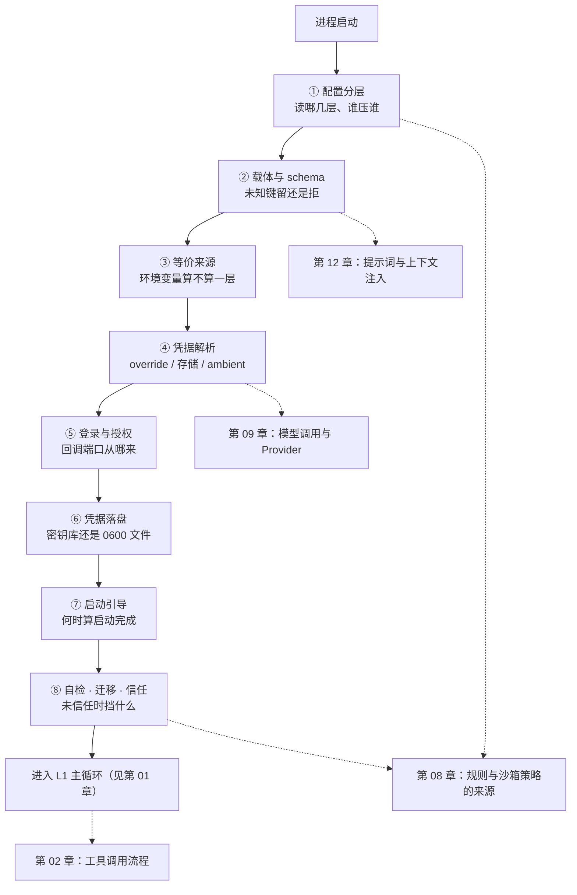

# 第 11 章：配置 · 凭据与启动引导 —— 循环开始之前，它先读谁、拿谁的钥匙、信任谁

内核十章把「一轮循环」拆得很细，但没有任何一章回答过：**这一轮循环是在什么前提下开始的**。模型名从哪来、API key 从哪来、项目目录里的配置能不能生效、扩展是什么时候被装进来的——这些都在第一次 `turn` 之前就已经确定，而且一旦确定就很难在运行中改变。本章补的是这段「开机过程」。

四家在这一层上的分歧比内核任何一层都大：**配置层级从 2 层到 10 层不等**（pi 2 层、dsh 4 层、CC 5 层、codex 10 层），**凭据从「直接写一个文件」到「keyring + OAuth + 企业 IdP 三级回退」不等**，而「首次在某目录运行要不要先问用户一句」这件事上，**四家里只有 dsh 不做**。分歧之所以大，是因为这一层同时被产品形态（CLI / TUI / 桌面 / SDK）与部署形态（个人 / 企业托管 / 多平台）拉扯，没有一套通用答案。

> **本层定位**：L0.1，启动区第一站——内核循环开始之前，决定「读到哪些配置、拿到谁的凭据、起哪些子系统、信任谁」。
>
> **前置依赖**：09（凭据解析是 provider 装配的输入）、08（规则与沙箱策略的来源在配置层装载）、12（项目指令发现与环境探测的取值来源）。
>
> **分析对象**：
> - **pi** —— `packages/coding-agent/src/config.ts` + `core/settings-manager.ts` + `packages/ai/src/auth/`（两份 JSON + 一份 `auth.json`，启动由 `main.ts` 线性编排）
> - **deepseek-harness** —— `packages/settings/settings` + `packages/boot/*` + `packages/credentials/*`（配置即 Cordis 插件条目，由 patch 列表叠加）
> - **codex** —— `codex-rs/config/*` + `codex-rs/login/*`（十层配置 + 数值化优先级 + keyring 凭据存储）
> - **CC** —— `src/utils/settings/*` + `src/cli/*` + `src/utils/auth.ts`（五层设置 + 企业 policy 排最后而胜出 + keychain 凭据）
>
> **跨层联动**：08 —— 见 4.4.6。权限规则的来源（`.claude/settings.json`、`managed-settings.json`）在本层装载，第 08 章只消费装载后的结果。
>
> **易混点**：「项目信任（project trust）」与「权限模式（permission mode）」是两件事——前者决定**项目级配置与扩展是否被加载**，后者决定**工具调用是否放行**。三家都把它们放在不同的判定函数里（CC 的 `config.ts:697` 与 `permissions.ts`，codex 的 `loader/mod.rs:1082` 与 `exec/src/lib.rs:565`）。
>
> **门控提示**：CC 为 npm 包 source map 还原版。本层内 `runMigrations` 有一处 `feature('TRANSCRIPT_CLASSIFIER')` 分支（`main.tsx:337-339`），`--dangerously-skip-permissions` 的可用性受 Statsig 门 `tengu_disable_bypass_permissions_mode` 控制（`permissionSetup.ts:930-943`）。

---

## 一、核心结论速览

1. **配置层级从 2 层到 10 层，是四家形态差异最大的一处**：pi 只有「全局 + 项目」两层（`settings-manager.ts:350` 的 `deepMergeSettings` 一次合并），CC 五层且企业 policy 排最后因而最终胜出（`constants.ts:7-22`、`settings.ts:722-729`），codex 十层并给每层一个数值化优先级（`config_layer_source.rs:33-51`），dsh 用 patch 列表叠加四层（`profile-context.ts:65`）。**层数越多越需要显式数值序**——codex 与 CC 都给了，pi 与 dsh 没有。[代码]

2. **「企业 / 托管配置」在四家里都不是「优先级更高」，而是「独占开关」**：codex 的注释直接写 `Managed config wins over CLI config.`（`loader/mod.rs:346`），其 managed 层优先级 40/50 高于 CLI 覆盖层的 30（`config_layer_source.rs:47-49`）；CC 把 policy 层排在链尾（`settings.ts:722-729`）并把 `projectSettings` 排除在若干安全开关判定之外（`settings.ts:882-889`）；dsh 把平台地址交给私有 `$DSH_HOME/cordis.patch.yml`（`deepseek-account-platform/README.md:35`）。这与第 13 章 MCP 里 CC 的「企业配置存在即独占」是同一设计。[代码]

3. **未知键处理比 schema 有无更能分档**：pi 的 `settings.json` 完全无校验（实测 `settings-manager.ts` 无 `zod` / `safeParse` / `Type.Object`），未知键保留并原样写回（`:647`、`:664`）；dsh 非 strict 合并保留（`vendor/schemastery/src/index.ts:812-822`）；CC 用 `zod` 但 schema 末尾是 `.passthrough()`（`types.ts:1071-1072`）；**只有 codex 用 `schemars(deny_unknown_fields)`**（`config_toml.rs:163-166`），并在非 strict 模式下用 `serde_ignored` 把未识别字段汇总成启动 warning（`strict_config.rs:205-295`）。[代码]

4. **凭据落盘四家都做「平台安全存储优先 + 文件回退」，但只有 codex 与 CC 有完整的 OAuth 刷新闭环**：codex 的 `AutoAuthStorage` 先问 keyring、失败才回退 `auth.json`（`storage.rs:431-441`，写盘 `0o600`，`:206-218`）；CC 的 `getSecureStorage()` 在 macOS 走 keychain、失败回退 `~/.claude/.credentials.json` 并 `chmod 0600`（`plainTextStorage.ts:57-65`）；pi 只有 `auth.json`（`auth-storage.ts:25` 的 `mode: 0o600`、`:59` 的目录 `0o700`）；dsh 只有 `.credentials.yaml`（`credentials-local/src/index.ts:690` 写 `0600`、`:127` 启动时校验「不得对组 / 其他可读」），并**明确声明账号 token 永不刷新**（`deepseek-account-platform/README.md:85` 的 `Account tokens have no expiry or refresh flow`）。[代码]

5. **项目信任只有 dsh 不做，其余三家在非交互模式下都收敛到「拒绝」或「隐式信任」**：pi 的 `resolveProjectTrusted` 在 `hasUI === false` 时直接返回 `false`（`project-trust.ts:86-88`）；codex 未信任项目会被剥掉 `PROJECT_LOCAL_CONFIG_DENYLIST` 里的敏感键（`loader/mod.rs:84-97`）并在 `exec` 无 TTY 时默认 `AskForApproval::Never`（`exec/src/lib.rs:565-568`）；CC 非交互路径跳过信任对话、直接按隐式信任处理（`main.tsx:1958-1971`）；dsh 全仓无工作区信任概念——`trust` 一词在 dsh 里只指 web Host 白名单与 `/api` 防 DNS rebinding 围栏（`bundle/web-app/src/index.ts:56-64`、`client/connection/src/api-request-trust.ts:1-13`）。[代码]

---

## 二、本层职责与边界

### 2.1 子职责拆解

| # | 子职责 | 要回答的问题 |
|---|---|---|
| 1 | 配置分层与优先级 | 有哪些配置来源？谁覆盖谁？判定是显式数值序还是调用顺序？ |
| 2 | 配置载体与 schema | 什么格式？由谁定义类型？未知键是拒绝、告警还是保留？ |
| 3 | 配置的等价来源 | CLI 参数、环境变量、企业托管如何进入同一份配置？ |
| 4 | 凭据来源与解析 | 找一个 provider 的凭据时按什么顺序试？环境变量与已存凭据谁优先？ |
| 5 | 登录与授权流 | 授权码 / 设备码 / 企业 IdP 各怎么走？回调落在哪个端口？ |
| 6 | 凭据存储与安全 | 存哪、什么格式、什么权限？平台安全存储与文件回退如何取舍？ |
| 7 | 启动引导序列 | 从进程入口到「可交互」之间的步骤顺序？何时算启动完成？ |
| 8 | 启动自检 · 迁移 · 项目信任 | 旧配置怎么迁移？损坏配置怎么办？首次在某目录跑要不要先问？ |

### 2.2 本层不管什么

- **不管模型怎么调**（那是第 09 章）。本层只负责把「用哪个 provider、拿什么 key」这两件事算出来，交给 provider 装配；请求组装、重试、流式解析都不在这里。
- **不管项目指令里写什么**（那是第 12 章）。本层负责把 `AGENTS.md` / `CLAUDE.md` 这类文件**找出来并读出原文**（候选名表与字节预算是第 12 章的议题），但不参与它怎么拼进系统提示词。
- **不管权限规则如何判定**（那是第 08 章）。本层负责装载规则来源（`settings.json` 的 permissions 段、`managed-settings.json`、`.rules` 文件），判定链本身归第 08 章。
- **不管扩展被加载后能做什么**（那是第 10 章）。本层只决定「装不装、装哪些」——`packageManager.resolve()` 与插件目录扫描在这里发生，挂载点语义归第 10 章。
- **不做运行中的配置热更新**（dsh 例外）。pi / codex / CC 的配置在启动期定型，运行中改文件不会自动生效；只有 dsh 的 `hmr` 包监听 `cordis.patch.yml` 与 profile `package.json` 并 reconcile 进 Loader（`hmr/src/index.ts:214-219`）。

### 2.3 层次定位

启动区只有两站，本章是第一站，其产物是第 12 章的输入：

```text
┌────────────────────────────────────────────────────────────────────────────────────────┐
│ L0 启动区（内核循环之前）—— 决定「开起来是什么样」                                     │
│                                                                                        │
│       ┌─────────────────────────────────┐       ┌─────────────────────────────────┐    │
│       │ L0.1  第 11 章（本章）          │       │ L0.2  第 12 章                  │    │
│       │ 配置 · 凭据与启动引导           │ ───▶  │ 提示词与上下文注入              │    │
│       │ 读什么配置 · 拿谁的凭据         │       │ 分节组装 · 顺序 · 预算          │    │
│       │ 起哪些子系统 · 信任谁           │       │ 项目指令 · 环境探测             │    │
│       └─────────────────────────────────┘       └─────────────────────────────────┘    │
│                        │                                         │                     │
│                        └────────────────────┬────────────────────┘                     │
│                                             │                                          │
│                                             │                                          │
│                                             ▼                                          │
│                         ┌─────────────────────────────────────┐                        │
│                         │ L1  第 01 章  Agent 主循环          │                        │
│                         └─────────────────────────────────────┘                        │
└────────────────────────────────────────────────────────────────────────────────────────┘
```

**图 11-1**：L0.1 在启动区中的位置。本章的产物（生效的配置、可用的凭据、已装载的扩展与规则）是第 12 章组装系统提示词的前提；两站都完成后才进入 L1 的主循环。

四家在同一批环节上的形态可以并列成一张骨架表：

```text
┌────────────┬──────────────────┬──────────────────┬──────────────────┬──────────────────┐
│ 环节       │ pi               │ deepseek-harness │ codex            │ Claude-Code      │
├────────────┼──────────────────┼──────────────────┼──────────────────┼──────────────────┤
│ 配置分层   │ 2 层             │ 4 层 patch       │ 10 层            │ 5 层             │
│ 配置载体   │ JSON             │ YAML + !!js      │ TOML             │ JSON             │
│ schema     │ settings 无校验  │ Schemastery      │ schemars         │ zod              │
│ 未知键     │ 保留且写回       │ 合并保留         │ 告警 / 拒绝      │ 保留             │
│ 凭据首选   │ override         │ env              │ CODEX_API_KEY    │ --bare           │
│ 凭据落盘   │ auth.json        │ credentials.yaml │ keyring 优先     │ keychain 优先    │
│ 配置迁移   │ 有               │ 有               │ 无版本迁移       │ 有               │
│ 项目信任   │ 有               │ 无               │ 有               │ 有               │
└────────────┴──────────────────┴──────────────────┴──────────────────┴──────────────────┘
```

**图 11-2**：四家 L0.1 骨架对照。「配置分层」一行的跨度（2 层到 10 层）与「项目信任」一行的空位（只有 dsh 为「无」）是本章两条主线。

---

## 三、概念对齐表

| 概念 | pi | deepseek-harness | codex | CC |
|---|---|---|---|---|
| 配置文件的统一叫法 | `settings.json` | Cordis 插件条目（entry list） | `config.toml` | `settings.json` |
| 配置路径根 | `~/.pi/agent`（`config.ts:528-533`） | `$DSH_HOME`（默认 `~/.dsh`，`home-paths/src/index.ts:62`） | `$CODEX_HOME`（`utils/home-dir/src/lib.rs:13-18`） | `~/.claude` 或 `$CLAUDE_CONFIG_DIR`（`envUtils.ts:7-13`） |
| 层级枚举 | 无（global / project 两个字段） | 无（bundle → profile patch → home patch → overlay） | `ConfigLayerSource` 9 变体（`config_layer_source.rs:33-51`） | `SETTING_SOURCES` 5 项（`constants.ts:7-22`） |
| 优先级表达 | 调用顺序（`settings-manager.ts:350`） | patch 数组顺序（`profile-context.ts:65`） | 数值 `precedence()`（越大越高） | 数组下标（越靠后越高） |
| 企业 / 托管层 | 无 | 私有 `$DSH_HOME/cordis.patch.yml` | `Mdm` / `EnterpriseManaged` / legacy managed | `policySettings` |
| 企业层是否压过 CLI | — | — | 是（40/50 > 30） | 是（链尾） |
| schema 库 | 无（`models.json` 用 typebox） | Schemastery（各插件自带 `static Config`） | `schemars` + `deny_unknown_fields` | `zod` + `.passthrough()` |
| 未识别字段 | 保留并写回 | 合并保留（非 strict） | 汇总为启动 warning；strict 下报错 | 保留 |
| CLI 覆盖入口 | `--model` / `--provider` / `--api-key` | `--patch <path>`（可重复） | `-c/--config key=value`（可重复） | `--settings` / `--setting-sources` |
| 环境变量与配置的关系 | 不进 settings，个别 getter 直读 | 独立一条链（`.env` 分层，不覆盖既有值） | 无通用 env → config 映射 | `settings.env` 按来源信任度分级写入 `process.env` |
| 凭据解析首选项 | `overrides.apiKey`（`resolve.ts:73`） | 继承环境 `env`（`credentials-local/src/index.ts:609-612`） | `CODEX_API_KEY`（`manager.rs:1484-1489`） | `--bare` 短路（`auth.ts:153-206`） |
| 凭据解析链 | override → 存储 → ambient（`resolve.ts:87-109`） | env → file → project-env → user-env（`:609-620`） | `CODEX_API_KEY` → ephemeral → `CODEX_ACCESS_TOKEN` → 持久（`manager.rs:1473-1480`） | `ANTHROPIC_AUTH_TOKEN` → `CLAUDE_CODE_OAUTH_TOKEN` → FD → helper → claude.ai（`auth.ts:153-206`） |
| 凭据存储位置 | `~/.pi/agent/auth.json` | `<home>/.credentials.yaml` | keyring；回退 `${CODEX_HOME}/auth.json` | keychain；回退 `~/.claude/.credentials.json` |
| 凭据文件权限 | 文件 `0o600`、目录 `0o700` | 文件 `0600`、目录 `0700`，并**启动时校验** | 文件 `0o600` | 明文回退 `chmod 0o600` |
| OAuth 回调端口 | 固定 53692（anthropic）/ 1455（openai-codex）/ 随机（openrouter） | Host webServer 的 `/oauth/callback` | 1455 → 回退 1457 | 随机（`listen(port ?? 0)`） |
| token 刷新判据 | 剩余 < 5 分钟触发（`resolve.ts:135-136`） | 无（账号 token 无过期） | 近过期刷新，或 `last_refresh` 超 8 天（`manager.rs:203`） | `refresh_token` + 5 分钟缓冲，401 强刷且跨进程去重（`client.ts:344-353`） |
| 启动序列的编排者 | `main.ts` 线性 await | `app-boot` 的 `prepare` + Loader `await()` | `tui/src/startup_orchestration.rs` | `entrypoints/init.ts` 的 `init()` + `main.tsx` 的 `preAction` |
| 启动完成判据 | 建 runtime + `initTheme`（`main.ts:845`、`:887`） | `auditStartupEntries` 要求 7 个必需条目全激活（`app-boot/src/index.ts:705`） | `Config` 构建成功 → OTEL → state DB → TUI | `init()` 打点 + `setup()` 完成 |
| 配置迁移机制 | `runMigrations` + `migrateSettings` | 凭据文档 `version` + 旧 `settings.yaml` 导入 | **无版本迁移**，只有字段别名表 | `migrationVersion`（当前 11） |
| 项目信任载体 | `~/.pi/agent/trust.json` | **无** | `config.toml` 的 `[projects."<path>"] trust_level` | 全局 config 的 `projects[<path>].hasTrustDialogAccepted` |

> 两处空白有实质含义：「企业 / 托管层」在 pi 与 dsh 上是空的——pi 没有企业托管概念，dsh 把部署差异交给私有 patch 文件而非公开配置层；「项目信任」在 dsh 上是空的，因为 dsh 的启动路径根本不读 cwd 的信任状态。

---

## 四、逐项目实现

### 4.1 pi —— 两份 JSON 加一份 auth.json，启动靠线性 await 串起来

> 一句话定性：配置层最薄的一个——只有全局与项目两份 `settings.json`，用一次深合并叠起来；`settings.json` 完全不做类型校验，`models.json` 才上 typebox；凭据是「override → 存储 → 环境」三段式，落盘就一个 `auth.json`，靠文件权限而不是平台密钥库来保护。

#### 4.1.1 两份 JSON，一份有校验一份没有

配置路径由 `config.ts` 的三个函数决定，根目录来自环境变量或默认值：

`packages/coding-agent/src/config.ts:528-533`
```ts
export function getAgentDir(): string {
	const envDir = process.env[ENV_AGENT_DIR];
	if (envDir) {
		return expandTildePath(envDir);
	}
	return join(homedir(), CONFIG_DIR_NAME, "agent");
}
```

`getSettingsPath()` 与 `getAuthPath()` 都是在 `getAgentDir()` 之上拼文件名（`config.ts:552-554`、`:547-549`），所以改一个环境变量 `PI_CODING_AGENT_DIR` 就能整体挪走配置与凭据。

**`settings.json` 没有任何 schema**——加载只有一次 BOM 剥离、一次 `JSON.parse`，加一次字段迁移：

`packages/coding-agent/src/core/settings-manager.ts:410-426`
```ts
	private static loadFromStorage(storage: SettingsStorage, scope: SettingsScope, projectTrusted = true): Settings {
		if (scope === "project" && !projectTrusted) {
			return {};
		}

		let content: string | undefined;
		storage.withLock(scope, (current) => {
			content = current;
			return undefined;
		});

		if (!content) {
			return {};
		}
		const settings = JSON.parse(stripBom(content));
		return SettingsManager.migrateSettings(settings);
	}
```

这个函数的前三行是本章后续讨论的关键：**读「项目作用域」的配置时，如果项目未被信任就直接返回空对象，连文件都不读**。这比「读进来再决定用不用」更保守，也是 4.1.6 里那个「设置管理器被创建两次」能够成立的原因。

对照同一项目里 `models.json` 的处理，能看出这是刻意的分工：`models.json` 用 typebox 编译校验，失败时返回错误串并把 providers 清空：

`packages/coding-agent/src/core/model-config.ts:242-245`
```ts
const ModelsConfigSchema = Type.Object({
	providers: Type.Record(Type.String(), ProviderConfigSchema),
});
const validateModelsConfig = Compile(ModelsConfigSchema);
```

`packages/coding-agent/src/core/model-config.ts:305-311`
```ts
		if (!validateModelsConfig.Check(parsed)) {
			const errors =
				validateModelsConfig
					.Errors(parsed)
					.map((error) => `  - ${formatValidationPath(error)}: ${error.message}`)
					.join("\n") || "Unknown schema error";
			return new ModelConfig(new Map(), `Invalid models.json schema:\n${errors}\n\nFile: ${path}`);
		}
```

**分工的边界很清晰**：`models.json` 描述的是「provider 与模型长什么样」，格式错了会让整条模型链路不可用，所以强校验；`settings.json` 描述的是用户偏好（主题、快捷键、默认模型 ID），键写错了顶多某个 getter 回退默认值，所以不校验——写回时只把**被修改过的字段**合并回磁盘上的原文，因此未知键不会被清掉（`settings-manager.ts:643-665`）。

#### 4.1.2 层级只有两级，靠调用顺序而非数值

pi 的层级合并只有一个函数，语义是「后到者覆盖前者，`undefined` 跳过」：

`packages/coding-agent/src/core/settings-manager.ts:189-191`
```ts
function deepMergeSettings(base: Settings, overrides: Settings): Settings {
	return deepMergeObjects(base as Record<string, unknown>, overrides as Record<string, unknown>) as Settings;
}
```

`packages/coding-agent/src/core/settings-manager.ts:350`
```ts
this.settings = deepMergeSettings(this.globalSettings, this.projectSettings);
```

运行时覆盖走另一个入口 `applyOverrides`（`settings-manager.ts:568-570`），唯一的调用点是主题：

`packages/coding-agent/src/main.ts:667`
```ts
startupSettingsManager.applyOverrides({ theme: parsed.useTheme });
```

**pi 没有「优先级表」这个对象**——层级关系完全体现在这几个调用点的先后上。这与 codex 的 `precedence()` 数值表形成对照，代价是当一个新来源（例如未来的企业配置）加进来时，没有一处集中声明它排第几。

环境变量**不参与 settings 合并**，只在个别 getter 里作为兜底直读，而且这一档排在 settings 之下：

`packages/coding-agent/src/core/settings-manager.ts:1235-1241`
```ts
	getClearOnShrink(): boolean {
		// Settings takes precedence, then env var, then default false
		if (this.settings.terminal?.clearOnShrink !== undefined) {
			return this.settings.terminal.clearOnShrink;
		}
		return process.env.PI_CLEAR_ON_SHRINK === "1";
	}
```

注释把三档顺序写成了「设置 → 环境变量 → 默认值」。**这与 dsh 的 `loadLayeredEnv` 恰好相反**（见 4.2.3，那里是「继承的环境变量 > `.env` 分层」）——同样是「环境变量不覆盖显式配置」，但到底谁算显式，两家的判断正好倒过来。

#### 4.1.3 凭据解析：override → 存储 → ambient

解析入口是 `resolveProviderAuthWithSignal`，三段式且**存储凭据一旦存在就不再回退环境**：

`packages/ai/src/auth/resolve.ts:73-85`
```ts
	if (overrides?.apiKey !== undefined && provider.auth.apiKey) {
		return resolveApiKey(
			requestAuthContext,
			provider.auth.apiKey,
			provider.id,
			{
				type: "api_key",
				key: overrides.apiKey,
				env: overrides.env,
			},
			signal,
		);
	}
```

`packages/ai/src/auth/resolve.ts:87-109`
```ts
	const stored = await readCredential(credentials, provider.id, signal);
	if (stored) {
		if (stored.type === "oauth" && provider.auth.oauth) {
			return resolveStoredOAuth(
				credentials,
				provider.id,
				provider.auth.oauth,
				stored,
				signal,
				overrides?.minOAuthValidityMs,
			);
		}
		if (stored.type === "api_key" && provider.auth.apiKey) {
			const credential = overrides?.env ? { ...stored, env: { ...stored.env, ...overrides.env } } : stored;
			return resolveApiKey(requestAuthContext, provider.auth.apiKey, provider.id, credential, signal);
		}
		return undefined;
	}

	// Ambient (env vars, AWS profiles, ADC files).
	return provider.auth.apiKey
		? resolveApiKey(requestAuthContext, provider.auth.apiKey, provider.id, undefined, signal)
		: undefined;
```

第三段的注释值得单独指出：**ambient 一档里装的不只是环境变量**，还包括 AWS profile 与 ADC 文件——也就是说 pi 把「云厂商凭据链」整体外包给了底层 SDK，自己只负责判断「要不要走这一档」。

凭据按 provider 分槽，键就是 provider 的 `id`（`auth-storage.ts:17` 的 `Record<string, Credential>`），因此多 provider 天然互不干扰。

#### 4.1.4 凭据落盘：一个文件，两层权限

pi 没有平台密钥库集成，保护手段是文件权限，而且写入选项里带一句解释：

`packages/coding-agent/src/core/auth-storage.ts:24-25`
```ts
// The mode applies only on creation so administrator-managed modes and ACLs remain intact.
const AUTH_FILE_WRITE_OPTIONS = { encoding: "utf-8", mode: 0o600 } as const;
```

`packages/coding-agent/src/core/auth-storage.ts:58-60`
```ts
		if (!existsSync(dir)) {
			mkdirSync(dir, { recursive: true, mode: 0o700 });
		}
```

注释里那句「只在创建时生效」是一个容易被忽略的细节：如果管理员事后把 `auth.json` 设成 `0600` 之外的模式并加了 ACL，pi 的写入**不会**把它改回去。这是一种「管理员意图优先」的取舍——好处是不与部署方的权限治理打架，代价是文件一旦被放宽权限，进程自己不会纠偏。

写入的串行化用 lockfile 包（`auth-storage.ts:9` 的 `proper-lockfile`），写路径唯一（`packages/ai/src/auth/types.ts:65-94` 的 `modify`），因此并发进程不会互相覆盖。

#### 4.1.5 登录：8 个 flow，端口从「固定」到「随便」

OAuth 实现按 provider 分部在 `packages/ai/src/auth/oauth/` 下，由一个注册表聚合（`oauth/load.ts:14-23`）。三种形态并存：

| flow | 授权形态 | 回调端口 | 锚点 |
|---|---|---|---|
| anthropic | 授权码 + PKCE | 固定 `53692` | `oauth/anthropic.ts:33-35` |
| openai-codex | 授权码 + PKCE / 设备码 | 固定 `1455` | `oauth/openai-codex.ts:30`、`:370` |
| github-copilot | 设备码 | 无回调 | `oauth/github-copilot.ts:8` |
| kimi-coding / meta / xai | 设备码 | 无回调 | `oauth/kimi-coding.ts:12`、`oauth/meta.ts:17`、`oauth/xai.ts:6` |
| openrouter | PKCE | 临时端口 `0` | `oauth/openrouter.ts:210`、`:232` |
| radius | 设备码 / 授权码 | 有本地 server | `oauth/radius.ts:174`、`:258` |

回调主机可被环境变量改写，默认回环：

`packages/ai/src/auth/oauth/anthropic.ts:32-35`
```ts
const CALLBACK_HOST = getProviderEnvValue("PI_OAUTH_CALLBACK_HOST") || "127.0.0.1";
const CALLBACK_PORT = 53692;
const CALLBACK_PATH = "/callback";
const REDIRECT_URI = `http://localhost:${CALLBACK_PORT}${CALLBACK_PATH}`;
```

设备码轮询按 RFC 8628 实现（`oauth/device-code.ts:46-98`），PKCE 用 S256（`oauth/pkce.ts:21-33`）。刷新判据是「剩余有效期小于一个下限值就提前换」，下限默认 5 分钟、可被调用方抬高：

`packages/ai/src/auth/resolve.ts:135-136`
```ts
	const minimumValidityMs = Math.max(DEFAULT_OAUTH_MINIMUM_VALIDITY_MS, minOAuthValidityMs ?? 0);
	const expiresSoon = (credential: OAuthCredential) => Date.now() + minimumValidityMs >= credential.expires;
```

写入时就已经扣掉了这个窗口，因此刷新不是「等到过期再试」：

`packages/ai/src/auth/oauth/anthropic.ts:351`
```ts
		expires: Date.now() + data.expires_in * 1000 - 5 * 60 * 1000,
```

**「提前 5 分钟」这个数字在四家里重复出现**（见 4.4.6 的 CC），说明它更像是工程经验而非协议要求。

#### 4.1.6 启动序列：一条线性 await

pi 的启动入口是 `main()`，步骤是一条没有阶段划分的线（`main.ts:566` 起）。关键分叉在于**设置管理器被创建两次**——第一次在项目信任判定之前，只读全局层：

`packages/coding-agent/src/main.ts:584-588`
```ts
	const cwd = process.cwd();
	const agentDir = getAgentDir();
	const bootstrapSettingsManager = SettingsManager.create(cwd, agentDir, { projectTrusted: false });
	applyHttpProxySettings(bootstrapSettingsManager.getGlobalSettings().httpProxy);
	configureHttpDispatcher();
```

第二次在信任判定完成后，才允许项目层参与合并：

`packages/coding-agent/src/main.ts:735`
```ts
		const runtimeSettingsManager = SettingsManager.create(cwd, agentDir, { projectTrusted });
```

这是一个「先读安全的那一半，再问用户，再读另一半」的顺序，好处是**项目目录里的 `settings.json` 在用户确认之前根本没有被读取**——比「读进来再决定用不用」更保守。

完整顺序（`:575`–`:934`）：`runAuthCommand` 短路 → bootstrap settings → 包 / 配置子命令 → `parseArgs` → `runMigrations` → 正式加载 + 诊断 → 首次运行引导 → 主题覆盖 → 建 session → 建 `ProjectTrustStore` → `createRuntime` → `initTheme` → 进入模式。扩展与包的装载发生在 `createRuntime` 内部：`createAgentSessionServices` 先建 `ModelRuntime`，再 `new DefaultResourceLoader(...).reload()`（`core/agent-session-services.ts:142-154`），而 `ResourceLoader` 构造时创建 `DefaultPackageManager`（`core/resource-loader.ts:259-263`），`reload()` 中调 `packageManager.resolve()`（`:404`）完成按需安装。

#### 4.1.7 迁移与损坏处理：报错降级，但不覆盖

迁移由 `runMigrations` 编排（`src/migrations.ts:305-315`），最大的一项是「把旧 `oauth.json` 与 `settings.json` 里的 `apiKeys` 合并进 `auth.json`」，完成后旧文件改名 `.migrated`（`:21-73`）。settings 内部还有一层字段迁移（`settings-manager.ts:441-499`），例如 `queueMode` → `steeringMode`、`websockets` → `transport`。

损坏配置的处理有一个值得抄的细节——**解析失败时不写回**：

`packages/coding-agent/src/core/settings-manager.ts:428-438`
```ts
	private static tryLoadFromStorage(
		storage: SettingsStorage,
		scope: SettingsScope,
		projectTrusted = true,
	): { settings: Settings; error: Error | null } {
		try {
			return { settings: SettingsManager.loadFromStorage(storage, scope, projectTrusted), error: null };
		} catch (error) {
			return { settings: {}, error: error as Error };
		}
	}
```

`packages/coding-agent/src/core/settings-manager.ts:668-682`
```ts
	private save(): void {
		this.settings = deepMergeSettings(this.globalSettings, this.projectSettings);

		if (this.globalSettingsLoadError) {
			return;
		}

		const snapshotGlobalSettings = structuredClone(this.globalSettings);
		const modifiedFields = new Set(this.modifiedFields);
		const modifiedNestedFields = this.cloneModifiedNestedFields(this.modifiedNestedFields);

		this.enqueueWrite("global", () => {
			this.persistScopedSettings("global", snapshotGlobalSettings, modifiedFields, modifiedNestedFields);
		});
	}
```

否则一次手抖写坏 JSON，进程就会用空设置覆盖掉用户的真实配置。**「读失败 → 用默认值运行 + 拒绝写回」比「读失败 → 用默认值运行」多出来的那一步，是数据安全的关键。**`save()` 与 `saveProjectSettings()` 各自带一个同形状的守卫（`:671`、`:689`），因此「哪个作用域读失败」与「哪个作用域不许写」是一一对应的。

#### 4.1.8 项目信任：非交互直接拒绝

判定入口把决策来源排成一个明确的优先级链：

`packages/coding-agent/src/core/project-trust.ts:46-52`
```ts
export async function resolveProjectTrusted(options: ResolveProjectTrustedOptions): Promise<boolean> {
	if (options.trustOverride !== undefined) {
		return options.trustOverride;
	}
	if (!hasTrustRequiringProjectResources(options.cwd)) {
		return true;
	}

	...
}
```

链的完整顺序是：CLI 覆盖 → 若项目里没有任何「需要信任的资源」则直接放行 → 扩展事件 → 已存决策 → `defaultProjectTrust` → 交互询问。需要信任的资源由 `hasTrustRequiringProjectResources` 判定（`core/trust-manager.ts:185-207`，检查 `.pi/settings.json`、`extensions`、`skills` 等）。

关键的一步在链尾：

`packages/coding-agent/src/core/project-trust.ts:77-95`
```ts
	switch (options.defaultProjectTrust ?? "ask") {
		case "always":
			return true;
		case "never":
			return false;
		case "ask":
			break;
	}

	if (!options.projectTrustContext.hasUI) {
		return false;
	}

	const selected = await selectProjectTrustOption(options.cwd, options.projectTrustContext);
	if (selected !== undefined) {
		saveProjectTrustPromptResult(options.trustStore, selected);
		return selected.trusted;
	}
	return false;
```

**默认值是 `ask`，而非交互环境下 `ask` 落到 `false`**——也就是说 `pi --print` 这类无人值守调用永远不会因为「没法弹窗」而默认信任。这与第 16 章将要讨论的「交互层如何影响内核行为」是一处提前出现的例子：`hasUI` 这个纯交互概念在这里直接决定了一个安全判定。

判定结果存在 `~/.pi/agent/trust.json`（`core/trust-manager.ts:209-214`）。CLI 侧的 `--approve` / `--no-approve` 通过 `parsed.projectTrustOverride` 注入（`main.ts:706-734`）。

### 4.2 deepseek-harness —— 配置就是插件条目，schema 由插件自己带

> 一句话定性：把「配置」这件事实质上取消了——没有独立的配置文件格式，profile 根是一份空数组，整棵树由四层 patch 叠加而成；类型校验下放给每个插件自带的 Schemastery schema；凭据是「环境 → 文件 → dotenv」三段式，且凭据文件的**权限由进程在启动时主动校验**。

#### 4.2.1 profile 根是空数组，配置靠 patch 叠加

profile 根文件的内容本身就是一句解释：

`apps/cli/src/profile-boot.ts:80-84`
```ts
const PROFILE_ROOT_CONFIG = `# dsh profile root — an empty entry list. The tree is composed as patches:
# each bundle in package.json's dsh.profile.bundles, then cordis.patch.yml, then any
# --patch overlays. Edit cordis.patch.yml, not this file.
[]
`
```

叠加顺序在同项目里被显式写成一个数组：

`packages/boot/app-boot/src/profile-context.ts:63-75`
```ts
export function readProfilePatches(binName: string, context: ProfileContext, initialProfile?: Profile): PatchOptions[] {
  const profile = initialProfile ?? loadProfileDirectory(binName, context.dir, context.installAnchor, { userLayer: false })
  const patches = structuredClone([
    ...profile.layers.flatMap(layer => layer.patches),
    ...(initialProfile?.patches ?? loadOptionalPatches(binName, context.patchPath) ?? []),
    ...(loadOptionalPatches(binName, join(context.home, PROFILE_PATCH_FILENAME)) ?? []),
    ...context.overlays,
  ])
  const telemetryPatch = resolveTelemetryPatch(context.telemetryDisabledEnv,
    composeEntries([patches]).some(row => row.id === TELEMETRY_ROW_ID))
  if (telemetryPatch !== undefined) patches.push(telemetryPatch)
  return patches
}
```

四层含义清楚：**bundle 自带层**（`package.json` 的 `dsh.profile.bundles` 顺序）→ **profile 自己的 `cordis.patch.yml`** → **用户级全局 `$DSH_HOME/cordis.patch.yml`** → **`--patch` overlay**（按命令行顺序）。最后一层是遥测开关，由环境变量决定是否追加。

也就是说，**dsh 没有「用户配置覆盖项目配置」这种语义**——它有的是「一堆补丁按序应用」。层级概念被表达成数组下标，而数组是多个来源拼出来的。

#### 4.2.2 schema 由插件自带，且默认不拒绝未知键

校验发生在挂载时，从插件类上的 `Config` 静态属性取：

`vendor/cordis/src/fiber.ts:50-62`
```ts
export function resolveConfig(runtime: Plugin.Runtime, config: any) {
  if (!runtime.Config) return config
  // TODO: async validation
  const result = runtime.Config['~standard'].validate(config)
  if ('then' in result) {
    throw new TypeError('Async config validation is not supported')
  }
  if (result.issues) {
    throw new ValidationError(result.issues)
  } else {
    return result.value
  }
}
```

第 51 行的早退是这个设计的全部要点：**没有 `Config` 就原样返回**，所以「不校验」不是异常路径而是默认路径；真正抛错的只有「有 schema 但类型不符」这一种情况。

`Config` 由各插件用 Schemastery 定义，例如凭据插件的 schema（`packages/credentials/credentials-local/src/index.ts:514-519`）。这个设计的后果是：**配置的合法形状分散在几十个插件里**，没有一个中心化的「全部配置字段」清单。dsh 用另一条路补上了可发现性——`--dump-config` 打印合成后的整棵树，以及一份自动生成的 JSON Schema（`boot/app-boot/src/config-schema/document.ts:134`）。

未知键**不拒绝**，这是默认行为。`strict` 是 `Schema.resolve` 的第 4 个形参且默认 `false`（`vendor/schemastery/src/index.ts:515`），而对象类型的适配器在收尾时只做一件事：

`vendor/schemastery/src/index.ts:812-823`
```ts
Schema.extend('object', (data, { dict }, options, strict) => {
  if (!isPlainObject(data)) throw new ValidationError(`expected object but got ${data}`, options)
  const result: any = {}
  for (const key in dict) {
    const value = property(data, key, dict![key]!, options)
    if (!isNullable(value) || key in data) {
      result[key] = value
    }
  }
  if (!strict) merge(result, data)
  return [result]
})
```

`if (!strict) merge(result, data)` 这一行把「保留未知键」写成了 schema 校验之后的一次补写——**未知键不是「没被校验到所以留下来了」，而是被显式塞回去了**。只有类型错误（例如本该是数字的地方给了字符串）才抛 `ValidationError` 并让 fiber 失败。

#### 4.2.3 环境变量是独立一条链，而且不覆盖既有值

dsh 的 `.env` 分层与插件配置完全解耦，处理函数把三层来源按「先有的先赢」写入 `process.env`：

`packages/boot/app-boot/src/index.ts:225-246`
```ts
export function loadLayeredEnv(
  binName: string, cwd: string = process.cwd(),
  warn: (line: string) => void = line => void process.stderr.write(line),
): LaunchEnvironmentSnapshot {
  const home = resolveDshHome()
  const inherited = { ...process.env } as Record<string, string>
  // Parse both layers first: a rejection must not leave one file applied.
  const project = readEnvLayer(binName, cwd, warn, home)
  const user = home === resolve(cwd) ? undefined : readEnvLayer(binName, home, warn, home)
  // Apply the checked values without replacing a higher-ranked name.
  for (const layer of [project, user]) {
    if (layer === undefined) continue
    for (const [name, value] of Object.entries(layer.values)) {
      if (process.env[name] === undefined) process.env[name] = value
    }
  }
  return createLaunchEnvironmentSnapshot([
    { source: 'process', values: inherited },
    ...project === undefined ? [] : [{ source: 'project-env' as const, path: project.path, values: project.values }],
    ...user === undefined ? [] : [{ source: 'user-env' as const, path: user.path, values: user.values }],
  ])
}
```

`if (process.env[name] === undefined)` 这一行意味着**继承的进程环境 > 项目 `.env` > home `.env`**，也就是分层的「配置」会比显式设置的环境变量更弱——这与多数工具「`.env` 覆盖环境」的直觉相反，但与「显式传参优先」的安全直觉一致。

另一处治理细节是黑名单：`.env` 不允许设置 bootstrap 级别的名字（`PATH` / `HOME` / `DSH_*` / `LD_PRELOAD` / 代理类），只有 home 级 `.env` 例外允许代理名（`boot/app-boot/src/index.ts:122-156`）。理由是项目目录里的 `.env` 是不可信输入，若能改 `PATH` 就等于能改整个启动过程。

#### 4.2.4 凭据解析：env → file → dotenv

`credentials-local` 实现的三段解析：

`packages/credentials/credentials-local/src/index.ts:609-620`
```ts
  override resolve(ref: CredentialRef): Promise<ResolvedCredential | undefined> {
    const inherited = this.inherited(ref)
    if (inherited !== undefined) return Promise.resolve({ value: inherited, source: 'env' })
    const stored = this.values.get(ref)
    if (stored !== undefined) return Promise.resolve({ value: stored, source: 'file' })
    const fallback = this.dotenvFallback(ref)
    if (fallback !== undefined) return Promise.resolve({ value: fallback.value, source: fallback.source })
    return Promise.resolve(undefined)
  }
```

三段各自限定来源：`inherited` 只认 `process`（`:553-557`），`dotenvFallback` 只认 `project-env` 与 `user-env`（`:564-567`）。**返回值里带 `source` 是一个好设计**——调用方不仅知道「有没有凭据」，还知道「这条凭据的信任级别是什么」，从而可以做差异化处理。`dotenvFallback` 的注释还额外说明了一件事：`.env` 这一层**永远在托管存储之下，不会在其上**（`:559-563`）。

凭据文档是 YAML，带版本号与两个键空间：

| 字段 | 作用 |
|---|---|
| `version: 1` | 文档版本，用于迁移判定（`credentials-local/src/index.ts:188-227`） |
| `refs` | 以「环境变量名」为键的凭据引用（`CredentialRef`） |
| `records` | 以 `<scope>/<id>` 为键的凭据记录（`CredentialKey`，`packages/credentials/credentials/src/index.ts:69-92`） |

环境层是只读的，写入会被拒绝（`credentials-local/src/index.ts:780-787`）——这与 4.2.3 的「不覆盖既有环境变量」是同一条原则的两面。

#### 4.2.5 授权：flow 注册表加系统浏览器回调

授权不是硬编码的单条流程，而是一个注册表，约束是「一个 key 一次 attempt，且必须在本次 attempt 内提交记录」：

`packages/credentials/authorization/src/index.ts:283-303`
```ts
  async begin(request: AuthorizationRequest): Promise<AuthorizationOutcome> {
    const { key } = request
    const flow = this.flows.get(key)
    if (flow === undefined) {
      throw new AuthorizationError(`no authorization flow is registered for "${key}"`, 'NO_FLOW')
    }
    const method = request.method ?? flow.methods[0].id
    if (!flow.methods.some(candidate => candidate.id === method)) {
      throw new AuthorizationError(
        `authorization flow for "${key}" offers no method "${method}"`, 'UNKNOWN_METHOD')
    }
    if (this.running.has(key)) {
      throw new AuthorizationError(
        `an authorization attempt for "${key}" is already running`, 'ALREADY_IN_FLIGHT')
    }
    // Withdrawn before it began: never claim the slot and never run the flow.
    // Handing an aborted signal to `run()` would rely on every flow checking it
    // before its first await, and one that does not would hang holding the key.
    // Validation still runs first, so a caller naming a key or method that does
    // not exist hears about it whether or not it also gave up.
    if (request.signal?.aborted === true) return { status: 'cancelled' }

    ...
  }
```

`ALREADY_IN_FLIGHT` 这个错误码就是「一个 key 一次 attempt」的实现方式：**把并发约束做成一个显式的、可命名的失败，而不是静默排队或静默复用**。而 `aborted` 分支放在校验之后、占位之前，注释把理由写全了——早早放弃的调用方仍然应该听到「这个 key 不存在」。

授权接缝的定位由模块头注释给出，一句话把职责边界划开：

`packages/credentials/authorization/src/index.ts:7-12`
```ts
 * The seam owns the conversation and the lifecycle; it never owns the protocol.
 * A plugin that knows how to obtain its own credential registers a flow keyed
 * by the `CredentialKey` that flow writes, and the flow talks to whatever
 * surface started it through one neutral vocabulary of notices and prompts. So
 * a second authorization protocol arrives as another flow rather than as
 * another seam, and a surface that renders one flow renders all of them.
```

**「拥有对话与生命周期，但不拥有协议」**——这是 dsh 把登录做成可注册接缝而不是硬编码流程的理由：新增一种授权协议是「多一个 flow」，不是「多一个子系统」。对照 codex 把 `ServerOptions` 复用给授权码与设备码两条路径（4.3.5），两家的目标一致，只是 dsh 把它提升到了可扩展契约的层面。

具体实现用系统浏览器 + S256 PKCE：

`packages/credentials/deepseek-account-platform/src/index.ts:362-365`
```ts
    const verifier = randomBytes(32).toString('base64url')
    const state = randomBytes(32).toString('base64url')
    const challenge = createHash('sha256').update(verifier).digest('base64url')
```

回调注册在 Host webServer 的 `/oauth/callback`，校验 `state` 后交换一次 code 并提交 grant（`:376-401`、`:438` 的 `session.commit({ kind: 'grant', ... })`）。

**没有刷新流程，而且文档把它写成了显式结论**（`packages/credentials/deepseek-account-platform/README.md:85`）：那一行在讲完浏览器登录的 Host 约束之后，紧接着写「Account tokens have no expiry or refresh flow; explicit DSH sign-out removes the local grant before calling POST /auth-api/v0/users/logout in the background.」——把「无过期、无刷新」与「只有显式登出才移除本地 grant」并列成一句，说明这是设计意图而不是待办。该行全长逾 1500 字符，是一整条限制清单，此处只取与凭据寿命有关的那半句。

「无过期、无刷新」让整条链路简单了一大截——不需要定时刷新、不需要处理刷新竞态、不需要区分「网络失败」与「token 无效」。代价是 token 一旦泄漏，唯一的手段是显式登出。

#### 4.2.6 凭据文件的权限是「启动时主动校验」

这是 dsh 在这一层上最特别的一处：不只写入时设 `0600`，**读取前还要检查文件是否对组或其他用户可读**，不合格就带着修复指令报错退出：

`packages/credentials/credentials-local/src/index.ts:127-146`
```ts
async function assertOwnerOnly(filename: string): Promise<void> {
  let mode: number
  try {
    mode = (await stat(filename)).mode
  } catch (error) {
    if (!isENOENT(error)) throw error
    await canonicalizeWatchPath(filename)
    return
  }
  /* v8 ignore next -- POSIX coverage cannot take the Windows peer; native Windows coverage does. */
  if (process.platform === 'win32') return
  /* v8 ignore start -- Windows has no POSIX mode enforcement; POSIX behavior tests enforce this peer. */
  const offending = mode & GROUP_OTHER_BITS
  if (offending === 0) return
  throw new Error(
    `credentials-local: ${filename} is readable beyond its owner (mode ${(mode & 0o777).toString(8)});`
    + ` run "chmod 600 ${filename}" before starting again`,
  )
  /* v8 ignore stop */
}
```

三段结构值得逐段看：**文件不存在时只做路径规范化然后放行**（`:131-135`，首次运行本就没有文件）；**Windows 直接跳过**（`:136-137`，`v8 ignore` 注释说明两个平台的覆盖率互为对方）；POSIX 上才真正比对权限位。

写入侧同样锁死（`:690-691`、`:763-764`，迁移写回 `:833-834`）。测试直接断言这两种行为：合法写入后 `mode & 0o777` 应为 `0o600`，而 `644` 的文件会被拒绝（`credentials-local/tests/local.spec.ts:321`、`:178`）。

**「拒绝启动」而不是「警告后继续」是一个明确的取舍**：它把「凭据文件权限被放宽」这件事从「可能被忽略的日志行」变成「必须处理的启动失败」。对于会被多人共享的构建机与 CI runner，这个选择明显更合适；对于单机用户，代价是多一次 `chmod`。

#### 4.2.7 启动序列：有阶段划分，也有明确的完成判据

启动的核心在这里，阶段被 `stage` 变量串起来，失败时报出卡在哪一步：

`packages/boot/app-boot/src/index.ts:938-997`
```ts
  const ctx = new Context()
  const startupLogs: StartupLogRecord[] = []
  // The collector must outlive root disposal to retain asynchronous cleanup errors.
  const diagnostics = new Context()
  diagnostics.logger = ctx.logger

  ...
  // Two failure labels: `prepare` runs before any config-tree entry mounts,
  // so its failure is host setup, not the plugin tree.
  let stage = 'host preparation failed'
  try {
    ctx.baseUrl = pathToFileURL(dirname(absoluteConfigPath)).href + '/'
    ctx.provide('dshHomePath', dshHomePath)

    ...
    await ctx.plugin(Loader)
    await prepare?.(ctx)
    stage = 'plugin tree failed to load'
    await mountRootInclude(ctx, absoluteConfigPath, patches, bareModuleBaseUrl)

    ...
    await ctx.get('loader')?.await()
    if (ctx.get('loader') === undefined) return ctx
    await auditStartupEntries(ctx, binName)
    return ctx
  } catch (cause) {
    // Root-fiber disposal contains cleanup failures per observer (Cordis
    // fiber.ts hardening) and a repeated call returns the settled single-shot
    // result, so this await cannot reject and replace `cause`.
    await ctx.fiber.dispose()
    if (cause instanceof StartupError) {
      cause.startup = { configurationPath: absoluteConfigPath, messages: startupLogs }
      throw cause
    }
    const detail = cause instanceof Error ? cause.message : String(cause)
    // A wrapper can carry an activation error whose original stack names the failed plugin.
    let deepest: unknown = cause
    const seen = new Set<Error>()
    while (deepest instanceof Error && !seen.has(deepest) && deepest.cause !== undefined) {
      seen.add(deepest)
      deepest = deepest.cause
    }
    const stack = deepest instanceof AggregateError
      ? `\n${deepest.stack ?? deepest.message}\n${deepest.errors.map(formatActivationError).join('\n')}`
      : deepest instanceof Error && deepest !== cause ? `\n${deepest.stack ?? deepest.message}` : ''
    throw new Error(`${binName}: ${stage}: ${detail}${stack}`, { cause })
  } finally {
    await diagnostics.fiber.dispose()
  }
```

`stage` 这个变量的用法很直接：它**先被设成「宿主准备失败」，在插件树开始挂载之前才改成「插件树加载失败」**（`:951`、`:962`）。也就是说 `try` 块里任何一步抛错时，`stage` 的值就自动指明了失败发生在哪个阶段——不需要在每一个 `await` 上包一层错误处理。

失败路径不做「部分成功」的取舍，而是先把半成品拆掉（`await ctx.fiber.dispose()`，`:977`）再抛；抛出前会把 `cause.cause` 链一路走到底找最深的那个错误，取它的 stack 作为附加信息（`:984-992`），最后统一成 `${binName}: ${stage}: ${detail}` 的形状——**报错本身也带上了阶段标签**。

`prepare` 回调里完成 profile 上下文、启动环境、`PluginPackages`（插件解析）与命令行服务的注册（`apps/cli/src/profile-boot.ts:294-310`）。

**「何时算启动完成」在 dsh 里是一个可枚举的集合**，而不是「主函数返回了」：

`packages/boot/app-boot/src/index.ts:705-713`
```ts
const requiredStartupEntryIds = new Set<string>([
  'agent-loop',
  'webserver',
  'modules',
  'connection',
  'headless-runner',
  'acp',
  'sdk-jsonrpc-server',
])
```

这张清单的判据不是「必须存在」，而是「启用了就必须激活」——列表上方的注释把它写得很清楚：

`packages/boot/app-boot/src/index.ts:698-704`
```ts
/**
 * Entry ids whose presence defines a usable DSH application.
 *
 * The list is global rather than profile metadata. Missing or disabled ids do
 * not affect startup; an enabled listed entry must activate. The list covers
 * shared Agent execution, application endpoints, and Web bootstrap/transport.
 */
```

审计函数据此把失败分成两档，**必需条目失败抛错、可选条目失败只警告**：

`packages/boot/app-boot/src/index.ts:889-897`
```ts
  const failures = await inactiveEntries(ctx)
  const required = new Set(failures.filter(({ entry }) => entry === bootstrapIncludes.get(ctx)
    || requiredStartupEntryIds.has(entry.options.id)).map(({ entry }) => entry))
  if (required.size > 0) {
    throw new StartupError(startupDiagnostic(binName, failures, required), failures.map(({ entry, outcome }) => ({
      id: entry.options.id, module: entry.options.name, required: required.has(entry), fiberState: entry.fiber?.state, outcome,
    })))
  }
  if (failures.length > 0) warn(activationDiagnostic(binName, failures))
```

`StartupError` 的第二参数把所有条目（含可选的）的 id、模块、fiber 状态一并带出去，所以**一条报错就能看全「谁必需、谁坏了、坏在哪一态」**。launcher 侧再确认一次 fiber 状态（`apps/cli/src/profile-boot.ts:311-317`）后才 commit readiness。

**把「必需品清单」做成一个显式集合，是 dsh 在这一层上最值得借鉴的一点**：它把「缺了某个子系统算不算启动失败」从隐含约定变成了可读、可测、可评审的配置。

#### 4.2.8 迁移与失败处理：fail-loud

dsh 对「缺失」与「存在但坏了」做了明确区分：patch 文件不存在等于这一层为空，存在但不可解析或不是数组则直接抛错（`boot/app-boot/src/index.ts:303-331`、`:358-376`）。

凭据文档的迁移会识别早期扁平格式并给出修复指引，版本不匹配即拒绝：

`packages/credentials/credentials-local/src/index.ts:205-220`
```ts
  // An empty (or comment-only) document is the empty store and needs no
  // version: there is nothing in it a later layout could have meant.
  if (keys.length === 0) return { refs: new Map(), records: new Map() }
  if (!('version' in fields)) {
    throw new Error(
      `credentials-local: ${filename} uses the pre-release flat layout. Add \`version: ${DOCUMENT_VERSION}\``
      + ` and nest the existing ${keys.length} ${keys.length === 1 ? 'entry' : 'entries'} under \`refs:\`.`
      + ' No values need to change.',
    )
  }
  if (fields['version'] !== DOCUMENT_VERSION) {
    throw new Error(
      `credentials-local: ${filename} declares version ${JSON.stringify(fields['version'])};`
      + ` this build reads version ${DOCUMENT_VERSION}`,
    )
  }
```

三档判定各有取舍：**空文档直接放行不需要版本**（注释说明理由——里面没有内容，不存在「后来的布局」会误读它）；**缺版本号与版本号不符是两种不同的报错**，前者附带「把现有 N 条挪到 `refs:` 下」的完整修复指引（`No values need to change.`），后者只报双方版本号。`:221-225` 还会拒绝未知的顶层键。

迁移实现在 `:797-842`（写回仍为 `0600`）；运行中重载失败会保留上一次可用的内容（`:851-859`）。

启动失败的诊断会落成一份私有日志，权限同样收紧：

`apps/cli/src/startup-diagnostics.ts:60-62`
```ts
    await mkdir(logDir, { recursive: true, mode: 0o700 })
    await writeFile(logPath, report, { flag: 'wx', mode: 0o600 })
```

#### 4.2.9 无项目信任

dsh 全仓没有「首次在某目录启动先问一句」的机制。反证：搜索 `workspace trust` / `do you trust` / `trustDialog` / `isWorkspaceTrusted` 无命中；名字里含 `trust` 的两类机制都与此无关——一类是 web-app 的 HTTP Host 白名单（`packages/bundle/web-app/src/index.ts:56-64`、`:116-131`），另一类是 `/api` 的浏览器信任围栏（防 DNS rebinding，`packages/client/connection/src/api-request-trust.ts:1-13`）。

「不做」在这里是一个自洽的选择，而不是缺口：dsh 的项目级配置**本来就不参与覆盖**（见 4.2.1——所有 patch 都来自 bundle 与 `$DSH_HOME`，cwd 只贡献 `.env`），既然没有「项目目录能改行为」这条路径，也就不需要为它设一道门。**项目信任这个机制的真正前置条件是「项目目录里的文件能影响进程行为」**——三家做了信任，是因为它们都允许项目级配置生效；dsh 不信任项目目录，因为它压根不读。

### 4.3 codex —— 十层配置、数值化优先级与 keyring 凭据

> 一句话定性：四家里唯一把配置层级做成**显式枚举 + 数值优先级**的项目，托管层刻意排在 CLI 之上；唯一用 `deny_unknown_fields` 拒绝未知键、并在非 strict 模式下把未识别字段汇总成一条启动 warning 的项目；凭据是四档解析，落盘 keyring 优先、文件兜底；启动顺序里「读配置」和「装 UI」是并行的，不是串行的。

#### 4.3.1 十层配置与数值序

配置层是一个 9 变体的枚举，每个变体自己回答「我排第几」：

`codex-rs/config/src/config_layer_source.rs:6-28`
```rust
pub enum ConfigLayerSource {
    /// Default configuration supplied with the installed Codex package.
    PackagedDefaults { file: AbsolutePathBuf },
    /// Managed preferences delivered by MDM.
    Mdm { domain: String, key: String },
    /// Host-wide configuration loaded from a file.
    System { file: AbsolutePathBuf },
    /// Configuration delivered by an enterprise cloud bundle.
    EnterpriseManaged { id: String, name: String },
    /// User configuration, optionally augmented by a selected profile.
    User {
        file: AbsolutePathBuf,
        profile: Option<String>,
    },
    /// Configuration loaded from a project's `.codex` directory.
    Project { dot_codex_folder: AbsolutePathBuf },
    /// Overrides supplied for the current session.
    SessionFlags,
    /// Legacy managed configuration loaded from a file.
    LegacyManagedConfigTomlFromFile { file: AbsolutePathBuf },
    /// Legacy managed configuration delivered by MDM.
    LegacyManagedConfigTomlFromMdm,
}
```

`codex-rs/config/src/config_layer_source.rs:30-51`
```rust
impl ConfigLayerSource {
    /// A setting from a layer with a higher precedence overrides a setting
    /// from a layer with a lower precedence.
    pub fn precedence(&self) -> i16 {
        match self {
            ConfigLayerSource::PackagedDefaults { .. } => -10,
            ConfigLayerSource::Mdm { .. } => 0,
            ConfigLayerSource::System { .. } => 10,
            ConfigLayerSource::EnterpriseManaged { .. } => 15,
            ConfigLayerSource::User { profile, .. } => {
                if profile.is_some() {
                    21
                } else {
                    20
                }
            }
            ConfigLayerSource::Project { .. } => 25,
            ConfigLayerSource::SessionFlags => 30,
            ConfigLayerSource::LegacyManagedConfigTomlFromFile { .. } => 40,
            ConfigLayerSource::LegacyManagedConfigTomlFromMdm => 50,
        }
    }
}
```

数值表里有两处值得单独指出：

- **两档 legacy 托管层（40 / 50）都压过 CLI 覆盖层（30）**。加载代码里有一句毫无余地的注释：

`codex-rs/config/src/loader/mod.rs:344-347`
```rust
        // Managed config wins over CLI config. Apply it before choosing the
        // project root and trust, but keep its final layers above project config.
```

- **profile 只比 user 高 1 分**（20 → 21，`config_layer_source.rs:39-45`）。这说明 profile 在设计上不是一层独立来源，而是 user 层的同层变体——它能改的东西被刻意限得很窄，这一点与后续「profile 与 legacy `profiles` 表不能同时用」的硬校验（`loader/mod.rs:290-331`）是同一意图。

加载顺序以文档注释的形式写在 `load_config_layers_state` 上方，层级名与优先级数值一一对应：

`codex-rs/config/src/loader/mod.rs:118-131`
```rust
/// Configuration is built up from multiple layers in the following order:
///
/// - package:  optional default configuration supplied with the Codex package
/// - admin:    managed preferences (*)
/// - system    `/etc/codex/config.toml` (Unix) or
///   `%ProgramData%\OpenAI\Codex\config.toml` (Windows)
/// - cloud     enterprise-managed cloud config bundle fragments
/// - user      `${CODEX_HOME}/config.toml`
/// - profile   `${CODEX_HOME}/<name>.config.toml`, when selected
/// - cwd       `${PWD}/config.toml` (loaded but disabled when the directory is untrusted)
/// - tree      parent directories up to root looking for `./.codex/config.toml` (loaded but disabled when untrusted)
/// - repo      `$(git rev-parse --show-toplevel)/.codex/config.toml` (loaded but disabled when untrusted)
/// - runtime   e.g., --config flags, model selector in UI
```

注意 `cwd` / `tree` / `repo` 三行括号里的措辞：**「加载但禁用」**。这三层在未信任目录下不是「不读」，而是读了之后打上 `disabled_reason`。合并时判定的依据不是「有没有读到」而是「有没有被禁用」，这一点直接决定了 4.3.8 的降级形态。

合并动作本身只做一件事——按低到高逐层覆盖：

`codex-rs/config/src/state.rs:471-484`
```rust
    /// Returns the merged config-layer view.
    ///
    /// Required provider definitions replace local entries before deserialization.
    /// Selection and other requirements are applied when constructing the final config.
    pub fn effective_config(&self) -> TomlValue {
        let mut merged = TomlValue::Table(toml::map::Map::new());
        for layer in self.layers_low_to_high() {
            merge_toml_values(&mut merged, &layer.config);
        }
        if let Some(requirements) = &self.model_provider_requirements {
            crate::model_provider_requirements::apply(&mut merged, requirements);
        }
        merged
    }
```

`merge_toml_values` 的语义在签名上一句话说完：

`codex-rs/config/src/merge.rs:56-59`
```rust
/// Merge config `overlay` into `base`, giving `overlay` precedence.
pub fn merge_toml_values(base: &mut TomlValue, overlay: &TomlValue) {
    merge_toml_values_at_path(base, overlay, &mut Vec::new());
}
```

#### 4.3.2 schema 与 strict 模式

`ConfigToml` 带着 `deny_unknown_fields`：

`codex-rs/config/src/config_toml.rs:163-168`
```rust
/// Base config deserialized from ~/.codex/config.toml.
#[derive(Serialize, Deserialize, Debug, Clone, Default, PartialEq, JsonSchema)]
#[schemars(deny_unknown_fields)]
pub struct ConfigToml {
    /// Optional override of model selection.
    pub model: Option<String>,

    ...
}
```

同一份类型既用于反序列化，也用于生成 JSON Schema（`schemars` 同时提供两者）：

`codex-rs/config/src/schema.rs:222-232`
```rust
/// Build the config schema for `config.toml`.
pub fn config_schema() -> RootSchema {
    let mut schema = SchemaSettings::draft07()
        .with(|settings| {
            settings.option_add_null_type = false;
        })
        .into_generator()
        .into_root_schema_for::<ConfigToml>();
    add_shell_environment_policy_constraints(&mut schema);
    schema
}
```

但 `deny_unknown_fields` 并不意味着「见到未知键就崩」。非 strict 模式下走的是另一条路：把整棵生效配置按 `ConfigToml` 重新过一遍，收集所有被忽略的字段路径，再回溯到具体是哪一层贡献的，最后压成一条 warning。

`codex-rs/config/src/strict_config.rs:205-295`
```rust
pub(crate) fn ignored_config_warning(
    config: &ConfigLayerStack,
    requirements: &[RequirementsLayerEntry],
) -> Option<String> {
    let mut fields = BTreeSet::new();
    // Validate the merged config so incomplete layer fragments (e.g. a provider
    // override) do not hide diagnostics.
    let effective = config.effective_config();
    let unknown_features = unknown_feature_toml_value_path(&effective);
    for path in ignored_toml_value_fields::<ConfigToml>(effective)
        .into_iter()
        .chain(unknown_features)
    {
        // Origins only track leaf values; an ignored field can be a whole table.
        for layer in config.layers_high_to_low().filter(|layer| {
            path.iter()
                .try_fold(&layer.config, |value, key| match value {
                    toml::Value::Array(items) => {
                        key.parse::<usize>().ok().and_then(|i| items.get(i))
                    }
                    _ => value.get(key),
                })
                .is_some()
        }) {
            fields.insert((
                format_config_layer_source(&layer.name, CONFIG_TOML_FILE),
                path.clone(),
            ));
        }
    }

    ...
    Some(warning)
}
```

warning 的正文里带**逐字段迁移提示**，这张提示表本身就是一份「本版本已废弃哪些键」的可执行清单：

`codex-rs/config/src/strict_config.rs:254-289`
```rust
    if fields.is_empty() {
        return None;
    }
    let count = fields.len();
    let setting = if count == 1 { "setting" } else { "settings" };
    let mut warning = format!(
        "Codex is ignoring {count} unrecognized configuration {setting}. Check for typos or deprecated settings."
    );
    for (source, path) in fields.iter().take(3) {
        let source = bounded_label(source);
        let key = bounded_label(&path.join("."));
        let hint = match path
            .iter()
            .map(String::as_str)
            .collect::<Vec<_>>()
            .as_slice()
        {
            ["windows", "sandbox_private_desktop"] => {
                " Remove windows.sandbox_private_desktop; legacy Windows sandboxes always use a private desktop."
            }
            ["network_proxy"] => {
                " Use [permissions.<name>.network] for network settings, or [experimental_network] in requirements.toml for enforced network policy."
            }
            ["allowed_permissions"] => {
                " Use [allowed_permission_profiles] and default_permissions; the old allowlist is ignored even when both forms are present."
            }
            ["include_view_image_tool"]
            | ["features", "include_view_image_tool"]
            | ["profiles", _, "include_view_image_tool"]
            | ["profiles", _, "features", "include_view_image_tool"] => {
                " Use [features].view_image to configure the image tool."
            }
            _ => "",
        };
        let _ = write!(warning, "\n  {source}: `{key}` is ignored.{hint}");
    }
```

**「拒绝、告警、保留」三种态度在 codex 里是同一个机制的两个开关**：类型定义 `deny_unknown_fields` 给出「合法形状」，`ignored_config_warning` 给出「哪里写错了、该改成什么」，`--strict-config` 再把 warning 升级成错误。这比「有 schema 就报错、没 schema 就放行」多了一层——**它把「用户写了已废弃的键」当成一个需要引导的交互，而不是一个需要报错的故障**。

#### 4.3.3 CLI 覆盖与「没有环境变量映射」

CLI 侧的配置入口是 `-c/--config`，可重复、走点号路径、值按 TOML 解析：

`codex-rs/utils/cli/src/config_override.rs:15-37`
```rust
/// CLI option that captures arbitrary configuration overrides specified as
/// `-c key=value`. It intentionally keeps both halves **unparsed** so that the
/// calling code can decide how to interpret the right-hand side.
#[derive(Parser, Debug, Default, Clone)]
pub struct CliConfigOverrides {
    /// Override a configuration value that would otherwise be loaded from
    /// `~/.codex/config.toml`. Use a dotted path (`foo.bar.baz`) to override
    /// nested values. The `value` portion is parsed as TOML. If it fails to
    /// parse as TOML, the raw string is used as a literal.

    ...
}
```

三行头注释里有一句容易被跳过但很关键的话：`keeps both halves **unparsed**`——**键和值都以原始字符串收下**，直到真正合并进配置树时才按 TOML 解析。这样「解析失败」的判定被推迟到了有上下文的位置，而不是在参数解析阶段就报错——于是「值不是合法 TOML 就当作字面量字符串」这条兜底才有地方落地（`:69-79`）。同一个文件里还有一张**只有一项的 CLI 键规范化表**（`use_legacy_landlock` → `features.use_legacy_landlock`，`:87-93`），说明键改名这件事在 codex 里是分两处处理的：配置文件走 `CONFIG_KEY_ALIASES`，命令行走 `canonicalize_override_key`。

同一结构体里还有一个专门处理「根级参数 vs 子命令参数」顺序的方法，用注释把意图写清楚了：

`codex-rs/utils/cli/src/config_override.rs:40-45`
```rust
    /// Prepend root-level config flags so they have lower precedence than
    /// command-specific flags parsed after a subcommand.
    pub fn prepend_root_overrides(&mut self, root_overrides: Self) {
        self.raw_overrides
            .splice(0..0, root_overrides.raw_overrides);
    }
```

**codex 没有「环境变量 → 配置项」的通用映射**，这是一条反证式结论：在 `codex-rs/config/src` 全目录里，唯一被读取的环境变量是 `CODEX_HOME`（`codex_home_symlink.rs:23`）。也就是说，想改 `model` 或 `approval_policy`，只有两条路——写进某一层配置文件，或用 `-c` 覆盖，没有第三条 `CODEX_MODEL=...` 式的旁路。这与 CC 的 `settings.env` 把 `process.env` 当作一个正式的配置注入点（见 4.4.3）是两个方向的设计。

#### 4.3.4 凭据解析四档与 keyring 回退

凭据解析的主体是 `load_auth`，顺序在注释里写明：

`codex-rs/login/src/auth/manager.rs:1483-1493`
```rust
    // API key via env var takes precedence over any other auth method.
    if enable_codex_api_key_env
        && auth_mode_is_allowed(allowed_login_methods, AuthMode::ApiKey)
        && let Some(api_key) = read_codex_api_key_from_env()
    {
        return Ok(Some(CodexAuth::from_api_key(api_key.as_str())));
    }

    // External ChatGPT auth tokens live in the in-memory (ephemeral) store. Always check this
    // first so external auth takes precedence over any persisted credentials.
```

第二档是内存 ephemeral 存储，第三档是 `CODEX_ACCESS_TOKEN`，最后一档才是持久存储。三个环境变量名集中声明在一处：

`codex-rs/login/src/auth/manager.rs:938-940`
```rust
pub const OPENAI_API_KEY_ENV_VAR: &str = "OPENAI_API_KEY";
pub const CODEX_API_KEY_ENV_VAR: &str = "CODEX_API_KEY";
pub const CODEX_ACCESS_TOKEN_ENV_VAR: &str = "CODEX_ACCESS_TOKEN";
```

值得留意的是**第一档受 `enable_codex_api_key_env` 开关控制**：环境变量不是无条件最高优先，它需要被显式允许。这与 pi 的「override 一定最先试」相比多了一层准入。

持久存储是「keyring 优先、文件兜底」的装饰器结构，两类失败都各自有独立回退：

`codex-rs/login/src/auth/storage.rs:430-457`
```rust
impl AuthStorageBackend for AutoAuthStorage {
    fn load(&self) -> std::io::Result<Option<AuthDotJson>> {
        match self.keyring_storage.load() {
            Ok(Some(auth)) => Ok(Some(auth)),
            Ok(None) => self.file_storage.load(),
            Err(err) => {
                warn!("failed to load CLI auth from keyring, falling back to file storage: {err}");
                self.file_storage.load()
            }
        }
    }

    fn save(&self, auth: &AuthDotJson) -> std::io::Result<()> {
        match self.keyring_storage.save(auth) {
            Ok(()) => Ok(()),
            Err(err) => {
                warn!("failed to save auth to keyring, falling back to file storage: {err}");
                self.file_storage.save(auth)
            }
        }
    }

    fn delete(&self) -> std::io::Result<bool> {
        // Keyring storage will delete from disk as well
        self.keyring_storage.delete()
    }
}
```

`Ok(None)`（keyring 里确实没有）与 `Err`（keyring 用不了）被分开处理，但都落到文件——区别只在有没有 warning。文件侧的权限在写入选项里直接设死：

`codex-rs/login/src/auth/storage.rs:206-223`
```rust
    fn save(&self, auth_dot_json: &AuthDotJson) -> std::io::Result<()> {
        let auth_file = get_auth_file(&self.codex_home);

        if let Some(parent) = auth_file.parent() {
            std::fs::create_dir_all(parent)?;
        }
        let json_data = serde_json::to_string_pretty(auth_dot_json)?;
        let mut options = OpenOptions::new();
        options.truncate(true).write(true).create(true);
        #[cfg(unix)]
        {
            options.mode(0o600);
        }
        let mut file = options.open(auth_file)?;
        file.write_all(json_data.as_bytes())?;
        file.flush()?;
        Ok(())
    }
```

注意父目录用的是 `create_dir_all(parent)` 而**没有指定权限**——与 pi 的目录 `0o700` 相比，codex 只保护文件本身。这是两家在「保护粒度」上的实际差异。

刷新判据有两个并列条件，常量集中在一处：

`codex-rs/login/src/auth/manager.rs:203-204`
```rust
const TOKEN_REFRESH_INTERVAL: i64 = 8;
const CHATGPT_ACCESS_TOKEN_REFRESH_WINDOW_MINUTES: i64 = 5;
```

`codex-rs/login/src/auth/manager.rs:2955-2977`
```rust
    fn should_refresh_proactively(auth: &CodexAuth) -> bool {
        let chatgpt_auth = match auth {
            CodexAuth::Chatgpt(chatgpt_auth) => chatgpt_auth,
            _ => return false,
        };

        let auth_dot_json = match chatgpt_auth.current_auth_json() {
            Some(auth_dot_json) => auth_dot_json,
            None => return false,
        };
        if let Some(tokens) = auth_dot_json.tokens.as_ref()
            && let Ok(Some(expires_at)) = parse_jwt_expiration(&tokens.access_token)
        {
            return expires_at
                <= Utc::now()
                    + chrono::Duration::minutes(CHATGPT_ACCESS_TOKEN_REFRESH_WINDOW_MINUTES);
        }
        let last_refresh = match auth_dot_json.last_refresh {
            Some(last_refresh) => last_refresh,
            None => return false,
        };
        last_refresh < Utc::now() - chrono::Duration::days(TOKEN_REFRESH_INTERVAL)
    }
```

两个条件的分工是：**能从 JWT 里解析出 `exp` 就按「剩余不足 5 分钟」判**（与 pi、CC 的 5 分钟一致），**解析不出就退化成「上次刷新距今超过 8 天」**。第二条是一个防御性兜底——`exp` 是签名内数据，可能因算法、时钟偏移或非标准 JWT 而解不出来，此时仍需要一个不会导致永久不刷新的判据。

#### 4.3.5 登录与 OAuth

回调端口固定，且**预置了一个备用端口常量**：

`codex-rs/login/src/server.rs:76-79`
```rust
pub(super) const DEFAULT_ISSUER: &str = "https://auth.openai.com";
const DEFAULT_PORT: u16 = 1455;
// Keep in sync with the Codex CLI Hydra redirect URI allow-list.
const FALLBACK_PORT: u16 = 1457;
```

那句注释说明了为什么需要两个端口：**回调地址要在授权服务端的白名单里登记**，所以端口不能随机——只能预先谈好两个，一个被占时用另一个。这是「固定端口」这个选择的真实成本与真实解法，与 CC 的 `listen(port ?? 0)`（见 4.4.5）形成完整对照。

授权码流的骨架很标准（PKCE + `state` + 本地回调），两条路径共用同一套参数：

`codex-rs/login/src/server.rs:181-201`
```rust
    let server = bind_server(opts.port)?;
    let actual_port = match server.server_addr().to_ip() {
        Some(addr) => addr.port(),
        None => {
            return Err(io::Error::new(
                io::ErrorKind::AddrInUse,
                "Unable to determine the server port",
            ));
        }
    };
    let server = Arc::new(server);

    let redirect_uri = format!("http://localhost:{actual_port}/auth/callback");
    let auth_url = build_authorize_url(
        &opts.issuer,
        &opts.client_id,
        &redirect_uri,
        &pkce,
        &state,
        opts.forced_chatgpt_workspace_id.as_deref(),
    )?;
```

设备码路径存在，并且与授权码路径**共享同一个 `ServerOptions`**：

`codex-rs/login/src/device_code_auth.rs:234-238`
```rust
pub async fn run_device_code_login(opts: ServerOptions) -> std::io::Result<()> {
    let device_code = request_device_code(&opts).await?;
    print_device_code_prompt(&device_code.verification_url, &device_code.user_code);
    complete_device_code_login(opts, device_code).await
}
```

**两家都让「设备码」与「授权码」共用一份参数结构**（pi 是 `oauth/load.ts` 的注册表，codex 是 `ServerOptions`），说明这两种流程在实现上只差「拿 code 的那一步」，其余（PKCE、issuer、store 模式、企业 workspace 约束）完全一致。

#### 4.3.6 启动序列：配置与 UI 并行

codex 的启动编排器有一个别家没有的前提：**终端输入在启动过程中就已经可用**。

`codex-rs/tui/src/startup_orchestration.rs:1-5`
```rust
//! Orchestrates startup while the provisional composer owns terminal input.
//!
//! Lightweight validation runs before acquiring the terminal. Once the draft is visible, slow
//! configuration and app-server initialization remain responsive to safe local editing.
```

由此形成两段式结构。第一段在**拿到终端之前**跑轻量校验，只在非 TTY 时执行（`startup_orchestration.rs:104-171`）——先确定 app-server 形态与 cwd，再走一次 `load_bootstrap_config_or_exit`，最后 `load_config_or_exit` 做完整校验。这一段的目的不是「准备好一切」，而是**在还没接管终端时就发现配置错误**，避免用户看到一个渲染好的界面之后才被一句解析失败打回。

第二段在草稿 UI 已经接管输入之后，按顺序推进：`load_config_or_exit` 取最终配置（`:424-433`）→ worktree 准备（`:446-462`）→ 决定 app-server 形态（`:471-528`）→ 建 OTEL（`:552-583`）→ 建 state DB（`:662-667`）→ 校验 `--add-dir`（`:681-701`）→ 强制登录限制（`:703-713`）。

OTEL 的构建被 `catch_unwind` 包住，失败只是打印一行并恢复 UI：

`codex-rs/tui/src/startup_orchestration.rs:552-583`
```rust
    let otel_originator = originator().value;
    let otel = match std::panic::catch_unwind(std::panic::AssertUnwindSafe(|| {
        codex_app_server_client::build_otel_provider(
            &config,
            env!("CARGO_PKG_VERSION"),
            /*service_name_override*/ None,
            /*default_analytics_enabled*/ true,
        )
    })) {
        Ok(Ok(otel)) => otel,
        Ok(Err(e)) => {
            startup_draft.flush_pending_events().await?;
            startup_draft
                .tui_mut()
                .with_restored(|| async {
                    #[allow(clippy::print_stderr)]
                    {
                        eprintln!("Could not create otel exporter: {e}");
                    }
                })
                .await;
            None
        }
        Err(_) => {
            #[allow(clippy::print_stderr)]
            {
                eprintln!("Could not create otel exporter: panicked during initialization");
            }
            startup_draft.tui_mut().recover_after_caught_panic()?;
            None
        }
    };
```

这是「可观测性是增强项而非必需品」的一种实现方式：**遥测初始化崩溃不能带走整个会话**。dsh 也有类似的「遥测开关由 patch 决定」（`profile-context.ts:70-72`），但那是编译期的取舍，codex 这里是运行期的容错。

「启动完成」在 codex 里不是一个可枚举的清单（对照 4.2.7 的 dsh），而是一串步骤依次返回。子系统的构造发生在配置定型之后，集中在一个构造函数里：

`codex-rs/core/src/thread_manager.rs:534-549`
```rust
        let skills_service = Arc::new(HostSkillsService::new_with_restriction_product(
            codex_home.clone(),
            config.bundled_skills_enabled(),
            restriction_product,
        ));
        let plugins_manager = Arc::new(PluginsManager::new_with_options(
            codex_home.to_path_buf(),
            restriction_product,
            Arc::clone(&auth_manager),
            skills_service.clone(),
        ));
        let mcp_manager = Arc::new(McpManager::new_with_extensions(
            Arc::clone(&plugins_manager),
            Arc::clone(&extensions),
            codex_apps_tools_cache,
        ));
```

顺序在这里是有依赖的：`skills_service` → `plugins_manager`（依赖前者）→ `mcp_manager`（依赖后者）。**「扩展先于 MCP」不是约定，而是构造参数传递出的硬顺序**。

#### 4.3.7 字段别名而非版本迁移

codex 没有配置版本号，也没有迁移函数。取而代之的是一张**键别名表**——旧键名在遍历时被就地改写成新键名：

`codex-rs/config/src/key_aliases.rs:11-37`
```rust
const CONFIG_KEY_ALIASES: &[ConfigKeyAlias] = &[
    ConfigKeyAlias {
        table_path: &["memories"],
        legacy_key: "no_memories_if_mcp_or_web_search",
        canonical_key: "disable_on_external_context",
    },
    ConfigKeyAlias {
        table_path: &["agents"],
        legacy_key: "max_threads",
        canonical_key: "max_concurrent_threads_per_session",
    },
];

pub(crate) fn normalize_key_aliases(path: &[String], table: &mut TomlMap<String, TomlValue>) {
    for alias in CONFIG_KEY_ALIASES {
        if path
            .iter()
            .map(String::as_str)
            .eq(alias.table_path.iter().copied())
            && let Some(value) = table.remove(alias.legacy_key)
        {
            table
                .entry(alias.canonical_key.to_string())
                .or_insert(value);
        }
    }
}
```

`or_insert` 这个细节值得指出来：**如果新键已经存在，旧键的值会被丢弃而不是覆盖**。这与「迁移」的语义不同——迁移会做数据搬移，别名只是搭一座桥，桥上的优先级低于正路。

与其它三家相比，这是四种完全不同的「配置演化」策略：

| 项目 | 演化机制 | 触发 | 旧数据 |
|---|---|---|---|
| pi | `runMigrations` + `migrateSettings` | 每次启动 | 文件改名 `.migrated` |
| dsh | 文档 `version` 字段 | 读文件时 | 版本不匹配即拒绝并给出修复指引 |
| codex | 键别名表 | 遍历键时 | 就地改写，新键优先 |
| CC | `migrationVersion`（当前 11） | 版本不等时跑一批迁移 | 逐条 `migrateXxxToYyy` |

codex 这一列是唯一**没有全局版本号**的：它假设「配置格式只会在局部改名」，因而只需要一张表；代价是当改动跨整个文档结构（例如 profile 从 `[profiles.x]` 表搬到独立文件）时，就只能在加载时直接报错拒绝（`loader/mod.rs:290-331`）。

#### 4.3.8 项目信任与 headless 降级

信任载体是全局配置里的一个映射，键是项目路径，值只有一个字段：

`codex-rs/config/src/config_toml.rs:466-467`
```rust
    pub projects: Option<HashMap<String, ProjectConfig>>,
```

`codex-rs/config/src/config_toml.rs:581-585`
```rust
#[derive(Serialize, Deserialize, Debug, Clone, PartialEq, Eq, JsonSchema)]
#[schemars(deny_unknown_fields)]
pub struct ProjectConfig {
    pub trust_level: Option<TrustLevel>,
}
```

`TrustLevel` 只有两个值：`Trusted` / `Untrusted`（`codex-rs/protocol/src/config_types.rs:642-645`）。这比 pi 的布尔多出一档——**「显式标记为不可信」与「没有标记」是两种状态**，前者在报错文案里会被区分对待：

`codex-rs/config/src/loader/mod.rs:1082-1099`
```rust
    fn disabled_reason_for_decision(&self, decision: &ProjectTrustDecision) -> Option<String> {
        if decision.is_trusted() {
            return None;
        }

        let gated_features = "project-local config, hooks, and exec policies";
        let trust_key = decision.trust_key.as_str();
        let user_config_file = self.user_config_file.as_path().display();
        // Trust may come from managed config. Keep the explicit-untrusted prefix
        // stable because the remote TUI uses it to recognize existing decisions.
        match decision.trust_level {
            Some(TrustLevel::Untrusted) => Some(format!(
                "{trust_key} is marked as untrusted in the effective configuration. To load {gated_features}, update its trust setting. If that setting is managed by your organization, contact your administrator."
            )),
            _ => Some(format!(
                "To load {gated_features}, add {trust_key} as a trusted project in {user_config_file}."
            )),
        }
    }
```

`gated_features` 这个词组是这一节的钥匙——未信任项目下被挡住的不是「整个项目配置」，而是三样东西：**项目级配置、hooks、exec 策略**。codex 的做法不是屏蔽整层，而是从项目配置里**剥掉一个敏感键清单**：

`codex-rs/config/src/loader/mod.rs:80-97`
```rust
// Project-local config comes from repository contents, so it should not get to
// choose where a user's credentials are sent or which local commands are run.
// These settings are still supported from user, system, managed, and runtime
// config layers.
const PROJECT_LOCAL_CONFIG_DENYLIST: &[&str] = &[
    "openai_base_url",
    "chatgpt_base_url",
    "apps_mcp_product_sku",
    "responses_api_metadata",
    "model_provider",
    "model_providers",
    "notify",
    "profile",
    "profiles",
    "experimental_realtime_webrtc_call_base_url",
    "experimental_realtime_ws_base_url",
    "otel",
];
```

12 项清单可以读成三条防线：**客户端发往哪里去**（`*_base_url`、`model_provider(s)`）、**系统会执行什么**（`notify`）、**观测数据流向哪**（`otel`）。而 pi 的做法正好相反——未信任时**整份项目配置都不读**（4.1.6 的两次创建）。前者是「按字段粒度放行」，后者是「按文件粒度拒绝」；前者保留了项目配置里无害部分的可用性，后者把不可信输入完全挡在解析之前。

非交互路径上的降级是另一套：`exec` 在无 TTY 时把审批策略默认设为 `Never`：

`codex-rs/exec/src/lib.rs:566-568`
```rust
        // Default to never ask for approvals in headless mode. Rebuild below if
        // the fully resolved reviewer is AutoReview.
        approval_policy: Some(AskForApproval::Never),
```

注释的第二句（「若最终 reviewer 是 AutoReview 则在下面重建」）说明这个默认值不是一锤定音，而是「先取一个不需要人值守的值，再按最终形态修正」。**无人值守时优先选「不问」，但把「谁来判断」这件事留到解析完成之后再定**——这与 pi 在无 UI 时直接返回 `false`（4.1.8）是同一目标下的另一种手法：pi 拒绝对项目授权，codex 拒绝对单次调用提问。

### 4.4 CC —— 五层设置、policy 最后胜出、keychain 凭据

> 一句话定性：五层设置按数组下标顺着合并，企业策略排在链尾因而最终胜出；但**同一个 `policySettings` 内部又是「先有者胜」**，与链上其它四层的方向相反；`settings.env` 被当成正式的配置注入点，并按来源信任度分两阶段写入 `process.env`；凭据是「env → FD → helper → claude.ai」四档，落盘 keychain 优先、明文文件兜底。

#### 4.4.1 五层设置与「policy 最后胜出」

层级由一个有顺序的常量数组定义，注释只有一句——顺序即优先级：

`src/utils/settings/constants.ts:7-22`
```ts
export const SETTING_SOURCES = [
  // User settings (global)
  'userSettings',

  // Project settings (shared per-directory)
  'projectSettings',

  // Local settings (gitignored)
  'localSettings',

  // Flag settings (from --settings flag)
  'flagSettings',

  // Policy settings (managed-settings.json or remote settings from API)
  'policySettings',
] as const
```

合并循环顺着这个数组遍历，`policySettings` 是唯一被特殊处理的一层：

`src/utils/settings/settings.ts:673-739`
```ts
    // Merge settings from each source in priority order with deep merging
    for (const source of getEnabledSettingSources()) {
      // policySettings: "first source wins" — use the highest-priority source
      // that has content. Priority: remote > HKLM/plist > managed-settings.json > HKCU
      if (source === 'policySettings') {
        let policySettings: SettingsJson | null = null
        const policyErrors: ValidationError[] = []

        // 1. Remote (highest priority)
        const remoteSettings = getRemoteManagedSettingsSyncFromCache()
        if (remoteSettings && Object.keys(remoteSettings).length > 0) {
          const result = SettingsSchema().safeParse(remoteSettings)
          if (result.success) {
            policySettings = result.data
          } else {
            // Remote exists but is invalid — surface errors even as we fall through
            policyErrors.push(
              ...formatZodError(result.error, 'remote managed settings'),
            )
          }
        }

        // 2. Admin-only MDM (HKLM / macOS plist)
        if (!policySettings) {
          const mdmResult = getMdmSettings()
          if (Object.keys(mdmResult.settings).length > 0) {
            policySettings = mdmResult.settings
          }
          policyErrors.push(...mdmResult.errors)
        }

        // 3. managed-settings.json + managed-settings.d/ (file-based, requires admin)
        if (!policySettings) {
          const { settings, errors } = loadManagedFileSettings()
          if (settings) {
            policySettings = settings
          }
          policyErrors.push(...errors)
        }

        // 4. HKCU (lowest — user-writable, only if nothing above exists)
        if (!policySettings) {
          const hkcu = getHkcuSettings()
          if (Object.keys(hkcu.settings).length > 0) {
            policySettings = hkcu.settings
          }
          policyErrors.push(...hkcu.errors)
        }

        // Merge the winning policy source into the settings chain
        if (policySettings) {
          mergedSettings = mergeWith(
            mergedSettings,
            policySettings,
            settingsMergeCustomizer,
          )
        }
        for (const error of policyErrors) {
          const errorKey = `${error.file}:${error.path}:${error.message}`
          if (!seenErrors.has(errorKey)) {
            seenErrors.add(errorKey)
            allErrors.push(error)
          }
        }

        continue
      }

      ...
    }
```

**这一段里有本章唯一一处「方向相反」的设计**：链上五层是「后者胜」（数组下标越大越优先），而 `policySettings` 内部四档是「前者胜」——remote > MDM > 文件 > HKCU。两套方向的理由不冲突：**链上要的是「越靠近管理员越强」，policy 内部要的是「越不可被本地篡改越强」**。因此 HKCU（`HKEY_CURRENT_USER`，用户自己可写）被排在最后一档，且只有在上面三档全空时才被采纳。

单取某一层时走的是另一个入口，方向同样是「前者胜」：

`src/utils/settings/settings.ts:319-347`
```ts
function getSettingsForSourceUncached(
  source: SettingSource,
): SettingsJson | null {
  // For policySettings: first source wins (remote > HKLM/plist > file > HKCU)
  if (source === 'policySettings') {
    const remoteSettings = getRemoteManagedSettingsSyncFromCache()
    if (remoteSettings && Object.keys(remoteSettings).length > 0) {
      return remoteSettings
    }

    const mdmResult = getMdmSettings()
    if (Object.keys(mdmResult.settings).length > 0) {
      return mdmResult.settings
    }

    const { settings: fileSettings } = loadManagedFileSettings()
    if (fileSettings) {
      return fileSettings
    }

    const hkcu = getHkcuSettings()
    if (Object.keys(hkcu.settings).length > 0) {
      return hkcu.settings
    }

    return null
  }

  const settingsFilePath = getSettingsFilePathForSource(source)

  ...
}
```

**同一份优先级在两处各写了一遍**（合并循环里一次、单源读取里一次），这是一种有意的冗余：两处的调用场景不同（一个要合并产物，一个要判断某层「有没有内容」），关系简单到不值得抽出公共函数。代价是新增一档 policy 来源时必须同时改两处。

#### 4.4.2 路径与 zod 的 `.passthrough()`

各层的落盘位置集中在一个 switch 里：

`src/utils/settings/settings.ts:274-307`
```ts
export function getSettingsFilePathForSource(
  source: SettingSource,
): string | undefined {
  switch (source) {
    case 'userSettings':
      return join(
        getSettingsRootPathForSource(source),
        getUserSettingsFilePath(),
      )
    case 'projectSettings':
    case 'localSettings': {
      return join(
        getSettingsRootPathForSource(source),
        getRelativeSettingsFilePathForSource(source),
      )
    }
    case 'policySettings':
      return getManagedSettingsFilePath()
    case 'flagSettings': {
      return getFlagSettingsPath()
    }
  }
}

export function getRelativeSettingsFilePathForSource(
  source: 'projectSettings' | 'localSettings',
): string {
  switch (source) {
    case 'projectSettings':
      return join('.claude', 'settings.json')
    case 'localSettings':
      return join('.claude', 'settings.local.json')
  }
}
```

注意 `projectSettings` 与 `localSettings` **同目录不同文件**：`.claude/settings.json` 是提交进仓库的共享配置，`.claude/settings.local.json` 是 gitignore 的个人覆盖。把这两者拆成两层而不是一层加一个字段，是 CC 在这一层上最实用的一个决定——它让「团队约定」与「我的临时开关」在同一优先级体系里各自有名字。

托管层的路径按平台分派，并且**为 `managed-settings.d/` 预留了 drop-in 目录**：

`src/utils/settings/managedPath.ts:6-38`
```ts
/**
 * Get the path to the managed settings directory based on the current platform.
 */
export const getManagedFilePath = memoize(function (): string {
  // Allow override for testing/demos (Ant-only, eliminated from external builds)
  if (
    process.env.USER_TYPE === 'ant' &&
    process.env.CLAUDE_CODE_MANAGED_SETTINGS_PATH
  ) {
    return process.env.CLAUDE_CODE_MANAGED_SETTINGS_PATH
  }

  switch (getPlatform()) {
    case 'macos':
      return '/Library/Application Support/ClaudeCode'
    case 'windows':
      return 'C:\\Program Files\\ClaudeCode'
    default:
      return '/etc/claude-code'
  }
})

/**
 * Get the path to the managed-settings.d/ drop-in directory.
 * managed-settings.json is merged first (base), then files in this directory
 * are merged alphabetically on top (drop-ins override base, later files win).
 */
export const getManagedSettingsDropInDir = memoize(function (): string {
  return join(getManagedFilePath(), 'managed-settings.d')
})
```

`memoize` 与 `USER_TYPE === 'ant'` 这段是 source map 还原版的产物，读的时候当它是「内部构建里的测试逃生口」即可——外部构建里被裁掉了。

schema 由 zod 定义。`.passthrough()` 出现在 schema 定义链的末尾（`:84`、`:1072` 两处），而「未知键要保留」这条约定被写成了一段带警示符号的 JSDoc：

`src/utils/settings/types.ts:209-215`
```ts
/**
 * Unified schema for settings files
 *
 * ⚠️ BACKWARD COMPATIBILITY NOTICE ⚠️
 *
 * This schema defines the structure of user settings files (.claude/settings.json).
 * We support backward-compatible changes! Here's how:

 * ...
 */
```

这里与 dsh 的对照很有意思：两者都选择「保留未知键」，但**dsh 是在 schema 校验之后显式 merge 回去**（见 4.2.2），**CC 是把这件事交给 zod 的 `.passthrough()` 选项**。前者把行为写在了自己的代码里因而可读、可测；后者把它交给了库，代价是「未知键会保留」这件事在 CC 的源码里只有这三个词，不看 zod 文档读不出来。

#### 4.4.3 环境变量按来源信任度分两阶段写入

这是 CC 在这一层上最独有的一处机制。`settings.env` 里的键值会被写进 `process.env`，但**写不写在信任对话之前，取决于这层设置是不是项目级的**：

`src/utils/managedEnv.ts:93-109`
```ts
/**
 * Trusted setting sources whose env vars can be applied before the trust dialog.
 *
 * - userSettings (~/.claude/settings.json): controlled by the user, not project-specific
 * - flagSettings (--settings CLI flag or SDK inline settings): explicitly passed by the user
 * - policySettings (managed settings from enterprise API or local managed-settings.json):
 *   controlled by IT/admin (highest priority, cannot be overridden)
 *
 * Project-scoped sources (projectSettings, localSettings) are excluded because they live
 * inside the project directory and could be committed by a malicious actor to redirect
 * traffic (e.g., ANTHROPIC_BASE_URL) to an attacker-controlled server.
 */
const TRUSTED_SETTING_SOURCES = [
  'userSettings',
  'flagSettings',
  'policySettings',
] as const
```

执行分成两阶段，中间还夹着一次「远程托管设置是否可用」的判定：

`src/utils/managedEnv.ts:124-178`
```ts
export function applySafeConfigEnvironmentVariables(): void {
  // Capture CCD spawn-env keys before any settings.env is applied (once).
  if (ccdSpawnEnvKeys === undefined) {
    ccdSpawnEnvKeys =
      process.env.CLAUDE_CODE_ENTRYPOINT === 'claude-desktop'
        ? new Set(Object.keys(process.env))
        : null
  }

  // Global config (~/.claude.json) is user-controlled. In CCD mode,
  // filterSettingsEnv strips keys that were in the spawn env snapshot so
  // the desktop host's operational vars (OTEL, etc.) are not overridden.
  Object.assign(process.env, filterSettingsEnv(getGlobalConfig().env))

  // Apply ALL env vars from trusted setting sources, policySettings last.
  // Gate on isSettingSourceEnabled so SDK settingSources: [] (isolation mode)
  // doesn't get clobbered by ~/.claude/settings.json env (gh#217). policy/flag
  // sources are always enabled, so this only ever filters userSettings.
  for (const source of TRUSTED_SETTING_SOURCES) {
    if (source === 'policySettings') continue
    if (!isSettingSourceEnabled(source)) continue
    Object.assign(
      process.env,
      filterSettingsEnv(getSettingsForSource(source)?.env),
    )
  }

  // Compute remote-managed-settings eligibility now, with userSettings and
  // flagSettings env applied. Eligibility reads CLAUDE_CODE_USE_BEDROCK,
  // ANTHROPIC_BASE_URL — both settable via settings.env.
  // getSettingsForSource('policySettings') below consults the remote cache,
  // which guards on this. The two-phase structure makes the ordering
  // dependency visible: non-policy env → eligibility → policy env.
  isRemoteManagedSettingsEligible()

  Object.assign(
    process.env,
    filterSettingsEnv(getSettingsForSource('policySettings')?.env),
  )

  // Apply only safe env vars from the fully-merged settings (which includes
  // project-scoped sources). For safe vars that also exist in trusted sources,
  // the merged value (which may come from a higher-priority project source)
  // will overwrite the trusted value — this is acceptable since these vars are
  // in the safe allowlist. Only policySettings values are guaranteed to survive
  // unchanged (it has the highest merge priority in both loops) — except
  // provider-routing vars, which filterSettingsEnv strips from every source
  // when CLAUDE_CODE_PROVIDER_MANAGED_BY_HOST is set.
  const settingsEnv = filterSettingsEnv(getSettings_DEPRECATED()?.env)
  for (const [key, value] of Object.entries(settingsEnv)) {
    if (SAFE_ENV_VARS.has(key.toUpperCase())) {
      process.env[key] = value
    }
  }
}
```

三档信任度可以读成一张表：

| 档 | 来源 | 何时生效 | 写入范围 |
|---|---|---|---|
| 高 | `policySettings` | 信任对话之前 | 全部键，且被注释明确为「唯一保证原样存活」 |
| 中 | `userSettings` / `flagSettings` | 信任对话之前 | 全部键 |
| 低 | `projectSettings` / `localSettings` | 信任建立之后 | 仅 `SAFE_ENV_VARS` 白名单内的键 |

**项目级 `env` 并不是被禁掉，而是被降级**——白名单里的键（安全变量）在信任后照样生效，只有 `ANTHROPIC_BASE_URL` 这类「能把请求指到别处」的键被永久挡在门外。这比「项目级 env 完全不读」更细，也是四家里唯一按变量名分级的一档。信任建立后再跑一次全量写入的入口是 `applyConfigEnvironmentVariables()`（`:187-190`），注释直接写着它会写入 `LD_PRELOAD`、`PATH` 这类「potentially dangerous」变量，所以**只能**在信任之后调用。

#### 4.4.4 凭据链与明文回退

token 侧的解析链在 `getAuthTokenSource`，第一档是 `--bare` 的短路：

`src/utils/auth.ts:153-206`
```ts
export function getAuthTokenSource() {
  // --bare: API-key-only. apiKeyHelper (from --settings) is the only
  // bearer-token-shaped source allowed. OAuth env vars, FD tokens, and
  // keychain are ignored.
  if (isBareMode()) {
    if (getConfiguredApiKeyHelper()) {
      return { source: 'apiKeyHelper' as const, hasToken: true }
    }
    return { source: 'none' as const, hasToken: false }
  }

  if (process.env.ANTHROPIC_AUTH_TOKEN && !isManagedOAuthContext()) {
    return { source: 'ANTHROPIC_AUTH_TOKEN' as const, hasToken: true }
  }

  if (process.env.CLAUDE_CODE_OAUTH_TOKEN) {
    return { source: 'CLAUDE_CODE_OAUTH_TOKEN' as const, hasToken: true }
  }

  // Check for OAuth token from file descriptor (or its CCR disk fallback)
  const oauthTokenFromFd = getOAuthTokenFromFileDescriptor()
  if (oauthTokenFromFd) {
    // getOAuthTokenFromFileDescriptor has a disk fallback for CCR subprocesses
    // that can't inherit the pipe FD. Distinguish by env var presence so the
    // org-mismatch message doesn't tell the user to unset a variable that
    // doesn't exist. Call sites fall through correctly — the new source is
    // !== 'none' (cli/handlers/auth.ts → oauth_token) and not in the
    // isEnvVarToken set (auth.ts:1844 → generic re-login message).
    if (process.env.CLAUDE_CODE_OAUTH_TOKEN_FILE_DESCRIPTOR) {
      return {
        source: 'CLAUDE_CODE_OAUTH_TOKEN_FILE_DESCRIPTOR' as const,
        hasToken: true,
      }
    }
    return {
      source: 'CCR_OAUTH_TOKEN_FILE' as const,
      hasToken: true,
    }
  }

  // Check if apiKeyHelper is configured without executing it
  // This prevents security issues where arbitrary code could execute before trust is established
  const apiKeyHelper = getConfiguredApiKeyHelper()
  if (apiKeyHelper && !isManagedOAuthContext()) {
    return { source: 'apiKeyHelper' as const, hasToken: true }
  }

  const oauthTokens = getClaudeAIOAuthTokens()
  if (shouldUseClaudeAIAuth(oauthTokens?.scopes) && oauthTokens?.accessToken) {
    return { source: 'claude.ai' as const, hasToken: true }
  }

  return { source: 'none' as const, hasToken: false }
}
```

`apiKeyHelper` 那一档的注释是一处关键设计：**「配置了 helper」不等于「执行 helper」**。函数只判断有没有配置，因为「执行一个用户配置的命令」这件事本身就可能带来副作用，不能发生在信任建立之前。真正执行它的地方在需要真实 key 的调用点上（`:328-336` 的 `getApiKeyFromApiKeyHelperCached()`）。

API key 侧还有一条并列的链，且带 `--bare` 短路：

`src/utils/auth.ts:226-347`
```ts
export function getAnthropicApiKeyWithSource(
  opts: { skipRetrievingKeyFromApiKeyHelper?: boolean } = {},
): {
  key: null | string
  source: ApiKeySource
} {
  // --bare: hermetic auth. Only ANTHROPIC_API_KEY env or apiKeyHelper from
  // the --settings flag. Never touches keychain, config file, or approval
  // lists. 3P (Bedrock/Vertex/Foundry) uses provider creds, not this path.
  if (isBareMode()) {
    if (process.env.ANTHROPIC_API_KEY) {
      return { key: process.env.ANTHROPIC_API_KEY, source: 'ANTHROPIC_API_KEY' }
    }
    if (getConfiguredApiKeyHelper()) {
      return {
        key: opts.skipRetrievingKeyFromApiKeyHelper
          ? null
          : getApiKeyFromApiKeyHelperCached(),
        source: 'apiKeyHelper',
      }
    }
    return { key: null, source: 'none' }
  }

  // On homespace, don't use ANTHROPIC_API_KEY (use Console key instead)
  // https://anthropic.slack.com/archives/C08428WSLKV/p1747331773214779
  const apiKeyEnv = isRunningOnHomespace()
    ? undefined
    : process.env.ANTHROPIC_API_KEY

  // Always check for direct environment variable when the user ran claude --print.
  // This is useful for CI, etc.
  if (preferThirdPartyAuthentication() && apiKeyEnv) {
    return {
      key: apiKeyEnv,
      source: 'ANTHROPIC_API_KEY',
    }
  }

  ...

  const apiKeyFromConfigOrMacOSKeychain = getApiKeyFromConfigOrMacOSKeychain()
  if (apiKeyFromConfigOrMacOSKeychain) {
    return apiKeyFromConfigOrMacOSKeychain
  }

  return {
    key: null,
    source: 'none',
  }
}
```

安全存储的选取只有两个分支，非 macOS 平台直接落到明文文件：

`src/utils/secureStorage/index.ts:6-17`
```ts
/**
 * Get the appropriate secure storage implementation for the current platform
 */
export function getSecureStorage(): SecureStorage {
  if (process.platform === 'darwin') {
    return createFallbackStorage(macOsKeychainStorage, plainTextStorage)
  }

  // TODO: add libsecret support for Linux

  return plainTextStorage
}
```

`createFallbackStorage` 把「平台存储优先、文件兜底」做成了一个装饰器——与 codex 的 `AutoAuthStorage`（4.3.4）是同一个形状。明文回退侧的权限与告警同时写死在返回值里：

`src/utils/secureStorage/plainTextStorage.ts:44-69`
```ts
  update(data: SecureStorageData): { success: boolean; warning?: string } {
    // sync IO: called from sync context (SecureStorage interface)
    try {
      const { storageDir, storagePath } = getStoragePath()
      try {
        getFsImplementation().mkdirSync(storageDir)
      } catch (e: unknown) {
        const code = getErrnoCode(e)
        if (code !== 'EEXIST') {
          throw e
        }
      }

      writeFileSync_DEPRECATED(storagePath, jsonStringify(data), {
        encoding: 'utf8',
        flush: false,
      })
      chmodSync(storagePath, 0o600)
      return {
        success: true,
        warning: 'Warning: Storing credentials in plaintext.',
      }
    } catch {
      return { success: false }
    }
  },
```

**「写入成功但带 warning」是这里的一个设计点**：`update()` 的返回类型是 `{ success: boolean; warning?: string }`，因此「落盘了但不够安全」是一个可以被调用方区分出来的第三种状态，而不是被折叠进 `success: true`。keychain 的服务名生成里还有一条「改了就作废已有凭据」的硬约束：

`src/utils/secureStorage/macOsKeychainHelpers.ts:23-41`
```ts
// Suffix distinguishing the OAuth credentials keychain entry from the legacy
// API key entry (which uses no suffix). Both share the service name base.
// DO NOT change this value — it's part of the keychain lookup key and would
// orphan existing stored credentials.
export const CREDENTIALS_SERVICE_SUFFIX = '-credentials'

export function getMacOsKeychainStorageServiceName(
  serviceSuffix: string = '',
): string {
  const configDir = getClaudeConfigHomeDir()
  const isDefaultDir = !process.env.CLAUDE_CONFIG_DIR

  // Use a hash of the config dir path to create a unique but stable suffix
  // Only add suffix for non-default directories to maintain backwards compatibility
  const dirHash = isDefaultDir
    ? ''
    : `-${createHash('sha256').update(configDir).digest('hex').substring(0, 8)}`
  return `Claude Code${getOauthConfig().OAUTH_FILE_SUFFIX}${serviceSuffix}${dirHash}`
}
```

两个细节值得单独记：**默认配置目录不加后缀**（保证老用户的 keychain 条目继续命中），**非默认目录加 8 位路径哈希**（让多套 `CLAUDE_CONFIG_DIR` 各自独立，不会互相覆盖）。这两条合起来说明「凭据存储的键」也是需要向后兼容的——它比配置项更难改，因为改了就等于把用户已有的凭据丢在存储里没人认领。

#### 4.4.5 OAuth 与端口

回调监听用 `listen(port ?? 0)`，也就是**默认让操作系统分配端口**：

`src/services/oauth/auth-code-listener.ts:32-52`
```ts
  /**
   * Starts listening on an OS-assigned port and returns the port number.
   * This avoids race conditions by keeping the server open until it's used.
   * @param port Optional specific port to use. If not provided, uses OS-assigned port.
   */
  async start(port?: number): Promise<number> {
    return new Promise((resolve, reject) => {
      this.localServer.once('error', err => {
        reject(
          new Error(`Failed to start OAuth callback server: ${err.message}`),
        )
      })

      // Listen on specified port or 0 to let the OS assign an available port
      this.localServer.listen(port ?? 0, 'localhost', () => {
        const address = this.localServer.address() as AddressInfo
        this.port = address.port
        resolve(this.port)
      })
    })
  }
```

对比 codex 的固定 `1455` 与备用 `1457`（4.3.5），这是「端口能不能事先谈好」的两种答案。CC 的注释解释了它为什么敢随便挑：「保持 server 打开直到被使用，避免竞态」——**端口不确定性由 `redirect_uri` 动态构造来消化**，而不是由预先登记的允许列表来消化。回调校验 `state` 与授权码非空：

`src/services/oauth/auth-code-listener.ts:155-170`
```ts
    if (!authCode) {
      res.writeHead(400)
      res.end('Authorization code not found')
      this.reject(new Error('No authorization code received'))
      return
    }

    if (state !== this.expectedState) {
      res.writeHead(400)
      res.end('Invalid state parameter')
      this.reject(new Error('Invalid state parameter'))
      return
    }

    // Store the response for later redirect
    this.pendingResponse = res

    this.resolve(authCode)
```

授权 URL 的构造把「手动粘贴 code」与「本地回调」做成同一个函数的两种取值，用 `isManual` 切换 `redirect_uri`：

`src/services/oauth/client.ts:46-107`
```ts
export function buildAuthUrl({
  codeChallenge,
  state,
  port,
  isManual: boolean
  loginWithClaudeAi?: boolean
  inferenceOnly?: boolean
  orgUUID?: string
  loginHint?: string
  loginMethod?: string
}): string {
  const authUrlBase = loginWithClaudeAi
    ? getOauthConfig().CLAUDE_AI_AUTHORIZE_URL
    : getOauthConfig().CONSOLE_AUTHORIZE_URL

  const authUrl = new URL(authUrlBase)
  authUrl.searchParams.append('code', 'true') // this tells the login page to show Claude Max upsell
  authUrl.searchParams.append('client_id', getOauthConfig().CLIENT_ID)
  authUrl.searchParams.append('response_type', 'code')
  authUrl.searchParams.append(
    'redirect_uri',
    isManual
      ? getOauthConfig().MANUAL_REDIRECT_URL
      : `http://localhost:${port}/callback`,
  )
  const scopesToUse = inferenceOnly
    ? [CLAUDE_AI_INFERENCE_SCOPE] // Long-lived inference-only tokens
    : ALL_OAUTH_SCOPES
  authUrl.searchParams.append('scope', scopesToUse.join(' '))
  authUrl.searchParams.append('code_challenge', codeChallenge)
  authUrl.searchParams.append('code_challenge_method', 'S256')
  authUrl.searchParams.append('state', state)

  // Add orgUUID as URL param if provided
  if (orgUUID) {
    authUrl.searchParams.append('orgUUID', orgUUID)
  }

  // Pre-populate email on the login form (standard OIDC parameter)
  if (loginHint) {
    authUrl.searchParams.append('login_hint', loginHint)
  }

  // Request a specific login method (e.g. 'sso', 'magic_link', 'google')
  if (loginMethod) {
    authUrl.searchParams.append('login_method', loginMethod)
  }

  return authUrl.toString()
}
```

`inferenceOnly` 那一档会切到另一个 scope 集合，注释写着 `Long-lived inference-only tokens`——**用「范围更窄、寿命更长」的 token 换掉「范围更宽、需要刷新」的 token**，这是给 CI 与 SDK 场景准备的档位。

过期判据是四家里写得最清楚的一处：

`src/services/oauth/client.ts:344-353`
```ts
export function isOAuthTokenExpired(expiresAt: number | null): boolean {
  if (expiresAt === null) {
    return false
  }

  const bufferTime = 5 * 60 * 1000
  const now = Date.now()
  const expiresWithBuffer = now + bufferTime
  return expiresWithBuffer >= expiresAt
}
```

`expiresAt === null` 返回 `false`，含义是「**不知道过期时间就不当过期的处理**」——这一档专门留给 inference-only token（`saveOAuthTokensIfNeeded` 里 `!tokens.refreshToken || !tokens.expiresAt` 的那次早退，`:1204-1207`）。也就是说「无过期」不是异常，而是一种被支持的正常形态。

刷新用「跨进程文件锁 + 双检查」防止多实例互相覆盖：

`src/utils/auth.ts:1488-1494`
```ts
  let release
  try {
    logEvent('tengu_oauth_token_refresh_lock_acquiring', {})
    release = await lockfile.lock(claudeDir)
    logEvent('tengu_oauth_token_refresh_lock_acquired', {})
  } catch (err) {
    if ((err as { code?: string }).code === 'ELOCKED') {

      ...
    }
  }
```

拿到锁之后**再读一次**确认确实还需要刷新（`:1515-1523` 的 `lockedTokens` 检查，命中时打 `tengu_oauth_token_refresh_race_resolved`），并且在遇到 401 强制刷新时按 token 去重：

`src/utils/auth.ts:1317-1336`
```ts
let lastCredentialsMtimeMs = 0

// Cross-process staleness: another CC instance may write fresh tokens to
// disk (refresh or /login), but this process's memoize caches forever.
// Without this, terminal 1's /login fixes terminal 1; terminal 2's /login
// then revokes terminal 1 server-side, and terminal 1's memoize never
// re-reads — infinite /login regress (CC-1096, GH#24317).
async function invalidateOAuthCacheIfDiskChanged(): Promise<void> {
  try {
    const { mtimeMs } = await stat(
      join(getClaudeConfigHomeDir(), '.credentials.json'),
    )
    if (mtimeMs !== lastCredentialsMtimeMs) {
      lastCredentialsMtimeMs = mtimeMs
      clearOAuthTokenCache()
    }
  } catch {
    // ENOENT — macOS keychain path (file deleted on migration). Clear only
    // the memoize so it delegates to the keychain cache's 30s TTL instead
    // of caching forever on top. `security find-generic-password` is
    // ~15ms; bounded to once per 30s by the keychain cache.
    getClaudeAIOAuthTokens.cache?.clear?.()
  }
}
```

**用凭据文件的 mtime 判断「别的进程改过没有」**，是本层里最便宜也最有效的一招：它不需要任何跨进程通信协议，只需要文件系统提供的时间戳。代价是它只在「文件回退」这条路径上有效——所以 `catch` 分支里（macOS 上用 keychain、文件不存在）只能退化成清 memoize、让 keychain 缓存自己的 30 秒 TTL 去兜底。

#### 4.4.6 启动 `init()` 序列

CC 的启动被切成「模块顶层就发起、`init()` 里收口、`preAction` 里执行」三层。`init()` 本身是线性的一长串，且**第一步就是配置**：

`src/entrypoints/init.ts:57-238`
```ts
export const init = memoize(async (): Promise<void> => {
  const initStartTime = Date.now()
  logForDiagnosticsNoPII('info', 'init_started')
  profileCheckpoint('init_function_start')

  // Validate configs are valid and enable configuration system
  try {
    const configsStart = Date.now()
    enableConfigs()
    logForDiagnosticsNoPII('info', 'init_configs_enabled', {
      duration_ms: Date.now() - configsStart,
    })
    profileCheckpoint('init_configs_enabled')

    // Apply only safe environment variables before trust dialog
    // Full environment variables are applied after trust is established
    const envVarsStart = Date.now()
    applySafeConfigEnvironmentVariables()

    // Apply NODE_EXTRA_CA_CERTS from settings.json to process.env early,
    // before any TLS connections. Bun caches the TLS cert store at boot
    // via BoringSSL, so this must happen before the first TLS handshake.
    applyExtraCACertsFromConfig()

    logForDiagnosticsNoPII('info', 'init_safe_env_vars_applied', {
      duration_ms: Date.now() - envVarsStart,
    })
    profileCheckpoint('init_safe_env_vars_applied')

    ...
  } catch (error) {

    ...
  }
})
```

顺序里有两处不能换的依赖：`applySafeConfigEnvironmentVariables()` **必须**在 `applyExtraCACertsFromConfig()` 之前（后者的值来自 settings），而 `applyExtraCACertsFromConfig()` 又**必须**在任何 TLS 连接之前（BoringSSL 在启动时缓存证书库）。**「同一份配置的多个字段之间存在执行顺序依赖」是这一层最容易被忽略的一类约束**——它们不体现在 schema 里，只体现在调用顺序和注释里。

`init()` 是幂等的（`memoize` 包裹），后面的步骤依次是：`setupGracefulShutdown` → 1P 事件日志（动态 import 以推迟 OpenTelemetry）→ OAuth 账号信息补齐 → JetBrains 探测 → GitHub 仓库探测 → 远程托管设置加载 Promise → `recordFirstStartTime` → mTLS → 代理 agent → `preconnectAnthropicApi` → 可选的 upstream proxy → `setShellIfWindows` → 各注册清理。整段被一个 `try` 包住，配置解析错误（`ConfigParseError`）会走一个专门的非交互分支——非交互时写一行 stderr 后直接 `gracefulShutdownSync(1)`，交互时才弹对话框（`:215-237`）。

CLI 参数的解析比 `init()` 更早，理由是「设置必须在 `init()` 开始之前就位」：

`src/main.tsx:499-518`
```ts
/**
 * Parse and load settings flags early, before init()
 * This ensures settings are filtered from the start of initialization
 */
function eagerLoadSettings(): void {
  profileCheckpoint('eagerLoadSettings_start');
  // Parse --settings flag early to ensure settings are loaded before init()
  const settingsFile = eagerParseCliFlag('--settings');
  if (settingsFile) {
    loadSettingsFromFlag(settingsFile);
  }

  // Parse --setting-sources flag early to control which sources are loaded
  const settingSourcesArg = eagerParseCliFlag('--setting-sources');
  if (settingSourcesArg !== undefined) {
    loadSettingSourcesFromFlag(settingSourcesArg);
  }
  profileCheckpoint('eagerLoadSettings_end');
}
```

`eagerParseCliFlag` 是「把 commander 的解析拆开、先手工扫一遍 argv」。这不是为了性能，而是为了**顺序**：`--setting-sources` 决定哪些层会被读，因此它必须在第一次读设置之前生效。调用点在 `main.tsx:858-860`（`eagerLoadSettings()` → `await run()`）。

真正的编排落在 commander 的 `preAction` 钩子里——也是「只有真的要执行命令时才初始化」的实现方式：

`src/main.tsx:914-973`
```ts
  program.hook('preAction', async thisCommand => {
    profileCheckpoint('preAction_start');
    // Await async subprocess loads started at module evaluation (lines 12-20).
    // Nearly free — subprocesses complete during the ~135ms of imports above.
    // Must resolve before init() which triggers the first settings read
    // (applySafeConfigEnvironmentVariables → getSettingsForSource('policySettings')
    // → isRemoteManagedSettingsEligible → sync keychain reads otherwise ~65ms).
    await Promise.all([ensureMdmSettingsLoaded(), ensureKeychainPrefetchCompleted()]);
    profileCheckpoint('preAction_after_mdm');
    await init();
    profileCheckpoint('preAction_after_init');

    // process.title on Windows sets the console title directly; on POSIX,
    // terminal shell integration may mirror the process name to the tab.
    // After init() so settings.json env can also gate this (gh-4765).
    if (!isEnvTruthy(process.env.CLAUDE_CODE_DISABLE_TERMINAL_TITLE)) {
      process.title = 'claude';
    }

    // Attach logging sinks so subcommand handlers can use logEvent/logError.
    // Before PR #11106 logEvent dispatched directly; after, events queue until
    // a sink attaches. setup() attaches sinks for the default command, but
    // subcommands (doctor, mcp, plugin, auth) never call setup() and would
    // silently drop events on process.exit(). Both inits are idempotent.
    const {
      initSinks
    } = await import('./utils/sinks.js');
    initSinks();
    profileCheckpoint('preAction_after_sinks');

    ...
  });
```

`Promise.all([ensureMdmSettingsLoaded(), ensureKeychainPrefetchCompleted()])` 这一行说明了一件容易被忽略的事：**这两件事在模块求值时就已经并行发起**，`preAction` 这里只是等它们收尾。注释甚至给出了具体代价——keychain 的同步读取约 65ms，MDM 的设置读取与之并列。把磁盘 I/O 提前到「用户还在看命令行输出」的那段时间里完成，是 CC 在这一层上的主要性能手段。

#### 4.4.7 `migrationVersion` 与损坏处理

迁移用一个全局版本号做总开关：

`src/main.tsx:323-352`
```ts
// @[MODEL LAUNCH]: Consider any migrations you may need for model strings. See migrateSonnet1mToSonnet45.ts for an example.
// Bump this when adding a new sync migration so existing users re-run the set.
const CURRENT_MIGRATION_VERSION = 11;
function runMigrations(): void {
  if (getGlobalConfig().migrationVersion !== CURRENT_MIGRATION_VERSION) {
    migrateAutoUpdatesToSettings();
    migrateBypassPermissionsAcceptedToSettings();
    migrateEnableAllProjectMcpServersToSettings();
    resetProToOpusDefault();
    migrateSonnet1mToSonnet45();
    migrateLegacyOpusToCurrent();
    migrateSonnet45ToSonnet46();
    migrateOpusToOpus1m();
    migrateReplBridgeEnabledToRemoteControlAtStartup();
    if (feature('TRANSCRIPT_CLASSIFIER')) {
      resetAutoModeOptInForDefaultOffer();
    }
    if ("external" === 'ant') {
      migrateFennecToOpus();
    }
    saveGlobalConfig(prev => prev.migrationVersion === CURRENT_MIGRATION_VERSION ? prev : {
      ...prev,
      migrationVersion: CURRENT_MIGRATION_VERSION
    });
  }
  // Async migration - fire and forget since it's non-blocking
  migrateChangelogFromConfig().catch(() => {
    // Silently ignore migration errors - will retry on next startup
  });
}
```

三个设计点：**版本不匹配时跑「整批」而不是「差量」**（所以新增一条迁移只要在函数体里加一行、把版本号 +1）；**版本号的写入用函数式更新并在内部再判一次**（防止并发写入把版本号推高却只跑了一半迁移）；**异步迁移与同步迁移分开**，异步那条失败就静默，下次启动重试。`feature('TRANSCRIPT_CLASSIFIER')` 那一条是 `[门控]`，`"external" === 'ant'` 那一行是还原版里被常量折叠后的形态（外部构建里整条分支被裁掉）。

配置读取侧的损坏处理有两条：BOM 剥离，以及「文件不见了但备份还在」时的提示：

`src/utils/config.ts:1439-1467`
```ts
  const fs = getFsImplementation()

  try {
    const fileContent = fs.readFileSync(file, {
      encoding: 'utf-8',
    })
    try {
      // Strip BOM before parsing - PowerShell 5.x adds BOM to UTF-8 files
      const parsedConfig = jsonParse(stripBOM(fileContent))
      return {
        ...createDefault(),
        ...parsedConfig,
      }
    } catch (error) {
      // Throw a ConfigParseError with the file path and default config
      const errorMessage =
        error instanceof Error ? error.message : String(error)
      throw new ConfigParseError(errorMessage, file, createDefault())
    }
  } catch (error) {
    // Handle file not found - check for backup and return default
    const errCode = getErrnoCode(error)
    if (errCode === 'ENOENT') {
      const backupPath = findMostRecentBackup(file)
      if (backupPath) {
        process.stderr.write(
          `\nClaude configuration file not found at: ${file}\n` +
            `A backup file exists at: ${backupPath}\n` +
            `You can manually restore it by running: cp "${backupPath}" "${file}"\n\n`,
        )
      }
      return createDefault()
    }

    ...
  }
```

`stripBOM` 那行注释把来源写清楚了——PowerShell 5.x 写的 UTF-8 文件带 BOM。**这是 Windows 上最容易复现、也最难凭直觉猜到的一类解析失败**，写进注释比写进文档有用。写入侧则是「先备份、再有节制地备份、只留 5 份」：

`src/utils/config.ts:1259-1300`
```ts
      // Check existing backups first -- skip creating a new one if a recent
      // backup already exists. During startup, many saveGlobalConfig calls fire
      // within milliseconds of each other; without this check, each call
      // creates a new backup file that accumulates on disk.
      const MIN_BACKUP_INTERVAL_MS = 60_000
      const existingBackups = fs
        .readdirStringSync(backupDir)
        .filter(f => f.startsWith(`${fileBase}.backup.`))
        .sort()
        .reverse() // Most recent first (timestamps sort lexicographically)

      const mostRecentBackup = existingBackups[0]
      const mostRecentTimestamp = mostRecentBackup
        ? Number(mostRecentBackup.split('.backup.').pop())
        : 0
      const shouldCreateBackup =
        Number.isNaN(mostRecentTimestamp) ||
        Date.now() - mostRecentTimestamp >= MIN_BACKUP_INTERVAL_MS

      if (shouldCreateBackup) {
        const backupPath = join(backupDir, `${fileBase}.backup.${Date.now()}`)
        fs.copyFileSync(file, backupPath)
      }

      // Clean up old backups, keeping only the 5 most recent
      const MAX_BACKUPS = 5
      // Re-read if we just created one; otherwise reuse the list
      const backupsForCleanup = shouldCreateBackup
        ? fs
            .readdirStringSync(backupDir)
            .filter(f => f.startsWith(`${fileBase}.backup.`))
            .sort()
            .reverse()
        : existingBackups

      for (const oldBackup of backupsForCleanup.slice(MAX_BACKUPS)) {
        try {
          fs.unlinkSync(join(backupDir, oldBackup))
        } catch {
          // Ignore cleanup errors
        }
      }
```

**「启动时几十次 `saveGlobalConfig` 会在几毫秒内连续触发」**这个观察是这段代码存在的全部理由：没有 `MIN_BACKUP_INTERVAL_MS` 的限流，「每次写都备份」在启动阶段会瞬间堆出几十个几乎一模一样的备份文件。这类「保护机制自己被启动期的密集调用打爆」是加备份时最容易忽略的副作用。

#### 4.4.8 项目信任与 bypass 的关系

信任判定带一个只往上、不往下的 latch：

`src/utils/config.ts:689-743`
```ts
export function checkHasTrustDialogAccepted(): boolean {
  // Trust only transitions false→true during a session (never the reverse),
  // so once true we can latch it. false is not cached — it gets re-checked
  // on every call so that trust dialog acceptance is picked up mid-session.
  // (lodash memoize doesn't fit here because it would also cache false.)
  return (_trustAccepted ||= computeTrustDialogAccepted())
}

function computeTrustDialogAccepted(): boolean {
  // Check session-level trust (for home directory case where trust is not persisted)
  // When running from home dir, trust dialog is shown but acceptance is stored
  // in memory only. This allows hooks and other features to work during the session.
  if (getSessionTrustAccepted()) {
    return true
  }

  const config = getGlobalConfig()

  // Always check where trust would be saved (git root or original cwd)
  // This is the primary location where trust is persisted by saveCurrentProjectConfig
  const projectPath = getProjectPathForConfig()
  const projectConfig = config.projects?.[projectPath]
  if (projectConfig?.hasTrustDialogAccepted) {
    return true
  }

  // Now check from current working directory and its parents
  // Normalize paths for consistent JSON key lookup
  let currentPath = normalizePathForConfigKey(getCwd())

  // Traverse all parent directories
  while (true) {
    const pathConfig = config.projects?.[currentPath]
    if (pathConfig?.hasTrustDialogAccepted) {
      return true
    }

    const parentPath = normalizePathForConfigKey(resolve(currentPath, '..'))
    // Stop if we've reached the root (when parent is same as current)
    if (parentPath === currentPath) {
      break
    }
    currentPath = parentPath
  }

  return false
}
```

三档判定依次是：**会话级内存信任**（从 home 目录启动时用的，不落盘）→ **项目路径对应的持久化信任** → **逐级向上的父目录信任**。第三档意味着「在 `~/work` 接受了信任」会让 `~/work/proj` 也被视为可信——这是一个覆盖范围更大的语义，pi 与 codex 都没有。向上的遍历用 `parentPath === currentPath` 判断到达根，不依赖平台特定的根判定。

与 `--dangerously-skip-permissions` 有关的一处安全边界：**「记住我的选择」这个开关被从项目级设置里显式排除**：

`src/utils/settings/settings.ts:877-889`
```ts
/**
 * Returns true if any trusted settings source has accepted the bypass
 * permissions mode dialog. projectSettings is intentionally excluded —
 * a malicious project could otherwise auto-bypass the dialog (RCE risk).
 */
export function hasSkipDangerousModePermissionPrompt(): boolean {
  return !!(
    getSettingsForSource('userSettings')?.skipDangerousModePermissionPrompt ||
    getSettingsForSource('localSettings')?.skipDangerousModePermissionPrompt ||
    getSettingsForSource('flagSettings')?.skipDangerousModePermissionPrompt ||
    getSettingsForSource('policySettings')?.skipDangerousModePermissionPrompt
  )
}
```

注释里那句「否则恶意项目可以自动跳过这个对话框（RCE 风险）」把威胁模型写清楚了：**如果一个仓库能把「以后别再问我了」提交进去，那么 `--dangerously-skip-permissions` 就从「用户每次主动确认」退化成「克隆即生效」**。注意 `localSettings` **在内**——它是 `.claude/settings.local.json`，虽然也住在项目目录里，但约定上不进版本控制，因此被认为是用户自己的。这条区分与 4.4.3 里 `localSettings` 归入「项目级作用域」（信任建立前不应用）是**两个不同的判定**：**「能不能写 `process.env`」按目录位置分，「能不能免掉一次安全确认」按是否会被提交分。** 同一个来源在两个场景下得到不同待遇，是这一层最容易被读错的地方。

非交互模式下信任被当作隐式成立，注释同样写得直接：

`src/main.tsx:360-380`
```ts
function prefetchSystemContextIfSafe(): void {
  const isNonInteractiveSession = getIsNonInteractiveSession();

  // In non-interactive mode (--print), trust dialog is skipped and
  // execution is considered trusted (as documented in help text)
  if (isNonInteractiveSession) {
    logForDiagnosticsNoPII('info', 'prefetch_system_context_non_interactive');
    void getSystemContext();
    return;
  }

  // In interactive mode, only prefetch if trust has already been established
  const hasTrust = checkHasTrustDialogAccepted();
  if (hasTrust) {
    logForDiagnosticsNoPII('info', 'prefetch_system_context_has_trust');
    void getSystemContext();
  } else {
    logForDiagnosticsNoPII('info', 'prefetch_system_context_skipped_no_trust');
  }
  // Otherwise, don't prefetch - wait for trust to be established first
}
```

这个函数的名字（`IfSafe`）说明了它为什么要检查信任：**它要跑 `git`，而 `git` 可以通过 `core.fsmonitor`、`diff.external` 之类的配置执行任意命令**。因此「预取系统上下文」这件事本身就是一次潜在的代码执行——交互模式下必须等到信任建立，非交互模式下因为信任被声明为隐式成立所以直接跑。**「读一个文件」与「执行一条命令」在这里的边界被明确划开，而不是笼统地称为「读上下文」。**

---

## 五、横向对比矩阵

第二节拆出的八个子职责，在本层内部是一条单向链——而它的产物同时是四层下游的输入，这也是本层「不适合随便改」的原因：



**图 11-3**：本层八步的推进方向与四个对外接口。**① 到 ⑧ 是同一次启动里的顺序，不是可选的步骤组合**；四条虚线是本层与其他层的接缝——配置决定规则来源与提示词前缀（接口 1、2）、凭据是 provider 装配的输入（接口 3）、装载下来的开关决定工具表里有什么（接口 4）。四个接口的定义都在本层，但**它们的后果全部发生在别层**，这是本层改动成本高、却不容易在测试里被发现的原因。

把这八步归成五组并列，就是下面五张表：配置怎么分层、配置写成什么形状、凭据怎么找到与怎么存、启动按什么顺序走、出错与老化怎么办。每行末尾给「共识度」，全文的共识度小结放在 5.6。

### 5.1 配置分层与优先级

| 维度 | pi | dsh | codex | CC | 共识度 |
|---|---|---|---|---|---|
| 配置层数 | **2**（全局 / 项目，`settings-manager.ts:350`） | **4**（bundle / profile patch / home patch / overlay，`profile-context.ts:63-75`） | **10**（含 `cwd` / `tree` / `repo` 三个项目级变体，`loader/mod.rs:118-131`） | **5**（user / project / local / flag / policy，`constants.ts:7-22`） | **0/4 一致** |
| 优先级的表达方式 | 调用顺序（无优先级表） | 数组下标（patch 列表顺序） | **显式数值序** `precedence() -> i16`（`config_layer_source.rs:30-51`） | 数组下标 + 层内特判（`settings.ts:673-739`） | 1/4 数值化 |
| 项目目录能否改变进程行为 | 能（信任之后） | **不能**（cwd 只贡献 `.env`，`app-boot/src/index.ts:225-246`） | 能（未信任时三层带 `disabled_reason`） | 能（未信任时 `env` 降级） | 3/4 参与 |
| 「用户显式覆盖」能否压过「托管配置」 | 无托管层可比 | 能（overlay 在列表末） | **不能**（legacy 托管 40 / 50 > CLI 30，`config_layer_source.rs:47-49`） | **不能**（`policy` 排在链尾） | 2/4 不能 |
| 是否有企业独占层 | 无 | 无 | 无（`EnterpriseManaged` 只是 15 分，低于用户层 20） | 有（`policy` 全键胜出） | **1/4 有** |
| 层内方向是否与链上一致 | — | — | 一致 | **相反**（链上后者胜、`policy` 内前者胜） | **1/4 相反** |
| 未信任状态能否单独表达 | 不能（只有「有 / 无记录」） | 无此概念 | **能**（`Trusted` / `Untrusted` / 未标记 三态，`config_types.rs:642-645`） | latch（本次会话只上不下，`config.ts:689-743`） | 1/4 三态 |

### 5.2 配置载体、schema 与等价来源

| 维度 | pi | dsh | codex | CC | 共识度 |
|---|---|---|---|---|---|
| 载体 | `settings.json` + `models.json` + `auth.json`（`config.ts:528-533`） | 无独立载体（插件条目 + YAML patch，`profile-context.ts:63-75`） | `config.toml`（`config_toml.rs:163-168`） | `.claude/settings.json` + `managed-settings.json` + `managed-settings.d/`（`managedPath.ts:6-38`） | 0/4 一致 |
| schema 技术 | `settings.json` **无**；`models.json` 用 typebox（`model-config.ts:242-245`） | Schemastery，**由插件自带**（`vendor/cordis/src/fiber.ts:50-62`） | serde + schemars（`config_toml.rs:163-166`） | zod（`types.ts:209-215`） | 0/4 一致 |
| schema 归属 | 中心（按文件分） | **分散在几十个插件里** | 中心（单一 `ConfigToml`） | 中心（`SettingsSchema()`） | **1/4 分散** |
| 未知键 | 保留（写回只合并被改字段，`settings-manager.ts:643-665`） | 保留（**校验后显式 merge 回去**，`schemastery/src/index.ts:812-823`） | **拒绝**（`deny_unknown_fields`） | 保留（`.passthrough()`） | **3/4 保留** |
| 严格模式 | 无 | 可选（`strict` 是第 4 形参，默认 `false`，`schemastery/src/index.ts:515`） | 有（`strict_config.rs:205-295` 独立校验层） | 无 | 1/4 有 |
| 环境变量是否算一层 | 不算（只在个别 getter 里兜底，`settings-manager.ts:1235-1241`） | **独立一条链**（`app-boot/src/index.ts:225-246`） | **无映射**（唯一环境变量是 `CODEX_HOME`，`codex_home_symlink.rs:23`） | 算（`settings.env` 写进 `process.env`，`managedEnv.ts:124-178`） | **0/4 一致** |
| 「谁算显式」 | 设置 > 环境变量 | 进程环境 > 项目 `.env` > home `.env` | 不适用 | `policy` > user / flag > 项目白名单 | **2/4 与直觉相反** |

### 5.3 凭据解析、登录与落盘

| 维度 | pi | dsh | codex | CC | 共识度 |
|---|---|---|---|---|---|
| 解析档数 | 3（override / 存储 / ambient，`resolve.ts:73-109`） | 3（env / file / dotenv，`credentials-local/src/index.ts:609-620`） | 4（`manager.rs:1473-1480`） | 4（env / FD / helper / claude.ai，`auth.ts:153-206`） | 2/4 三档 |
| 已存凭据存在时是否回退环境 | **不回退**（`resolve.ts:87-109`） | **不回退**（`credentials-local/src/index.ts:609-620`） | 逐档返回 | 逐档返回 | 2/4 不回退 |
| 解析结果是否带来源 | 只区分 `oauth` / `api_key`，不区分来自环境还是存储 | **带 `source`**（`env` / `file` / `project-env` / `user-env`） | 带（返回 `CodexAuth` 枚举，`manager.rs:1473-1480`） | 带（`getAuthTokenSource` 四档，`auth.ts:153-206`） | 3/4 带 |
| 平台安全存储 | 无 | 无 | keyring（`storage.rs:430-457`） | keychain（`secureStorage/index.ts:6-17`） | **2/4 有** |
| 文件回退形态 | `auth.json`（`auth-storage.ts:24-25`） | `.credentials.yaml`（`credentials-local/src/index.ts:690`） | 模式可配（Auto / Keyring / File） | `.credentials.json`（`plainTextStorage.ts:44-69`） | **4/4 有文件回退** |
| 权限校验时机 | 写入时（注释说明**只在创建时生效**，`auth-storage.ts:24`） | **启动时主动复检**（`credentials-local/src/index.ts:127-146`） | 由存储模式决定 | 写入时 `chmod 0600` | 1/4 启动时复检 |
| OAuth 回调端口 | 8 个 flow 三种做法：固定 `53692` / `1455` 与临时 `0` 并存（`oauth/anthropic.ts:33-35`、`oauth/openrouter.ts:210`） | 系统浏览器 | 固定 `1455` + 备用 `1457` | 默认 `0`，由 OS 分配（`auth-code-listener.ts:32-52`） | **0/4 一致** |
| token 提前刷新窗口 | 5 分钟（`oauth/anthropic.ts:351`） | 无刷新流程 | 5 分钟（`manager.rs:203-204`） | 5 分钟缓冲（`oauth/client.ts:344-353`） | **3/4 有 5 分钟** |

### 5.4 启动序列与「启动完成」判据

| 维度 | pi | dsh | codex | CC | 共识度 |
|---|---|---|---|---|---|
| 序列形态 | 一条线性 `await`（`main.ts:575-934`） | 单段 `try` + `stage` 变量分段（`app-boot/src/index.ts:938-997`） | **两段式**：拿终端前轻量校验、拿终端后完整初始化（`startup_orchestration.rs:1-5`） | **三层**：模块顶层发起 / `init()` 收口 / `preAction` 执行（`main.tsx:914-973`） | 0/4 一致 |
| 是否有阶段标签 | 无 | 有（`stage`，报错带阶段名） | 有（`profileCheckpoint`） | 有（`profileCheckpoint`） | 3/4 有 |
| 「启动完成」的判据 | 主函数返回 | **可枚举必需清单**（7 项 `requiredStartupEntryIds`，`app-boot/src/index.ts:705-713`） | 一串步骤依次返回 | `preAction` 返回 | **1/4 可枚举** |
| 配置错误何时暴露 | 启动早期 | 插件树挂载期 | **拿到终端之前**（`startup_orchestration.rs:104-171`） | `init()` 的 `try` + `ConfigParseError` 分支 | 2/4 「尽量早」 |
| 与 UI 的关系 | 串行，UI 在后 | 无「UI 先起」概念 | **UI 与配置并行**（草稿 UI 先接管输入） | 配置先于 UI（`preAction` 里先 `await init()`，`main.tsx:914-973`） | 1/4 并行 |
| 启动期磁盘 I/O | 同步 | 同步 | 后台并行启动 app-server | **提前到模块求值期**（keychain 约 65 ms，`main.tsx:914-973`） | 1/4 提前 |
| 遥测初始化失败是否阻断 | — | 编译期取舍（patch 决定） | **`catch_unwind` 运行期容错**（`startup_orchestration.rs:552-583`） | 动态 `import` 推迟 | 2/4 不阻断 |

### 5.5 迁移、损坏与项目信任

| 维度 | pi | dsh | codex | CC | 共识度 |
|---|---|---|---|---|---|
| 演化机制 | 迁移函数集（`src/migrations.ts:305-315`） | **文档 `version` 字段**（`credentials-local/src/index.ts:188-227`） | 键别名表（`key_aliases.rs:11-37`） | `migrationVersion`（当前 11，`main.tsx:323-352`） | **0/4 一致** |
| 触发时机 | 每次启动 | 读文件时 | 遍历键时 | 版本不等时 | 0/4 一致 |
| 是否有全局版本号 | 无（用 `.migrated` 改名做标记） | 有（`version: 1`） | **无** | 有（`CURRENT_MIGRATION_VERSION`） | 2/4 有 |
| 旧数据处置 | 旧文件改名 `.migrated`（`src/migrations.ts:21-73`） | 版本不匹配即拒绝 + 修复指引（`credentials-local/src/index.ts:205-220`） | 就地改写，`or_insert` 使新键优先 | 逐条 `migrateXxxToYyy`，整批重跑 | 0/4 一致 |
| 损坏配置 | 报错降级但不覆盖（`settings-manager.ts:428-438`） | fail-loud（`app-boot/src/index.ts:303-331`） | 严格校验 + `serde_ignored` 汇总 | BOM 剥离 + 备份提示（`config.ts:1439-1467`） | 0/4 一致 |
| 项目信任 | 有（非交互直接拒，`project-trust.ts:86-88`） | **无** | 有（`projects` 映射 + 三态 `TrustLevel`） | 有（latch 只上不下） | **3/4 有** |
| 未信任时挡什么 | **整份项目配置**（文件粒度，`settings-manager.ts:410-426`） | 不适用 | **12 项 denylist**（字段粒度，`loader/mod.rs:80-97`） | **`env` 白名单**（变量粒度，`managedEnv.ts:93-109`） | 3/3 都在挡，粒度三种 |
| 无 TTY 时的降级 | 拒绝授权项目 | 不适用 | 审批策略默认 `Never`（`exec/src/lib.rs:566-568`） | 信任视为**隐式成立**（`main.tsx:360-380`） | **2/4 方向相反** |

### 5.6 共识度小结

**真正四家一致的（可直接采纳）**：

- **凭据文件必须以「仅属主可读」的模式落盘**（5.3）。pi `mode: 0o600`、dsh `0600`、codex `0o600`、CC `chmod 0600`——写法不同，底线相同。pi 多做一步是把目录收到 `0o700`（`auth-storage.ts:58-60`），dsh 多做一步是在每次启动时复检这份文件是否对组 / 其他可读（`credentials-local/src/index.ts:127-146`）。
- **凭据解析是一条有顺序的回退链，不是一次查询**（5.3）。四家都是三段或四段，且骨架一致：显式 override 最前、持久化存储居中、环境与外围在最后。
- **配置文件解析失败时绝不写回**（6.1）。四家都选择保留现场，因为程序无法区分「语法错了」与「我不认识这个键」，覆盖会把这一区分永久抹掉。

**四家里三家一致（值得照抄）**：

- **未知键保留**（5.2）：pi、dsh、CC 都保留，只有 codex 用 `deny_unknown_fields` 拒绝——它有 `strict_config.rs` 这一独立层作为替代的严格性来源。
- **项目信任存在**（5.5）：pi、codex、CC 都有，只有 dsh 没有——而 dsh 没有的原因不是缺口，是它压根不读项目级配置（4.2.9）。
- **提前 5 分钟的刷新窗口**（5.3）：pi、codex、CC 三家独立出现同一个数字，说明它是工程经验而非协议要求。
- **启动报错带阶段标签**（5.4）：dsh 的 `stage`、codex 与 CC 的 `profileCheckpoint` 都在做同一件事。

**分歧最大的两处**：

1. **配置分层**（5.1）：层数从 **2 到 10 跨度五倍**，且只有 codex 把优先级数值化。层数与「这个产品要同时服务几种人」正相关——pi 面向单人单机，所以两层足够；CC 要同时容纳仓库共享配置、个人覆盖、CLI 覆盖与企业强制，所以必须五层；codex 还要区分包默认、MDM、系统级、企业云、用户、profile、cwd、目录树、仓库与运行时，于是有了十层。**层数不是设计品味，是被部署形态推出来的结果。**
2. **配置演化机制**（5.5）：四种机制互不相同，连「要不要有全局版本号」都只有一半同意。分化程度与「配置格式会怎么变」直接对应——只改名（codex 用别名表）、加字段（pi 用迁移函数）、改结构（dsh 与 CC 用版本号，但一个在文档里、一个在程序里）。

---

## 六、异常与降级

### 6.1 配置文件解析失败

| 项 | pi | dsh | codex | CC |
|---|---|---|---|---|
| 默认行为 | 记录 `error` 后按空配置继续 | patch 不存在即该层为空；存在但不可解析即抛错 | 解析失败即启动失败 | 抛 `ConfigParseError`，携带文件路径与默认配置 |
| 是否覆盖原文件 | **否** | 否 | 否 | 否（写回前先备份） |
| 用户能看到什么 | 全局配置错误提示（`settings-manager.ts:668-682`） | `StartupError` 带配置路径与消息列表 | 启动期错误 | 非交互写 stderr 后退出；交互弹对话框 |
| 源码依据 | `settings-manager.ts:428-438` | `app-boot/src/index.ts:303-331`、`:938-997` | `strict_config.rs:205-295` | `config.ts:1439-1467`、`init.ts:215-237` |

> **设计理由**：四家一致选择不覆盖损坏的文件。配置里可能有用户手写的注释与顺序，而程序无法区分「语法错了」与「我不认识这个键」——覆盖会把这个区分永久抹掉。pi 的 `tryLoadFromStorage` 返回 `{ settings, error }` 而不抛，是因为它把「解析失败」当成**一种可继续的状态**；dsh 直接抛，是因为它的配置是进程行为的唯一来源，读不到就没有可继续的语义。

### 6.2 配置跨版本演化

| 项 | pi | dsh | codex | CC |
|---|---|---|---|---|
| 机制 | 迁移函数集 + 旧文件改名 | 文档 `version` 字段 | 键别名表 | 全局 `migrationVersion` |
| 版本不匹配 | 跑全部迁移 | **拒绝并给出修复指引** | 不适用（无版本概念） | 跑整批迁移 |
| 失败后 | 跳过该条迁移，继续启动 | 抛错，阻止启动 | 加载时硬校验报错 | 同步迁移失败会中断；异步迁移静默重试 |
| 源码依据 | `src/migrations.ts:305-315`、`:21-73` | `credentials-local/src/index.ts:205-220`、`:188-227` | `key_aliases.rs:11-37`、`loader/mod.rs:290-331` | `main.tsx:323-352` |

> **设计理由**：dsh 报错文案里那句 `No values need to change.` 说明了这条设计的目标——**迁移的报错要能让用户自己修完**。它把「缺版本号」与「版本号不符」分成两种回答，因为前者用户能修、后者只能升级或降级程序。CC 选择整批重跑而不是差量，代价是多跑几次无害的迁移，收益是新增一条迁移只需加一行并把版本号递增——这是可维护性优于运行效率的一次交换。

### 6.3 凭据缺失或过期

| 项 | pi | dsh | codex | CC |
|---|---|---|---|---|
| 缺失时 | 返回 `undefined`，交由上层报错 | 返回 `undefined` | 分档回退 | 分档回退 |
| 过期判据 | 剩余有效期 < 5 分钟（`resolve.ts:135-136`） | 无过期概念 | 5 分钟窗口（`manager.rs:203-204`） | 5 分钟缓冲（`oauth/client.ts:344-353`） |
| 刷新方式 | 提前换，写入时已扣掉窗口 | **不刷新**（`deepseek-account-platform/README.md:85`） | 有完整刷新闭环 | 有完整刷新闭环 |
| 并发写保护 | `proper-lockfile`（`auth-storage.ts:9`） | — | — | `lockfile` + 双检查（`auth.ts:1488-1494`） |
| 源码依据 | `resolve.ts:73-109`、`:135-136` | `credentials-local/src/index.ts:609-620` | `manager.rs:1473-1480`、`:2955-2977` | `oauth/client.ts:344-353`、`auth.ts:1051-1075` |

> **设计理由**：「提前 5 分钟」在 pi、codex、CC 三家独立出现，说明它是一条经验值而非协议要求——网络往返、时钟偏移与服务端收紧的总和大致落在分钟量级，取 5 分钟既不频繁刷新，也不会在最后一刻才失败。dsh 声明账号 token 永不刷新，是因为它的凭据模型是**平台签发的长效凭据**，不是 provider 的短期 OAuth token——没有刷新流程不是缺口，是凭据模型不同的结果。

### 6.4 凭据文件权限异常

| 项 | pi | dsh | codex | CC |
|---|---|---|---|---|
| 写入时 | `mode: 0o600`，目录 `0o700` | `0600` | `0o600` | `chmod 0600` |
| 启动时是否复检 | **否**（注释说明「只在创建时生效」） | **是**（`assertOwnerOnly`） | 由存储模式决定 | 否 |
| 异常时的动作 | 不纠偏（管理员意图优先） | 抛错拒绝使用该文件 | 视模式回退 | 不纠偏 |
| 源码依据 | `auth-storage.ts:24-25`、`:58-60` | `credentials-local/src/index.ts:127-146` | `storage.rs:206-223` | `plainTextStorage.ts:44-69` |

> **设计理由**：两种取舍都有明确立场。pi 与 CC 在写入时设置权限、之后不再过问，理由是**不与部署方的权限治理打架**——管理员若刻意放宽了模式，进程把它改回去就是越权。dsh 在每次启动时主动校验「不得对组 / 其他可读」，理由是**能读到这份文件不等于这份文件此刻是安全的**。前者的风险是权限被放宽后进程不纠偏，后者的风险是在管理员有意放宽的部署里直接不可用。

### 6.5 启动期项目未被信任

| 项 | pi | dsh | codex | CC |
|---|---|---|---|---|
| 挡什么 | 整份项目级配置（文件粒度） | 不适用 | 12 项 denylist（字段粒度） | `env` 降到白名单（变量粒度） |
| 未信任状态可表达几档 | 有 / 无记录两档 | — | `Trusted` / `Untrusted` / 未标记三档 | latch，本次会话只上不下 |
| 无 TTY 时 | 拒绝授权（`project-trust.ts:86-88`） | — | 审批默认 `Never` | 视为隐式成立 |
| 源码依据 | `settings-manager.ts:410-426`、`project-trust.ts:86-88` | — | `loader/mod.rs:80-97`、`:1082-1099` | `managedEnv.ts:93-109`、`config.ts:689-743` |

> **设计理由**：三家挡的范围形成一条清晰的粒度阶梯——**文件级（pi）→ 字段级（codex）→ 变量级（CC）**。粒度越细，可用性越好、判定也越复杂。pi 最保守，连项目配置文件都不读，代价是未信任项目里无害的偏好设置一并失效；codex 最工程化，剥掉 12 个敏感键后其余照常生效，前提是它能枚举出「哪些键会把请求指向别处、会让宿主执行命令、会把遥测送去哪里」；CC 要求每个变量有名字，只有列入 `SAFE_ENV_VARS` 的键才在信任后生效。**粒度阶梯背后是「能枚举多少风险」**——能枚举的键越多，就越不必整份拒绝。

### 6.6 启动序列中途失败

| 项 | pi | dsh | codex | CC |
|---|---|---|---|---|
| 失败时 | 主流程中断 | **先拆半成品再抛**（`ctx.fiber.dispose()`） | 逐步骤返回，草稿 UI 保持可用 | `init()` 的 `try` 捕获，非交互退出 / 交互弹窗 |
| 报错是否带阶段信息 | 否 | **是**（`stage` 变量 + 最深 `cause` 的 stack） | 是 | 是（`ConfigParseError` 带路径） |
| 可选子系统失败 | — | 必需条目抛错、可选条目只警告 | 遥测失败只打印一行并恢复 UI | 事件日志延迟加载 |
| 源码依据 | `main.ts:575-934` | `app-boot/src/index.ts:938-997`、`:889-897` | `startup_orchestration.rs:552-583` | `init.ts:57-238`、`:215-237` |

> **设计理由**：dsh 的 `stage` 变量用一行代码换来了诊断质量——它把「哪一步失败」从调用栈推理变成字符串读取；配套的 `requiredStartupEntryIds` 七项清单则把「必需 / 可选」从隐含约定变成可评审的集合。codex 的 `catch_unwind` 反过来证明另一件事：**有些子系统的失败必须被吞掉**（遥测），有些必须被抛出（配置）。哪一类属于哪一类，取决于「失败之后这个进程还能不能完成用户交给它的工作」。

### 6.7 无 TTY / 非交互启动

| 项 | pi | dsh | codex | CC |
|---|---|---|---|---|
| 项目信任 | 直接返回 `false`，拒绝授权 | 不适用 | 项目配置被 denylist 剥掉 | **跳过信任对话，按隐式信任处理** |
| 审批策略 | — | `headless-runner` 是独立条目 | 默认 `AskForApproval::Never`，若最终 reviewer 是 AutoReview 则重建 | — |
| 配置错误 | 中断 | `StartupError` | 中断 | 写一行 stderr 后 `gracefulShutdownSync(1)` |
| 源码依据 | `project-trust.ts:86-88` | `app-boot/src/index.ts:705-713` | `exec/src/lib.rs:566-568` | `main.tsx:360-380`、`init.ts:215-237` |

> **设计理由**：pi 与 CC 在这一格给出了**方向相反**的答案，而两家都不是疏忽：pi 把「没有人可以回答」读成「不能授权」，因此拒绝；CC 把「没有人可以回答」读成「用户已经用命令行参数表达过意图」，因此视为隐式成立。分歧的根源是「谁在为这次运行负责」——对脚本化调用两种答案都能自洽，但在「一个不可信仓库 + 非交互模式」的组合下，两者的后果完全不同。

---

## 七、设计建议

### 7.1 共识（四家一致，可直接采纳）

1. **凭据文件按最小权限创建，目录与文件分两级收紧**（对应 5.3）。四家都是「仅属主可读」，其中 pi 明确把目录收到 `0o700`（`auth-storage.ts:58-60`）。要照抄的正是这个两级结构——**只锁文件不锁目录，等于把「换掉这个文件」这条路留着**，而软链接攻击走的正是这条。
2. **凭据解析写成一条有顺序的回退链**（对应 5.3）。骨架是「显式 override 最前、持久化存储居中、环境与外围在最后」。其中「已存凭据存在就不再回退环境」这一条在 pi 与 dsh 两家都被写成显式行为（`resolve.ts:87-109`、`credentials-local/src/index.ts:609-620`），理由是**用户上次登录留下的凭据应当比一个可能来自 `.env` 的旧值更权威**。
3. **解析结果带上「这条凭据从哪来」**（对应 5.3）。dsh 的 `source` 字段是四家里最直白的实现，值域包含 `env` / `file` / `project-env` / `user-env` 四种。调用方需要知道的不是「有没有凭据」，而是「这条凭据的信任级别是什么」——因为 `project-env` 与 `file` 该走不同的后续处理。
4. **配置解析失败时不写回原文件**（对应 6.1）。四家一致。这条的成本是一行判断，收益是用户手写的注释、键顺序与未知键不会在一次解析失败后消失。

### 7.2 推荐（多数做对，值得抄）

5. **未知键保留，并把这个行为写在能读到的地方**（对应 5.2）。三家的共同做法是保留，但两家的实现方式值得分开评价：dsh 在自己的代码里显式 `merge` 回去（`schemastery/src/index.ts:812-823`），因此行为可读、可测；CC 交给 zod 的 `.passthrough()`，行为在源码里只有三个词。**同一个行为，实现位置不同，维护成本差很多。**
6. **把「启动完成」做成一个可枚举的必需清单**（对应 5.4）。dsh 的 `requiredStartupEntryIds` 七项（`app-boot/src/index.ts:705-713`）把「缺了某个子系统算不算启动失败」从隐含约定变成可评审的集合，并且配套的审计函数把失败分成「必需抛错 / 可选警告」两档。**这是本层最值得抄的一条**——它把一个通常散落在各处的判断收进一个可测试的数据结构。
7. **启动期的报错要带阶段标签**（对应 5.4）。dsh 用一个 `stage` 变量在 `try` 块开头赋值、在跨过里程碑时改写（`app-boot/src/index.ts:951`、`:962`），于是任何一步抛错都自动带上发生位置。三家里三家都做（另两家是 `profileCheckpoint`）。
8. **提前刷新窗口取分钟量级**（对应 5.3）。三家独立取到 5 分钟。要照抄的是**「提前刷新」这件事本身**，而不是这个数字——关键是在写入凭据时就把窗口扣掉，让刷新不发生在「已经过期之后」。
9. **权限校验放在启动时，而不只是创建时**（对应 6.4）。dsh 的 `assertOwnerOnly` 在每次启动检查凭据文件是否对组 / 其他可读（`credentials-local/src/index.ts:127-146`）。pi 的注释给出了相反立场的理由（管理员意图优先），**如果产品面向多用户机器，dsh 的做法更安全**。
10. **未信任时按字段 / 变量粒度放行，而不是整份拒绝**（对应 5.5、6.5）。codex 的 12 项 denylist 与 CC 的 `SAFE_ENV_VARS` 白名单是两种实现，共同点是**先枚举出「能把请求指向别处、能让宿主执行命令、会把观测数据送走」的键，再决定要不要整层禁用**。粒度越细，未信任项目里能用的功能越多。
11. **遥测初始化失败不得带走会话**（对应 5.4）。codex 用 `catch_unwind` 把 OTEL 构建整个包住，失败只打印一行并恢复 UI（`startup_orchestration.rs:552-583`）。**把「增强项」与「必需项」分开，是启动编排里最容易漏掉的一课。**
12. **备份要有节制**（对应 6.1）。CC 的 `MIN_BACKUP_INTERVAL_MS = 60_000` 与 `MAX_BACKUPS = 5`（`config.ts:1243-1300`）来自一个具体观察：启动阶段几十次保存会在几毫秒内连续触发，没有限流就会堆出几十个几乎一样的备份。**加备份机制时必须同时想清楚它的触发频率。**

### 7.3 权衡（各有代价，按场景选）

| 选择 | 收益 | 代价 | 适合谁 |
|---|---|---|---|
| **配置层数**：2 层（pi）vs 5 层（CC）vs 10 层（codex） | 层少：配置可预测、无仲裁歧义；层多：团队共享、个人覆盖、CLI 覆盖与企业强制各有名字 | 层少：无法表达「组织强制」；层多：优先级链易读错，且合并在运行期看不出哪一层赢了 | 单人单机选 2 层；有企业合规或多路径部署选 5–10 层 |
| **优先级的表达**：调用顺序（pi / dsh）vs 数值表（codex） | 调用顺序：改一处即可调整；数值表：新增来源时只需给一个数 | 调用顺序：加一层新来源时没有集中声明位置；数值表：数值本身成为需要维护的契约 | 层数固定选调用顺序；层数会增长选数值表 |
| **schema 归属**：插件自带（dsh）vs 中心定义（codex / CC） | 自带：新增能力不需要改核心；中心：一眼能看到全部合法字段 | 自带：没有中心化的字段清单，可发现性靠额外工具补；中心：每次新增能力都要改核心结构 | 插件生态选自带；单体产品选中心 |
| **未知键**：保留 vs 拒绝 | 保留：向前兼容，旧版本不会因为新键而失败；拒绝：拼写错误立刻暴露 | 保留：拼错的键会静默失效；拒绝：滚动升级期间新旧版本不能共享一份配置 | 配置文件由用户手写时选保留；由程序生成时选拒绝 |
| **凭据存储**：密钥库优先可配（codex）vs 密钥库优先 + 明文回退（CC）vs 只有文件（pi / dsh） | 密钥库：凭据不落明文盘；回退：跨平台一定能用 | 密钥库：无密钥库的环境要显式降级；回退：非 macOS 平台仍会落明文文件 | 有平台矩阵的产品学 codex 的「模式可配」；单平台可学 CC 的简单回退 |
| **未信任粒度**：文件级 vs 字段级 vs 变量级 | 粒度越细，未信任项目可用的功能越多 | 粒度越细，越依赖一份能枚举的敏感键清单 | 配置项少时文件级足够；配置项多且能枚举风险时选字段 / 变量级 |
| **演化机制**：文档版本号（dsh）vs 全局版本号（CC）vs 别名表（codex）vs 迁移函数集（pi） | 版本号：能表达结构性变化；别名表：无版本负担 | 版本号：不匹配即拒绝，升级窗口内不可用；别名表：改结构时只能硬报错 | 配置格式会改结构选版本号；只改键名选别名表 |
| **OAuth 端口**：固定（codex）vs OS 分配（CC / pi 部分 flow） | 固定：可预先登记允许列表；OS 分配：无端口冲突 | 固定：端口被占时需要备用方案与用户提示；OS 分配：`redirect_uri` 必须动态构造 | 授权服务端允许动态 `redirect_uri` 时选 OS 分配 |

### 7.4 反例（明确不该做的）

1. **不要把「项目信任」与「权限模式」合成一个开关**。前者决定项目级配置与扩展是否被加载，后者决定单次工具调用是否放行。三家的判定函数都在不同文件里（CC 的 `config.ts:689-743` 与 `permissions.ts`，codex 的 `loader/mod.rs:1082-1099` 与 `exec/src/lib.rs:566-568`）。合并之后会得到一个既无法解释也无法审计的开关。
2. **不要在解析失败时把「我认为正确的默认值」写回文件**。这会静默抹掉用户手写的注释、键顺序与所有未被识别的键——而「未被识别」恰恰是版本差异最常见的表现。
3. **不要让「跳过权限确认」连带跳过配置层的准入**。CC 的 `--dangerously-skip-permissions` 可用性由一个 Statsig 门与一个设置项共同决定（`permissionSetup.ts:930-943`），而项目信任的判定完全是另一套（`main.tsx:360-380`、`config.ts:689-743`）。**前者回答「本次要不要弹窗」，后者回答「这份配置能不能生效」**——两者共用同一个开关时，一次「跳过权限」会连带把整层配置的准入判定也跳过，信任模型就失去了支点。
4. **不要把「有密钥库集成」当成安全性的证明**。pi 与 dsh 都没有平台密钥库，但都把文件权限收在 `0600`。**真正的反例是既不上密钥库、也不收权限**——那才是凭据可被同机其他用户读取。
5. **不要在启动关键路径上同步读取密钥库**。CC 的做法是把 keychain 预取提前到模块求值期，并给出具体代价（约 65 ms，`main.tsx:914-973`）。**同步读密钥库在启动路径上是最容易造成「冷启动几秒空白」的一类操作**——要么提前、要么异步、要么缓存。
6. **不要用「进程起来了」冒充「启动完成了」**。dsh 的可枚举清单正对着这个反例：名单上的条目「启用了就必须激活」，缺席或禁用不影响启动。**没有这份清单时，「启动成功」只能由主函数返回来近似，而它无法区分「插件树挂载完成」与「插件挂载失败被吞掉」。**
7. **不要把环境变量当成配置的一层**。codex 明确没有环境变量到配置的映射（唯一例外是 `CODEX_HOME`，`codex_home_symlink.rs:23`），pi 与 dsh 也只在个别 getter 或独立链里读环境变量。**一旦把它混进分层，就再也回答不了「这份配置到底来自哪」**——而这一层存在的前提正是可回答性。
8. **不要在迁移里静默删除用户的键**。dsh 对未知顶层键直接拒绝（`credentials-local/src/index.ts:221-225`），CC 的写入侧先备份再落盘并只留 5 份。**迁移的安全边界是「搬移与改名」，一旦越到「删除」，就必须留下可回滚的东西。**

---

## 附录：关键文件索引

### pi

| 文件 | 职责 | 行数 |
|---|---|---|
| `packages/coding-agent/src/config.ts` | 配置与凭据路径（`getAgentDir`、`getSettingsPath`、`getAuthPath`） | 579 |
| `packages/coding-agent/src/main.ts` | 启动编排（bootstrap 设置管理器、两次创建、模式分派） | 981 |
| `packages/coding-agent/src/core/settings-manager.ts` | 两份 JSON 的加载、深合并、字段迁移、按作用域写回 | 1,434 |
| `packages/coding-agent/src/core/model-config.ts` | `models.json` 的 typebox 校验与 providers 装载 | 333 |
| `packages/coding-agent/src/core/auth-storage.ts` | `auth.json` 读写、`0600` / `0700` 权限、lockfile 串行化 | 506 |
| `packages/coding-agent/src/migrations.ts` | 启动迁移编排与 `oauth.json` → `auth.json` 合并 | 315 |
| `packages/coding-agent/src/core/project-trust.ts` | 项目信任判定与非交互时的拒绝 | 96 |
| `packages/coding-agent/src/core/agent-session-services.ts` | `ModelRuntime` 与 `DefaultResourceLoader` 的构造顺序 | 221 |
| `packages/coding-agent/src/core/resource-loader.ts` | 扩展与包的装载入口（`reload`、`packageManager.resolve`） | 1,101 |
| `packages/ai/src/auth/resolve.ts` | 凭据三段解析与 OAuth 提前刷新判据 | 205 |
| `packages/ai/src/auth/types.ts` | 凭据类型与写入路径（`modify`） | 240 |
| `packages/ai/src/auth/oauth/load.ts` | OAuth flow 注册表 | 74 |
| `packages/ai/src/auth/oauth/anthropic.ts` | 授权码 + PKCE 流程与固定回调端口 | 364 |
| `packages/ai/src/auth/oauth/openrouter.ts` | PKCE 流程与临时端口 | 311 |
| `packages/ai/src/auth/oauth/device-code.ts` | 设备码轮询（RFC 8628） | 98 |

### deepseek-harness

| 文件 | 职责 | 行数 |
|---|---|---|
| `apps/cli/src/profile-boot.ts` | profile 根文件、`prepare` 回调与 readiness 确认 | 324 |
| `apps/cli/src/startup-diagnostics.ts` | 启动失败诊断日志的落盘与权限收紧 | 68 |
| `packages/boot/app-boot/src/index.ts` | 启动引导主体（`stage`、必需条目审计、`.env` 分层） | 1,025 |
| `packages/boot/app-boot/src/profile-context.ts` | 四层 patch 列表的组装顺序 | 75 |
| `packages/boot/app-boot/src/config-schema/document.ts` | 自动生成的配置 JSON Schema | 169 |
| `packages/credentials/credentials-local/src/index.ts` | 凭据三段解析、文档迁移、启动时权限校验 | 917 |
| `packages/credentials/authorization/src/index.ts` | 授权 flow 注册表与浏览器回调 | 457 |
| `packages/credentials/credentials/src/index.ts` | `CredentialKey` 的构造与解析（`<scope>/<id>`） | 316 |
| `packages/credentials/deepseek-account-platform/src/index.ts` | 账号平台插件与凭据写入 | 492 |
| `packages/credentials/deepseek-account-platform/README.md` | 账号 token 无过期 / 无刷新流程的声明 | 96 |
| `vendor/cordis/src/fiber.ts` | 插件挂载与 `resolveConfig` 的校验分支 | 754 |
| `vendor/schemastery/src/index.ts` | schema 校验与非 strict 时的未知键合并 | 962 |
| `packages/bundle/web-app/src/index.ts` | web-app 的 HTTP Host 白名单（与项目信任无关） | 301 |
| `packages/client/connection/src/api-request-trust.ts` | `/api` 的浏览器信任围栏（防 DNS rebinding） | 118 |

### codex

| 文件 | 职责 | 行数 |
|---|---|---|
| `codex-rs/config/src/config_layer_source.rs` | 9 变体配置层枚举与 `precedence()` 数值序 | 109 |
| `codex-rs/config/src/config_toml.rs` | `ConfigToml` 结构、`deny_unknown_fields`、`projects` 信任映射 | 1,132 |
| `codex-rs/config/src/loader/mod.rs` | 层加载顺序、项目信任判定、项目级 denylist | 2,007 |
| `codex-rs/config/src/merge.rs` | TOML 逐层覆盖合并 | 236 |
| `codex-rs/config/src/state.rs` | `effective_config()` 的合并入口 | 640 |
| `codex-rs/config/src/schema.rs` | 配置 JSON Schema 导出 | 292 |
| `codex-rs/config/src/strict_config.rs` | strict 模式校验与未识别字段汇总 | 315 |
| `codex-rs/config/src/key_aliases.rs` | 键别名表与 `or_insert` 语义 | 59 |
| `codex-rs/utils/cli/src/config_override.rs` | CLI 覆盖层的解析（`-c` / `--config`） | 170 |
| `codex-rs/login/src/auth/manager.rs` | 凭据四档解析、OAuth 刷新、企业授权 | 3,086 |
| `codex-rs/login/src/auth/storage.rs` | `AutoAuthStorage` 的 keyring / 文件回退与 `0o600` | 548 |
| `codex-rs/login/src/server.rs` | 回调服务器与固定端口 | 1,088 |
| `codex-rs/login/src/device_code_auth.rs` | 设备码授权流程 | 242 |
| `codex-rs/tui/src/startup_orchestration.rs` | 两段式启动编排与遥测容错 | 871 |
| `codex-rs/core/src/thread_manager.rs` | 子系统构造顺序（skills → plugins → mcp） | 2,590 |
| `codex-rs/exec/src/lib.rs` | headless 路径的审批策略默认值 | 2,337 |
| `codex-rs/protocol/src/config_types.rs` | `TrustLevel` 两值定义 | 980 |

### CC

| 文件 | 职责 | 行数 |
|---|---|---|
| `src/utils/settings/constants.ts` | `SETTING_SOURCES` 五层顺序 | 202 |
| `src/utils/settings/settings.ts` | 五层合并、`policy` 层内四档先胜、单源读取 | 1,015 |
| `src/utils/settings/managedPath.ts` | 托管路径的平台分派与 `managed-settings.d/` | 34 |
| `src/utils/settings/types.ts` | zod schema 与未知键保留声明 | 1,148 |
| `src/utils/managedEnv.ts` | `settings.env` 的两阶段写入与信任度分档 | 199 |
| `src/utils/auth.ts` | 凭据四档解析、OAuth token 刷新与判据 | 2,002 |
| `src/utils/config.ts` | 全局配置读写、BOM 剥离、备份节流、信任 latch | 1,817 |
| `src/utils/secureStorage/index.ts` | 安全存储选择器（keychain 优先） | 17 |
| `src/utils/secureStorage/plainTextStorage.ts` | 明文回退与 `0600` 权限位 | 84 |
| `src/utils/secureStorage/macOsKeychainHelpers.ts` | macOS keychain 调用封装 | 111 |
| `src/services/oauth/index.ts` | OAuth 服务装配 | 198 |
| `src/services/oauth/auth-code-listener.ts` | 回调监听（OS 分配端口）与 `state` 校验 | 211 |
| `src/services/oauth/client.ts` | 授权 URL 构造（手动 / 回调两态） | 577 |
| `src/entrypoints/init.ts` | `init()` 启动序列与配置错误分支 | 340 |
| `src/main.tsx` | 迁移版本号、`eagerLoadSettings`、`preAction` 编排 | 4,690 |
| `src/utils/permissions/permissionSetup.ts` | `--dangerously-skip-permissions` 的门控判定 | 1,532 |

*本章为启动区第一篇；上一站是内核区最后一站第 10 章（Hook 与扩展机制），下一站是第 12 章（提示词与上下文注入）——即在本层产物之上组装「模型开屏看到什么」。*
