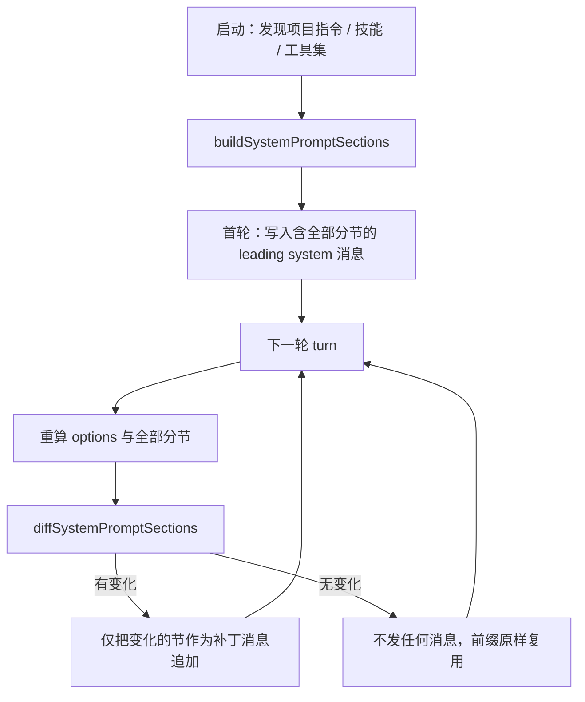
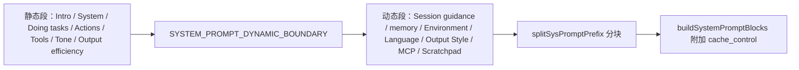

# 第 12 章：提示词与上下文注入 —— 进入循环之前，发给模型的第一坨东西怎么拼

本章回答一个此前从未被正面界定的问题：**在循环跑起来之前，那一段系统提示词与首批上下文是怎么组装出来的**。它是第 4 章（压缩）与第 9 章（Provider）共同的前提——压缩的边界单位由它决定，prompt cache 的命中率由它的顺序决定，但它本身没有被任何一章拆开看过。读完本章你能得到三样东西：四家各自的分节清单与拼接顺序、一个判断「哪些内容该固定在前面、哪些该放在后面」的判据，以及四条能直接落到自己实现里的规则。

四家最大的分歧不在「注入了什么」，而在**注入物的组织方式**：codex 把它建成一张有 16 个具名槽位的世界状态表并逐槽位做差分渲染，CC 把它切成静态段与动态段并以一个显式边界标记隔开，pi 用「具名分节 + 只发变化的那一节」把系统提示词变成了可增量打补丁的消息，dsh 则用一个整数 `order` 表把顺序从代码里抽了出来。

> **本层定位**：L0.2，启动区的第二站。逻辑位置在第 1 章之前——它产出的就是主循环的输入；在 `00` 的层次盒线图中画在 L1 之上。
>
> **前置依赖**：11（配置与凭据决定本章各来源的取值与开关）、03（工具描述如何进入模型可见面）、05（分节的载体最终落在消息模型上）
>
> **分析对象**：
> - **pi** —— `packages/coding-agent/src/core/system-prompt.ts` + `resource-loader.ts`（具名分节 + 增量补丁）
> - **deepseek-harness** —— `packages/core/system-prompt/src/index.ts`（带 `order` 的 section 注册表）
> - **codex** —— `codex-rs/core/src/context/world_state/` + `codex-rs/core/src/agents_md.rs`（世界状态 + 差分渲染）
> - **CC** —— `src/constants/prompts.ts` + `src/utils/claudemd.ts`（静态/动态边界 + 多来源记忆）
>
> **易混点**：本章的「上下文」指**构造请求时写进去的那部分文本**，不含工具结果回流（那是第 2 章）。CC 的 `src/context/` 是 React Context Provider（约 1,004 行），与提示词上下文无关；提示词语境的内容在 `src/context.ts`（189 行，单文件）。同理 pi 的 `harness/context.ts` 只是 telemetry context key。
>
> **门控提示**：CC 相关小节凡 `feature('...')` / `USER_TYPE` 包裹的代码一律标 `[门控]`，并说明「还原版可见 ≠ 发布版启用」。本章已知门控点：`CACHED_MICROCOMPACT`、`TOKEN_BUDGET`、`KAIROS`。

---

## 一、核心结论速览

1. **四家都把「分节」当作一等实体，且都靠具名槽位而非拼接顺序来保证稳定性**——codex 用 `IndexMap<&'static str, Box<dyn ErasedWorldStateSection>>`（`core/src/context/world_state/mod.rs:286`），dsh 用 `order` 整数表（`packages/core/system-prompt/src/index.ts:125`），pi 用 `SystemMessage.sections` 具名映射（`packages/ai/src/types.ts:495`），CC 用段注册 + 缓存表（`src/constants/systemPromptSections.ts:50`）。
2. **pi 与 codex 都做到了「只发变化的部分」**：pi 首轮写完整分节、之后只把变化的那一节作为补丁消息追加（`agent-session.ts:1407`）；codex 首步 `render_full`、后续步 `render_diff`（`world_state/mod.rs:398`、`:403`）。dsh 则以 append/replace 投影达成同一目的（`core/agent-loop/src/runtime-context.ts:95`）。
3. **项目指令文件的读取预算是唯一四家全都有硬上限的地方**，且数值差 32 倍：codex 32 KiB 全局共享（`config/mod.rs:250`）、dsh 单文件 1 MiB 且渲染再截到 64 KiB（`agent-instructions/src/config.ts:14`、`bundle/base/cordis.patch.yml:288`）、CC 40,000 字符**只告警不截断**（`claudemd.ts:92`）、pi **完全不截断**（`system-prompt.ts:72`）。
4. **环境探测的丰俭差异最大**：codex 注入 cwd / shell / 日期 / 时区 / 网络策略 / 文件系统权限 / 子代理清单共 7 类（`world_state/environment.rs:29`），CC 注入 cwd / 工作树标志 / 是否 git 仓库 / 平台 / shell / OS 版本 / 模型描述 / 知识截断（`prompts.ts:677`），dsh 注入时间 / 时区 / tmux 位置 / 审批策略（`context/time-context/src/index.ts:100`），**pi 只注入一个 cwd**（`system-prompt.ts:170`）。
5. **四家都不注入 git 状态到系统提示词**——CC 把它放在并行的 systemContext（`src/context.ts:96`），codex 与 pi 根本不采集。

---

## 二、本层职责与边界

### 2.1 子职责拆解

| # | 子职责 | 要回答的问题 |
|---|---|---|
| 1 | **分节建模** | 系统提示词是一个大字符串，还是一组具名片段？片段的载体数据结构是什么 |
| 2 | **顺序与优先级** | 谁在前谁在后由什么决定——代码里的书写顺序、显式的数字、还是注册时机 |
| 3 | **项目指令发现** | 从哪些目录、按什么候选名、在哪一级停止、是否继承祖先目录 |
| 4 | **环境探测** | 注入哪些运行时事实（cwd / 平台 / 时间 / git / 沙箱策略），各自来源与上限 |
| 5 | **内容预算** | 哪一类注入物有字节或 token 上限，超限是截断、拒绝还是仅告警 |
| 6 | **重算与提交时机** | 每轮重算还是首轮固定；变化时是整体重发还是只发差异 |
| 7 | **缓存前缀治理** | 怎样让不变的部分保持在请求前缀里，动态内容往哪里放 |
| 8 | **异常降级** | 文件缺失 / 过大 / 编码异常 / 探测失败时注入什么 |

### 2.2 本层不管什么

- **不管工具定义本身**。工具描述与参数 schema 走 API 的 `tools` 字段，不走提示词文本——那是第 3 章。但**工具名与单行说明会被本章引用**（pi 的 `tools` 分节、dsh 的 `TOOL_BASH` section、CC 的 `# Using your tools` 段），所以两章之间有共享面。
- **不管压缩**。压缩发生在注入之后、模型返回之前，属第 4 章。但压缩产物（摘要消息）会回到本章的承载序列里，见 4.4 的 `preservedSegment` 与第 4 章的接续关系。
- **不管权限判定**。沙箱策略与审批模式被**注入**（codex 的 `permissions` section、dsh 的 `approval:policy`），但「谁能执行什么」的判定是第 8 章。
- **不管持久化**。分节如何落盘、如何读回属第 6 章；本章只负责它在一次请求里长什么样。

### 2.3 层次定位

```
┌── 启动区（循环之前）─────────────────────────────────────────────────────────────────────────────┐
│                                                                                                  │
│                                                                                                  │
│   ┌────────────────────────────┐      ┌──────────────────────────────────────────────────────┐   │
│   │                            │      │                                                      │   │
│   │ 第 11 章  配置 · 凭据      │─────▶│ 第 12 章  提示词与上下文注入（本章）                 │   │
│   │ 启动引导                   │      │ 分节组装 · 项目指令发现 · 环境探测                   │   │
│   │                            │      │                                                      │   │
│   └────────────────────────────┘      └──────────────────────────────────────────────────────┘   │
│                                                                   │                              │
│                                                                   │ → system + 首批 input        │
│                                                                   │                              │
└───────────────────────────────────────────────────────────────────▼──────────────────────────────┘

┌── 内核区─────────────────────────────────────────────────────────────────────────────────────────┐
│                                                                                                  │
│                                                                                                  │
│   ┌───────────────────┐     ┌───────────────────────┐     ┌─────────────────────────┐            │
│   │                   │     │                       │     │                         │            │
│   │ 第 3 章 工具定义  │ ──▶ │ 第 1 章  主循环       │ ──▶ │ 第 9 章  模型调用       │            │
│   │                   │     │                       │     │                         │            │
│   └───────────────────┘     └───────────────────────┘     └─────────────────────────┘            │
│                                         │                                                        │
│                                         │ 工具结果回流 · 压缩产物回到本章重新组装                │
│                                         ▼                                                        │
│                                                                                                  │
│                                                                                                  │
└──────────────────────────────────────────────────────────────────────────────────────────────────┘
```

**图 12-1**：本章的上下游。左侧第 11 章提供取值来源（配置文件、凭据、启动开关），右侧产出的 `system + 首批 input` 就是第 1 章循环的输入；循环内第 2 章的工具结果与第 4 章的压缩产物都会回到本章的承载序列里重新参与组装，因此本章是「唯一的入口、也是每次回流后的再入口」。

---

## 三、概念对齐表

| 概念 | pi | deepseek-harness | codex | CC |
|---|---|---|---|---|
| 分节实体 | `SystemMessage.sections`（具名映射，`string \| null`） | `PromptSection`（注册表条目，带 `order`） | `WorldStateSection`（trait 对象，`IndexMap` 键控） | `systemPromptSection`（注册 + 缓存条目） |
| 顺序决定方式 | 对象字面量书写顺序 | `SECTION_ORDERS` 整数表 | `add_section` 调用序 | 返回数组字面量顺序 |
| 身份段（首段） | `preamble`（唯一不加标签的节；扩展不得占用该名，但 CLI 入参可整体替换） | `HARNESS_IDENTITY`（order `-1000`） | `base_instructions`（走顶层 `instructions` 字段，不入 input） | `getSimpleIntroSection` |
| 项目指令载体 | `project_context` 分节 | `agent-instructions` 插件 | `agents_md` section | memory（`loadMemoryPrompt`） |
| 项目指令候选名 | `AGENTS.override.md` / `AGENTS.md` / `AGENTS.MD` / `CLAUDE.md` / `CLAUDE.MD` | 由 `agent-instructions` 配置候选 | `AGENTS.md`（含 override 与 fallback 配置） | `CLAUDE.md` 系列 + `@include` |
| 环境探测分节 | `cwd`（仅一项） | 时间 / tmux / 审批策略（多个独立插件） | `environments` section（7 类字段） | `# Environment` 段 |
| 技能清单去向 | `skills` 分节（system 消息内） | user 消息末尾追加 | `host_skills` section + 延迟工具命名空间 | 不走 system prompt，走 attachment |
| 重算时机 | 每轮重算 options，仅变化时发补丁 | 每 step 重算，append/replace 投影 | 每 step 重算，先全量后差分 | 每次 `ask()` 重建，段级 memo |
| 缓存治理手段 | 分节自定界 + 整数键规避 | order 表 + 动态值置于历史尾部 | 稳定 section ID + 模型指令强制置首 | 显式边界标记 + `cache_control` 分块 |
| 项目指令超限 | 无上限 | 单文件 1 MiB / 渲染 64 KiB 截断 | 32 KiB 跨环境共享，按字节截断 | 40,000 字符仅告警 |
| 未信任项目 | 项目可信时优先项目级 prompt 文件 | authority 判定后决定可见基线 | 直接跳过读取 | 无对应物（取决于权限层） |

> 空白格表示该概念在对应项目中**没有对应物**。本表的空白极少，恰恰说明这一层是四家共识度最高的一层——差异全在实现形态而非职责划分。

---

## 四、逐项目实现

### 4.1 pi —— 具名分节 + 只发变化的那一节

> 一句话定性：把系统提示词建成一组**可独立更新的具名分节**，首轮整体写入，之后每轮只把文本发生变化的那些分节作为补丁消息追加。

#### 4.1.1 分节的数据结构

分节的载体是消息对象上的一个可选字段，注释里把语义写得很清楚：

`packages/ai/src/types.ts:494`
```ts
	/**
	 * Named, ordered prompt sections rendered verbatim after `content`. The leading message
	 * declares them; later messages replace sections by name, and `null` removes one. Keep
	 * each section self-delimiting (a tag, a heading) so the model can relate an update to
	 * the original. Avoid integer-like names; JSON objects reorder those.
	 */
	sections?: Record<string, string | null>;
```

「首条消息声明、后续消息按名替换、`null` 删除」——这一个字段同时承担了**声明**与**增量更新**两种语义。渲染时按插入顺序拼接，空串被丢弃：

`packages/ai/src/utils/text.ts:15`
```ts
export function getSystemMessageText(message: SystemMessage): string {
	const parts = [contentText(message.content)];
	for (const text of Object.values(message.sections ?? {})) {
		if (text !== null) parts.push(text);
	}
	return parts.filter((part) => part.length > 0).join("\n\n");
}
```

#### 4.1.2 组装入口与分节顺序

组装入口有四个导出函数，分三层：归一化选项、产出分节、渲染成串。

`packages/coding-agent/src/core/system-prompt.ts:121`
```ts
export function buildSystemPromptSections(input: BuildSystemPromptOptions): SystemPromptSections {
```

`packages/coding-agent/src/core/system-prompt.ts:186`
```ts
export function buildSystemPromptState(input: BuildSystemPromptOptions): {
	content: string;
	sections?: SystemPromptSections;
} {
	if (input.forceSystemPrompt !== undefined) return { content: input.forceSystemPrompt };
	return { content: "", sections: buildSystemPromptSections(input) };
}
```

`packages/coding-agent/src/core/system-prompt.ts:195`
```ts
export function buildSystemPrompt(input: BuildSystemPromptOptions): string {
	return getSystemMessageText({ role: "system", ...buildSystemPromptState(input), timestamp: 0 });
}
```

分节顺序由对象字面量的书写顺序固定，共 8 个内建槽位：`preamble`（首段文案，可被 `customPrompt` 整体替换）→ `tools`（工具名 + 单行 snippet）→ `rules`（工具与提示词指南去重后逐条）→ `docs`（pi 自身文档的三条绝对路径）→ `addendum`（`APPEND_SYSTEM.md` 或 `--append-system-prompt`）→ `project_context`（AGENTS / CLAUDE 系列原文）→ `skills`（技能三要素清单）→ `cwd`。

`packages/coding-agent/src/core/system-prompt.ts:143`
```ts
	if (customPrompt) {
		promptSections.preamble = customPrompt;
	} else {
		promptSections.preamble =
			"You are an expert coding assistant operating inside pi, a coding agent harness. You help users by reading files, executing commands, editing code, and writing new files.";
```

`packages/coding-agent/src/core/system-prompt.ts:153`
```ts
		promptSections.docs = `Pi documentation (read only when the user asks about pi itself, its SDK, extensions, themes, skills, or TUI):
- Main documentation: ${getReadmePath()}
- Additional docs: ${getDocsPath()}
- Examples: ${getExamplesPath()} (extensions, custom tools, SDK)
```

除 `preamble` 外，每一节都被同名标签包裹——这正是注释里「keep each section self-delimiting」的落地方式，也是后续补丁能被模型定位的前提：

`packages/coding-agent/src/core/system-prompt.ts:175`
```ts
	const sections: SystemPromptSections = { preamble: promptSections.preamble };
	for (const [name, content] of Object.entries(promptSections)) {
		if (name !== "preamble") sections[name] = `<${name}>\n${content}\n</${name}>`;
	}
	return sections;
```

#### 4.1.3 项目指令的发现范围

候选名是一个固定列表，优先级即列表顺序；`AGENTS.override.md` 排第一，`CLAUDE.md` 排最后，说明它对两套生态都兼容且给出显式覆盖手段。

`packages/coding-agent/src/core/resource-loader.ts:71`
```ts
function loadContextFileFromDir(dir: string): { path: string; content: string } | null {
	const candidates = ["AGENTS.override.md", "AGENTS.md", "AGENTS.MD", "CLAUDE.md", "CLAUDE.MD"];
	for (const filename of candidates) {
		const filePath = join(dir, filename);
		if (existsSync(filePath)) {
			try {
				if (!statSync(filePath).isFile()) {
					continue;
				}
				return {
					path: filePath,
					content: stripBom(readFileSync(filePath, "utf-8")),
```

注入时保留来源路径，让模型知道每条指令出自哪个文件：

`packages/coding-agent/src/core/system-prompt.ts:72`
```ts
function renderProjectContext(contextFiles: Array<{ path: string; content: string }>): string {
	return [
		"Project-specific instructions and guidelines:",
		...contextFiles.map(
			({ path, content }) => `<project_instructions path="${path}">\n${content}\n</project_instructions>`,
		),
	].join("\n\n");
}
```

#### 4.1.4 重算与提交时机

这是 pi 最有辨识度的一处。基础选项只在工具集或资源变化时重建，重建点有三处：`setActiveToolsByName`、资源发现完成、从 transcript 恢复。

`packages/coding-agent/src/core/agent-session.ts:1371`
```ts
	private _rebuildSystemPrompt(toolNames: string[]): void {
		const validToolNames = toolNames.filter((name) => this._toolRegistry.has(name));
		const toolSnippets: Record<string, string> = {};
		for (const name of this._toolRegistry.keys()) {
			const snippet = this._toolPromptSnippets.get(name);
			if (snippet) toolSnippets[name] = snippet;
		}

		const loaderSystemPrompt = this._resourceLoader.getSystemPrompt();
		const loaderAppendSystemPrompt = this._resourceLoader.getAppendSystemPrompt();
		const appendSystemPrompt = loaderAppendSystemPrompt.length > 0 ? loaderAppendSystemPrompt.join("\n\n") : "";
		const loadedSkills = this._resourceLoader.getSkills().skills;
		const loadedContextFiles = this._resourceLoader.getAgentsFiles().agentsFiles;
```

而每一轮 turn 都会重算一次 options 并做差分，只有差值非空时才产出一条补丁消息：

`packages/coding-agent/src/core/agent-session.ts:1407`
```ts
		const sections = diffSystemPromptSections(
			getCurrentSystemMessage(messages)?.sections ?? {},
			buildSystemPromptSections(options),
		);
		return sections ? { role: "system", content: "", sections, timestamp: Date.now() } : undefined;
```

`packages/coding-agent/src/core/agent-session.ts:1239`
```ts
	get systemPrompt(): string {
		return buildSystemPrompt(this._runSystemPromptOptions ?? this._baseSystemPromptOptions);
	}
```

读这条 getter 每次都重算整串，但它只服务于展示与一次性读取；真正进入请求的是分节映射，因此**跨轮的前缀稳定性由「只发差异」保证，而不是由缓存字符串保证**。

**图 12-2**：pi 的分节增量化提交时序。首轮写入完整分节，之后每轮重算全部 section，但只有文本变化的那一节才会以补丁消息形式进入序列——不变的部分天然留在前缀里。



#### 4.1.5 环境探测与预算

pi 的环境探测只有一项：cwd，且做了反斜杠归一。文档路径与技能路径属静态资源路径，不算运行时探测。

`packages/coding-agent/src/core/system-prompt.ts:170`
```ts
	promptSections.cwd = cwd.replace(/\\/g, "/");
```

项目指令与技能文本**完全不截断**——`loadContextFileFromDir` 整文件读入，`renderProjectContext` 整段拼接，没有任何长度检查。唯一相关的上限在工具输出侧，与提示词无关：

`packages/coding-agent/src/core/tools/truncate.ts:11`
```ts
export const DEFAULT_MAX_LINES = 2000;
export const DEFAULT_MAX_BYTES = 50 * 1024; // 50KB
export const GREP_MAX_LINE_LENGTH = 500; // Max chars per grep match line
```

#### 4.1.6 异常与降级

三条降级路径。**其一**，`SYSTEM.md` / `APPEND_SYSTEM.md` 类输入：路径存在但读取失败时，把**路径字符串本身**当作提示词内容返回——一个刻意保留行为的降级，而不是静默丢弃。

`packages/coding-agent/src/core/resource-loader.ts:54`
```ts
function resolvePromptInput(input: string | undefined, description: string): string | undefined {
	if (!input) {
		return undefined;
	}

	if (existsSync(input)) {
		try {
			return stripBom(readFileSync(input, "utf-8"));
		} catch (error) {
			console.error(chalk.yellow(`Warning: Could not read ${description} file ${input}: ${error}`));
			return input;
		}
	}

	return input;
}
```

**其二**，项目指令：候选逐个试，都不命中返回 `null` 静默跳过，单文件失败不阻断后续候选。**其三**，技能：解析失败产出 `warning` 诊断并跳过该技能，目录遍历整体异常被吞掉。

`packages/coding-agent/src/core/skills.ts:287`
```ts
	} catch (error) {
		const message = error instanceof Error ? error.message : "failed to read skill file";
		diagnostics.push({ type: "warning", message, path: filePath });
		return { skill: null, diagnostics };
	}
```

编码统一 `utf-8` + `stripBom`，无独立编码错误分支。

### 4.2 deepseek-harness —— 把顺序抽成一张整数表

> 一句话定性：分节顺序不是代码书写顺序，而是一张显式的 `order` 整数表；动态值被刻意放到历史尾部以保住缓存前缀。

#### 4.2.1 分节的顺序表

`packages/core/system-prompt/src/index.ts:125`
```ts
const SECTION_ORDERS = {
  HARNESS_IDENTITY: -1000,
  DEPLOYMENT_PERSONA_PREFIX: 0,
  PLAN_POLICY: 500,
  TEAM_POLICY: 600,
  PTC_ONLY: 800,
  FILE_REFERENCE: 900,
  TOOL_BASH: 1000,
```

排序规则是「先 order 升序，同 order 按名称码元序」，注释明确这是 locale 无关的确定性排序。渲染即拼接非空节：

`packages/core/system-prompt/src/index.ts:279`
```ts
export function renderPrompt(assembly: PromptAssembly): string {
  return assembly.sections
    .map(section => section.interpolate === false ? section.text : interpolate(section, assembly.variables, 'section'))
    .filter(text => text.length > 0)
    .join('\n\n')
}
```

用整数表换取的收益是**顺序可被插件声明而无需改动内核**：工具自带的指导文本自己认领 `TOOL_BASH: 1000` 这个槽位，`PLAN_POLICY` 与 `TEAM_POLICY` 各占一段，彼此不必知道对方存在。

#### 4.2.2 组装入口与提交时机

组装发生在每一步（step）之前，而不是每一轮：

`packages/core/agent-loop/src/agent.ts:266`
```ts
  private async preStep(target: InboxTarget, position: { turn: number; step: number }): Promise<PreparedStep> {
    const signal = this.phase.abort.signal
    const claimed = this.inbox.claim(target, position.turn)
    const assembly = await this.loopCtx.systemPrompt.assemble(assembleContextFor(this, signal))
    signal.throwIfAborted()
    const sections = renderContextSections(assembly)
    const context = this.runtimeContext.project(joinContextSections(sections), sections)
```

投影决策决定了变化时是追加还是替换——这是 dsh 保住前缀稳定的关键一步：

`packages/core/agent-loop/src/runtime-context.ts:95`
```ts
    if (!input.inHistory || input.startsSeries || rendered.length === 0) {
      const updates = nodes.slice(1).filter(node => node.text !== '')
        .map(node => this.replace(node.seq, ''))
      if (head.text !== rendered) updates.push(this.replace(head.seq, rendered))
      return updates
    }
    if (latest.text === rendered) return []
    return [{ message: createSystemMessage(rendered), intent: { surfaceOp: 'append' } }]
```

首轮（不在历史中）替换头部并在同系列内清空旧节；之后若内容一致则**返回空数组**，即不发任何消息。

#### 4.2.3 项目指令：基线首轮加载后按身份复用

项目指令不做每轮重读，而是把「可见基线」与一个身份标记绑定，身份不变就复用已准备的排除范围：

`packages/context/agent-instructions/src/index.ts:130`
```ts
    const visibleBaseline = visibleBaselineSource(agent, authorityMessages)
    const baselinePresent = visibleBaseline !== undefined
    const keepVisibleBaseline = visibleBaseline?.baselineIdentity === identity
    const prepared = baselinePreparations.get(agent.session)
    let excludedBaselineScopes = keepVisibleBaseline && prepared?.identity === identity
      ? prepared.excludedScopes
      : undefined
```

折叠位置也被显式约束：紧跟在本轮被认领的消息批之后，让直连提示在前、驱动追加的运行时上下文在后。

`packages/context/agent-instructions/src/index.ts:336`
```ts
    // Fold the context right after the claimed batch, so the direct prompt
    // precedes it and the driver-appended runtime context follows it.
    const lastClaimedIndex = decision.messages.findLastIndex(message => messages.includes(message))
    const entered = decision.messages.toSpliced(lastClaimedIndex + 1, 0, desired)
    return { ...decision, messages: entered }
```

#### 4.2.4 环境探测：拆成独立插件

dsh 把每一类探测做成可独立挂载的插件，四个第一方来源：时间与时区、tmux 位置、审批策略、沙箱工作区根。

`packages/context/time-context/src/index.ts:100`（`renderText`）、`packages/context/tmux-context/src/index.ts:175`（`renderState`）分别产出各自文本；审批策略则带一条把设计意图写明的注释：

`packages/interaction/user-approval/src/index.ts:160`
```ts
    // The complete current value travels after retained history, so switching
    // policy does not rewrite the stable system-prompt cache prefix.
    ctx.inject(['systemPrompt'], (scope: Context) => {
      scope.systemPrompt.context({
        name: 'approval:policy',
        order: scope.systemPrompt.getContextOrder('APPROVAL_POLICY'),
```

`cwd` 也注册为变量，但**未被任何第一方 section 引用**：

`packages/core/agent-loop/src/index.ts:370`
```ts
    ctx.systemPrompt.variable('provider', context => context.agent?.options.provider)
    ctx.systemPrompt.variable('model', context => context.agent?.options.model)
    ctx.systemPrompt.variable('cwd', context => context.agent?.session.header.cwd)
```

#### 4.2.5 内容预算：每一类注入物自带上限

这是四家中预算治理最细的一家，且**上限设在生产者侧而非组装器侧**——组装器本身不做任何截断。

项目指令单文件源码上限默认 1 MiB，超限整份忽略：

`packages/context/agent-instructions/src/config.ts:14`
```ts
const DEFAULT_MAX_SOURCE_BYTES = 1_048_576
```

`packages/context/agent-instructions/src/files.ts:344`
```ts
  if (file.size !== undefined && file.size > maxSourceBytes) return undefined
```

渲染侧再做一次字节预算，按 UTF-8 二分以避免切进码点中间：

`packages/context/agent-instructions/src/render.ts:69`
```ts
function truncateUtf8(value: string, maxBytes: number): string {
  const bytes = Buffer.from(value, 'utf8')
  if (bytes.length <= maxBytes) return value
  let end = Math.max(0, Math.trunc(maxBytes))
  while (end > 0 && (bytes.readUInt8(end) & 0xc0) === 0x80) {
    end -= 1
  }
```

装配侧的渲染上限是 64 KiB（`packages/bundle/base/cordis.patch.yml:288` 的 `maxBytes: 65536`）。技能描述默认按 500 字符截断（`packages/skill/tool-skill/src/index.ts:27`），跨会话引用按 `contextWindow * 4 * fraction` 估算字节容量、下限 64 KiB：

`packages/context/session-reference/src/index.ts:374`
```ts
    if (info.context === undefined) return DEFAULT_MAX_REFERENCE_BYTES
    // Context capacity is in tokens; four bytes/token is a sizing heuristic, not token counting.
    return Math.max(DEFAULT_MAX_REFERENCE_BYTES, Math.floor(info.context.contextWindow * 4 * this.config.referenceContextFraction))
```

#### 4.2.6 异常与降级

读取失败一律返回 `undefined` 让候选被跳过，且**区分「确认不存在」与「临时不可用」**——只有 ENOENT / ENOTDIR 才算缺失：

`packages/context/agent-instructions/src/files.ts:94`
```ts
function isMissingPathError(error: unknown): boolean {
  return error instanceof Error && 'code' in error && (error.code === 'ENOENT' || error.code === 'ENOTDIR')
}
```

单候选失败不影响同目录其它候选；单个 scope 不可用时**整组回滚**，理由是避免「缓存冷热决定转换结果」；tmux 查询失败仅告警并在当轮不注入：

`packages/context/tmux-context/src/index.ts:138`
```ts
  } catch (error: unknown) {
    const message = error instanceof Error ? error.message : String(error)
    logger.warn(`tmux location query failed: ${message}; injecting no location this turn`)
    return undefined
  }
  if (result.exitCode !== 0) return undefined
```

### 4.3 codex —— 世界状态 + 差分渲染

> 一句话定性：把提示词建成一张有稳定槽位 ID 的「世界状态」表，每一步重建全表，但只把与上一步的差值渲染进请求。

#### 4.3.1 两条并行通道

codex 的提示词不走单一路径。**顶层 `instructions`** 承载基础指令，**`input` 项**承载世界状态片段。lite 模式下基础指令降级为 input 的前缀消息：

`codex-rs/core/src/client.rs:918`
```rust
            if !prompt.base_instructions.text.is_empty() {
                let mut instructions = ContextualUserFragment::into(BaseInstructionsFragment(
                    prompt.base_instructions.text.clone(),
```

`codex-rs/core/src/client.rs:928`
```rust
            input.splice(0..0, prefix);
            (String::new(), None)
        } else {
            (
                prompt.base_instructions.text.clone(),
                Some(create_tools_raw_json_for_responses_api(&prompt.tools)?.into()),
```

基础指令的来源是会话配置，属静态常量而非环境探测：

`codex-rs/core/src/session/mod.rs:1492`（`get_prompt_base_instructions`，读 `state.session_configuration.base_instructions`）。

#### 4.3.2 世界状态的槽位表

组装入口：

`codex-rs/core/src/session/world_state.rs:34`
```rust
    #[tracing::instrument(name = "world_state.build", level = "info", skip_all)]
    pub(crate) async fn build_world_state_for_step(
        &self,
        step_context: &StepContext,
    ) -> CodexResult<WorldState> {
```

槽位容器是一个保持插入序的映射，注释写明 ID 会被写进 rollout：

`codex-rs/core/src/context/world_state/mod.rs:283`
```rust
/// Live model-visible state, keyed by the same stable section IDs used in rollouts.
#[derive(Default)]
pub(crate) struct WorldState {
    sections: IndexMap<&'static str, Box<dyn ErasedWorldStateSection>>,
}
```

`build_world_state_for_step` 内的注册顺序共 16 项，即成品的分节顺序：`model` → `context_window` → `context_window_guidance` → `realtime` → `agents_md` → `permissions` / `approved_command_prefixes` → `collaboration_mode` → `persistent_mode` → `environments` → `environments_instructions` → `apps_instructions` → `plugins_instructions` → `tools` → `host_skills` → `multi_agent_mode(+usage_hint)` → `managed_developer_instructions`（`codex-rs/core/src/session/world_state.rs:88` 起）。

其中 `host_skills` 是唯一的顺序特例——它被强制插到 `permissions` 之前，做法是找到 `permissions` 的当前下标再把新槽位插进去：

`codex-rs/core/src/context/world_state/mod.rs:375`
```rust
        let section = Box::new(ExtensionWorldStateSection(section));
        if id == "host_skills"
            && let Some(index) = self.sections.get_index_of(PermissionsState::ID)
        {
            self.sections.shift_insert(index, id, section);
        } else {
            self.sections.insert(id, section);
        }
```

这段顺序偏好没有被写成注释，只能从「找到下标再插入」这一实现读出：技能清单必须先于权限指导出现，否则模型会先看到自己能做什么、再看到有哪些专门流程可用。其余 15 个槽位一律按注册序追加。

#### 4.3.3 重算与提交：全量与差分

每一步都会重建世界状态，但只有首步发全量：

`codex-rs/core/src/session/mod.rs:4554`
```rust
        let should_inject_full_context = reference_context_item.is_none();
        let world_state = Arc::new(self.build_world_state_for_step(step_context).await?);
        // Full initial context resets the baseline; later turns persist only its changes.
        let (mut context_items, world_state_item) = if should_inject_full_context {
            let context_items = self
                .build_initial_context_with_world_state(step_context, world_state.as_ref())
```

后续步走差分，差分基于上一份快照：

`codex-rs/core/src/session/mod.rs:3643`（`record_step_world_state_if_changed`）→ `:3650`（重建）→ `:3658`（`world_state.render_diff(&previous_snapshot)`）。调用点在 turn 主循环里：

`codex-rs/core/src/session/turn.rs:504`
```rust
            world_state = sess
                .record_step_world_state_if_changed(&world_state, step_context.as_ref())
                .await?;
```

最终请求由 `build_prompt` 装配：

`codex-rs/core/src/session/turn.rs:1555`
```rust
pub(crate) fn build_prompt(
    input: Vec<ResponseItem>,
    step_context: &StepContext,
    base_instructions: BaseInstructions,
) -> Prompt {
```

#### 4.3.4 环境探测：唯一一份结构化事实表

`codex-rs/core/src/context/world_state/environment.rs:29`
```rust
#[derive(Clone, Debug, Default)]
pub(crate) struct EnvironmentsState {
    environments: BTreeMap<String, EnvironmentState>,
    shell_version: Option<String>,
    current_date: Option<String>,
    timezone: Option<String>,
    network: Option<NetworkContext>,
    filesystem: Option<FileSystemContext>,
    subagents: Option<String>,
}
```

渲染成 `<cwd>` / `<status>` / `<error>` / `<shell>` / `<shell_version>` / `<current_date>` / `<timezone>` / `<network>` / `<filesystem>` / `<subagents>` 等元素。唯一的长度上限加在错误文本上，理由写在注释里：

`codex-rs/core/src/context/world_state/environment.rs:490`
```rust
    // Bound the additional model context even when many selected environments fail.
    const MAX_ERROR_BYTES: usize = 256;
    const MAX_TOTAL_ERROR_BYTES: usize = 512;
```

平台标识与 git 状态**都不注入模型上下文**：`executor_platform_os` 只被采集（`codex-rs/core/src/environment_selection.rs:768` 的 `Some(std::env::consts::OS.to_string())`）而未被任何 fragment 渲染；git 信息只用于 rollout 与 memory 元数据（`codex-rs/core/src/turn_metadata.rs:535`）。

#### 4.3.5 项目指令：全局共享的字节预算

AGENTS.md 的发现、合并与截断集中在 `agents_md.rs`，预算**跨环境共享**，用剩余量递减：

`codex-rs/core/src/agents_md.rs:68`
```rust
    let mut remaining = config.project_doc_max_bytes;
    for turn_environment in environments.turn_environments() {
        if remaining == 0 {
            break;
```

默认值 32 KiB：

`codex-rs/core/src/config/mod.rs:250`
```rust
pub(crate) const AGENTS_MD_MAX_BYTES: usize = DEFAULT_PROJECT_DOC_MAX_BYTES; // 32 KiB
```

其余各注入物的预算都是**显式常量**，且超限策略分「截断」与「拒绝」两种：

| 注入物 | 限制 | 超限行为 |
|---|---|---|
| AGENTS.md | 32 KiB（跨环境共享） | 按字节截断并 warn |
| thread instructions | 10,000 tokens | **拒绝**（`agents_md_manager.rs:168`） |
| managed developer instructions | 10,000 tokens | 报错（`world_state/managed_developer_instructions.rs:13`） |
| memory fragment | 8,900 bytes | 常量约束（`core/src/context/memory.rs:41`） |
| multi-agent custom mode | 400 tokens | 常量约束（`world_state/multi_agent_mode.rs:13`） |
| 延迟工具命名空间 | 4 KiB + 250 字符/条目 | 常量约束（`world_state/tools.rs:12`） |
| additional_context | 1,000 tokens | 常量约束（`context-fragments/src/additional_context.rs:6`） |
| recommended plugins | 取前 50 条 | 截断（`context/recommended_plugins_instructions.rs:7`） |

#### 4.3.6 缓存治理与异常降级

缓存上有三处显式设计。**其一**，稳定 ID 是一条写在 trait 文档里的硬约定（`codex-rs/core/src/context/world_state/mod.rs:221`：`ID` is persisted in rollouts and must remain stable），它保证了新增槽位不会改动已有槽位的位置。**其二**，模型切换指令被强制置为 developer 段首：

`codex-rs/core/src/session/mod.rs:4327`
```rust
                    // New-model instructions must precede the rest of the developer context.
```

**其三**，lite 模式给基础指令生成同线程内稳定的 ID，理由写得很直白：

`codex-rs/core/src/client.rs:899`
```rust
            // These prompt-only items are rebuilt on every request. Hash their visible payloads
            // within the thread so retries and resumed sessions preserve their identity.
```

降级规则的完整语义是「未信任就根本不读」：

`codex-rs/core/src/agents_md.rs:64`
```rust
    if config.active_project.is_untrusted() {
        return Ok((!loaded.is_empty()).then_some(loaded));
    }
```

单文件层面：缺失 `continue`、超预算截断并 warn、非 UTF-8 用 `from_utf8_lossy` 容错：

`codex-rs/core/src/agents_md.rs:150`
```rust
        let mut data = match fs.read_file(&p, ReadFileOptions::default(), sandbox).await {
            Ok(data) => data,
            Err(err) if err.kind() == io::ErrorKind::NotFound => continue,
            Err(err) => return Err(err),
        };
        let size = data.len() as u64;
        if size > remaining {
            data.truncate(remaining as usize);
        }
```

`codex-rs/core/src/agents_md.rs:168`
```rust
        let text = String::from_utf8_lossy(&data).to_string();
```

刷新失败时**保留旧快照**，不覆盖已生效的指令（`codex-rs/core/src/agents_md_manager.rs:99`）；刷新发生在两条时机：会话启动（`codex-rs/core/src/session/session.rs:1442`）与每步边界（`codex-rs/core/src/session/mod.rs:3792`）。

### 4.4 CC —— 静态/动态边界与多来源记忆

> 一句话定性：用一条显式的边界标记把「可全局缓存的静态段」与「会话相关的动态段」切开，并把项目指令做成带 `@include` 的多来源合并。

#### 4.4.1 分节的返回结构

`src/constants/prompts.ts:444`
```ts
export async function getSystemPrompt(
  tools: Tools,
  model: string,
  additionalWorkingDirectories?: string[],
  mcpClients?: MCPServerConnection[],
): Promise<string[]>
```

返回的是一个**数组**，每个元素是一段；数组字面量的顺序就是最终顺序，且中间插入了缓存边界标记：

`src/constants/prompts.ts:560`
```ts
  return [
    // --- Static content (cacheable) ---
    getSimpleIntroSection(outputStyleConfig),
    getSimpleSystemSection(),
    outputStyleConfig === null ||
    outputStyleConfig.keepCodingInstructions === true
      ? getSimpleDoingTasksSection()
      : null,
    getActionsSection(),
    getUsingYourToolsSection(enabledTools),
    getSimpleToneAndStyleSection(),
    getOutputEfficiencySection(),
    // === BOUNDARY MARKER - DO NOT MOVE OR REMOVE ===
    ...(shouldUseGlobalCacheScope() ? [SYSTEM_PROMPT_DYNAMIC_BOUNDARY] : []),
    // --- Dynamic content (registry-managed) ---
    ...resolvedDynamicSections,
  ].filter(s => s !== null)
```

静态段共 7 个内建函数，动态段由注册表管理，包括：`# Session-specific guidance`、memory（`loadMemoryPrompt`）、`# Environment`（`computeSimpleEnvInfo`）、`# Language`、`# Output Style`、`# MCP Server Instructions`、`# Scratchpad Directory`、`# Function Result Clearing`（`[门控] CACHED_MICROCOMPACT`）、summarize tool results、`[门控] TOKEN_BUDGET` 的 token_budget 段、`[门控] KAIROS` / `KAIROS_BRIEF` 的 brief 段。

#### 4.4.2 边界标记的作用

`src/constants/prompts.ts:105`
```ts
/**
 * Boundary marker separating static (cross-org cacheable) content from dynamic content.
 * Everything BEFORE this marker in the system prompt array can use scope: 'global'.
 * Everything AFTER contains user/session-specific content and should not be cached.
 ...
export const SYSTEM_PROMPT_DYNAMIC_BOUNDARY =
  '__SYSTEM_PROMPT_DYNAMIC_BOUNDARY__'
```

这条标记的收益被量化在另一处注释里：**任何一个会随会话变化的条件，如果放在边界之前，都会让前缀哈希的变体数按 2 的幂增长**。

`src/constants/prompts.ts:343`
```ts
 * Session-variant guidance that would fragment the cacheScope:'global'
 * prefix if placed before SYSTEM_PROMPT_DYNAMIC_BOUNDARY. Each conditional
 * here is a runtime bit that would otherwise multiply the Blake2b prefix
 * hash variants (2^N). See PR #24490, #24171 for the same bug class.
```

**图 12-3**：CC 的静态/动态边界与缓存分层。边界标记之前的段可跨会话共享缓存，之后每段各带自己的缓存策略；MCP 段被显式标为「每轮重算」因为它可能在轮间连接或断开。



按会话变化的条件被后移到边界之后还不够——还留了一个显式的「这段不可缓存」声明。MCP 段用它把自己标成每轮重算，理由直接写成第三个实参：`'MCP servers connect/disconnect between turns'`（`src/constants/prompts.ts:513`）。

#### 4.4.3 重算与段级缓存

`ask()` 每次调用都重建整个提示词数组，但段级结果被缓存，直到 `/clear`、`/compact` 才清空：

`src/constants/systemPromptSections.ts:50`
```ts
      if (!s.cacheBreak && cache.has(s.name)) {
        return cache.get(s.name) ?? null
      }
      const value = await s.compute()
      setSystemPromptSectionCacheEntry(s.name, value)
      return value
```

调用链是：`QueryEngine.ask()` → `fetchSystemPromptParts` → `getSystemPrompt`，三路并行取回后拼接：

`src/utils/queryContext.ts:61`
```ts
  const [defaultSystemPrompt, userContext, systemContext] = await Promise.all([
    customSystemPrompt !== undefined
      ? Promise.resolve([])
      : getSystemPrompt(
          tools,
          mainLoopModel,
          additionalWorkingDirectories,
          mcpClients,
        ),
    getUserContext(),
    customSystemPrompt !== undefined ? Promise.resolve({}) : getSystemContext(),
  ])
```

最终生效的提示词要过一层优先级仲裁——自定义系统提示词会**替换**默认值，append 则附加：

`src/utils/systemPrompt.ts:41`（`buildEffectiveSystemPrompt`）。

#### 4.4.4 环境探测：主提示词里只有概览，细节在并行上下文里

`src/constants/prompts.ts:677`
```ts
  const envItems = [
    `Primary working directory: ${cwd}`,
    isWorktree
      ? `This is a git worktree — an isolated copy of the repository. Run all commands from this directory. Do NOT \`cd\` to the original repository root.`
      : null,
    [`Is a git repository: ${isGit}`],
    additionalWorkingDirectories && additionalWorkingDirectories.length > 0
      ? `Additional working directories:`
      : null,
```

随后是 `Platform`、`getShellInfoLine()`、`OS Version`、模型描述与知识截断。**git 的详细状态不在系统提示词里**，而在并行的 systemContext：

`src/context.ts:96`
```ts
    return [
      `This is the git status at the start of the conversation. Note that this status is a snapshot in time, and will not update during the conversation.`,
      `Current branch: ${branch}`,
      `Main branch (you will usually use this for PRs): ${mainBranch}`,
      ...(userName ? [`Git user: ${userName}`] : []),
      `Status:\n${truncatedStatus || '(clean)'}`,
      `Recent commits:\n${log}`,
    ].join('\n\n')
```

日期则放在 userContext（`src/context.ts:186`），并且取的是**会话启动时刻**的日期，以避免跨午夜导致缓存失效：

`src/constants/common.ts:17`
```ts
export const getSessionStartDate = memoize(getLocalISODate)
```

git status 有 2,000 字符上限（`src/context.ts:20` 的 `MAX_STATUS_CHARS`），`git log --oneline -n 5` 不截断。

#### 4.4.5 项目指令：多来源合并与三条上限

CLAUDE.md 的发现、`@include` 展开与拼接集中在 `src/utils/claudemd.ts`（1,479 行）。三条上限性质各不相同：

| 对象 | 限制 | 超限行为 |
|---|---|---|
| `CLAUDE.md` 正文 | 40,000 字符（`claudemd.ts:92`） | **仅告警**，正文不截断 |
| MEMORY.md 入口 | 200 行 + 25,000 字节（`memdir/memdir.ts:35`） | 改写为截断内容 + WARNING |
| `@include` 深度 | 5 层（`claudemd.ts:537`） | 停止展开 |

第二条的上限注释里带着线上观测数据，是这一层少见的「为什么是这个数」的说明：

`src/memdir/memdir.ts:35`
```ts
export const MAX_ENTRYPOINT_LINES = 200
// ~125 chars/line at 200 lines. At p97 today; catches long-line indexes that
// slip past the line cap (p100 observed: 197KB under 200 lines).
export const MAX_ENTRYPOINT_BYTES = 25_000
```

技能清单**不进入系统提示词**，而走 attachment，预算按上下文窗口的 1% 折算字符数：

`src/tools/SkillTool/prompt.ts:20`
```ts
// Skill listing gets 1% of the context window (in characters)
export const SKILL_BUDGET_CONTEXT_PERCENT = 0.01
export const CHARS_PER_TOKEN = 4
export const DEFAULT_CHAR_BUDGET = 8_000 // Fallback: 1% of 200k × 4
export const MAX_LISTING_DESC_CHARS = 250
```

#### 4.4.6 异常与降级

读取错误按 errno 分类处理，只有真正可动作的错误才上报：

`src/utils/claudemd.ts:402`
```ts
function handleMemoryFileReadError(error: unknown, filePath: string): void {
  const code = getErrnoCode(error)
  // ENOENT = file doesn't exist, EISDIR = it's a directory — both expected
  if (code === 'ENOENT' || code === 'EISDIR') {
    return
  }
  // Log permission errors (EACCES) as they're actionable
  if (code === 'EACCES') {
    logEvent('tengu_claude_md_permission_error', {
```

读取失败统一降级为空结果（`{ info: null, includePaths: [] }`），git 状态失败返回 `null` 而不阻断请求（`src/context.ts:104`），整套项目指令可被 `CLAUDE_CODE_DISABLE_CLAUDE_MDS` 全局关闭（`src/context.ts:165`）。**编码异常没有专门分支**——依赖 `readFile` 固定 `utf-8`，失败即落入统一 catch。

---

## 五、横向对比矩阵

### 5.1 分节的建模与顺序

| 维度 | pi | dsh | codex | CC | 共识度 |
|---|---|---|---|---|---|
| 分节载体 | 消息上的具名映射 | 注册表条目 | `IndexMap` + trait 对象 | 数组元素 + 注册表 | 4/4 都用具名/可寻址片段 |
| 顺序决定方式 | 代码书写顺序 | 显式整数 `order` 表 | `add_section` 调用序 | 数组字面量顺序 | 2/4 把顺序抽成独立数据 |
| 分节是否自定界 | 是（同名标签包裹） | 否（靠 `order` 区分） | 否（靠 section ID 区分） | 否（靠标题行区分） | 1/4 显式包裹标签 |
| 支持扩展自定义分节 | 是（禁 `preamble`） | 是（继承 `Service`） | 是（contributor） | 是（段注册） | 4/4 |
| 顺序稳定性保障 | 整数键规避重排 | locale 无关排序 | 稳定 ID 约定 | 字面量与 memo | 4/4 |

### 5.2 重算与提交时机

| 维度 | pi | dsh | codex | CC | 共识度 |
|---|---|---|---|---|---|
| 重算粒度 | 每轮 turn | 每 step | 每 step | 每次 `ask()` | 4/4 都重算，粒度不同 |
| 首轮提交方式 | 完整分节写入 leading system 消息 | 替换头部节点 | `render_full` | 完整数组 | 4/4 |
| 后续提交方式 | 只发变化的节作为补丁消息 | `append` / `replace` 投影 | `render_diff` | 段级 memo 复用 | 3/4 做到增量 |
| 无变化时行为 | 不发消息 | 返回空数组 | 差分无输出 | 命中缓存 | 4/4 明确不发 |
| 项目指令读取 | 资源发现时一次 | 首轮基线 + 身份复用 | 每步校验、启动与步边界刷新 | 会话内 memo | 4/4 都不每轮重读 |

### 5.3 内容预算

| 对象 | pi | dsh | codex | CC | 共识度 |
|---|---|---|---|---|---|
| 项目指令上限 | 无 | 单文件 1 MiB / 渲染 64 KiB | 32 KiB 跨环境共享 | 40,000 字符 | 3/4 有硬上限 |
| 超限动作 | — | 整份忽略 / 字节截断 | 字节截断 + warn | 仅告警 | 1/4 选择只告警 |
| 技能清单预算 | 无（仅字段长度校验） | 描述 500 字符 | 随 `host_skills` section | 上下文窗口 1% | 2/4 有预算 |
| 环境探测上限 | 无 | 无 | 仅错误文本 256/512 字节 | 仅 git status 2,000 字符 | 2/4 局部设限 |
| 是否按 token 计价 | 否 | 否 | 部分（多处 token 上限） | 否（1% 窗口折算字符） | 1/4 用 token |

### 5.4 环境探测的覆盖面

| 探测项 | pi | dsh | codex | CC | 共识度 |
|---|---|---|---|---|---|
| 工作目录 | 有 | 有（变量，未被引用） | 有 | 有 | 4/4 |
| 平台 / OS 版本 | — | — | —（采集但未注入） | 有 | 1/4 |
| shell / shell 版本 | — | — | 有 | 有 | 2/4 |
| 当前日期 / 时区 | — | 有 | 有 | 有（会话启动时刻） | 3/4 |
| git 状态 / 分支 | — | — | — | 有（在 systemContext） | 1/4 |
| 沙箱 / 权限策略 | — | 有 | 有 | — | 2/4 |
| 网络策略 | — | — | 有 | — | 1/4 |
| 目录结构 / 文件树 | — | — | — | — | **0/4** |

**共识度小结**

- **真正四家一致的**：分节必须可寻址、顺序必须稳定、每步/每轮重算但无变化时不重复发送、项目指令不在每轮重读。
- **分歧最大的**：① 预算与超限动作（从「完全不设限」到「32 KiB 全局共享」跨了三个数量级，超限动作从忽略/截断/告警三种都有人选）；② 环境探测的丰俭（7 类 vs 1 类）；③ 顺序是否被抽成独立数据（只有 dsh 这么做）。

---

## 六、异常与降级

| 场景 | pi | dsh | codex | CC | 源码依据 |
|---|---|---|---|---|---|
| 项目指令文件不存在 | 静默跳过，试下一候选 | 视为 absent，跳过该候选 | `continue`，试下一环境 | ENOENT 静默返回 | `resource-loader.ts:71`、`files.ts:94`、`agents_md.rs:150`、`claudemd.ts:402` |
| 项目指令文件超大 | 不处理，原样注入 | 超 1 MiB 整份忽略；否则字节截断 | 按剩余预算截断并 warn | 仅告警，正文不截断 | `system-prompt.ts:72`、`files.ts:344`、`agents_md.rs:156`、`claudemd.ts:92` |
| 读取失败（权限等） | 打 warning 并返回该路径字符串 | 返回 `undefined`，跳过候选 | 有沙箱上抛；无沙箱降级为日志 | EACCES 记事件后降级为空结果 | `resource-loader.ts:54`、`files.ts:345`、`agents_md.rs:97`、`claudemd.ts:402` |
| 非 UTF-8 内容 | 无专门分支（固定 utf-8 + stripBom） | 流式 `utf8` 读取 | `from_utf8_lossy` 容错 | 无专门分支 | `utils/text.ts:7`、`files.ts:329`、`agents_md.rs:168`、`claudemd.ts:433` |
| 项目未受信任 | 项目级 prompt 文件仅在可信时优先 | authority 判定后决定可见基线 | **直接跳过读取** | 无对应物 | `resource-loader.ts:1027`、`agent-instructions/src/index.ts:130`、`agents_md.rs:64` |
| 单个探测源失败 | 该分节为空，其余不受影响 | tmux 失败仅告警并当轮不注入；单 scope 失败整组回滚 | 环境错误文本限 256 字节 | git 失败返回 `null` 不阻断 | `system-prompt.ts:165`、`tmux-context/src/index.ts:138`、`environment.rs:490`、`context.ts:104` |
| 刷新/重读失败 | —（不重读） | 基线身份不变即复用 | **保留旧快照**，不覆盖已生效指令 | memo 未清即复用 | `agents_md_manager.rs:99`、`agent-instructions/src/index.ts:130` |
| 扩展注入非法分节名 | 抛错（拒 `preamble`） | 由注册表类型约束 | 由 section ID 类型约束 | 由注册表类型约束 | `system-prompt.ts:136` |

> **为什么 pi 在读取失败时返回「路径字符串」而不是空**：`resolvePromptInput` 的入参既可能是文件路径、也可能是字面的提示词文本（`--append-system-prompt "..."`）。这两者无法在不读取的情况下区分，因此读取失败时退回「按字面文本处理」是唯一不会静默吞掉用户意图的选择——错误仍以 warning 形式可见。
>
> **为什么 codex 对未信任项目直接不读**：指令文件是**可执行的上下文注入面**（其中的文字会直接改变模型行为），跳过读取比过滤内容更简单也更难被绕过。对比 dsh 的做法——它不是跳过，而是在 authority 判定后决定「可见基线」，即仍会读、但按权威级别决定是否对模型可见；两种取向分别把成本放在「少注入」和「多判定」上。
>
> **为什么 CC 的 40,000 字符只告警不截断**：`CLAUDE.md` 是用户自己写的项目指令，静默截断会让模型行为与用户预期不符，且用户看不到任何信号。CC 的选择是把「超长」变成可见的诊断（`/status`、`/doctor` 都会显示），把决策权交回用户。
>
> **为什么 dsh 的渲染预算按 UTF-8 二分截断而非直接切字节**：直接切字节会把一个多字节码点的前两字节留在末尾，后续任何一次拼接都会产出非法 UTF-8。代价是截断点前移最多 3 字节。

---

## 七、设计建议

### 7.1 共识（四家一致，可直接采纳）

1. **分节必须有名字，且顺序必须与代码解耦到「可预期」的程度**——四家都做到了可寻址；稳定顺序是缓存命中的前提。
2. **每轮重算，但无变化时不重复发送**。四家全部实现了这一点，只是增量粒度不同（分节 / 世界状态 / 段缓存）。
3. **项目指令不在每轮重读**。磁盘 I/O 与「同一个文件在一轮内读到两个版本」的风险都不值得承担。
4. **读取失败要留痕**。四家都会产出 warning 或事件，没有一家静默吞掉。
5. **分节要在语义上自定界**——无论用标签、标题行还是 ID，模型必须能把「更新」对应回「原文」。

### 7.2 推荐（多数做对，值得抄）

6. **把顺序抽成显式数据**（dsh 做法）。`SECTION_ORDERS` 让插件自己认领槽位而不必改内核排序代码；当分节数从 8 涨到 30，这一点会决定你还敢不敢加。
7. **把「随会话变化的条件」全部放到边界之后**（CC 做法）。CC 的注释把代价量化得很清楚：任何放在边界前的会话级条件都会让前缀哈希变体数按 2 的幂增长。
8. **给不同注入物分设预算，而不是设一个总预算**（codex 做法）。codex 的 8 个独立上限各自对应一种内容性质，比总量截断更难「吃掉」关键指令。
9. **对未信任来源的指令文件采取「先不读」**（codex 做法）。在能做内容级过滤之前，跳过读取是成本最低的防线。
10. **为缓存意图写注释**（codex 与 dsh 都做了）。`client.rs:899` 的「retries and resumed sessions preserve their identity」与 dsh 的「switching policy does not rewrite the stable cache prefix」这类注释，是后人不敢动那段代码的唯一原因。

### 7.3 权衡（各有代价，按场景选）

| 选择 | 收益 | 代价 | 适合谁 |
|---|---|---|---|
| 分节用**标签包裹**（pi） | 增量补丁可自解释，模型能定位更新 | 每节多出成对的标签字节；模型可能复述标签 | 需要长会话内多次更新分节的场景 |
| 分节**不加定界**（dsh / codex） | 省字节、结构更干净 | 更新语义靠 ID/order 承载，模型需自己对齐 | 分节稳定、很少在会话中途变更的场景 |
| 项目指令**设硬上限并截断**（codex / dsh） | 上下文可预测，不会因一个文件撑爆窗口 | 用户不知道自己的指令被切掉了 | 多环境、指令文件由平台统一管理的部署 |
| 项目指令**仅告警不截断**（CC） | 用户意图不被静默改写 | 一个 197KB 的索引文件会直接进上下文 | 单机个人使用、用户能自己维护文件 |
| 顺序用**显式整数表**（dsh） | 插件可自助认领槽位 | 多一张需要维护的全局表；order 取值需要约定 | 分节数量会持续增长的平台型产品 |
| 顺序用**书写顺序**（pi / codex / CC） | 读代码即知顺序，无需查表 | 新增分节要去改核心文件 | 分节数量收敛、扩展面不需要排序的场景 |
| 探测**尽量多**（codex） | 模型知道自己在什么环境里，少问一轮 | 每项都要维护采集与降级路径 | 沙箱、多环境、远程执行是常态的产品 |
| 探测**尽量少**（pi） | 组装路径极短，几乎不可能出错 | 模型要靠自己 `ls` / `git status` 探查 | 提示词追求最小、把探查交给工具的场景 |

### 7.4 反例（明确不该做的）

11. **不要用「拼字符串 + 条件分支」组装系统提示词而不给分节命名**。一旦需要增量更新或缓存分块，你会被迫整体重发——`sections` 这类具名字段是后补不上的结构性决定。
12. **不要把会随会话变化的内容放在缓存边界之前**。CC 用 `2^N` 变体描述了这个后果；这不是性能优化问题，是命中率归零问题。
13. **不要在组装器里做统一截断**。四家中只有 dsh 在组装器侧做了渲染预算，但它仍然把「单文件源码上限」前置到发现阶段——统一截断会让「是哪一条指令被吃掉了」变得不可定位。
14. **不要为「服务端缓存是否过期」引入时间触发而不把它写清楚**。dsh 与 CC 都把与缓存相关的时间取值固化在会话启动时刻（`getSessionStartDate` 为 `memoize`），目的是让同一会话内前缀不变；若改成每次取当前时间，缓存会以分钟为粒度失效。
15. **不要把探针结果直接渲染成自由文本**。codex 的 `<cwd>` / `<shell>` / `<timezone>` 元素化渲染与 CC 的 `envItems` 列表，都保证了同一事实在每轮渲染出的字节完全一致——这是前缀稳定的必要条件。

---

## 附录：关键文件索引

### pi

| 文件 | 职责 | 行数 |
|---|---|---|
| `packages/coding-agent/src/core/system-prompt.ts` | 分节组装、规则拼装、分节差分 | 216 |
| `packages/coding-agent/src/core/resource-loader.ts` | 项目指令发现、SYSTEM.md / APPEND_SYSTEM.md 发现、技能与模板加载编排 | 1101 |
| `packages/coding-agent/src/core/skills.ts` | SKILL.md 发现、校验与 `formatSkillsForPrompt` | 509 |
| `packages/coding-agent/src/core/agent-session.ts` | 选项重建（`_rebuildSystemPrompt`）与每轮差分（`_preparePromptAndToolLoadout`） | 实测见 `:707` / `:1371` / `:1407` |
| `packages/ai/src/types.ts` | `SystemMessage.sections` 类型与语义注释 | 实测见 `:494` |
| `packages/ai/src/utils/text.ts` | 分节渲染为字符串 | 41 |
| `packages/ai/src/utils/transcript.ts` | leading system 消息的创建与重放 | 235 |
| `packages/agent/src/harness/prompt-templates.ts` | 提示词模板加载与 frontmatter 解析 | 270 |
| `packages/agent/src/harness/runtime/drive/generation.ts` | harness 侧进入生成前解析 `systemPrompt` | 302 |
| `packages/coding-agent/src/core/cache-warmer.ts` | prompt cache 保活（TTL 与重放） | 实测见 `:34` |

### deepseek-harness

| 文件 | 职责 | 行数 |
|---|---|---|
| `packages/core/system-prompt/src/index.ts` | section / context / tool / variable 注册表与 `assemble` / `renderPrompt` | 638 |
| `packages/core/agent-loop/src/agent.ts` | `preStep` 组装入口与 `buildRequest` | 647 |
| `packages/core/agent-loop/src/runtime-context.ts` | system prompt 的 append / replace 投影决策 | 164 |
| `packages/context/agent-instructions/src/index.ts` | 项目指令注入编排与折叠位置 | 360 |
| `packages/context/agent-instructions/src/files.ts` | 发现、上溯、有界读取与去重 | 530 |
| `packages/context/agent-instructions/src/render.ts` | 字节预算渲染与 UTF-8 安全截断 | 361 |
| `packages/context/agent-instructions/src/config.ts` | 候选名与预算默认值 | 123 |
| `packages/context/time-context/src/index.ts` | 时间与时区注入 | 229 |
| `packages/context/tmux-context/src/index.ts` | tmux 位置注入 | 275 |
| `packages/context/session-reference/src/index.ts` | 跨会话引用快照与预算 | 472 |
| `packages/skill/tool-skill/src/index.ts` | 技能目录注入与描述截断 | 431 |
| `packages/preset/persona/src/index.ts` | 每 agent persona 行 | 75 |
| `packages/interaction/user-approval/src/index.ts` | 审批策略注入与缓存前缀注释 | 实测见 `:160` |

### codex

| 文件 | 职责 | 行数 |
|---|---|---|
| `codex-rs/core/src/session/world_state.rs` | 世界状态构建与 16 个 section 的注册顺序 | 295 |
| `codex-rs/core/src/context/world_state/mod.rs` | `WorldState` / `WorldStateSection` 与全量/差分渲染 | 556 |
| `codex-rs/core/src/context/world_state/environment.rs` | 环境探测与元素化渲染 | 557 |
| `codex-rs/core/src/context/world_state/agents_md.rs` | 项目指令状态与替换/移除通知 | 84 |
| `codex-rs/core/src/context/world_state/permissions.rs` | 权限指令状态 | 131 |
| `codex-rs/core/src/context/world_state/tools.rs` | 延迟工具命名空间（4 KiB 预算） | 170 |
| `codex-rs/core/src/context/world_state/model.rs` | 模型切换指令 | 65 |
| `codex-rs/core/src/agents_md.rs` | AGENTS.md 发现、合并、预算与截断 | 563 |
| `codex-rs/core/src/agents_md_manager.rs` | 刷新序列化与 token 校验 | 183 |
| `codex-rs/core/src/context/environment_context.rs` | 文件系统与网络渲染、XML 转义 | 243 |
| `codex-rs/core/src/context/memory.rs` | memory fragment（8,900 字节上限） | 43 |
| `codex-rs/context-fragments/src/fragment.rs` | `ContextualUserFragment` trait | 135 |
| `codex-rs/context-fragments/src/additional_context.rs` | 外部上下文片段（1,000 tokens 上限） | 102 |
| `codex-rs/prompts/src/model_instructions.rs` | 由模型目录渲染基础指令模板 | 21 |
| `codex-rs/prompts/src/permissions_instructions.rs` | 权限指令组装 | 402 |
| `codex-rs/core/src/client.rs` | `instructions` 与 input 的最终编码、稳定 ID 与 prompt cache key | 实测见 `:571` / `:898` |
| `codex-rs/core/src/session/mod.rs` | 初始与增量上下文渲染、基础指令来源、刷新时机 | 实测见 `:1492` / `:3643` / `:4554` |
| `codex-rs/core/src/session/turn.rs` | `build_prompt` 与每步组装调用 | 实测见 `:504` / `:1555` |

### CC

| 文件 | 职责 | 行数 |
|---|---|---|
| `src/constants/prompts.ts` | 主组装：静态段函数、`getSystemPrompt`、环境信息计算、边界标记 | 914 |
| `src/constants/systemPromptSections.ts` | 段注册与缓存（`systemPromptSection` / `DANGEROUS_uncachedSystemPromptSection`） | 68 |
| `src/utils/systemPrompt.ts` | `buildEffectiveSystemPrompt` 优先级仲裁 | 123 |
| `src/constants/common.ts` | `getSessionStartDate`（memoize）与本地日期工具 | 33 |
| `src/constants/cyberRiskInstruction.ts` | 网络安全指令常量 | 24 |
| `src/constants/outputStyles.ts` | 输出风格配置与记忆化读取 | 216 |
| `src/utils/claudemd.ts` | CLAUDE.md / `@include` / rules 的发现、解析与拼接 | 1479 |
| `src/memdir/memdir.ts` | `loadMemoryPrompt` 与入口上限 | 实测见 `:35` |
| `src/context.ts` | `getUserContext` / `getSystemContext` / `getGitStatus` | 189 |
| `src/utils/queryContext.ts` | `fetchSystemPromptParts`（三路并行取回） | 179 |
| `src/utils/api.ts` | `splitSysPromptPrefix` 分块与前后缀附加 | 实测见 `:321` |
| `src/services/api/claude.ts` | `toolToAPISchema` 与 `buildSystemPromptBlocks` 的 `cache_control` 落地 | 实测见 `:1235` / `:3228` |
| `src/tools/SkillTool/prompt.ts` | 技能清单渲染与字符预算 | 241 |
| `src/tools.ts` | 工具统一注册表 | 实测见 `:193` / `:271` / `:345` |

---

*本章为启动区第二篇；第 11 章提供取值来源，第 13 章将回答「能力从哪来」——即 MCP 与外部工具接入。*
