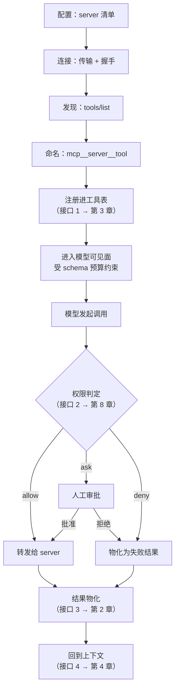

# 第 13 章：MCP 与外部能力接入 —— 能力除了内建的，还从哪来

本章回答内核之外最近的一层：模型能调用的工具，除了本体自带的那些，**还从哪来、怎么进来、进来之后受不受同一套管束**。它是第 3 章与第 10 章共同悬置的前提——第 3 章把 MCP 写进「工具的 5 类来源」，第 10 章把接入细节整段指给了本章，两处都只给了名字，没给界定。读完本章你能得到三样东西：四家在这一层上的形态谱（含一家明确不做的立场）、一套判断「外部能力该被当作扩展还是当作能力」的判据，以及五条可直接落地的规则。

四家最大的分歧不在「怎么接」，而在**接不接、接多重**：pi 零实现并在文档里正面拒绝，dsh 用约 1,426 行实现配 3,800 行一致性测试，CC 用 16,250 行覆盖 8 种传输与 7 种配置作用域，codex 用两个 crate 共 59,175 行自建 OAuth 与企业授权——四家的投入跨越两个数量级。这个跨度本身就是结论：**MCP 不是一个「要不要支持」的功能开关，而是一次关于「内核该多小」的架构表态**。

> **本层定位**：L11，外围区的第一站，也是离内核最近的一层。它向内接第 3 章的工具定义、第 8 章的权限链、第 10 章的扩展单位，向外接第 11 章的配置与凭据。
>
> **前置依赖**：03（外部工具如何进入模型可见投影）、08（外部工具是否复用同一条判定链）、10（MCP server 能不能算一个扩展单位）
>
> **分析对象**：
> - **pi** —— 无实现（`README.md:537` 正面声明 `No MCP.`；替代路径是扩展与包机制）
> - **deepseek-harness** —— `packages/mcp/mcp-client` + `packages/mcp/mcp-resources`（一个插件一条连接）
> - **codex** —— `codex-rs/rmcp-client`（34,888 行）+ `codex-rs/codex-mcp`（24,287 行）
> - **CC** —— `src/services/mcp/`（12,311 行）+ `src/components/mcp/`（3,939 行）
>
> **跨层联动**：11 —— 见 4.3.6 与 4.4.6。凭据（OAuth token 的存储位置、刷新所有者、企业 IdP）在物理上落在配置层，但它的生命周期由本层的连接管理驱动；两章共享同一份存储契约，谁先写都必须在另一章对齐口径。同一份 `services/mcp` 目录在反方向还有一次出场：**15** —— 见第 15 章 4.4.8，那边是「别的 MCP 客户端来调用它」（见 2.2 末条）。
>
> **易混点**：本章的「能力」指**模型可调用的外部工具与资源**，不含本体内建工具（第 3 章）。MCP 在本层被当作一个整体看待；第 10 章只把 MCP server 计作「一种扩展单位」来数，两章的切分口径不同，见 2.2。
>
> **门控提示**：CC 相关小节凡 `feature('...')` 包裹的代码一律标 `[门控]`，并说明「还原版可见 ≠ 发布版启用」。本章已知门控点：`MCP_SKILLS`（`client.ts:117`、`:1392`）、`CHICAGO_MCP`（`client.ts:241`、`:245`、`:926`）、`KAIROS` / `KAIROS_CHANNELS`（`useManageMCPConnections.ts:473`）。

---

## 一、核心结论速览

1. **这一层最大的分歧是「做不做」，不是「怎么做」**：pi 的实现为 0 行，`README.md:537` 直书 `No MCP.` 并给出理由链接，`docs/usage.md:310` 声明「有意不内置」；其余三家的实现体量跨两个数量级——dsh 1,426 行、CC 16,250 行、codex 59,175 行。[代码]
2. **四家都把外部工具收进同一条调度链，但「同一」的成色不同**：codex 与 dsh 是**结构性同一**（MCP 工具经既有的工具注册表与审批动作类型进入，`mcp_tool_exposure.rs:142`、`tools.ts:150`），CC 是**规则层同一**（靠 `mcpInfo` 让 allow / deny / ask 三类规则对 MCP 等价生效，`permissions.ts:238-269`），pi 无此层。[代码]
3. **命名空间前缀四家形态一致，上限与碰撞策略完全不同**：都产出 `mcp__<server>__<tool>`；长度上限 codex 128（`tools.rs:226`）、dsh 64（`tools.ts:48`），CC 不设名字上限、只把描述截到 2048（`client.ts:218`）；碰撞时 codex 追加 12 位哈希续试，dsh **整代回滚**（`tools.ts:146-160`），CC 在 skip-prefix 模式下允许 MCP 工具覆写内建名（`client.ts:1760-1773`）。[代码]
4. **凭据是四家分化最陡的一节**：codex 与 CC 各有一整套 OAuth（codex 落 keyring 并回退文件，CC 落 keychain 并回退 0600 明文），且各自把「企业授权」做成独立协议——codex 的 EMA（`mcp_ema.rs:29`）与 CC 的 XAA（`xaa.ts:1-17`）；dsh 完全没有 OAuth，只有静态 `env` / `headers` 注入；pi 无此层。[代码]
5. **「外部能力不可用不应拖垮内核」是三家共识**：codex 默认把启动失败降级成事件、只有显式 `required = true` 才阻断（`required.rs:15`），dsh 默认 `failOnStartupError: false`（`index.ts:128`），CC 把失败收敛为 `failed` 状态并清空该 server 的工具表。[代码][注释]

---

## 二、本层职责与边界

### 2.1 子职责拆解

| # | 子职责 | 要回答的问题 |
|---|---|---|
| 1 | **配置来源与作用域** | server 清单从哪读、有几级作用域、谁覆盖谁、能否被企业策略锁死 |
| 2 | **传输层** | 支持几种 transport；stdio 子进程由谁起、继承什么环境、是否走沙箱 |
| 3 | **握手与能力协商** | 协议版本如何声明与协商、client 声明哪些 capability、扩展能力如何受信 |
| 4 | **工具发现与命名空间** | 工具列表如何拉取、是否分页、名字如何加前缀与去重、超限如何截断 |
| 5 | **调用链接入** | 外部工具如何进入工具表、是否与内建工具共用同一个调度器与审批动作 |
| 6 | **凭据与授权** | token 存哪、谁负责刷新、如何注入请求头、企业 IdP 如何换 token |
| 7 | **生命周期与重连** | 连接状态机、启动失败的降级、断线重连的退避与上限、工具表如何换代 |
| 8 | **反向能力** | server 能反向做什么——resources / prompts / elicitation / 日志 / 订阅 |

### 2.2 本层不管什么

- **不管工具定义本身的形态**。外部工具的参数 schema、描述如何投影给模型，属第 3 章。本章只回答「它从哪来」，以及**来源本身带来的额外约束**——命名前缀、名字长度上限、描述截断、重名仲裁，这四件事都由来源决定而不是由工具定义决定。
- **不管权限判定算法**。本章只回答「外部工具是否进入同一条判定链」以及「进入点在哪」；判定链内部（规则表达、决策顺序、沙箱落地）属第 8 章。四家的答案见 5.4，其中 codex 与 CC 的差别值得单独看。
- **不管扩展机制的通用形态**。一个 MCP server 在四家里都表现为「能注册工具的外部单元」，但**它是否被画成扩展单位**是第 10 章的问题。第 10 章已经记下了一处跨章口径分歧：codex 把 `McpTool { server, tool, input, ... }` 做成 hook 处理器的一个变体（`config/src/hook_config.rs:161-201`），CC 却只认 bash / prompt / agent / http 四类 handler（`src/schemas/hooks.ts:176-189`）。本章补上另一半事实：codex 之所以能把 MCP 写进 hook 处理器，是因为它的 MCP 工具在工具表里就是普通的 external handler（见 4.3.5）；而 CC 之所以不认，是因为它的 hook 是**事件处理器**、MCP 是**工具来源**，两者在它那里的抽象层不同层（见 4.4.1）。
- **不管凭据的存储实现细节**。token 存在 keyring / keychain 还是文件、文件权限位怎么设，属第 11 章；本章只界定**谁在什么时机读写它**，以及凭据失效时本层怎么降级。
- **不管 server 内部的实现**。server 是第三方进程或远端服务，它的行为不在本系列范围内；本章只研究**客户端侧**的接入机制。
- **不管「它自己反过来当 MCP server」**（那是 L13，见第 15 章 4.4.8）。CC 的 `claude mcp serve` 把它自己的工具暴露给外部 MCP 客户端，走的是同一个协议、同一份 `services/mcp` 目录。判据不是「用没用 MCP 协议」，而是**谁发起连接**：本章全部内容都是「它作为 MCP 客户端去连别人的 server」，反向那一条归第 15 章。

### 2.3 层次定位

```
┌─── 上游 ───────────────────────────────────────────────────────────────────────────────┐
│  L0.1  配置 · 凭据与启动引导（第 11 章）                                               │
│  server 清单 · 环境变量 · OAuth token 存储 · 企业托管策略                              │
└────────────────────────────────────────────┬───────────────────────────────────────────┘
                                             │ 配置 + 凭据
                                             ▼
┌─── L11  MCP 与外部能力接入（本章） ────────────────────────────────────────────────────┐
│                                                                                        │
│    ① 配置来源   ─▶   ② 传输层   ─▶   ③ 握手与能力协商   ─▶   ④ 工具发现与命名          │
│                                                                  │                     │
│    ⑧ 反向能力   ◀─   ⑦ 生命周期  ◀─   ⑥ 凭据与授权     ◀─   ⑤ 调用接入                 │
│                                                                                        │
└────────────────────────────────────────────┬───────────────────────────────────────────┘
                                             │ 注册为普通工具 · 复用同一条调度与审批链
                                             ▼
┌─── 下游 ───────────────────────────────────────────────────────────────────────────────┐
│  第 3 章 工具定义          第 2 章 工具调度          第 8 章 权限与沙箱                │
│  外部 schema 如何投影      一条调用如何走完          审批链与沙箱边界                  │
└────────────────────────────────────────────────────────────────────────────────────────┘
```

**图 13-1**：本层的位置与内部八环节。与内核十章不同的是，**本层的入口在配置层而不是在循环里**——它是在循环启动之前就完成的装配，此后循环每轮看到的只是一张已经注册好的工具表。这也解释了为什么第 3 章把 MCP 写成「工具的来源之一」却没有展开：来源的准备工作发生在本层，而工具定义只关心结果。

四家的骨架差异集中在三处：**有没有这一层**、**一层装几条连接**、**协商与凭据自己写还是交给库**。

```
┌─────────────┬────────────────┬────────────────┬────────────────┬────────────────┐
│ 项目        │  pi            │  dsh           │  codex         │  CC            │
├─────────────┼────────────────┼────────────────┼────────────────┼────────────────┤
│ 实现形态    │  无（0 行）    │  packages/mcp  │  两个 crate    │  services/mcp  │
├─────────────┼────────────────┼────────────────┼────────────────┼────────────────┤
│ 配置来源    │  无（扩展自定）│  cordis 插件   │  config.toml   │  .mcp.json 等  │
├─────────────┼────────────────┼────────────────┼────────────────┼────────────────┤
│ 传输        │  -             │  stdio / http  │  6 种（含 PTY）│  8 种          │
├─────────────┼────────────────┼────────────────┼────────────────┼────────────────┤
│ 命名上限    │  -             │  64            │  128           │  无上限        │
├─────────────┼────────────────┼────────────────┼────────────────┼────────────────┤
│ 凭据        │  -             │  env / headers │  OAuth + EMA   │  OAuth + XAA   │
├─────────────┼────────────────┼────────────────┼────────────────┼────────────────┤
│ 启动失败    │  -             │  不阻断        │  不阻断        │  不阻断        │
└─────────────┴────────────────┴────────────────┴────────────────┴────────────────┘
```

**图 13-2**：四家骨架。**「不阻断」这一行是真正的共识**——三家都选择让外部能力失败只影响自己，唯一的例外需要显式声明（codex 的 `required = true`）。而「命名上限」这一行的差别说明：CC 把外部工具当成**内建工具的同类**（所以沿用同一套命名，不额外设界），codex 与 dsh 把它当成**受约束的外来物**（所以要设界并定义超限行为）。

---

## 三、概念对齐表

| 概念 | pi | deepseek-harness | codex | CC |
|---|---|---|---|---|
| 本层的实体 | 无 | Cordis 插件（`McpClient`）+ 作用域服务（`McpResourceRuntime`） | `McpConnectionSet`（连接集）+ `McpServerRegistration` / `ResolvedMcpCatalog`（登记项与解析后目录） | `MCPServerConnection`（5 态 union） |
| 配置载体 | 无（核心 settings 无 `mcp` 字段，`settings-manager.ts:110-163`） | `cordis.yml` 的插件 `config`（每行一个 server，`index.ts:119-135`） | `config.toml` 的 `[mcp_servers]`（`config_toml.rs:290`） | `.mcp.json` 等 7 种 `ConfigScope`（`types.ts:10-20`） |
| 来源仲裁 | 无 | 无仲裁：一个插件实例一条连接 | 5 类来源 + 优先级枚举（`catalog.rs:70-83`、`:115`） | 3 套优先级链 + 企业独占（`config.ts:1231-1238`、`:1082-1096`） |
| 传输类型 | 无 | stdio / streamable-http（`transport.ts:31-45`） | 6 种（stdio 有 Legacy 与 2026 两种分帧，另含 in-process、executor、事件流、HTTP） | 8 种（stdio / sse / sse-ide / http / ws / ws-ide / sdk / claudeai-proxy） |
| stdio 子进程 | 无 | 由官方 SDK 起；只复用环境擦洗函数（`transport.ts:21-23`） | 由 `codex_utils_pty::Command` 起，独立进程组 + 仅 stdio 描述符（`stdio_server_launcher.rs:281-291`） | 由官方 SDK 的 `StdioClientTransport` 起，继承 `subprocessEnv()`（`client.ts:944-958`） |
| 协议版本策略 | 无 | 交给 SDK 自动协商（`connection.ts:261-262`） | 显式两态开关 `McpProtocolMode`（`protocol_mode.rs:9-34`） | 完全不声明，交给 SDK 默认 |
| client capabilities | 无 | 空 `{}`（`connection.ts:261`） | elicitation + 4 个受信扩展（`rmcp_client.rs:1100-1113`） | roots + elicitation（`client.ts:994-1000`） |
| 工具命名 | 无 | `mcp__<server>__<tool>`（`tools.ts:82`） | `mcp__<server>__<tool>`（`mcp/mod.rs:83-87`、`tools.rs:22`） | `mcp__<server>__<tool>`（`mcpStringUtils.ts:50-52`） |
| 名字长度上限 | 无 | 64（`tools.ts:48`） | 128（`tools.rs:226`） | 无 |
| 描述截断 | 无 | 不截断（`tools.ts:134`） | namespace 描述 ≤ 512 KiB、agent plugin ≤ 1,000 B（`handlers/mcp.rs:48-49`） | 2,048 字符，只截送给模型的那份（`client.ts:218`、`:1789-1794`） |
| 分页 | 无 | 交给 SDK 聚合（`tools.ts:123`） | 自建上限：100 页 / 2,048 条（`pagination.rs:9-11`） | **无**（不消费 cursor） |
| 调用链归口 | 无 | 统一 `ctx.tools.register`（`tools.ts:150`） | 工具表 + 一等审批动作（`mcp_tool_exposure.rs:142`、`mcp_tool_call.rs:1536`） | 规则匹配层（`permissions.ts:238-269`） |
| 凭据处理 | 无 | 静态 `env` / `headers`（`transport.ts:37`、`:43`） | keyring + 文件回退 + OAuth + 企业 EMA（`oauth.rs:92`、`mcp_ema.rs:29`） | SecureStorage + OAuth + XAA（`auth.ts:1376`、`xaa.ts:1-17`） |
| 重连退避 | 无 | 500 ms 起、30 s 封顶、10 次（`connection.ts:41-46`） | 1 s 起、30 s 封顶，且只对内置 `codex_apps` 生效（`rmcp_client.rs:106-107`） | 1 s 起、30 s 封顶、5 次，且只对非 stdio / 非 sdk（`useManageMCPConnections.ts:88-90`、`:356`） |
| 启动失败默认 | 无 | 不阻断（`index.ts:128`） | 不阻断，除非 `required`（`required.rs:15`） | 不阻断（置 `failed` 并清空工具） |
| 反向 elicitation | 无 | 不支持 | 三层（标准 / form 扩展 / 设备验证） | 支持，走对话框 + hooks |
| resources | 无 | 支持（三个共享工具） | 支持（含分页收集） | 支持（不支持订阅） |
| prompts | 无 | 不支持 | 不支持（见 5.7） | 支持，转成 Command |

> 空白格表示该概念在对应项目中**没有对应物**。pi 一列整体为空，这本身就是本章最重要的一条结论——但它是**有意的空位**，不是遗漏，依据见 4.1。

---

## 四、逐项目实现

### 4.1 pi —— 用「不做」回答，用扩展层替代

> 一句话定性：pi 没有 MCP 层，且这是**文档化的架构决定**而非缺口；它给出的替代路径是「扩展 + 包机制 + 外部工具」，即把这一层整体推给生态。

#### 4.1.1 反证：零实现的实测证据

「某项目没有某功能」这类断言必须先给出反证，否则无法与「搜索没找到」区分。对 pi 的 `packages/` 全目录按四种模式搜索（均排除 `node_modules`）：

- `mcpServers` —— **0 命中**；
- `ModelContextProtocol` —— **0 命中**；
- 忽略大小写的 `mcp` —— **23 行命中、分布在 15 个文件**，逐条判定后**没有一行是 MCP 实现**。其中：2 行是 `highlight.min.js` 的 C 关键字表与提示词表（含 `memcmp` / `memcpy`）；3 行是三份 C 源码里的 `memcpy` 调用（`tui/native/clipboard.h:54`、`tui/native/linux/src/linux-platform-x11.c:47`、`tui/test/fixtures/clipboard-worker-test.c:30`）；8 行落在 4 个二进制文件内（两份 darwin prebuild、一份 linux prebuild、一张 png，均为字节巧合）；1 行落在一条 base64 签名串内（`coding-agent/test/fixtures/before-compaction.jsonl:871`）；1 行是 Anthropic OAuth scope 串 `user:mcp_servers`（`packages/ai/src/auth/oauth/anthropic.ts:37`）；余下 8 行是文档或字面量引用——`coding-agent/README.md:433` 与 `:537`（后者即下面引到的 **No MCP.** 声明）、`coding-agent/docs/usage.md:310`、`agent/docs/pico/v3/view-and-events.md:349` 的 `ThreadItem::McpToolCall`、`coding-agent/src/utils/tool-result-images.ts:17` 的注释、`coding-agent/test/settings-manager-bug.test.ts:45` / `:52` / `:53` 里的包名字符串 `npm:pi-mcp-adapter`；
- `@modelcontextprotocol/sdk` —— **4 行命中，全部落在两份锁文件里**（根 `package-lock.json:1200`、`:1203` 与 `packages/coding-agent/install-lock/package-lock.json:942`、`:945` 各两行），且来源是无关的传递依赖：`@google/genai` 把它声明为可选 peer（`package-lock.json:1200-1206`、`install-lock/package-lock.json:941-947`）。

`packages/coding-agent/src` 下与 MCP 相关的实质内容只有一条注释：

`packages/coding-agent/src/utils/tool-result-images.ts:16-18`
```ts
 * The `read` tool and `@file` CLI attachments run their images through `processImage`, but tools
 * that produce images themselves (extensions, MCP bridges, screenshot tools) hand back arbitrary
 * base64 payloads that go straight into session history and every subsequent provider request.
```

即：**pi 的核心源码里没有 MCP 的 handler、类型、配置解析或 SDK 调用**。

#### 4.1.2 立场原文与替代路径

pi 把这件事写进了两份文档，措辞是主动拒绝而不是「暂未支持」：

`packages/coding-agent/README.md:537`
```markdown
**No MCP.** Build CLI tools with READMEs (see [Skills](#skills)), or build an extension that adds MCP support. [Why?](https://mariozechner.at/posts/2025-11-02-what-if-you-dont-need-mcp/)
```

`packages/coding-agent/docs/usage.md:310`
```markdown
It intentionally does not include built-in MCP, sub-agents, permission popups, plan mode, to-dos, or background bash. You can build or install those workflows as extensions or packages, or use external tools such as containers and tmux.
```

值得注意的是同一份 README 的**扩展能力清单里单独列了一行 MCP**：

`packages/coding-agent/README.md:433`
```markdown
- MCP server integration
```

两条并不矛盾，合起来才是完整立场：**核心不做 MCP，但扩展机制要能做到 MCP**。这与第 10 章记下的 pi 扩展机制形态一致——它给扩展留了 11 个生命周期回调与 10 个 `register*`，注册工具是其中一项：

`packages/coding-agent/src/core/extensions/types.ts:1425-1428`
```ts
	/** Register a tool that the LLM can call. */
	registerTool<TParams extends TSchema = TSchema, TDetails = unknown, TState = any>(
		tool: ToolDefinition<TParams, TDetails, TState>,
	): void;
```

注册的运行时实现会做两件事：要求参数 schema 必须是对象，然后刷新工具表（不是就地修改，而是重建）：

`packages/coding-agent/src/core/extensions/loader.ts:273-285`
```ts
		registerTool(tool: ToolDefinition): void {
			assertActive();
			if (typeof tool.parameters !== "object" || tool.parameters === null || Array.isArray(tool.parameters)) {
				throw new Error(
					`Tool "${tool.name}" registered by extension "${extension.path}" must define an object parameter schema.`,
				);
			}
			extension.tools.set(tool.name, {
				definition: tool,
				sourceInfo: extension.sourceInfo,
			});
			runtime.refreshTools();
		},
```

**外部工具与内建工具在 pi 里走的是两条不同的类型路径**——内建工具的 `ToolName` 是一个 8 项字面量联合，外部工具只是个 `string`：

`packages/coding-agent/src/core/tools/index.ts:95`
```ts
export type ToolName = "read" | "bash" | "powershell" | "edit" | "write" | "grep" | "find" | "ls";
```

这个联合不进外部工具表；扩展注册的工具经 `extension.tools` 汇聚，合并规则是**首次注册者胜**：

`packages/coding-agent/src/core/extensions/runner.ts:586-596`
```ts
	/** Get all registered tools from all extensions (first registration per name wins). */
	getAllRegisteredTools(): RegisteredTool[] {
		const toolsByName = new Map<string, RegisteredTool>();
		for (const ext of this.extensions) {
			for (const tool of ext.tools.values()) {
				if (!toolsByName.has(tool.definition.name)) {
					toolsByName.set(tool.definition.name, tool);
				}
			}
		}
		return Array.from(toolsByName.values());
	}
```

#### 4.1.3 若要自己接：三个可用挂点与两个硬缺口

一个 pi 的 MCP 适配扩展需要的最小能力集，pi 都提供了对应挂点：

| 需要的能力 | pi 的挂点 | 锚点 |
|---|---|---|
| 注册动态工具（每个 MCP tool 一个） | `pi.registerTool(...)` | `extensions/types.ts:1426` |
| 改写工具入参 | `on("tool_call", ...)`，`event.input` 可原地改 | `extensions/types.ts:1026` |
| 改写工具结果 | `on("tool_result", ...)` | `extensions/types.ts:1417` |
| 起子进程 | `pi.exec(command, args, options)` | `extensions/types.ts:1515` |
| 访问配置 | `registerFlag` / `getFlag` | `extensions/types.ts:1447` |
| 会话内持久状态 | `appendEntry<T>(customType, data?)` | `extensions/types.ts:1499` |

但有两个硬缺口，都是读取这一层时最容易忽略的：

**缺口一：`pi.exec` 不足以驱动 MCP 的 stdio 长连接。** 它的实现是一次性的——`stdio` 由 `["ignore", "pipe", "pipe"]` 构成，stdin 被丢弃，函数在收齐输出后 resolve，不返回常驻句柄：

`packages/coding-agent/src/core/exec.ts:41-45`
```ts
		const proc = spawn(command, args, {
			cwd,
			shell: false,
			stdio: ["ignore", "pipe", "pipe"],
		});
```

MCP 的 stdio 传输需要双向长连接与持续的读写循环，`stdio: "ignore"` 的 stdin 直接排除了这条路。因此 MCP 适配扩展必须绕过 `pi.exec`（`packages/coding-agent/src/core/tools/bash.ts:96` 走的是原生 `child_process.spawn`，且它是工具实现而非扩展 API）。**「扩展机制里有起子进程的能力」与「这个能力够用」是两件事**——这一条只有把两处实现都打开才能看出来。

**缺口二：扩展改写工具入参之后不做重新校验。** 这一点 pi 自己在类型注释里写明了：

`packages/coding-agent/src/core/extensions/types.ts:1023-1028`
```ts
/**
 * Fired before a tool executes. Can block.
 *
 * `event.input` is mutable. Mutate it in place to patch tool arguments before execution.
 * Later `tool_call` handlers see earlier mutations. No re-validation is performed after mutation.
 */
```

这不是 MCP 特有的问题，但对 MCP 影响最大——因为 MCP 工具的 schema 来自外部、参数校验本来就靠在 pi 里补。第 10 章已把这条记为「全系列唯一一处明示的校验缺口」，本章补上它的**后果面**：一个走扩展接入的 MCP 工具，其参数在改写后没有任何一层会重新校验，责任完全落在扩展自己身上。

#### 4.1.4 包机制：替代路径的最后一环

pi 的「用包分发能力」不是比喻，它有完整的安装与发现链路。设置项里 `packages` 与 `extensions` 是并列的两个字段：

`packages/coding-agent/src/core/settings-manager.ts:135-136`
```ts
	packages?: PackageSource[]; // Array of npm/git package sources (string or object with filtering)
	extensions?: string[]; // Array of local extension file paths or directories
```

npm 源的安装落点是确定的（user 级进 agent 目录，project 级进项目目录，且 project 级要求项目已受信）：

`packages/coding-agent/src/core/package-manager.ts:2066-2075`
```ts
	private getManagedNpmInstallPath(source: NpmSource, scope: SourceScope): string {
		if (scope === "temporary") {
			return join(this.getTemporaryDir("npm"), "node_modules", source.name);
		}
		if (scope === "project") {
			this.assertProjectTrustedForScope(scope);
			return join(this.cwd, CONFIG_DIR_NAME, "npm", "node_modules", source.name);
		}
		return join(this.agentDir, "npm", "node_modules", source.name);
	}
```

包内资源由 `package.json` 的 `pi` 字段声明，读取时对每个字段做「必须是字符串数组」的校验，不合法就整条丢弃：

`packages/coding-agent/src/core/pi-manifest.ts:24-31`
```ts
		const manifest: PiManifest = {};
		for (const field of RESOURCE_FIELDS) {
			const entries = pkg.pi[field];
			if (Array.isArray(entries) && entries.every((entry) => typeof entry === "string")) {
				manifest[field] = entries;
			}
		}
		return manifest;
```

这套机制的信任边界被 pi 明确写在了文档里，且**只加在安装与加载上，不在运行中**：

`packages/coding-agent/docs/extensions.md:111-113`
```markdown
> **Security:** Extensions run with your full system permissions and can execute arbitrary code. Only install from sources you trust.

Extensions are auto-discovered from trusted locations. Project-local `.pi/extensions` entries load only after the project is trusted.
```

一个佐证：pi 自己的测试夹具里就出现过第三方 MCP 适配包的 npm 规格串 `npm:pi-mcp-adapter`（`packages/coding-agent/test/settings-manager-bug.test.ts:45`、`:52-53`）。也就是说「pi + MCP」这条路线在工程上是存在的，只是**不在 pi 的代码里**。

**小结**：pi 的选择是把「能力从哪来」这个问题从内核里拿掉，改成一个生态问题。它的收益在第 3 章与第 10 章已经体现——工具表是静态的、扩展面是纯进程内的、没有外部进程协议要维护；代价是它无法控制接入质量，也没有一个统一的位置回答「这个能力是谁给的、受谁的管」。

### 4.2 deepseek-harness —— 一个插件一条连接，把协商交给 SDK

> 一句话定性：用最小的实现面把外部 server 接成「和内置工具同质的注册工具」，把协议细节整体让渡给官方 SDK，代价用一份厚一致性测试来补。

#### 4.2.1 配置即插件条目

dsh 没有专门的 MCP 配置文件，配置就是 Cordis 插件条目的 `config` 字段，schema 由本包导出并做判别式校验——**一行配置一个 server**：

`packages/mcp/mcp-client/src/index.ts:119`
```ts
export const Config = z.union([
  z.object({
    transport: z.const('stdio'),
    serverName: z.string().required().pattern(SERVER_NAME_PATTERN),
    command: z.string().required(),
    args: z.array(String).default([]),
    env: z.dict(String).default({}),
    cwd: z.string().default(''),
    toolCallTimeoutMs: z.number().default(DEFAULT_TOOL_CALL_TIMEOUT_MS),
    failOnStartupError: z.boolean().default(false),
    maxInstructionBytes: z.number().step(1).min(1).default(DEFAULT_MAX_INSTRUCTION_BYTES),
    reconnect: Reconnect,
  }),
  ...
]) as z<ConfigInput, Config>
```

server 名的合法字符集是硬约束，也是后面命名空间分隔符能成立的前提：

`packages/mcp/mcp-client/src/index.ts:40`
```ts
const SERVER_NAME_PATTERN = /^[A-Za-z0-9_-]{1,32}$/
```

生命周期入口是 `apply(ctx, config)`，它按「先校验配置 → 再占命名空间 → 再连」的顺序做，其中**占命名空间**这一步是重复 server 名的防线：

`packages/mcp/mcp-client/src/index.ts:154`
```ts
export async function apply(ctx: Context, config: Config): Promise<void> {
  // Fail loud at load: reconnect misconfiguration (including programmatic
  // construction that bypassed Schemastery) rejects THIS instance before any
  // effect registers.
  const reconnect = resolveReconnectPolicy(config.reconnect, `mcp-client(${config.serverName}): reconnect`)
  ...
}
```

第二条配置入口是程序化的：ACP 会话可以直接声明 `mcpServers`，由适配层翻译成同样的 `McpClient.Config` 再逐条挂载（`packages/acp/acp/src/mcp.ts:31`）。也就是说**配置形状只有一种**，来源有两种。

值得注意的是 dsh 的 `packages/settings` 里**没有任何 MCP 字段**——本层不 import 该包。这与 codex / CC 把 server 清单当作配置数据来管形成对照。

#### 4.2.2 传输：两种，且刻意不接管子进程

`packages/mcp/mcp-client/src/transport.ts:31-45`
```ts
export function createTransport(config: Config): Transport {
  switch (config.transport) {
    case 'stdio':
      return new StdioClientTransport({
        command: config.command,
        args: config.args,
        env: buildChildEnv(config.env),
        cwd: config.cwd,
      })
    case 'streamable-http':
      return new StreamableHTTPClientTransport(
        new URL(config.url),
        { requestInit: { headers: config.headers } },
      )
  }
}
```

这里有一个值得单独指出的架构决定：**dsh 的子进程治理能力（第 2 章新增的 `packages/subprocess`）没有覆盖 MCP**。stdio 子进程由 SDK 自己起，dsh 只把环境擦洗函数借出去：

`packages/mcp/mcp-client/src/transport.ts:21-23`
```ts
function buildChildEnv(extra: Record<string, string>): Record<string, string> {
  return { ...scrubbedParentEnv(), ...extra }
}
```

这个边界在 subprocess 包自己的文档里被明确承认为例外：

`packages/subprocess/subprocess/README.md:150`
```markdown
- **SDK-managed spawns remain outside** — a transport that owns its internal spawn (the SDK client, MCP) cannot route that call through this service; it can still import `scrubbedParentEnv` so environment policy stays single-sourced.
```

**「共享擦洗定义但不共享 spawn 路径」是一个精确的折中**：凭据形态的环境变量（`SENSITIVE_ENV_PATTERN = /KEY|PASSWORD|SECRET|TOKEN/i`，`packages/subprocess/subprocess/src/index.ts:47`）不会泄漏给第三方 server，但 MCP 子进程也就不受 dsh 的进程组、超时强杀、输出限额那一全套管束。第 2 章已经记下 dsh 是四家里少数把「父死子必死」做成契约的实现（`linux-scope.ts:115` 的 systemd scope）——**这条契约不适用于 MCP server**，这是本章要补的一处交叉口径。

#### 4.2.3 握手与能力协商：显式交权

dsh 的 `Client` 构造里只有两行与协商有关，且都是「放权」：

`packages/mcp/mcp-client/src/connection.ts:258`
```ts
    const generation = new Client(
      { name: 'dsh-mcp-client', version: '0.0.1' },
      {
        capabilities: {},
        versionNegotiation: { mode: 'auto' },
        ...
      },
    )
```

`capabilities: {}` 意味着它**不声明 roots、不支持 sampling、不支持 elicitation**；`mode: 'auto'` 意味着协议版本由 SDK 挑。它依赖的是官方 SDK 的新版本包，而不是事实标准的 `@modelcontextprotocol/sdk`：

`packages/mcp/mcp-client/package.json`
```json
    "@modelcontextprotocol/client": "2.0.0",
```

dsh 用测试把这个交权行为**钉住**了——`negotiation-lifecycle.spec.ts` 断言的是「协商过程中的进程与重试行为」，而不是协商内容本身：

`packages/mcp/mcp-client/tests/negotiation-lifecycle.spec.ts:66-76`
```ts
  it('reaps the probe before starting the serving process', async () => {
    const { handle, events, release } = await stdioFixture()
    await release()
    expect(await handle.ready).toEqual({})
    const observed = await events()
    const starts = observed.filter(item => item.event === 'start')
    expect(starts).toHaveLength(2)
    expect(starts[1]!.previousAlive).toBe(false)
    await handle.dispose()
    for (const item of starts) expect(() => process.kill(item.pid, 0)).toThrow(expect.objectContaining({ code: 'ESRCH' }))
  })
```

这组测试揭示了一个实现细节：**stdio 协商先起一个临时探测进程，再起正式服务进程**。也就是说「连上」与「可用」是两段，探测阶段结束后会做一次进程收割。这是把协议协商让渡给 SDK 之后，客户端仍然必须自己负责的那部分（进程生命周期），而 dsh 确实负责了。

#### 4.2.4 工具发现：先拉取、后替换的两阶段

`syncTools` 的核心设计是「下一代构建完成之前不碰注册表」：

`packages/mcp/mcp-client/src/tools.ts:119`
```ts
  // Phase 1: fetch and build the next generation without touching the registry.
  const definitions = new Map<string, ToolDefinition>()
  const response = client.getServerCapabilities()?.tools === undefined
    ? { tools: [] }
    : await client.listTools(undefined, { cacheMode: 'refresh' })
  for (const tool of response.tools) {
    const publicName = publicToolName(opts.serverName, tool.name)
    if (definitions.has(publicName)) {
      throw new Error(
        `mcp-client(${opts.serverName}): server listed tool "${tool.name}" more than once — invalid tool list`,
      )
    }
    ...
  }
```

三处判据值得注意：**能力优先**（server 未声明 tools 能力时直接返回空表，不发请求）、**强制刷新缓存**（`cacheMode: 'refresh'`）、**同名即错**（同一 server 在一份列表里报了两次同名工具，判为非法而不是取其一）。

第二阶段是替换，且失败时**整代回滚**：

`packages/mcp/mcp-client/src/tools.ts:146-160`
```ts
  for (const dispose of previous.values()) dispose()
  const disposers: ToolDisposers = new Map()
  try {
    for (const [publicName, definition] of definitions) {
      disposers.set(publicName, ctx.tools.register(definition))
    }
  } catch (error) {
    // A conflict on an `mcp__<serverName>__`-qualified name means a foreign
    // registration occupies this server's namespace. Roll back so the model
    // sees either the full generation or none of it — never a partial set.
    for (const dispose of disposers.values()) dispose()
    ctx.logger.error(`mcp-client(${opts.serverName}): tool registration failed, no tools registered: ${String(error)}`)
    if (opts.registrationFailure === 'throw') throw error
    return new Map()
  }
```

「要么整代可见、要么一个都不可见」——这条不变式在四家里只有 dsh 显式写出来并加了注释。它的代价是：一个坏工具会让整个 server 的工具全部消失；它的收益是模型侧永远不会看到半套名字空间。

#### 4.2.5 命名与上限

`packages/mcp/mcp-client/src/tools.ts:81-86`
```ts
export function publicToolName(serverName: string, rawName: string): string {
  const joined = `mcp__${serverName}__${rawName}`
  const normalized = joined.replace(INVALID_NAME_CHARS, '_')
  if (normalized === joined && normalized.length <= MAX_PUBLIC_NAME_LENGTH) return normalized
  const hash = createHash('sha256').update(`${serverName}\0${rawName}`).digest('hex').slice(0, HASH_LENGTH)
  return `${normalized.slice(0, MAX_PUBLIC_NAME_LENGTH - HASH_LENGTH - 1)}_${hash}`
}
```

三个常量决定了它的行为边界，其中第一个注释说明了上限的来源是**下游模型的函数名契约**而不是内部约定：

`packages/mcp/mcp-client/src/tools.ts:48-54`
```ts
const MAX_PUBLIC_NAME_LENGTH = 64

/** DeepSeek function-name contract: only `[A-Za-z0-9_-]` is allowed. */
const INVALID_NAME_CHARS = /[^A-Za-z0-9_-]/g

/** Hex chars of the SHA-256 identity hash appended on lossy normalization. */
const HASH_LENGTH = 12
```

哈希取的是 `serverName\0rawName` 的 sha256 前 12 位——**用 `\0` 作分隔符**，避免 `(a, bc)` 与 `(ab, c)` 撞到同一个哈希输入。哈希只在「原样合法且不超长」不成立时才追加，因此绝大多数工具名保持可读。

工具定义的最终形态是统一到内部契约上的（与内置工具同类型）：

`packages/mcp/mcp-client/src/tools.ts:225`
```ts
export function createMcpToolDefinition(
  ctx: Context,
  options: McpToolDefinitionOptions,
): ToolDefinition {
  const { name, rawName, description, inputSchema } = options
  ...
}
```

描述**不截断**，原样传递（`tools.ts:134`）。也就是说 dsh 对外部工具描述的态度是「信 server，不信就换 server」，与 CC 的 2,048 截断、codex 的 512 KiB 上限形成三种不同答案。

#### 4.2.6 凭据：复用擦洗，没有 OAuth

dsh 的凭据面只有两处：stdio 的 `env`（经擦洗合并）与 HTTP 的 `headers`（直接交给 SDK 的 `requestInit`）。全包搜 `oauth` **无命中**，也不 import 凭据服务。环境变量的展开不在本包内做，而在 YAML 装载层用 `!!js` 标签（`packages/mcp/mcp-client/README.md:43`、`:52`），即：**密钥的注入点被推迟到了配置书写层**。

这是一个自洽的选择——OAuth 需要交互式浏览器回调与 token 持久化，这两件事在 dsh 的架构里没有对应设施（第 11 章的配置层也不管凭据存储）。代价是 dsh 只能接「用静态 token 的 server」。

#### 4.2.7 生命周期：代数化的连接与稳定窗预算

连接的载体是一个「代」（generation）加一套中断预算：

`packages/mcp/mcp-client/src/connection.ts:145-157`
```ts
  /** Current generation: the connecting or connected client; undefined during backoff waits and after final failure. */
  let client: Client | undefined
  /** Transport-aware close operation paired with {@link client}. */
  let closeClient: (() => Promise<boolean>) | undefined
  /** Live tool registrations owned by this server; only {@link enqueueSync} and dispose swap it. */
  let disposers: ToolDisposers = new Map()
  let reconnectTimer: NodeJS.Timeout | undefined
  /** Consecutive failed connection attempts within the current outage. */
  let failedAttempts = 0
  /** When the current generation finished connect + initial sync; undefined while down. */
  let connectedAt: number | undefined
  /** The real error from the first connection attempt, for startup-await diagnostics. */
  let firstAttemptError: unknown
```

退避逻辑里有一个四家中独有的设计——**稳定窗重置预算**：

`packages/mcp/mcp-client/src/connection.ts:220-236`
```ts
    // A connection that stayed up past the stability window (= maxDelayMs, the
    // longest backoff spacing) ended the previous outage: start a fresh budget.
    if (connectedAt !== undefined && Date.now() - connectedAt >= policy.maxDelayMs) failedAttempts = 0
    connectedAt = undefined
    failedAttempts += 1
    if (failedAttempts > policy.maxAttempts) {
      // Enqueue the give-up disposal so it cannot race an in-flight sync's
      // phase-2 swap (which checks isCurrent inside the queue).
      syncChain = syncChain.then(() => {
        for (const dispose of disposers.values()) dispose()
        disposers = new Map()
        serverInstructions = ''
      })
      return
    }
    const delayMs = Math.min(policy.maxDelayMs, policy.initialDelayMs * 2 ** (failedAttempts - 1))
```

把「稳定窗 = 最长退避间隔」作为重置条件，解决的是一类具体故障：**周期性抖动**（连上、稳定运行、再断）如果累计计数，会在若干小时后耗尽预算而无谓注销工具；而**崩溃循环**（连上就崩）因为 `connectedAt` 很快被判为「未过稳定窗」而继续累计。默认值把这两个窗口的尺度定在了同一数量级：

`packages/mcp/mcp-client/src/connection.ts:41-46`
```ts
export const RECONNECT_DEFAULTS: Required<ReconnectConfig> = Object.freeze({
  enabled: true,
  initialDelayMs: 500,
  maxDelayMs: 30_000,
  maxAttempts: 10,
})
```

放弃时的动作是**注销工具并清空 server instructions**（上引 `:228-232`），而不是保留一张会失败的工具表。这与 CC 的处理相反（CC 保留 `failed` 状态、清空工具，但状态留在 UI 里可重连）。

#### 4.2.8 反向能力：只做 resources

资源的读取被做成三个共享工具，由 `mcp-resources` 包统一注册一次，通过 `server` 参数路由到具体 server：

`packages/mcp/mcp-resources/src/tools.ts:33-41`
```ts
    yield ctx.tools.register(defineTool({
      name: 'list_mcp_resources',
      description: 'List resources available from an MCP server.',
      parameters: listParameters,
      output,
      execute: (args, exec) => request(args.server, {
        method: 'resources/list', ...args.cursor === undefined ? {} : { cursor: args.cursor },
      }, exec),
    }))
```

连接层负责把三个 method 路由到当前代，并在断开时直接抛错而不是排队：

`packages/mcp/mcp-client/src/connection.ts:367`
```ts
      async request(request, exec): Promise<JsonValue> {
        const generation = client
        if (!generation || connectedAt === undefined) throw new Error(`${label}: server is disconnected`)
        const options = { signal: exec.signal, timeout: config.toolCallTimeoutMs }
        switch (request.method) {
          case 'resources/list':
            return await generation.listResources(
              request.cursor === undefined ? undefined : { cursor: request.cursor }, options,
            ) as JsonValue
          ...
        }
      },
```

**分页是把 cursor 透传给调用方**，由模型自己翻页——这与 codex 在客户端内部 `collect_paginated` 收集全部分页（见 4.3.4）是两种相反的答案。

不支持的面很明确：prompts（`packages/mcp/mcp-client/README.md:209` 明确写了 "resource subscriptions and MCP prompt templates are unsupported"）、elicitation、sampling。三者都不支持的原因也统一——client capabilities 是空对象，server 侧无从发起。

**小结**：dsh 的策略是「实现最小、契约最严」。它的实现面只有 1,426 行，但把三件事写成了不变式（工具表全有或全无、稳定窗重置预算、命名空间冲突整代回滚），并用约 3,800 行测试把它们钉住。它放弃的是协商的主动权与凭据的完整方案。

### 4.3 codex —— 两个 crate，把 MCP 当成一等子系统

> 一句话定性：把 MCP 拆成「传输与授权客户端」与「连接管理与工具目录」两个 crate，为它建独立的注册表仲裁、独立的审批动作类型、独立的凭据存储，并把协议兼容性做成显式开关。

#### 4.3.1 配置来源：5 类注册与优先级仲裁

server 清单进 `config.toml` 的一个映射字段，且 schema 用自定义反序列化——因为它要接受「原始 MCP 输入形状」而不是内部结构：

`codex-rs/config/src/config_toml.rs:290-293`
```rust
    /// Definition for MCP servers that Codex can reach out to for tool calls.
    #[serde(default)]
    // Uses the raw MCP input shape (custom deserialization) rather than `McpServerConfig`.
    #[schemars(schema_with = "crate::schema::mcp_servers_schema")]
    pub mcp_servers: HashMap<String, McpServerConfig>,
```

同层还有两个企业相关字段，直接放在 config 顶层：`mcp_enterprise_managed_auth`（`config_toml.rs:298`）与 `mcp_oauth_credentials_store`（`:306`）——**凭据存储模式是配置项**，这是 codex 与 CC 的又一处分歧。

传输配置的两个变体都直接引用了协议规范的锚点，这在四家中是独一份：

`codex-rs/config/src/mcp_types.rs:564`
```rust
pub enum McpServerTransportConfig {
    /// https://modelcontextprotocol.io/specification/2025-06-18/basic/transports#stdio
    Stdio {
        command: String,
        #[serde(default)]
        args: Vec<String>,
        #[serde(default, skip_serializing_if = "Option::is_none")]
        env: Option<HashMap<String, String>>,
        #[serde(default, skip_serializing_if = "Vec::is_empty")]
        env_vars: Vec<McpServerEnvVar>,
        #[serde(default, skip_serializing_if = "Option::is_none")]
        cwd: Option<LegacyAppPathString>,
    },
    /// https://modelcontextprotocol.io/specification/2025-06-18/basic/transports#streamable-http
    StreamableHttp {
        url: String,
        ...
    },
}
```

`McpServerConfig` 的字段面（`mcp_types.rs:218` 起）覆盖了 `enabled` / `required` / `startup_timeout_sec` / `tool_timeout_sec` / `default_tools_approval_mode` / `enabled_tools` / `disabled_tools` / `scopes` / `oauth` / `supports_parallel_tool_calls` / `omit_tools_from` 等——**每一条都是一个可配的接入策略**，粒度远细于其余三家。

来源仲裁是本层最重的一块。5 类来源被建模成枚举：

`codex-rs/codex-mcp/src/catalog.rs:70-83`
```rust
pub enum McpServerSource {
    /// A plugin discovered through the process-wide legacy plugin manager.
    Plugin(McpPluginAttribution),
    /// A plugin explicitly selected for this thread through a capability root.
    SelectedPlugin(McpPluginAttribution),
    Config,
    Compatibility {
        id: String,
    },
    Extension {
        id: String,
        host_owned_apps: bool,
    },
}
```

仲裁靠一个 `RegistrationPrecedence` 的序（`catalog.rs:115-118`），唯一被硬编码的内置 server 是 `codex_apps`（`catalog.rs:96`、`mcp/mod.rs:64`）。插件侧还有两种清单形状——`.mcp.json` 的 `mcp_servers` 键或裸 server 映射：

`codex-rs/codex-mcp/src/plugin_config.rs:44-48`
```rust
#[derive(Debug, Default, Deserialize)]
#[serde(rename_all = "camelCase")]
struct PluginMcpServersFile {
    mcp_servers: BTreeMap<String, JsonValue>,
}
```

以及一套对第三方插件规范的版本校验——只接受一个受支持 schema URI：

`codex-rs/codex-mcp/src/agent_plugin_config.rs:13-16`
```rust
// Published Agent Plugins v1 MCP schema:
// https://github.com/agentplugins/agent-plugins-spec/blob/main/schemas/1.0.0/mcp.schema.json
const AGENT_PLUGIN_MCP_SCHEMA_URI: &str = "https://agent-plugins.org/schemas/1.0.0/mcp.schema.json";
const SUPPORTED_AGENT_PLUGIN_MCP_SCHEMA_URIS: &[&str] = &[AGENT_PLUGIN_MCP_SCHEMA_URI];
```

配合配置分层本身的优先级（`config/src/config_layer_source.rs:33-36` 起），codex 的 server 清单是**五类来源 × 多层配置**的二维仲裁。这比其余三家多出的不是复杂度而是**可解释性**：任何一条 server 记录都能回答「谁声明的、被谁覆盖」。

#### 4.3.2 传输层：六种形态与有界分帧

codex 的传输实现不是一个枚举而是六条独立路径：

| 文件 | 角色 |
|---|---|
| `rmcp-client/src/local_stdio_transport.rs` | 本地子进程的 JSON-RPC 分帧与子进程生命周期 |
| `rmcp-client/src/bounded_stdio_transport.rs` | 新版协议的有界 stdio 分帧 |
| `rmcp-client/src/in_process_transport.rs` | 进程内字节流工厂 |
| `rmcp-client/src/executor_process_transport.rs` | 经 executor 进程 API 的 stdio 适配 |
| `rmcp-client/src/event_notification_transport.rs` | server 通知的带限队列 |
| `rmcp-client/src/http_client_adapter.rs` | Streamable HTTP 适配 |

stdio 路径按协议模式二选一分帧器，注释直接说明了差别：

`codex-rs/rmcp-client/src/local_stdio_transport.rs:29-33`
```rust
enum StdioTransport {
    /// Preserve rmcp's existing framing for servers using the initialize handshake.
    Legacy(AsyncRwTransport<RoleClient, ChildStdout, ChildStdin>),
    /// Bound frames and skip messages unknown to the client during 2026-07-28 discovery.
    V20260728(BoundedStdioTransport),
}
```

两种分帧都设了行字节上限，取值一致（8 MiB）：

`codex-rs/rmcp-client/src/bounded_stdio_transport.rs:22`
```rust
pub(crate) const MAX_MCP_STDIO_LINE_BYTES: usize = 8 * 1024 * 1024;
```

executor 路径的常量把「为什么是 8 MiB」写清楚了，也顺带说明了 stderr 为什么可以小得多：

`codex-rs/rmcp-client/src/executor_process_transport.rs:49-53`
```rust
// Tool results can make valid MCP responses large, so keep the protocol
// ceiling well above ordinary messages while still bounding hostile input.
const MAX_MCP_STDOUT_LINE_BYTES: usize = 8 * 1024 * 1024;
// Stderr is diagnostic only and does not need the protocol stream's allowance.
const MAX_MCP_STDERR_LINE_BYTES: usize = 1024 * 1024;
```

**stdio 子进程的启动方式与其他三家都不同**：它不用 `std::process` / `tokio::process`，而用带 PTY 能力的 `codex_utils_pty::Command`，并显式要求独立进程组 + 只保留 stdio 描述符：

`codex-rs/rmcp-client/src/stdio_server_launcher.rs:281-291`
```rust
        let build_command = || {
            let mut command = Command::new(&resolved_program);
            command.current_dir(&cwd).envs(&envs).args(&args);
            command.process_mode(ProcessMode::NewGroup);
            // MCP uses only stdio; unrelated orchestrator descriptors must not
            // propagate into the server or commands it launches.
            // StdioOnly is currently Unix-only. Windows can still inherit unrelated
            // handles and needs a handle allowlist in the shared spawn backend.
            #[cfg(unix)]
            command.descriptor_policy(DescriptorPolicy::StdioOnly);
            command
        };
```

这一步使第 2 章记下的「父死子必死」契约同样覆盖 MCP server——`ProcessMode::NewGroup` 让 server 落在独立进程组里，于是超时与回收都能按组处理。

环境是**白名单重建**而不是全量继承：`Command::new` 先 `env_clear()`（`codex-rs/utils/pty/src/child_command.rs:58-62`），再由 `create_env_for_mcp_server`（`rmcp-client/src/utils.rs:16`）从一份 11 项的默认表重建：

`codex-rs/rmcp-client/src/utils.rs:163-175`
```rust
pub(crate) const DEFAULT_ENV_VARS: &[&str] = &[
    "HOME",
    "LOGNAME",
    "PATH",
    "SHELL",
    "USER",
    "__CF_USER_TEXT_ENCODING",
    "LANG",
    "LC_ALL",
    "TERM",
    "TMPDIR",
    "TZ",
];
```

`env_vars` 字段（配置里显式声明要透传的变量）之后再过一道剔除：

`codex-rs/rmcp-client/src/utils.rs:54-57`
```rust
    env.retain(|name, _| {
        name.to_str()
            .is_none_or(|name| !is_non_inheritable_env_var(name))
    });
```

**与 dsh 的对照很清楚**：两家都「不把父进程环境整体给出去」，但 dsh 是**黑名单擦洗**（剔除 KEY/PASSWORD/SECRET/TOKEN 形态），codex 是**白名单重建**（只放 11 项 + 显式声明）。白名单更安全，但会让一个依赖未列出变量的 server 静默行为异常——这是两章之间需要对齐的一处取舍。

#### 4.3.3 握手与能力协商：一条显式的兼容策略开关

codex 是四家中唯一把协议版本做成显式模式枚举的：

`codex-rs/rmcp-client/src/protocol_mode.rs:9-34`
```rust
pub enum McpProtocolMode {
    /// Preserve the existing MCP initialization and OAuth behavior.
    #[default]
    Legacy,
    /// Allow the MCP 2026-07-28 discovery and request lifecycle.
    V20260728,
}

impl McpProtocolMode {
    /// Returns the newest protocol version this compatibility policy can use.
    pub fn preferred_protocol_version(self) -> ProtocolVersion {
        match self {
            Self::Legacy => ProtocolVersion::V_2025_06_18,
            Self::V20260728 => ProtocolVersion::V_2026_07_28,
        }
    }

    pub(crate) fn client_lifecycle(self) -> ClientLifecycleMode {
        match self {
            Self::Legacy => ClientLifecycleMode::Initialize,
            Self::V20260728 => ClientLifecycleMode::Auto {
                preferred_versions: vec![ProtocolVersion::V_2026_07_28],
                legacy_version: Some(ProtocolVersion::V_2025_06_18),
            },
        }
    }
}
```

**默认是旧协议**，新协议要显式开。这里的分寸值得注意：新协议带来的是「发现式」生命周期（免 initialize 握手），而 codex 选择不默认启用——因为 MCP server 生态里旧版实现仍占多数。

实际发出的 capabilities 只有一项加若干受信扩展：

`codex-rs/codex-mcp/src/rmcp_client.rs:1100-1113`
```rust
    let mut capabilities = ClientCapabilities::default();
    capabilities.elicitation = Some(client_elicitation_capability);
    let extensions = client_mcp_extensions
        .iter()
        .filter_map(|(id, settings)| {
            settings
                .as_object()
                .cloned()
                .map(|settings| (id.to_string(), settings))
        })
        .collect::<BTreeMap<_, _>>();
    if !extensions.is_empty() {
        capabilities.extensions = Some(extensions);
    }
```

**「不声明 sampling」是三家的共同选择**（codex 只声明 elicitation，CC 声明 roots + elicitation，dsh 什么都不声明）。原因不在协议而在安全模型：sampling 意味着 server 可以反向消耗宿主的模型额度，三家的默认都是拒绝。

受信扩展白名单由 `client_mcp_extensions`（`codex-mcp/src/client_capabilities.rs:39`）决定，只保留四个 ID。也就是说**扩展能力默认不上报、按 ID 白名单放行**——这与 codex 在其余各处的「显式枚举」风格一致。

`codex-rs/rmcp-client/tests/mcp_2026_discovery.rs` 的 `modern_mode_uses_sdk_discovery_and_self_contained_request_metadata`（`:193-234`）测的是协商的**线格式**而不只是行为：断言客户端在 `server/discover` 与 `tools/list` 请求的 `_meta` 里都带上协议版本与 `clientInfo`，server 侧固定回 `supportedVersions` / `capabilities` / `_meta` / `ttlMs` / `cacheScope`（`:84-100`）。

#### 4.3.4 工具发现：目录缓存、分页上限与命名哈希

发现链路的文件分工是四家里最细的：

| 文件 | 职责 |
|---|---|
| `catalog.rs` | 多来源注册仲裁（server 名级） |
| `tools.rs` | 工具信息、过滤、模型可见命名规范化 |
| `connection_manager/tool_catalog.rs` | 连接集级目录、绑定与可见性 |
| `client_tool_catalog.rs` | 单客户端目录的版本、刷新与快照 |
| `tool_catalog_cache.rs` | 进程级 LRU 目录缓存 |
| `pagination.rs` | 分页收集的边界与超时 |

**命名前缀被明确标注为「legacy」**，同时另有按 server 名拼接的版本：

`codex-rs/codex-mcp/src/tools.rs:22`
```rust
const LEGACY_MCP_TOOL_NAME_PREFIX: &str = "mcp__";
```

`codex-rs/codex-mcp/src/mcp/mod.rs:83-87`
```rust
pub fn qualified_mcp_tool_name_prefix(server_name: &str) -> String {
    sanitize_responses_api_tool_name(&format!(
        "{MCP_TOOL_NAME_PREFIX}{MCP_TOOL_NAME_DELIMITER}{server_name}{MCP_TOOL_NAME_DELIMITER}"
    ))
}
```

前缀拼接后会过一道 `sanitize_responses_api_tool_name`——这是 codex 特有的：**名字必须符合线格式（Responses API）的字符集**，所以规范化发生在拼接之后而不是之前。

长度上限与哈希位数：

`codex-rs/codex-mcp/src/tools.rs:226-227`
```rust
const MAX_TOOL_NAME_LENGTH: usize = 128;
const CALLABLE_NAME_HASH_LEN: usize = 12;
```

超限时的处理由 `unique_callable_parts`（`tools.rs:289`）负责：截断后追加 sha1 前缀 12 位。与 dsh 的差异是 `128` 对 `64`——codex 的目标线格式允许更长的名字，所以它的截断触发得更少。

分页是**客户端内部收全**，并且对四个维度都设了界：

`codex-rs/codex-mcp/src/pagination.rs:9-13`
```rust
const MAX_MCP_CATALOG_PAGES: usize = 100;
pub(crate) const MAX_MCP_CATALOG_ITEMS: usize = 2_048;
pub(crate) const MAX_CODEX_APPS_TOOL_CATALOG_ITEMS: usize = 8_192;
const MAX_MCP_PAGINATION_CURSOR_BYTES: usize = 64 * 1024;
const DEFAULT_MCP_PAGINATION_TIMEOUT: Duration = Duration::from_secs(30);
```

**「页数上限 + 条目上限 + cursor 长度上限 + 总超时」四件套是 codex 独有的**：它把「server 用无限分页把客户端拖死」当作一个必须防的攻击面。dsh 把翻页交给调用方、CC 根本不翻页，两者都不会遇到这个问题，但也都不保证看到完整工具集。

描述上限则分两档，且带一条解释：

`codex-rs/core/src/tools/handlers/mcp.rs:48-49`
```rust
const MAX_AGENT_PLUGIN_MCP_NAMESPACE_DESCRIPTION_BYTES: usize = 1_000;
const MAX_MCP_NAMESPACE_DESCRIPTION_BYTES: usize = 512 * 1024;
```

应用时按字符边界截断（`:506`），所以不会切出半个多字节字符。**单条工具描述不截断，被截的是「整个 namespace 的说明」**——这与 CC 相反（CC 截每条工具描述）。

#### 4.3.5 调用与审批：MCP 有一等的审批动作

这是 codex 在这一层上最重的一块设计。MCP 工具经既有的工具注册表进入，与其他 external handler 走同一条路：

`codex-rs/core/src/tools/spec_plan.rs:152-159`
```rust
    let registered_mcp_tools = session.services.mcp_handler_cache.append_mcp_tools(
        mcp,
        &turn_context.config,
        apps_enabled,
        &mcp.config().mcp_server_catalog,
        search_tool_enabled(turn_context, model_info),
        &mut registry,
    );
```

注册时同时应用一次「暴露策略」（`spec_plan.rs:160-166` 的 `apply_mcp_tool_exposure_policy`），而这个策略的落点在别处：

`codex-rs/core/src/mcp_tool_exposure.rs:142-144`
```rust
        if registry.register_external_with_exposure(handler, tool_exposure) && fits_agent_budget {
            registered_tools.insert(tool_name);
        }
```

`tool_exposure` 与 `fits_agent_budget` 两个条件把「MCP 工具能否进模型可见面」与「当前 agent 的预算是否装得下」绑在了一起。这是第 3 章「schema 体积治理」在本层的投影——**外部工具是体积膨胀的主要来源**，所以限额必须卡在注册口。

审批不是复用某个通用动作，而是**为 MCP 建了一个专用动作类型**：

`codex-rs/core/src/mcp_tool_call.rs:1536`
```rust
    let action = ApprovalAction::McpToolCall {
        id: call_id.to_string(),
        server: invocation.server.clone(),
        tool_name: invocation.tool.clone(),
        arguments: invocation.arguments.clone(),
        connector_id: metadata.connector_id.clone(),
        connector_name: metadata.connector_name.clone(),
        connector_description: metadata.connector_description.clone(),
        connected_account_email: (invocation.server == CODEX_APPS_MCP_SERVER_NAME)
            .then(|| metadata.connected_account_email.clone())
            ...
    };
```

字段清单本身就是设计说明：审批界面能拿到 server 名、工具名、参数、连接器身份与已连账号邮箱——**即「这次调用是谁发起的、用了谁的凭据」在审批时是可见的**。这一点四家中只有 codex 做到了。动作随后走与内置工具同一个审批入口：

`codex-rs/core/src/mcp_tool_call.rs:1574`
```rust
    Some(
        match sess.request_approval(action, approval_context).await {
            ...
        },
    )
```

自动放行条件也被显式建模，而不是散落在各处：

`codex-rs/codex-mcp/src/mcp/mod.rs:91-110`
```rust
pub fn mcp_permission_prompt_is_auto_approved(
    approval_policy: AskForApproval,
    permission_profile: &PermissionProfile,
    context: McpPermissionPromptAutoApproveContext,
) -> bool {
    if context.tool_approval_mode == Some(AppToolApproval::Approve) {
        return true;
    }

    if approval_policy != AskForApproval::Never {
        return false;
    }

    match permission_profile {
        PermissionProfile::Disabled | PermissionProfile::External { .. } => true,
        PermissionProfile::Managed { file_system, .. } => {
            file_system.to_sandbox_policy().has_full_disk_write_access()
        }
    }
}
```

函数的第一行与第二行合起来读，意思是：**显式的 `Approve` 模式可以跳过一切；而「完全不问」的策略只能在沙箱确实提供了足够隔离时才成立**。第三行的 `PermissionProfile::External` 指的是「沙箱外包给别人（如容器）」，也判为足够。

反向情形被单独处理，且拒绝语写得很直白：

`codex-rs/core/src/mcp_tool_call.rs:1610-1613`
```rust
    if *approval_policy == AskForApproval::Never {
        return ReviewDecision::denied(
            "MCP tool call requires approval, but approval policy is never",
        );
    }
```

即：**策略说「从不询问」但这次调用非问不可时，答案是拒绝而不是放行**。这是「fail closed」在外部能力上的具体形态，也是本章最重要的一条可复用规则。

#### 4.3.6 凭据与授权：keyring + OAuth + 企业 EMA

存储位置分三级：keyring 优先，失败回退 `CODEX_HOME/.credentials.json`，且存储模式可配（Auto / Keyring / File）：

`codex-rs/rmcp-client/src/oauth.rs:92`
```rust
const KEYRING_SERVICE: &str = "Codex MCP Credentials";
```

持久化结构里有一项不是 OAuth 标准字段——`issuer`，它用来防「授权服务器混淆」：

`codex-rs/rmcp-client/src/oauth.rs:96-106`
```rust
#[derive(Debug, Clone, Serialize, Deserialize, PartialEq)]
pub struct StoredOAuthTokens {
    pub server_name: String,
    pub url: String,
    #[serde(default, skip_serializing_if = "Option::is_none")]
    pub issuer: Option<String>,
    pub client_id: String,
    pub token_response: WrappedOAuthTokenResponse,
    #[serde(default)]
    pub expires_at: Option<u64>,
}
```

三种存储模式对应三条不同代码路径，其中 `Keyring` 模式带「清理旧文件」的动作——**迁移是显式的一次写入而非后台静默**：

`codex-rs/rmcp-client/src/oauth.rs:466-478`
```rust
        OAuthCredentialsStoreMode::Auto => save_oauth_tokens_with_keyring_with_fallback_to_file(
            &keyring_store,
            keyring_backend_kind,
            server_name,
            tokens,
        ),
        OAuthCredentialsStoreMode::File => save_oauth_tokens_to_file(tokens),
        OAuthCredentialsStoreMode::Keyring => save_oauth_tokens_with_keyring_and_cleanup_file(
            &keyring_store,
            keyring_backend_kind,
            server_name,
            tokens,
        ),
```

认证方式是一个三值枚举，每个变体的注释都写明了失败回退规则：

`codex-rs/config/src/mcp_types.rs:194-209`
```rust
pub enum McpServerAuth {
    /// Use stored MCP OAuth credentials when available. Starting an OAuth login
    /// is a separate operation.
    #[default]
    #[serde(rename = "oauth")]
    OAuth,
    /// Use the current ChatGPT session for servers on the trusted first-party
    /// ChatGPT origin. If no ChatGPT session provider is available, startup can
    /// still fall back to stored OAuth credentials.
    #[serde(rename = "chatgpt")]
    ChatGpt,
    /// Exchange an enterprise IdP refresh token for resource-specific authorization.
    /// Alternate credentials and ordinary OAuth fallback are not permitted.
    #[serde(rename = "ema_auth")]
    EmaAuth,
}
```

第三个变体是 EMA（Enterprise Managed Auth），它被单独建模成一个配置结构：

`codex-rs/config/src/mcp_ema.rs:29-34`
```rust
#[derive(Serialize, Deserialize, Debug, Clone, PartialEq, Eq, JsonSchema)]
#[serde(deny_unknown_fields)]
pub struct McpEnterpriseManagedAuthConfig {
    /// Shared enterprise authorization, independent of Codex account credentials.
    pub idp: McpServerIdpOAuthConfig,
}
```

实现上是一条 `id_token → ID-JAG → access_token` 的两段交换（`ema_identity.rs` 做 IdP 发现、`ema_claims.rs` 校验 ID-JAG、`ema_exchange.rs` 走 token 交换），且**禁止回退到普通 OAuth**（注释原话 "ordinary OAuth fallback are not permitted"）。这与 CC 的 XAA 是同一类需求的两个独立实现（见 4.4.6），二者的共同点是：**企业场景要的不是「更好的 OAuth」，而是「不弹浏览器同意页」**。

请求头的注入有三条路径，其中一条是每个 server 自带一个 API key 的形态：

`codex-rs/codex-mcp/src/executor_environment_http_client.rs:17-26`
```rust
    fn attach_authorization(&self, params: &mut HttpRequestParams) {
        params
            .headers
            .retain(|header| !header.name.eq_ignore_ascii_case("authorization"));
        params.headers.push(HttpHeader {
            name: "authorization".to_string(),
            value: "Bearer ".to_string(),
            value_env_var: Some(self.bearer_token_env_var.clone()),
        });
    }
```

注意 `retain` 那一行——**先删掉已有 authorization 再写入**，防止配置里塞进来的头覆盖掉正确的 token。同一份文件里还有一处「值来自环境变量名而非值本身」的设计：token 只在最后一刻从环境变量取出，不进内存中的配置对象。

最后是一条与 CC 同构但更严的机制：codex 允许用本地命令产出 HTTP 头，并对它设了独立的执行预算：

`codex-rs/rmcp-client/src/http_headers.rs:43-44`
```rust
const HELPER_TIMEOUT: Duration = Duration::from_secs(10);
const MAX_HELPER_OUTPUT_BYTES: usize = 64 * 1024;
```

即：**外部命令可以参与鉴权，但它的输出被当作不可信输入**（限时 10 秒、限长 64 KiB）。CC 的 `headersHelper` 是同一模式的实现，但它多了一道工作区信任检查（见 4.4.6）。

#### 4.3.7 生命周期：required 才阻断，其余降级重连

连接集的内部状态被集中在一个结构里，其中 `required_servers` 与 `disabled_servers` 是两条相反的名单：

`codex-rs/codex-mcp/src/connection_manager.rs:186-197`
```rust
pub(crate) struct McpConnectionSet {
    servers: HashMap<String, McpServerView>,
    pub(crate) event_stream_connection: Option<Arc<EventStreamConnectionSettings>>,
    disabled_servers: Vec<String>,
    required_servers: Vec<String>,
    optional_startup_deadline: OnceLock<tokio::time::Instant>,
    tool_plugin_context: Arc<ToolPluginContext>,
    prefix_mcp_tool_names: bool,
    non_prefixed_mcp_tool_servers: Vec<String>,
    elicitation_requests: ElicitationRequestManager,
    pub(crate) trusted_access: Option<TrustedAccessContext>,
}
```

`prefix_mcp_tool_names` 与 `non_prefixed_mcp_tool_servers` 这一对字段说明 codex 也存在「不加前缀」的模式——与 CC 的 skip-prefix 是同类需求（避免 MCP 工具名与宿主工具名冲突时被迫改名），但 codex 把它做成了**开关 + 白名单**，CC 做成了**环境变量 + 仅 SDK server**。

启动结果被汇总成一个三分清单（就绪 / 取消 / 失败）并以事件发出，**失败不是错误而是事件**：

`codex-rs/codex-mcp/src/connection_manager.rs:790-807`
```rust
                for (server_name, outcome) in outcomes {
                    match outcome {
                        Ok(_) => summary.ready.push(server_name),
                        Err(StartupOutcomeError::Cancelled) => summary.cancelled.push(server_name),
                        Err(StartupOutcomeError::Failed { error, .. }) => {
                            summary.failed.push(McpStartupFailure {
                                server: server_name,
                                error,
                            })
                        }
                    }
                }
                let _ = tx_event
                    .send(Event {
                        id: startup_submit_id,
                        msg: EventMsg::McpStartupComplete(summary),
                    })
                    .await;
```

只有显式声明 `required` 的 server 会把失败升级为阻断：

`codex-rs/codex-mcp/src/connection_manager/required.rs:15`
```rust
    pub(crate) async fn validate_required_servers(&self) -> Result<()> {
        let failures = async {
            let mut failures = Vec::new();
            for server_name in &self.required_servers {
                let Some(view) = self.servers.get(server_name) else {
                    failures.push(McpStartupFailure {
                        server: server_name.clone(),
                        error: format!("required MCP server `{server_name}` was not initialized"),
                    });
                    continue;
                };
                ...
            }
            failures
        }
        ...
    }
```

失败之后还会**自动排一次后台重连**，而不是等用户手动操作：

`codex-rs/codex-mcp/src/connection_manager.rs:743-745`
```rust
                if matches!(&outcome, Err(StartupOutcomeError::Failed { .. })) {
                    async_managed_client.reconnect_failed_startup().await;
                }
```

超时的两个默认值把「连接」与「调用」分开给：

`codex-rs/codex-mcp/src/rmcp_client.rs:103-107`
```rust
pub(crate) const DEFAULT_STARTUP_TIMEOUT: Duration = Duration::from_secs(30);
pub(crate) const DEFAULT_TOOL_TIMEOUT: Duration = Duration::from_secs(300);

pub(crate) const CODEX_APPS_RECONNECT_INITIAL_BACKOFF: Duration = Duration::from_secs(1);
const CODEX_APPS_RECONNECT_MAX_BACKOFF: Duration = Duration::from_secs(30);
```

退避公式带一个封顶的指数与五次封顶：

`codex-rs/codex-mcp/src/rmcp_client.rs:278-283`
```rust
fn codex_apps_reconnect_backoff(consecutive_failures: u32) -> Duration {
    let exponent = consecutive_failures.saturating_sub(1).min(5);
    CODEX_APPS_RECONNECT_INITIAL_BACKOFF
        .saturating_mul(1 << exponent)
        .min(CODEX_APPS_RECONNECT_MAX_BACKOFF)
}
```

**这套退避只覆盖内置的 `codex_apps`**——普通第三方 server 的断开重连没有同等强度的保证，只有 HTTP 会话过期恢复与「下次刷新时重连」两种较弱路径。这一点代码里看得很清楚（常量名就带 `CODEX_APPS_` 前缀），也是本章对 codex 唯一一处实质性的减分项。

#### 4.3.8 反向能力：elicitation / resources / trace

elicitation 的模块文档直接说明了它要做的三选一决策：

`codex-rs/codex-mcp/src/elicitation.rs:1-7`
```rust
//! MCP elicitation request tracking and policy handling.
//!
//! RMCP clients call into this module when a server asks Codex to elicit data
//! from the user. It decides whether the request can be automatically accepted,
//! must be declined by policy, or should be surfaced as a Codex protocol event
//! and later resolved through the stored responder.
//! Explicit MCP elicitation requests can be surfaced by root and non-root agents.
```

「自动接受 / 按策略拒绝 / 升级成事件」这三条路把「server 反向提问」纳入了与工具审批同一套策略框架——**反向能力也受审批策略管**，这是 codex 与 CC 的共同点（CC 走 `runElicitationHooks` + 对话框）。

resources 侧的读取带并发与分页收集，且**支持 resource template**（参数化 URI），这一点 dsh 与 CC 也都有。codex 多出的是**溯源**：托管 widget 资源记录来源并设上限（`resource_origin.rs`，`MAX_ORIGINS = 64`）。

trace 传播是 codex 独有的一项：把当前 span 的 W3C trace context 写进请求 `_meta`，并在写入时**主动删掉可能不匹配的 tracestate**：

`codex-rs/rmcp-client/src/trace_context.rs:18-28`
```rust
pub(crate) fn with_current_trace(mut meta: Option<RequestMetaObject>) -> Option<RequestMetaObject> {
    if let Some(trace) = codex_otel::current_span_w3c_trace_context() {
        let meta = meta.get_or_insert_default();
        if let Some(traceparent) = trace.traceparent {
            meta.set_traceparent(traceparent);
        }
        // A supplied tracestate must not be paired with a different caller's parent.
        meta.remove("tracestate");
        if let Some(tracestate) = trace.tracestate {
            meta.set_tracestate(tracestate);
        }
    }
    meta
}
```

那行 `remove` 的注释是本题的关键：`tracestate` 必须与 `traceparent` 同源，否则链路追踪会把两个不同调用方的上下文拼在一起。**外部能力调用的可观测性在本层留下痕迹**——这一条会在第 17 章（遥测）展开。

**小结**：codex 在这一层上把三件事做到了四家唯一——**server 来源可解释**（5 类来源 + 优先级仲裁）、**调用可归因**（专用审批动作带 server 与凭据身份）、**失败不越界**（默认降级、`required` 才阻断、fail closed）。它付出的是 5.9 万行实现与两个 crate 的维护成本。

### 4.4 CC —— 七种作用域与八种传输的「全家桶」

> 一句话定性：把 MCP 做成一个**有完整管理界面的一等下游**——配置按 7 种作用域分层且企业可独占，传输按 8 种形态分派，凭据有独立存储与授权协议，连接状态是一台给 UI 用的 React 状态机。

#### 4.4.1 配置作用域：七种、三套优先级链、一条独占规则

作用域枚举本身就是设计文档——它把「谁有权加一个 server」拆成了七档：

`src/services/mcp/types.ts:10-19`
```ts
export const ConfigScopeSchema = lazySchema(() =>
  z.enum([
    'local',
    'user',
    'project',
    'dynamic',
    'enterprise',
    'claudeai',
    'managed',
  ]),
)
```

三种磁盘来源的读法各不相同，其中最复杂的是 project：**从 CWD 逐级向上遍历父目录，每个目录读一份 `.mcp.json`，然后按「离 CWD 越近优先级越高」合并**：

`src/services/mcp/config.ts:917`
```ts
      while (currentDir !== parse(currentDir).root) {
        dirs.push(currentDir)
        currentDir = dirname(currentDir)
      }

      // Process from root downward to CWD (so closer files have higher priority)
      for (const dir of dirs.reverse()) {
        const mcpJsonPath = join(dir, '.mcp.json')

        ...
        if (config.mcpServers) {
          // Merge servers, with files closer to CWD overriding parent configs
          Object.assign(allServers, addScopeToServers(config.mcpServers, scope))
        }
      }
```

user 与 local 各自读一处全局状态（`config.ts:963`、`:980`），enterprise 读一个固定路径（`config.ts:997`；路径函数见 `config.ts:62`）。

**优先级链有三条且用途不同**，这是读这一节最容易踩的坑：

1. 按名字查单条时：enterprise → local → project → user（`config.ts:1046-1056`）；
2. 整体合并构建时：plugin < user < project（仅已批准） < local（`config.ts:1231-1238`）；
3. **企业配置存在时，其余全部忽略**：

`src/services/mcp/config.ts:1082-1096`
```ts
  // If an enterprise mcp config exists, do not use any others; this has exclusive control over all MCP servers
  // (enterprise customers often do not want their users to be able to add their own MCP servers).
  if (doesEnterpriseMcpConfigExist()) {
    // Apply policy filtering to enterprise servers
    const filtered: Record<string, ScopedMcpServerConfig> = {}

    for (const [name, serverConfig] of Object.entries(enterpriseServers)) {
      if (!isMcpServerAllowedByPolicy(name, serverConfig)) {
        continue
      }
      filtered[name] = serverConfig
    }

    return { servers: filtered, errors: [] }
  }
```

第 3 条的性质与另外两条不同：它不是「谁的优先级高」，而是**一个开关把多来源仲裁整个关掉**。这直接呼应第 11 章的配置层设计——企业托管的语义是「托管文件存在即独占」，而不是「托管优先级最高」。

project 作用域还多一道**批准闸门**：`.mcp.json` 里的 server 默认不生效，只有状态为 `approved` 的才进入连接（`config.ts:1164-1170` 的过滤，判定函数在 `src/services/mcp/utils.ts:351` 的 `getProjectMcpServerStatus`）。批准来源是 settings 的三个字段（`disabledMcpjsonServers` / `enabledMcpjsonServers` / `enableAllProjectMcpServers`）。

这里的门控值得标注：非交互模式与 `--dangerously-skip-permissions` 会走自动批准分支（`[门控]`，判定在 `utils.ts:351` 起的函数内）。**「跳过权限」会连带跳过外部工具的准入批准**——这一条在别处看不到，只有把两个文件的判定串起来才能发现。

配置里还有一处显式的「官方 URL 白名单」，但它的用途与直觉相反——**它不参与连接与授权决策，只供遥测**：

`src/services/mcp/officialRegistry.ts:39-42`
```ts
    const response = await axios.get<RegistryResponse>(
      'https://api.anthropic.com/mcp-registry/v0/servers?version=latest&visibility=commercial',
      { timeout: 5000 },
    )
```

它的消费者只有遥测与启动预取两处，且**未加载成功时返回 false**（`officialRegistry.ts:66-67` 的 `officialUrls?.has(...) ?? false`）。也就是说这是一条 fail-closed 的判定，即便被误用也不会放行未知 URL。

#### 4.4.2 传输分派：一个 if/else 链的八个分支

传输类型的枚举只列了六种，但配置 schema 里的 union 有八种（另含 `ws-ide` 与 `claudeai-proxy`）：

`src/services/mcp/types.ts:23-25`
```ts
export const TransportSchema = lazySchema(() =>
  z.enum(['stdio', 'sse', 'sse-ide', 'http', 'ws', 'sdk']),
)
```

真正的分派是一条长 if/else 链，入口在 `connectToServer`（`client.ts:595`）。分支与行号如下：

| type | 行号 | 传输实现 |
|---|---|---|
| `sse` | `client.ts:619` | `SSEClientTransport` + `ClaudeAuthProvider` |
| `sse-ide` | `client.ts:678` | `SSEClientTransport`（无鉴权） |
| `ws-ide` | `client.ts:708` | WebSocket |
| `ws` | `client.ts:735` | `WebSocketTransport` |
| `http` | `client.ts:784` | `StreamableHTTPClientTransport` |
| `sdk` | `client.ts:866` | 直接抛错，转交 print / SDK 路径 |
| `claudeai-proxy` | `client.ts:868` | `StreamableHTTPClientTransport` 打代理 URL |
| Chrome / Computer Use | `client.ts:905`、`:925` | 同进程 linked transport pair（`[门控] CHICAGO_MCP`） |
| `stdio` / 无 type | `client.ts:944` | `StdioClientTransport` |
| 其它 | `client.ts:959` | 抛 `Unsupported server type` |

`stdio` 分支的写法暴露了两件事——**命令可以被 shell 前缀包一层，且环境继承 `subprocessEnv()` 之后再被 server 的 `env` 覆盖**。它挂在一条 `if / else if / else` 链的倒数第二支上，条件是 `serverRef.type === 'stdio' || !serverRef.type`（`src/services/mcp/client.ts:944`）——**「根本没写 type」与「显式写了 stdio」走同一条路**；下引为该分支的体（本文件的行号可直接对上）：

`src/services/mcp/client.ts:945-958`
```ts
        const finalCommand =
          process.env.CLAUDE_CODE_SHELL_PREFIX || serverRef.command
        const finalArgs = process.env.CLAUDE_CODE_SHELL_PREFIX
          ? [[serverRef.command, ...serverRef.args].join(' ')]
          : serverRef.args
        transport = new StdioClientTransport({
          command: finalCommand,
          args: finalArgs,
          env: {
            ...subprocessEnv(),
            ...serverRef.env,
          } as Record<string, string>,
          stderr: 'pipe', // prevents error output from the MCP server from printing to the UI
        })
```

`stderr: 'pipe'` 那行注释是本章的一个小但重要的细节：**第三方 server 的 stderr 必须被截住，否则它会直接污染 TUI**。第 2 章记下的「输出洪泛」在本层有一个具体形态。

三条特殊路径值得单列：`sdk` 类型在连接函数里是**显式抛错**（`client.ts:866`），实际走另一条装配路径；`claudeai-proxy` 打的是托管代理；两个 in-process 分支用 linked transport pair 把 server 搬进同进程——**收益是省掉一个约 325 MB 的子进程**（`client.ts:909` 的注释）。

#### 4.4.3 握手：只声明 roots 与 elicitation，且刻意留空对象

`src/services/mcp/client.ts:994-1000`
```ts
          capabilities: {
            roots: {},
            // Empty object declares the capability. Sending {form:{},url:{}}
            // breaks Java MCP SDK servers (Spring AI) whose Elicitation class
            // has zero fields and fails on unknown properties.
            elicitation: {},
          },
```

那两行注释是一条**为兼容第三方 SDK 而故意写成空对象的**设计记录：声明能力时字段留空反而比列全字段更兼容。**三家的 capability 声明集互不相同**（dsh 空、CC roots + elicitation、codex elicitation + 受信扩展），共同点是**都不声明 sampling**。

连接本身有 30 秒超时（`client.ts:1048` 起的 `Promise.race`，超时值取自 `getConnectionTimeoutMs()`，`client.ts:456`），与 codex 的 `DEFAULT_STARTUP_TIMEOUT = 30s` 数值一致。请求级超时则是另一组值：

`src/services/mcp/client.ts:463`
```ts
const MCP_REQUEST_TIMEOUT_MS = 60000
```

而工具调用的默认超时被设成了一个近乎「无限」的值：

`src/services/mcp/client.ts:211`
```ts
const DEFAULT_MCP_TOOL_TIMEOUT_MS = 100_000_000
```

约 27.8 小时。这个取值的意图是**把超时责任交给 server**——外部工具可能执行很长时间，客户端不设实际约束，只留一个兜底。这与第 2 章记下的「四家都有输出硬上限」形成对照：**CC 在本层对时间几乎不设限，却对名字与描述设了界**。

能力徽标由**计数派生**而不是读原始 capability 对象——这是一个刻意的降级呈现，避免把第三方 server 返回的任意结构直接渲染。UI 侧的逻辑是「有工具就显示 tools、有资源就显示 resources、有提示词就显示 prompts、都没有显示 none」。

#### 4.4.4 工具发现与命名：无分页，描述截断只发生在 prompt()

工具拉取带 LRU 记忆化，缓存键是 server 名：

`src/services/mcp/client.ts:1752-1755`
```ts
      const result = (await client.client.request(
        { method: 'tools/list' },
        ListToolsResultSchema,
      )) as ListToolsResult
```

**这是一次性调用，不消费 cursor**——全目录搜 `nextCursor` 命中 0。同一份文件里 `resources/list`（`:2009`）与 `prompts/list`（`:2043`）也都是单次调用。三处一致，说明这是有意选择而非遗漏：**CC 假设 server 的工具数量在有界范围内**。

命名函数是两个纯字符串函数，其中逆向解析带一处已知缺陷：

`src/services/mcp/mcpStringUtils.ts:39-52`
```ts
export function getMcpPrefix(serverName: string): string {
  return `mcp__${normalizeNameForMCP(serverName)}__`
}

/**
 * Builds a fully qualified MCP tool name from server and tool names.
 * Inverse of mcpInfoFromString().
 * @param serverName Name of the MCP server (unnormalized)
 * @param toolName Name of the tool (unnormalized)
 * @returns The fully qualified name, e.g., "mcp__server__tool"
 */
export function buildMcpToolName(serverName: string, toolName: string): string {
  return `${getMcpPrefix(serverName)}${normalizeNameForMCP(toolName)}`
}
```

前缀里的 server 名先过归一化，把非法字符替换成 `_`，使结果满足线格式的 `^[a-zA-Z0-9_-]{1,64}$`。逆向解析的缺陷写在函数注释里：

`src/services/mcp/mcpStringUtils.ts:9-18`
```ts
/*
 * Extracts MCP server information from a tool name string
 * @param toolString The string to parse. Expected format: "mcp__serverName__toolName"
 * @returns An object containing server name and optional tool name, or null if not a valid MCP rule
 *
 * Known limitation: If a server name contains "__", parsing will be incorrect.
 * For example, "mcp__my__server__tool" would parse as server="my" and tool="server__tool"
 * instead of server="my__server" and tool="tool". This is rare in practice since server
 * names typically don't contain double underscores.
 */
```

**这个缺陷是可以被消除的**——只要在归一化时把 `__` 折叠掉（该文件对 `claude.ai ` 前缀的 server 确实做了折叠），但只对那一种前缀生效。dsh 用 `SERVER_NAME_PATTERN` 从源头禁止 `__`，codex 用 `sanitize_responses_api_tool_name` + 哈希兜底，两家都不会遇到这个问题。

描述截断的落点是本节最精妙的一处——**同一个工具对象上，`description()` 与 `prompt()` 返回的文本不同**：

`src/services/mcp/client.ts:1786-1794`
```ts
            async description() {
              return tool.description ?? ''
            },
            async prompt() {
              const desc = tool.description ?? ''
              return desc.length > MAX_MCP_DESCRIPTION_LENGTH
                ? desc.slice(0, MAX_MCP_DESCRIPTION_LENGTH) + '… [truncated]'
                : desc
            },
```

常量值与其理由是：

`src/services/mcp/client.ts:218`
```ts
const MAX_MCP_DESCRIPTION_LENGTH = 2048
```

注释说明动机是「OpenAPI 生成的 server 会把 15–60 KB 塞进 `tool.description`」。截断只发生在**送给模型的那一份**（`prompt()`），`description()` 保留原文供 UI 展示——**这是一个「省 token 但不丢信息」的折中**，四家中只有 CC 做了这种双视图分离。同一常量还用于截断 server instructions（`client.ts:1160-1171`）。

skip-prefix 是第三种碰撞策略：

`src/services/mcp/client.ts:1760`
```ts
      // Check if we should skip the mcp__ prefix for SDK MCP servers
      const skipPrefix =
        client.config.type === 'sdk' &&
        isEnvTruthy(process.env.CLAUDE_AGENT_SDK_MCP_NO_PREFIX)

      // Convert MCP tools to our Tool format
      return toolsToProcess
        .map((tool): Tool => {
          const fullyQualifiedName = buildMcpToolName(client.name, tool.name)
          return {
            ...MCPTool,
            // In skip-prefix mode, use the original name for model invocation so MCP tools
            // can override builtins by name. mcpInfo is used for permission checking.
            name: skipPrefix ? tool.name : fullyQualifiedName,
            mcpInfo: { serverName: client.name, toolName: tool.name },
            isMcp: true,
            ...
          }
        })
```

触发条件是两个条件同时成立（type 为 `sdk` **且**环境变量为真），因此**默认路径永远是加前缀的**。skip-prefix 的意义是让 SDK server 能按原名顶替内建工具——`mcpInfo` 字段就是为这件事准备的：模型看到的是裸名，权限匹配时还原成全限定名。第 5 节的判定链会用到这一点。

另有一处窄口径白名单：IDE 工具只保留两个（`client.ts:568` 的 `ALLOWED_IDE_TOOLS`）。

#### 4.4.5 调用与权限：靠一个字段实现的「规则层同一」

MCP 工具自己的 `checkPermissions` 不做判定，只返回 `passthrough` 并附一条「建议加规则」的建议（`client.ts:1814-1832`，建议的规则名是全限定名）。真正的判定发生在通用规则匹配函数里，而 MCP 的全部特殊性都集中在这一个函数：

`src/utils/permissions/permissions.ts:247-268`
```ts
  // MCP tools are matched by their fully qualified mcp__server__tool name. In
  // skip-prefix mode (CLAUDE_AGENT_SDK_MCP_NO_PREFIX), MCP tools have unprefixed
  // display names (e.g., "Write") that collide with builtin names; rules targeting
  // builtins should not match their MCP replacements.
  const nameForRuleMatch = getToolNameForPermissionCheck(tool)

  // Direct tool name match
  if (rule.ruleValue.toolName === nameForRuleMatch) {
    return true
  }

  // MCP server-level permission: rule "mcp__server1" matches tool "mcp__server1__tool1"
  // Also supports wildcard: rule "mcp__server1__*" matches all tools from server1
  const ruleInfo = mcpInfoFromString(rule.ruleValue.toolName)
  const toolInfo = mcpInfoFromString(nameForRuleMatch)

  return (
    ruleInfo !== null &&
    toolInfo !== null &&
    (ruleInfo.toolName === undefined || ruleInfo.toolName === '*') &&
    ruleInfo.serverName === toolInfo.serverName
  )
```

这个函数把三条语义合在了一起：**精确名匹配**、**server 级匹配**（规则写 `mcp__server1` 即覆盖该 server 的全部工具）、**通配匹配**（`mcp__server1__*`）。由于它被 `toolAlwaysAllowedRule`、`getDenyRuleForTool`、`getAskRuleForTool` 三个函数共用，**allow / deny / ask 三类规则对 MCP 工具等价生效**——这就是「规则层同一」的含义。

判定顺序在 `hasPermissionsToUseToolInner`（`permissions.ts:1158`）里：deny 先于 ask（`permissions.ts:1171`、`:1184`），与内建工具完全同序（第 8 章已记）。**CC 没有给 MCP 单独开一条判定路径**——这是它在四家里的独到之处：codex 用专用动作类型、dsh 用统一注册表、CC 用统一规则匹配函数，三种做法都达到了「同一套管束」，但抽象层次不同。

`channelPermissions` 与权限判定无关，它是**权限弹窗的外发通道**——把提示同步到活跃的 channel（Telegram / iMessage / Discord 等），与本地的 UI / bridge / hooks 竞速，先解者胜。它的候选过滤有三条硬条件：

`src/services/mcp/channelPermissions.ts:187-193`
```ts
  return clients.filter(
    (c): c is T & { type: 'connected' } =>
      c.type === 'connected' &&
      isInAllowlist(c.name) &&
      c.capabilities?.experimental?.['claude/channel'] !== undefined &&
      c.capabilities?.experimental?.['claude/channel/permission'] !== undefined,
  )
```

（判定体要求同时满足：已连接、在允许名单内、且 capability 里声明了 `claude/channel` 与 `claude/channel/permission` 两个实验扩展。）入站是结构化事件而不是文本正则——文件头注释明确说明 CC 侧**不做正则解析**。

#### 4.4.6 凭据：SecureStorage + XAA

token 的键不是 server 名，而是「server 名 + 配置内容哈希」的组合，**这样改配置即自动失效旧 token**：

`src/services/mcp/auth.ts:325-341` 的 `getServerKey` 取 `serverName` 拼上一段 16 位哈希。存储层是一个平台分支的抽象：macOS 走 keychain，其它平台**直接明文**并只做一个权限位：

`src/utils/secureStorage/plainTextStorage.ts:57-64`
```ts
      writeFileSync_DEPRECATED(storagePath, jsonStringify(data), {
        encoding: 'utf8',
        flush: false,
      })
      chmodSync(storagePath, 0o600)
      return {
        success: true,
        warning: 'Warning: Storing credentials in plaintext.',
      }
```

「返回 warning 但不拒绝写入」是本层值得记录的一个取舍：**跨平台可用性优先于存储安全**。它至少做到了落盘即改权限位（`0o600`）。

XAA 是 CC 对「企业场景」的答案，全称 Cross-App Access（也称 Enterprise Managed Authorization），要解决的问题是**不弹浏览器同意页就拿到 MCP access token**：

- 第一步在 IdP 处做 token exchange，把 `id_token` 换成 ID-JAG；
- 第二步在授权服务器处用 JWT bearer grant 把 ID-JAG 换成 access token；
- `xaaIdpLogin.ts` 负责「**一次浏览器弹窗**」：拿 OIDC `id_token` 后按 IdP issuer 缓存，之后 N 个 MCP server 静默授权。

开关是环境变量 `CLAUDE_CODE_ENABLE_XAA`，且每个 server 还有自己的 `oauth.xaa` 开关。**与 codex 的 EMA 是同一类需求的两个独立实现**，连「禁止回退」这一点都一致。

自定义请求头走本地命令，执行前有一道**工作区信任检查**：

`src/services/mcp/headersHelper.ts:61-71` 用 `execFileNoThrowWithCwd` 执行配置里的 `headersHelper`，限时 10 秒、要求 stdout 是纯字符串值的 JSON 对象，失败时返回 `null` **不阻断连接**；project / local 作用域且非交互时，若未确认工作区信任则拒绝执行。合并规则是 dynamic 覆盖 static。

OAuth 回调端口的选择有一个平台相关的细节：Windows 避开保留段而用 `39152-49151`，其它平台用 `49152-65535`，随机挑选最多 100 次，全失败回落 `3118`（`oauthPort.ts:9-78`）。

#### 4.4.7 生命周期：一台给 UI 用的状态机

连接状态是一个五态 union（`connected` / `failed` / `needs-auth` / `pending` / `disabled`，`types.ts:221` 起的 `MCPServerConnection`），其中 `pending` 携带重连计数（`types.ts:207-213`）。状态更新按 16 ms 合批进一次应用状态写入——**这是给渲染层做的优化，不是给连接层做的**。

重连的三个常量与 codex 的取值近似但上限不同：

`src/services/mcp/useManageMCPConnections.ts:88-90`
```ts
const MAX_RECONNECT_ATTEMPTS = 5
const INITIAL_BACKOFF_MS = 1000
const MAX_BACKOFF_MS = 30000
```

退避公式（`:447-450`）与 dsh / codex 同形。**唯一但关键的限制是重连只覆盖非 stdio、非 sdk 的传输**：

`src/services/mcp/useManageMCPConnections.ts:356`
```ts
            if (configType !== 'stdio' && configType !== 'sdk') {
              ...
            }
```

stdio 与 sdk 分支不做自动重连，直接置 `failed`（`:466`），靠用户在菜单里点 Reconnect。理由是这两类连接的失败通常意味着**子进程已经没了或本地环境变了**，盲目重连只会重复失败（dsh 的 `negotiation-lifecycle.spec.ts:132` 有一条同旨的测试：探测失败且无法确认传输清理时就停止重试）。

传输层另有一道错误计数闸门：

`src/services/mcp/client.ts:1228`
```ts
      const MAX_ERRORS_BEFORE_RECONNECT = 3
```

超过即关闭传输并拒绝所有待处理请求。这是**对「server 不断返回错误」这种软故障**的处理，与「连接断开」是两条不同的路径。

工具表的变化由 server 的 `list_changed` 通知驱动，三处各自失效缓存并重取：

| 通知 | 行号 |
|---|---|
| `tools/list_changed` | `useManageMCPConnections.ts:618` |
| `prompts/list_changed` | `useManageMCPConnections.ts:667` |
| `resources/list_changed` | `useManageMCPConnections.ts:705` |

**注意这三处的条件是 capability 里声明了对应的 `listChanged`**——也就是说列表热更新是「server 主动声明才启用」的，不是默认行为。dsh 也处理 `list_changed`，但它用的是 SDK 的回调挂点而不是自己判 capability。

#### 4.4.8 反向能力与 channel

elicitation 的链路比其他三家多一个环节：**连接期先注册一个「立即取消」的占位 handler，连接成功后再换成真的**（`client.ts:1188-1197` 占位，`useManageMCPConnections.ts:331` 换装，实现在 `elicitationHandler.ts:68` 的 `registerElicitationHandler`）。目的是消除「连接已完成但 handler 尚未注册」的窗口——**这个窗口在别处看不见，只有把两处装配读全才会发现**。

真 handler 的行为是先给 hook 一次机会，再落到 UI 队列：

- 先跑 `runElicitationHooks`，hook 可以直接应答（`elicitationHandler.ts:91-107`）；
- 否则把请求压进 `elicitationHandler.ts:114-153` 的队列并返回一个 Promise，`extra.signal` 被 abort 时 resolve 成 `{action:'cancel'}`；
- 响应之后还有 `runElicitationResultHooks`（`elicitationHandler.ts:264`）可以改写或阻断；
- URL 模式的完成通知由 `ElicitationCompleteNotificationSchema` 处理（`elicitationHandler.ts:175` 起的 `setNotificationHandler`）。

resources 与 prompts 都支持，但两者的处理方式不同：resources 通过两个工具暴露（`ListMcpResourcesTool` / `ReadMcpResourceTool`，且只在首个支持 resources 的 server 上挂一次，`client.ts:2360-2364`），prompts 则被转成 Command（`source: 'mcp'`，`client.ts:2054-2096`）。**不支持 `resources/subscribe`**——能力日志里会读 `hasResourceSubscribe`（`client.ts:1180`、`:1185`），但没有任何订阅调用，全仓搜 `resources/subscribe` 命中 0。

server 日志通知也没有处理器：`notifications/message` 在 `src/services/mcp/` 下命中 0。也就是说 **CC 不从 server 侧接收结构化日志**，与 codex 的 `logging_client_handler.rs` 形成对比。

`channel` 是 CC 独有的一类外部能力——**把用户消息推入会话的 MCP server**（Discord / Slack / SMS 等）：出站用普通 MCP 工具，入站用 `notifications/claude/channel` 通知，内容被包成带 source 属性的标记后以「下一条提示」的优先级入队。它受两层门控（`[门控] KAIROS` 与运行时 flag），且 team / enterprise 的允许名单会**替换**默认名单而不是叠加。

**小结**：CC 的策略是「全都要，但每一层的默认都收紧」。它覆盖的作用域与传输形态是四家最全的，但每一处都留了一条保守的默认：`.mcp.json` 的 server 默认不生效、skip-prefix 默认关、stdio 不自动重连、capability 只声明两项、企业配置一旦存在即独占。

---

## 五、横向对比矩阵

一次外部工具调用要连穿四层，其中只有「注册」与「判定」两处是本层与其他层的接口。把这四个接口画出来，本章与其他章的接缝就清楚了。



**图 13-3**：一次外部工具调用的路径。**本层只负责前四步**（配置到注册），但它的四个接口决定了后面每一步的行为：命名方式决定权限规则怎么写（接口 1 到接口 2）、注册时的预算决定工具是否可见（接口 1）、审批动作的字段决定用户能否看懂这次调用（接口 2）。这也是为什么 codex 把预算卡在注册口、把 server 身份写进审批动作——**两个动作都发生在别层消费本层产物的那一刻**。

### 5.1 形态与配置来源

| 维度 | pi | dsh | codex | CC | 共识度 |
|---|---|---|---|---|---|
| 是否有本层 | **无**（0 行） | 有（1,426 行实现） | 有（59,175 行） | 有（16,250 行） | **1/4 不做** |
| 配置载体 | 无（核心 settings 无 `mcp` 字段） | Cordis 插件 `config` | `config.toml` `[mcp_servers]` | `.mcp.json` + 全局状态 + 托管文件 | 0/4 一致 |
| 作用域层数 | 无 | 1（插件条目） | 多层配置源 × 5 类注册 | **7 种** | 0/4 一致 |
| 是否支持企业独占 | 无 | 无 | 部分（EMA 与企业托管认证） | **是**（托管文件存在即独占） | 1/4 |
| 是否内置 registry | 无 | 无 | 无（仅内置一个 `codex_apps`） | 有官方 URL 白名单（只供遥测） | 3/4 无 |

**共识度小结**：四家在「有没有一个中心化的 server 注册表」上高度一致（三家都明确没有），但在「配置分几层」上完全分化。**分层的数量与产品形态强相关**：dsh 面向「一个 profile 一套装配」，所以一层足够；codex 面向「多种插件来源并存」，所以要有仲裁；CC 面向「团队与企业同时用」，所以要七层加独占规则。

### 5.2 传输与握手

| 维度 | pi | dsh | codex | CC | 共识度 |
|---|---|---|---|---|---|
| 传输种类数 | 无 | 2 | 6 | **8** | 0/3 一致 |
| stdio 子进程由谁起 | 无 | 官方 SDK | 自建（`codex_utils_pty`，独立进程组） | 官方 SDK | 2/3 交 SDK |
| 父环境传递 | 无 | 黑名单擦洗 | **白名单重建**（11 项） | 继承 + server 覆盖 | 0/3 一致 |
| 是否走沙箱 | 无 | 否（需自管） | 否（但独立进程组） | 否 | **3/3 否** |
| 协议版本策略 | 无 | 交 SDK 自动 | **显式两态开关**，默认旧版 | 不声明，交 SDK 默认 | 2/3 交 SDK |
| client capabilities | 无 | 空 `{}` | elicitation + 受信扩展 | roots + elicitation | **3/3 不声明 sampling** |
| 连接超时 | 无 | 继承 SDK | 30 s | 30 s | 2/2 一致 |

**共识度小结**：三条真正的共识——**不走沙箱**、**不声明 sampling**、**连接超时 30 秒**。第一条最值得注意：三家都选择让 MCP server 运行在宿主沙箱之外。这不是疏忽——codex 的本地 stdio 路径与 executor 路径都显式传 `sandbox: None`，说明这是有意识的决定：**server 是用户自己配置的可信外部程序，不是模型生成的命令**。这个前提一旦不成立（比如配置来自不可信来源），整个信任模型就失效——这是 7.4 的第一条反例。

### 5.3 工具发现、命名与上限

| 维度 | pi | dsh | codex | CC | 共识度 |
|---|---|---|---|---|---|
| 命名格式 | 无 | `mcp__s__t` | `mcp__s__t` | `mcp__s__t` | **3/3 一致** |
| 名字长度上限 | 无 | 64 | 128 | 无 | 0/3 一致 |
| 超限处理 | 无 | 截断 + 12 位 sha256 | 截断 + 12 位 sha1 | 无（不设限） | 2/2 同形 |
| 描述截断 | 无 | **不截断** | namespace 512 KiB / plugin 1 KB | 2,048 字符（只截模型视角） | 0/3 一致 |
| 分页 | 无 | 交 SDK 聚合 | **客户端收全**（100 页 / 2,048 条上限） | **不翻页** | 0/3 一致 |
| 列表变化响应 | 无 | SDK 回调 + 串行换代 | 记日志，不驱动重载 | capability 声明才启用热更新 | 0/3 一致 |
| 同名冲突 | 无 | 同 server 内同名即错 | 三层去重 + 追加哈希 | 精确名 + server 级 + 通配 | 0/3 一致 |

**共识度小结**：命名格式是本章**唯一四家形态一致**（三家里三家一致）的地方。**这恰恰反证了它是一条被生态收敛出来的约定**——`mcp__` 前缀最初是 CC 的私有实现，现在三家都用，说明它在「可读性」与「可解析性」之间找到了稳定解。而上限与截断完全分化，因为这三组数字分别受各自的**下游模型契约**约束：dsh 的 64 来自函数名契约、codex 的 128 来自线格式、CC 不设限因为它沿用宿主工具的同一条路径。

### 5.4 调用链与权限归口

| 维度 | pi | dsh | codex | CC | 共识度 |
|---|---|---|---|---|---|
| 进入工具表的方式 | 扩展 `registerTool` | `ctx.tools.register` | external handler 注册 | 运行时构造后并入工具列表 | **3/3 同一张表** |
| 与内置工具的抽象关系 | 两条类型路径（字面量联合 vs `string`） | 同一 `ToolDefinition` | 同一 `ToolRegistry` | 同一 `Tool` 类型 | 3/4 同质 |
| 权限判定归口 | 无 | 统一 `tools/pre-execute` 审批流水 | **专用审批动作** `McpToolCall` | 统一规则匹配函数 | **3/3 同一套判定** |
| 判定时可否看到 server 身份 | 无 | 部分（工具名里） | **是**（含连接器与账号邮箱） | 部分（工具名里） | 1/3 |
| 自动放行条件 | 无 | 由审批策略包决定 | **显式函数建模** | 由通用规则决定 | 1/3 |
| 「不问就拒」的行为 | 无 | fail-closed（无审批通道即拒） | **fail-closed**（策略 Never 即拒） | 由 deny 规则决定 | 2/2 fail-closed |
| 注册时的体积预算 | 无 | 无 | **有**（`fits_agent_budget`） | 有（描述截断） | 2/3 有 |

**共识度小结**：**「外部工具复用同一套判定链」是四家中三家的一致答案**，但实现层面有三种做法——统一注册表（dsh）、专用动作类型（codex）、统一规则函数（CC）。三者都达到了目的，差别在**可观测性**：codex 的专用动作能把 server 名与凭据身份送进审批界面，另两家的用户只能看到一个 `mcp__server__tool` 名字。**这一条是本层最值得抄的设计**（见 7.2）。

### 5.5 凭据与授权

| 维度 | pi | dsh | codex | CC | 共识度 |
|---|---|---|---|---|---|
| 静态 header / env | 无 | 支持 | 支持 | 支持 | 2/2 一致 |
| OAuth | 无 | **无** | 有（含企业 EMA） | 有（含 XAA） | 2/3 有 |
| token 存储 | 无 | 无 | keyring，回退文件 | keychain，回退 0600 明文 | 2/2 平台分支 |
| 存储模式可配 | 无 | 无 | **是**（Auto / Keyring / File） | 否 | 1/2 |
| 按 server 隔离 | 无 | 无 | 按 server + 环境 | 按 server + **配置哈希** | 1/2 更严 |
| 本地命令产出 header | 无 | 无 | 有（10 s / 64 KiB 限） | 有（10 s / 需工作区信任） | 2/2 同形 |
| 企业授权协议 | 无 | 无 | EMA（IdP → ID-JAG → token） | XAA（同形，另一次弹窗缓存） | 2/2 同形 |

**共识度小结**：**「本地命令可以参与鉴权，但它的输出按不可信输入处理」是 codex 与 CC 的一致设计**（都限时 10 秒；codex 另限长 64 KiB，CC 另加工作区信任检查）。两家的企业授权协议也是同形的两段交换——**这说明企业场景的需求已经收敛，差异只在两个独立实现之间**。dsh 与 pi 在这一节整体缺席，原因是它们都没有凭据存储设施（第 11 章同样缺席），这是三层共同缺一块的连锁效应。

### 5.6 生命周期与降级

| 维度 | pi | dsh | codex | CC | 共识度 |
|---|---|---|---|---|---|
| 启动失败是否阻断 | 无 | 否（可配 `failOnStartupError`） | 否（除非 `required`） | 否 | **3/3 不阻断** |
| 失败是否重试 | 无 | 是（默认开） | 是（仅 `codex_apps` 有退避） | 是（仅非 stdio / sdk） | 2/3 有覆盖缺口 |
| 退避初值 / 上限 | 无 | 500 ms / 30 s | 1 s / 30 s | 1 s / 30 s | 2/3 上限一致 |
| 尝试次数上限 | 无 | 10 | 无显式次数（按指数封顶） | 5 | 0/3 一致 |
| 稳定窗重置预算 | 无 | **有**（以最长退避为窗） | 无 | 无 | **1/3 独有** |
| 放弃后的动作 | 无 | **注销工具 + 清空 instructions** | 保留上次工具目录 | 置 `failed` + 清空工具表，状态留给 UI | 2/3 清空工具 |
| 工具表热更新 | 无 | `list_changed` 串行换代 | 不驱动重载 | capability 声明后启用 | 0/3 一致 |
| 单 server 失败是否影响其他 | 无 | 否 | 否（并发启动，逐个报告） | 否（批量分批，本地并发 3 / 远端 20） | **3/3 隔离** |

**共识度小结**：**「外部能力失败只影响自己」是本章最硬的一条共识**——三家都做到了启动失败不阻断、失败互相隔离。这一点与内核层的设计原则直接对应：主循环不能因为一个可选子系统而不可用。三家唯一的分歧在「放弃之后留不留一份旧工具目录」：codex 保留（可用性优先）、dsh 与 CC 清空（一致性优先）。

### 5.7 反向能力

| 能力 | pi | dsh | codex | CC | 共识度 |
|---|---|---|---|---|---|
| resources 读取 | 无 | 支持（3 个共享工具，cursor 透传） | 支持（含 template，客户端收全分页） | 支持（2 个工具，只挂一次） | **3/3 支持** |
| resources 订阅 | 无 | **不支持** | 不支持 | **不支持**（只读能力标记） | **3/3 不支持** |
| prompts | 无 | **不支持** | 不支持 | 支持（转成 Command） | 1/3 |
| elicitation | 无 | **不支持** | 支持（三层：标准 / form / 设备验证） | 支持（hooks + 对话框） | 2/3 |
| sampling | 无 | 不支持 | 不支持 | 不支持 | **3/3 不支持** |
| server 日志 | 无 | 不支持 | 支持（映射到 tracing） | **不支持** | 1/3 |
| 链路追踪传播 | 无 | 不支持 | 支持（W3C traceparent 进 `_meta`） | 不支持 | 1/3 |

**共识度小结**：两条整齐的共识——**`resources` 读取都做、`resources` 订阅都不做、`sampling` 都不做**。订阅缺席的原因三家一致（长连接推送需要贯穿到应用层的通知模型，四家都没有把它做进内核）；sampling 缺席的原因是安全模型（server 反向消耗宿主模型额度）。**「支持读取、不支持订阅」是一个被生态收敛出的最小集**——它覆盖了「把外部文档喂给模型」这个主用例，同时避开了推送式状态同步的复杂度。

---

## 六、异常与降级

### 6.1 server 启动失败

| 项 | pi | dsh | codex | CC |
|---|---|---|---|---|
| 默认行为 | 无 | 记日志继续，不注册工具 | 记入 `failed` 清单并发事件 | 置 `failed`，清空该 server 工具 |
| 何时升级为阻断 | 无 | `failOnStartupError: true` | `required = true` | 无此开关 |
| 是否自动重试 | 无 | 是 | 是（后台 `reconnect_failed_startup`） | 是（非 stdio / sdk） |
| 源码依据 | — | `index.ts:128`、`:200-201` | `connection_manager.rs:790-807`、`required.rs:15` | `useManageMCPConnections.ts:356`、`:466` |

> **设计理由**：三家都把「外部能力缺席」与「内核故障」分开处理，因为二者的可恢复性完全不同——前者重试即可，后者必须停机。codex 还给「必须启动」留了显式出口（`required`），并且这个出口是可解释的：「这个 server 是必需能力」是一个配置声明，不是一个隐含假设。

### 6.2 运行中断开

| 项 | pi | dsh | codex | CC |
|---|---|---|---|---|
| 退避 | 无 | 500 ms 起、指数、30 s 封顶 | 1 s 起、指数、30 s 封顶，最多 5 次指数 | 1 s 起、指数、30 s 封顶 |
| 尝试上限 | 无 | 10 次 | 无显式次数（指数封顶） | 5 次 |
| 预算重置 | 无 | **连接存活超过最长退避即清零** | 无 | 无 |
| 放弃后 | 无 | 注销工具、清空 instructions | 保留上次目录 | 置 `failed`，等用户手动重连 |
| 覆盖范围缺口 | 无 | 无 | **只覆盖 `codex_apps`** | **不覆盖 stdio / sdk** |
| 源码依据 | — | `connection.ts:211-245`、`:41-46` | `rmcp_client.rs:278-283` | `useManageMCPConnections.ts:88-90`、`:447-450` |
| 依据（缺口） | — | — | `rmcp_client.rs:106-107` 的常量名带 `CODEX_APPS_` 前缀 | `useManageMCPConnections.ts:356` |

> **设计理由**：**「不是所有断开都该重连」是三家的一致判断**，只是各自的表达不同。dsh 用稳定窗区分「抖动」与「崩溃循环」；CC 用传输类型区分「进程没了」与「链路断了」；codex 则把重连预算只投给它唯一能验证的 server。三种表达指向同一个经验：**盲目重连会把「已损坏的连接」变成「持续的负载」**。

### 6.3 命名空间冲突

| 项 | pi | dsh | codex | CC |
|---|---|---|---|---|
| 同 server 内同名工具 | 首次注册者胜 | **判为非法，抛错** | 丢弃重复身份 + 追加哈希 | 不去重（照名字逐个构造） |
| 与外部注册撞名 | 首次注册者胜 | **整代回滚，零工具** | `unique_callable_parts` 以 `used_names` 自增续试 | skip-prefix 模式下允许覆写内建名 |
| 名字超长 | 无限制 | 截断 + 哈希 | 截断 + 哈希 | 无限制 |
| 源码依据 | `runner.ts:586-596` | `tools.ts:126-130`、`:146-160` | `tools.rs:289`、`:301-315` | `client.ts:1760-1773` |

> **设计理由**：四家的选择对应四种「模型看到的世界应当多完整」的答案。dsh 的「全有或全无」保证名字空间不半残；codex 的续试保证**所有工具都可见**（宁可改名）；CC 的覆写保证**内建名不被 MCP 挤掉时仍能用原名调用**（但代价是权限规则要靠 `mcpInfo` 还原）；pi 的首次注册者胜是纯运行时顺序语义，没有仲裁意图。

### 6.4 schema / 描述超限

| 项 | pi | dsh | codex | CC |
|---|---|---|---|---|
| 单条描述 | 无限制 | **不截断** | 不截断（截 namespace） | 截到 2,048 字符 |
| 截断的作用面 | — | — | 整个 namespace 说明 ≤ 512 KiB | 只截模型视角，UI 看原文 |
| schema 体积 | 无治理 | 无 | 注册时 `fits_agent_budget` | 无 |
| 依据 | — | `tools.ts:134` | `handlers/mcp.rs:48-49`、`:506`、`mcp_tool_exposure.rs:142` | `client.ts:218`、`:1786-1794` |

> **设计理由**：**「外部 schema 是体积膨胀的主要来源」是四家共同的现实**，但从不同位置治理。CC 治理「送进模型的文本」（截 description）；codex 治理「注册进工具表的条目」（算总预算）；dsh 完全不治理，把责任推给配置者（不想要就别装）。**第三种做法在内核小的项目里成立，在前两种项目里不成立**——因为前者有 profile 概念、后两者要服务任意第三方 server。

### 6.5 授权过期与 401

| 项 | pi | dsh | codex | CC |
|---|---|---|---|---|
| 刷新时机 | 无 | 无 OAuth | 握手前刷新，且**耗时不计入握手预算** | 请求前按需刷新 |
| 授权服务器校验 | 无 | 无 | 存 `issuer` 防混淆；`www_authenticate.rs` 解析 `insufficient_scope` | step-up 检测包一层 fetch |
| 失效的传播 | 无 | 无 | 以 `notifications/codex/authChanged` 转发（不含凭据） | `needs-auth` 状态 + 菜单里的 Authenticate |
| 源码依据 | — | — | `streamable_http_retry.rs:67-74`、`oauth.rs:96-106`、`auth_changes.rs:14-15` | `auth.ts:1354`、`types.ts:221` |

> **设计理由**：两家的处理共同指向一条规则——**token 刷新必须与「握手超时」解耦**。codex 把刷新耗时从握手预算里排除（否则一个慢的授权服务器会让连接判定为失败），CC 用 step-up 检测把 403 在 SDK 的授权流程之前捕获（否则 403 会被误判成普通错误）。**这两处细节都属于「只有真的接过 OAuth 才会写出来」的类别**。

### 6.6 server 崩溃循环

| 项 | pi | dsh | codex | CC |
|---|---|---|---|---|
| 是否区分崩溃循环与偶发断开 | 无 | **是**（稳定窗） | 部分（退避封顶） | 部分（尝试次数 + 传输类型） |
| 耗尽预算后 | 无 | 注销工具，清空 instructions，写 error 日志 | 保留目录，等下次刷新 | 置 `failed`，等用户操作 |
| 测试是否覆盖 | 无 | 是（`reconnect.spec.ts` 的崩溃循环与稳定窗用例） | 部分 | 部分 |

> **设计理由**：dsh 在这一节做到了四家最完整——它把「崩溃循环」当作一个独立故障类来测，且给出了可解释的判据（连接存活时长 vs 最长退避间隔）。其余两家靠预算耗尽兜住，能止损但不能区分故障性质。**区分故障性质的价值在于日志质量**：一个「十次全是瞬断」的记录与一个「十次全是崩溃」的记录，运维处置完全不同。

### 6.7 工具列表在执行中变化

| 项 | pi | dsh | codex | CC |
|---|---|---|---|---|
| 是否响应 `list_changed` | 无 | 是（串行换代，先拉后换） | 记日志，**不驱动重载** | 是（仅 capability 声明后） |
| 换代表时是否可能半残 | 无 | 不会（整代回滚） | 不适用 | 不会（整体替换 tools 数组） |
| 依据 | — | `tools.ts:119-160`、`connection.ts:263-268` | `logging_client_handler.rs:86-88` | `useManageMCPConnections.ts:618`、`:667`、`:705` |

> **设计理由**：三家都选择**整表替换**而不是增量打补丁。原因是工具表是模型可见面的输入，一次请求里它必须是自洽快照——增量更新会让「同名工具的参数 schema 在这一轮变了」这种事泄漏到上下文里。dsh 的两阶段与 CC 的整体替换是同一个不变式的两种写法。

---

## 七、设计建议

### 7.1 共识（四家一致，可直接采纳）

1. **命名统一用 `mcp__<server>__<tool>`**（对应 5.3）。三家形态一致、逐字相同，说明这是被生态收敛出来的约定。要照抄的不是前缀本身，而是它带来的两个性质：**工具名自带来源信息**、**前缀可被规则表达消费**（CC 的 `mcp__server` 与 `mcp__server__*` 两级规则就建立在这上面）。
2. **外部能力失败不得阻断内核**（对应 6.1）。要照抄的是三件事：失败降级为事件而不是错误、按 server 隔离、保留一个显式的「必需」出口。只做前两件会让「确实需要这个 server」的场景没有表达方式。
3. **`resources` 支持读取、不支持订阅；`sampling` 一律不支持**（对应 5.7）。这是一个被三家独立收敛出的最小集，覆盖了主用例（把外部文档喂给模型），同时避开了推送式状态同步的复杂度，并挡住了 server 反向消耗模型额度的路径。
4. **不把父进程环境整体传给 stdio server**（对应 5.2）。三家都做了这件事，只是黑名单与白名单的选择不同。要照抄的是**这件事必须做**，而不是某一种做法。

### 7.2 推荐（多数做对，值得抄）

5. **给 MCP 工具调用建一个专用的审批动作，并把 server 身份写进去**（对应 5.4）。codex 的 `ApprovalAction::McpToolCall` 带了 server 名、工具名、参数、连接器身份与已连账号邮箱（`mcp_tool_call.rs:1536-1545`）。理由不是「更好看」而是**审批的正确性依赖归因**：用户要判断「要不要放行这次调用」，必须知道它是谁发起的、用了谁的凭据。其余两家只给一个 `mcp__server__tool` 名字，信息量差一个量级。
6. **「策略说不问」但「这次必须问」时，必须拒绝**（对应 5.4）。codex 的实现是一句直白的 `ReviewDecision::denied`（`mcp_tool_call.rs:1610-1613`），dsh 在无审批通道时 fail-closed。**外部能力是这个规则最需要的地方**——因为它的风险面来自内核之外。
7. **拒绝时的失败信息要能被模型利用**。三家都把失败物化成工具结果而不是抛异常（第 2 章已记），本层要补的是**拒绝理由要写明是哪个 server 的哪个工具**——CC 的 `MCPTool` passthrough 消息与 dsh 的 `mcp-client(<serverName>): ...` 前缀都在做这件事，这个前缀在故障排查时的价值很高。
8. **工具表换代用整表替换 + 失败整代回滚**（对应 6.7、6.3）。dsh 的两阶段实现（`tools.ts:119-160`）把「新代构建完成前不碰注册表」与「注册失败全部撤销」写成了显式注释。**收益是不变式可陈述**：模型侧要么看到全套，要么一个都不看到。
9. **重连预算要用稳定窗区分瞬断与崩溃循环**（对应 6.6）。dsh 的判据是「连接存活时长是否超过最长退避间隔」（`connection.ts:220-222`）。这一条的成本极低（一行判断），收益是**故障性质的日志质量**。
10. **本地命令参与鉴权时，把它的输出当不可信输入**（对应 5.5）。codex 与 CC 都限时 10 秒；codex 另限长 64 KiB，CC 另要求工作区信任。**「允许外部命令参与鉴权」与「信任它的输出」是两件事**，两家都把这两件事分开了。

### 7.3 权衡（各有代价，按场景选）

| 选择 | 收益 | 代价 | 适合谁 |
|---|---|---|---|
| **配置分几层**：一层（dsh）vs 多层 + 独占（CC） | 一层：配置可预测、无仲裁歧义；多层：团队与企业可共存 | 一层：无法表达「组织强制」；多层：优先级链易读错，且企业独占是**关掉**仲裁而非提高优先级 | 单机 / profile 制产品选一层；有多租户或企业合规要求时选多层 |
| **描述截断**：截模型的视角（CC）vs 截 namespace（codex）vs 不截（dsh） | CC：省 token 但 UI 不丢信息；codex：按总量治理；dsh：不丢任何信息 | CC：需要两套视图，实现复杂；codex：单条超长描述会挤掉 namespace 说明；dsh：schema 体积失控风险转给用户 | 有 UI 的产品值得学 CC 的双视图；纯 CLI 选 codex 的总量治理 |
| **名字超限**：截断 + 哈希（codex / dsh）vs 不设限（CC） | 截断：能容纳任意第三方命名；不设限：名字保持可读 | 截断：模型看到的名字与文档不一致；不设限：依赖下游线格式的容忍度 | 要接任意第三方 server 时必须有上限；只接自家 server 时可不设 |
| **分页**：客户端收全（codex）vs 透传 cursor（dsh）vs 不翻页（CC） | 收全：工具集完整；透传：不替模型做决定；不翻页：实现最简 | 收全：要防无限分页（需页数 + 条目 + cursor 长度 + 超时四重上限）；透传：模型未必会翻；不翻页：工具集可能不全 | 工具数量可控时不必做分页；要接大型 server 时选收全并配四重上限 |
| **环境传递**：黑名单擦洗（dsh）vs 白名单重建（codex） | 黑名单：兼容性好；白名单：泄漏面最小 | 黑名单：命名不合规的敏感变量会被漏放；白名单：依赖未列出变量的 server 会静默异常 | 内部可控 server 用黑名单；任意第三方用白名单 |
| **凭据存储**：keyring 优先可配（codex）vs keychain 优先 + 明文回退（CC） | codex：可强制安全模式；CC：跨平台一定能用 | codex：无 keyring 的环境要显式降级；CC：非 macOS 平台明文落盘（仅 0600） | 有平台矩阵的产品学 codex 的「模式可配」；单平台可学 CC 的简单回退 |
| **是否响应 `list_changed`**：响应（dsh / CC）vs 不响应（codex） | 响应：server 加工具立即生效；不响应：工具表在一轮内绝对稳定 | 响应：需要整表替换 + 换代串行化；不响应：用户要重启才对上新工具 | 工具集频繁变化（如带动态发现的 server）时选响应 |

### 7.4 反例（明确不该做的）

1. **不要把 MCP server 当成本地可信程序就不设防**。三家都不让 server 走沙箱（5.2 的共识），这个前提成立的条件是**配置来源可信**。一旦 server 清单来自不可信渠道（插件市场、他人共享的项目配置、模型生成），`command` 字段就成了任意代码执行入口。CC 对这一点有部分防护——`.mcp.json` 的 server 默认需要批准（`config.ts:1164-1170`），且 project 作用域的 `headersHelper` 要求工作区信任。**只抄「不走沙箱」而不抄「来源需批准」，就是抄一半**。
2. **不要让「跳过权限」连带跳过外部工具的准入批准**。CC 的非交互模式与 `--dangerously-skip-permissions` 会走自动批准分支（`utils.ts:351` 起的判定函数），这意味着一个本该由人确认的 `.mcp.json` server 会被静默放行。**权限跳过与能力准入是两件事**——前者是「本次会话不弹窗」，后者是「这份配置可以执行任意命令」，把它们合并会让整个信任模型失去支点。
3. **不要把「工具注册失败」处理成部分成功**。dsh 的注释说明了原因（`tools.ts:153-155`）：部分注册会让模型看到一套**名字空间残缺**的工具集，而它无法知道缺了什么。相比之下「整代回滚 + 明确报错」是可诊断的。codex 的续试策略（追加哈希改名）是另一种正确答案，但它必须配一个「名字已变」的可见信号，否则用户在文档里找不到那个工具。
4. **不要在握手预算里包含 token 刷新耗时**。codex 把刷新耗时排除在握手预算之外（`streamable_http_retry.rs:67-74`），因为这会把「授权服务器慢」误判成「server 连不上」，进而触发不必要的重连。**超时预算必须与实际被测对象一致**。
5. **不要把 server 返回的描述直接透传给模型而不设总量约束**。CC 的常量注释给了具体数字：OpenAPI 生成的 server 会把 15–60 KB 塞进一条描述（`client.ts:218` 附近）。单条截断（CC）或按总量算预算（codex）都可行，**唯独不能两者都不做**——dsh 的选择成立是因为它有 profile 机制、server 由配置者亲手挑选，这个前提在开放生态里不成立。
6. **不要用「进程级连通」冒充「能力可用」**。dsh 的协商实现把两者分开了：先起探测进程完成协议协商，协商过后再起服务进程并在探测结束时收割（`negotiation-lifecycle.spec.ts:66-75`）。直接以「进程起来了」判定成功，会把一个协议不兼容的 server 记成健康。
7. **不要把 MCP 的接入方式与扩展机制混为一个抽象**。第 10 章记录的口径分歧在本章有了答案：codex 能把 MCP 写进 hook 处理器，是因为它的 MCP 工具与 hook 都在同一张工具表里；CC 不这么做，是因为它的 hook 是事件处理器而 MCP 是工具来源。**两者抽象层不同，强行统一会得到一个既不是事件也不是工具的第三种东西**。

---

## 附录：关键文件索引

### pi

| 文件 | 职责 | 行数 |
|---|---|---|
| `packages/coding-agent/README.md` | `No MCP.` 声明（`:537`）与扩展能力清单（`:433`） | 1,209 |
| `packages/coding-agent/docs/usage.md` | 设计原则中的「有意不内置」声明（`:310`） | 1,142 |
| `packages/coding-agent/src/core/extensions/types.ts` | 扩展 API：`registerTool`、`exec`、事件、无重新校验的注释 | 2,096 |
| `packages/coding-agent/src/core/extensions/loader.ts` | 扩展加载（jiti）与 `registerTool` 运行时校验 | 812 |
| `packages/coding-agent/src/core/extensions/runner.ts` | 扩展运行时、工具汇聚（首次注册者胜） | 1,004 |
| `packages/coding-agent/src/core/tools/index.ts` | 内建工具名联合（8 项，外部工具不进此联合） | 219 |
| `packages/coding-agent/src/core/exec.ts` | `execCommand`（一次性子进程，无流式 stdin） | 156 |
| `packages/coding-agent/src/core/package-manager.ts` | npm / git 包安装与资源收集 | 2,120 |
| `packages/coding-agent/src/core/pi-manifest.ts` | 读取 `package.json` 的 `pi` 字段 | 46 |
| `packages/coding-agent/src/core/settings-manager.ts` | `packages` / `extensions` 设置项（无 `mcp` 字段） | 1,530 |

### deepseek-harness

| 文件 | 职责 | 行数 |
|---|---|---|
| `packages/mcp/mcp-client/src/index.ts` | 插件入口 `apply`、配置 schema、命名空间保留 | 204 |
| `packages/mcp/mcp-client/src/transport.ts` | 两种传输工厂与环境擦洗复用 | 46 |
| `packages/mcp/mcp-client/src/connection.ts` | 连接代数、重连预算、资源请求路由 | 410 |
| `packages/mcp/mcp-client/src/tools.ts` | 两阶段工具同步、命名与哈希、整代回滚 | 553 |
| `packages/mcp/mcp-client/README.md` | 配置示例与能力边界声明 | 231 |
| `packages/mcp/mcp-resources/src/index.ts` | `McpResourceRuntime` 作用域服务 | 130 |
| `packages/mcp/mcp-resources/src/tools.ts` | 三个共享资源工具 | 66 |
| `packages/mcp/mcp-client/tests/negotiation-lifecycle.spec.ts` | 协商生命周期（探测 / 收割 / 重试） | 150 |
| `packages/mcp/mcp-client/tests/reconnect.spec.ts` | 重连预算、稳定窗、崩溃循环 | 617 |
| `packages/mcp/mcp-client/tests/tool-definition.spec.ts` | 外部工具与内建工具的契约一致性 | 66 |
| `packages/subprocess/subprocess/src/index.ts` | `SENSITIVE_ENV_PATTERN` 与 `scrubbedParentEnv` | 178 |
| `packages/acp/acp/src/mcp.ts` | ACP `mcpServers` 到插件配置的翻译 | 66 |

### codex

| 文件 | 职责 | 行数 |
|---|---|---|
| `codex-rs/config/src/config_toml.rs` | `[mcp_servers]` 与两个企业字段 | 1,245 |
| `codex-rs/config/src/mcp_types.rs` | `McpServerConfig` / 传输枚举 / 认证三值 | 812 |
| `codex-rs/config/src/mcp_ema.rs` | 企业托管认证配置 | 42 |
| `codex-rs/config/src/config_layer_source.rs` | 配置层来源与优先级 | 188 |
| `codex-rs/rmcp-client/src/oauth.rs` | token 存取、三种存储模式、刷新 | 2,024 |
| `codex-rs/rmcp-client/src/protocol_mode.rs` | 协议版本两态开关 | 74 |
| `codex-rs/rmcp-client/src/stdio_server_launcher.rs` | stdio 子进程启动（独立进程组） | 921 |
| `codex-rs/rmcp-client/src/local_stdio_transport.rs` | 两种分帧器的选择 | 246 |
| `codex-rs/rmcp-client/src/bounded_stdio_transport.rs` | 8 MiB 行上限的有界分帧 | 412 |
| `codex-rs/rmcp-client/src/http_headers.rs` | 本地命令产出 header（10 s / 64 KiB） | 312 |
| `codex-rs/rmcp-client/src/trace_context.rs` | W3C trace 注入 `_meta` | 96 |
| `codex-rs/rmcp-client/src/utils.rs` | 环境白名单与默认 header | 214 |
| `codex-rs/codex-mcp/src/catalog.rs` | 5 类来源与优先级仲裁 | 812 |
| `codex-rs/codex-mcp/src/tools.rs` | 工具信息、命名规范化、哈希 | 468 |
| `codex-rs/codex-mcp/src/pagination.rs` | 分页四重上限 | 96 |
| `codex-rs/codex-mcp/src/connection_manager.rs` | 连接集与启动结果汇总 | 1,024 |
| `codex-rs/codex-mcp/src/rmcp_client.rs` | 初始化参数、超时、重连退避 | 1,514 |
| `codex-rs/codex-mcp/src/mcp/mod.rs` | 内置 server 常量、命名前缀、自动放行判定 | 742 |
| `codex-rs/codex-mcp/src/elicitation.rs` | elicitation 策略三选一 | 214 |
| `codex-rs/core/src/mcp_tool_call.rs` | 专用审批动作与 fail-closed 拒绝 | 1,882 |
| `codex-rs/core/src/mcp_tool_exposure.rs` | 工具暴露策略与预算判定 | 214 |
| `codex-rs/core/src/tools/spec_plan.rs` | 工具表装配与 MCP 工具注册 | 1,246 |

### CC

| 文件 | 职责 | 行数 |
|---|---|---|
| `src/services/mcp/client.ts` | 连接分派、工具拉取与构造、容量常量 | 3,348 |
| `src/services/mcp/config.ts` | 7 种作用域、三条优先级链、企业独占 | 1,578 |
| `src/services/mcp/auth.ts` | OAuth 流程、token 键、XAA 接线 | 2,465 |
| `src/services/mcp/xaa.ts` | 跨应用授权（两段 token 交换） | 511 |
| `src/services/mcp/xaaIdpLogin.ts` | 一次浏览器弹窗与 IdP 级缓存 | 487 |
| `src/services/mcp/types.ts` | 作用域 / 传输 / 连接状态类型 | 259 |
| `src/services/mcp/mcpStringUtils.ts` | 名字拼接与逆向解析（含已知缺陷注释） | 106 |
| `src/services/mcp/useManageMCPConnections.ts` | 连接状态机、重连、列表热更新 | 1,141 |
| `src/services/mcp/elicitationHandler.ts` | elicitation 的 hooks 与队列链路 | 314 |
| `src/services/mcp/officialRegistry.ts` | 官方 URL 白名单（fail-closed，只供遥测） | 78 |
| `src/services/mcp/oauthPort.ts` | 回调端口选择（平台分支） | 78 |
| `src/services/mcp/channelPermissions.ts` | 权限弹窗的 channel 外发 | 241 |
| `src/services/mcp/headersHelper.ts` | 本地命令产出 header（含信任检查） | 138 |
| `src/services/mcp/utils.ts` | 项目 server 批准状态等工具函数 | 576 |
| `src/utils/permissions/permissions.ts` | 规则匹配（MCP 的三级匹配在此） | 1,424 |
| `src/utils/secureStorage/plainTextStorage.ts` | 明文凭据落盘与 0600 权限位 | 96 |
| `src/components/mcp/MCPListPanel.tsx` | 按作用域分组的 server 管理面板 | 468 |
| `src/components/mcp/ElicitationDialog.tsx` | elicitation 三态对话框 | 1,148 |

*本章为外围区第一篇；上一站是启动区的第 12 章（提示词与上下文注入），下一站是第 14 章（长时任务与后台作业）——即「循环结束之后还在跑」的那一层。*


