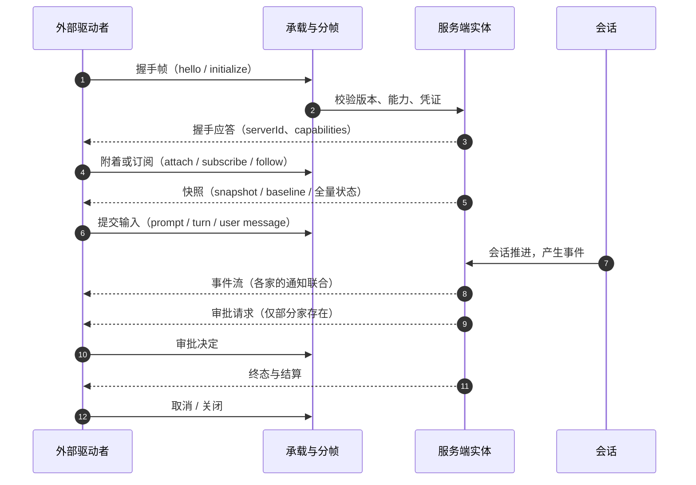

# 第 15 章：对外接口与集成协议 —— 谁在驱动它

前面十四章讨论的都是「它自己怎么跑」。本章换一个视角：**当 Agent 不是被人手敲命令启动、而是被另一个程序驱动时，它对外露出什么**。一个 IDE 插件要把对话嵌进编辑器侧栏、一个 CI 脚本要非交互地拿到结构化结果、一个托管平台要在浏览器里共享同一条会话、一个外部 MCP 客户端要调用它的工具——这四种诉求落到代码上会命中完全不同的包。

读完本章你能回答：一个外部进程要驱动这四家里的任意一个，必须走哪条通道、说哪种协议、拿到什么粒度的事件、在哪一步拿到审批决定；以及为什么 codex 把 170 个请求方法都塞进同一份协议，而 pi 的两套对外面彼此完全不认识。

四家在这里的分歧比外围区前两层都大：**对外面的「套数」从 1 到 4 不等，且没有两家采用同一种协议风格**。

> **本层定位**：L13（外围区第三层，驱动面）。L11 管「能力怎么接进来」（它作为客户端去连别人的 server），L12 管「活过一轮的活怎么被托管」，本层管**反方向**——**别的程序怎么接进来驱动它**。按「离内核的距离」排，L11 与 L12 讲的还是它自己的运行时，L13 第一次把边界推到进程之外。判据很干脆：**这条通路的两端是否分属不同进程或不同程序**——是，就归本层；否，就归 L14 的呈现面。
>
> **前置依赖**：01（主循环——每个对外请求最终都要落到一条会话上）、05（消息事件与 Session 结构——推给外部的事件流是会话事实源对外投影的那一面）、07（任务与子 Agent——CC 的远程桥把子 Agent 也纳入同一条会话镜像）、14（长时任务与后台作业——`process/spawn` 与 `thread/backgroundTerminals/*` 一类方法在本层被暴露给客户端）。
>
> **分析对象**：
> - **pi** —— `packages/server/` + `packages/protocol/` + `packages/client/`（三包分离的主服务器栈）+ `packages/coding-agent/src/modes/rpc/`（headless stdio RPC）——两套互不相通的对外面
> - **deepseek-harness** —— `packages/acp/`（IDE 对接）+ `packages/sdk/`（嵌入式宿主）+ `packages/host/webserver/` + `packages/api/gateway/` + `packages/client/connection/`（浏览器面）+ `packages/webhook/`（入站事件）——四套并存
> - **codex** —— `codex-rs/app-server*/`（一份协议 + 可换承载）+ `codex-rs/app-server-transport/`——请求面最宽的一家
> - **CC** —— `src/cli/{structuredIO,print,transports}`（headless 双工管道）+ `src/entrypoints/{cli.tsx,mcp.ts,sdk}` + `src/bridge/`（远程桥）——管道 + 桥 + 反向当 server
>
> **跨层联动**：14 —— 见 4.3.2 与 4.3.4。第 14 章的 codex 后台进程由独立进程 `exec-server` 托管，而本章的 app-server 把同一批对象一路暴露到协议上：`thread/backgroundTerminals/{clean,list,terminate}` 三条方法（`common.rs:738` / `:744` / `:750`）与 `process/{spawn,writeStdin,kill,resizePty}` 四条（`common.rs:1372` / `:1379` / `:1386` / `:1393`）都是这条联动线的交点。两者是同一批对象在「内核内部」与「进程之外」两个视角下的形态，**服务端实现要不要为外部客户端的便利而扩大协议面**，是这条线上真正的取舍。
>
> **易混点**：**「MCP」在本层有两个相反方向**。第 13 章讲的是四家**作为 MCP 客户端**去连别人的 server（能力怎么接进来）；本章 4.4.4 讲的是 **CC 作为 MCP server** 被别人的客户端调用（`claude mcp serve`，`entrypoints/mcp.ts:35`）。同一个协议、同一份 `services/mcp` 目录出现在两层里是可预期的——判据是**谁发起连接**。另：CC 的 `src/server/` 目录名容易被读成「CC 的服务端」，实测只有 3 个文件，且全是**直连模式的客户端侧**（`createDirectConnectSession.ts:49` 发的是 `POST {serverUrl}/sessions`），还原版里没有任何面向通用客户端的本地服务端。
>
> **门控提示**：CC 的远程桥整体受编译期 `feature('BRIDGE_MODE')` 门控（`entrypoints/cli.tsx:112`），运行期另受 GrowthBook 开关 `tengu_sessions_elevated_auth_enforcement` 与 OAuth 授权范围 `allow_remote_control` 约束（`cli.tsx:139-159`）；本地会话附挂（`claude ps` / `claude attach`）受 `feature('BG_SESSIONS')` 与 `feature('UDS_INBOX')` 双重门控，且其实现文件 `src/cli/bg.js` 在还原版中不存在（`cli.tsx:185-208` 的动态导入无法解析），因此本地 attach 的具体实现不可见；直连模式受 `feature('DIRECT_CONNECT')`（`main.tsx:4064`）。

---

## 一、核心结论速览

1. **对外面的「套数」四家分别是 2 / 4 / 1 / 3，且没有两家共用同一种协议风格**：pi 两套（Unix socket 上的 service-call RPC 与 stdio NDJSON），彼此**互不相通**——主栈用 `ClientMessageSchema` / `ServerMessageSchema`（`protocol.ts:62` / `:98`），headless 那套用 `RpcCommand` / `RpcResponse`（`rpc-types.ts:20` / `:116`），两份 envelope 没有一个共享字段；dsh 四套并存（ACP / SDK / Web / Webhook）；codex 一份协议 + 四种承载（`AppServerTransport`，`transport/mod.rs:83-88`）；CC 三套（`--print` 管道 / 远程桥 / 反向当 MCP server）。

2. **协议宽度差一个量级，但宽度差不是成熟度差**：codex 的 `ClientRequest` **170 条**、`ServerNotification` **84 条**（`common.rs:498` / `:1916` 两处宏块实测计数）；pi 的主栈是 7 个服务共 **24** 个成员，CC 是 **21** 个控制子类型（`controlSchemas.ts:552-576`）；最窄的是 dsh 的 SDK——**3 条请求**（`sdk/protocol/src/types.ts:115-119`）。差异的根源是**协议承担什么**：codex 把文件系统、插件市场、账号、MCP 管理全部塞进协议，dsh 的 SDK 只承担「起一个会话并提问」，其余交给宿主自己写。

3. **「一条会话能不能被两个客户端同时接」四家给了三种答案**：pi 与 codex 都说**能**（附着集合与订阅集合都是 `Set`——pi `session-router.ts:23` 的 `HostedSession.attachments`、codex `thread_state.rs:316-320` 的 `ThreadEntry.connection_ids`），区别在**写操作怎么仲裁**：pi 用 lane 串行化、冲突返回 `lane_busy`，codex 用「服务端请求广播给全部订阅者、**首个响应者生效**」（`outgoing_message.rs:561-580`）；dsh 的 ACP **明确拒绝**第二个持有者（`session is already active`，`acp/src/index.ts:244`）；CC 只有远程订阅这一种共享形态，且是**只读观察者**（`RemoteSessionManager.ts:56-61` 的 `viewerOnly`），本地没有 attach 通路。

4. **审批回流是四家差别最尖锐的一格：「记住多久」归谁管，四家判给了三个不同的主体**：codex 把它判给**客户端**——`AcceptForSession` 是客户端发来的一个枚举值，服务端只透传、**不缓存**（`v2/item.rs:66-85` 的 `CommandExecutionApprovalDecision` 与 `bespoke_event_handling.rs:1979-1981` 的映射）；dsh 的 ACP 把它**判给「不记住」**——只提供 `allow-once` / `reject-once` 两个选项，绝不推断持久授权（`acp/src/index.ts:163-171`）；CC 把它判给**外部回调**（`can_use_tool`，`structuredIO.ts:590-606`）；而 **pi 的协议层根本不存在审批往返**——在 `packages/protocol/src`、`packages/server/src`、`packages/client/src` 三处检索 `approval|permission`，只命中一条关于 socket 文件权限的注释（`server/transports/unix/types.ts:5`）。

5. **「协议版本」的处理横跨「等值校验」到「根本不提」全谱**：pi 的握手帧带 `version` 且**只接受等值**（`PROTOCOL_VERSION = 8`，`protocol.ts:5`；校验 `isSupportedProtocolVersion` 见于 `codec.ts:139-141`），不等即回 `hello_error` 并关连接；dsh 的 ACP 有完整的 `agentCapabilities` 协商但 `authenticate` 直接成功、`authMethods` 为空数组（`acp/src/index.ts:176-194`）；codex 有 `initialize` + `InitializeCapabilities` 却**协议里没有版本号**（在 `app-server-protocol/src` 检索 `protocolVersion` 无结果）；CC 的 `initialize` 连能力协商都没有，重复初始化只回一个 `Already initialized`（`print.ts:4355-4365`）。

---

## 二、本层职责与边界

### 2.1 子职责拆解

| # | 子职责 | 要回答的问题 |
|---|---|---|
| ① | **驱动面形态学** | 它对外露出几种「可被驱动」的面？每种是什么形态——常驻 server、一次性管道、库、还是出站桥？ |
| ② | **会话镜像与注册表** | 外部如何持有一条正在跑的会话？登记在哪张表？用什么身份表达「我在这条会话上」？ |
| ③ | **事件推送** | 服务端→客户端的事件流是什么类型联合？怎么分帧？有没有序号、游标与重放？ |
| ④ | **请求协议** | 客户端→服务端有哪些方法？命名空间怎么划分？请求-响应怎么配对？ |
| ⑤ | **审批回流** | 审批请求怎么推到外部、决定怎么带回来？「记住这个决定」归谁管？ |
| ⑥ | **承载与传输** | 走 stdio / Unix socket / WebSocket / HTTP / SSE 中的哪些？分帧与心跳怎么做？ |
| ⑦ | **握手、能力协商与鉴权** | 有没有初始化握手？能力与版本怎么声明？进门的凭证是什么？ |
| ⑧ | **生命周期、断连与并发** | 客户端断连时服务端做什么？服务端关闭怎么通知？多个客户端怎么协调？ |

这八项在本层里不是一条链，而是**围绕同一条会话的三种距离**：①②③ 问「会话怎么被外部看见」，④⑤ 问「外部怎么把意志送进来」，⑥⑦⑧ 问「这条通路本身怎么成立与收场」。

### 2.2 本层不管什么

- **不管「一次调用怎么变成进程」**（那是 L2，见第 02 章）。本章出现在协议里的 `process/spawn`、`OneOffCommandExec` 一类方法，讲的是**它们怎么被暴露给外部**；这些方法在本层内部怎么执行，是第 02 章 5.8 与第 14 章的对象。
- **不管「MCP 怎么接进来」**（那是 L11，见第 13 章）。唯一的例外是 CC 反向作 server 那一支（见 4.4.4），因为它在本层里是**另一种驱动面**，而不是一种能力来源。
- **不管「界面怎么画」**（那是 L14，见第 16 章）。本层只到「事件被推到进程之外」为止；它们被渲染成侧栏、终端还是网页，不在这里。
- **不管「谁有权批准这条命令」**（那是 L8，见第 08 章）。本层只讲**审批请求怎么穿过进程边界**，判定逻辑本身属于 L8。
- **不管「会话怎么落盘」**（那是 L6，见第 06 章）。协议里的 `resume` / `list` 只讲**入口**，落盘协议在第 06 章。
- **不管「长时作业怎么被托管」**（那是 L12，见第 14 章）。本层只在协议的暴露面里引用它的方法名。
- **不管「鉴权凭证从哪来」**（那是 L0.1，见第 11 章）。本层只讲「门槛在哪、用什么字段表达」，凭证的解析链在第 11 章。

### 2.3 层次定位

本层的位置可以用一句话概括：**前面十四章的「调用者」都在进程内，本章的调用者在进程外**。下面这张图把四家所有对外面的「驱动者 → 承载 → 服务端实体」三段并排列出——注意第一行与第二行同属 pi，却是两条永不相交的链。

```text
┌─────────────────────────────────────────────────────────────────────────────────────────────────────────────┐
│ 图 15-1：四家对外驱动面的进程视图                                                                           │
├───────┬─────────────────────────┬──────────────────────────────────────────────┬────────────────────────────┤
│ 项目  │ 驱动者（另一个进程）    │ 承载 / 协议                                  │ 服务端实体与会话镜像       │
├───────┼─────────────────────────┼──────────────────────────────────────────────┼────────────────────────────┤
│ pi    │ pi client / 任意客户端  │ Unix socket · 4B 长度前缀 + CBOR · 版本 8    │ Server → SessionRouter     │
│ pi    │ pi --mode rpc 客户端    │ stdio NDJSON · 33 条命令（第二套，互不相通） │ RpcMode（进程内）          │
│ dsh   │ 编辑器 / IDE            │ ACP · stdio NDJSON · 版本 + 能力协商         │ AcpSession                 │
│ dsh   │ 宿主程序                │ SDK · stdio NDJSON JSON-RPC · 3 条请求       │ JsonRpcServer              │
│ dsh   │ 浏览器                  │ HTTP POST + WebSocket mux · Cookie(HMAC)     │ TypertGatewayService       │
│ dsh   │ 外部平台（入站）        │ Webhook · HTTP + HMAC-SHA256                 │ WebhookRuntime             │
│ codex │ 任意 app-server 客户端  │ stdio / UDS（内套 WebSocket）/ WebSocket     │ app-server → 线程状态表    │
│ CC    │ 宿主脚本 / CI           │ stdio NDJSON · 21 个控制子类型               │ runHeadlessStreaming       │
│ CC    │ claude.ai 托管（出站）  │ WS / SSE+POST / Hybrid · JWT + 设备令牌      │ bridgeMain → SessionHandle │
│ CC    │ 外部 MCP 客户端（反向） │ stdio · MCP 协议（CC 作 server）             │ startMCPServer             │
└───────┴─────────────────────────┴──────────────────────────────────────────────┴────────────────────────────┘
```

**图 15-1**：四家对外驱动面的进程视图。这张图最该注意的不是行数，而是**「谁在被 spawn」这一列暗含的方向**：pi、dsh、codex 的绝大多数面都是**常驻服务端**，由外部客户端连进来；CC 的两条主通路相反——`--print` 是**CC 被宿主 spawn 出去**（`print.ts:455`），远程桥是**CC 主动去连托管平台**（`bridgeMain.ts` 里的 `activeSessions` 是 CC 自己维护的**被托管**会话表，`bridgeMain.ts:163`）。这个方向差解释了后面所有的不对称：CC 没有「接受连接」的代码路径，所以它的「协议版本协商」与「并发客户端仲裁」都比别家薄。第二件值得注意的事是 pi 的前两行——同一个项目、同一台机器上，`pi client` 说 CBOR 帧、`pi --mode rpc` 说 NDJSON 行，两套 envelope 之间没有任何共享类型，这是本层「套数」这个概念的真实含义。

再看同一条会话在四家各自的「骨架」：下面这张图把六件事并排，用来回答「一个想驱动它的人需要知道多少」。

```text
┌─────────────────────────────────────────────────────────────────────────────────────────────────────────────────────────┐
│ 图 15-2：四家骨架对照                                                                                                   │
├──────────────┬───────────────────────┬────────────────────────────────┬─────────────────────────┬───────────────────────┤
│ 维度         │ pi                    │ deepseek-harness               │ codex                   │ CC                    │
├──────────────┼───────────────────────┼────────────────────────────────┼─────────────────────────┼───────────────────────┤
│ 对外面的套数 │ 2（互不相通）         │ 4（并存）                      │ 1 协议 + 4 承载         │ 3（管道 / 桥 / 反向） │
│ 协议风格     │ service-call + NDJSON │ ACP 语义 + 自有信封            │ 自有 RPC（非 2.0）      │ 控制请求 / 响应       │
│ 请求面宽度   │ 7 服务 / 24 成员      │ ACP 8 / SDK 3 / Web 6 命名空间 │ 170                     │ 21                    │
│ 事件面宽度   │ 5 种 envelope         │ ACP 6 / SDK 4 / Web 4          │ 84                      │ 24                    │
│ 会话归属     │ attachments 是 Set    │ ACP 独占 / Web 无归属          │ 订阅是 Set              │ 远程桥多观察者        │
│ 审批回流     │ 无                    │ ACP once / Web waterfall       │ 11 条里的 5 条          │ can_use_tool          │
│ 鉴权         │ 无 token（文件权限）  │ Web 有 / ACP 与 SDK 无         │ WS 有 / stdio 与 UDS 无 │ 桥有 / 管道无         │
│ 序号与重放   │ envelope 无 seq       │ Web 有 cursor                  │ 无序号、无重放          │ SSE / WS 可重放       │
└──────────────┴───────────────────────┴────────────────────────────────┴─────────────────────────┴───────────────────────┘
```

**图 15-2**：四家骨架对照。四列从上到下是同一条链——**露出几套面 → 说哪种协议 → 请求面有多宽 → 事件面有多宽 → 一条会话归谁 → 审批怎么做 → 谁把门 → 断了能不能接上**。两个值得注意的地方：第一，「鉴权」这一行**没有一家是「有」或「没有」**，四家都是**按承载分流**——codex 的 WebSocket 有 token 而 stdio 与 UDS 没有（`stdio.rs:59` 与 `websocket.rs:190` 的 `auth: None`），dsh 的 Web 有 Cookie 而 ACP 与 SDK 没有，CC 的桥有 JWT 而管道没有，pi 干脆全都没有、把门交给文件权限（socket `0o600` + 目录属主）。这不是疏漏，而是**本层的一条普遍规律：跨机器的那条承载有凭证，同机器的那些没有**。第二，「序号与重放」这一行四家各自选择在**不同层次**上解决：CC 在**传输层**（`sequence_num` / `last_id`）、dsh 在**会话快照**（`snapshot.cursor`）、codex 选择**不解**（通知无序号）、pi 把它推到**会话状态复制层**（chord 的 op 序号，`chord/services/state.ts:164`）。

最后把四家的通路压成同一条时序，用来定位后面每一节讲的是哪一段：



**图 15-3**：一次外部驱动的通用时序。七个阶段对应本层的八项子职责（握手对应 ⑦、附着对应 ②、事件流对应 ③、审批对应 ⑤、断连对应 ⑧）。**四家在这条线上的完整性差别很大**：pi 的 headless 那一套在「附着」这一步是空的（进程内 session 只有一个持有者），dsh 的 SDK 在「附着」上也是空的（一个 runtime 一个客户端），codex 有最完整的附着（`thread/resume` + 订阅集合），CC 则把「附着」换成了「订阅远端只读镜像」。审批那两步（第 8、9 步）是**唯一有四家之一整段缺失**的两步——pi 完全没有它们。

---

## 三、概念对齐表

下表的每一行是一个概念槽位。**空白格与「无」同样是结论**——它们说明该项目在这一槽位上没有对应物，或有意做得更薄；表后逐条解释。

| 概念 | pi | dsh | codex | CC |
|---|---|---|---|---|
| 对外驱动面的套数 | 2（Unix socket 栈 + stdio RPC） | 4（ACP / SDK / Web / Webhook） | 1 协议 + 4 承载 | 3（管道 / 桥 / 反向 server） |
| 服务端实体 | `Server`（`server.ts:46`） | `WebServer`（`host/webserver/src/index.ts:125`）/ ACP 桥 / SDK server | `app-server` crate | 无本地 server（CC 被 spawn 或主动连出） |
| 客户端 SDK | `Client`（`client/src/client.ts:62`） | `HarnessClient`（`sdk/client/src/client.ts:185`） | `app-server-client` crate | 无（`entrypoints/sdk` 全是类型与桩） |
| 协议风格 | service-call：`{serviceId, member, args}` | ACP 语义 / 自有信封 | 自有 RPC（非 JSON-RPC 2.0） | 控制请求 / 响应 |
| 「不是 JSON-RPC 2.0」的证据 | 无 `jsonrpc` 字段，自有 envelope | SDK 用标准 JSON-RPC（`id` + `method`） | `rpc.rs:1-2` 注释明示 | 无 JSON-RPC 概念，靠 `type: control_request` |
| 客户端→服务端请求数 | 33（stdio RPC）/ 24 个服务成员（主栈） | ACP 8 / SDK 3 / Web 6 命名空间 | **170** | **21** |
| 服务端→客户端事件数 | 5 种 envelope | ACP 6 / SDK 4 / Web 4 类 | **84** | 24 种消息 variant |
| 服务端→客户端请求数（非通知） | 0 | 1（ACP `session/request_permission`） | **11** | 1（`can_use_tool`） |
| 会话镜像载体 | `HostedSession.attachments`（`Set`，`session-router.ts:23`） | ACP `sessions: Map` / SDK `sessions: Map` / Web `SessionStore` | `ThreadStateManager` 三张表（`thread_state.rs:342-347`） | `activeSessions: Map`（`bridgeMain.ts:163`） |
| 一条会话能否被多客户端同时接 | 能（写由 lane 串行化，冲突回 `lane_busy`） | **ACP 不能**（`session is already active`）/ Web 无写者归属 | **能**（服务端请求广播，首个响应者胜出） | 远程订阅可多观察者；本地无 attach |
| 附着 / 订阅的动词 | `attach` / `detach`（`pi.session-management`） | ACP `session/resume`；Web `session/follow` | `thread/resume` / `thread/read` 订阅 | WS `/v1/sessions/ws/{id}/subscribe` |
| 审批回流通道 | **无** | ACP `session/request_permission` / Web waterfall 转发 | `item/*/requestApproval` 三条 + 两条 legacy | `can_use_tool` |
| 审批「记住多久」归谁决定 | —（无审批） | 服务端**只给 once** | **客户端**（`AcceptForSession`，服务端不缓存） | 外部回调 + `permission_suggestions` |
| 主要承载 | Unix socket（4B 长度前缀 + CBOR）/ stdio NDJSON / WebSocket（仅中继） | stdio NDJSON / HTTP POST / WebSocket / HTTP（导出） | stdio / UDS（内套 WebSocket）/ WebSocket / 出站 remote-control | stdio NDJSON / WebSocket / SSE+POST / Hybrid |
| 分帧 | 4 字节长度前缀 + CBOR（`framing.ts:1`） | 换行切分 NDJSON | stdio 换行 JSON；WebSocket 一消息一帧 | NDJSON；WebSocket 帧 |
| 握手 | `hello` 两帧 + **等值版本校验** | ACP `initialize`（capabilities）/ SDK `initialize` / Web 无版本 | `initialize` + `initialized` + capabilities；**无版本号** | `initialize`；**无版本协商** |
| 鉴权 | **无 token**（socket `0o600` + 目录属主） | Web：Cookie(HMAC) + 进程令牌；ACP 与 SDK 无 | WebSocket：token；stdio 与 UDS 无 | 远程桥：Bearer + JWT + 设备令牌；本地管道无 |
| 序号与重放 | envelope 无 seq；复制层有连续性校验 | SDK 有 `seq` 无游标；Web 有 `snapshot.cursor` | **无序号、无重放**（仅未决 server→client 请求重发） | stdio 无序；SSE/WS 有 `sequence_num` / `last_id` 重放 |
| 断连语义 | 无 bye 消息，靠 socket 关闭；在途请求被 abort | ACP 静默 quiesce；SDK 走 `shutdown`→EOF→SIGTERM→SIGKILL 阶梯 | `ConnectionClosed` 事件 → 卸载无订阅线程 | 输入关闭 → 拒绝全部未决权限 → 优雅退出 |
| 「客户端断开 = 会话结束」吗 | 否（会话由 worker 持有） | 否（ACP 关闭后持久状态仍可用） | 否（stdio 单客户端模式除外） | 否（远程桥断连后按心跳重排） |

**关于空白与「无」**：

- **pi 的「审批回流通道」是整张表里唯一的纯空白**，而且这一格的空白与第 14 章 `pi.job` 的空白性质不同：`pi.job` 是「机制完备但没接上工具」，而审批在这里是**协议层从类型上就不存在**——`ClientMessageSchema` 只有三种成员（`hello` / `request` / `cancel`，`protocol.ts:62`），`ServerMessageSchema` 只有五种（`protocol.ts:98`），没有任何一个成员能承载「服务端向客户端提问并等回答」。pi 把这类交互放在了另一个地方：扩展 UI 对话框，而且**只在 headless stdio 那一套里**（见 4.1.4）。
- **「服务端→客户端请求数」这一行，codex 的 11 与其余三家的 0/1 对比，是本层最不均衡的一格**。11 个成员里 5 个是审批（3 条 `item/*/requestApproval` + 2 条 legacy），其余 6 个是 `item/tool/requestUserInput`、`mcpServer/elicitation/request`、`item/tool/call`、`account/chatgptAuthTokens/refresh`、`attestation/generate`、`currentTime/read`（`common.rs:1761-1832`）。**它把「服务端需要向客户端要东西」当成了协议的一等公民**，而其余三家要么只留一条审批通道，要么一条都不留。
- **「一条会话能否被多客户端同时接」这一行，dsh 是四家里唯一明确禁止的**。ACP 的守卫是一行前置断言（`acp/src/index.ts:243-245`），语义上的理由是「`owns()` 用同一性比较」（`acp/src/session.ts:176-187`）——同一个 `SessionId` 若被两个连接持有，`owns()` 就无法区分归属。
- **「审批记住多久」这一行三家三个主体**，这是本层最值得单独记住的一条：**同一个功能（「别再问第二次」）在四家里被放在了三个不同的决策层**。放在客户端（codex）意味着服务端可以完全无状态，但换一个客户端就要重新批准；放在服务端策略（本表未列出，第 08 章讲）意味着跨客户端一致，但客户端失去了控制权；CC 的处理是**把建议回传**（`permission_suggestions`）而由外部决定是否采纳，属于折中。

---

## 四、逐项目实现

### 4.1 pi —— 两套互不相通的对外面

> 一句话定性：pi 把「对外驱动」做成了**两个各自完整、彼此不认识**的实现——一个三包分离的常驻服务器栈（`packages/{protocol,server,client}`），一个单进程的 headless RPC 模式（`packages/coding-agent/src/modes/rpc/`）。前者的核心抽象是「服务调用」，后者的核心抽象是「命令」；两者共享的只有 JSON 这个载体。

#### 4.1.1 两套面在哪里分叉

判据可以直接摆出来：两套 envelope 没有一个共享字段。主栈的客户端消息是 `hello` / `request` / `cancel` 三选一，而 headless 的命令是 33 个带 `type` 的联合成员，其 `id` 甚至是**可选**的。

`packages/protocol/src/protocol.ts:55-62`
```ts
const CancelEnvelopeSchema = StrictObject({
	type: Type.Literal("cancel"),
	id: IdSchema,
	target: RpcTargetSchema,
});
export type RequestEnvelope = Static<typeof RequestEnvelopeSchema>;
export type CancelEnvelope = Static<typeof CancelEnvelopeSchema>;
export const ClientMessageSchema = Type.Union([ClientHelloSchema, RequestEnvelopeSchema, CancelEnvelopeSchema]);
```

服务端方向同样如此——5 个成员，其中没有一个是「命令结果」的通用形状：

`packages/protocol/src/protocol.ts:98-104`
```ts
export const ServerMessageSchema = Type.Union([
	ServerHelloSchema,
	ServerHelloErrorSchema,
	ResponseEnvelopeSchema,
	ServiceEventEnvelopeSchema,
	AttachmentEnvelopeSchema,
]);
```

而 headless 那套的命令联合在另一个包里，形如 `{ id?: string; type: "…" }`：

`packages/coding-agent/src/modes/rpc/rpc-types.ts:3-8`
```ts
/**
 * RPC protocol types for headless operation.
 *
 * Commands are sent as JSON lines on stdin.
 * Responses and events are emitted as JSON lines on stdout.
 */
```

`packages/coding-agent/src/modes/rpc/rpc-types.ts:20-26`
```ts
export type RpcCommand =
	// Prompting
	| { id?: string; type: "prompt"; message: string; images?: ImageContent[]; streamingBehavior?: "steer" | "followUp" }
	| { id?: string; type: "steer"; message: string; images?: ImageContent[] }
	| { id?: string; type: "follow_up"; message: string; images?: ImageContent[] }
	| { id?: string; type: "abort" }
	| { id?: string; type: "clear_queue" }
```

三处差别值得记下来：**① 请求的关联方式**——主栈用必填的 `id` 做一对一配对，headless 的 `id` 可选（不传就不回响应）；**② 目标寻址**——主栈每条请求都带 `target`（服务级或会话级，见 4.1.3），headless 没有寻址概念，因为它一个进程只服务一条会话；**③ 事件通道**——主栈有独立的 `service_update` envelope 带 `subscriptionId`，headless 的响应与事件混在同一个 `stdout` 上，靠 `type` 区分。

#### 4.1.2 主服务器栈：三个包的分工与装配

`packages/protocol/` 只定义帧与 envelope（`protocol.ts` 全文 **110 行**），不含任何 IO；`packages/server/` 是服务端（`server.ts` **576 行** + `session-router.ts` **312 行**）；`packages/client/` 是客户端 SDK（`client.ts` **479 行**）。三者的装配点是 `createUnixServer`——它把「一个 `Server` + 一个 Unix socket listener」拼成一个可直接 `start()` 的对象：

`packages/server/src/transports/unix/preset.ts:7-27`
```ts
/** Compose Server with one Unix-domain socket listener. */
export function createUnixServer<TMetadata extends SessionMetadata>(
	host: ServerHost<TMetadata>,
	options: UnixServerOptions,
): Server<TMetadata> {
	const listener = createUnixListener({
		path: options.path,
		mode: options.mode,
		maxFrameLength: options.maxFrameLength,
		maxPendingBytes: options.maxPendingBytes,
		gracefulCloseTimeoutMs: options.gracefulCloseTimeoutMs,
		onError: options.onError,
	});
	return new Server(host, {
		listeners: [listener],
		maxFrameLength: options.maxFrameLength,
		handshakeTimeoutMs: options.handshakeTimeoutMs,
		onConnectionCountChanged: options.onConnectionCountChanged,
		serverId: options.serverId,
		onError: options.onError,
	});
}
```

应用层的接线在 `coding-agent` 的 experimental 入口里，把 socket 权限、服务地址目录、会话打开方式一次传进去：

`packages/coding-agent/src/experimental/server.ts:471-476`
```ts
	const server = createUnixServer(host, {
		serverId,
		path: socketPath,
		mode: 0o600,
		onConnectionCountChanged,
	});
```

注意 `mode: 0o600`——**这是 pi 唯一的「鉴权」**，见 4.1.7。`Server<TMetadata>` 这个类（`packages/server/src/server.ts:46`）本身只承担四件事：接受连接、跑握手、分派请求、管理连接集合——全部靠在构造函数里固化的几个只读字段：

`packages/server/src/server.ts:47-58`
```ts
	readonly serverId: string;
	/** Resolves after shutdown, or rejects when listener or routed-Session cleanup fails. */
	readonly closed: Promise<void>;

	private readonly host: ServerHost<TMetadata>;
	private readonly listeners: readonly ServerListener[];
	private readonly maxFrameLength: number;
	private readonly handshakeTimeoutMs: number;
	private readonly onConnectionCountChanged: ((count: number) => void) | undefined;
	private readonly onError: ((error: Error) => void) | undefined;
	private readonly connections = new Set<ConnectionState>();
	private readonly sessions: SessionRouter<TMetadata>;
```

#### 4.1.3 会话镜像：`HostedSession` 与附着集合

pi 的「会话镜像」由 `SessionRouter` 承担，它维护三张表——已托管的会话、正在打开的会话、以及**每个客户端当前的附着**：

`packages/server/src/session-router.ts:35-39`
```ts
	private readonly options: SessionRouterOptions<TMetadata>;
	private readonly hostedSessions = new Map<string, HostedSession>();
	private readonly openingSessions = new Map<string, Promise<HostedSession>>();
	private readonly attachmentsByClient = new Map<object, ClientAttachment>();
	private readonly disconnectedClients = new Set<object>();
```

`HostedSession.attachments` 是 `Set`，这是「一条会话可以被多个客户端同时接」的直接证据：

`packages/server/src/session-router.ts:20-24`
```ts
interface HostedSession {
	readonly id: string;
	readonly handle: RoutedSessionHandle;
	readonly attachments: Set<ClientAttachment>;
}
```

但「多客户端可接」不等于「多客户端可写」。写操作落在一个 lane 上串行化，冲突时返回 `lane_busy`——这是本层「共享读、单写者」的一处典型实现。附着的建立与释放伴随一次带外推送，让客户端随时知道「我现在挂在哪个会话上」：

`packages/server/src/server.ts:78-84`
```ts
			publishAttachment: async (client, attachment) => {
				await this.sendMessage(client as ConnectionState, {
					type: "attachment",
					attachment: attachment ?? null,
				});
			},
			reportError: (error) => this.reportError(error),
```

客户端侧对称地维护一个 `attachment` 字段与一个变更回调：

`packages/client/src/client.ts:112-114`
```ts
	get attachment(): SessionTarget | undefined {
		return this.#attachment;
	}
```

**寻址是 pi 的一个特色**。每条请求都带一个 `target`，它是「服务级」或「会话级」的二选一；会话级的 target 由三元组围栏，缺一个都不算合法寻址：

`packages/protocol/src/protocol.ts:35-47`
```ts
/** A server-wide call, fenced to one logical server. */
const ServerTargetSchema = StrictObject({
	serverId: ServerIdSchema,
});
/** A session call, fenced to one logical server, durable session, and live attachment. */
const SessionTargetSchema = StrictObject({
	serverId: ServerIdSchema,
	sessionId: IdSchema,
	attachmentId: IdSchema,
});
export type SessionTarget = Static<typeof SessionTargetSchema>;
const RpcTargetSchema = Type.Union([ServerTargetSchema, SessionTargetSchema]);
export type RpcTarget = Static<typeof RpcTargetSchema>;
```

把 `attachmentId` 写进寻址三元组，意味着**「我在哪个会话上」这件事被编码进了每条请求**，而不是靠连接状态隐含——这是 pi 与 codex「连接订阅集合」做法的根本差别。

#### 4.1.4 服务成员表：7 个服务 24 个成员

pi 的请求面不是一张方法常量表，而是**命名空间式的服务注册**——每个服务用 `defineService` 声明一个 id，成员就是接口上的方法。以下是全部 7 个 RPC 可达服务与其成员（另有 2 个 `{ local: true }` 服务——`pi.local.slash-commands`、`pi.local.presentation-ui`——按设计不进 catalogue，因此外部客户端看不到）：

| 服务 id | 作用域 | 成员 | 锚点 |
|---|---|---|---|
| `pi.session-directory` | server | `state` | `experimental/services/sessions.ts:22-26` |
| `pi.session-management` | server | `create` / `remove` / `attach` / `detach` | `experimental/services/sessions.ts:28-35` |
| `pi.presentation-plugins` | server | `prepareSession` / `reload` | `experimental/services/plugins.ts:4-12` |
| `pi.session-plugins` | session | `reload` | `experimental/services/plugins.ts:15-19` |
| `pi.models` | session | `state` / `cycleThinking` / `getThinkingLevels` / `refresh` / `select` / `selectThinking` | `experimental/services/models.ts:26-35` |
| `pi.agent-controller` | session | `prompt` / `requestAbort` / `steer` / `followUp` / `nextRun` / `cancelQueued` / `resume` / `compact` / `navigate` | `experimental/services/agent-controller.ts:39-54` |
| `pi.transcript` | session | `state` | `experimental/services/transcript.ts:11-15` |

合计 **24 个成员**，其中 3 个是 `ReplicatedState` 订阅槽（`session-directory.state` / `models.state` / `transcript.state`）。接口本身的写法很直白——「会话管理」这一族就是四个动词：

`packages/coding-agent/src/experimental/services/sessions.ts:27-35`
```ts
export interface SessionManagement {
	create(options: SessionCreateOptions, context: Context): Promise<SessionSummary>;
	remove(sessionId: string, context: Context): Promise<void>;
	attach(sessionId: string, context: Context): Promise<void>;
	detach(context: Context): Promise<void>;
}

export const SessionManagement = defineService<SessionManagement>("pi.session-management");
```

真正承担「驱动会话」的九个动作在 `AgentController` 上，注释把它的定位写得很清楚——它是**worker 侧真实 lane 之上的一个面向呈现层的门面**：

`packages/coding-agent/src/experimental/services/agent-controller.ts:38-54`
```ts
/** Presentation-safe command facade over the worker-owned main AgentLane. */
export interface AgentController {
	prompt(request: AgentPromptRequest, context: Context): Promise<AgentOperationResponse>;
	requestAbort(operationId: string, context: Context): Promise<void>;
	steer(request: AgentPromptRequest, context: Context): Promise<AgentQueueResponse>;
	followUp(request: AgentPromptRequest, context: Context): Promise<AgentQueueResponse>;
	nextRun(request: AgentPromptRequest, context: Context): Promise<AgentQueueResponse>;
	cancelQueued(
		entryId: string,
		context: Context,
	): Promise<{ outcome: "cancelled" | "already_consumed" | "not_found" }>;
	resume(context: Context): Promise<AgentOperationResponse>;
	compact(request: AgentCompactionRequest, context: Context): Promise<AgentOperationResponse>;
	navigate(request: AgentNavigationRequest, context: Context): Promise<AgentOperationResponse>;
}

export const AgentController = defineService<AgentController>("pi.agent-controller");
```

服务发现不写在握手帧里，而是运行期一次 `catalogue` 调用——客户端连上后先问「你这儿有哪些服务」：

`packages/client/src/client.ts:159-170`
```ts
	async serviceCatalogue(target: RpcTarget, signal?: AbortSignal): Promise<readonly ServiceCatalogueEntry[]> {
		const result = await this.#request(target, createServiceCatalogueCall(), signal);
		try {
			return parseServiceCatalogue(result);
		} catch (error) {
			const validationError = new ProtocolValidationError(
				error instanceof Error ? error.message : "Invalid service catalogue",
			);
			this.#connection.fail(validationError);
			throw validationError;
		}
	}
```

返回的服务清单**在客户端侧也要过一遍校验**——`parseServiceCatalogue` 失败不是抛给调用者就完了，而是直接把连接判死（`this.#connection.fail`）。这是 pi 的一个一贯立场：协议层的形状错误属于连接级故障，不属于单次调用的错误。

#### 4.1.5 headless stdio RPC：33 条命令与唯一一处请求-响应

`runRpcMode` 是第二套面的入口（`packages/coding-agent/src/modes/rpc/rpc-mode.ts:54`，签名是 `Promise<never>`——它永不返回）。它做的第一件事就是抢走 stdout 的所有权；`output` 这个局部函数是此后**唯一**的写出口：

`packages/coding-agent/src/modes/rpc/rpc-mode.ts:55-62`
```ts
	takeOverStdout();
	let session = runtimeHost.session;
	let unsubscribe: (() => void) | undefined;
	let unsubscribeBackpressure: (() => void) | undefined;

	const output = (obj: RpcResponse | RpcExtensionUIRequest | object) => {
		writeRawStdout(serializeJsonLine(obj));
	};
```

命令面实测 **33** 条（`rpc-types.ts:20-115`），按语义分了七组：Prompting（`prompt` / `steer` / `follow_up` / `abort` / `clear_queue` / `new_session`）、State、Model、Thinking、Queue modes、Compaction、以及会话与导出那一组（`get_entries` / `get_tree` / `fork` / `clone` / `switch_session` / `export_html` 等）。响应联合有 **34** 个成员（`rpc-types.ts:116-245`）——**响应数比命令数多一个**，多出来的那个是纯事件型响应（不来自任何 `id`）。

这套面里**唯一一处「服务端主动提问、客户端回答」的机制**是扩展 UI 对话框。它用的是和主栈完全无关的一对类型：

`packages/coding-agent/src/modes/rpc/rpc-types.ts:287-291`
```ts
/** Response to an extension UI request */
export type RpcExtensionUIResponse =
	| { type: "extension_ui_response"; id: string; value: string }
	| { type: "extension_ui_response"; id: string; confirmed: boolean }
	| { type: "extension_ui_response"; id: string; cancelled: true };
```

服务端把请求推出去并挂进一张等待表：

`packages/coding-agent/src/modes/rpc/rpc-mode.ts:122-129`
```ts
			pendingExtensionRequests.set(id, {
				resolve: (response: RpcExtensionUIResponse) => {
					cleanup();
					resolve(parseResponse(response));
				},
				reject,
			});
			output({ type: "extension_ui_request", id, ...request } as RpcExtensionUIRequest);
```

回程在命令分发之前被截住——只有 `extension_ui_response` 走这条路，其余才当命令解析：

`packages/coding-agent/src/modes/rpc/rpc-mode.ts:768-782`
```ts
		// Handle extension UI responses
		if (
			typeof parsed === "object" &&
			parsed !== null &&
			"type" in parsed &&
			parsed.type === "extension_ui_response"
		) {
			const response = parsed as RpcExtensionUIResponse;
			const pending = pendingExtensionRequests.get(response.id);
			if (pending) {
				pendingExtensionRequests.delete(response.id);
				pending.resolve(response);
			}
			return;
		}
```

**这一节是本层最重要的「缺口」所在**：pi 的审批类交互（项目信任确认、工具的 UI 询问）**只在这套 headless 面里存在**，主服务器栈的协议层没有任何承载它的类型。也就是说，一个用 `pi client` 连上来的 IDE 插件，在设计上**无法回答任何「要不要允许」的问题**——这类问题在 pi 里是扩展 UI 的职责，而扩展 UI 不在主栈协议里。

#### 4.1.6 传输与分帧

主栈只有一种传输：Unix domain socket。分帧是**4 字节大端长度前缀 + CBOR**，与 headless 的换行分隔形成对照：

`packages/protocol/src/framing.ts:1-6`
```ts
const FRAME_HEADER_LENGTH = 4;
const MAX_UINT32 = 0xffff_ffff;
const PAYLOAD_BLOCK_SIZE = 64 * 1024;

/** Default upper bound for one framed CBOR payload. */
export const DEFAULT_MAX_FRAME_LENGTH = 16 * 1024 * 1024;
```

CBOR 而非 JSON 是一个有意的取舍：**长度前缀 + 二进制编码**让「一个帧 = 一次完整解码」成立，不必在字节流上找分隔符，代价是帧内容不能被人肉阅读。headless 那套相反，用的是可读的 JSONL：

`packages/coding-agent/src/modes/rpc/rpc-types.ts:3-7`
```ts
/**
 * RPC protocol types for headless operation.
 *
 * Commands are sent as JSON lines on stdin.
 * Responses and events are emitted as JSON lines on stdout.
 */
```

除这两种之外，pi 只有一处 WebSocket——用于 `experimental/radius-relay.ts` 的外出中继（把本机会话中继给远端），且它是**复用同一个 `Server` 实例**接入 host 侧的，因此帧格式仍是主栈那套。**pi 没有 HTTP 传输、没有 SSE**：在 `packages/server/src` 里检索可知它只依赖 `node:net`，没有 `node:http`。

#### 4.1.7 握手、版本与「没有鉴权」

握手是两帧：客户端先发 `hello{version}`，服务端校验通过后回 `hello{version, serverId}`。版本校验是**等值**判断，不是区间协商：

`packages/protocol/src/codec.ts:139-141`
```ts
export function isSupportedProtocolVersion(version: number): version is typeof PROTOCOL_VERSION {
	return Number.isInteger(version) && version === PROTOCOL_VERSION;
}
```

`packages/protocol/src/protocol.ts:5`
```ts
export const PROTOCOL_VERSION = 8 as const;
```

不等就发 `hello_error` 并以 final frame 关闭连接：

`packages/server/src/server.ts:263-269`
```ts
		if (!isSupportedProtocolVersion(hello.version)) {
			await this.failProtocol(state, {
				code: "version",
				message: `Unsupported protocol version ${hello.version}; expected ${PROTOCOL_VERSION}`,
			});
			return;
		}
```

**能力发现不在握手帧里**，而是握手完成后的一次普通 RPC（`$chord.service` 的 `catalogue` 成员），返回 `serviceId` + `mode` 的列表（见 4.1.4 末）。这是一个清晰的取舍：**握手只回答「我们说不说得上话」，不回答「我有什么」。**

**鉴权：没有。** 门禁全部交给文件系统——socket 文件 `0o600`、私有目录 `0o700` 加属主校验。检索 `packages/protocol/src`、`packages/server/src`、`packages/client/src` 三个包的 `approval|permission`，唯一的命中是一条关于 socket 权限的注释：

`packages/server/src/transports/unix/types.ts:5`
```ts
	/** Socket filesystem permissions. Defaults to owner read/write only (0o600). */
```

唯一的 token 出现在 outward 的中继里（`experimental/radius-auth.ts:57-66` 定义 `AuthInput`），使用点是 `radius-relay.ts:153`，用于 WebSocket 握手头——这属于「CC 的远程桥」那类出站形态，与主栈的入口鉴权无关。

#### 4.1.8 断连与收场

服务端的断连处理是**先中断、后清理**：把所有在途请求的 `AbortController` 全部 abort，再从连接集合里摘掉，最后异步回收该连接持有的服务与会话附着：

`packages/server/src/server.ts:417-436`
```ts
	private disconnect(connection: ConnectionState): void {
		if (connection.disconnected) return;
		connection.disconnected = true;
		connection.stage = "closed";
		clearTimeout(connection.handshakeTimeout);
		for (const { controller } of connection.activeRequests.values()) {
			controller.abort(new Error("Client disconnected"));
		}
		connection.activeRequests.clear();
		connection.serviceStateEncoders.clear();
		if (this.connections.delete(connection)) this.notifyConnectionCountChanged();
		const serverServices = connection.serverServices;
		delete connection.serverServices;
		void Promise.allSettled([
			this.sessions.disconnect(connection, TODO_CONTEXT),
			serverServices?.release(TODO_CONTEXT),
		]).then((results) => {
			for (const result of results) if (result.status === "rejected") this.reportError(result.reason);
		});
	}
```

服务端关闭方向**没有「我要关了」这条消息**——`ServerMessageSchema` 的 5 个成员里没有任何一种通知类型（见 4.1.1）。关闭靠 socket 关闭表达；只有在协议出错时才额外送一个 final frame。客户端侧对称地做同一件事，并把「断连」当作一次状态回退：

`packages/client/src/client.ts:345-360`
```ts
	#handleConnectionStateChange(change: ConnectionStateChange): void {
		if (change.state === "disconnected") {
			this.#hello = undefined;
			this.#setAttachment(undefined);
			this.#rejectPendingRequests(change.error ?? new DisconnectedError());
			this.#serviceListeners.clear();
		}
		for (const listener of this.#connectionStateListeners) {
			try {
				listener(change);
			} catch (error) {
				this.#reportListenerError(error);
			}
		}
	}
```

客户端的重连入口就是 `connect()` 本身（`client.ts:134-136` 的 `reconnect()` 直接转调 `connect()`），因此**「重连」在 pi 里等于「重新握手 + 重新附着」**，没有 session 级别的恢复语义——恢复是会话文件的事（第 06 章），不是协议的事。

### 4.2 deepseek-harness —— 四套并存，只有一套有真凭证

> 一句话定性：dsh 把「对外驱动」按**驱动者的身份**切成了四份——编辑器走 ACP、嵌入式宿主走 SDK、浏览器走 Web（HTTP 上行 + WebSocket 下行）、外部平台走 Webhook（纯入站）。四套各自定义协议，**唯一的共性是都挂在同一批 Cordis 服务上**（`ctx.agents` / `ctx.sessions` / `ctx.sessionPersistence`）。

#### 4.2.1 四套面与它们的实际用户

四套面的入口都在 `apply` 或 `Service` 构造处，形态差别很大：

| 面 | 入口 | 承载 | 典型驱动者 |
|---|---|---|---|
| ACP | `apply(ctx, config)`（`acp/acp/src/index.ts:97`） | stdio（NDJSON 由 `@agentclientprotocol/sdk` 分帧） | 编辑器 / IDE 扩展 |
| SDK | `HarnessSdkJsonRpcServer`（`sdk/server/src/server.ts:76`） | stdio（自家 `JsonRpcLineTransport` 分帧） | 宿主程序（进程内库式使用） |
| Web | `HostConnectionService`（`client/connection/src/rpc-host.ts:63`）+ `WebServer`（`host/webserver/src/index.ts:125`） | HTTP POST（上行）+ WebSocket（下行） | 浏览器 |
| Webhook | `WebhookRuntime`（`webhook/webhook/src/index.ts:58`） | HTTP（纯入站） | 外部平台（如 Git 托管方） |

有一个容易走错的地方值得先纠正：**`packages/web/` 不是 Web 界面，而是「web 检索与抓取」能力**（`web/web/src/index.ts:9-10` 声明的是 `ctx.web` 服务与 `web-search-*` / `web-fetch-http` 一组 provider），属于第 09 章的模型侧能力；真正的浏览器面在 `packages/client/connection/` + `packages/api/gateway/` + `packages/host/webserver/` 三个包里。同样，`packages/client/web/` 才是浏览器 UI 外壳（`client/web/src/index.ts:1-5` 自述为 shell library），归第 16 章。

`packages/client/connection/` 的归属需要拆开看：它自述为 **Host HTTP bridge for browser-client RPC**（`client/connection/src/index.ts:1`），是浏览器 RPC 的 Host 半边，属本层；而同一个 `client/` 目录下的 `ui-*`、`store/`、`hmr/` 则属呈现面。

#### 4.2.2 ACP：唯一有完整握手与能力协商的面

`apply` 捕获注入的服务，建立三张运行期表——会话记录、正在激活的会话、以及一个全局的关闭标志：

`packages/acp/acp/src/index.ts:102-107`
```ts
  const sessionListPageSize = resolveSessionListPageSize(config.sessionListPageSize)
  const sessions = new Map<SessionId, AcpSession>()
  const activating = new Set<SessionId>()
  let closed = false
  let imagePromptEnabled = false
```

**归属判定用同一性比较**，这是后面「一个会话只能有一个持有者」的根据：

`packages/acp/acp/src/index.ts:109-113`
```ts
  /** Return the bridge-owned record for an agent, rejecting same-id impostors. */
  const ownedRecord = (agent: Parameters<AcpSession['owns']>[0]): AcpSession | undefined => {
    const record = sessions.get(agent.session.id)
    return record?.owns(agent) === true ? record : undefined
  }
```

传输默认是 stdio，测试可注入替代流；随后一次性把 8 条请求与 1 条通知挂上去：

`packages/acp/acp/src/index.ts:374-390`
```ts
  const stream: Stream = config.stream ?? ndJsonStream(
    Writable.toWeb(process.stdout) as WritableStream<Uint8Array>,
    Readable.toWeb(process.stdin) as ReadableStream<Uint8Array>,
  )
  const app = createAcpAgentApp({ name: 'deepseek-harness-acp' })
    .onRequest(methods.agent.initialize, ({ params }) => implementation.initialize(params))
    .onRequest(methods.agent.authenticate, async ({ params }) => {
      await implementation.authenticate(params)
      return {}
    })
    .onRequest(methods.agent.session.new, ({ params, signal }) => implementation.newSession(params, signal))
    .onRequest(methods.agent.session.list, ({ params, signal }) => implementation.listSessions(params, signal))
    .onRequest(methods.agent.session.resume, ({ params, signal }) => implementation.resumeSession(params, signal))
```

**握手是四家里最完整的一处**：返回协议版本、agent 身份、三类能力（MCP / 提示词模态 / 会话操作）以及一个**空的 `authMethods`**：

`packages/acp/acp/src/index.ts:176-194`
```ts
    async initialize(_params: InitializeRequest): Promise<InitializeResponse> {
      // Single-version agent: the spec's "same version if supported, else
      // the latest supported" both resolve to this server's one version.
      imagePromptEnabled = await supportsAcpImagePrompts(ctx, config.provider, config.model)
      return {
        protocolVersion: PROTOCOL_VERSION,
        agentInfo: { name: 'deepseek-harness-acp', version: '0.0.1' },
        agentCapabilities: {
          mcpCapabilities: { http: true },
          promptCapabilities: { image: imagePromptEnabled, audio: false, embeddedContext: false },
          sessionCapabilities: { close: {}, list: {}, resume: {} },
        },
        authMethods: [],
      }
    },

    authenticate(_params: AuthenticateRequest): Promise<void> {
      return Promise.resolve()
    },
```

注释把「单版本」这件事说得很直白：**因为只支持一个版本，所以「同版本优先、否则用最新支持版」两种策略在这里指向同一个值**——这是把版本协商的复杂度降为零的一种合法做法。

**会话独占**由 `resumeSession` 入口的一行断言保证：

`packages/acp/acp/src/index.ts:243-246`
```ts
      if (sessions.has(sessionId) || activating.has(sessionId) || ctx.sessions.get(sessionId) !== undefined) {
        throw invalidParams(`session is already active: ${sessionId}`)
      }
      activating.add(sessionId)
```

三个条件是**依次递进的三重门**：本桥已有记录、正在激活中、以及内核层已经有这条会话。任何一条成立就拒绝——这比 check-then-act 更严，因为它同时堵住了「另一个进程已经打开同一条会话」的情况。

事件方向由一条总入口分发；`session/event` 上的每次提交都被翻译成标准 ACP update：

`packages/acp/acp/src/index.ts:125-133`
```ts
  /** Send one ordered protocol update while containing transport-only failure. */
  const notify = async (notification: SessionNotification): Promise<void> => {
    try {
      await conn.notify(methods.client.session.update, notification)
    /* v8 ignore start -- the ACP SDK contains notification-handler failures; only a transport write failure reaches this guard. */
    } catch (error: unknown) {
      logger.warn(`acp: session/update failed: ${String(error)}`)
    }
    /* v8 ignore stop */
  }
```

DSH 实际发出的 `sessionUpdate` 恰好 **6 种**，全部由「已提交的会话事件」翻译而来（`updates.ts` 5 种 + 会话配置变更 1 种）：

`packages/acp/acp/src/updates.ts:52-61`
```ts
export function toolCallUpdate(event: SessionEvent<'tool/call'>): SessionUpdate {
  return {
    sessionUpdate: 'tool_call',
    toolCallId: event.data.callId,
    title: event.data.name,
    kind: 'other',
    status: 'in_progress',
    rawInput: parseToolArguments(event.data.arguments),
  }
}
```

`packages/acp/acp/src/updates.ts:97-101`
```ts
  return {
    sessionUpdate: 'usage_update',
    used: meter.measure(session).totalTokens,
    size,
  }
```

一个细节值得注意：`agent_thought_chunk` 只在推理块**非空**时才发（`updates.ts:24-30` 的 `if (block.text.length > 0)`），而 `usage_update` 只在**同时**拿到用量与窗口容量时才发（`updates.ts:93-96`）——**协议层的「宁可不发，不发无意义的空更新」**是 dsh 这条通路的一贯风格。

#### 4.2.3 SDK：3 条请求的最小面

SDK 面的协议本体只有 **3 条请求 + 4 条通知**，两个 map 就是完整清单：

`packages/sdk/protocol/src/types.ts:115-119`
```ts
export interface HarnessSdkRequestMap {
  'initialize': { params: InitializeParams; result: InitializeResult }
  'session/prompt': { params: SessionPromptParams; result: SessionPromptResult }
  'shutdown': { params: undefined; result: Record<string, never> }
}
```

`packages/sdk/protocol/src/types.ts:106-111`
```ts
/** Server-to-client notifications by JSON-RPC method name. */
export interface HarnessSdkNotificationMap {
  'session.event': SessionEventNotification
  'session.status': SessionStatusNotification
  'subagent.started': SubagentStartedNotification
  'subagent.finished': SubagentFinishedNotification
}
```

**这是一份「最小可用」的对外协议**：没有列会话、没有改配置、没有中断——想知道更多，宿主自己去读 `session.event` 里携带的原始事件（它带 `seq`）。服务端的会话表是一个进程内的 `Map`，未知 `sessionId` 会**惰性建会话**，并用另一张表给并发创建去重：

`packages/sdk/server/src/server.ts:81-83`
```ts
  private readonly sessions = new Map<string, SessionRecord>()
  private readonly sessionCreations = new Map<string, Promise<SessionRecord>>()
  private readonly disposers: (() => void)[] = []
```

`packages/sdk/server/src/server.ts:259-272`
```ts
  private async getOrCreateSession(sessionId: string): Promise<SessionRecord> {
    if (this.shuttingDown) throw new Error('SDK server is shutting down')
    const existing = this.sessions.get(sessionId)
    if (existing) return existing
    const pending = this.sessionCreations.get(sessionId)
    if (pending) return pending
    const creation = this.createSession(sessionId)
    this.sessionCreations.set(sessionId, creation)
    void creation.then(
      () => { this.sessionCreations.delete(sessionId) },
      () => { this.sessionCreations.delete(sessionId) },
    )
    return creation
  }
```

分派是一个三支 switch，默认分支直接抛错——**未知方法等于错误响应**，不静默丢弃：

`packages/sdk/server/src/server.ts:248-259`
```ts
  async handleRequest(method: string, params: Record<string, unknown> | undefined): Promise<unknown> {
    switch (method) {
      case 'initialize':
        return this.initialize(params as unknown as InitializeParams)
      case 'session/prompt':
        return this.prompt(params as unknown as SessionPromptParams)
      case 'shutdown':
        return this.shutdown()
      default:
        throw new Error(`unknown DeepSeek Harness SDK runtime method: ${method}`)
    }
  }
```

**关闭是一条阶梯，不是一个请求**：客户端先发 `shutdown` 并等 1 秒，失败也不阻塞，随后无论如何都走进程处理的三段退场：

`packages/sdk/client/src/client.ts:394-410`
```ts
  private async performClose(): Promise<void> {
    const child = this.child
    if (child === undefined) return
    try {
      await this.request('shutdown', undefined, this.runtime.shutdownTimeoutMs ?? 1_000)
    } catch (error) {
      // Diagnostic only: the dispose ladder below is the authoritative teardown
      // for a runtime that cannot answer shutdown anymore.
      this.appendStderr([`shutdown request failed: ${errorMessage(error)}`])
    }
    await disposeRuntimeProcess(child, {
      disposeEofGraceMs: this.runtime.disposeEofGraceMs ?? 6_000,
      disposeGraceMs: this.runtime.disposeGraceMs ?? 3_000,
    })
    this.transport?.close()
    this.failSubscriptions(this.closedError('DeepSeek Harness runtime closed'))
  }
```

注释里那句 **「登记阶梯才是权威的退场方式」** 是本层一条值得单独记住的设计观：**协商式关闭只是礼貌，进程级回收才是保证**。

#### 4.2.4 Web：HTTP 上行 RPC + WebSocket 下行流

浏览器面把「一问一答」与「持续推送」拆到两种承载上。上行是 **HTTP POST + JSON**，路由挂在 `/api` 前缀下，每个端点对应一个命名空间方法：

`packages/client/connection/src/rpc-host.ts:260-265`
```ts
      try {
        const result = await handler(endpoint, message.payload, request.signal, peer)
        return fullResponse(message.rpcId, result)
      } catch (error) {
        return new Response(`handler failure: ${String(error)}`, { status: 500 })
      }
```

下行是一条**单一多路复用 WebSocket**，所有逻辑流共用一条 socket，路由常量写死：

`packages/api/gateway/src/stream-protocol.ts:6-9`
```ts
/** Exact WebSocket route carrying every Typert Remote stream. */
export const REMOTE_STREAM_MUX_PATH = '/api/remote.mux'

/** Gateway-internal logical stream carrying application-selected Cordis events. */
```

服务端由 `RemoteStreamMuxServer` 持有，它自己不做 HTTP 服务，只负责 upgrade 与心跳：

`packages/api/gateway/src/stream-server.ts:44-47`
```ts
  private readonly server = new WebSocketServer({ noServer: true })
  private readonly connections = new Set<Promise<void>>()
  private readonly missedHeartbeats = new WeakMap<WebSocket, number>()
  private heartbeatTimer: NodeJS.Timeout | undefined
```

**每一种承载上的帧类型是各自定义的**，这是 dsh 四套面之间最实际的一处不共享。下行的转发事件有 4 种帧：

`packages/api/gateway/src/stream-protocol.ts:67-71`
```ts
export type RemoteEventDownlinkFrame =
  | RemoteEventReadyFrame
  | RemoteEventEmitFrame
  | RemoteEventInvocationFrame
  | RemoteEventCancellationFrame
```

**会话推送是唯一带游标的一处**——打开时先给一个 `snapshot`，其中 `cursor` 就是续读位置：

`packages/api/session-controller/src/types.ts:544-555`
```ts
export type SessionFollowFrame =
  | {
    readonly type: 'snapshot'
    readonly header: SessionWireHeader
    readonly cursor: number
    readonly records: readonly SessionHistoryRecord[]
    readonly hasMore: boolean
    readonly projections: SessionProjectionBaseline
    readonly assistantStream?: SessionAssistantStreamBaseline
  }
  | SessionEventEntry
  | { readonly type: 'assistant-stream'; readonly frame: SessionAssistantStreamFrame }
```

命名空间共 **6 个**：`session` / `terminal` / `workspace` / `job` / `settings` / `account`（各自在 `super(ctx, ..., { namespace })` 处声明）。其中 `session` 命名空间最厚，包含 `list` / `search` / `create` / `fork` / `prompt` / `attachment` / `cancel` / `page` / `follow` / `control` 等（`api/session-controller/src/index.ts:252-502`）。

Webhook 是唯一**不面向交互式客户端**的一套：它把入站 HTTP 投递翻译成「建一条会话并跑一个 prompt」，且只做这一件事——类的注释原文就是 **fire-and-forget rule runtime. Session creation is the only built-in action**（`webhook/webhook/src/index.ts:57`）。触发点是规则匹配后的一次调用：

`packages/webhook/webhook/src/index.ts:141-149`
```ts
      if (request !== null) {
        await createWebhookSession(
          this.selfCtx,
          delivery,
          registration.rule.id,
          request,
          registration.controller.signal,
        )
      }
```

#### 4.2.5 承载与分帧

四套面用了三种承载、两种分帧，**没有 SSE、没有 Unix socket**：

| 面 | 承载 | 分帧 |
|---|---|---|
| ACP | stdio | NDJSON（由 ACP SDK 的 `ndJsonStream` 负责） |
| SDK | stdio | NDJSON（自家 `JsonRpcLineTransport` 按 `\n` 切行） |
| Web 上行 | HTTP POST | 整包 JSON（`requestBodyMode: 'buffered'`），附件走 multipart |
| Web 下行 | WebSocket | 文本帧 JSON + Ping/Pong 心跳 |
| Webhook | HTTP（入站） | 平台自带（如 GitHub 的 HMAC 签名头） |
| 会话日志导出 | HTTP GET | 响应体流 |

SDK 的分帧实现是四家里最朴素的一种——按 `\n` 切、逐行解析，两条 EOL 路径都收敛到同一个 `failPending`：

`packages/sdk/protocol/src/transport.ts:180-189`
```ts
  private drainLines(): void {
    for (;;) {
      const newline = this.buffer.indexOf('\n')
      if (newline < 0) break
      const line = this.buffer.slice(0, newline).trim()
      this.buffer = this.buffer.slice(newline + 1)
      if (!line) continue
      void this.handleLine(line)
    }
  }
```

`packages/sdk/protocol/src/transport.ts:264-268`
```ts
  private failPending(error: Error): void {
    const pending = [...this.pending.values()]
    this.pending.clear()
    for (const waiter of pending) waiter.reject(error)
  }
```

出方向同样是一行一个 JSON：

`packages/sdk/protocol/src/transport.ts:261-263`
```ts
  private write(message: Record<string, unknown>): void {
    this.output.write(`${JSON.stringify(message)}\n`)
  }
```

WebSocket 侧有心跳保护，实现方式是**统计漏掉的 pong**（`MAX_MISSED_HEARTBEATS = 2`，`stream-server.ts:40`），并在 upgrade 时绑定 Peer 作用域——**socket 的生命周期跟着 Peer 走**：

`packages/api/gateway/src/stream-server.ts:71-88`
```ts
  handleUpgrade(req: IncomingMessage, socket: Duplex, head: Buffer, peer: PeerScope): void {
    this.server.handleUpgrade(req, socket, head, (websocket) => {
      const release = bindPeer(websocket, peer)
      if (release === undefined) return
      this.missedHeartbeats.set(websocket, 0)
      websocket.on('pong', () => { this.missedHeartbeats.set(websocket, 0) })
      this.startHeartbeat()
      const bound: BoundStreamOpener = (endpoint, payload, uplink, control) =>
        this.open(endpoint, payload, uplink, peer, control)
      const connection = new RemoteStreamMuxConnection(websocket, bound, this.failure, this.streamInboxBytes)
      const done = connection.run()
      this.connections.add(done)
      void done.then(() => {
        this.connections.delete(done)
        void release()
      })
    })
  }
```

#### 4.2.6 审批回流：ACP 只给一次，Web 走瀑布

**ACP 的审批回流是本层最克制的一处实现**：它把内核抛出的 `approval/request` 翻译成客户端的一次 `session/request_permission`，而**选项只有两个**——`allow-once` 与 `reject-once`：

`packages/acp/acp/src/index.ts:155-172`
```ts
  ctx.on('approval/request', (request, next) => {
    const record = ownedRecord(request.agent)
    if (record === undefined || request.callId === undefined) return next()
    const callId = request.callId
    return record.drainUpdates().then(() => {
      const params: RequestPermissionRequest = {
        sessionId: record.agent.session.id,
        toolCall: { toolCallId: callId },
        options: [
          { optionId: 'allow-once', name: 'Allow once', kind: 'allow_once' },
          { optionId: 'reject-once', name: 'Reject', kind: 'reject_once' },
        ],
      }
      return conn.request(methods.client.session.requestPermission, params)
    }).then(({ outcome }) => {
      if (outcome.outcome === 'cancelled') return 'cancelled'
      return outcome.optionId === 'allow-once' ? 'allowed-once' : 'rejected'
    })
  })
```

三个设计点：**① 出口是 `next()`**——不属于本桥的审批请求直接放行给下一个处理者，说明审批在内核里是**瀑布式**的；**② 先 `drainUpdates()` 再提问**——把「提问之前先把已有的会话更新发完」写成顺序保证，读者看到的是「有东西在等我回答」而不是一条被夹在中间的更新；**③ 三态映射回内核的四态**——`cancelled` 单独保留，其余两分支分别落到 `allowed-once` 与 `rejected`，**没有 `allowed-always` 这一档**。

Web 面走的是另一条路：审批作为一个**瀑布事件**被转发到浏览器，客户端回答后经 HTTP 回填。白名单里就写着它的模式：

`packages/api/remotes/src/remote-events.ts:20`
```ts
{ event: 'approval/request', mode: 'waterfall' },
```

`waterfall` 意味着浏览器可以**改写**这个中断的走向，而不是只做通知——这与 ACP 的「二选一回答」在表达力上不同。

#### 4.2.7 鉴权：四家里唯一有真凭证的一套

**这是 dsh 与其他三家最不对称的一格**：ACP 与 SDK 都没有鉴权（前者 `authMethods: []` 且 `authenticate` 直接 resolve，后者连握手里都没有凭证字段），而 Web 面有**进程令牌 + 签名 Cookie** 两件套。

Cookie 的格式是 `v1.<base64url(body)>.<base64url(hmac)>`，校验用定时安全比较：

`packages/client/connection/src/browser-auth.ts:125-132`
```ts
function signature(secret: Buffer, body: string): Buffer {
  return createHmac('sha256', secret).update(body).digest()
}

function encodeCookie(payload: BrowserCookiePayload, secret: Buffer): string {
  const body = encodeBase64Url(Buffer.from(JSON.stringify(payload), 'utf8'))
  return `v1.${body}.${encodeBase64Url(signature(secret, body))}`
}
```

密钥是每次进程启动随机生成的 32 字节：

`packages/client/connection/src/browser-auth.ts:14-16`
```ts
const SECRET_BYTES = 32
const TOKEN_QUERY = 'token'
const COOKIE_PREFIX = 'dsh-auth-'
```

请求门禁是**两段式**：先 Host/Origin 栅栏（不通过返回 403），再浏览器鉴权（不通过返回 401）：

`packages/client/connection/src/rpc-host.ts:104-108`
```ts
  /** Apply the configured Host/Origin fence, then browser authentication. */
  requestRejection(request: ConnectionTrustRequest): ConnectionRequestRejection {
    if (!isTrustedApiRequest(request, this.trustedHosts)) return 403
    return this.browserAuth.isAuthenticated(request) ? undefined : 401
  }
```

但**通过门禁之后的身份是同一个**——所有被准入的请求都代言同一个 `operator` Peer：

`packages/client/connection/src/rpc-host.ts:110-114`
```ts
  /** A request that passes the fence and authentication speaks for the operator. */
  admit(request: ConnectionTrustRequest): PeerAdmission {
    const rejection = this.requestRejection(request)
    return rejection === undefined ? { peer: this.operator } : { rejection }
  }
```

**这意味着 Web 面的鉴权是「进得来 / 进不来」的二元门，不是「谁是谁」的多用户门**。对一台本机 Agent 来说这是合理取舍：门的作用是挡住「浏览器里的任意网页偷偷连我的本地端口」（因此有 Host/Origin 栅栏），而不是区分不同用户。

#### 4.2.8 断连：静默 quiesce

ACP 的断连处理没有握别消息，只有一次 `quiesce`——置 `closed`、逐个关闭会话、把失败聚合成一个 `AggregateError`：

`packages/acp/acp/src/index.ts:394-423`
```ts
  let quiescing: Promise<void> | undefined
  const quiesce = (): Promise<void> => {
    if (quiescing !== undefined) return quiescing
    closed = true
    const records = [...sessions.values()]
    // AcpSession.close cancels synchronously before its first await, so every owned
    // prompt stops before any descendant or persistence drain can block.
    quiescing = (async () => {
      const disposals = await Promise.allSettled(records.map(record => record.close('ACP bridge disposed')))
      for (const record of records) {
        /* v8 ignore next -- closed blocks concurrent handlers; each captured record remains mapped until this loop. */
        if (sessions.get(record.agent.session.id) === record) sessions.delete(record.agent.session.id)
      }
      const failures: unknown[] = []
      for (const result of disposals) {
        if (result.status === 'rejected') failures.push(result.reason as unknown)
      }
      if (failures.length > 0) {
        // The production consumer logs this AggregateError through `String`,
        // which renders only its message. Embed every per-session diagnostic,
        // including nested causes and aggregate members, in that message.
        const detail = failures.map(failure => errorChain(failure)).join('; ')
        throw new AggregateError(
          failures,
          `ACP agent teardown failed for ${failures.length} session(s): ${detail}`,
        )
      }
    })()
    return quiescing
  }
```

触发点是连接被关闭，并且**它同时被注册成一个 Cordis effect**——也就是说「关闭」这件事在两种时机下走同一条路：

`packages/acp/acp/src/index.ts:426-432`
```ts
  void connection.closed
    .catch((error: unknown) => {
      logger.warn(`acp: connection closed with an error: ${String(error)}`)
    })
    .then(quiesce)
    .catch((error: unknown) => {
      logger.warn(`acp: connection-close teardown failed: ${String(error)}`)
    })
```

注释里的那句 **「`close` 在第一个 await 之前同步取消」** 是一处重要的实现契约：它保证「所有属于这条桥的 prompt 在任何后代回收或落盘阻塞之前就已经停了」——**取消的及时性靠的是调用顺序，不是靠等待**。

**已经关闭的桥仍然可用持久状态**：`closed` 只挡住新的桥内操作（`assertOpen`），会话本身已落盘的东西不受影响。这是 dsh 与 pi 在断连语义上的一个共同点，也是它们与「断开即会话结束」这种直觉的区别。

### 4.3 codex —— 一套协议、四种承载，外加一条出站链路

> 一句话定性：codex 是四家里唯一把「对外」做成**一门自研 RPC 协议并认真维护它**的——一个独立 crate 定义 170 条客户端请求、84 条服务端通知、11 条服务端反向请求；入站承载由 `AppServerTransport` 一个枚举统管。除此之外还有两条独立的对外通路：一条单向的 headless 事件流（`codex exec --json`），一条**主动出站**的远端控制链路（remote control）。四条通路里只有一条是「进程外 + 双向 + 有审批往返」——就是主协议。

#### 4.3.1 四个面与它们的实际用户

判据仍然是两端是否分属不同进程。按这个判据切开，codex 的对外面有四个，且第一个面内部还藏着一条**同进程**的特例：

| 面 | 承载 | 协议 | 实际用户 |
|---|---|---|---|
| `codex app-server` | stdio / Unix socket / WebSocket / `off` | 自研 JSON-RPC 变体（`AppServerTransport`） | VSCode 扩展、Codex Desktop、自建客户端、本机 CLI（`agents` / `queue` / `resume`） |
| `codex app-server`（内嵌） | 无——同一进程内直接调用 | 同一份协议，`ConnectionOrigin::InProcess` | `codex-tui`（把 app-server 当库用，不 fork 进程） |
| `codex exec --json` | stdio（单向） | `ThreadEvent` NDJSON | TypeScript SDK、Python SDK、CI 脚本 |
| remote control | 出站 WebSocket（`wss://`） | 同一份协议 + 入网/配对信封 | ChatGPT 云端与移动端（通过远端控制面反向驱动本机） |

四条面里，**只有第一条是真的「进程外双向」**：它有服务端发起的反向请求（审批），所以需要完整的请求-响应配对、广播与超时语义。另外三条各自退化——内嵌面跨不过进程边界；`exec` 面是单向的；remote control 面虽然双向，但它复用主协议而只换拓扑。

四条的装配点都在 `cli/src/main.rs` 的同一个 `Subcommand` 枚举里，而 `app-server` 自己的子命令又分出一层：

`codex-rs/cli/src/main.rs:553-606`
```rust
struct AppServerCommand {
    /// Omit to run the app server; specify a subcommand for tooling.
    #[command(subcommand)]
    subcommand: Option<AppServerSubcommand>,

    #[command(flatten)]
    code_mode_host: codex_app_server::AppServerCodeModeHostArgs,

    /// Error out when config.toml contains fields that are not recognized by this version of Codex.
    #[arg(long = "strict-config", default_value_t = false)]
    strict_config: bool,

    /// Transport endpoint URL. Supported values: `stdio://` (default),
    /// `unix://`, `unix://PATH`, `ws://IP:PORT`, `off`.
    ...
    listen: codex_app_server::AppServerTransport,

    /// Use stdio as the transport (equivalent to `--listen stdio://`).
    #[arg(long = "stdio", conflicts_with = "listen")]
    stdio: bool,

    /// Enable remote control for this app-server process without changing persistence.
    #[arg(long = "remote-control", hide = true)]
    remote_control: bool,

    /// Save loaded threads during managed daemon shutdown.
    #[arg(long, hide = true)]
    managed_daemon: bool,

    ...
    #[arg(long = "analytics-default-enabled")]
    analytics_default_enabled: bool,

    #[command(flatten)]
    auth: codex_app_server::AppServerWebsocketAuthArgs,
}
```

注意 `--listen` 的值就是 `AppServerTransport` 本身——**承载的解析走的是 `FromStr`，所以协议层的类型直接决定 CLI 的类型**，两者不会漂移。而 remote control 不在这个枚举里，它是一个独立的 `--remote-control` 开关：它不是一种「把门打开」的承载，而是一条「自己走出去」的链路，因此没法用「监听地址」表达。

`AppServerSubcommand` 则给出本机进程之间互通的两件工具（`cli/src/main.rs:607-627`）：`daemon`（把 app-server 作为守护进程装卸，含 `bootstrap` / `start` / `restart` / `stop` / `version`）与 `proxy`（「Proxy stdio bytes to the running app-server control socket」，`--sock` 指定 UDS 路径）。顶层还有一个 `stdio-to-uds`（`cli/src/main.rs:229-230`，「Internal: relay stdio to a Unix domain socket」）——**同一件事在 codex 里有两个入口**，一个是 app-server 自己的子命令，一个是 CLI 顶层的隐藏命令，二者都在把 stdio 客户端接到那台常驻 daemon 上。

#### 4.3.2 主协议：一个 crate、四类消息、170 / 84 / 11 / 1

协议的唯一定义处是 `codex-rs/app-server-protocol/src/protocol/common.rs`，四个宏块把它一次展开成四个方向受限的枚举：

| 方向 | 枚举 | 成员数 | 命名方式 |
|---|---|---|---|
| 客户端 → 服务端（有响应） | `ClientRequest` | **170** | 显式 wire 名，34 个命名空间 + 5 个顶层方法 |
| 客户端 → 服务端（无响应） | `ClientNotification` | **1** | 仅 `Initialized`，名字由 serde 的 camelCase 规则派生 |
| 服务端 → 客户端（无响应） | `ServerNotification` | **84** | 显式 wire 名，23 个命名空间 + 5 个顶层方法 |
| 服务端 → 客户端（有响应） | `ServerRequest` | **11** | 9 个显式 wire 名 + 2 个 legacy 名派生 |

四个宏块分别起于 `common.rs:498` / `:2061` / `:1916` / `:1761`。这个「四类」结构本身就是一份可直接读出的设计立场：**服务端可以反向请求客户端**（`ServerRequest` 非空），**客户端几乎不用通知服务端**（`ClientNotification` 只有 1 条），事件流则是单向且宽的（84 条通知对 11 条请求）。

第一件事要说清的是：**它不是真的 JSON-RPC 2.0**。`rpc.rs` 开篇两行把这件事写在文档注释里：

`codex-rs/app-server-protocol/src/rpc.rs:1-2`
```rust
//! We do not do true JSON-RPC 2.0, as we neither send nor expect the
//! "jsonrpc": "2.0" field.
```

`JSONRPC_VERSION` 常量仍然存在（`rpc.rs:10`），但它只是留着不用。同一份文件里 `RequestId` 是 `#[serde(untagged)]` 的 `String | Integer` 二选一（`rpc.rs:17-20`）——**id 的类型由客户端自选且不需要声明**，这是它偏离标准后仍然能接通各家客户端的实际原因。

第二件要说清的是 170 条的**分布**，因为它直接回答了「这 170 条是怎么长出来的」：

| 命名空间 | 条数 | 命名空间 | 条数 | 命名空间 | 条数 |
|---|---|---|---|---|---|
| `thread` | 48 | `threadSection` | 4 | `environment` | 3 |
| `account` | 14 | `process` | 4 | `app` | 3 |
| `plugin` | 13 | `externalAgentConfig` | 4 | `windowsSandbox` | 2 |
| `fs` | 9 | `config` | 4 | `memory` | 2 |
| `remoteControl` | 7 | `command` | 4 | `experimentalFeature` | 2 |
| `project` | 7 | `skills` | 3 | 单条命名空间 12 个 | 12 |
| `userVerification` | 5 | `marketplace` | 3 | 无命名空间（顶层） | 5 |
| `mcpServer` | 5 | `fuzzyFileSearch` | 3 | — | — |

（`common.rs:498-1760` 逐条统计，合计 170。）

`thread` 一个命名空间独占 48 条，接近总数的三成；`account` / `plugin` / `marketplace` / `skills` 合起来 33 条——**协议里近三分之一的方法跟「一条会话怎么跑」无关**，它们是账号、插件市场与技能管理。这正是本章第 1 条速览里「宽度差不是成熟度差」的实证：codex 选择让远端客户端能把整个产品面开完，而不是只开「一条会话」。

第三件要说清的是一个具体的**清点陷阱**：`ServerRequest` 的成员数是 11，但带显式 wire 名的只有 9 条。缺的两条是 `ApplyPatchApproval` 与 `ExecCommandApproval`，它们位于宏块末尾一段注释之下（`common.rs:1819-1831`）：

`codex-rs/app-server-protocol/src/protocol/common.rs:1761-1832`
```rust
server_request_definitions! {
    ...
    /// DEPRECATED APIs below
    /// Request to approve a patch.
    /// This request is used for Turns started via the legacy APIs (i.e. SendUserTurn, SendUserMessage).
    ApplyPatchApproval {
        params: v1::ApplyPatchApprovalParams,
        response: v1::ApplyPatchApprovalResponse,
    },
    /// Request to exec a command.
    /// This request is used for Turns started via the legacy APIs (i.e. SendUserTurn, SendUserMessage).
    ExecCommandApproval {
        params: v1::ExecCommandApprovalParams,
        response: v1::ExecCommandApprovalResponse,
    },
}
```

它们不写 `=> "..."` 不是笔误：宏的模式串里 wire 名本来就是可选的（`common.rs:1502` 的 `$variant:ident $(=> $wire:literal)?`），不写时名字由 `#[serde(tag = "method", rename_all = "camelCase")]`（`common.rs:1511`）从变体名派生——于是得到 `applyPatchApproval` 与 `execCommandApproval`。**只要用「带显式 wire 名的成员」这条正则去数协议的宽度，就会漏掉这两条**，比例接近两成。同一个派生机制在 `ClientNotification` 上更彻底：那个宏完全没有 wire 名的概念（`common.rs:1729` 的模式串里没有 `=>` 分支），唯一的成员 `Initialized` 靠 `#[strum(serialize_all = "camelCase")]`（`common.rs:1734`）得到 `initialized`。

第四件要说清的是协议里**并存着两族进程面**，因为这正是本章与第 14 章的联动点。170 条里有两组方法在讲同一件事——把一个进程交给客户端操纵——语义却几乎相反：

| 维度 | `command/*`（4 条请求 + 1 条通知） | `process/*`（4 条请求 + 2 条通知） |
|---|---|---|
| 成员 | `command/exec`（`common.rs:1346`）、`/write`（`:1353`）、`/terminate`（`:1359`）、`/resize`（`:1365`）；下行 `command/exec/outputDelta`（`:1964`） | `process/spawn`（`common.rs:1372`）、`/writeStdin`（`:1379`）、`/kill`（`:1386`）、`/resizePty`（`:1393`）；下行 `process/outputDelta`（`:1967`）与 `process/exited`（`:1970`） |
| 沙箱 | **在服务端沙箱内**（`command_exec.rs:21-22`），且可随请求带上 `sandboxPolicy`（`:95-101`） | **不在 Codex 沙箱内**（`common.rs:1371`；`process.rs:19-20`） |
| 何时返回 | 最终响应**推迟到进程退出**、且该连接的所有 `outputDelta` 都发完之后（`command_exec.rs:23-25`） | 进程**一启动就返回**，输出与退出改由通知上报（`process.rs:22-24`） |
| 进程标识 | `processId` **可选**；省略时服务端用一个不外露的内部 id（`command_exec.rs:33-38`） | `processHandle` **必填**且由客户端提供，同一连接上重复的活动句柄被拒（`process.rs:31-35`） |
| `#[experimental]` 标注 | 未标 | 四条全标（`common.rs:1370` / `:1377` / `:1384` / `:1391`） |

两族的差别写在各自的文档注释里，隔着几行就能对上：

`codex-rs/app-server-protocol/src/protocol/v2/command_exec.rs:21-25`
```text
/// Run a standalone command (argv vector) in the server sandbox without
/// creating a thread or turn.
///
/// The final `command/exec` response is deferred until the process exits and is
/// sent only after all `command/exec/outputDelta` notifications for that
/// connection have been emitted.
```

`codex-rs/app-server-protocol/src/protocol/v2/process.rs:19-24`
```text
/// Spawn a standalone process (argv vector) without a Codex sandbox on the host
/// where the app server is running.
///
/// `process/spawn` returns after the process has started and the connection-scoped
/// `processHandle` has been registered. Process output and exit are reported via
/// `process/outputDelta` and `process/exited` notifications.
```

第三个入口挂在 `thread` 命名空间下：`thread/backgroundTerminals/{clean,list,terminate}` 三条（`common.rs:738` / `:744` / `:750`），全部带 `#[experimental(...)]`（`:737` / `:743` / `:749`），动作只有清理、列举与终止——**没有「新建」**，也就是说后台终端只能由会话内部产生，客户端只能收拾它们。

这三族方法合起来就是第 14 章那批对象在协议上的形态。形态差异很具体：**同一个进程记录，在内核侧按 `ProcessId` 登记在进程表里，到了协议上却只认客户端手里那个句柄**——`process/kill` 与 `process/resizePty` 的文档注释都写着 "by client-supplied `processHandle`"（`common.rs:1385` / `:1393`），而 `command/exec` 反过来允许客户端完全不参与命名（`command_exec.rs:37-38`）。**同一份协议里同时保留「服务端命名」与「客户端命名」两种进程身份**，并用沙箱与否、返回时机两把尺子把它们区分开；`process/*` 全族还额外挂着 `#[experimental]`，说明服务端自己也把它当作尚未定型的暴露面。这就是本层「协议面要不要为外部便利而扩张」这一取舍最具体的一处落点（见 5.1）。

把两组方法并排看，还能看出**同一批进程在两份协议里被切成了不同的形状**。内核与 `exec-server` 之间另有一份独立的进程协议：

`codex-rs/exec-server-protocol/src/protocol.rs:24-31`
```rust
pub const EXEC_METHOD: &str = "process/start";
pub const EXEC_READ_METHOD: &str = "process/read";
pub const EXEC_WRITE_METHOD: &str = "process/write";
pub const EXEC_SIGNAL_METHOD: &str = "process/signal";
pub const EXEC_TERMINATE_METHOD: &str = "process/terminate";
pub const EXEC_OUTPUT_DELTA_METHOD: &str = "process/output";
pub const EXEC_EXITED_METHOD: &str = "process/exited";
pub const EXEC_CLOSED_METHOD: &str = "process/closed";
```

同样是 8 条，切成的是**主动读**：`process/read`（按游标拉取输出）与 `process/closed`（明确宣告通道关闭）只存在于内部那份协议，而面向客户端的 `process/*` 把它们换成了 `resizePty`，并把输出改成纯推送（`process/outputDelta`）。**内部协议要的是「可回放、可对账」，对外协议要的是「客户端不必维护游标」**——第 14 章 5.3 里那行「`process/read(after_seq, max_bytes, wait_ms)`」就是被取消掉的那个读回接口。这不是简化，而是这条通路上多了一个**会断线、会重连、会同时接多个观察者**的对端。这是本章与第 14 章最实的一段对照。

#### 4.3.3 headless 面：`exec --json` 的单向事件流

SDK 不走 app-server。这是本章里最容易猜错的一格——`sdk/typescript` 与 `sdk/python` 都是把 codex 二进制当子进程拉起来，喂 prompt 到 stdin，从 stdout 读 NDJSON：

`sdk/typescript/src/exec.ts:92`
```ts
    const commandArgs: string[] = ["exec", "--experimental-json"];
```

`--experimental-json` 是 `--json` 的别名（`codex-rs/exec/src/cli.rs:56-63`，「Print events to stdout as JSONL」）。所以**SDK 面对的是和 IDE 完全不同的第二套协议**：不是请求-响应，而是一条只出不进的事件流。

事件联合一共 8 个顶层成员（`exec/src/exec_events.rs:11-36`），用 `#[serde(tag = "type")]` 打标：`thread.started` / `turn.started` / `turn.completed` / `turn.failed` / `item.started` / `item.updated` / `item.completed` / `error`。其中 `item.*` 三个携带同一个 `ThreadItem`，而 `ThreadItem` 的载荷是 9 选一的 `ThreadItemDetails`（`exec_events.rs:107-135`）：`AgentMessage` / `Reasoning` / `CommandExecution` / `FileChange` / `McpToolCall` / `CollabToolCall` / `WebSearch` / `TodoList` / `Error`。

**一条条单独打印、不组帧**是这套协议全部的实现：`emit` 只做一件事——序列化整条事件并加换行。连序列化失败都不中断流，而是降级成一条 `error` 事件：

`codex-rs/exec/src/event_processor_with_jsonl_output.rs:104-116`
```rust
    #[allow(clippy::print_stdout)]
    fn emit(&self, event: ThreadEvent) {
        println!(
            "{}",
            serde_json::to_string(&event).unwrap_or_else(|err| {
                json!({
                    "type": "error",
                    "message": format!("failed to serialize exec json event: {err}"),
                })
                .to_string()
            })
        );
    }
```

这条 face 的**结构性限制**在于它是单向的：`exec` 的 stdin 只用来读 prompt，`cli.rs` 里没有任何「从 stdin 读审批决定」的入口。因此审批不可能在线往返，只能在启动时定死——`exec/src/lib.rs:565-568` 把默认值设成「永不询问」：

`codex-rs/exec/src/lib.rs:565-568`
```rust
        review_model: None,
        // Default to never ask for approvals in headless mode. Rebuild below if
        // the fully resolved reviewer is AutoReview.
        approval_policy: Some(AskForApproval::Never),
```

注释里的「Rebuild below」指的是当配置解析出的 reviewer 是 `AutoReview` 时会重建这组覆盖值——也就是说，**在 headless 面里，审批被换成了另一个主体：自动审查**。真正需要人的那一档在这个面上不存在。

把这一节和 4.3.2 并起来看，codex 的对外面就清楚了：**给「编辑器与桌面端」的是一套宽的单向请求-响应协议，给「脚本与 SDK」的是一条窄的单向事件流**。宽度差一个量级，但两者都刻意避开了交互式审批——审批只在主协议上存在。

#### 4.3.4 连接与线程镜像：三张表与两个集合

主协议的服务端状态集中在 `app-server/src/thread_state.rs`。它的内部结构只有三张表，外加每条线程一个 `watch` 通道：

`codex-rs/app-server/src/thread_state.rs:343-347`
```rust
struct ThreadStateManagerInner {
    live_connections: HashMap<ConnectionId, ConnectionCapabilities>,
    threads: HashMap<ThreadId, ThreadEntry>,
    thread_ids_by_connection: HashMap<ConnectionId, HashSet<ThreadId>>,
}
```

三张表各回答一个问题：**哪些连接还活着**（`live_connections`）、**每条线程当前是什么状态**（`threads`）、**某条连接订了哪些线程**（`thread_ids_by_connection`，反向索引）。每条线程的订阅者集合是第二张表的值里的一部分：

`codex-rs/app-server/src/thread_state.rs:316-320`
```rust
struct ThreadEntry {
    state: Arc<Mutex<ThreadState>>,
    connection_ids: HashSet<ConnectionId>,
    has_connections_watcher: watch::Sender<bool>,
}
```

`connection_ids` 是 `HashSet`——**同一条线程可以被多条连接同时订阅**，这是本章第 3 条速览里 codex 与 pi 同类的那半边。真正的差别在写操作怎么仲裁（见 4.3.8）。

`has_connections_watcher` 是这套镜像里最有意思的一个设计：它把「这条线程现在还有没有人在看」变成一个可被订阅的布尔量，并且在每次订阅者集合变化时**只在值真的翻转时才发通知**：

`codex-rs/app-server/src/thread_state.rs:333-341`
```rust
impl ThreadEntry {
    fn update_has_connections(&self) {
        let _ = self.has_connections_watcher.send_if_modified(|current| {
            let prev = *current;
            *current = !self.connection_ids.is_empty();
            prev != *current
        });
    }
}
```

`send_if_modified` 的返回值被丢弃、内部用 `prev != *current` 决定是否唤醒：这就是一个「边沿触发」的存活信号。它的用途是让内核侧知道「最后一个观察者走了」——**同一条会话在「有人看」与「没人看」两种状态下可以有不同的资源策略**，而这个切换点由协议层显式提供（呼应第 14 章的后台作业与第 7 章的子 Agent）。

`ConnectionCapabilities` 目前只有一个字段（`thread_state.rs:349-352`）：

`codex-rs/app-server/src/thread_state.rs:349-352`
```rust
#[derive(Clone, Copy, Default)]
pub(crate) struct ConnectionCapabilities {
    pub(crate) request_attestation: bool,
}
```

也就是说，**每条连接的能力是按连接记录的、不是按进程记录的**；「这条会话上谁声明了 attestation」这种问题有确切答案。订阅登记走的是 `try_add_connection_to_thread`（`thread_state.rs:588-605`），它同时维护正向表与反向表，并且**在连接不在 `live_connections` 里时直接返回 `false`**——订阅不可能挂到一条已死的连接上，这是把「连接存活」和「线程订阅」两件事绑在一起的一致性约束。查询某条线程的全部订阅者则是 `subscribed_connection_ids`（`thread_state.rs:417-422`），它先把 `HashSet` 收成 `Vec` 再返回，**不暴露可变引用**。

#### 4.3.5 承载与鉴权：四档门禁，而 UDS 在协议里没有独立身份

入站承载由 `AppServerTransport` 一个枚举定义，四个值里只有三个是真的承载：

`codex-rs/app-server-transport/src/transport/mod.rs:83-88`
```rust
pub enum AppServerTransport {
    Stdio,
    UnixSocket { socket_path: AbsolutePathBuf },
    WebSocket { bind_address: SocketAddr },
    Off,
}
```

默认值是 stdio（`transport/mod.rs:122` 的 `DEFAULT_LISTEN_URL = "stdio://"`），解析由 `from_listen_url` 完成（`transport/mod.rs:124-164`）：`unix://` 后面留空会退回到 `$CODEX_HOME/app-server-control/app-server-control.sock`（`transport/mod.rs:130-151`），`ws://IP:PORT` 直接解析成 `SocketAddr`。

但在**连接来源**这一层，枚举换了一套值，而且和上一套对不上：

`codex-rs/app-server-transport/src/transport/mod.rs:199-205`
```rust
#[derive(Debug, Clone, Copy, PartialEq, Eq)]
pub enum ConnectionOrigin {
    Stdio,
    InProcess,
    WebSocket,
    RemoteControl,
}
```

`ConnectionOrigin` 里**没有 `UnixSocket`**。这不是遗漏：UDS 接受的连接被登记成 `ConnectionOrigin::WebSocket`（`transport/websocket.rs:189`），因为 UDS 走的是同一个函数 `run_websocket_connection`。`unix_socket.rs` 的模块文档第一行就把这件事写明了：

`codex-rs/app-server-transport/src/transport/unix_socket.rs:1`
```rust
//! Control socket startup, guarded rendezvous paths, and WebSocket acceptance.
```

而它确实是把 WebSocket 握手跑在 `UnixStream` 上——`accept_hdr_async_with_config`（`unix_socket.rs:168`）拿到的是 `UnixStream`，返回的是 `tokio_tungstenite::WebSocketStream<UnixStream>`（`unix_socket.rs:210`）。所以准确的说法是：**codex 的 UDS 承载不是一种协议，而是 WebSocket 的一种传输底层**；`--listen unix://` 与 `--listen ws://` 说的是同一门协议、同一种帧格式，只换了字节怎么走。

这个判断有第三处独立佐证。遥测层另有一个专门用于打点的传输枚举，它是三个值：

`codex-rs/analytics/src/events.rs:56-62`
```rust
#[derive(Clone, Copy, Debug, Serialize)]
#[serde(rename_all = "snake_case")]
pub enum AppServerRpcTransport {
    Stdio,
    Websocket,
    InProcess,
}
```

`Websocket` 同时覆盖 `--listen ws://` 与 `--listen unix://`，`RemoteControl` 不在其中（它走另一条打点路径）。**同一个概念在三个 crate 里有三份互不相等的枚举**，这是「承载」在 codex 里被反复重新分类的直接体现，也是读这份源码时最容易踩空的地方。

鉴权按承载分流成四档，其中最硬的一条是**「不给凭证就不许启动」**：

`codex-rs/app-server-transport/src/transport/auth.rs:266-271`
```rust
pub(crate) fn is_unauthenticated_non_loopback_listener(
    bind_address: SocketAddr,
    policy: &WebsocketAuthPolicy,
) -> bool {
    !bind_address.ip().is_loopback() && policy.mode.is_none()
}
```

这个判据在 WebSocket 接受器进入循环之前就检查，命中即直接返回错误（`transport/websocket.rs:135-142`），错误文本把补救办法也写进去了：

`codex-rs/app-server-transport/src/transport/websocket.rs:135-142`
```rust
    if is_unauthenticated_non_loopback_listener(bind_address, &auth_policy) {
        return Err(std::io::Error::new(
            std::io::ErrorKind::InvalidInput,
            format!(
                "refusing to start non-loopback websocket listener {bind_address} without auth; configure `--ws-auth capability-token` or `--ws-auth signed-bearer-token`"
            ),
        ));
    }
```

也就是说：**loopback 上零凭证可用，非 loopback 上零凭证连进程都不启动**。这个「启动期硬失败」比「运行期拒绝请求」强得多——它不给你留下一个「配错了但看起来在跑」的窗口。两档凭证是 `CapabilityToken` 与 `SignedBearerToken`（`auth.rs:59-62`），前者支持从文件读或直接用 sha256 摘要（`auth.rs:83-87` 的 `AppServerWebsocketCapabilityTokenSource`），后者是一枚带 audience claim 的 JWT（`auth.rs:122` 的 `JwtAudienceClaim`）。

另外三档则宽松得多：**stdio 完全没有鉴权**（进程边界就是信任边界）；**UDS 靠文件权限**——控制 socket 建成 `0o600`（`unix_socket.rs:31`），父目录 `0o700`（`unix_socket.rs:56-58`）；**remote control 靠入网令牌**，由配对流程持有。

凭证还有一处独立于请求鉴权的生命周期约束：每条连接在准入时**捕获一次账号代际**，之后账号若变化，这条连接上的排队工作就全部作废。

`codex-rs/app-server-transport/src/connection_auth.rs:10-20`
```rust
pub struct ConnectionAuth {
    changes: watch::Receiver<AuthChangeState>,
    owner_generation: u64,
}

impl ConnectionAuth {
    pub(crate) fn capture(auth_manager: &AuthManager) -> Self {
        let changes = auth_manager.auth_change_state_receiver();
        let owner_generation = changes.borrow().owner_generation;
        Self::new(changes, owner_generation)
    }

    ...
}
```

「代际」是一个单调计数器而不是布尔量——意味着**切回同一个账号也算一次变化**，不会因为账号 id 相同而被误判为「没变」。这个捕获值被连接的 RPC 闸门直接使用，闸门的职责写在自己的文件头两行里：

`codex-rs/app-server/src/connection_rpc_gate.rs:1-2`
```rust
//! Controls RPC admission and draining for each connection.
//! Auth ownership changes reject queued work while started handlers finish cleanup.
```

闸门的语义是**「已开始的做完、没开始的丢掉」**：`run` 先取一个 token 再执行（`connection_rpc_gate.rs:33-44`），拿不到就直接返回、不执行；`is_closed` 在账号代际过期时返回真（`connection_rpc_gate.rs:47-49`）。这是四家里唯一把「凭证变化」做成**队列级**行为而不是「下一条请求报错」的一家。

#### 4.3.6 握手与能力协商：一半是声明，一半是环境汇报

主协议的握手是一对 `initialize` / `InitializeResponse`。请求侧只有两个字段：

`codex-rs/app-server-protocol/src/protocol/v1.rs:26-30`
```rust
pub struct InitializeParams {
    pub client_info: ClientInfo,
    #[serde(skip_serializing_if = "Option::is_none")]
    pub capabilities: Option<InitializeCapabilities>,
}
```

`ClientInfo` 是 `name` / `title` / `version` 三件套（`v1.rs:32-37`）。`capabilities` 是可选的，六个字段全部由客户端声明（`v1.rs:40-66`）：`explicit_gateway_oauth`、`experimental_api`、`request_attestation`、`mcp_server_openai_form_elicitation`、`opt_out_notification_methods`、`extensions`。两边各自记下了两件重要的不对称：

- **能力是单向的。** 协议里只有客户端声明的能力，**没有服务端声明的能力表**。客户端只能靠 `experimental_api` 去赌服务端支持哪些实验方法——这也是这个字段存在的理由。
- **有一个能力是「声明了就不许反悔」的。** `explicit_gateway_oauth` 的文档注释明写「Applies to this app-server's gateway runtime; later connections cannot undo it」（`v1.rs:44-45`）——它是六项里唯一会写进进程级状态的。

响应侧回的是环境事实，不是能力：

`codex-rs/app-server-protocol/src/protocol/v1.rs:69-78`
```rust
pub struct InitializeResponse {
    pub user_agent: String,
    /// Absolute path to the server's $CODEX_HOME directory.
    pub codex_home: AbsolutePathBuf,
    /// Platform family for the running app-server target, for example
    /// `"unix"` or `"windows"`.
    pub platform_family: String,
    /// Operating system for the running app-server target, for example
    /// `"macos"`, `"linux"`, or `"windows"`.
    pub platform_os: String,
}
```

`$CODEX_HOME` 的绝对路径直接给到客户端——这是为 IDE 场景服务的：插件需要知道配置与 rollout 落在哪里才能做文件监视。而**四家里只有 codex 的握手包里没有版本号**：在 `app-server-protocol/src` 整棵树里检索协议版本字段无结果（`PROTOCOL_VERSION` 这个名字出现在别处，与握手无关）。pi 是等值校验（见 4.1.7）、dsh 是有能力协商但无版本比对（见 4.2.2）——codex 干脆不声明版本，把兼容性交给「方法是否存在」自己决定。

握手的顺序约束是硬编码的：在一个覆盖全部 170 条请求的 `match codex_request`（起始于 `message_processor.rs:1078`）里，`Initialize` 的那条分支是一个 `panic`——它必须在到达这个分发点之前就被处理掉，所以走到这里就意味着调用方违约：

`codex-rs/app-server/src/message_processor.rs:1079-1081`
```rust
            ClientRequest::Initialize { .. } => {
                panic!("Initialize should be handled before initialized request dispatch");
            }
```

同文件 `:937` 是真正的处理入口。客户端那侧还有一个 `Initialized` 通知（见 4.3.2），但服务端**只记日志、不做任何事**——处理函数的注释直说「Currently, we do not expect to receive any typed notifications from in-process clients, so we just log them」（`message_processor.rs:745-749`）。这是照抄 LSP 握手形状留下的空壳：**形状在，语义不在**。

握手环节最有争议的一处设计在这里：**客户端自报的 `name` 参与了权限判定**。只有两种 `(来源, 名字)` 组合能开启 user verification，其余一律拒绝，包含客户端通过 `extensions` 自行声明的部分：

`codex-rs/app-server/src/request_processors/initialize_processor.rs:95-113`
```rust
        // Validate before committing; set_default_originator validates while
        // mutating process-global metadata.
        if HeaderValue::from_str(&name).is_err() {
            return Err(invalid_request(format!(
                "Invalid clientInfo.name: '{name}'. Must be a valid HTTP header value."
            )));
        }
        // Activate only the embedded TUI and local desktop host. Client-supplied
        // extensions cannot opt other hosts into verification.
        let user_verification_enabled = experimental_api_enabled
            && matches!(
                (session.origin, name.as_str()),
                (ConnectionOrigin::InProcess, "codex-tui")
                    | (ConnectionOrigin::Stdio, "Codex Desktop")
            )
```

这里把「来源」与「名字」两个**自报量**并列作为判据。注释把理由说得很清楚：不能让客户端用 `extensions` 把自己提权。但代价同样清楚——**`name` 毕竟是一个字符串**，所以这条防线真正的强度来自 `origin` 那一半（`InProcess` 与 `Stdio` 都是进程边界内的来源），以及 `device_supported` 那次阻塞检查（`:114-116`）。这是一处典型的「用两个弱判据相乘得到一个可接受强度」的写法，也值得在第七节里作为取舍点单独讨论。

#### 4.3.7 审批回流：六档决策，而服务端只翻译不缓存

服务端发起反向请求的家族里，审批是最宽的一支。命令审批的决策枚举有六档（`v2/item.rs:66-85`），其中两档**自带载荷**：

`codex-rs/app-server-protocol/src/protocol/v2/item.rs:66-85`
```rust
pub enum CommandExecutionApprovalDecision {
    /// User approved the command.
    Accept,
    /// User approved the command and future prompts in the same session-scoped
    /// approval cache should run without prompting.
    AcceptForSession,
    /// User approved the command, and wants to apply the proposed execpolicy amendment so future
    /// matching commands can run without prompting.
    AcceptWithExecpolicyAmendment {
        execpolicy_amendment: ExecPolicyAmendment,
    },
    /// User chose a persistent network policy rule (allow/deny) for this host.
    ApplyNetworkPolicyAmendment {
        network_policy_amendment: NetworkPolicyAmendment,
    },
    /// User denied the command. The agent will continue the turn.
    Decline,
    /// User denied the command. The turn will also be immediately interrupted.
    Cancel,
}
```

六档里有四件独立的语义被编码进去：**批这一次**（`Accept`）、**批这个会话**（`AcceptForSession`）、**批这一类**（`AcceptWithExecpolicyAmendment`，把一条 execpolicy 修正案带回来）、**批这个主机**（`ApplyNetworkPolicyAmendment`，网络策略的 allow/deny）。再加上两档拒绝的分野——`Decline` 只拒命令、`Cancel` 连当前 turn 一起打断——**「批多宽」和「拒多狠」都被提到了协议层**。

文件变更的决策则只有四档（`v2/item.rs:115-124`），没有两份 amendment：文件修改天然是「这一次 / 这个会话」两种粒度，不存在「这一类文件路径策略」的对应物。**两个枚举的差值正好指出了命令比文件多出来的那两个维度**。

服务端收到决策后做的事是纯翻译，两个家族各一个映射函数。文件变更那支是直接对应：

`codex-rs/app-server/src/bespoke_event_handling.rs:1905-1912`
```rust
fn map_file_change_approval_decision(decision: FileChangeApprovalDecision) -> ReviewDecision {
    match decision {
        FileChangeApprovalDecision::Accept => ReviewDecision::Approved,
        FileChangeApprovalDecision::AcceptForSession => ReviewDecision::ApprovedForSession,
        FileChangeApprovalDecision::Decline => ReviewDecision::denied("rejected by user"),
        FileChangeApprovalDecision::Cancel => ReviewDecision::Abort,
    }
}
```

命令那支把六档逐一展开（`bespoke_event_handling.rs:1977-2014`），其中 `AcceptForSession` 同样映成 `ReviewDecision::ApprovedForSession`，两档 amendment 则把载荷整体转成内核侧的 `ApprovedExecpolicyAmendment` 与 `NetworkPolicyAmendment`——**六档一个不落地被翻译掉了，没有一档被吞掉或降级**：

`codex-rs/app-server/src/bespoke_event_handling.rs:1977-2014`
```rust
                Ok(response) => match response.decision {
                    CommandExecutionApprovalDecision::Accept => (ReviewDecision::Approved, None),
                    CommandExecutionApprovalDecision::AcceptForSession => {
                        (ReviewDecision::ApprovedForSession, None)
                    }
                    CommandExecutionApprovalDecision::AcceptWithExecpolicyAmendment {
                        execpolicy_amendment,
                    } => (
                        ReviewDecision::ApprovedExecpolicyAmendment {
                            proposed_execpolicy_amendment: execpolicy_amendment.into_core(),
                        },
                        None,
                    ),
                    CommandExecutionApprovalDecision::ApplyNetworkPolicyAmendment {
                        network_policy_amendment,
                    } => {
                        let completion_status = match network_policy_amendment.action {
                            V2NetworkPolicyRuleAction::Allow => None,
                            V2NetworkPolicyRuleAction::Deny => {
                                Some(CommandExecutionStatus::Declined)
                            }
                        };
                        (
                            ReviewDecision::NetworkPolicyAmendment {
                                network_policy_amendment: network_policy_amendment.into_core(),
                            },
                            completion_status,
                        )
                    }
                    CommandExecutionApprovalDecision::Decline => (
                        ReviewDecision::denied("rejected by user"),
                        Some(CommandExecutionStatus::Declined),
                    ),
                    CommandExecutionApprovalDecision::Cancel => (
                        ReviewDecision::Abort,
                        Some(CommandExecutionStatus::Declined),
                    ),
                },
```

**「不缓存」这三个字要说得精确**：协议层确实不做任何记忆——它每次收到审批请求就广播一次、每次收到决定就转发一次，没有一张「本会话已批准了什么」的表。但「记住」这件事并没有消失，它变成了 `ReviewDecision::ApprovedForSession` 这个下游值，由 codex-core 的会话审批缓存承接。所以准确的表述是：**codex 把「决定记住多久」判给了客户端，自己只做翻译；真正的记忆体在内核层，不在协议层**。

这构成一个清晰的四方对照（对应本章第 4 条速览）：codex 判给客户端并落到 core 的缓存；dsh 的 ACP 只给 `allow-once` / `reject-once` 两档、**判给「永不记住」**（`acp/src/index.ts:163-171`）；CC 判给外部回调 `can_use_tool`；pi 的协议层根本没有审批往返。四家里有「持久授权」这个概念的恰好是协议最宽的 codex 与把决定权完全让渡出去的 CC 这两家。

#### 4.3.8 多客户端、首答生效与三条收场线

服务端发起反向请求时，`connection_ids` 是 `Option`，`None` 表示广播：

`codex-rs/app-server/src/outgoing_message.rs:330-338`
```rust
    pub(crate) async fn send_request_to_connections(
        &self,
        connection_ids: Option<&[ConnectionId]>,
        request: ServerRequestPayload,
        thread_id: Option<ThreadId>,
    ) -> (RequestId, oneshot::Receiver<ClientRequestResult>) {
        let id = self.next_request_id();
        let outgoing_message_id = id.clone();
        let request = request.request_with_id(outgoing_message_id.clone());

        ...
    }
```

投递分支把两种语义写得很直白（`outgoing_message.rs:404-420`）：`None` 走 `OutgoingEnvelope::Broadcast`，`Some` 则逐条 `ToConnection`。所以**「服务端问一个问题」在默认语义下是问给所有订阅者的**。

这里有一个例外，而且是刻意的——有人身份确认（user verification）那支**只能由一个连接回答**，注释把理由写在了代码里：

`codex-rs/app-server/src/outgoing_message.rs:390-401`
```rust
        // Disconnect may finish its callback cleanup before registration acquires the lock.
        // Recheck afterward so that ordering cannot leave an orphaned verification callback.
        if let Some(owner) = verification_owner {
            let eligible = self.verification_connections.lock().await.contains(&owner);
            if !eligible || auth_changed() {
                self.request_id_to_callback
                    .lock()
                    .await
                    .remove(&outgoing_message_id);
                return (outgoing_message_id, rx_approve);
            }
        }
```

`verification_owner` 的挑选在更上面（`outgoing_message.rs:362-372`），伴随着一句更短的注释：「One app owns this ceremony. Reconnect and other subscribers cannot answer it.」**同一个广播机制里因此并存两种语义**：普通审批是「谁先答算谁的」，身份确认是「只有指定那一个能答」。区分它们的是一个模式匹配（`:340-345` 检查 `McpServerElicitationRequest` 里的 `UserVerification` 变体）。

「谁先答算谁的」的机制落在回调表的取出方式上——`remove_entry` 只会成功一次：

`codex-rs/app-server/src/outgoing_message.rs:561-580`
```rust
    async fn take_connection_callback(
        &self,
        connection_id: ConnectionId,
        id: &RequestId,
    ) -> Option<(RequestId, PendingCallbackEntry)> {
        let mut callbacks = self.request_id_to_callback.lock().await;
        let entry = callbacks.get(id)?;
        if let Some(owner) = entry.verification_owner {
            if owner != connection_id {
                return None;
            }
            if entry.verification_identity != self.verification_identity()
                || entry.verification_auth_revision != self.verification_auth_revision()
            {
                callbacks.remove(id);
                return None;
            }
        }
        callbacks.remove_entry(id)
    }
```

第二个响应者拿到 `None`，而调用方对这种情形的处理是**记一条警告然后丢掉**：

`codex-rs/app-server/src/outgoing_message.rs:467-493`
```rust
    pub(crate) async fn notify_client_response(
        &self,
        connection_id: ConnectionId,
        id: RequestId,
        result: Result,
    ) {
        let entry = self.take_connection_callback(connection_id, &id).await;

        match entry {
            Some((id, entry)) => {
                let completed_at_ms = now_unix_timestamp_ms();
                if entry.verification_owner.is_none()
                    && let Ok(response) = entry.request.response_from_result(result.clone())
                {
                    tracing::info!("<- response: {response:?}");
                    if !matches!(response, ServerResponse::PermissionsRequestApproval { .. }) {
                        self.analytics_events_client
                            .track_server_response(completed_at_ms, response);
                    }
                }
                if entry.callback.send(Ok(result)).is_err() {
                    warn!("could not notify callback for {id:?}: receiver dropped");
                }
            }
            None => {
                warn!("could not find callback for {id:?}");
            }
        }
    }
```

`None` 分支的正文只有一句 `warn!`（`:491-493`）。值得留意的是这个警告**无法区分「第二个响应者」和「id 完全不存在」**——两种情形在这里同形。这是「首答生效」实现方式带来的一个可观测性缺口：仲裁是做对了的，但仲裁的记录丢了。另外注意 `:482-485` 那一处特判：`PermissionsRequestApproval` 这一种响应**不进遥测**——审批内容本身被视为敏感，只留本地日志。

收场有三条独立的时间线。

**第一条是进程级的硬兜底**。stdio 承载上注册了一个 45 秒的看门狗，而且它是用一条**独立线程**而不是 tokio 定时器实现的：

`codex-rs/app-server-transport/src/transport/stdio.rs:168-183`
```rust
fn start_shutdown_watchdog() {
    // EOF and SIGTERM can both start cleanup; keep the first process deadline.
    static STARTED: std::sync::Once = std::sync::Once::new();
    STARTED.call_once(|| {
        std::thread::Builder::new()
            .name("app-server-shutdown".to_string())
            .spawn(|| {
                // Allow the processor's 30s RPC drain, then bound even Tokio's
                // runtime teardown. Do not log here: stderr may also be blocked.
                std::thread::sleep(std::time::Duration::from_secs(45));
                std::process::exit(/*code*/ 1);
            })
            .unwrap_or_else(|_| std::process::exit(/*code*/ 1));
    });
}
```

三处细节都指向同一个约束：**收场过程本身可能已经不可靠**。用独立线程是因为 tokio 运行时可能已经卡住；注释明写「Do not log here: stderr may also be blocked」，所以这条路径一次日志都不打；`Once` 保证 EOF 与 SIGTERM 同时到来时只取第一个截止时间（注释「keep the first process deadline」）。45 秒这个数字也不是随手取的——注释给出它的构成：「Allow the processor's 30s RPC drain, then bound even Tokio's runtime teardown」，即 30 秒的请求排空预算 + 15 秒的运行时装拆余量。**这是四家里唯一把「进程收场」写成硬超时并显式说明配比的一家**。

**第二条是请求级的清理**。连接断开时，`cancel_all_requests` 一次性把回调表取空、逐条通知等待者失败（`outgoing_message.rs:533-549`）；更细的粒度是 `cancel_requests_for_thread`（按线程）、`cancel_request`（按单条）。这些路径与 4.3.4 的 `has_connections_watcher` 咬合：连接从 `thread_ids_by_connection` 里摘除之后，`ThreadEntry` 的订阅者集合可能变空，`update_has_connections` 随即发出一次边沿信号（`thread_state.rs:606-630` 的 `remove_connection`）。

**第三条是承载级的短握手**。UDS 上有一条只对守护进程管理开放的 `/daemon/shutdown` 路径：它在 WebSocket 升级阶段就被识别，并且要额外检查这个进程是不是以受管模式启动的——不是就回 `403`（`unix_socket.rs:169-178`，`DaemonShutdownAccess::Managed` 判定在 `:171-176`），是则走一条独立的 `run_daemon_shutdown`，先在自己的 socket 上做一次 pid 回环校验再关停（`unix_socket.rs:209-222`，其中 `:214` 读 pid、`:217` 回写 pid）。**关停不是一条协议方法，而是一次握手事务**——它因此不会出现在 170 条 `ClientRequest` 里，也不会占用一个 `connection_id`。

综上，codex 在生命周期这一格给出的答案是「三层预算叠起来」：请求级可被逐条取消，连接级有代际闸门丢弃排队工作，进程级有一条与运行时无关的 45 秒硬截止。而它的多客户端仲裁是**广播 + 首答生效 + 一个单持有者例外**——三件事实必须一起说才成立。

### 4.4 Claude-Code —— 管道 + 出站桥 + 反向当 server

> 一句话定性：CC 的三套对外面里只有第一套是本机双向的——`--print` / SDK 模式下的 `StructuredIO` 家族（stdin/stdout 上的 NDJSON）。另外两套都跨网络且方向相反：远程桥是**它主动出站**去连控制面，反向 MCP server 是**它当 server** 被别的客户端调用。而它一个本地服务端都不提供：`src/server/` 目录名看似服务端，实测三个文件全是**直连模式的客户端侧**。

#### 4.4.1 三套面与一个「服务端不在本地」的事实

| 面 | 承载 | 协议定义 | 实际用户 |
|---|---|---|---|
| `--print` / SDK 模式 | stdio（NDJSON 双向） | `entrypoints/sdk/*` 的 zod schema | VS Code 插件、`@anthropic-ai/claude-agent-sdk`、脚本 |
| remote bridge | 出站 WebSocket / SSE（+HTTP POST 写回） | 同一份 schemata，配 `RemoteIO` 承载 | claude.ai 网页端、`claude assistant` |
| 反向 MCP server | stdio（MCP） | `@modelcontextprotocol/sdk` | 任意 MCP 客户端（`claude mcp serve`） |

第一套与第二套**共用同一份协议**，这一点读源码时不会看错——因为它们是同一个类：

`src/cli/remoteIO.ts:31-43`
```ts
/**
 * Bidirectional streaming for SDK mode with session tracking
 * Supports WebSocket transport
 */
export class RemoteIO extends StructuredIO {
  private url: URL
  private transport: Transport
  private inputStream: PassThrough
  private readonly isBridge: boolean = false
  private readonly isDebug: boolean = false
  private ccrClient: CCRClient | null = null
  private keepAliveTimer: ReturnType<typeof setInterval> | null = null

  ...
}
```

`RemoteIO` 只替换输入输出的载体与保活，控制协议本身（子类型、握手、审批往返）全部继承自 `StructuredIO`。这与 codex 的「一套协议四种承载」是同一个思路，但 CC 用**类继承**表达、codex 用**枚举 + 工厂**表达。

`src/server/` 下三个文件的归属需要一句话说清：`createDirectConnectSession.ts` / `directConnectManager.ts` / `types.ts` 里没有监听端口的代码——`createDirectConnectSession` 发的是一个 POST：

`src/server/createDirectConnectSession.ts:47-63`
```ts
  let resp: Response
  try {
    resp = await fetch(`${serverUrl}/sessions`, {
      method: 'POST',
      headers,
      body: jsonStringify({
        cwd,
        ...(dangerouslySkipPermissions && {
          dangerously_skip_permissions: true,
        }),
      }),
    })
  } catch (err) {
    throw new DirectConnectError(
      `Failed to connect to server at ${serverUrl}: ${errorMessage(err)}`,
    )
  }
```

也就是说，**直连模式的 server 是别人的**，CC 这侧永远是客户端。四家里只有 codex 提供常驻本地 daemon，只有 CC 完全没有本地 server 概念。

#### 4.4.2 `--print` 面：两份 schema 撑起的双向协议

CC 的协议宽度可以精确到两个数字。下行（服务端→客户端）是 24 种消息：

`src/entrypoints/sdk/coreSchemas.ts:1854-1881`
```ts
export const SDKMessageSchema = lazySchema(() =>
  z.union([
    SDKAssistantMessageSchema(),
    SDKUserMessageSchema(),
    SDKUserMessageReplaySchema(),
    SDKResultMessageSchema(),
    SDKSystemMessageSchema(),
    SDKPartialAssistantMessageSchema(),
    SDKCompactBoundaryMessageSchema(),
    SDKStatusMessageSchema(),
    SDKAPIRetryMessageSchema(),
    SDKLocalCommandOutputMessageSchema(),
    SDKHookStartedMessageSchema(),
    SDKHookProgressMessageSchema(),
    SDKHookResponseMessageSchema(),
    SDKToolProgressMessageSchema(),
    SDKAuthStatusMessageSchema(),
    SDKTaskNotificationMessageSchema(),
    SDKTaskStartedMessageSchema(),
    SDKTaskProgressMessageSchema(),
    SDKSessionStateChangedMessageSchema(),
    SDKFilesPersistedEventSchema(),
    SDKToolUseSummaryMessageSchema(),
    SDKRateLimitEventSchema(),
    SDKElicitationCompleteMessageSchema(),
    SDKPromptSuggestionMessageSchema(),
  ]),
)
```

上行（客户端→服务端）的控制请求是 21 个子类型：

`src/entrypoints/sdk/controlSchemas.ts:552-576`
```ts
export const SDKControlRequestInnerSchema = lazySchema(() =>
  z.union([
    SDKControlInterruptRequestSchema(),
    SDKControlPermissionRequestSchema(),
    SDKControlInitializeRequestSchema(),
    SDKControlSetPermissionModeRequestSchema(),
    SDKControlSetModelRequestSchema(),
    SDKControlSetMaxThinkingTokensRequestSchema(),
    SDKControlMcpStatusRequestSchema(),
    SDKControlGetContextUsageRequestSchema(),
    SDKHookCallbackRequestSchema(),
    SDKControlMcpMessageRequestSchema(),
    SDKControlRewindFilesRequestSchema(),
    SDKControlCancelAsyncMessageRequestSchema(),
    SDKControlSeedReadStateRequestSchema(),
    SDKControlMcpSetServersRequestSchema(),
    SDKControlReloadPluginsRequestSchema(),
    SDKControlMcpReconnectRequestSchema(),
    SDKControlMcpToggleRequestSchema(),
    SDKControlStopTaskRequestSchema(),
    SDKControlApplyFlagSettingsRequestSchema(),
    SDKControlGetSettingsRequestSchema(),
    SDKControlElicitationRequestSchema(),
  ]),
)
```

两边都不算窄，但**上行 21 条里有 11 条是「改这一侧的状态」**（`set_permission_mode`、`set_model`、`set_max_thinking_tokens`、`mcp_set_servers`、`mcp_toggle`、`mcp_reconnect`、`reload_plugins`、`apply_flag_settings`、`get_settings`、`get_context_usage`、`seed_read_state`）。这与 codex 把插件市场、账号、文件系统全塞进协议完全不同：**CC 的上行面几乎不越出「本会话的运行参数」这个范围**——它是「宿主控制一个子进程」的协议，不是「RPC 到一台服务」的协议。这个定位差别决定了后面几格的走向。

分帧是手写的按 `\n` 切，并把「最后一行没有换行符」当作合法情形处理：

`src/cli/structuredIO.ts:215-253`
```ts
  private async *read() {
    let content = ''

    // Called once before for-await (an empty this.input otherwise skips the
    // loop body entirely), then again per block. prependedLines re-check is
    // inside the while so a prepend pushed between two messages in the SAME
    // block still lands first.
    const splitAndProcess = async function* (this: StructuredIO) {
      for (;;) {
        if (this.prependedLines.length > 0) {
          content = this.prependedLines.join('') + content
          this.prependedLines = []
        }
        const newline = content.indexOf('\n')
        if (newline === -1) break
        const line = content.slice(0, newline)
        content = content.slice(newline + 1)
        const message = await this.processLine(line)
        if (message) {
          logForDiagnosticsNoPII('info', 'cli_stdin_message_parsed', {
            type: message.type,
          })
          yield message
        }
      }
    }.bind(this)

    yield* splitAndProcess()

    for await (const block of this.input) {
      content += block
      yield* splitAndProcess()
    }
    if (content) {
      const message = await this.processLine(content)
      if (message) {
        yield message
      }
    }
    this.inputClosed = true
    for (const request of this.pendingRequests.values()) {
      // Reject all pending requests if the input stream
      request.reject(
        new Error('Tool permission stream closed before response received'),
      )
    }
  }
```

收尾那两个动作值得单独看一眼：输入流一关，**所有挂起的审批请求立刻被集体拒绝**，理由是「Tool permission stream closed before response received」。也就是说，如果宿主进程死了，已经在等答案的工具调用不会永远挂着——它们会被明确判失败，而不是超时后静默。这与 4.4.8 里「审批出错一律落成拒绝」是同一条安全侧原则的两次应用。

写方向则是一行一句，并且**只有一个写者**：

`src/cli/structuredIO.ts:465-467`
```ts
  async write(message: StdoutMessage): Promise<void> {
    writeToStdout(ndjsonSafeStringify(message) + '\n')
  }
```

`ndjsonSafeStringify` 这个名字说明了它要解决的问题：普通的 `JSON.stringify` 会把消息体里的换行原样留下，一旦某条消息的字符串内容含 `\n`，接收方按行切分就会把它撕成两条。「单写者」这件事则由一个 `Stream` 承担（`:160-162` 的注释写明「sendRequest() and print.ts both enqueue here; the drain loop is the only writer. Prevents control_request from overtaking queued stream_events」）——**用队列强制顺序，而不是靠调用方自觉**。

#### 4.4.3 请求、响应与取消：CC 是四家里唯一有「取消帧」的

控制帧一共三种。请求带 `request_id`：

`src/entrypoints/sdk/controlSchemas.ts:578-592`
```ts
export const SDKControlRequestSchema = lazySchema(() =>
  z.object({
    type: z.literal('control_request'),
    request_id: z.string(),
    request: SDKControlRequestInnerSchema(),
  }),
)

export const ControlResponseSchema = lazySchema(() =>
  z.object({
    subtype: z.literal('success'),
    request_id: z.string(),
    response: z.record(z.string(), z.unknown()).optional(),
  }),
)
```

发起方把 id 挂在待决表上，并在 abort 时**不等对端确认**就发一条独立的取消帧、同时立刻本地拒绝：

`src/cli/structuredIO.ts:490-504`
```ts
    const aborted = () => {
      this.outbound.enqueue({
        type: 'control_cancel_request',
        request_id: requestId,
      })
      // Immediately reject the outstanding promise, without
      // waiting for the host to acknowledge the cancellation.
      const request = this.pendingRequests.get(requestId)
      if (request) {
        // Track the tool_use ID as resolved before rejecting, so that a
        // late response from the host is ignored by the orphan handler.
        this.trackResolvedToolUseId(request.request)
        request.reject(new AbortError())
      }
    }
```

「立刻本地拒绝 + 并发一条取消帧」这个组合是 CC 的独有选择：**取消的及时性归自己，对端的收尾归对端**。对端晚到的响应不会造成二次处理，因为有一个已解决集合在挡：

`src/cli/structuredIO.ts:149-155`
```ts
  // Tracks tool_use IDs that have been resolved through the normal permission
  // flow (or aborted by a hook). When a duplicate control_response arrives
  // after the original was already handled, this Set prevents the orphan
  // handler from re-processing it — which would push duplicate assistant
  // messages into mutableMessages and cause a 400 "tool_use ids must be unique"
  // error from the API.
  private readonly resolvedToolUseIds = new Set<string>()
```

注释里那句 400 错误（「tool_use ids must be unique」）把代价说得很具体：**重复处理一条响应不是「多算一次」，而是会让整个会话被 API 拒绝**。四家里对「重复响应」做显式幂等处理的只有 CC 这一家——pi 与 codex 用「首答生效」从结构上消掉了重复，dsh 的 ACP 有 `requestId` 但没有已解决集合。

#### 4.4.4 握手：一个布尔量，没有版本，也没有能力表

`--print` 面的初始化处理函数收尾很干脆——先看一个布尔量：

`src/cli/print.ts:4355-4367`
```ts
  if (initialized) {
    output.enqueue({
      type: 'control_response',
      response: {
        subtype: 'error',
        error: 'Already initialized',
        request_id: requestId,
        pending_permission_requests:
          structuredIO.getPendingPermissionRequests(),
      },
    })
    return
  }
```

这个 `initialized` 是 `print.ts:2814` 声明的 `let initialized = false`——**一个闭包变量**，不是状态机。于是 CC 的握手有且只有三种信息交互：客户端发 `initialize`、服务端回成功或 `Already initialized`。没有协议版本（pi 有等值校验、codex 连字段都没有）、没有能力协商（codex 有六项、dsh 有完整 `agentCapabilities`）、没有服务端环境汇报。

值得单独提一笔的是那个 `pending_permission_requests` 字段：**连拒绝初始化都要把当前挂起的审批请求一并回报**。也就是说 CC 把「哪些审批还在等答案」当成会话状态的一部分，任何控制响应都能携带它——这与它处理重复响应的思路是一套的：**外部宿主随时需要知道「有没有事等我做」**。

#### 4.4.5 远程桥：出站方向的三档传输

远程桥是四家里唯一的**主动出站**驱动面（codex 的 remote control 也出站，见 4.3.1）。它由四道检查串起来，任一道不过就退出：

`src/entrypoints/cli.tsx:139-159`
```ts
    if (!getClaudeAIOAuthTokens()?.accessToken) {
      exitWithError(BRIDGE_LOGIN_ERROR);
    }
    const disabledReason = await getBridgeDisabledReason();
    if (disabledReason) {
      exitWithError(`Error: ${disabledReason}`);
    }
    const versionError = checkBridgeMinVersion();
    if (versionError) {
      exitWithError(versionError);
    }

    // Bridge is a remote control feature - check policy limits
    const {
      waitForPolicyLimitsToLoad,
      isPolicyAllowed
    } = await import('../services/policyLimits/index.js');
    await waitForPolicyLimitsToLoad();
    if (!isPolicyAllowed('allow_remote_control')) {
      exitWithError("Error: Remote Control is disabled by your organization's policy.");
    }
    await bridgeMain(args.slice(1));
```

四道分别是：**有 OAuth 令牌**、**GrowthBook 门放行**、**CLI 版本够**、**组织策略 `allow_remote_control` 允许**。顺序也不能换——代码注释解释了原因：「Auth check must come before the GrowthBook gate check — without auth, GrowthBook has no user context and would return a stale/default false」（`:132-133`）。最后一关是**组织策略**，这一层在 pi / dsh / codex 上都不存在：CC 的对外面不只是技术门，还有企业管控门。

`isBridgeEnabled` 本身是三层相乘：

`src/bridge/bridgeEnabled.ts:28-36`
```ts
export function isBridgeEnabled(): boolean {
  // Positive ternary pattern — see docs/feature-gating.md.
  // Negative pattern (if (!feature(...)) return) does not eliminate
  // inline string literals from external builds.
  return feature('BRIDGE_MODE')
    ? isClaudeAISubscriber() &&
        getFeatureValue_CACHED_MAY_BE_STALE('tengu_ccr_bridge', false)
    : false
}
```

`feature('BRIDGE_MODE')` 是**编译期**门控，`isClaudeAISubscriber()` 是**账号**门控，`tengu_ccr_bridge` 是**运行期远程开关**。注释里那条「Positive ternary pattern」是一条硬约束：写成 `if (!feature(...)) return false` 会让字符串字面量留在外部构建产物里——**门控的写法本身受构建产物体积约束**，这在四家里是唯一的。

出站链路的传输是同一个 `Transport` 接口的三档实现：

`src/cli/transports/transportUtils.ts:8-45`
```ts
/**
 * Helper function to get the appropriate transport for a URL.
 *
 * Transport selection priority:
 * 1. SSETransport (SSE reads + POST writes) when CLAUDE_CODE_USE_CCR_V2 is set
 * 2. HybridTransport (WS reads + POST writes) when CLAUDE_CODE_POST_FOR_SESSION_INGRESS_V2 is set
 * 3. WebSocketTransport (WS reads + WS writes) — default
 */
export function getTransportForUrl(
  url: URL,
  headers: Record<string, string> = {},
  sessionId?: string,
  refreshHeaders?: () => Record<string, string>,
): Transport {
  if (isEnvTruthy(process.env.CLAUDE_CODE_USE_CCR_V2)) {
    // v2: SSE for reads, HTTP POST for writes
    // --sdk-url is the session URL (.../sessions/{id});
    // derive the SSE stream URL by appending /worker/events/stream
    const sseUrl = new URL(url.href)
    if (sseUrl.protocol === 'wss:') {
      sseUrl.protocol = 'https:'
    } else if (sseUrl.protocol === 'ws:') {
      sseUrl.protocol = 'http:'
    }
    sseUrl.pathname =
      sseUrl.pathname.replace(/\/$/, '') + '/worker/events/stream'
    return new SSETransport(sseUrl, headers, sessionId, refreshHeaders)
  }

  if (url.protocol === 'ws:' || url.protocol === 'wss:') {
    if (isEnvTruthy(process.env.CLAUDE_CODE_POST_FOR_SESSION_INGRESS_V2)) {
      return new HybridTransport(url, headers, sessionId, refreshHeaders)
    }
    return new WebSocketTransport(url, headers, sessionId, refreshHeaders)
  } else {
    throw new Error(`Unsupported protocol: ${url.protocol}`)
  }
}
```

三档的差别只在下行怎么读、上行怎么写：纯 WebSocket / WS 读 + POST 写 / SSE 读 + POST 写。**协议不变，只换载体的分读写法**——这与 codex 的 `AppServerTransport` 是同一种分层，区别在于 CC 这三档是**服务端驱动的**（由服务端版本与两个环境变量决定走哪档），而不是由本地 `--listen` 决定。

#### 4.4.6 桥的鉴权：一枚设备令牌与一条不验签的解码

桥的凭证有两条独立来源。第一条是 claude.ai 的 OAuth 令牌（上面四道检查的第一关）。第二条是**设备令牌**，它的注释把整套设计意图写全了：

`src/bridge/trustedDevice.ts:15-33`
```ts
/**
 * Trusted device token source for bridge (remote-control) sessions.
 *
 * Bridge sessions have SecurityTier=ELEVATED on the server (CCR v2).
 * The server gates ConnectBridgeWorker on its own flag
 * (sessions_elevated_auth_enforcement in Anthropic Main); this CLI-side
 * flag controls whether the CLI sends X-Trusted-Device-Token at all.
 * Two flags so rollout can be staged: flip CLI-side first (headers
 * start flowing, server still no-ops), then flip server-side.
 *
 * Enrollment (POST /auth/trusted_devices) is gated server-side by
 * account_session.created_at < 10min, so it must happen during /login.
 * Token is persistent (90d rolling expiry) and stored in keychain.
 *
 * See anthropics/anthropic#274559 (spec), #310375 (B1b tenant RPCs),
 * #295987 (B2 Python routes), #307150 (C1' CCR v2 gate).
 */

const TRUSTED_DEVICE_GATE = 'tengu_sessions_elevated_auth_enforcement'
```

四件事值得记下：① **两端各一个开关**，为的是分阶段放量（先让请求头流起来、服务端先空转）；② 注册被**账号年龄**卡住（账号创建 10 分钟内才能注册，所以必须在登录时完成）；③ 令牌**持久且 90 天滚动过期**，存 keychain；④ 承载方式是 `X-Trusted-Device-Token` 请求头。这是四家里唯一「设备」这一维度的凭证——pi 没有、dsh 到 operator 为止、codex 到 capability token / JWT 为止。

与它配套的是一个**不验签**的 JWT 解码器：

`src/bridge/jwtUtils.ts:15-32`
```ts
/**
 * Decode a JWT's payload segment without verifying the signature.
 * Strips the `sk-ant-si-` session-ingress prefix if present.
 * Returns the parsed JSON payload as `unknown`, or `null` if the
 * token is malformed or the payload is not valid JSON.
 */
export function decodeJwtPayload(token: string): unknown | null {
  const jwt = token.startsWith('sk-ant-si-')
    ? token.slice('sk-ant-si-'.length)
    : token
  const parts = jwt.split('.')
  if (parts.length !== 3 || !parts[1]) return null
  try {
    return jsonParse(Buffer.from(parts[1], 'base64url').toString('utf8'))
  } catch {
    return null
  }
}
```

不验签是正确的——验签是服务端的事，客户端读 payload 只是为了拿 `exp` 做提前刷新（`jwtUtils.ts:38-49`，配一个 5 分钟的刷新缓冲）。但它揭示了一个事实：**`sk-ant-si-` 这枚令牌是 opaque 的，本地只能读不能验**，所以本地能做的鉴权决策只有「有没有、过没过期」，而不是「它有没有权限做这件事」。这与 codex 的 `ConnectionAuth::owner_generation`（本地能判定代际是否过期，也要等账号真变了才知道）是两种不同的边界画法。

#### 4.4.7 多客户端：只读观察者，以及一个空实现

CC 对「第二条通路接进同一条会话」的回答是**只读**：

`src/remote/RemoteSessionManager.ts:50-62`
```ts
export type RemoteSessionConfig = {
  sessionId: string
  getAccessToken: () => string
  orgUuid: string
  /** True if session was created with an initial prompt that's being processed */
  hasInitialPrompt?: boolean
  /**
   * When true, this client is a pure viewer. Ctrl+C/Escape do NOT send
   * interrupt to the remote agent; 60s reconnect timeout is disabled;
   * session title is never updated. Used by `claude assistant`.
   */
  viewerOnly?: boolean
}
```

`viewerOnly` 的语义在注释里被逐条列出：**不发中断、不设重连超时、不改会话标题**。这是一个被精心收窄的只读角色，不是「只读的完整客户端」。与之对应，本地那侧的多客户端能力（`claude ps` / `logs` / `attach` / `kill`）整体被 `feature('BG_SESSIONS')` 门控，并且它依赖的实现文件在还原版里不存在：

`src/entrypoints/cli.tsx:182-209`
```ts
  // Fast-path for `claude ps|logs|attach|kill` and `--bg`/`--background`.
  // Session management against the ~/.claude/sessions/ registry. Flag
  // literals are inlined so bg.js only loads when actually dispatching.
  if (feature('BG_SESSIONS') && (args[0] === 'ps' || args[0] === 'logs' || args[0] === 'attach' || args[0] === 'kill' || args.includes('--bg') || args.includes('--background'))) {
    profileCheckpoint('cli_bg_path');
    const {
      enableConfigs
    } = await import('../utils/config.js');
    enableConfigs();
    const bg = await import('../cli/bg.js');
    switch (args[0]) {
      case 'ps':
        await bg.psHandler(args.slice(1));
        break;
      case 'logs':
        await bg.logsHandler(args[1]);
        break;
      case 'attach':
        await bg.attachHandler(args[1]);
        break;
      case 'kill':
        await bg.killHandler(args[1]);
        break;
      default:
        await bg.handleBgFlag(args);
    }
    return;
  }
```

`await import('../cli/bg.js')` 指向的文件在还原版中不存在（`src/cli/` 下没有 `bg.*`），所以本地 `attach` 的具体形态无法从这份源码判断，**但注册表位置是明确的**——注释写了 `~/.claude/sessions/`。同一目录里还有一个明确留白的同侪会话接口：

`src/bridge/peerSessions.ts:1-3`
```ts
export function listPeerSessions() {
  return []
}
```

这个「永远返回空数组」的实现说明同侪会话列表在这份构建里没有落地。把它与 4.3.4 的 codex（`ThreadEntry.connection_ids: HashSet`，可以真的多端同时接）、4.2.2 的 dsh（明确拒绝第二个持有者）、4.1.3 的 pi（`attachments: Set`）并排看，四家的答案正好铺满了整个谱：**都能接（pi / codex）→ 只有只读能接（CC）→ 第二个人不许接（dsh）**。

#### 4.4.8 反向面：把工具暴露成 MCP server

`claude mcp serve` 让 CC 变成一个标准 MCP server，把自己注册表里的工具原样端出去：

`src/entrypoints/mcp.ts:35-57`
```ts
export async function startMCPServer(
  cwd: string,
  debug: boolean,
  verbose: boolean,
): Promise<void> {
  // Use size-limited LRU cache for readFileState to prevent unbounded memory growth
  // 100 files and 25MB limit should be sufficient for MCP server operations
  const READ_FILE_STATE_CACHE_SIZE = 100
  const readFileStateCache = createFileStateCacheWithSizeLimit(
    READ_FILE_STATE_CACHE_SIZE,
  )
  setCwd(cwd)
  const server = new Server(
    {
      name: 'claude/tengu',
      version: MACRO.VERSION,
    },
    {
      capabilities: {
        tools: {},
      },
    },
  )

  ...
}
```

注意 capabilities 只有 `tools: {}`——**没有 `resources`、没有 `prompts`**。能力面被刻意收窄到只有工具。

工具清单与调用都走**自己的**工具注册表，而不是转发给别的 MCP server——查找是两步：先 `getTools(getEmptyToolPermissionContext())` 取全部工具，再 `findToolByName(tools, name)`，找不到直接抛 `Tool ${name} not found`（`mcp.ts:102-108`）。两处 `// TODO: Also re-expose any MCP tools`（`:62` 与 `:103`）是刻意的**不递归**——反向面只暴露 CC 自己的工具，不会把它接到的 MCP 工具再端出去（否则会形成环，见第 13 章）。

调用时构造的上下文才是这一节的关键：

`src/entrypoints/mcp.ts:108-134`
```ts
      // Assume MCP servers do not read messages separately from the tool
      // call arguments.
      const toolUseContext: ToolUseContext = {
        abortController: createAbortController(),
        options: {
          commands: MCP_COMMANDS,
          tools,
          mainLoopModel: getMainLoopModel(),
          thinkingConfig: { type: 'disabled' },
          mcpClients: [],
          mcpResources: {},
          isNonInteractiveSession: true,
          debug,
          verbose,
          agentDefinitions: { activeAgents: [], allAgents: [] },
        },
        getAppState: () => getDefaultAppState(),
        setAppState: () => {},
        messages: [],
        readFileState: readFileStateCache,
        setInProgressToolUseIDs: () => {},
        setResponseLength: () => {},
        updateFileHistoryState: () => {},
        updateAttributionState: () => {},
      }
```

而权限在这里发生了退化，这是本节最值得记的一格：调用时确实传入了 `hasPermissionsToUseTool`（`mcp.ts:150-157`），但它的 `ToolUseContext` 是**合成**的——`getAppState: () => getDefaultAppState()`（默认状态，不是真实会话状态）、`setAppState: () => {}`（空函数）、`setInProgressToolUseIDs` / `setResponseLength` 等一批 setter 全是空实现。也就是说，**反向 MCP 面上不存在交互式审批通路**：判定只能由规则与配置给出结论，需要人拍板的那一档在结构上无法成立。这与 4.3.3 里 codex 的 `exec` 面把审批固定成 `AskForApproval::Never` 是同一类取舍，只是 CC 这边表现为「状态是假的」而不是「策略是不问的」。

最后，反向面的权限返回形状与 `--print` 面的 `can_use_tool` 是同一种：

`src/bridge/bridgePermissionCallbacks.ts:3-27`
```ts
type BridgePermissionResponse = {
  behavior: 'allow' | 'deny'
  updatedInput?: Record<string, unknown>
  updatedPermissions?: PermissionUpdate[]
  message?: string
}

type BridgePermissionCallbacks = {
  sendRequest(
    requestId: string,
    toolName: string,
    input: Record<string, unknown>,
    toolUseId: string,
    description: string,
    permissionSuggestions?: PermissionUpdate[],
    blockedPath?: string,
  ): void
  sendResponse(requestId: string, response: BridgePermissionResponse): void
  /** Cancel a pending control_request so the web app can dismiss its prompt. */
  cancelRequest(requestId: string): void
  onResponse(
    requestId: string,
    handler: (response: BridgePermissionResponse) => void,
  ): () => void // returns unsubscribe
}
```

`behavior: 'allow' | 'deny'` 是二值，与 codex 的六档形成最鲜明的一格对照（本章第 4 条速览）。**CC 全家的审批决定只有两个值**，所有「记住多久」的复杂度都不在协议里——它被推给了 `updatedPermissions` 这个字段：宿主可以在「允许」的同时附带一批要落盘的权限更新，但**要不要记住、记成什么**由宿主自己算完再告诉 CC。这是「决定权外置」的极端形态。

顺带说清 `--print` 面上审批的时序。它先跑 CC 自己的规则，规则给出确定结论就不打扰宿主；只有「拿不准」才轮到宿主，而且**宿主弹窗与 hook 判定同时开跑，谁先出结果谁生效**：

`src/cli/structuredIO.ts:544-559`
```ts
      const mainPermissionResult =
        forceDecision ??
        (await hasPermissionsToUseTool(
          tool,
          input,
          toolUseContext,
          assistantMessage,
          toolUseID,
        ))
      // If the tool is allowed or denied, return the result
      if (
        mainPermissionResult.behavior === 'allow' ||
        mainPermissionResult.behavior === 'deny'
      ) {
        return mainPermissionResult
      }
```

竞速本身只有一行，但配套的清理是完整的——输的一方被 abort 且其拒绝被吞掉：

`src/cli/structuredIO.ts:608-629`
```ts
        // Race: hook completion vs SDK prompt response.
        // The hook promise always resolves (never rejects), returning
        // undefined if no hook made a decision.
        const winner = await Promise.race([hookPromise, sdkPromise])

        if (winner.source === 'hook') {
          if (winner.decision) {
            // Hook decided — abort the pending SDK request.
            // Suppress the expected AbortError rejection from sdkPromise.
            sdkPromise.catch(() => {})
            hookAbortController.abort()
            return winner.decision
          }
          // Hook passed through (no decision) — wait for the SDK prompt
          const sdkResult = await sdkPromise
          return permissionPromptToolResultToPermissionDecision(
            sdkResult.result,
            tool,
            input,
            toolUseContext,
          )
        }
```

而**任何异常都落成拒绝**，不落成「允许」：

`src/cli/structuredIO.ts:640-649`
```ts
        return permissionPromptToolResultToPermissionDecision(
          {
            behavior: 'deny',
            message: `Tool permission request failed: ${error}`,
            toolUseID,
          },
          tool,
          input,
          toolUseContext,
        )
```

这两块的收尾由一对括号夹住：`try` 的 `finally` 里只在「没有别的审批在等」时才把会话状态改回 `running`（`:650-657` 的注释写明「concurrent tool execution can have multiple in-flight」）。

这一格是四家里唯一把「审批本身出错」直接等价于「不批准」的显式写法。pi 没有审批往返（无对应物）、dsh 的 ACP 只给 `allow-once` / `reject-once`、codex 在审批超时或断连时通知等待者失败、随后由内核决定——**只有 CC 在这里写死了一个方向**。安全侧的方向是对的，但代价也明确：宿主的进程一旦卡住不答，工具调用就永远拿不到「允许」。

## 五、横向对比矩阵

三张表按「面 → 协议 → 会话与控制」的顺序推进。每张表末尾给共识度，取值只有三档：**高**（四家做法实质相同）、**中**（多数相同、个别例外）、**低**（四家各自为政，或存在结构性空缺）。

### 5.1 驱动面的形态

| 维度 | pi | dsh | codex | CC | 共识度 |
|---|---|---|---|---|---|
| 进程外驱动面套数 | **2**：Unix socket 主栈 + stdio headless（`server.ts:46` / `rpc-mode.ts:54`） | **4**：ACP / SDK / Web / Webhook（`acp/acp/src/index.ts:102` / `sdk/server/src/server.ts:81` / `api/gateway/src/stream-server.ts:44` / `webhook/webhook/src/index.ts:141`） | **3**：app-server + `exec --json` + remote control（`transport/mod.rs:83-88` / `exec/src/cli.rs:56-63` / `transport/remote_control/mod.rs:7`） | **3**：`--print` + 远程桥 + 反向 MCP server（`structuredIO.ts:135` / `bridge/bridgeEnabled.ts:28` / `mcp.ts:35`） | **低**——2 到 4，没有两家相同 |
| 是否提供本地常驻 server | 是（Unix socket，`server.ts:46`） | 是（Host HTTP bridge + WebSocket，`client/connection/src/index.ts:1`） | 是（可选 daemon + UDS/WS，`cli/src/main.rs:610-627`） | **否**——`src/server/` 三个文件全是客户端侧（`createDirectConnectSession.ts:49` 发 `POST {serverUrl}/sessions`） | **低**——CC 是唯一的例外 |
| 是否有主动出站方向 | 无 | 无 | 有（remote control 注册到远端控制面，`protocol.rs:212-224` 拼出 `.../remote/control/server`） | 有（桥出站到 CCR，`transportUtils.ts:16-45`） | **中**——两家有、两家无 |
| 是否区分「宿主控制子进程」与「RPC 到一台服务」 | 后者（服务发现是运行期一次 `catalogue` 调用，`client.ts:159-170`） | 混合（ACP 偏前者，Web 偏后者） | 后者（170 条方法覆盖账号、插件市场、文件系统） | 前者（21 条上行里 11 条只改本侧运行参数，`controlSchemas.ts:552-576`） | **低**——定位差别最大的一格 |

### 5.2 协议的宽度与形状

| 维度 | pi | dsh | codex | CC | 共识度 |
|---|---|---|---|---|---|
| 上行请求数 | 主栈 7 服务 **24** 成员；headless **33** 条命令（`services/sessions.ts:27-35` 等） | ACP **8** 请求 + SDK **3** 条 + Web **6** 命名空间（`acp/acp/src/index.ts:374-390` / `sdk/protocol/src/types.ts:115-119` / `api/gateway/src/stream-server.ts:71-88`） | **170**（`common.rs:498` 起宏块实测） | **21** 个控制子类型（`controlSchemas.ts:552-576`） | **低**——从 3 到 170，跨两个量级 |
| 下行事件数 | 主栈服务更新流；headless **34** 个响应成员 | ACP **6** 种 `sessionUpdate`（`updates.ts:52-101`） | **84** 条通知（`common.rs:1916` 起宏块实测） | **24** 种消息（`coreSchemas.ts:1854-1881`） | **低** |
| 是否存在服务端反向请求 | **无**——检索 `approval` / `permission` 只命中一条 socket 权限注释（`transports/unix/types.ts:5`） | 有（ACP `session/request_permission`，`acp/acp/src/index.ts:155-172`） | 有（**11** 条 `ServerRequest`，其中 9 条有 wire 名，`common.rs:1761-1832`） | 有（`can_use_tool`，`structuredIO.ts:590-606`） | **中**——三家有、pi 无 |
| 是否为标准 JSON-RPC 2.0 | 否（service-call envelope，`protocol.ts:55-62`） | 否（自研 + ACP 的 JSON-RPC 外壳） | 否，且**明文声明**不写 `"jsonrpc": "2.0"` 字段（`rpc.rs:1-2`） | 否（`control_request` / `control_response`，`controlSchemas.ts:578-592`） | **高**——四家一致：都不照抄标准 |
| 分帧方式 | **4 字节大端长度前缀 + CBOR**（`framing.ts:1-6`） | NDJSON / WebSocket 帧 | NDJSON（stdio/UDS）或 WebSocket 帧 | NDJSON（`ndjsonSafeStringify(...) + '\n'`，`structuredIO.ts:465-467`） | **中**——三家用 NDJSON 一系，pi 独用二进制长度前缀 |
| 是否有协议版本 | 有，且**只接受等值**（`PROTOCOL_VERSION = 8`，`protocol.ts:5`） | ACP 有版本字段 + 完整能力协商（`acp/acp/src/index.ts:176-194`） | **无字段**（`app-server-protocol/src` 树内无协议版本声明） | **无**，握手只有一个布尔量（`print.ts:4355` 读 `let initialized`，声明在 `:2814`） | **低**——从「严格等值」到「根本不提」 |
| 协议宽度是否外溢到与本层无关的领域 | 否 | 否 | **是**——`account` / `plugin` / `marketplace` / `skills` 合 33 条，占 170 条的近五分之一 | 否 | **中** |

### 5.3 会话镜像、审批与鉴权

| 维度 | pi | dsh | codex | CC | 共识度 |
|---|---|---|---|---|---|
| 一条会话能否被两个客户端同时接 | 能（`HostedSession.attachments` 是 `Set`，`session-router.ts:20-24`） | **不能**，明确拒绝（`session is already active`，`acp/acp/src/index.ts:243-246`） | 能（`ThreadEntry.connection_ids` 是 `HashSet`，`thread_state.rs:318`） | 只有只读订阅（`viewerOnly`，`RemoteSessionManager.ts:56-61`） | **低**——三种答案：都能 / 只读 / 不许 |
| 多写者如何仲裁 | lane 串行化，冲突回 `lane_busy` | 不存在（第二个持有者被挡在门外） | 反向请求**广播**、**首个响应者生效**（`outgoing_message.rs:561-580` 的 `remove_entry`） | 不存在 | **低** |
| 审批决定有几档 | 无此项 | 2 档（`allow-once` / `reject-once`，`acp/acp/src/index.ts:163-171`） | 6 档（`CommandExecutionApprovalDecision`，`v2/item.rs:66-85`） | 2 档（`behavior: 'allow' \| 'deny'`，`bridgePermissionCallbacks.ts:3-8`） | **低** |
| 「记住多久」归谁 | 无此项 | 判给**「永不记住」** | 判给**客户端**（`AcceptForSession` → `ReviewDecision::ApprovedForSession`，`bespoke_event_handling.rs:1909`），真正的缓存在内核层 | 判给**宿主**（宿主在 `allow` 的同时回传 `updatedPermissions`） | **低** |
| 进门凭证 | **全无**——socket `0o600` + 目录属主（`experimental/server.ts:471-476`） | 按承载分流：Web 有 Cookie(HMAC) + token，ACP / SDK 无（`browser-auth.ts:125-132`） | 按承载分流：非 loopback 无凭证**拒绝启动**（`auth.rs:266-271`），凭证有 capability token 与签名 JWT 两档（`auth.rs:59-62`） | OAuth + **设备令牌**（`X-Trusted-Device-Token`，`trustedDevice.ts:15-33`），设备令牌本地只解码不验签 | **低** |
| 断连时在途请求怎么处理 | 中断全部 `AbortController` 后清理（`server.ts:417-436`） | 静默 quiesce，失败聚合成 `AggregateError`（`acp/acp/src/index.ts:394-432`） | 逐条通知等待者失败（`cancel_all_requests`，`outgoing_message.rs:533-549`） | 集体拒绝并给出原因串（`structuredIO.ts:255-260`） | **高**——四家都做「明确失败 + 清理」，不做静默挂起 |
| 序号与重放 | 推到会话状态复制层（chord op 序号） | 会话快照游标（`snapshot.cursor`） | **不解**——协议层无序号 | 在**传输层**（`from_sequence_num` / `Last-Event-ID`，`SSETransport.ts:247`） | **低**——四家把同一件事放在四个不同层次 |

**共识度小结**

- **真正四家一致的只有两件**：① 对外协议全部自研，没有一家拿现成标准当主干——MCP 在这四家里只出现在「作为 client 连别人的 server」（第 13 章）与「作为 server 被别人调用」（4.4.8）两个位置，从不做自己对外面的主干；② 断连时对在途请求一律给**明确失败**，没有一家选择静默挂起。
- **分歧最大的三格**：**多客户端仲裁**（都能接 / 只读 / 不许，且能接的两家仲裁方式也不同）、**「审批记忆」归谁**（协议层 / 客户端 / 宿主 / 内核层四个不同位置）、**鉴权与承载的绑定强度**（从「完全无凭证、靠文件权限」到「非本机无凭证连进程都不启动」）。

---

## 六、异常与降级

七个场景各一行。**每张表的末行统一放「设计理由」**，不放在表的中间。

| 场景 | pi | dsh | codex | CC | 共识度 |
|---|---|---|---|---|---|
| **A. 客户端进程突然消失** | 中断该连接全部在途请求 → 摘出连接集合 → 异步回收服务与会话附着 | 无握别消息，一次 `quiesce`：置 `closed`、逐个关会话、失败聚成 `AggregateError` | `cancel_all_requests` 取空回调表逐条通知失败；线程侧由 `has_connections_watcher` 发出边沿信号 | 输入流关闭 → 挂起的审批请求**集体拒绝**，理由 `Tool permission stream closed before response received` | **高** |
| **B. 请求已发出、客户端不答** | 不存在此情形（pi 协议层无审批往返） | ACP 只给一次机会，无超时兜底 | 无服务端侧的显式超时；靠客户端断连触发的清理收场 | 本地立刻拒绝 + 并发 `control_cancel_request`，不等对端确认 | **低** |
| **C. 协议形状不匹配** | 行级 envelope 校验失败即回 `hello_error` 并关连接 | ACP 由 zod 校验，失败抛 `invalidParams` | JSON 反序列化失败落成 `Err`，响应里带 `error` 段 | 长单引号字符串与对象形状都由 zod 校验；失败落成 `isError: true` | **中** |
| **D. 第二条通路要接同一条会话** | 允许，附着集合是 `Set`；写冲突由 lane 挡 | **拒绝**，`session is already active` | 允许，订阅集合是 `HashSet` | 只允许 `viewerOnly` 只读订阅 | **低** |
| **E. 重复或迟到的响应到达** | 不适用（无反向请求） | 协议无已解决集合 | 第二个响应者取不到回调，记 `warn!` 后丢弃 | `resolvedToolUseIds` 集合显式挡住，避免 API 400 | **中** |
| **F. 服务端要关停** | 无「我要关了」消息，靠 socket 关闭表达 | 同 pi，靠连接关闭 | UDS 上一条 `/daemon/shutdown` 握手事务 + 45 秒进程级硬看门狗 | `gracefulShutdown` 注册在清理表里 | **中** |
| **G. 未鉴权的非本机监听** | 无此概念（只有本地 socket） | Web 面有 Host/Origin 栅栏 + Cookie/token | **启动期硬失败**：非 loopback 无凭证直接拒绝启动 | 桥的第四道门是组织策略 `allow_remote_control` | **低** |
| **设计理由** | 「连接就是信任边界」——本机 socket 的 `0o600` 与目录属主已经表达了全部准入语义，协议再叠一层鉴权是重复。代价是**任何能读到那个文件的进程都是完全可信的** | ACP 的「只给一次」把「持久授权」这个最容易被误用的概念从协议里删掉：宿主每次都要显式回答，想记住就得自己存 | 把决定权与记忆体拆开——**协议只转运、内核才缓存**。好处是协议无状态、客户端可自作主张；代价是「为什么这条命令这次没问我」这个问题的答案不在协议层 | 审批决定只有两个值，把「记住多久」整体外推给宿主，并用 `updatedPermissions` 把宿主的持久化意图带回。好处是协议极薄；代价是**宿主的失误会直接变成 CC 的权限状态** | — |

七格里只有 A 与「断连给明确失败」这一条拿到高共识，其余全部落在低或中。**注意 B 与 D 两格：四家里没有任何一格拿到高共识**——这说明「被驱动者」这一侧最难统一的恰恰是「谁有权说下一步」和「谁在看着同一个会话」这两个语义问题，而不是技术问题。

---

## 七、设计建议

### 7.1 共识（四家一致，可直接采纳）

1. **对外协议自己定，不要拿通用 RPC 标准当主干。** 四家的对外主干全部自研（5.2 第 4 行），MCP 只用在能力边界的两端。理由很直接：这条通路的对端是**你自己写的宿主**，而它要传的信息（会话镜像、审批决定、上下文用量）在任何通用 RPC 标准里都没有对应概念，套标准只会得到一层多余的适配。
2. **断连必须给在途请求明确失败。** 四家一致（6.A）。pi 中断 `AbortController` 后清理（`server.ts:417-436`）、dsh 用 `AggregateError` 聚合（`acp/acp/src/index.ts:394-423`）、codex 逐条通知失败（`outgoing_message.rs:533-549`）、CC 集体拒绝（`structuredIO.ts:255-260`）。**没有一家选择让它挂着**——挂着的请求既占资源，又会让调用方永远分不清「还在跑」和「已经死了」。
3. **写方向收进单一写者。** codex 用 `OutgoingEnvelope` 通道、CC 用 `outbound` Stream 并写明「the drain loop is the only writer」（`structuredIO.ts:160-162`）、pi 用 lane 串行化。多写者直接并发写同一个 fd 会撕消息，这是四家都默认避开的。
4. **分帧层独立于协议层。** 四家的分帧（长度前缀 / NDJSON / WebSocket 帧）都能单独替换，协议定义处不提字节怎么排。这让「同一份协议换个载体」成为可能——codex 的四种承载、CC 的 `RemoteIO extends StructuredIO` 都建立在这条之上。

### 7.2 推荐（多数做对，值得抄）

1. **「服务端可以反向提问」应作为协议的一等公民。** 四家有三家有（5.2 第 3 行），唯一没有的 pi 因此无法支持任何需要人拍板的交互式宿主。把反向请求做成与正向请求对称的一类消息（codex 的 `ServerRequest` 11 条、dsh 的 `request_permission`），比让宿主去轮询「有没有事等我做」干净得多。
2. **「记住多久」的判定权要显式指定归属，不要默认。** codex 判给客户端、dsh 判给「永不记住」、CC 判给宿主——三家都不约而同地**没有**把它留在协议层自己决定（5.3 第 4 行）。反过来看，只要协议层自己拿主意，就必然要面对「这条命令为什么这次没问我」的质询。
3. **握手时回报「当前有没有事等对端做」。** CC 连拒绝重复初始化时都顺手带上 `pending_permission_requests`（`print.ts:4362-4363`），codex 有 `pending_requests_for_thread`（`outgoing_message.rs:582-596`）。这个信息是宿主重启后恢复现场的唯一依据，成本只有一个字段。
4. **给「审批本身出错」定一个默认方向。** CC 显式写死为拒绝（`structuredIO.ts:640-649`），codex 在审批响应反序列化失败时映射成 `ReviewDecision::denied("approval request failed")`（`bespoke_event_handling.rs:2018`）。两家的一致方向是**失败即不批准**——反向的默认（失败即批准）会让审批机制在异常路径上完全失效。
5. **鉴权强度应当随承载分流，而不是一刀切。** codex 是最清晰的样板：stdio 无鉴权（进程边界即信任边界）、UDS 靠 `0o600`、WebSocket 上 loopback 无凭证、**非 loopback 无凭证拒绝启动**（`auth.rs:266-271` + `websocket.rs:135-142`）。把最强的要求加在最开放的承载上，其余承载保持零成本。

### 7.3 权衡（各有代价，按场景选）

| 选择 | 收益 | 代价 | 适合谁 |
|---|---|---|---|
| **协议做宽**（codex：170 条方法） | 远端客户端能开完整个产品面——插件市场、账号、文件系统都在协议里；不必为每种界面各写一条私有通路 | 协议成为产品面的镜像，每加一个功能都要动协议；客户端实现成本高（1300 行 `common.rs` 的宏块） | 有官方 IDE 插件与桌面端的项目 |
| **协议做窄**（dsh 的 SDK 3 条 / CC 的 21 条） | 协议稳定、易实现；语义集中在本会话的运行参数上 | 宿主想做的事超出协议就得自己想办法；`exec` 面的 SDK 只能拿到单向事件流，审批必须提前定死 | 以脚本 / CI / 嵌入式宿主为主的项目 |
| **允许多客户端同时接**（pi / codex） | 同一条会话可以边看边操作：桌面上跑、手机上跟；断线重连不丢现场 | 必须解决写冲突仲裁（lane 串行化 / 首答生效），且要处理「两个宿主给出矛盾审批」 | 有云端界面或移动端陪伴需求的项目 |
| **只允许单持有者**（dsh 的 ACP） | 状态机极简：`session is already active` 一句话挡掉全部并发写问题 | 第二个界面只能等；多端协作要做在更高层 | 单窗口 IDE 插件这类形态 |
| **出站驱动（它去连控制面）**（codex remote control / CC bridge） | 无需公网入站端口、无需穿透内网；配对与撤销由控制面统一管 | 引入一整套入网 / 配对 / 令牌刷新 / 分段流（codex 的 `remote_control/` 有 13.6 万字节量级、CC 的桥 33 个文件） | 有 SaaS 控制面、要做远程接管的项目 |
| **审批二值**（dsh / CC） | 协议极薄，宿主的 UI 只需要两个按钮 | 「本会话都允许」这类高频意图每次都要重问，或由宿主自己发明一套持久化 | 交互频次低、以安全为第一优先的项目 |
| **审批六档**（codex） | 「批这一次 / 这个会话 / 这一类 / 这个主机」四种粒度都在协议里，宿主不必发明 | 客户端要把六档全实现；服务端要逐档翻译（`bespoke_event_handling.rs:1977-2014` 的完整 match） | 有多个官方宿主、且希望行为在客户端之间一致的项目 |

### 7.4 反例（明确不该做的）

1. **不要在协议层自己决定「记住这个审批多久」。** 三家把它外推（5.3 第 4 行），只有把它留在协议层才会同时损失两件事：协议变成有状态的，而且授权的实际范围与用户的意图可能不一致。要记住，就把它做成客户端可以显式声明的值（codex 的 `AcceptForSession`），或宿主回传的载荷（CC 的 `updatedPermissions`）。
2. **不要让「强制」与「可选」的枚举值混在同一个联合里而不加区分。** codex 的 `ServerRequest` 11 个成员里有 2 个是 legacy 别名、不带 wire 名（`common.rs:1819-1832`），结果任何用「带显式 wire 名的成员」去数协议宽度的工具都会少算两成。要么把 legacy 段单独放在另一个枚举里，要么在名字上强行分族。
3. **不要在没有版本协商的情况下声称协议稳定。** codex 与 CC 的握手包里都没有版本号（5.2 第 7 行），兼容性只能靠「方法存在与否」隐式判断。这对「同一发布周期的官方客户端」可行，对第三方宿主是不可行的——它们没有任何办法在连接时知道自己面对的是哪一版。
4. **不要在非交互面上假装有交互式审批。** CC 的反向 MCP server 传入了 `hasPermissionsToUseTool`，但上下文里的 `getAppState` 返回默认状态、`setAppState` 是空函数（`mcp.ts:126-133`）——判定会跑，但「等人拍板」那一档在结构上不可能成立。**一个假的审批入口比没有审批入口更危险**：调用方会以为有人在把关。正确做法是像 `exec` 面那样把策略显式写成 `AskForApproval::Never`（`exec/src/lib.rs:565-568`），让「不会问」成为一条可读的配置事实。
5. **不要用客户端自报的字符串做权限判定的唯一依据。** codex 的 `user_verification` 准入用的是 `(ConnectionOrigin, clientInfo.name)` 二元组（`initialize_processor.rs:107-113`）。这个写法本身没错——它把自报量与来源并列、并且在注释里说明「客户端不能用 `extensions` 把自己提权」——但**如果哪天 `origin` 那半边被放宽，整条防线就只剩一个字符串**。任何以此为判据的设计都必须把「来源」那一半做成不可自报的量（进程内 / 标准输入 / 已鉴权的连接）。
6. **不要给未鉴权的非本机监听留「先跑起来再修」的空间。** codex 的做法是把检查放在接受循环之前、直接让进程起不来（`websocket.rs:135-142`），错误文本里连补救命令都写好。反过来做——先起监听再在请求层拒绝——会留下一个「看起来在跑但配置错了」的窗口，而这个窗口正好是最容易被忽略的。

---

## 附录：关键文件索引

四张表，按项目分。行数一律实测（`wc -l`），不用估计值。

### pi

| 文件 | 职责 | 行数 |
|---|---|---|
| `packages/protocol/src/protocol.ts` | 主栈两套 envelope 的 zod schema（`hello` / `request` / `cancel` 与下行）、`PROTOCOL_VERSION = 8` | 110 |
| `packages/protocol/src/framing.ts` | 4 字节大端长度前缀分帧 | 151 |
| `packages/protocol/src/codec.ts` | CBOR 编解码与协议版本校验 | 141 |
| `packages/server/src/server.ts` | 常驻服务端：接受连接、握手、请求分派、连接集合与断连清理 | 576 |
| `packages/server/src/session-router.ts` | 会话镜像三张表与附着集合 `HostedSession.attachments` | 312 |
| `packages/server/src/transports/unix/preset.ts` | Unix socket 承载的装配（含 `mode: 0o600`） | 28 |
| `packages/server/src/transports/unix/listener.ts` | Unix socket 监听与连接接受 | 421 |
| `packages/server/src/transports/unix/types.ts` | 承载层类型（含唯一的 socket 权限注释） | 15 |
| `packages/client/src/client.ts` | 客户端：握手、请求、服务目录、断连状态回退 | 479 |
| `packages/coding-agent/src/modes/rpc/rpc-mode.ts` | headless stdio RPC 模式入口（第二套面） | 821 |
| `packages/coding-agent/src/modes/rpc/rpc-types.ts` | headless 33 条命令与 34 个响应成员的类型 | 297 |
| `packages/coding-agent/src/experimental/server.ts` | 主服务器栈的装配（含 `mode: 0o600` 的 socket 配置） | 798 |
| `packages/coding-agent/src/experimental/services/sessions.ts` | `session-management` 服务成员定义 | 35 |
| `packages/coding-agent/src/experimental/services/agent-controller.ts` | `agent-controller` 服务成员定义 | 54 |
| `packages/coding-agent/src/experimental/services/connection.ts` | 连接服务与其成员 | 399 |

### deepseek-harness

| 文件 | 职责 | 行数 |
|---|---|---|
| `packages/acp/acp/src/index.ts` | ACP 桥：能力协商、`session/new`、`request_permission`、断连 quiesce | 536 |
| `packages/acp/acp/src/updates.ts` | 会话事件到 6 种 `sessionUpdate` 的翻译 | 111 |
| `packages/sdk/protocol/src/types.ts` | SDK 面的 3 条请求类型定义 | 119 |
| `packages/sdk/protocol/src/transport.ts` | SDK 面的传输与分帧 | 279 |
| `packages/sdk/server/src/server.ts` | SDK server：请求处理与响应 | 299 |
| `packages/sdk/client/src/client.ts` | SDK client：进程启动、请求、事件订阅 | 491 |
| `packages/client/connection/src/index.ts` | Host HTTP bridge（浏览器 RPC 的 Host 半边） | 163 |
| `packages/client/connection/src/rpc-host.ts` | 浏览器 RPC 的准入、鉴权与 peer 身份 | 331 |
| `packages/client/connection/src/browser-auth.ts` | 浏览器面鉴权：Host/Origin 栅栏、Cookie(HMAC)、token | 311 |
| `packages/api/gateway/src/stream-protocol.ts` | Web/WebSocket 流协议定义 | 381 |
| `packages/api/gateway/src/stream-server.ts` | Web 面的流式服务端与升级处理 | 444 |
| `packages/api/session-controller/src/types.ts` | 会话控制器的类型面（含快照游标） | 618 |
| `packages/api/remotes/src/remote-events.ts` | 远程事件的 waterfall 派发 | 42 |
| `packages/webhook/webhook/src/index.ts` | 入站 webhook 事件面 | 178 |

### codex

| 文件 | 职责 | 行数 |
|---|---|---|
| `codex-rs/app-server-protocol/src/protocol/common.rs` | 四类消息的宏块定义：`ClientRequest` 170 / `ServerNotification` 84 / `ServerRequest` 11 / `ClientNotification` 1 | 4607 |
| `codex-rs/app-server-protocol/src/rpc.rs` | JSON-RPC 载体类型；开篇声明不写 `jsonrpc` 字段 | 88 |
| `codex-rs/app-server-protocol/src/protocol/v1.rs` | 握手：`InitializeParams` / `ClientInfo` / `InitializeCapabilities` / `InitializeResponse` | 247 |
| `codex-rs/app-server-protocol/src/protocol/v2/item.rs` | 审批决策枚举：命令 6 档、文件变更 4 档 | 1798 |
| `codex-rs/app-server-transport/src/transport/mod.rs` | `AppServerTransport` 四值、`ConnectionOrigin` 四值、`listen_url` 解析 | 601 |
| `codex-rs/app-server-transport/src/transport/stdio.rs` | stdio 承载与 45 秒进程级关停看门狗 | 194 |
| `codex-rs/app-server-transport/src/transport/unix_socket.rs` | UDS 承载（内里是 WebSocket over `UnixStream`）与 `/daemon/shutdown` 握手 | 367 |
| `codex-rs/app-server-transport/src/transport/websocket.rs` | WebSocket 承载与「非 loopback 无凭证拒绝启动」 | 389 |
| `codex-rs/app-server-transport/src/transport/auth.rs` | 鉴权策略：capability token / 签名 JWT 两档与 loopback 判定 | 751 |
| `codex-rs/app-server-transport/src/connection_auth.rs` | 连接级账号代际捕获 | 51 |
| `codex-rs/app-server/src/thread_state.rs` | 连接与线程镜像三张表、`has_connections_watcher` | 642 |
| `codex-rs/app-server/src/outgoing_message.rs` | 反向请求的广播与定向、首答生效、按线程/全局取消 | 1621 |
| `codex-rs/app-server/src/message_processor.rs` | 请求分发主循环与 initialize 顺序约束 | 1889 |
| `codex-rs/app-server/src/connection_rpc_gate.rs` | 连接级 RPC 闸门（代际变化后丢弃排队工作） | 249 |
| `codex-rs/app-server/src/bespoke_event_handling.rs` | 审批决定到 `ReviewDecision` 的逐档翻译 | 3923 |
| `codex-rs/app-server-transport/src/transport/remote_control/` | 出站远端控制：入网、配对、令牌刷新、分段流 | 13620 |
| `codex-rs/exec/src/exec_events.rs` | `exec --json` 的 8 类事件与 9 种 item 载荷 | 324 |
| `codex-rs/exec/src/event_processor_with_jsonl_output.rs` | NDJSON 单条打印与序列化失败降级 | 642 |
| `codex-rs/cli/src/main.rs` | 子命令装配：`app-server` / `exec` / `stdio-to-uds` / daemon 子命令 | 4908 |

### CC

| 文件 | 职责 | 行数 |
|---|---|---|
| `src/cli/structuredIO.ts` | `--print` 面核心：NDJSON 读循环、单写者、控制请求、`can_use_tool` 审批竞速 | 859 |
| `src/cli/remoteIO.ts` | `RemoteIO extends StructuredIO`：把同一份协议挂到远程传输上 | 255 |
| `src/cli/print.ts` | headless 主流程与 `handleInitializeRequest`（含 `Already initialized`） | 5594 |
| `src/cli/transports/Transport.ts` | 传输接口（`connect` / `close` / `send` / `onData` / `onClose`） | 7 |
| `src/cli/transports/transportUtils.ts` | 三档传输的选择逻辑 | 45 |
| `src/cli/transports/SSETransport.ts` | SSE 读 + HTTP POST 写；`from_sequence_num` / `Last-Event-ID` 重连 | 711 |
| `src/entrypoints/sdk/controlSchemas.ts` | 上行 21 个控制子类型与控制帧定义 | 663 |
| `src/entrypoints/sdk/coreSchemas.ts` | 下行 24 种消息的联合定义 | 1889 |
| `src/entrypoints/mcp.ts` | 反向面：`startMCPServer` 与 `ToolUseContext` 的合成 | 196 |
| `src/cli/handlers/mcp.tsx` | `claude mcp serve` 处理器 | 361 |
| `src/entrypoints/cli.tsx` | CLI 快速路径：桥的四道门、`BG_SESSIONS` 后台会话入口 | 302 |
| `src/bridge/bridgeEnabled.ts` | 桥的三层门控（编译期 feature + 账号 + GrowthBook） | 202 |
| `src/bridge/jwtUtils.ts` | 不验签的 JWT payload 解码与提前刷新 | 256 |
| `src/bridge/trustedDevice.ts` | 设备令牌：注册、keychain 存储、`X-Trusted-Device-Token` | 210 |
| `src/bridge/bridgePermissionCallbacks.ts` | 桥的审批回调类型（二值 `behavior`） | 43 |
| `src/bridge/peerSessions.ts` | 同侪会话列表（本构建为空实现） | 3 |
| `src/remote/RemoteSessionManager.ts` | 远程会话的客户端侧与 `viewerOnly` 只读角色 | 343 |
| `src/server/createDirectConnectSession.ts` | 直连模式的客户端侧：`POST {serverUrl}/sessions` | 88 |
