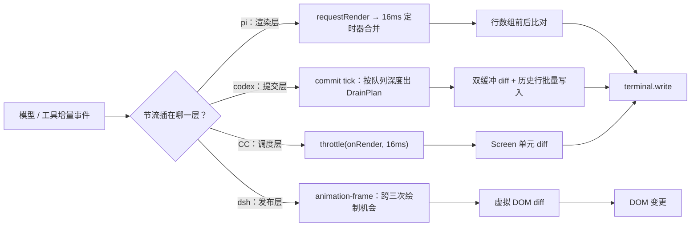

# 第 16 章：交互层与终端 UI 机制 —— 人怎么看见它

内核把一轮循环跑完，事情发生了，但**没有人知道**——除非有另一层把「发生了什么」变成「屏幕上多了什么」。本章就写这一层：从事件抵达界面，到字符落进终端（或 DOM）之间的全部机制。它不回答「界面长什么样」，只回答「界面凭什么在正确的时刻变、只变该变的那一块、并且在人想停的时候停得住」。

四家在这个位置上的分歧，比前面任何一章都大，而且分歧不在细节而在**工程路线的选择题**上。第一道题是渲染内核从哪来：pi 与 codex 各自造了一套终端渲染管线（前者手写帧调度加行数组比对，后者把 ratatui 的 `Terminal` 复制出来改成分支），dsh 与 CC 则借 React——但借法完全不同，dsh 用虚拟 DOM 直接落到浏览器 DOM，CC 用的是 React 官方的 `react-reconciler`，自己只写一份面向终端的 host config。第二道题是「增量什么时候算可以画」：codex 在**换行边界**上提交，CC 只显示到**最后一个换行**，pi 每来一个增量就整段重建、把节流完全交给渲染层，dsh 则给每种事件源声明一条**发布节奏**。第三道题是中断归谁：四家给出了三种完全不同的键位语义，其中 codex 明确把「双按退出」关掉了。

> **本层定位**：L14，外围区的**呈现面**。判据与第 15 章正好互补——第 15 章管「两端分属不同进程或不同程序」的通路（驱动面），本章管**同一进程内把状态变成画面**的那一半（呈现面）。因为渲染与交互天然在一个进程里，本章谈的每一件事都以「谁持有内容、谁决定重绘」为中心。
>
> **前置依赖**：01（主循环——呈现面上每一个状态的源头都是某一轮循环的事实）、05（消息事件与 Session 结构——UI 消费的事件流形状由它定义，增量事件的粒度直接决定本层能做出多细的更新）、07（任务与子 Agent——子 Agent 的进度在呈现面上有独立表达）、14（长时任务与后台作业——作业的输出与状态在呈现面上的形态由本层决定）。
>
> **分析对象**：
> - **pi** —— `packages/tui/src/*`（自研终端渲染引擎：帧调度、布局、差量绘制、终端能力探测）+ `packages/coding-agent/src/modes/*`（三种呈现形态的入口与事件消费）
> - **deepseek-harness** —— `packages/client/ui-renderer/*` + `packages/client/ui-slots/*` + `packages/client/ui-chat/*` + `packages/client/ui-conversation/*` + `packages/client/ui-tool/*`（浏览器侧渲染与增量的全部机制）+ `packages/api/session-controller/src/client/*`（事件窗口与投影存储）
> - **codex** —— `codex-rs/tui/*`（ratatui 分支、自管理 inline viewport、历史插入、commit tick）+ `codex-rs/terminal-detection/*`（终端与复用器探测）
> - **CC** —— `src/ink/*`（React host config 与终端 diff 管线）+ `src/screens/REPL.tsx` + `src/hooks/{useCancelRequest,useExitOnCtrlCD,useVimInput}.ts`（交互与中断）
>
> **跨层联动**：13 —— 见 2.2 与 5.4。第 15 章把「两端分属不同进程」的通路全部收走，于是本章只剩同一进程内那一段；两者在同一条链上首尾相接，边界靠**进程**划，不靠功能划。这条线在本章有个最具体的落点：dsh 的呈现面跑在浏览器进程里，与 Host 分属两个进程，因此它的「UI 机制」与「Web 协议」天然被进程边界切成两段，本章只取浏览器内的那一半（见 4.2.8）。同理，pi 的 `print-mode` 与 CC 的 `--print` 都是「把同一份会话事实投影成面向程序的行」——它们与 `--json` 一类管道出口共享全部上游，只是最后一步写给谁不同（见 2.2）。
>
> **易混点**：**「渲染」和「绘制」在本层是两件事**。渲染指把状态算成一份结构（行数组、虚拟 DOM、Cell 缓冲），绘制指把这份结构与终端（或 DOM）的实际内容对齐、只发出差异。四家的重绘策略差异几乎全在绘制侧，而提交边界差异全在渲染侧；把两者混为一谈会得出「codex 和 CC 都在做 diff 所以差不多」这类错误结论（实际两者的 diff 对象与 diff 时机都不同，见 5.2）。
>
> **门控提示**：本章 CC 侧涉及两处受开关控制的路径——语音输入（`[门控] feature('VOICE_MODE')`）与用户键位定制（GrowthBook 开关加员工白名单，见 4.4.6），凡摘录到这些路径的块均标 `[门控]` 并写出开关名。

---

## 一、核心结论速览

1. **渲染内核分两族，且两族内部也不同**：pi 与 codex 自建管线（pi 手写帧调度 + 行数组前后比对，`tui.ts:952`；codex 自绘 ratatui `Terminal` 分支、双缓冲 `buffers: [Buffer; 2]`，`custom_terminal.rs:141`），dsh 与 CC 借 React（dsh 落到浏览器 DOM，`ui-renderer/src/client/app.tsx:21`；CC 用官方 `createReconciler` 加自研 host config，`reconciler.ts:4` / `:404-405`）。
2. **节流落在四个不同层次**：pi 在**渲染层**（`MIN_RENDER_INTERVAL_MS = 16`，`tui.ts:477`）、CC 在**调度层**（`throttle(deferredRender, FRAME_INTERVAL_MS)`，`ink.tsx:213`，间隔同为 16ms）、dsh 在**发布层**（流式 chunk 声明 `animation-frame`，实测跨三次绘制机会才 flush，`assembly.ts:134-149`）、codex 在**提交层**（commit tick 按队列深度输出 `DrainPlan`，`streaming/commit_tick.rs:180`）。
3. **只有 codex 把已完成内容交还给终端本身**：用 DEC 滚动区把历史行写进终端原生 scrollback、viewport 停在底部（`insert_history.rs:204-216`），其余三家都自己持有整份可滚动内容；pi 的全屏模式为此引入 alt-screen 与自绘滚动条（`tui-alt-screen.ts:59-60`）。
4. **会话内容四家都以事件流为权威源，但「重建能力」不齐**：pi 有显式的整体重建入口 `rebuildChatFromMessages()`（`interactive-mode.ts:4107-4110`），codex 以完成事件反校流式拼接（`chatwidget/streaming.rs:194-195`），CC 把消息累积在 REPL 的本地数组里、只在启动时接受一次 `initialMessages` 注入（`REPL.tsx:1214`），dsh 走 resync 重建窗口并以 higher-seq-wins 合并投影（`sessions/session.ts:473-485`）。
5. **中断语义分歧最大，且 codex 主动放弃了两段式**：pi 是 500ms 内两按退出（`interactive-mode.ts:4116-4121`），CC 把三个键拆成三件事（`escape` 取消回合、`ctrl+c` 中断并兼双按退出、`ctrl+d` 退出，`defaultBindings.ts:40-41` 与 `:67`），codex 明确把双按退出关掉、改为「有可取消工作就发中断、否则直接退出」（`bottom_pane/mod.rs:233` + `chatwidget/interaction.rs:604-615`），dsh 在界面上根本没有中断键位——它是输入条上的一个按钮（`InputBar.tsx:302-316`）。

---

## 二、本层职责与边界

### 2.1 子职责拆解

| # | 子职责 | 要回答的问题 |
|---|---|---|
| 1 | 渲染内核与帧调度 | 状态变化如何变成一份可绘制结构？谁决定「这一帧要重画」，谁决定「只重画哪一块」？ |
| 2 | 流式增量的提交边界 | 模型与工具的增量以什么粒度抵达界面？在什么条件下这些增量才被允许变成可见内容？ |
| 3 | 工具调用的状态呈现 | 一次工具调用在界面上有哪些状态？状态由事件推进还是界面自己推断？长时运行的输出怎么显示？ |
| 4 | 中断交互 | 用户的「停」由哪些按键或控件捕获？捕获后是只改界面状态，还是要向会话层发出中止？ |
| 5 | 输入侧 | 编辑器提供到什么程度的多行与编辑能力？键位可不可配？补全、`@` 引用与粘贴（含图片）各走什么路径？ |
| 6 | 终端能力适配 | 颜色能力怎么判定与降级？何时进入 alt-screen？鼠标、超链接与图片协议各支持哪些？ |
| 7 | 视口与长内容 | 长会话与长工具输出放在哪里？是否虚拟化、是否折叠、怎么找回历史？ |
| 8 | 会话内容的权威性 | 界面展示的内容是自己攒的一份，还是事实源的投影？事实源更新（压缩、重连、切会话）时界面怎么跟上？ |

### 2.2 本层不管什么

- **不管「事件怎么跨进程传」**（那是 L13，见第 15 章）。本章从「事件已经到本进程」开始；一条通知用什么承载、要不要鉴权、断线怎么恢复，全部属于驱动面。
- **不管「工具怎么执行」**（那是 L2 与 L3）。本层只负责把执行过程中的状态画出来；工具内部的进程创建、沙箱、超时都不在本章范围内。
- **不管「权限怎么判」**（那是 L8，见第 08 章）。审批请求在界面上是一件**待处理事项**（codex 把它排进 `QueuedInterrupt` 队列，`chatwidget/interrupts.rs:50-57`；dsh 把它做成接管输入条的独立交互，`ui-approval/README.md:11`），但「该不该问」是权限层的判断。
- **不管「作业怎么被托管」**（那是第 14 章）。作业的输出在界面上是流式追加还是原地刷新属于本层，作业本身活在哪个进程属于第 14 章。
- **不管「遥测怎么发」**（那是 L15，见第 17 章）。界面上报了什么、以什么粒度上报，归贯穿观测层。
- **不管「会话怎么持久化」**（那是第 06 章）。本层是持久化内容的**消费方**；唯一例外是「界面是否需要能从事实源整体重建」这一问，它同时约束两层的接口形状（见 4.1.8 与 4.4.8）。
- **不管「面向程序的机器可读输出」**（那是 L13，见第 15 章）。这条边界上有个值得记下的特例：pi 的 `print-mode` 与 CC 的 `--print` 与各自的交互模式**共用同一份上游**（同一个会话事件流、同一套消息结构），差别只在最后一步写给谁——写给程序就属于驱动面，写给终端里的人就属于本章。pi 甚至为这件事在序列化层做了专门处理：JSON 模式下把 `message_update` 携带的**累积快照**剔除、只留 delta（`json-event.ts:46-59`），因为对程序而言「累积快照」是冗余的，而对渲染而言它恰恰是省去自己拼装的便利。

### 2.3 层次定位

本章的位置需要和上一章并排看，因为两者的分界线是本系列里最容易被含糊处理的一条：**判据是进程，不是功能**。

**图 16-1**：L13 与 L14 的并排定位。左栏是「同一进程内把状态变成画面」，右栏是「跨进程的请求与事件」；dsh 的呈现面跑在浏览器进程里，与 Host 之间隔着一次真实进程边界，因此它的 L14 只覆盖浏览器内的那一半。

```
              人  （终端里的开发者 / 浏览器里的使用者）
                     │                                           │
                     ┌───────────────────────────────────────────┐
                     │                                           │
  ┌────────────────────────────────────┐      ┌────────────────────────────────────┐
  │  L14  呈现面（本章）               │      │  L13  驱动面（第 15 章）           │
  │  同一进程内：状态 → 画面           │      │  跨进程 / 跨程序：请求与事件       │
  │  判据：两端同属一个进程            │      │  判据：两端分属不同进程            │
  │                                    │      │                                    │
  │  pi    tui/ + modes/interactive    │      │  pi    socket RPC / stdio NDJSON   │
  │  codex tui/ crate                  │      │  codex app-server + 四类承载       │
  │  CC    ink/ + screens/REPL         │      │  CC    --print / 远程桥 / 反向 MCP │
  │  dsh   浏览器内 React（web）       │      │  dsh   ACP / SDK / Web / Webhook   │
  └────────────────────────────────────┘      └────────────────────────────────────┘
  dsh 的呈现面在浏览器进程内 →
    ↔ 与 Host 之间正是 L13 的 Web 面；
      故本图左栏对它是「进程内」的那一半。

                     ▼────────────────────────────────────────────
              会话事件流 / 快照 / 增量（由 L13 或内核直接提供）
  ──────────────────────────────────────────────────────────────────────────────────
  ┌────────────────────────────────────────────────────────────────────────────────┐
  │ 内核区（01–10）：一轮循环及其子系统                                            │
  └────────────────────────────────────────────────────────────────────────────────┘
```

四家在这条分界线上的站位并不相同：pi、codex、CC 的呈现面与内核**同进程**（pi 与 CC 是同一个 Node 进程，codex 的 TUI 通过 app-server 事件流取数、两者仍是独立进程但与本章的渲染机制无关）；dsh 则**跨进程**，它的每一次界面更新都以上一层送来的一帧为前提。这决定了一件事：dsh 的渲染管线必须假设数据会迟到、会跳号、会重来，而另外三家的渲染管线可以假设数据是同步到手的。

四家的渲染管线骨架并列如下。注意每一条链路里「结构」与「绘制」的分界点位置不同，这正是 5.2 那张表的依据。

**图 16-2**：四家从事件到像素的完整链路。前两行是自建管线（pi / codex），后两行是借 React 的管线（dsh / CC）；每条链路的第三行标出该家的节流位置。

```
┌──────────────────────────────────────────────────────────────────────────────────────────────┐
│  pi —— 手写帧调度 + 行数组差量                                                               │
│    事件 → InteractiveMode → 组件树 → render(width) → 行数组                                  │
│    → 行数组前/后比对 → 同步输出包裹 → terminal.write                                         │
│    合帧：requestRender → nextTick → 16ms 定时器；键盘输入绕过节流                            │
├──────────────────────────────────────────────────────────────────────────────────────────────┤
│  dsh —— React 虚拟 DOM + 发布节奏声明                                                        │
│    事件帧 → 事件窗口 → assembler 增量折叠 → 快照 store（rAF 批）                             │
│    → React 虚拟 DOM → DOM 节点                                                               │
│    发布节奏：immediate / animation-frame（跨三次绘制机会）/ none                             │
├──────────────────────────────────────────────────────────────────────────────────────────────┤
│  codex —— 自绘 ratatui Terminal 双缓冲 + 历史插入                                            │
│    通知 → ChatWidget → StreamController → commit tick 排空 → HistoryCell                     │
│    → pending_history_lines → DEC 滚动区写入终端 scrollback                                   │
│    帧：FrameRequester 合并 → 120 FPS 限流 → 双缓冲 diff → swap_buffers                       │
├──────────────────────────────────────────────────────────────────────────────────────────────┤
│  CC —— React 官方 reconciler + 终端 diff 管线                                                │
│    事件 → REPL setMessages / streamingText → reconciler → yoga 布局                          │
│    → Output 操作队列 → Screen 单元数组 → diff → stdout.write                                 │
│    帧：throttle(onRender, 16ms)，leading + trailing                                          │
└──────────────────────────────────────────────────────────────────────────────────────────────┘
```

一次流式增量从源头走到画面，四家在链路上各选了一个位置插入节流。这张图把它们叠在同一张流程上，便于看出「节流位置」与「该层能看到的上下文」之间的关系——越靠后的节流点，可用的合并信息越少、但越靠近真正的绘制成本。

**图 16-3**：节流点在同一流程上的四种落位。



---

## 三、概念对齐表

四家在同一件事上用的词差异很大，尤其「一帧」「一份内容」「一次提交」这三个概念在四家的粒度都不同。空白格同样是结论：它表示该项目**没有**对应的独立概念。

| 概念 | pi | deepseek-harness | codex | CC |
|---|---|---|---|---|
| 渲染的基本单位 | 组件树的 `render(width)` 返回**行数组**（`tui.ts:952` 触发的 `doRender`） | React 元素树（`ui-renderer/src/client/app.tsx:21`） | `Buffer` 单元矩阵，双缓冲互换（`custom_terminal.rs:141` / `:460`） | `Screen` 单元数组（`screen.ts` 池化 Cell/Style/Char） |
| 「一帧」的触发 | `requestRender()` → `nextTick` → 16ms 定时器（`tui.ts:952-1004`） | store 变更通知 + 发布节奏声明（`store/src/index.ts:72-79`） | `FrameRequester::schedule_frame()` 合并后广播（`tui/frame_requester.rs:96`） | `throttle(onRender, 16)`（`ink.tsx:213`） |
| 差量对象 | 上一帧行数组 vs 新行数组（`tui-main-screen.ts:366-370`） | 无自建差量，交给虚拟 DOM | 前后 `Buffer` 单元 diff（`custom_terminal.rs:444`） | 前后 `Screen` 单元 diff（`log-update.ts:123`） |
| 增量的「可提交」判据 | 无独立判据，每个增量都重建组件（`assistant-message.ts:91-117`） | 每种事件源的发布节奏声明（`assistant.ts:316-321`） | markdown 流在**换行边界**提交（`markdown_stream.rs`） | 只显示到**最后一个换行**（`REPL.tsx:1505`） |
| 已完成内容的归宿 | 留在组件树里，随视口滚动 | 留在 DOM 里，语义锚点补偿滚动（`use-chat-viewport.ts:367-377`） | 写进**终端原生 scrollback**（`insert_history.rs:204-216`） | 留在 Screen 与终端屏里 |
| 长输出的上限 | 组件自行决定（bash 组件流式追加，`bash-execution.ts:80-117`） | 由折叠层级决定（整轮/分组/单条三层） | `TOOL_CALL_MAX_LINES = 5`，流式预览 1 MiB / 50 行（`exec_cell/render.rs:42`、`live_output.rs:15-18`） | `MAX_RENDERED_LINES = 10`（`FallbackToolUseErrorMessage.tsx:11`） |
| 工具调用的状态载体 | 组件字段 `executionStarted / argsComplete / isPartial / isError`（`tool-execution.ts:188-212`） | 由 block 形状推导的纯函数（`tool-call-model.ts:239-243`） | `ExecCell` 的字段推断（`exec_cell/model.rs:67`） | REPL 的 `inProgressToolUseIDs` 集合（`REPL.tsx:1417`） |
| 「被中断」的来源 | 组件与状态位同步推进（`interactive-mode.ts:3482-3519`） | **前端合成**，后端不显式给（`tool.ts:191-205`） | 由 `TurnStatus::Interrupted` 通知回收（`chatwidget/protocol.rs:464`） | 事件流写入 `inProgressToolUseIDs`（`hooks/useRemoteSession.ts:250-297`） |
| 中断键位 | Esc（上下文相关）+ Ctrl+C 两按 + Ctrl+D（`interactive-mode.ts:2965-2991`、`:4116-4129`） | 无键位，输入条上的 Stop 按钮（`InputBar.tsx:302-316`） | Esc / Ctrl+C（`keymap.rs:1662`），双按退出被关闭（`bottom_pane/mod.rs:233`） | `escape` / `ctrl+c` / `ctrl+d` 三键分工（`defaultBindings.ts:40-41`） |
| alt-screen | 全屏模式进入 `\x1b[?1049h`，退出时重放 transcript（`tui-alt-screen.ts:59-60`、`:383-401`） | 不适用（浏览器宿主） | 可在配置中关闭（`tui.rs:715`），owned transcript 走全屏（`tui.rs:963`） | `AlternateScreen` 组件用 `useInsertionEffect` 进出（`ink/components/AlternateScreen.tsx:33`） |
| 终端图片协议 | kitty 与 iTerm2 两种（`terminal-image.ts:193-202`） | 不适用（浏览器用 ``） | 未在 TUI crate 内实现图片编码 | 走 `ClickableImageRef` 一类的引用展示 |
| 界面内容的权威源 | 会话存储，可从 `buildContextEntries()` 整体重建（`interactive-mode.ts:4107-4110`） | Host 会话日志 + 快照，resync 重建窗口（`sessions/session.ts:473-485`） | app-server 为权威，完成事件反校流式结果（`chatwidget/streaming.rs:194-195`） | REPL 本地消息数组，启动时接受一次注入（`REPL.tsx:1214`） |

## 四、逐项目实现

### 4.1 pi —— 手写终端渲染引擎，三种形态共用一条事件流

> pi 在呈现面上是四家里唯一**自己造了整个终端渲染栈**的：从帧调度、盒模型布局、行数组差量，到颜色能力、鼠标协议与图片编码，全部在自己手里。代价是必须自己解决「终端的重绘成本」这个物理问题；收益是渲染与交互可以按会话的语义来设计，而不是围绕某个 UI 框架的更新模型。

#### 4.1.1 三种呈现形态与共用上游

pi 的 `modes/` 下并列着三种呈现形态，它们**不是三套系统，而是同一份会话事件流的三个投影**：

- `interactive/` —— 交互 TUI，订阅 `AgentSessionEvent` 增量更新组件树；
- `print-mode.ts` —— 单发型，`text` 模式只取末条 assistant 结果，`json` 模式逐事件序列化到 stdout；
- `rpc/` —— 这第三种属于第 15 章的驱动面（socket 与 stdio 两套）。

`print-mode` 的 JSON 分支把「同一份事件流」这件事写得最清楚：它直接 `session.subscribe`，对每个事件调一次 `toJsonEvent` 再写一行，并额外挂一条背压订阅——事件消费速度由 stdout 的写入进度决定。

`packages/coding-agent/src/modes/print-mode.ts:108-118`
```ts
		unsubscribe = session.subscribe((event) => {
			if (mode === "json") {
				writeRawStdout(`${JSON.stringify(toJsonEvent(event))}\n`);
			}
		});
		unsubscribeBackpressure =
			mode === "json"
				? session.agent.subscribe(async () => {
						await waitForRawStdoutBackpressure();
					})
				: undefined;
```

值得注意的是 JSON 投影对事件本身的处理：`message_update` 携带的**累积快照**被显式剥掉，只留 delta。这一层剥除恰好说明交互模式在做什么——它的渲染可以直接拿快照用，而给程序看时快照是冗余的。

`packages/coding-agent/src/modes/json-event.ts:46-59`
```ts
export function toJsonEvent(event: AgentSessionEvent): JsonAgentSessionEvent {
	if (event.type !== "message_update") {
		return event;
	}
	if (event.message.role !== "assistant") {
		throw new Error("message_update message is not an assistant message");
	}

	return {
		type: "message_update",
		usage: event.message.usage,
		assistantMessageEvent: toJsonAssistantMessageEvent(event.assistantMessageEvent),
	};
}
```

#### 4.1.2 渲染内核：一个基类管帧调度，两个子类管绘制

`TuiBase` 只做三件事：收下「需要重画」的请求、把多个请求合并成一帧、调用子类实现的 `doRender()`。合帧用的是「`nextTick` 登记 + 16ms 定时器」的组合，`renderRequested` 标志保证同一帧内重复请求只登记一次。

`packages/tui/src/tui.ts:952-961`
```ts
	requestRender(force = false): void {
		if (force) {
			this.resetRenderState();
			this.requestImmediateRender();
			return;
		}
		if (this.renderRequested) return;
		this.renderRequested = true;
		process.nextTick(() => this.scheduleRender());
	}
```

`MIN_RENDER_INTERVAL_MS = 16`（`tui.ts:477`）是节流窗口；`scheduleRender()`（`tui.ts:986`）按「距上次绘制已经过了多久」算出剩余延迟。**键盘输入绕开这条节流路径**：焦点组件的 `handleInput` 之后直接走 `requestImmediateRender()`，源码注释理由是「即使 `setTimeout(0)` 也可能吃掉一整个 16ms 刻度」（`tui.ts:1078-1080`）。

两个渲染子类对应两种屏幕形态，由 `tuiMode` 选择：

- `TuiMainScreen` —— 主屏模式，内容随终端正常滚动；
- `TuiAltScreen` —— 全屏模式，用 alt-screen 换取对整屏的控制权。

选择发生在组装点，且两种形态的构造参数不同（全屏模式额外接搜索高亮样式、选中复制、右键粘贴等回调）：

`packages/coding-agent/src/modes/interactive/tui-renderer.ts:21-47`
```ts
export function createInteractiveTui(options: InteractiveTuiOptions): TuiMainScreen | TuiAltScreen {
	const terminal = options.terminal ?? new ProcessTerminal();
	if (options.tuiMode === "fullscreen") {
		const styleSearchMatch = (text: string) => theme.bg("searchMatchBg", theme.fg("searchMatchText", text));
		return new TuiAltScreen(terminal, options.showHardwareCursor, options.logDirectory, {
			searchMatchStyle: (text) => theme.underline(styleSearchMatch(text)),
			searchCurrentMatchStyle: (text) => theme.bold(theme.inverse(styleSearchMatch(text))),
			...
		});
	}
	return new TuiMainScreen(terminal, options.showHardwareCursor, options.logDirectory);
}
```

主屏的差量做得非常直接：把上一帧的行数组与新行数组逐行比对，得到 `firstChanged` 与 `lastChanged`，然后只重写这段区间。没有脏标记、没有双缓冲，只有一份 `previousLines` 影子副本。

`packages/tui/src/tui-main-screen.ts:362-378`
```ts
		// Find first and last changed lines
		let firstChanged = -1;
		let lastChanged = -1;
		const maxLines = Math.max(newLines.length, this.previousLines.length);
		for (let i = 0; i < maxLines; i++) {
			const oldLine = i < this.previousLines.length ? this.previousLines[i] : "";
			const newLine = i < newLines.length ? newLines[i] : "";

			if (oldLine !== newLine) {
				if (firstChanged === -1) {
					firstChanged = i;
				}
				lastChanged = i;
			}
		}
```

差量有一条硬边界：**如果首个变化行落在上一帧视口之上，差量就没法只靠重写解决，必须整屏重绘**（`tui-main-screen.ts:451`）。这解释了手写差量的成本结构——省下的是同一屏内的重绘，省不下内容已经滚出视口之后的修正。真正写入终端时，整段被 `\x1b[?2026h` / `\x1b[?2026l`（同步输出）包起来，再经 `BoundedTerminalWriter` 分块送出，避免大帧撕裂（`tui-main-screen.ts:459-460`）。

全屏模式走另一条路：逐行 diff 加光标寻址重写，并且比对对象是**整屏行数组**而非滚动内容。

`packages/tui/src/tui-alt-screen.ts:1726-1729`
```ts
		for (let row = 0; row < height; row++) {
			if (!fullRedraw && !imagesNeedRedraw && screen[row] === this.previousScreen[row]) continue;
			buffer += `\x1b[${row + 1};1H${clearRowsBeforeKittyImages ? "" : "\x1b[2K"}${preparedKittyScreen.lines[row] ?? ""}`;
		}
```

#### 4.1.3 流式增量：没有提交边界，靠整段重建加缓存兜底

pi 在事件层不做任何合并：`_emit` 是同步扇出（`core/agent-session.ts:831-835`），`message_update` 每来一次就重建一次流式组件的内容容器。

`packages/coding-agent/src/modes/interactive/interactive-mode.ts:3401-3434`
```ts
			case "message_update":
				if (this.streamingComponent && event.message.role === "assistant") {
					this.streamingMessage = event.message;
					this.streamingComponent.updateContent(this.streamingMessage, true);
					...
				}
				break;
```

`updateContent` 的做法是**清空再重建**——它不区分「这次只是多了一个词」，每次都把内容容器清掉、按 `message.content` 逐块重新挂子组件：

`packages/coding-agent/src/modes/interactive/components/assistant-message.ts:91-201`
```ts
	updateContent(message: AssistantMessage, isStreaming = this.isStreaming): void {
		this.lastMessage = message;
		this.isStreaming = isStreaming;

		// Clear content container
		this.contentContainer.clear();

		const hasVisibleContent = message.content.some(
			(c) => (c.type === "text" && c.text.trim()) || (c.type === "thinking" && c.thinking.trim()),
		);

		...
	}
```

于是「每个增量都重建」的成本被压到两层缓存下面：一是 markdown 组件的「文本与宽度全等才命中」，二是更上层 16ms 的合帧。markdown 的缓存判据只有三个量——文本、宽度、缓存行数组：

`packages/tui/src/components/markdown.ts:277-369`
```ts
	render(width: number): string[] {
		// Check cache
		if (this.cachedLines && this.cachedText === this.text && this.cachedWidth === width) {
			return this.cachedLines;
		}

		...
	}
```

流式渲染有一个专属补丁：解析前先把**未闭合的代码围栏**裁掉，否则开栏字符到达与闭栏字符到达之间，代码块会在「有框」与「无框」之间反复跳变（`markdown.ts:160-161` 的注释与 `trimPartialClosingFences(tokens)`，`markdown.ts:302`）。

#### 4.1.4 工具调用的状态呈现：事件推进，组件只记状态位

工具行有两个信息源：`toolCall` 内容块首次出现时建组件（`interactive-mode.ts:3406-3431`），之后分别由 `tool_execution_start` / `tool_execution_update` / `tool_execution_end` 推进。组件自己不轮询，只暴露几个幂等的状态推进方法：

`packages/coding-agent/src/modes/interactive/components/tool-execution.ts:188-198`
```ts
	markExecutionStarted(): void {
		this.executionStarted = true;
		this.updateDisplay();
		this.ui.requestRender();
	}

	setArgsComplete(): void {
		this.argsComplete = true;
		this.updateDisplay();
		this.ui.requestRender();
	}
```

界面上被区分开的四种状态是「参数还在流」「参数齐全待执行」「执行中」「已结束」，分别由 `isPartial`、`argsComplete`、`executionStarted` 与结果对象共同表达。**失败与中止走同一条收尾**：`message_end` 到来时把仍未结束的 pending 工具统一标成错误（`interactive-mode.ts:3451-3461`）。

长时工具的指示器不是被动等待，而是自带定时器：`Loader` 内部用 `setInterval` 驱动帧，每帧调一次 `requestRender`——也就是说 spinner 的转动本身就是一类渲染请求源。

`packages/tui/src/components/loader.ts:77-86`
```ts
	private restartAnimation(): void {
		this.stop();
		if (this.frames.length <= 1) {
			return;
		}
		this.intervalId = setInterval(() => {
			this.currentFrame = (this.currentFrame + 1) % this.frames.length;
			this.updateDisplay();
		}, this.intervalMs);
	}
```

bash 组件的状态更完整一点（`running` / `complete` / `cancelled` / `error` 四值，`bash-execution.ts:24`），输出以 `appendOutput` 流式追加（`bash-execution.ts:80-83`），结束时停掉 loader 并按退出码落状态：

`packages/coding-agent/src/modes/interactive/components/bash-execution.ts:80-83`
```ts
	appendOutput(chunk: string): void {
		// Strip ANSI codes and normalize line endings
		// Note: binary data is already sanitized in tui-renderer.ts executeBashCommand
		const clean = stripAnsi(chunk).replace(/\r\n/g, "\n").replace(/\r/g, "\n");

...
	}
```

#### 4.1.5 中断交互：Esc 是上下文相关的，Ctrl+C 与 Ctrl+D 有明确分工

Esc 不是「取消」而是**一个按当前状态分派的动作**：正在流式输出就收回排队消息并向会话发中止，bash 在跑就中止 bash，处于 bash 输入模式就退出该模式，编辑器为空则进入「双击」判定。

`packages/coding-agent/src/modes/interactive/interactive-mode.ts:2965-2991`
```ts
		this.defaultEditor.onEscape = () => {
			if (this.session.isStreaming) {
				this.restoreQueuedMessagesToEditor({ abort: true });
			} else if (this.session.isBashRunning) {
				this.session.abortBash();
			} else if (this.isBashMode) {
				this.editor.setText("");
				this.isBashMode = false;
				this.updateEditorBorderColor();
			} else if (!this.editor.getText().trim()) {
				...
			}
		};
```

同一段里还有第三条分支：编辑器为空时，500ms 内第二次 Esc 打开 tree 或 fork 选择器（`interactive-mode.ts:2974-2988`）。

Ctrl+C 与 Ctrl+D 的分工则是「两按退出」与「立即退出」：

`packages/coding-agent/src/modes/interactive/interactive-mode.ts:4116-4129`
```ts
	private handleCtrlC(): void {
		const now = Date.now();
		if (now - this.lastSigintTime < 500) {
			void this.shutdown();
		} else {
			this.clearEditor();
			this.lastSigintTime = now;
		}
	}

	private handleCtrlD(): void {
		// Only called when editor is empty (enforced by CustomEditor)
		void this.shutdown();
	}
```

「中止」本身是**软硬两段**：`abort()` 先置一个协作式软标记（在轮次边界被检查），再对当前这一轮发起 `AbortController` 硬中止，最后等到空闲。

`packages/coding-agent/src/core/agent-session.ts:2075-2085`
```ts
	async abort(): Promise<void> {
		if (this._isAgentRunActive) {
			this._agentRunAbortRequested = true;
		}
		this.abortRetry();
		this.abortCompaction();
		this.abortBranchSummary();
		if (this._isBeforeSettle) this._abortDuringBeforeSettle = true;
		this.agent.abort();
		await this.waitForIdle();
	}
```

硬信号落在 agent 层，一行：

`packages/agent/src/agent.ts:338-340`
```ts
	abort(): void {
		this.activeRun?.abortController.abort();
	}
```

#### 4.1.6 输入侧：编辑器是一等公民，粘贴被折叠成原子段

`components/editor.ts` 有两千多行，提供多行编辑、撤销栈（`undo-stack.ts`）、kill-ring（`kill-ring.ts`）、按词导航（`word-navigation.ts`）、括号粘贴与自动补全。

最值得抄的是**大段粘贴的折叠**：粘贴进来的内容不在缓冲区里展开，而是替换成一个标记，使光标移动、删除、换行都把这段内容当作一个原子单位；提交时才展开。

`packages/tui/src/components/editor.ts:1085-1092`
```ts
	private expandPasteMarkers(text: string): string {
		let result = text;
		for (const [pasteId, pasteContent] of this.pastes) {
			const markerRegex = new RegExp(`\\[paste #${pasteId}( (\\+\\d+ lines|\\d+ chars))?\\]`, "g");
			result = result.replace(markerRegex, () => pasteContent);
		}
		return result;
	}
```

键位是可配置的：`KeybindingsManager` 合并内置定义与用户绑定，并在重建时统计冲突（`keybindings.ts:237-267`）。自动补全默认同步发起，只在「附件类前缀」（`@`、`#` 一类）上防抖 20ms，Tab 与强制触发为 0ms；乱序返回用「起始 token 加 `AbortController`」丢弃：

`packages/tui/src/components/editor.ts:2303-2312`
```ts
		const debounceMs = this.getAutocompleteDebounceMs(options);
		if (debounceMs > 0) {
			this.autocompleteDebounceTimer = setTimeout(() => {
				this.autocompleteDebounceTimer = undefined;
				void this.startAutocompleteRequest(startToken, options);
			}, debounceMs);
			return;
		}

		void this.startAutocompleteRequest(startToken, options);
```

图片粘贴的策略是「落盘 + 插路径」：剪贴板里的图片编码后写入临时文件，再把路径插到光标处，而不是把二进制塞进输入缓冲区（`interactive-mode.ts:3047-3066`）。

#### 4.1.7 终端能力适配与视口

能力探测是**环境变量查表加运行期询问**两步。查表覆盖 kitty、ghostty、wezterm、warp、iTerm2 等已知终端，命中即确定图片协议与超链接支持；未知终端一律**保守降级**——关掉超链接，因为「在不认识 OSC 8 的终端上，链接文字会连同 URL 一起消失」。

`packages/tui/src/terminal-image.ts:128-132`
```ts
	// Unknown terminal: be conservative. OSC 8 is rendered invisibly as "just
	// text" on terminals that swallow it, which means the URL disappears from
	// the rendered output. Default to the legacy `text (url)` behavior unless we
	// have positively identified a hyperlink-capable terminal above.
	return { images: null, trueColor: hasTrueColorHint, hyperlinks: false };
```

颜色能力只分「truecolor 与否」一档，没有 256 色与 16 色的中间态。运行期还会反向提问：写 `\x1b]11;?\x07` 询问背景色、写 `\x1b[?996n` 询问明暗方案，回复由正则解析（`tui.ts:1426`、`:1453`）。

鼠标支持在**复用器下主动降级**：tmux / zellij / screen 下只启用按钮与滚轮跟踪，不开全量移动跟踪，理由是「复用器转发每一次指针移动会拖慢」。

`packages/tui/src/tui-alt-screen.ts:355-362`
```ts
		const mouseSequence =
			process.env.TMUX !== undefined ||
			process.env.ZELLIJ !== undefined ||
			process.env.STY !== undefined ||
			term.startsWith("tmux") ||
			term.startsWith("screen")
				? ENABLE_BUTTON_MOTION_MOUSE
				: ENABLE_ALL_MOTION_MOUSE;
```

视口**不做虚拟化**：滚动容器把子组件完整渲染出来，真正的裁剪发生在绘制阶段——逐行只画落在裁剪矩形内的部分。

`packages/tui/src/layout.ts:330-377`
```ts
function paintBox(box: LayoutBox, screen: string[], totalWidth: number): void {
	if (box.lines) {
		const offset = box.lineOffset ?? 0;
		const firstRow = Math.max(box.rect.y, box.clip.y, 0);
		const lastRow = Math.min(box.rect.y + box.rect.height, box.clip.y + box.clip.height, screen.length);
		for (let row = firstRow; row < lastRow; row++) {
			...
		}
	}

	...
}
```

全屏模式为此付出额外代价：内容行始终被完整物化，只是没画出来；同时它用底部固定 dock 的方式保证输入区永远可见——transcript 占可增长的主区，编辑器、状态与页脚固定在底部（`chat-viewport.ts:22-45`）。搜索是全屏模式独有的能力，实现方式是给当前 transcript 行建一份可复用索引、行内容未变则跳过重建（`alt-screen-search.ts:162-169`）。

#### 4.1.8 会话内容的权威性：会话存储是唯一事实源，界面可整体重建

pi 的组件树不是权威。任何时候都可以把它清空，再从会话存储重新派生一遍——这就是 `rebuildChatFromMessages` 存在的意义，也是压缩、切换会话、fork 三类边界都能安全落地的原因。

`packages/coding-agent/src/modes/interactive/interactive-mode.ts:4107-4110`
```ts
	private rebuildChatFromMessages(): void {
		this.chatContainer.clear();
		this.renderSessionEntries(this.sessionManager.buildContextEntries());
	}
```

`pendingTools` 是**界面侧的临时映射**（「现在有哪些工具行正在跑」），不是事实源的一部分：`tool_execution_end` 一到就从映射里删掉（`interactive-mode.ts:3515-3519`）。界面侧真正持久的东西只有「按什么顺序渲染哪些 entry」这一层投影规则。

### 4.2 deepseek-harness —— 宿主在浏览器里，渲染靠注册表，节奏靠声明

> dsh 在呈现面上是四家里最特殊的一个：**它的呈现面不在终端里**。源码中的渲染宿主只有浏览器 React；终端在这个仓库里出现两次，两次都不是「TUI 宿主」——一次是 headless 的一次性打印，一次是浏览器页面内嵌的 xterm 面板。这带来一个直接后果：它的渲染管线必须从一开始就假设数据会迟到、会跳号、会重来，因此它是四家里唯一把「重来」写成正式状态机的一层。

#### 4.2.1 呈现形态：三种宿主，终端 TUI 不在本仓库源码里

启动器支持的入口形态写在它的 README 表格里，其中与呈现直接相关的三种是：`web`（浏览器）、`headless`（跑完一个会话、打印最终答案、退出）、以及嵌在 Electron 里的桌面端。终端 TUI 只作为**示例**出现，前提是那个 profile 已被安装：

`apps/cli/README.md:17-22`
```markdown
| `dsh web` | Boot the Web profile. |
| `dsh plugin --profile <name> <pnpm args>` | Manage a profile's plugins by forwarding to pnpm in the profile directory. |

The invoking directory is the default workspace root. The `web`, `headless`, `sdk`, `sdk-minimal`, and `acp` profiles auto-initialize on first use from shipped templates. Create another profile at an unused, non-shipped name with `--from-default-profile`, or initialize a base-backed profile through `dsh plugin`. The `desktop` name is reserved for the Electron-owned profile, so the CLI rejects boot, config-dump, and plugin-management requests for it.

## App arguments
```

那句示例是 `dsh --profile tui --resume <id>`，注释直接写「假设 tui profile 已安装」。桌面端则是**同一份 Web 应用套一层 Electron 壳**，不是另写一套界面——README 首句就说它把打包好的 Web 入口直接加载进 Electron。

`apps/desktop/README.md:5`
```markdown
The desktop application is an Electron shell around the complete dsh Web application. An Electron RunAsNode child starts the shared profile runner, and Electron immediately loads the packaged Web entry at `dsh-app://app/`. Its shared loading page waits for Host boot injections, then starts the client without navigating to another document. Electron forwards application HTTP requests to the authenticated Web Host; WebSocket streams connect to that Host with credentials attached only for the owned application window. Node IPC carries boot injections, readiness, and shutdown. Desktop defaults to port `19387`, separate from Web’s `3080`; a `webserver.config.port` patch can override it.
```

Web 宿主的启动链很短：装配所有 client 插件、挂载应用、替换根槽位的渲染器。

`packages/client/web/src/mount.ts:20-22`
```ts
const mounted = ctx.inject(['uiRenderer'], (scope) => {
  scope.effect(() => scope.uiRenderer.mount(container), 'web boot: application mount')
})
```

**三种宿主之间没有共享的「会话视图模型」**：它们共享的只有 Host 侧的会话事件日志与 Remote 协议。浏览器与 Electron 共用同一套前端代码（后者是前者加壳），headless 则完全不做渲染。这也是本章把 dsh 的边界画在「浏览器进程内」的原因（见 2.3）。

#### 4.2.2 渲染管线：槽位注册表把「这块内容交给谁画」变成一次查表

dsh 的渲染管线本身是标准 React 虚拟 DOM，真正的机制在**如何决定每块内容由哪个组件渲染**。全应用只有一个 ctx 级渲染入口——

`packages/client/ui-renderer/src/client/app.tsx:19-22`
```ts
export function buildRenderApp(deps: AssemblyDeps): () => ReactNode {
  const { ctx } = deps
  return () => ctx.slots.renderSlot('root', {})
}
```

而槽位与渲染器之间的契约由 `ui-slots` 单独定义，且**刻意不依赖 React**——它只是一个注册表，React 侧通过实现 `SlotRenderer` 接上：

`packages/client/ui-slots/src/renderer.ts:259-268`
```ts
/** The installation contract between the `ui-renderer` SlotRegistry and its React renderer. */
export interface SlotRenderer {
  /**
   * Render the root slot tree over the host API (the only ctx-level entry).
   * @param host - the installing service's host API.
   * @param ownerProps - owner props from the shell's renderSlot('root', ...) call.
   * @returns the rendered tree.
   */
  renderRoot(host: SlotRendererHost, ownerProps: object): ReactNode
}
```

槽位有四种形态，其中与「消息 → 渲染器」最相关的是 `keyed`：按 `entryKey` 查注册表，命中则渲染、未命中则回落 `fallback`；如果有人占了同一个 key 但拿不到条目，则渲染一个**死单元**而不是回落——这个细节保证「被替换掉的渲染器」不会静默降级成错误的兜底视图。

`packages/client/ui-renderer/src/client/scoped-slots.tsx:1178-1185`
```tsx
  if (spec.kind === 'keyed') {
    const entry = host.entriesOfSlot(slotKey).find(e => e.options.key === opts?.entryKey)
    if (!entry) {
      const occupied = entries.some(e => e.options.key === opts?.entryKey)
      return occupied ? deadCell() : <>{opts?.fallback ?? null}</>
    }
    return guarded(entry, entryKeyOf(entry))
  }
```

注册侧就是几行登记，每种消息类型一次：

`packages/client/ui-chat/src/client/chat/register-node-renderers.ts:30-35`
```ts
  ctx.slots.inject('conversation.chat.node', () => ctx.slots.register(
    { name: 'conversation.chat.node', key: 'user', locale: NS }, UserMessageNodeView))
  ctx.slots.inject('conversation.chat.node', () => ctx.slots.register(
    { name: 'conversation.chat.node', key: 'steering', locale: NS }, UserMessageNodeView))
  ctx.slots.inject('conversation.chat.node', () => ctx.slots.register(
    { name: 'conversation.chat.node', key: 'context', locale: NS }, ContextMessageNodeView))
```

工具视图走同一条路：`tool.call.toolview` 也是一个 keyed 槽位，未注册的工具名回落到通用工具行（`ui-tool/.../contract/slots.ts:21`）。**这套设计的收益是可扩展性**——新增一种消息或一种工具不需要碰渲染核心；代价是渲染路径变成间接的，读代码时必须先找到注册点。

#### 4.2.3 流式增量：把「多久发布一次」写成每种事件源的声明

dsh 的增量在折叠阶段就是**原地累加**：同一 block 索引上把新文本拼到旧文本后面，而不是每次替换整块。

`packages/client/ui-chat/src/client/conversation-nodes/assistant.ts:105-116`
```ts
    case 'text-delta': {
      const previous = blocks[chunk.index]
      changedIndex = chunk.index
      previousVisible = blockIsVisible(previous)
      blocks[chunk.index] = { kind: 'text', text: (previous?.kind === 'text' ? previous.text : '') + chunk.text }
      break
    }
    case 'reasoning-delta': {
      const previous = blocks[chunk.index]
      changedIndex = chunk.index
      previousVisible = blockIsVisible(previous)
      blocks[chunk.index] = { kind: 'reasoning', text: (previous?.kind === 'reasoning' ? previous.text : '') + chunk.text }
      break
    }
```

真正的机制度在**发布节奏**上：每种事件源在定义里声明自己该以什么节奏发布，`assistant/live-chunk` 按内容类型细分——usage 与 finish 不发布，其余走 `animation-frame`。

`packages/client/ui-chat/src/client/conversation-nodes/assistant.ts:316-321`
```ts
  publication: (match) => {
    if (match.event.type === 'step/start') return 'none'
    if (match.event.type !== 'assistant/live-chunk') return 'immediate'
    const type = match.event.data.chunk.type
    return type === 'usage' || type === 'finish' ? 'none' : 'animation-frame'
  },
```

`animation-frame` 这个节奏的实现值得单独看一眼：它不是「下一个动画帧」，而是**连续三个绘制机会**，也就是把高频更新压到同一帧里合并。

`packages/client/ui-conversation/src/client/conversation/assembly.ts:131-148`
```ts
  private publish(publication: ConversationPublication): void {
    if (publication === 'none') return
    if (publication === 'animation-frame' && typeof requestAnimationFrame === 'function') {
      if (this.frame !== undefined) return
      // Cross three paint opportunities before publishing high-frequency stream updates.
      this.frame = requestAnimationFrame(() => {
        this.frame = requestAnimationFrame(() => {
          this.frame = requestAnimationFrame(() => {
            this.frame = undefined
            this.flush()
          })
        })
      })
      return
    }
    this.cancelFrame()
    this.flush()
  }
```

更下层还有一层批：快照 store 的订阅通知被压成「每个动画帧一次、N 次变更等于 1 次通知」，在没有 rAF 的环境（Node 单元测试）退化为微任务批。

`packages/client/store/src/index.ts:71-88`
```ts
/** Batches subscriber notification into one flush per animation frame. */
function rafBatch(notify: () => void): () => void {
  // Fall back to microtask batching where rAF is absent (node unit tests);
  // both preserve the N-changes=1-notification contract within a tick.
  const schedule: (fn: () => void) => void =
    typeof requestAnimationFrame === 'function'
      ? (fn) => { requestAnimationFrame(() => { fn() }) }
      : (fn) => { queueMicrotask(fn) }
  let scheduled = false
  return () => {
    if (scheduled) return
    scheduled = true
    schedule(() => {
      scheduled = false
      notify()
    })
  }
}
```

三层节奏叠起来是「事件源声明 → 装配层合帧 → store 批通知」，与另外三家把节流写死在渲染器里的做法形成明显对比（见 5.2）。

#### 4.2.4 工具调用的状态呈现：纯函数推导，中断由前端合成

界面上工具行只有四种状态：运行中、成功、出错、被停。它们由一个纯函数从 block 的形状推导出来，不做任何状态机。

`packages/client/ui-tool/src/client/tool/models/tool-call-model.ts:237-270`
```ts
export function toolRowModel(toolName: string, block: ToolCallBlock, cwd?: string, home?: string): ToolRowModel {
  const variant = classifyTool(toolName)
  const done = 'kind' in block
  const argsRaw = (done ? block.call?.argsRaw : block.argsRaw) ?? ''
  const state: ToolRowState = !done ? 'running'
    : block.error?.code === 'interrupted' ? 'stopped'
      : block.isError ? 'error' : 'ok'

  ...
  return {
    variant,
    titleKey: toolTitleKey ?? VARIANT_TITLE_KEYS[variant],
    summary,
    filePath: deriveFilePath(variant, argsRaw),
    bodyRaw,
    output,
    errorSummary,
    autoReviewDenial: deriveAutoReviewDenial(block),
    state,
  }
}
```

关键在 `interrupted` 这个错误码**不是后端发来的**。后端只给 `tool/call` 与 `tool/result` 两类事件；当一轮或一步已经关闭、而某个调用始终没有拿到结果时，前端会替它合成一条结果。

`packages/client/ui-chat/src/client/conversation-nodes/tool.ts:191-205`
```ts
  const projected: ToolCallBlock = 'kind' in block || interruptedAt === undefined
    ? sameReferences(block.subCalls, children) ? block : { ...block, subCalls: children }
    : {
      kind: 'tool-result',
      seq: interruptedAt.seq + CHAT_SYNTHETIC_SEQ_OFFSETS.interruptedFollowup,
      time: interruptedAt.time,
      callId: block.callId,
      ...block.parentCallId === undefined ? {} : { parentCallId: block.parentCallId },
      call: { name: block.name, argsRaw: block.argsRaw },
      callTime: block.time,
      content: [],
      isError: true,
      error: { name: 'Interrupted', code: 'interrupted' },
      subCalls: children,
    }
```

合成的判据是「所在 step 或 turn 已经 closed」——也就是说，**「被中断」在 dsh 里是渲染层从「上下文已经收场但调用没有结果」这一事实推出来的**，不是后端声明的事实。这条设计在事件流不完备时很有用（界面永远能把悬空的调用收干净），代价是前端必须准确理解 step 与 turn 的收场语义（`tool.ts:214-221`）。

运行期的进度呈现则相当克制：工具行没有百分比、没有输出增量，只有标题与摘要的微光效果；长时输出的展示被交给作业通道与内嵌终端面板，而不是塞进会话流（`ui-jobs/README.md:11`）。

#### 4.2.5 中断交互：输入条上的按钮，且不做乐观更新

dsh 在键盘上没有中断绑定。中断是输入条主按钮的一次角色切换：运行中且没有子代理接管时，主按钮从「发送」变成「停止」。

`packages/client/ui-conversation/src/client/skeleton/InputBar.tsx:302-321`
```tsx
  const primaryStops = running && subagent === null && (empty || blocked !== undefined)
  // Disabled native buttons may omit mouseleave; their tooltip must close from state.
  const primaryDisabled = primaryStops ? stop === undefined : empty || disabled || machineBusy || uploadsPending
  const interruptible = running && continuable
  const primarySubmitMode = resolveSubmitMode(busyEnter, running, 'enter', steeringAvailable)
  const plainMessageDraft = !empty && input?.phase === 'plain' && !draft.trimStart().startsWith('/')
  const primaryLabel = primaryStops
    ? t('input.stop')
    : running && steeringAvailable && !disabled && !uploadsPending && plainMessageDraft
      ? t(primarySubmitMode === 'steer' ? 'input.send.steer' : 'input.send.queue')
      : t('input.send')
  const onPrimary = (): void => {
    if (primaryStops) {
      stop?.()
      return
    }
    if (keyboard === undefined) return // absent machine: the button is disabled
    /* v8 ignore next -- defensive: the primary button is disabled for empty, disabled, and pending-upload states. */
    if (!empty && !disabled && !machineBusy && !uploadsPending) keyboard.submit(primarySubmitMode)
  }
```

链路是三层转发：输入条 → 会话服务的 `cancel()` → Remote 的 `session.cancel`。服务端返回 `{ accepted: true }`，**前端不做本地乐观更新**——「这一轮真的结束了」这件事要等 `turn/end` 事件回流后才被观察到；取消失败只写进 `promptError`。

`packages/api/session-controller/src/client/sessions/session.ts:337-351`
```ts
  async cancel(): Promise<RemoteResult<{ accepted: true }>> {
    const address = this.address
    const result = address !== undefined
      ? await this.remote.subagents.interruptByParent(
        address.childSessionId,
        address.parentSessionId,
        'continuable',
      )
      : await this.remote.session.cancel({ sessionId: this.sessionId })
    if (!result.ok) {
      this.promptError = { op: 'stop', error: result.error }
      this.notifier.markDirty()
    }
    return result
  }
```

这与另外三家「按键立刻改界面」的直觉相反，但在跨进程且事件可能迟到的宿主里是更稳的选择：界面只反映被确认过的事实。

#### 4.2.6 输入侧：纯核的触发符检测与两条附件通道

输入框是多行富文本编辑器（contenteditable 加自定义 keymap 与投影），不是 `textarea`。触发符检测被抽成一个**纯函数**，只依赖草稿文本、光标位置与一个「守卫层级」——冻结态直接拒绝、已被认领的 `/` 跳过、URL 里的 `/` 因边界判定被屏蔽。

`packages/client/ui-input-trigger/src/core/detect.ts:48-76`
```ts
export const detectTrigger: DetectTrigger = (draft, caret, guard) => {
  if (guard.tier === 'frozen') return null
  const at = activeAtToken(draft, caret)
  if (at !== undefined) {
    const start = caret - at.prefix.length
    return {
      trigger: '@',
      query: at.query,
      quoted: at.quoted,
      position: draft.search(/\S/) === start ? 'leading' : 'inline',
      span: { start, end: caret, draftRev: 0 },
    }
  }
  for (let i = caret - 1; i >= 0; i--) {
    ...
  }
  return null
}
```

附件按 MIME 分成两条路：图片留在草稿注册表里（本地对象 URL 预览，随提示一起发 base64），其他文件进后台并发上传队列（可重试、可中断）。这个分流发生在一次 `map` 里，一眼能读完。

`packages/client/ui-conversation/src/client/service.ts:309-326`
```ts
  createDrafts(sessionId: SessionId, files: readonly File[]): readonly ComposerAttachment[] {
    return files.map((file) => {
      if (isImageMediaType(file.type)) {
        const attachment = browserDraftAttachment(file)
        this.draftAttachments.set(attachment.id, attachment)
        probeDimensions(attachment)
        return attachment
      }
      const attachment: ComposerFileAttachment = {
        kind: 'file',
        id: randomUUID() as DraftAttachmentId,
        file,
      }
      this.draftAttachments.set(attachment.id, attachment)
      this.beginFileUpload(sessionId, attachment)
      return attachment
    })
  }
```

#### 4.2.7 视口与折叠：会话流不虚拟化，轨迹视图才虚拟化

会话流用的是普通 DOM 行加**语义锚点补偿**：加载历史页时先记住锚点行，再在内层分组与外层滚动容器上依次补偿偏移，避免内容插入导致视口跳动。

`packages/client/ui-chat/src/client/chat/use-chat-viewport.ts:367-372`
```ts
    if (group !== null && group.body.contains(row)) {
      const top = row.getBoundingClientRect().top - group.body.getBoundingClientRect().top
      const floor = Math.max(0, group.body.scrollHeight - group.body.clientHeight)
      const target = Math.max(0, Math.min(floor, group.body.scrollTop + top - group.top))
      if (group.body.scrollTop !== target) group.body.scrollTop = target
    }
```

折叠分三层（整轮、分组、单条），规则写在会话节点的说明文档里。真正做虚拟化的是**轨迹视图**——它把记录投影成可测高的虚拟行，并专门处理「纯分隔行」这种零高度条目：把它们挂到下一个内容行上，避免虚拟化器持有零高 item。

`packages/client/ui-trajectory/src/client/trajectory-virtual-rows.ts:51-83`
```ts
export function groupTrajectoryVirtualRows<T extends VirtualizableTrajectoryRecord>(
  records: readonly T[],
): readonly TrajectoryVirtualRow<T>[] {
  const rows: TrajectoryVirtualRow<T>[] = []
  let pending: TrajectoryVirtualRowEntry<T>[] = []

  for (const [logicalIndex, record] of records.entries()) {
    const entry = { logicalIndex, record }
    if (record.cell.requestOnly === true) {
      pending.push(entry)
      continue
    }
    const entries = [...pending, entry]
    pending = []
    rows.push({
      entries,
      height: record.collapsedSummaryKind === undefined
        ? CONTENT_ROW_HEIGHT
        : COLLAPSED_SUMMARY_HEIGHT,
      key: trajectoryVirtualRecordKey(record),
    })
  }

  if (pending.length > 0) {
    rows.push({
      entries: pending,
      height: TERMINAL_BOUNDARY_HEIGHT,
      key: pending.map(candidate => trajectoryVirtualRecordKey(candidate.record)).join('|'),
    })
  }

  return rows
}
```

终端在这个宿主里的形态也就此清楚：它不是一个独立界面，而是会话页侧栏里的一个面板，由 xterm 实例承载，输入直接回写到 PTY 模型。

`packages/client/ui-sidebar-terminal/src/client/terminal.tsx:98-101`
```tsx
    terminal.current = xterm
    fit.current = addon
    lastRevision.current = 0
    const input = xterm.onData((data) => { model.write(data) })
```

#### 4.2.8 会话内容的权威性：快照加增量，投影按 seq 胜出，断线整体重来

dsh 的界面内容全部来自 Host 的会话日志，同步方式是**首帧快照加后续增量**，四种变更各走一条分支：`replace` 装窗口、`prepend` 前插、`append` 追加持久条目、`assistant-stream` 收瞬态帧。

`packages/api/session-controller/src/client/sessions/session.ts:632-651`
```ts
  /** Apply one contiguous journal update already reconciled by the Remote stream. */
  private acceptEventChange(change: SessionJournalChange): void {
    switch (change.type) {
      case 'replace':
        this.installWindow(
          change.entries,
          change.hasMore,
          change.page.projections === undefined ? undefined : projectionsBaseline(change.page.projections),
          change.page.assistantStream,
        )
        return
      case 'prepend':
        this.prependWindow(change.entries, change.hasMore)
        return
      case 'append':
        this.publishAssistantEntry(this.assistantStream.acceptDurable(change.entry))
        return
      case 'assistant-stream':
        this.publishAssistantEntry(this.assistantStream.acceptFrame(change.frame))
    }
  }
```

投影值（Host 侧算出的派生量，如用量、标题一类）用**水位线比较**合并：只有序号更大的才覆盖，回放与迟到帧直接被丢弃；而「缓存态」的行没有可比较的序号，遇到任何带序号的更新都让位。这条规则用三行写完，是整套同步机制里最紧的一处。

`packages/api/session-controller/src/client/sessions/projection-store.ts:149-156`
```ts
  apply(key: string, value: unknown, seq: SessionSeqCursor): void {
    const row = this.rows.get(key)
    // higher seq wins among sequenced rows; replays and stale frames drop. A
    // cached row has no comparable seq and always yields.
    if (row?.kind === 'sequenced' && seq <= row.seq) return
    this.rows.set(key, { kind: 'sequenced', value, seq })
    this.changed(key)
  }
```

流本身的完整性靠**修订号连续性**保证：助手流的每一帧带单调递增的修订号，跳号即抛错，触发上层重建而不是勉强接受。

`packages/api/session-controller/src/client/transport.ts:206-215`
```ts
      if (frame.type === 'assistant-stream') {
        const expected = (assistantRevision ?? 0) + 1
        if (frame.frame.revision !== expected) {
          throw new RemoteStreamCarrierError(
            `session assistant stream skipped revision ${String(expected)}`,
          )
        }
        assistantRevision = frame.frame.revision
        yield { type: 'notification', notification: frame.frame }
        continue
      }
```

因此 dsh 的「重建」不是从存储里重读，而是**把整个窗口丢掉再开一次**：resync 递增连接代、丢弃旧流、清空基序号，然后走一遍打开流程；旧代的写入因为代不匹配被静默丢弃。

`packages/api/session-controller/src/client/sessions/session.ts:473-485`
```ts
  async resync(): Promise<void> {
    if (this.openState === 'cold') return // never opened: no window to rebuild (doOpen flips to 'loading' synchronously, so cold implies no in-flight open)
    this.openGeneration++
    const events = this.events
    this.events = undefined
    await events?.dispose()
    this.openPromise = null
    this.openState = 'cold'
    this.openError = null
    this.baseSeq = SessionLogOffset(0)
    this.notifier.markDirty()
    await this.open()
  }
```

承载这一切的是一条 WebSocket 上多路复用的逻辑流，路径固定。

`packages/api/gateway/src/stream-protocol.ts:6-7`
```ts
/** Exact WebSocket route carrying every Typert Remote stream. */
export const REMOTE_STREAM_MUX_PATH = '/api/remote.mux'
```

把这一节和第 15 章并起来读，dsh 的形状就完整了：**它的呈现面从设计上就是「远端消费者」**，所以渲染层必须内建对不完整数据的处理；而另外三家因为与内核同进程，渲染层可以把数据当成同步到手的。这不是质量问题，是宿主形态决定的必然后果（见 6.3 的设计理由行）。

### 4.3 codex —— 自绘 ratatui 分支，把已完成内容交还给终端

> codex 在呈现面上做了两件别家没做的事。第一件是把 ratatui 的 `Terminal` 复制出来改成分支（文件头注明 derived from `ratatui::Terminal`），因为要接管 viewport 与光标位置，标准类型不够用。第二件是把**已经画完的内容写进终端自己的 scrollback**，让 viewport 只负责还在变的那一块——这是一条与「自己持有整份可滚动内容」完全不同的路线，也是四家里唯一一条。

#### 4.3.1 呈现形态与位置

codex 的交互面只有一个：`codex-rs/tui` 这个 crate。它不直接跑内核，而是作为 app-server 的客户端——这一点让它在呈现面上与本章其余三家有结构差异：**TUI 持有的会话数据全部来自事件流**（见 4.3.8）。

主循环不在 `app.rs` 里。`app.rs` 定义 `App` 结构体与事件处理，真正的循环是 `app/startup.rs` 中的 `App::run`，用一个 `tokio::select!` 同时等待四类来源：内部 AppEvent 通道、活动线程事件、终端事件流、app-server 事件流。

`codex-rs/tui/src/app/startup.rs:1100-1245`
```rust
                let control = select! {
                    Some(event) = app_event_rx.recv() => {
                        let is_initial_session_header = matches!(
                            &event,
                            AppEvent::InsertHistoryCell(cell)
                                if cell.as_any().is::<history_cell::SessionInfoCell>()
                        );
                        ...
                    }
                    ...
                };
```

绘制是四类来源之一的一支：终端事件流收到 Draw 时，先检查是否需要重建整份 transcript（回溯之后），再渲染一帧。

`codex-rs/tui/src/app.rs:1043-1102`
```rust
                TuiEvent::Draw | TuiEvent::Resume | TuiEvent::Resize(_) | TuiEvent::FocusGained => {
                    if self.backtrack_render_pending && !tui.is_owned_screen() {
                        self.rebuild_transcript_after_backtrack(tui, screen_size.into())?;
                        self.backtrack_render_pending = false;
                    }
                    self.chat_widget.maybe_post_pending_notification(tui);
                    ...
                }
```

#### 4.3.2 帧合并：请求先入库，由调度器合并

codex 的帧请求不是「立刻画」，而是发给一个 `FrameRequester` 句柄——它的文档注释写明了用途：这个类型的克隆可以在任意任务间共享，从而让 TUI 代码的任何位置都能触发一帧。

`codex-rs/tui/src/tui/frame_requester.rs:25-33`
```rust
/// This is the handler side of an actor/handler pair with `FrameScheduler`, which coalesces
/// multiple frame requests into a single draw operation.
///
/// Clones of this type can be freely shared across tasks to make it possible to trigger frame draws
/// from anywhere in the TUI code.
#[derive(Clone, Debug)]
pub struct FrameRequester {
    frame_schedule_tx: mpsc::UnboundedSender<Instant>,
}
```

调度器收到请求后**不立即发通知，而是取最早的那个截止时间继续等**——下一轮再收到请求时继续取最小值，直到没有任何更早的请求为止。这就是「多请求合并成一帧」的实现：合并靠的是延迟，不是计数器。

`codex-rs/tui/src/tui/frame_requester.rs:96-127`
```rust
    async fn run(mut self) {
        const ONE_YEAR: Duration = Duration::from_secs(60 * 60 * 24 * 365);
        let mut next_deadline: Option<Instant> = None;
        loop {
            let target = next_deadline.unwrap_or_else(|| Instant::now() + ONE_YEAR);
            let deadline = tokio::time::sleep_until(target.into());
            tokio::pin!(deadline);

            tokio::select! {
                draw_at = self.receiver.recv() => {
                    let Some(draw_at) = draw_at else {
                        // All senders dropped; exit the scheduler.
                        break
                    };
                    let draw_at = self.rate_limiter.clamp_deadline(draw_at);
                    next_deadline = Some(next_deadline.map_or(draw_at, |cur| cur.min(draw_at)));

                    ...
                }
                _ = &mut deadline => {
                    ...
                }
            }
        }
    }
```

帧率上限由限流器给出，值是 120 FPS——

`codex-rs/tui/src/tui/frame_rate_limiter.rs:11-13`
```rust
/// A 120 FPS minimum frame interval (≈8.33ms).
pub(super) const MIN_FRAME_INTERVAL: Duration = Duration::from_nanos(8_333_334);
```

——但注意这是**上限**，不是节拍：没有请求时不画。这与 pi 的 16ms 定时器、CC 的 16ms throttle 在语义上不同，后两者会把高频更新强制压到固定频率，codex 则允许空闲（也允许在请求足够密时跑到 120 FPS）。

#### 4.3.3 双缓冲与差量绘制

`custom_terminal.rs` 的 `Terminal` 持有两个 `Buffer` 与一个 viewport 矩形：绘制时把当前缓冲与上一缓冲 diff，只把差异写出去，然后交换。

`codex-rs/tui/src/custom_terminal.rs:444-460`
```rust
        let updates = diff_buffers(self.previous_buffer(), self.current_buffer());
        if !updates.is_empty() && !self.hidden_cursor {
            self.hide_cursor()?;
        }
        self.flush_updates(updates)?;

...
        self.swap_buffers();
```

viewport 是**自管理的 inline viewport**（不是 ratatui 的 `Viewport::Inline`）：它以启动时的光标位置为锚点建立一块空区域，之后靠历史插入把它持续保持在屏幕底部（`custom_terminal.rs:149`、`:217`）。整帧的写入包在 crossterm 的同步更新里，避免撕裂（`tui.rs:1170`）。

#### 4.3.4 流式增量：换行边界提交，commit tick 按队列深度排空

agent 文本的增量路径是「派发 → 流控制器 → 提交 → 进历史」。分派入口按通知类型走：

`codex-rs/tui/src/chatwidget/protocol.rs:104-115`
```rust
            ServerNotification::AgentMessageDelta(notification) => {
                self.restore_realtime_transcripts_before_turn(&notification.turn_id);
                if !self.is_realtime_delegated_reasoning_turn(&notification.turn_id)
                    && (from_replay
                        || !self.is_realtime_delegated_agent_item(
                            &notification.turn_id,
                            &notification.item_id,
                        ))
                {
                    self.on_agent_message_delta(notification.delta);
                }
            }
```

增量不会每来一次就上屏，而是先在一个 markdown 流收集器里缓冲，**收集器只在换行边界暴露一个提交点**——这是 codex 独有的机制：`markdown_stream.rs` 的文件头把这件事写得很直白（buffers incoming token deltas and exposes a commit boundary at each newline）。

真正的排空由 **commit tick** 驱动，它根据队列深度与最老排队时长算出一份排空计划：`Single` 表示一行，`Batch(max_lines)` 表示多行（策略要求全量追赶时就是一次性排空积压）。

`codex-rs/tui/src/streaming/commit_tick.rs:180-188`
```rust
fn drain_stream_controller(
    controller: &mut StreamController,
    drain_plan: DrainPlan,
) -> (Option<Box<dyn HistoryCell>>, bool) {
    match drain_plan {
        DrainPlan::Single => controller.on_commit_tick(),
        DrainPlan::Batch(max_lines) => controller.on_commit_tick_batch(max_lines),
    }
}
```

这个 tick 由前台循环用独立的 interval 周期触发（`app/startup.rs:1233`）。排空产出的 cell 立即进历史，走的是事件而不是直接写屏：

`codex-rs/tui/src/chatwidget/streaming.rs:515-519`
```rust
        for cell in outcome.cells {
            self.bottom_pane.hide_status_indicator();
            self.add_boxed_history(cell);
        }
```

值得单独记一条：**完成事件是权威的**。源码注释写明，用完成事件做整合是为了让「被塞满的传输通道丢掉的增量」不会把 transcript 截短（`chatwidget/streaming.rs:194-195`）。也就是说，流式拼接出来的内容只是一份**临时视图**，最终以完整条目为准。

#### 4.3.5 历史插入：把画完的内容还给终端

这是 codex 最有辨识度的一处机制。当一段内容已经稳定（一句回答提交、一条命令结束），它不再是「viewport 里的一块」，而是被**推到 viewport 上方、写进终端自己的 scrollback**，然后从 viewport 里退出。viewport 于是始终只装还在变的那几百行。

先入队：同一种换行策略的历史行会合并到同一个待写批次里，避免每来一小组就写一次。

`codex-rs/tui/src/tui.rs:1063-1070`
```rust
        if lines.is_empty() {
            return;
        }
        if let Some(last) = self.pending_history_lines.last_mut()
            && last.wrap_policy == wrap_policy
        {
            last.lines.extend(lines);
        } else {

...
        }
```

再写出：靠**设置 DEC 滚动区**把「viewport 上方的区域」变成可滚动区，往里面打印就会把旧内容顶进 scrollback，而 viewport 位置不动。这是「借终端自己的能力」而不是「自己模拟滚动」的关键一步。

`codex-rs/tui/src/insert_history.rs:204-217`
```rust
            queue!(writer, SetScrollRegion(1..area.top()))?;

            // NB: we are using MoveTo instead of set_cursor_position here to avoid messing with the
            // terminal's last_known_cursor_position, which hopefully will still be accurate after we
            // fetch/restore the cursor position. insert_history_lines should be cursor-position-neutral :)
            queue!(writer, MoveTo(/*x*/ 0, cursor_top))?;

            for line in &wrapped {
                queue!(writer, Print("\r\n"))?;
                write_history_line(writer, line, wrap_width)?;
            }

            queue!(writer, ResetScrollRegion)?;
            queue!(writer, MoveTo(last_cursor_pos.x, last_cursor_pos.y))?;
```

这套机制有一个直接后果：**滚动条不是 codex 画的**。回滚历史的是终端自己，所以四家里只有 codex 不需要自绘滚动条、不需要虚拟化长会话。代价是这条路对终端行为有强依赖——不同终端的滚动区语义、换行与 resize 行为各不相同，于是才有了下一节的适配层（4.3.8）。

#### 4.3.6 工具调用的状态呈现：有界输出与原地刷新

命令执行（exec cell）在界面上不是「一行日志」，而是一个有状态的单元：开始时间、时长、输出。运行中时**输出原地刷新**，不追加新行——

`codex-rs/tui/src/chatwidget/command_lifecycle.rs:55-59`
```rust
    pub(super) fn on_exec_command_output_delta(&mut self, call_id: &str, delta: &str) {
        self.track_unified_exec_output_chunk(call_id, delta.as_bytes());
        if !self.bottom_pane.is_task_running() {
            return;
        }

...
    }
```

——输出是**有界**的：字节预算一旦超过，就只保留「头 50 行 + 尾 50 行 + 当前未完成行」，并且每行各自保留前后缀，这样「一条从不换行的命令」也不会把活跃单元撑爆（`exec_cell/live_output.rs:15-18`）。渲染时再截一道：工具调用最多 5 行、用户 shell 可到 50 行，超出打省略行（`exec_cell/render.rs:42-43`、`:167`）。

状态之间的转换靠字段推断而非枚举状态机：`ExecCall` 用 `start_time` / `duration` / `output: Option<CommandOutput>` 三个字段表达「运行中 / 完成 / 失败」（`exec_cell/model.rs:67`），完成时落 `output` 与 `duration`（`:142`），失败走 `mark_failed`（`:168`）。

**等待审批不是 exec cell 的一个状态**，而是一件独立的待处理事项：它被排进 `QueuedInterrupt` 队列，与「请求权限」「请求用户输入」并列。

`codex-rs/tui/src/chatwidget/interrupts.rs:48-57`
```rust
    /// Excludes lifecycle events that never claim protected interactive input.
    pub(crate) fn has_pending_prompt(&self) -> bool {
        self.queue.iter().any(|interrupt| {
            matches!(
                interrupt,
                QueuedInterrupt::ExecApproval(_)
                    | QueuedInterrupt::ApplyPatchApproval(_)
                    | QueuedInterrupt::Elicitation { .. }
                    | QueuedInterrupt::RequestPermissions(_)
                    | QueuedInterrupt::RequestUserInput(_)
            )
        })
    }
```

把它做成队列而不是状态位，是为了让多个待处理项有确定顺序，且「有队列非空」可以作为「本轮不该被自动推进」的判据——这也是 4.3.2 里那段 `select!` 设条件分支的依据。

#### 4.3.7 中断交互：Esc 与 Ctrl+C 分工，且主动放弃了两段式

键位表里 `interrupt_turn` 默认绑 Esc，Ctrl+C 在代码里被当作等价的第二入口（`keymap.rs:1662`、`chatwidget/interaction.rs:75-77`）。

真正的分歧在 **Ctrl+C 的退出语义**上。codex 代码里有一个显式开关，注释写明了取舍：双按退出这个实验默认开过，但「要按两次才退出」在实践中手感很差（尤其对习惯 shell 与其他 TUI 的人），所以先关掉。

`codex-rs/tui/src/bottom_pane/mod.rs:229-233`
```rust
/// Whether Ctrl+C/Ctrl+D require a second press to quit.
///
/// This UX experiment was enabled by default, but requiring a double press to quit feels janky in
/// practice (especially for users accustomed to shells and other TUIs). Disable it for now while we
/// rethink a better quit/interrupt design.
pub(crate) const DOUBLE_PRESS_QUIT_SHORTCUT_ENABLED: bool = false;
```

于是关掉这条分支之后，Ctrl+C 的行为变成**二选一**：有可取消的工作就发中断，没有就直接退出——没有中间态、不需要第二次确认。

`codex-rs/tui/src/chatwidget/interaction.rs:604-616`
```rust
        if !DOUBLE_PRESS_QUIT_SHORTCUT_ENABLED {
            if self.is_cancellable_work_active() {
                self.quit_shortcut_expires_at = None;
                self.quit_shortcut_key = None;
                self.bottom_pane.clear_quit_shortcut_hint();
                if self.submit_op(AppCommand::interrupt()) {
                    self.pause_active_goal_for_interrupt();
                }
            } else {
                self.request_quit_without_confirmation();
            }
            return;
        }
```

中断请求**真的会走到 app-server**，并且带一个「待处理轮次 id」用于去重（`app/thread_routing.rs:659-678`）；内核侧收尾后以 `TurnStatus::Interrupted` 通知回流，界面据此回收（`chatwidget/protocol.rs:464`）。这与 dsh 的「服务端显式确认」思路一致，与 pi 的「本地软硬两段」不同。

Esc 还有第二个职责：**回溯**。空 composer 时第一次 Esc 只是「预备」，再按才打开回溯预览，确认后把选中的提示恢复到 composer。

`codex-rs/tui/src/app_backtrack.rs:110-121`
```rust
    pub(crate) fn handle_backtrack_esc_key(&mut self, tui: &mut tui::Tui) {
        if !self.chat_widget.composer_is_empty() {
            return;
        }

        if !self.backtrack.primed {
            self.remember_browsing_origin(tui);
            self.prime_backtrack();
        } else if self.overlay.is_none() {
            self.open_backtrack_preview(tui);
        }
    }
```

#### 4.3.8 终端适配、输入侧与权威性

**终端探测是一个独立 crate，且明确只读环境变量**——文件头注释专门强调「不得执行由不可信 PATH 选中的辅助程序」。这条约束值得记下：探测发生在进程启动早期，如果它去执行外部命令，就把一个信任问题引进了启动路径。

`codex-rs/terminal-detection/src/lib.rs:1-5`
```rust
//! Terminal detection utilities.
//!
//! This module feeds terminal metadata into OpenTelemetry user-agent logging and into
//! terminal-specific configuration choices in the TUI. Detection only reads the
//! environment; it must not execute helpers selected by an untrusted PATH.
```

探测结果的用途很具体：**scrollback 策略按终端选**（zellij 一种、Windows Terminal 改用整屏滚动、其余标准，`tui/scrollback.rs:27`）、resize 重排的行数上限按终端族给（`resize_reflow_cap.rs:52`）。这正是 4.3.5 那条路线的配套成本。

颜色能力分三档并做量化降级，比 pi 的「truecolor 布尔量」细一档：

`codex-rs/tui/src/terminal_palette.rs:14-21`
```rust
pub fn stdout_color_level() -> StdoutColorLevel {
    match supports_color::on_cached(supports_color::Stream::Stdout) {
        Some(level) if level.has_16m => StdoutColorLevel::TrueColor,
        Some(level) if level.has_256 => StdoutColorLevel::Ansi256,
        Some(_) => StdoutColorLevel::Ansi16,
        None => StdoutColorLevel::Unknown,
    }
}
```

超链接走 OSC 8，但**先做安全校验再贴**：不可信的 URL 直接回落成纯文本，避免把控制字符带进终端。

`codex-rs/tui/src/terminal_hyperlinks.rs:610-615`
```rust
pub(crate) fn osc8_hyperlink(destination: &str, text: &str) -> String {
    let Some(safe_destination) = web_destination(destination) else {
        return text.to_string();
    };
    format!("\x1b]8;;{safe_destination}\x07{text}\x1b]8;;\x07")
}
```

输入侧有三件在别家没见到或做得更细的机制：**大粘贴占位**（超阈值粘贴插入 `[Pasted Content N chars]` 占位符、全文暂存、提交时展开，`bottom_pane/chat_composer.rs:186`）、**非括号粘贴的 burst 状态机**（把快速涌入的字符流识别成一次粘贴，`paste_burst.rs:12`）、以及**外部编辑器回填**（草稿写临时 markdown、把终端交还给编辑器、读回后 `apply_external_edit`，`external_editor.rs:174-216`、`app/input.rs:231-278`）。

最后是权威性。codex 的 TUI **本地持有大量渲染态**（`App` 结构体里有 chat widget、transcript cells、transcript view、各线程的事件通道，`app.rs:555-638`），但会话数据以 app-server 为准：TUI 通过 `next_event()` 持续消费事件流（`app_server_session.rs:801`），并用完成事件反校流式结果（见 4.3.4）。这份「本地态多、权威在远端」的组合，正是 4.3.5 那套历史插入机制的前提——只有把已完成内容交还终端，本地才敢只留一份薄薄的当前视图。

### 4.4 CC —— React 官方 reconciler 加自研 host config

> CC 的终端渲染栈在四家里是「借得最深」的一个：它直接用 React 官方的 `react-reconciler`，自己只写一份面向终端的 host config，外加一条从 yoga 布局到终端 diff 的绘制管线。这条路线让组件层可以用完整的 React（hooks、memo、并发特性），代价是渲染管线要自己实现「组件树长什么样」到「终端该写哪些字节」的全部转换。

#### 4.4.1 呈现形态：REPL 是主体

交互主体是 `screens/REPL.tsx`（五千余行），另有欢迎、恢复会话等独立屏幕（`screens/` 下三个文件）。它不自绘 TUI 框架，而是在 `src/ink/` 里实现一套终端渲染器——**这一点值得说清：CC 自研的是 host config 与绘制管线，不是 reconciler 本身**。`reconciler.ts` 第一行就把它说清楚了：

`src/ink/reconciler.ts:3-4`
```ts
import { appendFileSync } from 'fs'
import createReconciler from 'react-reconciler'
```

给 reconciler 的 host config 里，两个开关决定了整套行为的性质：这是主渲染器、且支持变更式（而非持久化式）更新。

`src/ink/reconciler.ts:404-406`
```ts
  isPrimaryRenderer: true,
  supportsMutation: true,
  supportsPersistence: false,
```

#### 4.4.2 帧调度：一次 16ms 节流，但键盘输入另有快通道

渲染调度是一行 `throttle`：把真正的渲染函数押后到 16ms 之后执行，`leading` 与 `trailing` 都打开——也就是说，一帧内的多次更新会被合并成一次，而最后一帧的更新不会被吞掉。

`src/ink/ink.tsx:213-216`
```ts
    this.scheduleRender = throttle(deferredRender, FRAME_INTERVAL_MS, {
      leading: true,
      trailing: true
    });
```

节流窗口常量与 pi 完全一致（16ms，约 60fps，`ink/constants.ts:2`）。

layout 被安排在 React 的 commit 阶段内计算，以保证 `useLayoutEffect` 能读到新鲜数据：

`src/ink/ink.tsx:239-258`
```ts
    this.rootNode.onComputeLayout = () => {
      // Calculate layout during React's commit phase so useLayoutEffect hooks
      // have access to fresh layout data
      // Guard against accessing freed Yoga nodes after unmount
      if (this.isUnmounted) {
        return;
      }
      if (this.rootNode.yogaNode) {
        const t0 = performance.now();
        this.rootNode.yogaNode.setWidth(this.terminalColumns);
        this.rootNode.yogaNode.calculateLayout(this.terminalColumns);
        const ms = performance.now() - t0;
        recordYogaMs(ms);
        const c = getYogaCounters();
        this.lastYogaCounters = {
          ms,
          ...c
        };
      }
    };
```

#### 4.4.3 绘制管线：布局、操作队列、屏幕单元、diff 四步

渲染函数把组件树变成 `Output`（一份绘制操作队列），再把队列刷进 `Screen`（单元数组），最后与上一帧逐单元比较得出补丁。前三步都在 `renderer.ts` 的几行里串起来：

`src/ink/renderer.ts:130-137`
```ts
    renderNodeToOutput(node, output, {
      prevScreen:
        absoluteRemoved || options.prevFrameContaminated
          ? undefined
          : prevScreen,
    })

    const renderedScreen = output.get()
```

注意 `prevScreen` 这一路：**它被传进节点渲染，用于块拷贝（blit）**——上一帧已经画好的整块区域可以直接搬过来，不必逐格重画。一旦上一帧被「污染」（选中高亮之类的覆盖层改写过屏幕），就把 `prevScreen` 置 `undefined` 关掉 blit，退回逐格绘制。这是 4.4.2 之外的第二层优化。

第三层是跨帧缓存：`Output` 的字符聚类缓存**跨帧保留**，只在超过 16384 项时清空——注释写明收益来源：「大多数行在两次渲染之间没有变化，于是分词与字素聚类变成缓存命中」。

`src/ink/output.ts:191-204`
```ts
  /**
   * Reuse this Output for a new frame. Zeroes the screen buffer, clears
   * the operation list (backing storage is retained), and caps charCache
   * growth. Preserving charCache across frames is the main win — most
   * lines don't change between renders, so tokenize + grapheme clustering
   * becomes a cache hit.
   */
  reset(width: number, height: number, screen: Screen): void {
    this.width = width
    this.height = height
    this.screen = screen
    this.operations.length = 0
    resetScreen(screen, width, height)
    if (this.charCache.size > 16384) this.charCache.clear()
  }
```

第四层是针对流式的：按**行**缓存宽度测量。注释给出了量级——流式期间每来一个 token 都要重测几百行，按行缓存后 `stringWidth` 调用量约降 50 倍。

`src/ink/line-width-cache.ts:3-8`
```ts
// During streaming, text grows but completed lines are immutable.
// Caching stringWidth per-line avoids re-measuring hundreds of
// unchanged lines on every token (~50x reduction in stringWidth calls).
const cache = new Map<string, number>()

const MAX_CACHE_SIZE = 4096
```

最后一步是 diff 与写出。diff 在这条链路的入口处被调用一次：

`src/ink/ink.tsx:586-591`
```ts
    const diff = this.log.render(prevFrame, frame, this.altScreenActive,
    // DECSTBM needs BSU/ESU atomicity — without it the outer terminal
    // renders the scrolled-but-not-yet-repainted intermediate state.
    // tmux is the main case (re-emits DECSTBM with its own timing and
    // doesn't implement DEC 2026, so SYNC_OUTPUT_SUPPORTED is false).
    SYNC_OUTPUT_SUPPORTED);
```

逐单元比较由 `screen.ts` 的 `diffEach` 提供（`screen.ts:1156`），补丁先过一遍优化器再去重、合并（`optimizer.ts:16` 的 `optimize`），最后由一次 `stdout.write` 全部写出（`ink.tsx:736` 的 `writeDiffToTerminal`）。整屏清空只在两个条件下发生——终端尺寸变化、或内容超出可用行数（`frame.ts:105` 的 `shouldClearScreen`）。

#### 4.4.4 流式增量：每个 delta 直接改 state，只显示到最后一个换行

CC 的流式文本走的是最朴素的路线：**每个 delta 直接 `setState`**，把合并交给 4.4.2 那层 16ms 节流。源码注释把这件事写成了显式的设计说明。

`src/screens/REPL.tsx:1490-1499`
```tsx
  // Streaming text display: set state directly per delta (Ink's 16ms render
  // throttle batches rapid updates). Cleared on message arrival (messages.ts)
  // so displayedMessages switches from deferredMessages to messages atomically.
  const [streamingText, setStreamingText] = useState<string | null>(null);
  const reducedMotion = useAppState(s => s.settings.prefersReducedMotion) ?? false;
  const showStreamingText = !reducedMotion && !hasCursorUpViewportYankBug();
  const onStreamingText = useCallback((f: (current: string | null) => string | null) => {
    if (!showStreamingText) return;
    setStreamingText(f);
  }, [showStreamingText]);
```

两处细节值得记下。第一，**流式预览与最终消息之间是原子切换**：完整消息到达时先把流式文本置空再追加消息，避免两者同时出现在屏幕上。第二，CC 的提交边界是「最后一个换行」——预览只显示到最后一行的换行符为止，尚未结束的那半行不显示。

`src/screens/REPL.tsx:1505`
```tsx
  const visibleStreamingText = streamingText && showStreamingText ? streamingText.substring(0, streamingText.lastIndexOf('\n') + 1) || null : null;
```

这是四家里最激进的一条提交边界：codex 是「每个换行都提交，但只提交已完成的那些」，CC 是「**只显示完整的行**，最后半行等它写完」。区别在观感上很具体——CC 的流式输出会「跳行」出现，而 codex 会逐行滚动。

#### 4.4.5 工具调用的状态呈现

工具行的状态由四个量表达：是否已解决、是否在 `inProgressToolUseIDs` 集合里、是否出错、是否排队。排队状态是一个从另外两个量推出来的派生值。

`src/components/messages/AssistantToolUseMessage.tsx:112-121`
```tsx
  if ($[7] !== inProgressToolUseIDs || $[8] !== isResolved || $[9] !== param.id) {
    t3 = !inProgressToolUseIDs.has(param.id) && !isResolved;
    $[7] = inProgressToolUseIDs;
    $[8] = isResolved;
    $[9] = param.id;
    $[10] = t3;
  } else {
    t3 = $[10];
  }
  const isQueued = t3;
```

这段代码里的 `$[N]` 是编译产物（组件缓存槽）的形态，如实照录。

推进状态的那个集合是 REPL 的本地 state（`REPL.tsx:1417`），由事件流写入（`hooks/useRemoteSession.ts:250-297`）。指示器由一个圆形符号与颜色共同承担：未解决用暗色，出错用 error 色，完成用 success 色（`ToolUseLoader.tsx:19`）。

结果一侧按四种情形分流：取消、被拒或被中断、出错、成功（`components/messages/UserToolResultMessage/UserToolResultMessage.tsx:40`、`:50`、`:71`、`:89`）。错误消息在渲染前截断到 10 行，并提示还有多少行未显示。

`src/components/FallbackToolUseErrorMessage.tsx:11`
```ts
const MAX_RENDERED_LINES = 10;
```

并行工具调用的规模由集合大小直接给出（`Message.tsx:105`），并被传入各个工具的 UI 用于估算行数。

#### 4.4.6 中断交互：三个键分成三件事，且不可重绑

CC 把中断相关的键拆得最细：`escape` 绑「取消当前回合」，`ctrl+c` 绑「中断」，`ctrl+d` 绑「退出」。

`src/keybindings/defaultBindings.ts:36-44`
```ts
      // ctrl+c and ctrl+d use special time-based double-press handling.
      // They ARE defined here so the resolver can find them, but they
      // CANNOT be rebound by users - validation in reservedShortcuts.ts
      // will show an error if users try to override these keys.
      'ctrl+c': 'app:interrupt',
      'ctrl+d': 'app:exit',
      'ctrl+l': 'app:redraw',
      'ctrl+t': 'app:toggleTodos',
```

「不可重绑」不是一句约定，而有一份显式清单在启动时校验，条目里带了原因：

`src/keybindings/reservedShortcuts.ts:16-33`
```ts
export const NON_REBINDABLE: ReservedShortcut[] = [
  {
    key: 'ctrl+c',
    reason: 'Cannot be rebound - used for interrupt/exit (hardcoded)',
    severity: 'error',
  },
  {
    key: 'ctrl+d',
    reason: 'Cannot be rebound - used for exit (hardcoded)',
    severity: 'error',
  },
  {
    key: 'ctrl+m',
    reason:
      'Cannot be rebound - identical to Enter in terminals (both send CR)',
    severity: 'error',
  },
]
```

Ctrl+C 的语义是**双按退出，但第一按也要触发中断**——这一点比 pi 更周全：pi 的第一按只清编辑器，CC 的第一按会先交给「中断」处理器，只有没人接手才计入双按退出的计时。

`src/hooks/useExitOnCtrlCD.ts:73-76`
```ts
  const handleInterrupt = useCallback(() => {
    if (onInterrupt?.()) return // Feature handled it
    handleCtrlCDoublePress()
  }, [handleCtrlCDoublePress, onInterrupt])
```

Esc 与 Ctrl+C 的启用条件各自独立且写得很细：Esc 在「特殊模式且输入为空」时让位给模式退出，Ctrl+C 在**主进程空闲时必须不认领**——注释写明理由是「否则会挡住复制选区与双按退出看到这个按键」。

`src/hooks/useCancelRequest.ts:150-162`
```ts
  const isEscapeActive =
    isContextActive &&
    (canCancelRunningTask || hasQueuedCommands) &&
    !isInSpecialModeWithEmptyInput &&
    !isViewingTeammate

  // Ctrl+C (app:interrupt): when viewing a teammate, stops everything and
  // returns to main thread. Otherwise just handleCancel. Must NOT claim
  // ctrl+c when main is idle at the prompt — that blocks the copy-selection
  // handler and double-press-to-exit from ever seeing the keypress.
  const isCtrlCActive =
    isContextActive &&
    (canCancelRunningTask || hasQueuedCommands || isViewingTeammate)
```

取消的实际动作是「把已有流式文本落成一条消息、中止当前请求、清空调度状态」——也就是说，**用户已经看到的部分不会被丢掉，它会变成一条正式消息留在会话里**（`REPL.tsx:2157`、`:2179`、`:2191`）。这是四家里对「中断不丢内容」处理得最完整的一处。

动画与定时在中断后会立即停：闪烁与时钟都以「可见且聚焦」为前提，不可见时直接暂停（`hooks/useBlink.ts:31-32`、`ink/hooks/use-animation-frame.ts:37`）。

#### 4.4.7 输入侧：Vim 模式、门控的键位定制与两条粘贴通道

Vim 模式有一份完整的状态机：INSERT 模式记录已输入文本（用于 dot-repeat），NORMAL 模式维护一个命令解析状态机，另配动作与文本对象。

`src/vim/types.ts:43-51`
```ts
/**
 * Complete vim state. Mode determines what data is tracked.
 *
 * INSERT mode: Track text being typed (for dot-repeat)
 * NORMAL mode: Track command being parsed (state machine)
 */
export type VimState =
  | { mode: 'INSERT'; insertedText: string }
  | { mode: 'NORMAL'; command: CommandState }
```

键位定制这条能力在开源版本里是**关着的**：配置文件会被读取与热重载，但注释说明用户级定制目前只对 Anthropic 员工开放，外部用户始终使用默认绑定。

`src/keybindings/loadUserBindings.ts:1-10`
```ts
/**
 * User keybinding configuration loader with hot-reload support.
 *
 * Loads keybindings from ~/.claude/keybindings.json and watches
 * for changes to reload them automatically.
 *
 * NOTE: User keybinding customization is currently only available for
 * Anthropic employees (USER_TYPE === 'ant'). External users always
 * use the default bindings.
 */
```

粘贴有两条通道。图片走剪贴板读取与图片存储（`components/PromptInput/PromptInput.tsx:69-71`），按平台选键位（`alt+v` 或 `ctrl+v`，`defaultBindings.ts:15`）。文本超长则折叠成占位符，阈值一万字符。

`src/components/PromptInput/inputPaste.ts:4`
```ts
const TRUNCATION_THRESHOLD = 10000 // Characters before we truncate
```

语音输入的整块能力被一个构建期开关包住：`voice/voiceModeEnabled.ts:20` 处 `[门控] feature('VOICE_MODE')`，REPL 里对语音集成与语音键位处理器的引用同样是 `[门控] feature('VOICE_MODE')` 的动态加载（`REPL.tsx:98`、`:103`）。

#### 4.4.8 终端适配与权威性

颜色能力有两处**主动纠正**：在 VS Code 终端把 chalk 等级从 2 提到 3（因为 xterm.js 支持真彩而探测不到），在 tmux 下从 3 压回 2（因为 tmux 的透传限制更具决定性），但留了显式逃生口——设了 `CLAUDE_CODE_TMUX_TRUECOLOR` 就跳过压制。

`src/ink/colorize.ts:47-57`
```ts
function clampChalkLevelForTmux(): boolean {
  // bg.ts sets terminal-overrides :Tc before attach, so truecolor passes
  // through — skip the clamp. General escape hatch for anyone who's
  // configured their tmux correctly.
  if (process.env.CLAUDE_CODE_TMUX_TRUECOLOR) return false
  if (process.env.TMUX && chalk.level > 2) {
    chalk.level = 2
    return true
  }
  return false
}
```

宽字符处理依赖 `eastAsianWidth` 并把「歧义宽度」按窄处理，emoji 单独识别，复杂字素簇另走一条分段路径；运行时若宿主提供 `Bun.stringWidth` 则优先使用它（`ink/stringWidth.ts:20`、`:61`、`:72`、`:220`）。RTL 只在与终端行为冲突的环境下做软件重排——Windows、WSL、VS Code 集成终端，三者都是已知不给 bidi 的场景。

`src/ink/bidi.ts:31-34`
```ts
    needsSoftwareBidi =
      process.platform === 'win32' ||
      typeof process.env['WT_SESSION'] === 'string' || // WSL in Windows Terminal
      process.env['TERM_PROGRAM'] === 'vscode' // VS Code integrated terminal (xterm.js)
```

超链接先用库探测、再加一份自维护的白名单，两层都通过才贴 OSC 8（`ink/supports-hyperlinks.ts:26`、`ink/termio/osc.ts:403`）。同步输出（DEC 2026）在模块加载时探测一次并缓存——终端能力在会话中途不会变，且 tmux 这一类的判定需要额外知识。

`src/ink/terminal.ts:181-183`
```ts
// Computed once at module load — terminal capabilities don't change mid-session.
// Exported so callers can pass a sync-skip hint gated to specific modes.
export const SYNC_OUTPUT_SUPPORTED = isSynchronizedOutputSupported()
```

最后是权威性。CC 的会话消息在 REPL 里是**本地 state 数组**，来源是消费事件流：`onQueryEvent` 收到消息后 `setMessages(prev => [...prev, newMessage])`（`REPL.tsx:2616`、`:2661`）。上游的 `QueryEngine.submitMessage` 是一个异步生成器，只产出事件、不持界面状态——界面与引擎的分界线就在这个生成器的返回类型上。

`src/QueryEngine.ts:209-1156`
```ts
  async *submitMessage(
    prompt: string | ContentBlockParam[],
    options?: { uuid?: string; isMeta?: boolean },
  ): AsyncGenerator<SDKMessage, void, unknown> {
    ...
  }
```

与 pi 的差别在这里必须点明：pi 有 `rebuildChatFromMessages()` 这样「任何边界都能从会话存储整体重建」的入口，CC 的消息数组则在启动时接受一次 `initialMessages` 注入（`REPL.tsx:1214` 的 `useState(initialMessages ?? [])`），之后靠增量累积。也就是说，**在同一轮会话内两者等价，但「热重建」这一条 CC 没有**——压缩、分叉、切换会话这几类边界在它那里走的是另一条载入路径（独立屏幕），而不是「清空后从同一个事实源重派生」。这是四家在权威性上唯一的一处实质差异（见 5.3）。

## 五、横向对比矩阵

### 5.1 渲染内核与帧调度

| 维度 | pi | dsh | codex | CC | 共识度 |
|---|---|---|---|---|---|
| 渲染的基础结构 | 组件树 → 行数组（`render(width): string[]`，`markdown.ts:277`） | React 元素树 → 浏览器 DOM（`app.tsx:21`） | `Buffer` 单元矩阵 × 2（`custom_terminal.rs:141`） | `Screen` 单元数组（`log-update.ts:123` 的 `render`） | 低（三家各不相同，dsh 最简、其余三家自管缓冲） |
| 帧的触发方式 | 请求登记 + `nextTick` + 16ms 定时器（`tui.ts:952`） | 变更通知 + 发布节奏声明（`store/src/index.ts:72`） | 请求入 channel，调度器取最早截止并合并（`frame_requester.rs:94-96`） | `throttle(onRender, FRAME_INTERVAL_MS)`（`ink.tsx:213`） | 中（pi 与 CC 同为 16ms；codex 上限更高、dsh 无固定窗口） |
| 帧率策略 | 16ms 下限（即最高约 60fps），键盘输入绕开（`tui.ts:477`、`:1078-1080`） | 跟随浏览器绘制机会（跨三次 rAF，`assembly.ts:136-143`） | 120 FPS 上限，空闲不画（`frame_rate_limiter.rs:12-13`） | 16ms 上限，`leading` 与 `trailing` 都开（`ink.tsx:213-216`） | 低（60 / 浏览器 / 120 / 60 四种） |
| 差量的比较对象 | 上一帧行数组（`tui-main-screen.ts:363-370`） | 无自建差量，交给虚拟 DOM | 前后 `Buffer`（`custom_terminal.rs:444`） | 前后 `Screen`（`ink.tsx:586` → `screen.ts:1156`） | 低（两家自管差量、一家交给框架、一家有 blit 快路） |
| 退化为整屏重绘的条件 | 首个变化行落在上一帧视口之上（`tui-main-screen.ts:451`） | 无此概念 | viewport 失效时强制 `AlwaysUpdate`（`custom_terminal.rs:530`） | 尺寸变化或内容超行（`frame.ts:105`） | 中（三家都有显式退化判据，dsh 由宿主承担） |
| 跨帧缓存 | markdown 按「文本 + 宽度」命中（`markdown.ts:279`） | 无自建（浏览器层负责） | 双缓冲本身就是缓存（`custom_terminal.rs:460` 的 swap） | 字符聚类缓存 + 行宽缓存 + 节点布局缓存（`output.ts:204`、`line-width-cache.ts:8`、`node-cache.ts:18`） | 中高（三家都做了缓存，CC 层次最多） |
| 已完成内容的归宿 | 留在组件树，随视口滚动（`scroll-view.ts:215-218`） | 留在 DOM，语义锚点补偿（`use-chat-viewport.ts:367-372`） | **写进终端原生 scrollback**（`insert_history.rs:204`） | 留在 Screen 与终端屏里（`log-update.ts:123`） | 低（codex 独一份） |

### 5.2 增量的提交边界与节流位置

| 维度 | pi | dsh | codex | CC | 共识度 |
|---|---|---|---|---|---|
| 节流落在哪一层 | 渲染层（`tui.ts:952` 的帧调度） | 发布层（`assistant.ts:316-321` 的节奏声明） | 提交层（`commit_tick.rs:180` 的排空计划） | 调度层（`ink.tsx:213`） | **低（四家各占一层）** |
| 节流的形态 | 固定间隔定时器 | 跨三次绘制机会 | 按队列深度与最老排队时长自适应 | 固定间隔 `throttle` | 低 |
| 「可以提交了」的判据 | 无独立判据，每个 delta 都重建组件（`assistant-message.ts:91-96`） | 由事件源声明（`assistant.ts:319-321`） | **换行边界**（`markdown_stream.rs` 文件头） | **只显示到最后一个换行**（`REPL.tsx:1505`） | 中（两家与换行相关，另两家不依赖换行） |
| 增量的载体形状 | 累积快照（`json-event.ts:8-15` 说明快照被剥离的正是它） | 原地累加（`assistant.ts:107-116`） | 缓冲后按计划排空（`commit_tick.rs:180-188`） | 逐 delta `setState`（`REPL.tsx:1490-1499`） | 中（两家累加、一家缓冲、一家直改） |
| 长输出的上限 | 由组件自行决定（`bash-execution.ts:24` 的状态位） | 由折叠层级决定（`ui-chat/.../conversation-nodes/README.md`） | `TOOL_CALL_MAX_LINES = 5`，用户 shell 50；流式预览头尾各 50 行（`exec_cell/render.rs:42-43`、`live_output.rs:15-18`） | `MAX_RENDERED_LINES = 10`（`FallbackToolUseErrorMessage.tsx:11`） | 中（codex 与 CC 都硬截断，另两家交给结构或组件） |
| 流式内容与最终消息的关系 | 流式组件被最终消息替换（`assistant-message.ts:91`） | 流式帧折叠为持久条目（`session.ts:646-650`） | **完成事件权威，用于反校流式拼接**（`chatwidget/streaming.rs:194-195`） | 显式原子切换（`REPL.tsx:1491-1492` 注释） | 中高（四家都区分「进行中」与「已定稿」） |

### 5.3 交互契约与权威性

| 维度 | pi | dsh | codex | CC | 共识度 |
|---|---|---|---|---|---|
| 中断键位 | Esc（状态分派）+ Ctrl+C 两按 + Ctrl+D（`interactive-mode.ts:2965`、`:4116-4128`） | **无键位**，输入条按钮角色切换（`InputBar.tsx:302-316`） | Esc / Ctrl+C，双按退出**被关闭**（`keymap.rs:1662`、`bottom_pane/mod.rs:233`） | `escape` / `ctrl+c` / `ctrl+d` 三键分工（`defaultBindings.ts:40-41`、`:67`） | **低（四家三种语义）** |
| 中断的落点与确认 | 本地软标记 + 硬中止两段（`agent-session.ts:2075-2080`、`agent.ts:338-340`） | 发服务端、不做乐观更新（`session.ts:337-345`） | 发 app-server 并带轮次去重（`thread_routing.rs:666-679`） | 中止并**把已显示内容落成消息**（`REPL.tsx:2179`） | 中（三家都走「请求 + 回流确认」，pi 例外） |
| 工具状态的来源 | 事件推进 + 组件状态位（`tool-execution.ts:188-198`） | 纯函数推导，**中断由前端合成**（`tool-call-model.ts:239-243`、`tool.ts:191-205`） | 字段推断（`exec_cell/model.rs:67`、`:142`、`:168`） | REPL 的进行中集合（`REPL.tsx:1417`） | 低（四家四种来源） |
| 会话内容的权威 | 会话存储，可整体重建（`interactive-mode.ts:4107-4110`） | Host 日志 + 快照，resync 重建窗口（`session.ts:473-485`、`:632-651`） | app-server 权威 + 完成事件反校（`chatwidget/streaming.rs:194-195`） | REPL 本地数组，启动时一次注入（`REPL.tsx:1214`） | 中（三家可追溯到远端权威，CC 是本地状态） |
| 是否支持「热重建」 | 是（`rebuildChatFromMessages`） | 是（resync 递增代后重开） | 是（回调 `rebuild_transcript_after_backtrack`，`app.rs:1044`） | 否（压缩与切换走独立屏幕） | 高（三家都有，CC 缺） |
| 输入侧的键位可配 | 可配，且检测冲突（`keybindings.ts:237-240`） | 触发符检测是纯核，UI 由槽位替换（`detect.ts:48-60`） | 键位表集中定义（`keymap.rs:1662`） | 可配但**当前被门控关闭**（`loadUserBindings.ts:6-9`） | 中（两家开放、一家集中管理、一家关闭） |

**共识度小结**

真正四家一致的只有三条：① **没有任何一家让每个增量直接落屏**——四家都在渲染之前设了一道合并或节流，位置各不相同但机制存在；② **「正在运行的工具」都有独立的视觉状态**，没有一家把它当作普通文本行；③ **长输出都有上限**，差别只在这个上限由谁定（组件、折叠结构还是硬编码行数）。

分歧最大的有三处，而且都不是实现细节层面的分歧：① **已完成内容归谁管**——codex 把画完的交给终端自己的 scrollback，其余三家自己持有整份内容，这一条决定了滚动条、虚拟化、终端适配三件事的有无；② **中断的键位语义**——三种不同设计，且 codex 是唯一主动放弃两段式的；③ **提交边界的激进程度**——从「无边界」到「只显示完整行」跨了四档，这直接决定流式输出的观感。

### 5.4 与第 15 章的接缝

本节只记一条对本层有直接约束的联动。第 15 章把「两端分属不同进程」的通路全部收走，于是本层四家的起点不同：pi、codex、CC 的渲染层可以假设数据同步到手（codex 虽然跨进程，但它持有的是 app-server 的**本地事件通道**），dsh 的渲染层则必须处理迟到、跳号与重来。这条差异在数据上很具体——dsh 独有 `projection-store.ts:149-156` 的水位线合并与 `session.ts:473-485` 的整窗重建，另外三家都没有对应的代码，因为它们的上游不会给它们送来过期数据（见 4.2.8 与 6.3）。

---

## 六、异常与降级

| 场景 | pi | dsh | codex | CC |
|---|---|---|---|---|
| **终端能力未知** | 保守降级：关超链接、按 `COLORTERM` 猜 truecolor（`terminal-image.ts:128-133`） | 不适用（浏览器宿主） | 三档量化降级，未知档标记为 `Unknown`（`terminal_palette.rs:14-21`） | 主动纠正两处已知误判：VS Code 提档、tmux 压档，并留逃生口（`colorize.ts:20`、`:47-54`） |
| **复用器（tmux / zellij / screen）在场** | 鼠标降级为「按钮 + 滚轮」，不开全量移动跟踪（`tui-alt-screen.ts:355-362`）；超链接按 tmux 是否透传决定 | 不适用 | scrollback 策略切换：zellij 专用分支、Windows Terminal 改用整屏滚动（`tui/scrollback.rs:27-30`） | 在 tmux 下降级到 256 色（`colorize.ts:52-54`） |
| **内容超出一屏** | 主屏模式靠终端自然滚动；全屏模式用固定底部 dock + 自绘滚动条（`chat-viewport.ts:22-45`） | 语义锚点补偿滚动偏移，折叠分三层（`use-chat-viewport.ts:367-372`） | 把已完成内容写进终端 scrollback，viewport 只留底部（`insert_history.rs:204`） | 留在 Screen 中，超行即整屏清空重绘（`frame.ts:105`） |
| **长工具输出** | 组件流式追加，Loader 自驱（`loader.ts:77-86`） | 不进会话流，交给作业通道与内嵌终端面板（`ui-jobs/README.md:11`） | 有界预览：超预算后保留头尾各 50 行；渲染再截到 5 行（`live_output.rs:15-18`、`exec_cell/render.rs:42`） | 截到 10 行并提示剩余行数（`FallbackToolUseErrorMessage.tsx:11`） |
| **用户中断** | 软标记 + 硬 `AbortController`；未结束的工具统一标错（`agent-session.ts:2075`、`interactive-mode.ts:3451-3461`） | 发服务端取消，等 `turn/end` 回流；悬空调用由前端合成结果（`session.ts:337-345`、`tool.ts:191-205`） | 向 app-server 发 `turn/interrupt` 并记待处理轮次 id 去重（`thread_routing.rs:666-679`） | 中止本轮并把已显示的流式文本落成正式消息（`REPL.tsx:2179`） |
| **上游数据迟到 / 跳号 / 重来** | 不存在（同进程） | 修订号跳号即抛错 → 整窗 resync；投影按水位线丢弃旧值（`transport.ts:206-215`、`projection-store.ts:149-156`、`session.ts:473-485`） | 完成事件反校流式拼接（`chatwidget/streaming.rs:194-195`） | 不存在（同进程） |
| **流式更新过密** | 渲染层 16ms 合帧（`tui.ts:477`） | 三层：节奏声明 + 跨三次 rAF + store 批通知（`assembly.ts:136-143`、`store/src/index.ts:72-79`） | commit tick 自适应排空 + 历史行批次合并（`commit_tick.rs:180`、`tui.rs:1066-1069`） | 渲染层 16ms throttle + 行宽缓存（`ink.tsx:213`、`line-width-cache.ts:8`） |
| **源码依据** | `tui.ts` / `tui-main-screen.ts` / `tui-alt-screen.ts` / `terminal-image.ts` | `ui-tool` / `ui-chat` / `session-controller` / `gateway` | `custom_terminal.rs` / `insert_history.rs` / `streaming` / `terminal-detection` | `ink/*` / `hooks/*` / `components/messages/*` |

> **设计理由**：这一层的降级几乎全在「**把不确定性挡在渲染之外**」。pi 在能力探测上宁可关掉超链接也不冒险（因为不可见的功能退化比报错更糟）；codex 把终端差异集中到一个 crate 里、并明确禁止它执行外部命令（探测发生在启动早期，一处信任漏洞就是全局漏洞）；CC 对两处已知探测误判做主动纠正而不是等待上游修复；dsh 则把不确定性推到数据层用修订号与水位线解决（因为它的不确定性来自网络而不是终端）。四种做法的共同点是：**降级决策要显式写出来并留下注释**——本层四家的源码里，凡是降级分支几乎都配了一句「为什么」。
>
> 另一条共性是**渲染层不承担正确性**。pi 允许把组件树整体清空重建、codex 用完成事件覆盖流式拼接、CC 在中断时把已显示内容补成正式消息、dsh 让悬空调用合成结果——四家都选择了「宁可多写一条内容，也不让界面停在半成品状态」。
>
> 唯一在降级上失守的情形是「事实源与界面失去联系且无法重建」。这一条只有 CC 存在理论缺口：它的消息数组只在启动时注入一次，因此**同轮会话内**若发生需要整体重派生的边界（压缩、分叉），它要么走独立屏幕、要么接受本地状态与事实源的偏差（见 5.3 的「热重建」行与 4.4.8）。

---

## 七、设计建议

### 7.1 共识（四家一致，可直接采纳）

1. **在渲染之前放一道合并或节流，且位置由该层的上下文决定，不要照搬别人的层**。pi 与 CC 都在渲染层设 16ms，因为它们的上下文是「一次组件树求值」；dsh 设在发布层，因为它能在那里看到事件类型（`assistant.ts:316-321`）；codex 设在提交层，因为它要在那里看队列深度（`commit_tick.rs:180`）。四家的选址都对应各自能拿到的最大信息量。
2. **对长输出设硬上限，并把「省略了多少」显示出来**。codex 剪到 5 行并打印省略行（`exec_cell/render.rs:167`），CC 剪到 10 行并提示剩余行数（`FallbackToolUseErrorMessage.tsx:11`）。只截断不提示，等于让人误以为输出就这么长。
3. **区分「进行中」与「已定稿」两类内容，并让定稿内容覆盖进行中内容**。codex 用完成事件反校（`chatwidget/streaming.rs:194-195`），CC 做原子切换（`REPL.tsx:1491-1492`），dsh 把瞬态帧折叠成持久条目（`session.ts:646-650`），pi 用最终消息替换流式组件。这是本层最重要的一条——没有它，任何一次丢帧都会在界面上留下永久错误。
4. **降级决策要显式，且带理由**。四家所有降级分支旁边都有注释说明代价（如 codex 关掉双按退出的那段，`bottom_pane/mod.rs:229-233`；CC 在 tmux 压档的那段，`colorize.ts:47-54`）。本层是「用户的观感就是产品」的一层，隐式降级会在若干终端上变成难以复现的工单。

### 7.2 推荐（多数做对，值得抄）

1. **把「大段粘贴」与「实际文本」分开存**。pi 用 `[paste #N +M lines]` 标记（`editor.ts:1085-1092`），codex 用 `[Pasted Content N chars]` 占位（`chat_composer.rs:186`），CC 用截断阈值加占位（`inputPaste.ts:4`）。这样做同时解决三件事：光标移动不被大段文本拖慢、提交时才知道全文、界面上不会出现一整屏粘贴。
2. **中断后把已显示的内容补成正式条目**。CC 的做法最完整（`REPL.tsx:2179`），dsh 用前端合成把悬空调用收干净（`tool.ts:191-205`）。用户看到的每一个字都该有归属，否则「刚才那段还在吗」会成为常态问题。
3. **终端探测只读环境，不执行任何东西**。codex 把这条写进了 crate 文档注释（`terminal-detection/src/lib.rs:1-5`）。探测发生在启动早期，此时任何外部命令都还在可信边界之外。
4. **帧请求做成可从任意位置触发的句柄**。codex 的 `FrameRequester` 明确设计为可克隆、可跨任务共享（`frame_requester.rs:25-33`），pi 的 `requestRender` 同理。这让「谁该触发重绘」不再是一个需要架构评审的问题——任何有状态变化的地方都可以直接请求一帧。
5. **跨帧缓存要挑「不随流式变化」的东西**。CC 的三层缓存都选得很准：字符聚类跨帧保留、按行缓存宽度（因为已完成的行不会再变，`line-width-cache.ts:3-5`）、节点布局缓存。反过来，缓存「正在流式增长的那一行」是无效的。

### 7.3 权衡（各有代价，按场景选）

| 选择 | 收益 | 代价 | 适合谁 |
|---|---|---|---|
| **自建渲染管线**（pi / codex） | 可以对终端行为做深度定制：同步输出包裹、DEC 滚动区、图片协议编码、逐行裁剪（`tui-main-screen.ts:460`、`insert_history.rs:204`） | 需自己解决布局、差量、宽字符、终端差异，且每一条都要配套一套适配与降级代码 | 只有终端一个宿主、且需要长会话与终端原生滚动共存的 CLI |
| **借 React 生态**（dsh / CC） | 组件模型与生态直接可用，状态管理、插槽机制、开发者体验都免费获得（`scoped-slots.tsx:1178`） | 渲染路径变间接（dsh 要查注册表，CC 要自己实现 host config 与全部绘制转换），且必须处理框架带来的更新模型约束 | 多宿主（浏览器 / 桌面 / 终端共用一套组件）或组件规模很大的产品 |
| **把已完成内容交还终端**（codex） | 不画滚动条、不做虚拟化、长会话内存恒定；回滚用终端自身能力（`insert_history.rs:204-217`） | 强依赖终端行为，必须为每类终端补 scrollback 策略与 resize 重排上限（`scrollback.rs:27`、`resize_reflow_cap.rs:52`） | 面向「终端就是原生环境」的用户群，且愿意维护终端适配表 |
| **自己持有全部内容**（pi / CC / dsh） | 行为可预测、可自绘滚动条与搜索、全屏模式下体验统一（`tui-alt-screen.ts:1726`） | 长会话的内存与绘制成本随内容增长，必须自己处理视口与裁剪 | 需要全屏交互（搜索、选择复制、面板化）的产品 |
| **节流写在数据/事件定义里**（dsh） | 新增一种事件时可以顺手声明它的刷新节奏，不需要改渲染核心（`assistant.ts:316-321`） | 节奏的定义分散在不同事件源，追踪「这一屏为什么这么刷」要跨文件读 | 事件类型多、且不同事件的刷新需求差异大的远端架构 |
| **节流写在渲染器里**（pi / CC / codex） | 一处配置、全应用一致，容易推理（`tui.ts:477`、`ink.tsx:213`） | 无法为个别高频事件单独调整，只能全局放宽或收紧 | 事件类型单一、更新语义同质的单体 CLI |

### 7.4 反例（明确不该做的）

1. **不要让每个增量都触发一次真实绘制**。四家都为此设了防线，最激进的一家（dsh）叠了三层。直接落屏在慢终端上会表现为可见的卡顿与闪烁，且成本随终端性能而非内容变化。
2. **不要把「等待审批」做成工具行的一个状态位**。codex 把它排进独立的待处理队列（`interrupts.rs:48-57`），dsh 让它接管输入条（`ui-approval/README.md:10`）。做成状态位会导致两个后果：多个待处理项无法排序，且「有事项待处理」这个信号会被埋在某个具体的工具行里。
3. **不要用「两按退出」覆盖掉第一按的中断语义**。pi 的第一按只清编辑器、codex 干脆关掉了这条路径。CC 给出了这条设计的关键约束：「第一按必须仍然触发中断」（`useExitOnCtrlCD.ts:28-29` 的注释）。丢掉中断语义去换防误触，是把常用路径让给罕见路径。
4. **不要在终端里执行「探测命令」**。codex 明确禁止（`terminal-detection/src/lib.rs:3-5`）。探测发生在启动早期且结果影响全局降级，任何外部执行都会把启动路径变成信任边界。
5. **不要对超长单行做无界保留**。codex 的处理值得照抄：字节预算超限后不只保留头尾若干行，而且**每行各自保留前后缀**，否则一条从不换行的命令能把活跃单元撑爆（`live_output.rs:15-18` 的注释）。
6. **不要把「UI 内容」与「会话事实」混成一份状态**。dsh 的 `pendingTools`、codex 的 `transcript_cells`、pi 的 `pendingTools` 都是明确的界面侧临时态，随时可丢；CC 的本地消息数组与事实源之间缺少重建入口，是本层唯一一处需要读者额外确认的边界（见 5.3 与 4.4.8）。

---

## 附录：关键文件索引

### pi

| 文件 | 职责 | 行数 |
|---|---|---|
| `packages/tui/src/tui.ts` | TUI 基类：帧调度、输入分发、overlay 与光标定位 | 1456 |
| `packages/tui/src/tui-main-screen.ts` | 主屏渲染：行数组差量、同步输出刷屏、溢出回退全量 | 655 |
| `packages/tui/src/tui-alt-screen.ts` | 全屏渲染：alt-screen 进出、逐行 diff、视口与搜索高亮 | 1745 |
| `packages/tui/src/layout.ts` | 布局引擎：盒模型、滚动平移、clip 裁剪与帧合成 | 449 |
| `packages/tui/src/layout-node.ts` | 布局节点类型定义 | 51 |
| `packages/tui/src/terminal.ts` | 终端抽象：raw 模式、Kitty 键盘协议协商、进度序列 | 547 |
| `packages/tui/src/terminal-image.ts` | 能力探测与图片协议编解码 | 696 |
| `packages/tui/src/terminal-colors.ts` | 背景色与明暗方案回复解析 | 73 |
| `packages/tui/src/stdin-buffer.ts` | stdin 转义序列聚合与分片 | 444 |
| `packages/tui/src/keybindings.ts` | 键位注册表：默认键、用户覆盖、冲突检测 | 320 |
| `packages/tui/src/keys.ts` | 键位解析与匹配 | 1401 |
| `packages/tui/src/components/editor.ts` | 核心编辑器：多行、撤销、kill-ring、粘贴标记、补全集成 | 2470 |
| `packages/tui/src/components/markdown.ts` | Markdown 渲染：整段重解析、文本与宽度缓存、流式围栏裁剪 | 1015 |
| `packages/tui/src/components/scroll-view.ts` | 滚动容器：scrollTop、follow-end、吸附 | 224 |
| `packages/tui/src/components/loader.ts` | Spinner：定时器帧驱动 | 101 |
| `packages/tui/src/alt-screen-search.ts` | transcript 搜索索引与高亮 | 327 |
| `packages/tui/src/autocomplete.ts` | 补全 provider：命令与文件路径 | 835 |
| `packages/coding-agent/src/modes/interactive/interactive-mode.ts` | 交互模式总控：事件消费、组件挂载、键位与状态推进 | 6851 |
| `packages/coding-agent/src/modes/interactive/tui-renderer.ts` | 渲染器组装：按模式创建主屏或全屏 | 79 |
| `packages/coding-agent/src/modes/interactive/chat-viewport.ts` | 全屏视口：transcript 滚动区加底部固定 dock | 46 |
| `packages/coding-agent/src/modes/interactive/components/tool-execution.ts` | 工具行组件：参数、执行、结果的状态与展示 | 433 |
| `packages/coding-agent/src/modes/interactive/components/bash-execution.ts` | bash 执行组件：流式追加、Loader、退出码状态 | 220 |
| `packages/coding-agent/src/modes/interactive/components/assistant-message.ts` | assistant 消息组件：流式整段重建与 thinking 折叠 | 202 |
| `packages/coding-agent/src/modes/print-mode.ts` | 单发型模式：text 与 json 两种输出 | 169 |
| `packages/coding-agent/src/modes/json-event.ts` | JSON 事件序列化：剥离累积快照 | 61 |
| `packages/coding-agent/src/core/agent-session.ts` | 会话层：事件扇出、软硬两段中止 | 4023 |

### deepseek-harness

| 文件 | 职责 | 行数 |
|---|---|---|
| `packages/client/web/src/boot.ts` | Web 启动内核：模块系统与挂载交接 | 114 |
| `packages/client/web/src/mount.ts` | 经依赖注入挂载应用 | 24 |
| `packages/client/ui-renderer/src/client/index.ts` | 安装 SlotRenderer、hydration 交接 | 98 |
| `packages/client/ui-renderer/src/client/app.tsx` | 全应用唯一的根槽位渲染入口 | 22 |
| `packages/client/ui-renderer/src/client/scoped-slots.tsx` | 四种槽位形态的分发与作用域 | 1325 |
| `packages/client/ui-slots/src/index.ts` | 无框架依赖的槽位与工厂注册核心 | 1669 |
| `packages/client/ui-slots/src/renderer.ts` | 宿主与渲染器之间的安装契约 | 278 |
| `packages/client/store/src/index.ts` | 快照 store 引擎：immer 与逐帧批通知 | 250 |
| `packages/client/ui-chat/src/client/conversation-nodes/assistant.ts` | assistant 步骤的流式折叠与发布节奏声明 | 357 |
| `packages/client/ui-chat/src/client/conversation-nodes/tool.ts` | 工具调用生命周期与中断结果合成 | 274 |
| `packages/client/ui-chat/src/client/chat/use-chat-viewport.ts` | Chat 语义锚点与滚动补偿 | 463 |
| `packages/client/ui-conversation/src/client/conversation/assembler.ts` | 事件窗口到视图快照的增量引擎 | 1035 |
| `packages/client/ui-conversation/src/client/conversation/assembly.ts` | 每会话装配与发布节奏 | 320 |
| `packages/client/ui-conversation/src/client/service.ts` | 发送、取消、分页与附件编排 | 608 |
| `packages/client/ui-conversation/src/client/skeleton/InputBar.tsx` | 输入条：主按钮角色切换 | 506 |
| `packages/client/ui-tool/src/client/tool/models/tool-call-model.ts` | 工具行模型与四态推导 | 270 |
| `packages/client/ui-input-trigger/src/core/detect.ts` | 触发符检测纯核 | 76 |
| `packages/client/ui-trajectory/src/client/trajectory-virtual-rows.ts` | 轨迹视图的可测高虚拟行投影 | 83 |
| `packages/client/ui-sidebar-terminal/src/client/terminal.tsx` | 页面内 xterm 宿主的写入与输入 | 160 |
| `packages/client/connection/src/client/connection.ts` | 连接代状态机与重连退避 | 323 |
| `packages/api/session-controller/src/client/sessions/session.ts` | 客户端会话对象：窗口、快照、resync、取消 | 903 |
| `packages/api/session-controller/src/client/sessions/projection-store.ts` | 投影值存储与序号胜出规则 | 234 |
| `packages/api/session-controller/src/client/sessions/assistant-stream.ts` | 瞬态帧与持久结算的折叠 | 209 |
| `packages/api/session-controller/src/client/transport.ts` | 会话控制流与事件日志流适配 | 243 |
| `packages/api/gateway/src/stream-protocol.ts` | Remote 流与事件帧的线协议 | 381 |

### codex

| 文件 | 职责 | 行数 |
|---|---|---|
| `codex-rs/tui/src/app.rs` | `App` 结构体与终端事件处理 | 1191 |
| `codex-rs/tui/src/app/startup.rs` | 主事件循环与启动编排 | 1310 |
| `codex-rs/tui/src/app/event_dispatch.rs` | AppEvent 分派（含历史 cell 插入） | 3452 |
| `codex-rs/tui/src/app/history_ui.rs` | 历史 cell 插入与 transcript 重建 | 519 |
| `codex-rs/tui/src/app/resize_reflow.rs` | 历史行写入终端 scrollback 与重排 | 771 |
| `codex-rs/tui/src/app/input.rs` | 键盘输入与外部编辑器启动链 | 765 |
| `codex-rs/tui/src/app/thread_routing.rs` | 向 app-server 提交操作（含中断） | 2257 |
| `codex-rs/tui/src/app_backtrack.rs` | Esc 回溯状态机 | 1127 |
| `codex-rs/tui/src/app_event.rs` | AppEvent 枚举定义 | 1621 |
| `codex-rs/tui/src/tui.rs` | `Tui`：绘制、alt-screen、历史行与同步更新 | 1444 |
| `codex-rs/tui/src/tui/frame_requester.rs` | 帧请求句柄与合并调度器 | 400 |
| `codex-rs/tui/src/tui/frame_rate_limiter.rs` | 帧率限流器 | 62 |
| `codex-rs/tui/src/tui/event_stream.rs` | 终端事件流与绘制事件合并 | 637 |
| `codex-rs/tui/src/tui/alternate_screen.rs` | alt-screen 进出与输入模式 | 197 |
| `codex-rs/tui/src/tui/scrollback.rs` | 按终端选择 scrollback 策略 | 108 |
| `codex-rs/tui/src/custom_terminal.rs` | 自绘 ratatui Terminal：双缓冲与 viewport | 1395 |
| `codex-rs/tui/src/insert_history.rs` | 用 DEC 滚动区把历史行插入 scrollback | 1250 |
| `codex-rs/tui/src/markdown_stream.rs` | 换行边界提交的 markdown 流收集 | 903 |
| `codex-rs/tui/src/streaming/commit_tick.rs` | commit tick 排空编排 | 214 |
| `codex-rs/tui/src/streaming/controller.rs` | 稳定区与尾部渲染控制器 | 2088 |
| `codex-rs/tui/src/chatwidget/protocol.rs` | app-server 通知分派 | 641 |
| `codex-rs/tui/src/chatwidget/streaming.rs` | 增量处理与提交 | 696 |
| `codex-rs/tui/src/chatwidget/command_lifecycle.rs` | 命令执行的生命周期渲染 | 492 |
| `codex-rs/tui/src/chatwidget/interaction.rs` | 键处理、中断与编辑器 | 715 |
| `codex-rs/tui/src/chatwidget/interrupts.rs` | 待处理交互队列（审批、权限、提问） | 298 |
| `codex-rs/tui/src/exec_cell/model.rs` | exec 单元的数据模型与状态 | 255 |
| `codex-rs/tui/src/exec_cell/live_output.rs` | 有界流式命令输出预览 | 259 |
| `codex-rs/tui/src/exec_cell/render.rs` | exec 单元渲染与头尾截断 | 1360 |
| `codex-rs/tui/src/bottom_pane/mod.rs` | 底部面板聚合与快捷键常量 | 3927 |
| `codex-rs/tui/src/bottom_pane/chat_composer.rs` | 输入组装、粘贴占位与 `@` 搜索 | 12990 |
| `codex-rs/tui/src/bottom_pane/textarea.rs` | 自研可编辑缓冲（vim、wrap、kill） | 4659 |
| `codex-rs/tui/src/bottom_pane/paste_burst.rs` | 非括号粘贴的 burst 状态机 | 590 |
| `codex-rs/tui/src/clipboard_paste.rs` | 剪贴板图片读取与编码 | 568 |
| `codex-rs/tui/src/external_editor.rs` | 临时文件加外部编辑器启动与回读 | 317 |
| `codex-rs/tui/src/file_search.rs` | `@` 文件搜索会话管理 | 133 |
| `codex-rs/tui/src/terminal_palette.rs` | 颜色能力映射与量化降级 | 620 |
| `codex-rs/tui/src/terminal_probe.rs` | 启动期终端探测（颜色、光标、键盘） | 867 |
| `codex-rs/tui/src/terminal_hyperlinks.rs` | OSC 8 超链接承载与安全化 | 1335 |
| `codex-rs/tui/src/resize_reflow_cap.rs` | 按终端选择重排行数上限 | 183 |
| `codex-rs/tui/src/transcript_view.rs` | 会话视口与选择状态 | 577 |
| `codex-rs/tui/src/transcript_view/search.rs` | 增量字面量搜索 | 732 |
| `codex-rs/tui/src/app_server_session.rs` | app-server 会话与事件流消费 | 4318 |
| `codex-rs/terminal-detection/src/lib.rs` | 终端与复用器环境探测 | 423 |

### Claude-Code

| 文件 | 职责 | 行数 |
|---|---|---|
| `src/ink/reconciler.ts` | React 官方 reconciler 的终端 host config | 512 |
| `src/ink/renderer.ts` | 每帧：布局、Output、Screen 与 Frame | 178 |
| `src/ink/render-node-to-output.ts` | 遍历节点写 Output，含 blit 与清理 | 1462 |
| `src/ink/output.ts` | 操作队列、字符缓存与块拷贝 | 797 |
| `src/ink/log-update.ts` | 前后帧逐单元 diff 与补丁生成 | 773 |
| `src/ink/screen.ts` | Cell、Style、Char 池与 diff、blit、shift | 1486 |
| `src/ink/optimizer.ts` | 补丁合并与去重 | 93 |
| `src/ink/frame.ts` | Frame、Patch、Diff 类型与清屏判据 | 124 |
| `src/ink/ink.tsx` | Ink 实例：节流调度、渲染管线、alt-screen、光标 | 1722 |
| `src/ink/node-cache.ts` | 节点布局缓存与待清矩形 | 54 |
| `src/ink/line-width-cache.ts` | 按行缓存宽度测量 | 24 |
| `src/ink/stringWidth.ts` | CJK、emoji 与字素簇宽度计算 | 222 |
| `src/ink/bidi.ts` | 特定平台下的 RTL 软件重排 | 139 |
| `src/ink/terminal.ts` | 同步输出探测与补丁写出 | 248 |
| `src/ink/constants.ts` | 帧间隔常量 | 2 |
| `src/ink/termio/osc.ts` | OSC 序列（含超链接）构造 | 493 |
| `src/ink/supports-hyperlinks.ts` | 超链接能力探测与白名单 | 57 |
| `src/ink/components/AlternateScreen.tsx` | alt-screen 进出组件 | 79 |
| `src/screens/REPL.tsx` | REPL：消息状态、流式、中断与输入集成 | 5061 |
| `src/screens/ResumeConversation.tsx` | 恢复会话屏幕 | 398 |
| `src/QueryEngine.ts` | `submitMessage` 异步生成器，产出会话事件 | 1295 |
| `src/hooks/useCancelRequest.ts` | 取消请求链路与启用条件 | 276 |
| `src/hooks/useExitOnCtrlCD.ts` | Ctrl+C 与 Ctrl+D 的双按退出 | 95 |
| `src/hooks/useVimInput.ts` | Vim 状态机接入输入 | 316 |
| `src/hooks/useBlink.ts` | 闪烁状态（由时间推导） | 34 |
| `src/hooks/useRemoteSession.ts` | 远端会话事件写入（含进行中工具集合） | 605 |
| `src/keybindings/defaultBindings.ts` | 默认键位表 | 340 |
| `src/keybindings/loadUserBindings.ts` | 用户键位加载与热重载（门控） | 472 |
| `src/keybindings/reservedShortcuts.ts` | 不可重绑键位清单 | 127 |
| `src/vim/types.ts` | Vim 状态与命令状态机类型 | 199 |
| `src/voice/voiceModeEnabled.ts` | 语音开关（门控） | 54 |
| `src/components/messages/AssistantToolUseMessage.tsx` | 工具调用消息与状态推导 | 367 |
| `src/components/messages/UserToolResultMessage/UserToolResultMessage.tsx` | 工具结果四种分支 | 105 |
| `src/components/Message.tsx` | 消息渲染与并行工具规模传入 | 626 |
| `src/components/ToolUseLoader.tsx` | 工具加载指示器 | 41 |
| `src/components/FallbackToolUseErrorMessage.tsx` | 工具错误消息与行数截断 | 115 |
| `src/components/InterruptedByUser.tsx` | 中断提示文案 | 14 |
| `src/components/CtrlOToExpand.tsx` | Ctrl+O 展开提示 | 50 |
| `src/components/ContextVisualization.tsx` | 上下文占用可视化 | 488 |
| `src/components/PromptInput/PromptInput.tsx` | 提示输入框 | 2338 |
| `src/components/PromptInput/inputPaste.ts` | 粘贴截断与占位 | 90 |
| `src/utils/messages.ts` | 流消息处理与消息构造 | 5512 |
