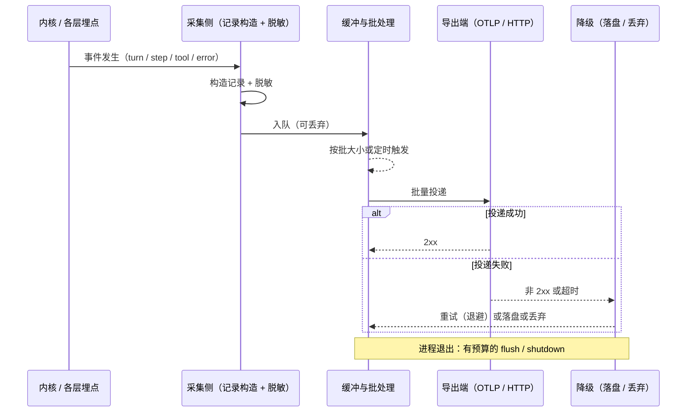

# 第 17 章：遥测 · 追踪 · 诊断 —— 怎么证明它工作过

前面十六章都在回答「它怎么工作」：循环怎么转、工具怎么跑、上下文怎么拼、界面怎么画。本章要回答的是另一个方向的问题——**怎么证明它工作过**。这个方向的问题有一个共同特征：答案对当下这一轮循环没有任何影响。无论遥测开着还是关着、上报成功还是失败，这一轮该走多远就走多远。正因为如此，四家在这一层上的投入差异，几乎完全由产品形态决定，而不是由工程难度决定：有企业部署与合规压力的，把它做成一等公民；面向单一用户的，把它压到最小。

四家最容易看混的地方，是**「会话记录」和「遥测记录」是两份东西**。四家都保留了这条分界，但画线的位置不同——codex 把这条线写进了文档，明说本地诊断追踪「不是遥测」；dsh 用「canonical 日志永不改写、遥测只镜像已经交出去的那一段前缀」来表达同一条线；pi 干脆让遥测不落盘；CC 的会话 transcript 与四条网络通道之间没有任何共享代码。第二个分歧是**要不要 trace**：只有 codex 建了完整的跨进程追踪链路，其余三家都停在「结构化事件 + 日志」这一代，其中 dsh 是明确选择走 OTel 的 logs 信号而不是 traces。第三个分歧是**默认开还是默认关**，这里出现了三种完全不同的商业姿态，其中 dsh 的做法在四家中最保守：默认一条不发。

> **本层定位**：L17，外围区的**贯穿观测层**，也是全系列的最后一层。它与前四层不构成递进关系，而是横切——埋点散布在每 一层里，本章只处理这些埋点**汇聚之后**的事。判据有三条硬性特征，缺一条就不是本层：**只出不回**（数据单向流出，没有返回值回流进循环）、**不在关键路径上**（失败不改变任何决策）、**可丢弃**（把全部遥测与诊断产物删掉，会话的正确性不受影响）。这三条与第 15 章的「驱动面」正好互补：两者都可能出网，区别只在要不要等回话。
>
> **前置依赖**：07（消息事件与 Session 结构——遥测的事件口径直接镜像它，事件形状决定采集边界）、08（会话持久化——「事实源 vs 衍生物」这条本章最重要的分界线由它划定）、01（配置与凭据——所有开关、端点、企业托管的关闭位都落在配置层）、15（对外接口与集成协议——两者共享全部出网基础设施，差别只在要不要等返回值）。
>
> **分析对象**：
> - **pi** —— `packages/telemetry/src/*`（厂商中立的回调式 span 契约与 schema 工具）+ `packages/agent/src/harness/telemetry.ts`（12 个 span 的 schema 定义与发 span 的两个入口）+ `packages/coding-agent/src/core/*.ts`（bug report 打包上传、崩溃记录、会话 JSONL）
> - **deepseek-harness** —— `packages/session/session-telemetry/*`（采集侧 Service Definition 与脱敏瀑布）+ `packages/session/session-telemetry-otel/*`（唯一的后端实现，OTel logs）+ `packages/feedback/*`（反馈两件套）+ `packages/boot/app-boot/src/profile-context.ts`（启动期关闭位）+ `packages/runtime-diagnostics/invariants/*`（运行时检查注册表）
> - **codex** —— `codex-rs/analytics/*`（fact → event 两层与有状态归约器）+ `codex-rs/otel/*`（provider、OTLP 传输、W3C trace context）+ `codex-rs/rollout-trace/*`（本地诊断证据包）+ `codex-rs/cli/src/doctor*`（自检命令）
> - **CC** —— `src/utils/telemetry/*`（OTel provider、四套追踪、导出器）+ `src/services/analytics/*`（事件入口、sink 扇出、四条出网通道）+ `src/utils/{debug,errorLogSink,gracefulShutdown,doctorDiagnostic}.ts`（本地日志、退出编排、自检聚合）
>
> **跨层联动**：15 —— 见 2.2 与 5.4。第 15 章收走了「两端分属不同进程、且要等回话」的通路，本章只剩「只出不回」的那一半。两者共用同一批出网基础设施（HTTP 客户端、代理设置、TLS、超时预算），因此在实现上常常挨着放：codex 的 OTLP 传输层与它的 app-server 传输层同处 `codex-rs/otel/`，CC 的遥测导出器与它的桥接层共享同一份重试与退避设施。这条线在本章有个具体的落点——「遥测失败能不能重试到影响主流程」这个问题，四家给出的答案都是否，而理由与第 15 章恰恰相反（第 15 章的失败要重试，因为对方在等）。
>
> **易混点**：**「日志」「追踪」「遥测」三个词在本章各有所指，不要混用**。日志（logging）是给**当下排障**的、按级别过滤的、通常会轮转掉的东西；追踪（tracing）是给**事后定位**的、带父子结构与耗时的东西；遥测（telemetry）是给**趋势统计**的、聚合上报的东西。四家对三者的重视程度差别很大：codex 三者俱全且各自独立（文件日志、SQLite 日志库、OTel traces、本地 trace bundle），pi 只有第一者加一个几乎空转的第二者，dsh 只有第一者加第三者的 logs 变体，CC 三者都有但第二者受门控。
>
> **门控提示**：本章 CC 侧涉及两处受开关控制的追踪路径——增强追踪 `[门控] feature('ENHANCED_TELEMETRY_BETA')` 与 Perfetto 时间线 `[门控] feature('PERFETTO_TRACING')`。这两条路径在外部构建中不存在，其代码只用于说明内部形态，凡摘录均标 `[门控]` 并写出开关名。

---

## 一、核心结论速览

1. **只有 codex 建了真正的分布式追踪链路**，其余三家都停在同一代：pi 定义了 12 个 span 的 schema 但**只有一个真的被发出来**（`hooks.ts:376`，`pi.ai.request` 等只定义未调用），dsh 明确选择 OTel 的 **logs** 信号而非 traces（`index.ts:213-225`），CC 有 OTel span 且层级完整但 trace id **不出进程**。只有 codex 做了 W3C trace context 的注入与提取（`trace_context.rs:20-21`，读 `TRACEPARENT` / `TRACESTATE` 两个环境变量）。
2. **「事实源」与「衍生物」在四家都是两份东西，但分界线的画法不同**：codex 分得最彻底并写进文档（`README.md:3-4` 直说本地追踪「不是遥测」），dsh 用「canonical 日志永不改写 + 遥测只镜像**已经交出去的那一段前缀**」表达同一条线（`index.ts:24-44`），pi 的遥测根本不落盘、与会话 JSONL 各走一路（`index.ts:12`），CC 的会话 transcript 与四条网络通道之间没有共享代码（`sessionStorage.ts:198-205`）。
3. **默认姿态分三档，dsh 的档位最保守**：默认关（codex 的 OTel 无 exporter 就不建 provider，`config.rs:87-105`；CC 的第三方遥测须显式开 `CLAUDE_CODE_ENABLE_TELEMETRY`，`instrumentation.ts:324-326`）、默认开（pi 的安装上报默认 `true`，`settings-manager.ts:1072`；CC 的 1P 事件默认开）、**默认一条不发**（dsh 的 `FEEDBACK_ONLY`：普通活动不采集，只有用户对本会话显式提交反馈才授权上传，`index.ts:45-52`、`:58-66`）。
4. **诊断自检的成熟度，与「有没有一个可以被装歪的安装面」强相关**：codex 与 CC 都有成体系的 `doctor`（前者按子模块拆成十几个检查文件，`doctor/`；后者检查安装类型、多重安装、ripgrep 状态，`doctorDiagnostic.ts:54-71`），而 pi 与 dsh 都没有 `doctor`——dsh 的替代品是 38 个包各自携带的 `invariant.ts`，组成一张运行时**关系**检查注册表，检查的是「日志有没有跳号」这类内部一致性，而不是「我的安装有没有问题」。
5. **脱敏机制分两代，且四家一致选「白名单式采集」而非「黑名单式剔除」**：新一代是编译期或类型级强制（CC 用 `= never` 标记类型逼调用方显式断言、再用 `_PROTO_` 前缀把敏感字段路由到特权通道，`analytics/index.ts:19-58`；dsh 挂在 schema 上的 `role('secret')`，`settings/src/redact.ts:51-56`；codex 直接在归约入口把 message / reasoning / review 三类 content 挡在队列之外，`analytics/src/client.rs:834-835`），老一代是运行期正则（pi 的 `SENSITIVE_KEY`，`bug-report.ts:20-24`；CC 的 `redactSensitiveInfo`，`Feedback.tsx:71-80`）。三家新一代的取舍方向一致：**能不让它进采集层，就不靠后面擦**。

---

## 二、本层职责与边界

### 2.1 子职责拆解

| # | 子职责 | 要回答的问题 |
|---|---|---|
| 1 | 采集口径与事件模型 | 采什么、以什么结构采、以什么粒度采？埋点长在哪些位置，是内核主动发射还是外围包一层观察？ |
| 2 | 开关、同意与采样 | 谁有权决定采不采？默认姿态是什么？能不能按事件开关？有没有采样？ |
| 3 | 导出通道与失败处理 | 数据怎么送出去？批处理、队列、重试、超时各是多少？断网或对端拒绝时怎么办？进程退出前兜不兜底？ |
| 4 | 脱敏与隐私边界 | 什么绝不出门？脱敏发生在编译期、采集期还是投递前？ |
| 5 | 追踪模型 | 有没有 span / trace 的父子结构？怎么与 turn、step、工具调用绑定？trace id 会不会跨进程传播？ |
| 6 | 本地日志与诊断产物 | 日志写在哪、怎么分级、轮转与保留策略是什么？崩溃或异常退出留下什么？ |
| 7 | 诊断命令与运行时自检 | 用户能不能自证「我这份装歪了」或「这次跑得不正常」？检查的是安装面还是运行时关系？ |
| 8 | 用户反馈与故障上报 | 用户主动上报走什么入口？打包了哪些文件？谁来接？ |

### 2.2 本层不管什么

- **不管「会话怎么持久化」**（那是第 8 章）。本章只关心它与遥测的**分界线**：会话日志是事实源，遥测是它的衍生物。四家都没有把两者做成同一份——最接近的是 dsh，它把会话事件镜像成遥测记录，但镜像只是**副本**，canonical 日志本身永不因遥测而改写（`session-persistence-jsonl/src/generation.ts:1-7`）。
- **不管「事件怎么跨进程传」**（那是 L15，见第 15 章）。两者的区别只有一条：**要不要等回话**。遥测的每一次投递都是 fire-and-forget，对端不回业务数据；这条边界在实现上表现为「遥测客户端没有请求-应答状态机」——codex 的 analytics 队列只上报、不消费响应体（`analytics/src/client.rs:940-950` 只在失败时打日志），而它的 app-server 传输层有完整的请求路由与响应匹配（`thread_routing.rs:666-679`）。
- **不管「采到的错误具体是什么错」**（那是各层的异常处理）。本章只负责把错误**送达**，不负责解释它；错误的语义、重试策略、是否致命，全部在原层决定。一个典型例子是 codex 的 `GuardianV2` 事件：遥测侧只序列化「归因」与「有界结果」两个字段，判定逻辑本身在别的层（`guardian_v2.rs:1-2`）。
- **不管「权限怎么判」**（那是 L10，见第 10 章）。遥测的开关与权限层的审批是两套机制：前者是配置项与隐私档位，后者是逐次操作的判定。四家都没有把遥测开关做成需要审批的事项。
- **不管「界面怎么显示进度」**（那是第 16 章）。诊断命令的**输出渲染**属于本章（它是一次性文本输出，不进事件循环），而进度条的刷新属于第 16 章。
- **不管「模型用量怎么计价」**（那是 L6 与 L7）。但这里有一条容易踩的边界：**计价口径与计量口径是两件事**。同一个 usage 数字，四家的处理不同——pi 与 CC 用它算钱并上报，dsh 与 codex 明确「usage 不计价」，因此它们的遥测里只搬运计数、不做成本计算。本层的职责是「把数字原样传出去」，任何换算都发生在 L6。
- **不管「作业怎么被托管」**（那是第 14 章）。后台作业的运行与回收属于第 14 章；作业的**日志落到哪里、保留多久**属于本章（如 dsh 的 `spill` 溢写策略，`spill-policy/src/index.ts:197-200`）。
- **不要求「同进程」**。这一点与前四层都不同：L15 与 L16 的分界线正是进程，而本层**同时覆盖同进程与跨进程两种形态**——同进程的部分是埋点（`startHarnessSpan` 这类调用），跨进程的部分是投递（OTLP 出网）。之所以不按进程分，是因为它的判据是「要不要回话」而非「在哪里发生」。

### 2.3 层次定位

本章的位置需要和前面四层并排看。前四层是**线性递进**的：能力入口 → 执行外延 → 驱动面 → 呈现面，每一层都以上一层为上游。而本章是**横切**的：它没有固定的上游，任何一层只要有值得留下记录的时刻，就在那里埋一个点。

```text
┌─────────────────────────────────────────────────────────────────────────────────────────────────┐
│   L17  遥测 · 追踪 · 诊断（本章）                                                               │
│   判据：把「已经发生的事」变成「可回查的证据」                                                  │
│   三条硬性特征：只出不回 · 不在关键路径 · 可丢弃                                                │
└─────────────────────────────────────────────────────────────────────────────────────────────────┘
     ▲ 观测（只读，无返回值）                       │ 不做的事 ─────────────────────────────
     │                                              │ · 不改会话内容       · 不挡启动
     │                                              │ · 不参与重试决策     · 不回流到循环
┌─────────────────────────┐  ┌────────────────────────────────────┐  ┌────────────────────────────┐
│ 启动区 L1–L2            │  │ 内核区 L3–L12                      │  │ 外围区 L13–L16             │
│ 01 配置 · 02 提示词     │  │ （埋点最密的地方）                 │  │ 13 能力 · 14 作业          │
│                         │  │ 03 … 12                            │  │ 15 驱动 · 16 呈现          │
└─────────────────────────┘  └────────────────────────────────────┘  └────────────────────────────┘
             │                                 │                                   │
             └─────────────────────────────────┴───────────────────────────────────┘
                                               │   采集成三类证据
                                               ▼
┌─────────────────────────────────────────────────────────────────────────────────────────────────┐
│ 事实源：会话日志 —— 唯一权威，append-only，永不改写                                             │
│ 衍生物：遥测记录 / 诊断证据包 / 崩溃记录 / 用户反馈打包                                         │
│         ↑ 可丢弃、可重发、可脱敏、可整体关闭；丢了不影响会话正确性                              │
└─────────────────────────────────────────────────────────────────────────────────────────────────┘
```

**图 17-1**：L17 在三区结构中的位置。它不落在任何一区之内，而是横跨全部三区；底部是本章最重要的一条分界线——采集的产物分「事实源」与「衍生物」两类，后者可以整体丢弃而不影响前者。

这条「事实源 vs 衍生物」的线，四家分别画在哪里，是本章的第一个横向对照点。

| 项目 | 事实源（会话记录） | 衍生物（遥测 / 诊断） | 回查入口 |
|---|---|---|---|
| pi | 追加式 JSONL（SessionManager）；带 parentId 串链，可导出 | 12 个 span schema，实发 1 个；无 exporter，仅有安装 ping | /session · /debug · /bug；crashes.json（5 条 / 7 天） |
| dsh | JSONL 不可变代际；canonical 永不改写 | OTel logs（不是 traces）；默认 FEEDBACK_ONLY | 无 doctor；38 个 invariant 伴随插件 |
| codex | rollout/ JSONL；revert 时另开新文件 | analytics（34 个线路事件）+ OTel + rollout-trace（本地） | codex doctor；/feedback 传到 Sentry |
| CC | ~/.claude/projects/**.jsonl；随会话 append，可 /export | 四条出网通道并行；732 事件名 / 1118 处调用 | claude doctor / /doctor；/status · /feedback |

**表 17-1**：四家「事实 → 证据」的链路对照。注意第二列与第三列**从不同源**：会话记录是事实源，遥测与诊断是衍生物，两者之间没有依赖关系。

四家的投递链路在**时序**上却高度一致：采集点把记录丢进一个缓冲，缓冲按时间或条数触发一次投递，投递失败后走一条降级路径，进程退出前做一次有预算的收尾。差异全在每一段的**参数**上——缓冲多大、多久触发一次、失败重试几次、退出时等多久。



**图 17-2**：一条遥测记录从产生到落地（或丢弃）的通用时序，四个阶段分别标注了四家的关键参数位置。

三个阶段的参数差异极大：**缓冲**从 codex 的 256 条队列（`analytics/src/client.rs:82-86`）到 CC 的 8192 条（`firstPartyEventLogger.ts:87-96`）；**触发间隔**从 CC 的 100ms 到 dsh 的 10000ms（`cordis.patch.yml:213`）；**退出预算**从 codex TUI 的 500ms（`tui/src/lib.rs:273`）到 dsh 的 5000ms（`process-shutdown.ts:4-5`）。这些数字本身不重要，重要的是它们都**独立于主循环的预算**——没有一家让上报超时去决定一轮循环能走多久。

---

## 三、概念对齐表

四家在同一件事上用的词差异比前面任何一章都大，因为这一层没有共同的协议标准可以对齐（OTel 只统一了传输，没统一语义）。**本章的表格每一格都有内容**——四家在这一层都写了实现，但「有实现」与「有对应概念」是两回事：下面「跨进程 trace 传播」一行三家写「无」，那不是缺数据，而是本章最清晰的一条能力断层。

| 概念 | pi | dsh | codex | CC |
|---|---|---|---|---|
| 遥测契约 | 回调式 `TelemetryContext` / `TelemetrySpan`，厂商中立（`telemetry/index.ts:14-20`） | 采集侧 Service Definition，记录类型即契约（`session-telemetry/index.ts:64-88`） | 内部 fact 与线路事件两层（`analytics/src/facts.rs:533`、`events.rs:68`） | 无契约对象，`logEvent(eventName, metadata)` 开放签名（`services/analytics/index.ts:133-144`） |
| 事件词表 | 12 个 span（1 个 AI + 11 个 Harness），0 个 span event（`harness/telemetry.ts:42`、`:233`） | 15 个内核 `SessionEvent` 直接镜像（`core/session/src/types.ts:288` 起） | 34 个线路事件 + 12 个内部 fact（含 26 个自定义子项）（`analytics/src/events.rs:68-106`、`facts.rs:533-618`） | 开放式字符串，无中央 union（732 个静态 `tengu_*` 事件名） |
| 默认姿态 | 安装上报默认开（`settings-manager.ts:1072`） | `FEEDBACK_ONLY`：默认一条不发（`session-telemetry-otel/src/index.ts:45-52`） | OTel 无 exporter 即不建 provider；analytics 默认开（`otel/src/config.rs:87-105`） | 第三方遥测默认关；1P 事件默认开（`instrumentation.ts:324-326`） |
| 采集开关 | `PI_TELEMETRY`（`core/telemetry.ts:8-13`） | `DSH_TELEMETRY_DISABLED`，任何非空值即关（`app-boot/profile-context.ts:39-55`） | `[analytics] enabled` 与 `[otel]` 配置表（`config/src/types.rs:221-227`、`:595-622`） | `DISABLE_TELEMETRY` / `CLAUDE_CODE_ENABLE_TELEMETRY`（`utils/privacyLevel.ts:20-28`） |
| 传输协议 | 无 exporter，立场是「归 adapter」（`telemetry/README.md:11`） | OTLP/HTTP，只用 logs 信号（`session-telemetry-otel/src/index.ts:213-225`） | OTLP gRPC 与 HTTP 双支持（`otel/src/config.rs:87-105`） | OTLP 加三条自建 HTTP（`services/analytics/sink.ts:48-72`） |
| 采样 | 无 | 无 | 无 | 有：按事件名配采率，无配置即全采（`firstPartyEventLogger.ts:57-64`） |
| 追踪模型 | 有 schema、**只有 1 个 span 实发**（`harness/hooks.ts:376`） | 无 span，用会话事件的层级替代（`session-telemetry/coordinator.ts:180-193`） | span + W3C trace context（`otel/src/trace_context.rs:20-21`） | OTel span，四类节点（`utils/telemetry/sessionTracing.ts:49-56`） |
| 跨进程 trace 传播 | 无，文档明说没有 carrier API（`harness/docs/telemetry.md:207`） | 无 | **有**：读 `TRACEPARENT` / `TRACESTATE`（`otel/src/trace_context.rs:20-21`） | 无，跨 agent 只靠 span 属性（`utils/telemetry/perfettoTracing.ts:147-167`） |
| 会话记录载体 | 追加式 JSONL，带 `parentId` 串链（`core/session-manager.ts:1184`） | JSONL 不可变代际，当前格式 v4（`session-persistence-jsonl/src/generation.ts:1-7`） | `rollout/` JSONL，revert 时另开新文件（`rollout/src/recorder.rs:92-104`） | `~/.claude/projects/**/<sid>.jsonl`，随会话 append（`utils/sessionStorage.ts:198-205`） |
| 诊断证据包 | `/bug` bundle，4 个文件（`core/bug-report.ts:252-274`） | 无，反馈直接走同一个 OTLP 端点 | `/feedback` 加 doctor 报告与日志附件（`feedback/src/lib.rs:47-54`） | `/feedback`，别名 `bug`（`commands/feedback/index.ts:5-24`） |
| 本地日志 | `crashes.json` 加 `/debug` 一次性覆盖写（`core/crash-log.ts:17`、`config.ts:576-578`） | `logs/startup-*.log`，只在启动失败时写（`apps/cli/src/startup-diagnostics.ts:58-62`） | `log/` 文件加 SQLite `logs_2.sqlite`，保留 10 天（`state/src/runtime/logs.rs:3`） | `debug/<sid>.txt` 加错误 JSONL，无轮转（`utils/debug.ts:230-236`） |
| 自检命令 | 无 doctor；`/session` 看统计（`interactive-mode.ts:6432`） | 无 doctor；38 个 `invariant.ts` 伴随插件 | `codex doctor`，按子模块拆分（`cli/src/doctor.rs`、`cli/src/doctor/`） | `claude doctor` / `/doctor` / `/status` 三入口（`utils/doctorDiagnostic.ts:54-71`） |
| 崩溃产物 | `crashes.json`，最多 5 条、保留 7 天（`core/crash-log.ts:17`） | 半写尾部检测（`session-persistence-jsonl/src/generation.ts:592`） | panic hook 转发进 tracing（`tui/src/lib.rs:1106-1115`） | 无 backtrace 文件，heap dump 需手动（`utils/gracefulShutdown.ts:301-310`） |
| 退出收尾 | 无（这一层没有 flush 概念） | 带外层 deadline 的 `shutdown`（`session-telemetry-otel/src/index.ts:294-309`） | 幂等 `shutdown` 加 `Drop` 兜底（`otel/src/provider.rs:94-110`、`:346-350`） | `beforeExit` / `exit` 双钩子加 2s 超时（`instrumentation.ts:612-623`） |
| 反馈上传目标 | `radius.pi.dev` 网关的 `/v1/bug-reports`（`core/bug-report-upload.ts:20`） | 同一个 OTLP 端点（`cordis.patch.yml:210`） | Sentry（`feedback/src/lib.rs:56-57`） | `api.anthropic.com/api/claude_cli_feedback`（`Feedback.tsx:543`） |

---

## 四、逐项目实现

### 4.1 pi —— 契约先行，实现留白

> pi 把遥测做成了一个**可插拔的契约层**：接口、schema、父级传播机制齐备，但仓库内不含任何后端，也不落盘。生产代码里只有一个 span 真的被发出来。这是一种坦白的设计选择——它不假装自己有观测能力，而是把「接什么后端」完全留给使用者。

#### 4.1.1 契约：回调式 span，不引入全局当前 span

pi 的遥测契约只有两个接口，形状是回调式而非「开始 / 结束」两段式。这个选择有一个直接后果：**span 的生命周期不可能被漏掉**，因为结束由回调返回驱动，而不是由调用方手动配对。

`packages/telemetry/src/index.ts:12-22`
```ts
export type SpanStatus = { status: "ok" } | { status: "error"; error?: { name: string; message: string } };

export interface TelemetryContext {
	startSpan<T>(options: SpanOptions, callback: (span: TelemetrySpan) => T | Promise<T>): Promise<T>;
}

export interface TelemetrySpan extends TelemetryContext {
	addEvent(name: string, attributes?: SpanAttributes): void;
	setAttributes(attributes: SpanAttributes): void;
	setStatus(status: SpanStatus): void;
}
```

`SpanOptions` 里预留了一个 `sensitive` 标记（`packages/telemetry/src/index.ts:28-32`），但实测全仓**没有任何 schema 使用它，也没有运行期消费点**：

`packages/telemetry/src/index.ts:26-32`
```ts
export type TelemetryAttributeType = "string" | "number" | "boolean" | "string[]" | "number[]" | "boolean[]";

export interface TelemetryAttributeMetadata {
	description: string;
	sensitive?: boolean;
	cardinality?: "low" | "high";
}
```

包自身的立场写得很直白——它只定义契约，不管后端、不管缓冲、不管采样，这些全部归 adapter（`packages/telemetry/README.md:11`、`:132`）。这解释了为什么后面「只有一处实发 span」并不算 bug：这个包的存在目的就是让别的包能**声明**自己该发什么，而不是替它们发。

#### 4.1.2 传播：靠 context key，不靠全局状态

父 span 的传递走 `Context` 对象上的一个 key，而不是异步上下文或线程局部变量。工具函数在拿不到 key 时回退到一个共享的空实现——这就是「遥测没装后端也照样跑」的实现方式。

`packages/agent/src/harness/context.ts:27-32`
```ts
const TELEMETRY_CONTEXT_KEY = createContextKey<TelemetryContext>("pi.telemetryContext");

/** Return the telemetry parent attached to a context, or the shared no-op parent. */
export function getTelemetryContext(context: Context): TelemetryContext {
	return context.value(TELEMETRY_CONTEXT_KEY) ?? NOOP_TELEMETRY_CONTEXT;
}
```

发 span 的入口 `startHarnessSpan` 就是这一行逻辑的包装：拿 context 上的父级、调 `startSpan`、并把当前 span 作为子 context 传进回调，使嵌套调用自然形成父子链（`packages/agent/src/harness/telemetry.ts:622-635`）。

代价是**跨进程传播没有实现**。文档自己写明当前包「没有 carrier 的注入与提取 API」（`packages/agent/docs/telemetry.md:207`），因此子 Agent 与 MCP 的调用链在本层是断开的——这一条与 codex 形成本章最清晰的能力对照。

#### 4.1.3 12 个 span 的 schema，与「只有 1 个实发」

schema 分两张表、共 12 个 span。AI 表只有一个成员：

`packages/agent/src/harness/telemetry.ts:42-47`
```ts
export const AI_TELEMETRY_SCHEMA = {
	version: 1,
	spans: {
		"pi.ai.request": {
			description: "One logical request to an AI provider",
			parents: { kind: "any" },
			...
		},
		...
	},
};
```

Harness 表覆盖了循环的全部阶段：`pi.harness.run` / `compaction` / `navigation` / `checkpoint` / `turn` / `step` / `tool` / `hook` / `sleep` / `event_handler`，外加持久化侧的 `pi.session.write`（`packages/agent/src/harness/telemetry.ts:233` 起，各 span 分别位于 `:236` / `:258` / `:280` / `:302` / `:328` / `:354` / `:400` / `:453` / `:490` / `:545`）。

schema 里还写死了父子约束，例如 `pi.harness.step` 只承认四类父级：

`packages/agent/src/harness/telemetry.ts:354-359`
```ts
		"pi.harness.step": {
			description: "One durable retry attempt",
			parents: {
				kind: "spans",
				spans: ["pi.harness.turn", "pi.harness.checkpoint", "pi.harness.compaction", "pi.harness.navigation"],
			},
			...
		},
```

但实测全仓只有**一个**调用 `startHarnessSpan` 的地方，在 hook 分发路径上；`startAiSpan` 则连一次调用都没有（`packages/agent/src/index.ts:103-104` 只是导出）。也就是说，`pi.ai.request` 与除 `hook` 外的 10 个 Harness span 目前都是「已声明、未发射」。

`packages/agent/src/harness/hooks.ts:376-402`
```ts
		return startHarnessSpan(
			"pi.harness.hook",
			{
				"pi.lane.name": event.lane,
				"pi.operation.id": event.runId,
				"pi.hook.name": name,
				...(registration.id === undefined ? {} : { "pi.hook.registration_id": registration.id }),
			},
			async (span, spanContext) => {
				try {
					const result = await registration.handler(event, spanContext);
					const blocked =
						name === "before_tool" &&
						result !== null &&
						typeof result === "object" &&
						"block" in result &&
						result.block !== undefined;
					span.setAttributes({ "pi.hook.outcome": blocked ? "blocked" : "completed" });
					return result;
				} catch (error) {
					span.setAttributes({ "pi.hook.outcome": "failed" });
					span.setStatus({ status: "error" });
					throw error;
				}
			},
			context,
		);
```

这一处 span 的属性设计值得记一笔：它记录的是**hook 这个动作的结果**（`completed` / `blocked` / `failed`），而不是 hook 内部的业务细节——也就是说，即使只发一个 span，它也是「最有价值的那一个」，因为它同时覆盖了每个内核回调点的入口与结果。

#### 4.1.4 开关：只有安装上报有开关

pi 唯一的遥测开关管的是一件事——**安装上报**，与环境变量 `PI_TELEMETRY`（另有 `PI_OFFLINE` 全局封网）。判定顺序是先看环境变量，没设才看设置项，设置项默认 `true`：

`packages/coding-agent/src/core/telemetry.ts:8-13`
```ts
export function isInstallTelemetryEnabled(
	settingsManager: SettingsManager,
	telemetryEnv: string | undefined = process.env.PI_TELEMETRY,
): boolean {
	return telemetryEnv !== undefined ? isTruthyEnvFlag(telemetryEnv) : settingsManager.getEnableInstallTelemetry();
}
```

触发时机是「首次安装」或「版本号变化」，也就是变更日志要展示的那一刻；上报本身是一次 `fetch` 加 5 秒超时、错误全部吞掉：

`packages/coding-agent/src/modes/interactive/interactive-mode.ts:1292-1309`
```ts
	private reportInstallTelemetry(version: string): void {
		if (process.env.PI_OFFLINE) {
			return;
		}

		if (!isInstallTelemetryEnabled(this.settingsManager)) {
			return;
		}

		void fetch(`https://pi.dev/api/report-install?version=${encodeURIComponent(version)}`, {
			headers: {
				"User-Agent": getPiUserAgent(version),
			},
			signal: AbortSignal.timeout(5000),
		})
			.then(() => undefined)
			.catch(() => undefined);
	}
```

注意这里开关的**作用域**：它只管这一条报路，管不着 span 管线。span 管线由「有没有注入 telemetry context」决定，而启动流程里根本没有注入后端的地方（`packages/coding-agent/src/main.ts` 内无 telemetry 相关调用）。所以 pi 的实际姿态是：**插件式遥测默认处于「已声明但未接线」状态**，唯一真在跑的只有这条安装上报。

#### 4.1.5 `/bug` 打包：4 个文件与两层脱敏

用户主动上报的产物是一个 bundle，按内容是否存在决定文件数，最多 4 个：

`packages/coding-agent/src/core/bug-report.ts:252-274`
```ts
export function bugReportFiles(bundle: BugReportBundle): BugReportFile[] {
	const files: BugReportFile[] = [
		{ name: "report.json", contentType: "application/json", data: `${JSON.stringify(bundle.metadata, null, 2)}\n` },
		{
			name: "diagnostics.json",
			contentType: "application/json",
			data: `${JSON.stringify(bundle.diagnostics, null, 2)}\n`,
		},
	];
	if (bundle.sessionJsonl !== undefined) {
		files.push({ name: "session.jsonl", contentType: "application/x-ndjson", data: bundle.sessionJsonl });
	}
	if (bundle.summary !== undefined) {
		files.push({
			name: "summary.md",
			contentType: "text/markdown",
			data: bundle.summary.endsWith("\n") ? bundle.summary : `${bundle.summary}\n`,
		});
	}
	return files;
}
```

投递方式是 multipart POST 到网关的 `/v1/bug-reports`，可匿名也可带 token（`packages/coding-agent/src/core/bug-report-upload.ts:12-25`，网关常量见 `packages/ai/src/providers/radius-config.ts:4`）。

脱敏做在**打包前**，分两层。第一层是按 key 名命中即整值替换；为了对付 `apiKey` 这类驼峰写法，匹配前先把驼峰拆成下划线形式：

`packages/coding-agent/src/core/bug-report.ts:19-24`
```ts
const REDACTED = "<redacted>";
const SENSITIVE_KEY = /(?:^|[-_])(api[-_]?key|secret|token|password|passwd|credential|authorization|cookie)(?:$|[-_])/i;

function isSensitiveKey(key: string): boolean {
	return SENSITIVE_KEY.test(key.replace(/([a-z0-9])([A-Z])/g, "$1_$2"));
}
```

第二层是对所有字符串值做 URL 清洗，去掉内嵌的凭据。两层合起来在 `redactJsonValue` 里串成一次 `JSON.stringify` 的 replacer 遍历：

`packages/coding-agent/src/core/bug-report.ts:50-59`
```ts
/** Copy a JSON value while removing values that may contain credentials. */
export function redactJsonValue(value: unknown): unknown {
	if (value === undefined) return undefined;
	return JSON.parse(
		JSON.stringify(value, (key, child: unknown) => {
			if (child !== null && child !== undefined && isSensitiveKey(key)) return REDACTED;
			return typeof child === "string" ? redactUrl(child) : child;
		}),
	);
}
```

环境变量只上报**名字**、不上报值（`packages/coding-agent/src/core/bug-report.ts:87`），设置项则整个剥离 `trackingId` 字段后再过一遍上面的清洗（`:61-64`）。这是典型的「白名单 + 事后清洗」组合：能靠名字判断的先按名字挡（编译期不可知、运行期一挡一个准），判断不了的按值洗一遍。

#### 4.1.6 本地日志与崩溃记录

pi 没有通用分级日志系统，落盘的诊断产物只有两类。

第一类是崩溃记录，写在 agent 目录的 `crashes.json` 里，条数与时效双限：

`packages/coding-agent/src/core/crash-log.ts:6-21`
```ts
export interface CrashRecord {
	timestamp: string;
	version: string;
	kind: "uncaught_exception" | "fatal_error";
	message: string;
	stack: string | null;
	sessionFile: string | null;
	cwd: string;
	notified?: boolean;
}

const MAX_CRASH_RECORDS = 5;
const MAX_AGE = 7 * 24 * 60 * 60 * 1000;

function crashLogPath(agentDir = getAgentDir()): string {
	return join(agentDir, "crashes.json");
}
```

记录里带了 `sessionFile` 与 `cwd` 两个字段，因此崩溃后能直接定位到当时的会话文件——这是「诊断产物要能接回事实源」这条原则的最小实现。

第二类是 `/debug` 命令写出的一份快照，路径由配置层给出；它是一次性**覆盖写**，不是追加、也没有轮转：

`packages/coding-agent/src/config.ts:575-578`
```ts
/** Get path to debug log file */
export function getDebugLogPath(): string {
	return join(getAgentDir(), `${APP_NAME}-debug.log`);
}
```

`--verbose` 只影响启动阶段的打印，不产生日志文件。按本章的「日志 / 追踪 / 遥测」三分法，pi 只有第一者，且形态是「按需导出快照」而非「持续流式记录」。

#### 4.1.7 会话 JSONL：与遥测完全分家

会话走追加式 JSONL，每条 entry 一行、靠 `parentId` 串成树。写盘有一个不常见的门控：**在第一条 assistant 消息到达之前不落盘**，到达时把前面攒的所有 entry 一次性写入，之后转为逐条追加。

`packages/coding-agent/src/core/session-manager.ts:1174-1186`
```ts
		if (!this.flushed) {
			const fd = openSync(this.sessionFile, "wx");
			try {
				for (const e of this.fileEntries) {
					writeFileSync(fd, `${JSON.stringify(e)}\n`);
				}
			} finally {
				closeSync(fd);
			}
			this.flushed = true;
		} else {
			appendFileSync(this.sessionFile, `${JSON.stringify(entry)}\n`);
		}
```

这个门控解决了「用户打开又立刻退出时留下一堆空会话文件」的问题，代价是首条 assistant 之前的崩溃会丢掉这轮输入。

会话可导出为 JSONL（`packages/coding-agent/src/core/session-export.ts:8-12`），入口是 `/export`（`packages/coding-agent/src/core/slash-commands.ts:25`）。**这份 JSONL 与遥测没有任何共享代码**：遥测不落盘、不读会话文件，会话侧也从不读取遥测结果。pi 用这种「完全不交叉」的方式，把「事实源 vs 衍生物」的线画成了两个互不引用的模块。

#### 4.1.8 诊断入口与缺位

pi 提供的信息入口有三个：`/session` 打印当前会话的统计（文件、ID、消息数、token、缓存预热），`/debug` 导出调试快照，`--version` 打印版本；快捷键 `shift+ctrl+d` 也能触发 `/debug`。

`/session` 的实现是取一次会话统计对象再逐行打印（`packages/coding-agent/src/modes/interactive/interactive-mode.ts:6432`）。而**没有 `doctor`**——在 `packages/coding-agent/src` 全量搜 `doctor` / `healthCheck` / `runDoctor` 均无命中。

这个缺位与 pi 的产品形态一致：它的安装面足够简单（一个 npm 包、一份 `settings.json`），没有「多个安装并存」「PATH 冲突」「托管配置覆盖」这类需要自检的复杂场景。相对地，codex 与 CC 都有 `doctor`，而它们恰恰都是「可能被装好几份、可能被企业策略覆盖」的形态——这条相关性在 5.3 会再出现一次。

### 4.2 deepseek-harness —— 把采集与后端拆成两个包，默认什么都不采

> dsh 在本层做了一件其他三家都没做的事：**把「采集」与「后端」拆成两个独立的包**，中间以一份纯契约相接。采集侧刻意不实现任何脱敏规则，只留一个瀑布扩展点；后端侧只有 OTel 的 logs 信号一种实现。这个拆分带来一个直接后果——它的默认隐私姿态是四家里最保守的：用户不主动提交反馈，就一条数据都不出。

#### 4.2.1 采集侧是契约包，不含后端也不含规则

`session-telemetry` 这个包只定义两样东西：记录的形状，和一条脱敏瀑布的挂载点。它不实现传输、不实现脱敏规则，甚至不实现「怎么决定采不采」。记录的字段设计得很克制——身份属性只放「无法从 body 里恢复出来」的那些：

`packages/session/session-telemetry/src/index.ts:64-88`
```ts
export interface SessionTelemetryRecord {
  /** Ledger (session-log mirror) or ops (operational signal) channel; backends keep the two under separate instrumentation scopes. */
  channel: 'ledger' | 'ops'
  /** Unix epoch milliseconds — the source event's append time for ledger records, the emission time for ops records. */
  time: number
  /** Pre-mapped alerting severity; see {@link SessionTelemetrySeverity}. */
  severity: SessionTelemetrySeverity
  /**
   * Identity attributes, deliberately minimal: ledger records carry
   * `session.id`, `session.format_version`, `event.type`, `event.seq`, plus optional
   * `session.cwd` / `session.parent_id`; a seeded Session also carries
   * `session.seed_length` from its exact inherited event count;
   * ops records carry `telemetry.op`, `session.id`, and (for `agent-error`)
   * `agent.id`, `turn`, `step`, `error.name`. Anything recoverable from the
   * body is intentionally NOT duplicated here.
   */
  attributes: Record<string, string | number>
  /**
   * The complete payload: a deep copy of the session event's `data` for
   * ledger records (JSON-serializable by `Session.append`'s own
   * validation), or the op payload for ops records. Never mutated after
   * handoff.
   */
  body: unknown
}
```

注意 `severity` 是**在采集时就算好的**，注释写明目的是「让接收方零配置就能告警」（`packages/session/session-telemetry/src/index.ts:47-50`）。这是一个值得抄的设计：把「什么算 error」这个判断留在最了解语义的地方（内核侧），而不是让下游的告警系统去猜事件类型。

#### 4.2.2 两个通道：镜像日志的 ledger，与没有日志归属的 ops

`channel` 只有两个取值，划分依据是「这件事在会话日志里有没有位置」。绝大多数记录是 `ledger`——它们与会话事件一一对应，`seq` 也照抄；少数是 `ops`——`agent-error` 与 `shutdown` 这类没有日志归属的信号，它们**刻意不带 `seq` 身份**，以免被误认为日志行（`packages/session/session-telemetry/src/index.ts:58-63`）。

采集的入口是订阅三个内核事件，其中 `session/event` 是主路径。这里有一句注释值得单独看，它把一个性能契约写在了代码里：

`packages/session/session-telemetry/src/coordinator.ts:104-120`
```ts
      ctx.on('session/event', (session, event) => {
        this.contain(() => {
          this.captureEvent(session, event)
        })
      })
      // Parallel listeners are awaited by the loop at turn end; returning void
      // (not the SDK's flush promise) is the turn-latency contract.
      ctx.on('session/flush', (session) => {
        this.contain(() => {
          this.hintFlush(session)
        })
      })
      ctx.on('agent/error', ({ agent, turn, step, error }) => {
        this.contain(() => {
          this.relayAgentError(agent, turn, step, error)
        })
      })
```

`session/flush` 的监听器**返回 `void` 而不是 flush 的 promise**，注释说这就是「回合延迟契约」——内核在回合末会 await 所有并行监听器，如果这里返回 promise，遥测的 flush 时间就会变成回合的结束时间。这一行是整个 L17 里「不在关键路径上」这条判据最实在的落点：**用返回值类型把遥测挡在延迟之外**。

#### 4.2.3 脱敏瀑布自身不带规则，且失败即扣留

脱敏的挂载点是一条 waterfall 事件，它的文档把设计意图说得非常明确：**这个包不自带任何规则**，导出的数据干净到什么程度，取决于部署挂了什么规则；最内层的 `next()` 原样透传。

`packages/session/session-telemetry/src/index.ts:24-44`
```ts
  interface Events {
    /**
     * Transform one outbound record before it reaches the backend. This
     * waterfall is the Service Definition's redaction extension point. It ships NO rules
     * of its own: the
     * innermost `next()` passes the record through unchanged, and with no
     * listener mounted records reach the backend as captured, so exported
     * data is exactly as clean as the rules a deployment mounts. Listeners
     * stack by transforming `next()`'s return value; returning without
     * `next()` replaces everything beneath. Dispatched synchronously on the
     * capture hot path inside the coordinator's containment: a throwing
     * listener withholds that one record (fail-closed) and never reaches the
     * agent loop. Live capture dispatches at append time; on-demand capture
     * dispatches while reading the canonical log. Redaction applies to the
     * exported copy only; the canonical session log is never rewritten.
     * @param record - the candidate record, already the coordinator's own deep
     *   copy; listeners return a (possibly new) record and must not mutate it.
     * @mode waterfall
     */
    'session-telemetry/record'(record: SessionTelemetryRecord, next: () => SessionTelemetryRecord): SessionTelemetryRecord
  }
```

三个细节值得记住：**失败即扣留**（监听器抛错则这条记录不发，而不是原样发出去）；**改的是副本**（canonical 日志永不因脱敏而改写）；**热路径同步派发**（脱敏不能是异步的，否则无法在采集点保证顺序）。

调用侧只有一行，把「原样透传」写成默认行为：

`packages/session/session-telemetry/src/coordinator.ts:203-205`
```ts
  private redact(record: SessionTelemetryRecord): SessionTelemetryRecord {
    return this.ctx.waterfall('session-telemetry/record', record, () => record)
  }
```

采集时先做一次深拷贝，再交给瀑布——注释解释了为什么必须拷贝：canonical 的事件对象是可变的，而 backend 会**稍后**才序列化，中间这段时间里原对象可能已经被改了。

`packages/session/session-telemetry/src/coordinator.ts:179-193`
```ts
  /** Copy, redact, and hand one canonical event to the backend. */
  private captureEvent(session: Session, event: SessionEvent): void {
    this.deliver(session, {
      record: this.redact({
        channel: 'ledger',
        time: event.time,
        severity: severityOf(event),
        attributes: identityOf(session, event),
        // The canonical event object is mutable and the backend serializes
        // later; append-time validation guarantees this clone cannot throw.
        body: structuredClone(event.data),
      }),
      seq: event.seq,
    })
  }
```

仓库里给的规则样例是一个「把 body 洗一遍再放回」的监听器（`packages/session/session-telemetry-otel/tests/fixtures/telemetry-redact-rule.ts:24-29`），可见扩展点确实按设计能被用起来。另一条脱敏机制挂在设置层：schema 上标 `role('secret')` 的字段在序列化时被摘掉、只记录「有没有设值」，与遥测包之间没有直接依赖（`packages/settings/settings/src/redact.ts:51-56`）。

#### 4.2.4 后端只有 logs，没有 traces

后端包的名字里就写着答案：`session-telemetry-otel` 用 OTel 的 **logger provider** 加 `BatchLogRecordProcessor` 加 `OTLPLogExporter`，整条链路是 logs 信号。全仓搜 `traceparent` / `trace_id` / `TracerProvider` / `startSpan` / `BatchSpanProcessor` 在源码内**零命中**（只出现在依赖清单里）——这就是「dsh 没有分布式追踪」的实证。

`packages/session/session-telemetry-otel/src/index.ts:213-224`
```ts
      processors: [
        new BatchLogRecordProcessor({
          ...config.processor,
          // The complete validated exporter object, verbatim: every SDK
          // option (`timeoutMillis`, `compression`, `keepAlive`, …) reaches
          // the exporter — rebuilding selected fields here would silently
          // ignore the rest. App identity travels in the Resource
          // (service.name/version); the transport-level user-agent is the
          // SDK's own, per the axiom.
          exporter: new OTLPLogExporter(config.exporter),
        }),
      ],
```

层级关系改由会话事件自身表达：`turn` / `step` / 工具调用本来就在事件里带了编号，跨 Agent 的关联靠子会话 header 上的 `parentSession` 加种子长度（`packages/subagent/subagent/src/types.ts:308-314`）。这是一个务实的选择——**既然事件的层级已经完整，再叠一层 span 树就是重复建模**。

#### 4.2.5 默认 FEEDBACK_ONLY：只有显式反馈才授权上传

模式枚举只有两个成员，且**默认值是那个更保守的**：

`packages/session/session-telemetry-otel/src/index.ts:45-52`
```ts
/** Session-sharing policy selected by {@link Config.mode}. */
export enum SessionTelemetryMode {
  FEEDBACK_ONLY = 'FEEDBACK_ONLY',
  DISABLED = 'DISABLED',
}

/** Default session-sharing policy for schema and direct construction. */
export const DEFAULT_TELEMETRY_MODE = SessionTelemetryMode.FEEDBACK_ONLY
```

`FEEDBACK_ONLY` 的语义是「不采集」，而不是「采集后不上传」——普通活动根本不会触发记录构造，只有用户在**本会话**里显式提交了反馈，才授权把该会话已经落库的那一段 canonical 前缀上传。判定函数把三种反馈事件都算进来，并且明确排除了**继承来的种子事件**：

`packages/session/session-telemetry-otel/src/index.ts:57-66`
```ts
/** Only this Session's explicit feedback authorizes replay; fork seeds do not. */
function isFeedback(session: Session, event: SessionEvent): boolean {
  if (event.seq < session.inheritedEventCount) return false
  switch (event.type) {
    case 'feedback/record': return true
    case 'feedback/message-put':
    case 'feedback/message-delete': return event.data.sessionId === session.id
    default: return false
  }
}
```

`event.seq < session.inheritedEventCount` 这一行是 fork 场景的隐私防线：一个会话可能是从父会话 fork 出来的，它开头那段事件是**继承**的，用户在这段里并没有表达过任何态度，因此不能因为子会话被点了反馈就把父会话的历史一起送出去。

反馈本身也写在会话日志里而非另建存储——`/feedback` 命令做的事就是往当前会话追加一条 `feedback/record` 事件：

`packages/feedback/command-feedback/src/index.ts:58-64`
```ts
export function recordFeedback(session: Session, entry: FeedbackRecord): void {
  const text = entry.text?.trim() ?? ''
  session.append('feedback/record', {
    ...(text.length === 0 ? {} : { text }),
    ...(entry.category === undefined ? {} : { category: entry.category }),
  })
}
```

命令的注册与普通斜杠命令无异（`packages/feedback/command-feedback/src/index.ts:117-127`）。这里有一个很干净的架构呼应：**授权来源与被授权的内容在同一个存储里**——因为反馈事件本身就是会话日志的一行，所以「上传哪些」这个问题可以被精确回答为「日志里到这一行为止的部分」。仓库里**没有**独立的诊断包打包机制，反馈就是走同一个 OTLP 端点。

#### 4.2.6 传输参数与退出预算

端点是可覆盖的，默认值、压缩、超时、批参数全部写在基础 bundle 的补丁文件里；同一段注释还把「为什么这些数字是这样」解释了——`timeoutMillis` 同时是单次尝试的 socket 超时和重试截止时间，设成 1 秒等于**事实上关掉了 SDK 默认的 5 次退避**；`maxExportBatchSize` 与 `maxQueueSize` 相等则让排空变成单批。

`packages/bundle/base/cordis.patch.yml:207-217`
```yaml
        mode: !!js process.env.DSH_TELEMETRY_MODE || 'FEEDBACK_ONLY'
        shutdownTimeoutMillis: 3000
        exporter:
          url: !!js process.env.DSH_TELEMETRY_OTLP_URL ?? 'https://harness-telemetry.deepseeksvc.com/v1/logs'
          compression: gzip
          timeoutMillis: 1000
        processor:
          scheduledDelayMillis: 10000
          maxQueueSize: 2048
          maxExportBatchSize: 2048
          exportTimeoutMillis: 1500
```

退出时的收尾有一个**双层预算**，这是本章值得单独拿出来的一点。内层是后端自己的 deadline：OTel SDK 的 `shutdown` 会先 await `exporter.forceFlush()`，而后者在传输层拿不到 socket 时可能永远挂着，所以后端用一个竞速把它兜住：

`packages/session/session-telemetry-otel/src/index.ts:294-309`
```ts
  async shutdown(): Promise<void> {
    if (this.provider === undefined) return
    const providerShutdown = this.provider.shutdown()
    let timer: ReturnType<typeof setTimeout> | undefined
    const deadline = new Promise<never>((_resolve, reject) => {
      timer = setTimeout(() => {
        reject(new Error(`session-telemetry-otel: provider shutdown exceeded ${this.shutdownTimeoutMillis}ms`))
      }, this.shutdownTimeoutMillis)
    })
    try {
      await Promise.race([providerShutdown, deadline])
    } finally {
      /* v8 ignore else -- the Promise executor assigns timer synchronously before this race starts. */
      if (timer !== undefined) clearTimeout(timer)
    }
  }
```

外层是进程级的强制退出上限，5 秒——超过就不再等应用树自行 dispose（`apps/cli/src/process-shutdown.ts:3-4`）。两层加起来的效果是：**遥测最多让进程多活 3 秒，而且这 3 秒里有 5 秒的硬顶兜底**。

#### 4.2.7 关闭位：启动前生成补丁，且任意非空值即关

隐私开关的实现方式很特别——它不是运行期的 `if`，而是**在启动装配时生成一条把遥测行置为 disabled 的补丁**。而且它对「什么算关」的判定极端保守：只要环境变量非空就关，连 `'0'` 和 `'false'` 也算。

`packages/boot/app-boot/src/profile-context.ts:39-55`
```ts
const TELEMETRY_ROW_ID = 'session-telemetry-otel'

/**
 * Resolve the telemetry opt-out switch into its boot patch. ANY non-empty
 * value (including `'0'`/`'false'`) disables: a privacy switch prefers
 * off-by-mistake over on-by-mistake. A composition without the telemetry row
 * exports nothing, so the switch is then trivially satisfied and no patch is
 * generated — custom profiles need not mount telemetry to run with the
 * switch set.
 * @param disabledEnv - the raw `DSH_TELEMETRY_DISABLED` value (`undefined` when unset).
 * @param hasRow - whether the composition carries the telemetry row.
 * @returns the disable patch, or `undefined` when no hard-disable patch is required.
 */
export function resolveTelemetryPatch(disabledEnv: string | undefined, hasRow: boolean): PatchOptions | undefined {
  if ((disabledEnv ?? '') === '' || !hasRow) return undefined
  return { id: TELEMETRY_ROW_ID, disabled: true }
}
```

「宁肯误关也不误开」（`off-by-mistake over on-by-mistake`）这句注释，是本章里对隐私开关默认姿态最直白的一段表述。另外注意第二个分支：如果这份组合里根本没装遥测行，开关就是「天然满足」，不生成补丁——**没装的东西不需要被关**。

#### 4.2.8 会话日志的代际，与诊断面的两处替代品

会话日志是 JSONL，但组织方式与其他三家都不同：它按**代际**发布，每个代际是**不可变**文件，同一时刻只有一个「当前代际」，文件名直接编码代际号。

`packages/session/session-format/src/filename.ts:14-17`
```ts
export function sessionFormatLogFilename(version: number): string {
  const generation = sessionFormatVersion(version, 'Session log generation version')
  return generation === 0 ? 'session.jsonl' : `session.v${generation}.jsonl`
}
```

代际模型由持久化模块拥有，模块文档把职责边界写得很清楚：物理编码、精确的来源身份、不可变的代际文件、以及当前代际的独占发布（`packages/session/session-persistence-jsonl/src/generation.ts:1-7`）。当前格式版本是 4（`packages/core/session/src/types.ts:89`）。这套设计的收益是回放安全性：一个代际一旦发布就不再改动，因此任何持有旧代际的读者看到的永远是同一份内容；代价是磁盘上会累积历史代际。

dsh 没有 `doctor`（在 `apps/cli/src` 搜 `doctor` / `diagnose` 零命中；源码全仓搜 `\bdoctor\b|diagnose\b` 亦零命中）。它在诊断面有两个替代品，性质完全不同：

其一是**启动失败诊断落盘**——启动失败时把完整报告写到 `$DSH_HOME/logs/startup-<时间>-<uuid>.log`，目录 0700、文件 0600，写不进去就退回 stderr 打印全文，绝不因为「存不下」而丢掉诊断：

`apps/cli/src/startup-diagnostics.ts:58-67`
```ts
  const logDir = join(context.home, 'logs')
  const logPath = join(logDir, `startup-${now.replaceAll(':', '-')}-${randomUUID()}.log`)
  try {
    await mkdir(logDir, { recursive: true, mode: 0o700 })
    await writeFile(logPath, report, { flag: 'wx', mode: 0o600 })
  } catch (writeError) {
    await write(`\ndsh: warning: could not write startup diagnostics: ${String(writeError)}\nFull diagnostics:\n${report}`)
    return
  }
  await write(`\nFull diagnostics: ${logPath}\n`)
```

其二是**运行时关系检查注册表**。`invariants` 是一个可配置的注册表服务，检查项不由内核写死，而是由各个包自己带一个 `invariant.ts` 伴随文件来注册——全仓有 38 个这样的文件。这个拆分让「检查」与「被检查的包」同处一个目录、同一个作者维护，同时普通入口不必引入诊断依赖：

`packages/runtime-diagnostics/invariants/src/index.ts:1-22`
```ts
/**
 * Configurable registry for package-owned runtime invariant contributions.
 * Every workspace package registers checks from a `./invariant` companion;
 * ordinary package entrypoints stay independent of diagnostics.
 *
 * @module @deepseek-ai/dsh-invariants
 */

import { Context, Service } from '@deepseek-ai/cordis'
import type { Inject } from '@deepseek-ai/cordis'
import z from '@deepseek-ai/schemastery'
import type Schema from '@deepseek-ai/schemastery'

/** Runtime invariant selection configured on the service plugin. */
export interface Config {
  /** Global switch; defaults to `true`. */
  readonly enabled?: boolean
  /** Case-sensitive JavaScript regex sources that admit package names; empty admits all. */
  readonly package_allowlist?: string[]
  /** Case-sensitive JavaScript regex sources that exclude package names after allowlist matching. */
  readonly package_blocklist?: string[]
}
```

检查的内容是**关系性不变量**，例如会话日志的 `lastSeq` 与既有的 turn / step 是否自洽、有没有未闭合的调用（`packages/core/session/src/invariant.ts:22-30`）。这一条与 codex、CC 的 `doctor` 正好互补：`doctor` 检查的是「环境装得对不对」，invariant 检查的是「运行时的状态自洽不自洽」。dsh 只做了后者，这与它「以 SDK 与宿主形态为主、安装面简单」的产品定位一致。

### 4.3 codex —— 唯一建了完整追踪链路的一家，但把诊断证据留在本地

> codex 是四家里唯一同时具备「联网遥测」「跨进程追踪」「本地诊断证据包」三者的，而且它把三者的边界划得极清楚：`analytics` 出网、`otel` 出网并带 W3C trace context、`rollout-trace` **绝不出网**——它的 README 第一句就是「这不是遥测」。另外，它是唯一把 `doctor` 的检查面铺到系统层（端点保护、磁盘、文件系统路径）的一家。

#### 4.3.1 两层事件模型：内部 fact 与线路事件

codex 的采集分成两层，这个分层是本章里对「采集」与「上报」职责最清晰的划分。**内层是 fact**——内核与 app-server 各处发生的原始观察，形状贴近协议；**外层是线路事件**——真正会被 HTTP 发出去的、带 `event_type` 的扁平对象。中间由一个归约器负责转换。

内层的根枚举只有 12 个变体，其中最重要的是 `Initialize` 与 `ClientRequest`，以及一个兜底的 `Custom`：

`codex-rs/analytics/src/facts.rs:533-546`
```rust
#[allow(dead_code)]
pub(crate) enum AnalyticsFact {
    Initialize {
        connection_id: u64,
        params: InitializeParams,
        product_client_id: String,
        runtime: CodexRuntimeMetadata,
        rpc_transport: AppServerRpcTransport,
    },
    ClientRequest {
        connection_id: u64,
        request_id: RequestId,
        request: Box<ClientRequest>,
    },
    ...
}
```

`Custom` 的下挂枚举有 26 个成员，代码注释解释了它存在的理由——这些事实「在 app-server 协议面上不自然地存在，或者需要非平凡的协议改写」：

`codex-rs/analytics/src/facts.rs:534-618`
```rust
pub(crate) enum AnalyticsFact {
    ...
    // Facts that do not naturally exist on the app-server protocol surface, or
    // would require non-trivial protocol reshaping on this branch.
    Custom(CustomAnalyticsFact),
}

pub(crate) enum CustomAnalyticsFact {
    ArtifactOperation(ArtifactOperationInput),
    CodeModeToolCall(CodeModeToolCallFact),
    ControlToolCall(ControlToolCallFact),
    SubAgentThreadStarted(SubAgentThreadStartedInput),
    Compaction(Box<CodexCompactionEvent>),
    Goal(Box<CodexGoalEvent>),
    ThreadHintStatus(Box<crate::thread_hint::ThreadHintStatusEvent>),
    GuardianReview(Box<GuardianReviewEventParams>),
    ...
}
```

外层是 34 个变体的线路事件枚举，覆盖从技能调用、线程生命周期、Guardian 评审、app 使用、hook 运行、压缩、目标、turn 事件、命令执行、插件全生命周期到外部 Agent 配置导入：

`codex-rs/analytics/src/events.rs:68-106`
```rust
#[derive(Serialize)]
#[serde(untagged)]
pub(crate) enum TrackEventRequest {
    SkillInvocation(SkillInvocationEventRequest),
    ThreadInitialized(ThreadInitializedEvent),
    ThreadArchive(ThreadArchiveEvent),
    GuardianReview(Box<GuardianReviewEventRequest>),

    ...
    PluginInstallFailed(CodexPluginInstallFailedEventRequest),
    ExternalAgentConfigImportCompleted(CodexOnboardingExternalAgentImportCompleteEventRequest),
    ExternalAgentConfigImportFailure(CodexOnboardingExternalAgentImportFailureEventRequest),
}
```

两层分开的收益在 `ingest` 的签名上一眼可见：归约器**吃一个 fact、吐一个事件数组**，因此一个事实可以产出多个事件、多个事实也可以合并成一个事件。

`codex-rs/analytics/src/reducer.rs:525-527`
```rust
impl AnalyticsReducer {
    pub(crate) async fn ingest(&mut self, input: AnalyticsFact, out: &mut Vec<TrackEventRequest>) {
        match input {
            ...
        }
    }
}
```

归约器还是**有状态的**——它会在内部缓存工具调用的开始状态，等结束事件到了再一起吐出来；`flush` 负责把挂起的事件排空：

`codex-rs/analytics/src/reducer.rs:1152-1156`
```rust
    pub(crate) fn flush(&mut self, out: &mut Vec<TrackEventRequest>) {
        for state in self.tool_response_states.values_mut() {
            out.extend(state.pending_tool_events.drain(..));
        }
    }
```

#### 4.3.2 采集边界：三类内容进不了队列

codex 的脱敏主要不是靠事后擦，而是靠**采集端的类型判断**。归约入口对通知做一次筛选，消息、推理与评审三类内容被直接挡在队列之外，注释写得很明确：

`codex-rs/analytics/src/client.rs:773-846`
```rust
fn session_event_to_analytics_notification(
    thread_id: ThreadId,
    event: &Event,
) -> Option<ServerNotification> {
    let notification = match &event.msg {
        ...
        // Legacy tool events accompany canonical items. Messages, reasoning, and review
        // content must not enter the analytics queue.
        _ => return None,
    };
    match &notification {
        ServerNotification::ItemStarted(ItemStartedNotification { item, .. })
        | ServerNotification::ItemCompleted(ItemCompletedNotification { item, .. }) => {
            tracked_tool_item_id(item)?;
        }
        _ => {}
    }
    Some(notification)
}
```

能通过的只有工具类 item，而工具类 item 的判定白名单也是显式的（`codex-rs/analytics/src/reducer.rs:2651-2660`，覆盖命令执行、文件变更、MCP 调用、动态工具、协作工具、网络搜索、图片生成七类）。`GuardianV2` 的事件载荷也遵守同一条约束——文档注释说载荷只含归因与有界结果，「绝不包含 prompt 或工具参数」（`codex-rs/analytics/src/guardian_v2.rs:1-2`）。

OTel 侧另有一条与采集端平行的保护：用户 prompt 默认被替换成 `[REDACTED]`，只有配置显式打开才记录原文，且**无论是否脱敏，长度字段都照记**：

`codex-rs/otel/src/events/session_telemetry.rs:1076-1087`
```rust
        let prompt_to_log = if self.metadata.log_user_prompts {
            prompt.as_str()
        } else {
            "[REDACTED]"
        };

        log_event!(
            self,
            event.name = "codex.user_prompt",
            prompt_length = %prompt.chars().count(),
            prompt = %prompt_to_log,
        );
```

「长度照记」这个细节值得记下：它保证了脱敏之后统计仍然可用（能看到会话变长了），而被脱敏的只是内容本身。工具结果的日志预览则按字节数截断（`codex-rs/otel/src/tool_result.rs:90-100`），另有一个独立的 `[otel] tool_result` 配置项控制这个上限。

#### 4.3.3 开关、队列与「丢就丢了」

analytics 的开关是配置项 `[analytics] enabled`，判定逻辑是「只有显式写成 `false` 才关」——`None` 与 `true` 都会建队列：

`codex-rs/analytics/src/client.rs:242-256`
```rust
    pub fn new(
        auth_manager: Arc<AuthManager>,
        base_url: String,
        analytics_enabled: Option<bool>,
    ) -> Self {
        let destination = AnalyticsEventsDestination::from_base_url(base_url);
        Self {
            queue: (analytics_enabled != Some(false))
                .then(|| AnalyticsEventsQueue::new(Arc::clone(&auth_manager), destination)),
        }
    }

    pub fn disabled() -> Self {
        Self { queue: None }
    }
```

队列容量 256、单请求 10 秒、flush 预算 25 秒，另有一个去重键上限——这三个数字放在一起看，说明设计的重点不是吞吐而是**有界**：

`codex-rs/analytics/src/client.rs:82-86`
```rust
const ANALYTICS_EVENTS_QUEUE_SIZE: usize = 256;
const ANALYTICS_EVENTS_TIMEOUT: Duration = Duration::from_secs(10);
// Covers two sequential POSTs plus queue/barrier scheduling; additional queued sends remain best-effort.
const ANALYTICS_EVENTS_FLUSH_TIMEOUT: Duration = Duration::from_secs(25);
const ANALYTICS_EVENT_DEDUPE_MAX_KEYS: usize = 4096;
```

队列满时的处理是**直接丢**，注释里还留了一条「该加个指标」的 TODO：

`codex-rs/analytics/src/client.rs:188-196`
```rust
    fn try_send(&self, input: AnalyticsFact) {
        if self
            .sender
            .try_send(AnalyticsEventsQueueMessage::Fact(Box::new(input)))
            .is_err()
        {
            //TODO: add a metric for this
            tracing::warn!("dropping analytics events: queue is full");
        }
    }
```

投递失败同样只打一条日志，不重试、不回压、不影响调用方：

`codex-rs/analytics/src/client.rs:940-950`
```rust
    match response {
        Ok(response) if response.status().is_success() => {}
        Ok(response) => {
            let status = response.status();
            let body = response.text().await.unwrap_or_default();
            tracing::warn!("events failed with status {status}: {body}");
        }
        Err(err) => {
            tracing::warn!("failed to send events request: {err}");
        }
    }
```

这里还有一条本章独有的调试旁路：在 debug 构建下，整包 payload 会以 0600 权限追加落到 `CODEX_ANALYTICS_EVENTS_CAPTURE_FILE` 指向的文件，用于在不动网络的前提下核对「到底发了什么」：

`codex-rs/analytics/src/analytics_capture.rs:8-23`
```rust
pub(crate) const ANALYTICS_EVENTS_CAPTURE_FILE_ENV_VAR: &str =
    "CODEX_ANALYTICS_EVENTS_CAPTURE_FILE";

pub(crate) fn initialize(path: &Path) -> io::Result<()> {
    open_capture_file(path).map(drop)
}

pub(crate) fn append_payload(path: &Path, payload: &TrackEventsRequest) -> io::Result<()> {
    let mut line = serde_json::to_vec(payload)
        .map_err(|err| io::Error::new(io::ErrorKind::InvalidData, err))?;
    line.push(b'\n');

    let mut file = open_capture_file(path)?;
    file.write_all(&line)?;
    file.flush()
}
```

注意这个模块被 `#[cfg(debug_assertions)]` 包住（`codex-rs/analytics/src/lib.rs:1-9`），发布构建里根本不存在——所以它是一条**不可能泄漏到生产**的调试旁路。

#### 4.3.4 唯一有 W3C trace context 的一家

OTel 侧的 provider 支持三种导出器：不导、Statsig 指标、OTLP（gRPC 与 HTTP 两种形态各带 endpoint / headers / TLS）：

`codex-rs/otel/src/config.rs:87-105`
```rust
#[derive(Clone, Debug)]
pub enum OtelExporter {
    None,
    /// Statsig metrics ingestion exporter using Codex-internal defaults.
    ///
    /// This is intended for metrics only.
    Statsig,
    OtlpGrpc {
        endpoint: String,
        headers: HashMap<String, String>,
        tls: Option<OtelTlsConfig>,
    },
    OtlpHttp {
        endpoint: String,
        headers: HashMap<String, String>,
        protocol: OtelHttpProtocol,
        tls: Option<OtelTlsConfig>,
    },
}
```

真正把 codex 与另外三家分开的是这个模块：它实现了 W3C trace context 的**注入与提取**，并且把两个标准环境变量读进来当作外部父级。

`codex-rs/otel/src/trace_context.rs:20-22`
```rust
const TRACEPARENT_ENV_VAR: &str = "TRACEPARENT";
const TRACESTATE_ENV_VAR: &str = "TRACESTATE";
static TRACEPARENT_CONTEXT: OnceLock<Option<Context>> = OnceLock::new();
```

注入方向直接走 OTel 官方的 propagator，再把结果拆成 `traceparent` / `tracestate` 两个字段；配置的 tracestate 成员会被合并进去，因此可以在不改上游的前提下往 trace 里加自己的路由信息：

`codex-rs/otel/src/trace_context.rs:39-49`
```rust
    let mut headers = HashMap::new();
    TraceContextPropagator::new().inject_context(&context, &mut headers);
    let tracestate = headers.remove("tracestate");
    let configured_tracestate_guard = tracestate_entries()
        .read()
        .unwrap_or_else(std::sync::PoisonError::into_inner);

    Some(W3cTraceContext {
        traceparent: headers.remove("traceparent"),
        tracestate: merge_tracestate_entries(tracestate.as_deref(), &configured_tracestate_guard),
    })
```

有了这两个方向，codex 的 trace 才能跨越进程边界——它能接受外部系统（例如一个 CI 流水线）传进来的父 trace，也能把自己当前的 span 信息注入到向外的 HTTP 头里。另外三家在这一项上全部是「无」：pi 的文档明说没有 carrier API，dsh 走 logs 信号不带 trace，CC 有 span 但 trace id 不出进程。

退出的收尾是幂等的，且额外有一个 `Drop` 兜底——即使调用方忘了显式关，析构时也会走一遍：

`codex-rs/otel/src/provider.rs:95-110`
```rust
    /// Flushes and shuts down configured exporters at most once.
    pub fn shutdown(&self) {
        if self.shutdown_started.swap(/*val*/ true, Ordering::AcqRel) {
            return;
        }

        if let Some(tracer_provider) = &self.tracer_provider {
            let _ = tracer_provider.shutdown();
        }
        if let Some(metrics) = &self.metrics {
            let _ = metrics.shutdown();
        }
        if let Some(logger) = &self.logger {
            let _ = logger.shutdown();
        }
    }
```

`codex-rs/otel/src/provider.rs:346-350`
```rust
impl Drop for OtelProvider {
    fn drop(&mut self) {
        self.shutdown();
    }
}
```

TUI 给这次收尾定的预算是 500 毫秒（`codex-rs/tui/src/lib.rs:273`）。这个数字与 dsh 的 3 秒形成对照：**同样是「等一等再退」，一个按交互式终端的体感定，一个按后端排空的需要定。**

#### 4.3.5 rollout-trace：本地证据包，明确不是遥测

`rollout-trace` 是 codex 独有的一层，它的定位在 README 第一句就写死了——**这不是遥测**：

`codex-rs/rollout-trace/README.md:1-7`
```markdown
# Rollout Trace

> **Privacy:** Rollout tracing is not telemetry. Codex does **not** upload or
> report these traces; it writes local bundles only when
> `CODEX_ROLLOUT_TRACE_ROOT` is set. Those local bundles can contain prompts,
> responses, tool inputs/outputs, terminal output, and paths, so treat them as
> sensitive.
```

它的工作方式是「先录原始证据，再离线归约」。原始事件走一个统一信封，信封自带 `schema_version` 与 `seq`，注释说明了为什么所有事件都要套同一层壳——**先让重放与损坏检测能在理解具体载荷之前跑起来**：

`codex-rs/rollout-trace/src/raw_event.rs:28-43`
```rust
/// One append-only raw trace event.
///
/// Every event uses the same envelope so partial replay and corruption checks
/// can run before the reducer understands the event-specific payload.
#[derive(Debug, Clone, PartialEq, Serialize, Deserialize)]
pub struct RawTraceEvent {
    pub schema_version: u32,
    /// Contiguous writer-assigned order inside one rollout event log.
    pub seq: RawEventSeq,
    /// Unix wall-clock timestamp in milliseconds. Use for display/latency.
    pub wall_time_unix_ms: i64,
    pub rollout_id: String,
    pub thread_id: Option<AgentThreadId>,
    pub codex_turn_id: Option<CodexTurnId>,
    pub payload: RawTraceEventPayload,
}
```

原始事件从哪来？**不新增埋点**，而是复用会话层已经发出的协议事件。这个决定的理由写在模块文档里，并且解释了为什么那些「长而显式的 `EventMsg` 匹配」是刻意的：

`codex-rs/rollout-trace/src/protocol_event.rs:1-12`
```rust
//! Mapping from Codex protocol events into raw rollout-trace events.
//!
//! The session layer already emits protocol events for turn lifecycle, terminal
//! sessions, patch application, MCP calls, and collaboration tools. Rollout
//! tracing reuses those observations instead of adding another set of hooks in
//! `codex-core`: this module translates the protocol surface into the smaller
//! trace vocabulary and keeps the mapping isolated inside `codex-rollout-trace`.
//!
//! The long explicit `EventMsg` matches are intentional. Most protocol events
//! are not trace runtime boundaries, but spelling them out makes new protocol
//! variants a compile-time prompt to decide whether the trace should capture
//! them.
```

最后那句是本层一个很好的设计范式：**用「必须显式列举」换取「协议新增变体时编译器会提醒你决定要不要追踪它」**。这是一种把「遗漏」从运行期问题变成编译期问题的做法。

归约产物是一个落盘的目录，文件名固定：

`codex-rs/rollout-trace/src/bundle.rs:8-14`
```rust
pub(crate) const MANIFEST_FILE_NAME: &str = "manifest.json";
pub(crate) const RAW_EVENT_LOG_FILE_NAME: &str = "trace.jsonl";
pub(crate) const PAYLOADS_DIR_NAME: &str = "payloads";
/// Conventional file name for a reducer-written `RolloutTrace` cache.
pub const REDUCED_STATE_FILE_NAME: &str = "state.json";
pub(crate) const TRACE_MANIFEST_SCHEMA_VERSION: u32 = 1;
pub(crate) const REDUCED_TRACE_SCHEMA_VERSION: u32 = 1;
```

启动是尽力而为的：环境变量没设就直接禁用，初始化失败也只是 warn 一句然后禁用，绝不让「追踪坏了」影响会话本身：

`codex-rs/rollout-trace/src/thread.rs:101-118`
```rust
    /// Starts a root thread trace from `CODEX_ROLLOUT_TRACE_ROOT`, or disables tracing.
    ///
    /// Trace startup is best-effort. A tracing failure must not make the Codex
    /// session unusable, because traces are diagnostic and can be enabled while
    /// debugging unrelated production failures.
    pub fn start_root_or_disabled(metadata: ThreadStartedTraceMetadata) -> Self {
        let Some(root) = std::env::var_os(CODEX_ROLLOUT_TRACE_ROOT_ENV) else {
            return Self::disabled();
        };
        let root = PathBuf::from(root);
        match start_root_in_root(root.as_path(), metadata) {
            Ok(context) => context,
            Err(err) => {
                warn!("failed to initialize rollout trace bundle: {err:#}");
                Self::disabled()
            }
        }
    }
```

归约出来的是一张语义图，节点类型包括线程、turn、对话条目、推理调用、code cell、工具调用、终端会话、压缩与交互边（`codex-rs/rollout-trace/src/model/mod.rs:54-90`）。它与 `rollout/`（产品级会话持久化）是**两套完全独立的代码与格式**：前者写 `trace.jsonl` 加 `payloads/` 目录，后者写 `rollout-<时间>-<会话ID>.jsonl`；前者的 `trace_id` 是诊断产物身份，后者的 `rollout_id` 是产品会话身份（`codex-rs/rollout-trace/README.md:114-116`）。产品会话在 revert 时会另开一个不可变的 rollout 文件而保持线程 ID 不变（`codex-rs/rollout/src/recorder.rs:98-104`）。

#### 4.3.6 日志三层：文件、SQLite 与 panic hook

codex 的本地日志是三套并行、各司其职。

第一套是传统的文件日志，默认落在 `$CODEX_HOME/log` 下，TUI 的日志文件名是固定的，且创建时就设成仅本人可读写：

`codex-rs/tui/src/lib.rs:272-273`
```rust
const TUI_LOG_FILE_NAME: &str = "codex-tui.log";
const INTERACTIVE_OTEL_SHUTDOWN_TIMEOUT: Duration = Duration::from_millis(/*millis*/ 500);
```

第二套是结构化日志库——日志被批量写进 SQLite，保留期 10 天：

`codex-rs/state/src/runtime/logs.rs:3`
```rust
const LOG_RETENTION_DAYS: i64 = 10;
```

写入侧有明确的队列与批量参数，并且专门把 SQLx 自身的日志也纳入采集范围：

`codex-rs/state/src/log_db.rs:52-55`
```rust
const LOG_QUEUE_CAPACITY: usize = 2048;
const LOG_BATCH_SIZE: usize = 512;
const LOG_FLUSH_INTERVAL: Duration = Duration::from_secs(10);
const SQLX_LOG_TARGETS: [&str; 3] = ["sqlx", "sqlx_core", "sqlx_sqlite"];
```

日志行结构里带了 `thread_id` 与 `process_uuid` 两个关联键（`codex-rs/state/src/model/log.rs:5-17`），因此可以按会话或按进程把一次故障的上下文拉齐——这是「结构化日志比文本日志强在哪」的典型体现。

第三套是 panic 的处置。它做了两件事：先把终端恢复回来（否则 panic 信息会被留在 alt-screen 里看不见），再把 panic 文本送进 tracing，最后**调用原来的 hook**，从而不牺牲默认的富报告与 backtrace：

`codex-rs/tui/src/lib.rs:1106-1115`
```rust
    // Forward panic reports through tracing so they appear in the UI status
    // line, but do not swallow the default/color-eyre panic handler.
    // Chain to the previous hook so users still get a rich panic report
    // (including backtraces) after we restore the terminal.
    let prev_hook = std::panic::take_hook();
    std::panic::set_hook(Box::new(move |info| {
        let _ = tui::restore_after_exit();
        tracing::error!("panic: {info}");
        prev_hook(info);
    }));
```

「链式调用前一个 hook」这个写法值得单独记：很多项目在处理 panic 时会顺手把手上的 hook 换掉，结果用户再也拿不到带 backtrace 的原始报告。这里保留了它。

另外 TUI 还提供一个可选的高保真会话事件日志（开关 `CODEX_TUI_RECORD_SESSION`，默认写到 `session-<时间>.jsonl`），它记录的是渲染侧的事件流，与协议层的 rollout 是两回事（`codex-rs/tui/src/session_log.rs:84-102`）。

#### 4.3.7 codex doctor：检查的是「装得对不对」

`doctor` 的命令面把它的定位写在文档注释里——**总是跑全套检查**，输出默认详细、`--summary` 只留分组行；同时它自带一套渲染开关（`--no-color`、`--ascii`），说明它的预期使用场景包含「终端本身有问题、颜色与框线字符可能渲染不出来」：

`codex-rs/cli/src/doctor.rs:154-187`
```rust
/// Options for building a local Codex diagnostic report.
///
/// The command always runs the full diagnostic set. Human output includes
/// detailed diagnostics by default; --summary keeps the terminal output compact.
#[derive(Debug, Parser)]
pub struct DoctorCommand {
    /// Internal isolated filesystem probe; exits before loading configuration.
    #[arg(long, hide = true)]
    probe_filesystem_path: Option<PathBuf>,

    /// Emit a redacted machine-readable report.
    #[arg(long, default_value_t = false)]
    json: bool,

    /// Limit database integrity scans when collecting a feedback attachment.
    #[arg(long, hide = true, default_value_t = false)]
    feedback: bool,

    /// Only show grouped check rows and the final count summary.
    #[arg(long, default_value_t = false)]
    summary: bool,

    /// Expand long lists in detailed human output.
    #[arg(long, default_value_t = false)]
    all: bool,

    /// Disable ANSI color in human output.
    #[arg(long, default_value_t = false)]
    no_color: bool,

    /// Use ASCII status labels and separators in human output.
    #[arg(long, default_value_t = false)]
    ascii: bool,
}
```

检查项按子模块拆开，目录里一个领域一个文件：`system` / `security`（端点保护）/ `installation` / `runtime` / `disk`（含 Windows dev drive）/ `filesystem_paths` / `config` / `auth` / `updates` / `network` / `sandbox` / `terminal`（含终端标题）/ `git` / `state` / `thread_inventory` / `desktop` / `background`（`codex-rs/cli/src/doctor/`）。这个清单说明了它的检查面：**以「安装与运行环境」为主，几乎不检查「会话内容」**。

`doctor` 自身也会输出可能含凭据的字符串（比如环境变量名），所以它的渲染层单独做了一次脱敏，注释解释了为什么不能信任「名字」：

`codex-rs/cli/src/doctor/output.rs:847-898`
```rust
pub(super) fn redact_detail(detail: &str) -> String {
    // Preserve the authored diagnosis, but do not trust configured names to be
    // non-secret: users sometimes paste credentials into env-var name fields.
    if let Some((server, value)) = detail.split_once(": ") {
        for prefix in ["env var ", "bearer token env var ", "header env var "] {
            if let Some(variable) = value
                .strip_prefix(prefix)
                .and_then(|value| value.strip_suffix(" is not set"))
            {
                let server = redact_urls(redact_identifier(server));
                let variable = if variable
                    .starts_with(|c: char| c.is_ascii_alphabetic() || c == '_')
                    && variable
                        .bytes()
                        .all(|b| b.is_ascii_alphanumeric() || b == b'_')
                {
                    redact_identifier(variable)
                } else {
                    "<redacted>"
                };
                return format!("{server}: {prefix}{variable} is not set");
            }
        }
    }
    ...
}
```

「用户有时候会把凭据粘到环境变量**名**里」——这是脱敏设计里一个很实际的教训，也解释了为什么 codex 连「名字」都要过一遍脱敏。

#### 4.3.8 反馈送到 Sentry，并与 doctor 联动

反馈的出口是 Sentry，附件的预算写得很具体：单个附件 64 MiB、全部附件合计 126 MiB、交互上传超时 300 秒：

`codex-rs/feedback/src/lib.rs:55-61`
```rust
const DEFAULT_MAX_BYTES: usize = 4 * 1024 * 1024; // 4 MiB
const SENTRY_DSN: &str =
    "https://ae32ed50620d7a7792c1ce5df38b3e3e@o33249.ingest.us.sentry.io/4510195390611458";
const UPLOAD_TIMEOUT: Duration = Duration::from_secs(/*secs*/ 300);
// Raw collection budgets used by the report API, not the interactive upload.
pub const MAX_ATTACHMENT_BYTES: usize = 64 * 1024 * 1024;
pub const MAX_ATTACHMENTS_BYTES: usize = 126 * 1024 * 1024;
```

随附的文件有固定命名：日志、doctor 报告、Codex Apps 工具缓存、连接器目录缓存、Windows 沙箱日志（`codex-rs/feedback/src/lib.rs:47-54`），rollout 的 JSONL 则按前缀截断后附带（`:399-408`）。

其中 doctor 报告是通过**起一个子进程重新跑一遍** `codex doctor --json --feedback` 得到的，注释写明了容错姿态——起不来、超时、JSON 解不出来，都只是「少一个附件」，反馈照发：

`codex-rs/app-server/src/request_processors/feedback_doctor_report.rs:36-45`
```rust
/// Runs `codex --cd <workspace> doctor --json --feedback` and returns a best-effort
/// feedback attachment.
///
/// Failure to spawn Codex, finish before the timeout, or parse JSON means the
/// feedback upload proceeds without the doctor report. Callers should merge the
/// returned tags without overriding explicit client-provided tags.
pub(crate) async fn doctor_feedback_report(
    config: &Config,
    workspace: &Path,
) -> Option<DoctorFeedbackReport> {
    ...
}
```

这个「子进程重跑」的做法有一层额外收益：反馈里的 doctor 报告是在**用户报告的那一刻**重新采集的，而不是使用缓存的旧结果，因此能反映当下的真实环境。

### 4.4 Claude-Code —— 三套追踪、四条通道，与类型级的脱敏契约

> CC 在这一层的投入是四家最大的：732 个静态事件名、1118 处埋点、四条出网通道并行，外加三套各自独立的追踪实现（其中两套受门控）。但最有辨识度的不是体量，而是**脱敏发生在哪一层**——它用 `= never` 的标记类型，把「这个值是不是路径或代码」变成了编译期必须显式断言的问题。

#### 4.4.1 事件入口：开放字符串名，靠注释约束调用方

事件入口是一个两参数函数，事件名是**开放字符串**而不是联合类型；调用方要往 metadata 里放字符串，必须先把它断言成一个名字很长的标记类型：

`src/services/analytics/index.ts:133-144`
```ts
export function logEvent(
  eventName: string,
  // intentionally no strings unless AnalyticsMetadata_I_VERIFIED_THIS_IS_NOT_CODE_OR_FILEPATHS,
  // to avoid accidentally logging code/filepaths
  metadata: LogEventMetadata,
): void {
  if (sink === null) {
    eventQueue.push({ eventName, metadata, async: false })
    return
  }
  sink.logEvent(eventName, metadata)
}
```

这里有两个细节。第一，sink 还没挂上时事件进队列、挂上后统一排空（`src/services/analytics/index.ts:131`、`:95-123`），因此**早期初始化阶段的埋点不会丢**。第二，metadata 的类型声明里连字符串都不允许（`src/services/analytics/index.ts:61` 的 `LogEventMetadata` 只有 `boolean | number | undefined`），要放字符串只能显式断言——这就是下面那套标记类型的用法。

实测这套事件名有 732 个（`logEvent('tengu_*')` 形式的静态字面量去重计数），埋点共 1118 处。它的埋点分布说明了采集面之广：CLI 命令（`tengu_doctor_command` 等）、工具调用（`tengu_tool_use_success` / `_error` / `_progress` / `_can_use_tool_allowed`）、模型请求（`tengu_api_query` / `_success` / `_error` / `_retry`）、未捕获异常（`tengu_uncaught_exception`）各有专门的事件。

#### 4.4.2 类型级脱敏契约：`never` 标记加 `_PROTO_` 前缀

这是本章里技术含量最高的一处设计。CC 定义了两个**值为 `never` 的类型**，它们不能真的被赋值——唯一的作用是逼调用方写一次显式断言，从而在 review 与 grep 时留下痕迹：

`src/services/analytics/index.ts:19-33`
```ts
export type AnalyticsMetadata_I_VERIFIED_THIS_IS_NOT_CODE_OR_FILEPATHS = never

/**
 * Marker type for values routed to PII-tagged proto columns via `_PROTO_*`
 * payload keys. The destination BQ column has privileged access controls,
 * so unredacted values are acceptable — unlike general-access backends.
 *
 * sink.ts strips `_PROTO_*` keys before Datadog fanout; only the 1P
 * exporter (firstPartyEventLoggingExporter) sees them and hoists them to the
 * top-level proto field. A single stripProtoFields call guards all non-1P
 * sinks — no per-sink filtering to forget.
 *
 * Usage: `rawName as AnalyticsMetadata_I_VERIFIED_THIS_IS_PII_TAGGED`
 */
export type AnalyticsMetadata_I_VERIFIED_THIS_IS_PII_TAGGED = never
```

第二个类型配套了一个「特权通道」机制：以 `_PROTO_` 开头的键会在所有**一般访问权限**的出口被剥掉，只有特权通道能看到。剥离函数集中在一个地方，注释写明这样做的收益是「没有 per-sink 的过滤会被漏掉」：

`src/services/analytics/index.ts:35-58`
```ts
/**
 * Strip `_PROTO_*` keys from a payload destined for general-access storage.
 * Used by:
 *   - sink.ts: before Datadog fanout (never sees PII-tagged values)
 *   - firstPartyEventLoggingExporter: defensive strip of additional_metadata
 *     after hoisting known _PROTO_* keys to proto fields — prevents a future
 *     unrecognized _PROTO_foo from silently landing in the BQ JSON blob.
 *
 * Returns the input unchanged (same reference) when no _PROTO_ keys present.
 */
export function stripProtoFields<V>(
  metadata: Record<string, V>,
): Record<string, V> {
  let result: Record<string, V> | undefined
  for (const key in metadata) {
    if (key.startsWith('_PROTO_')) {
      if (result === undefined) {
        result = { ...metadata }
      }
      delete result[key]
    }
  }
  return result ?? metadata
}
```

注意返回值的语义：**没有 `_PROTO_` 键时返回原引用**，不产生新对象。这是一个热路径上的小优化，也让调用方可以放心地在每个出口都调一次。

运行期的补充脱敏有两处。prompt 内容默认替换成 `<REDACTED>`，开关是 `OTEL_LOG_USER_PROMPTS`：

`src/utils/telemetry/events.ts:13-19`
```ts
function isUserPromptLoggingEnabled() {
  return isEnvTruthy(process.env.OTEL_LOG_USER_PROMPTS)
}

export function redactIfDisabled(content: string): string {
  return isUserPromptLoggingEnabled() ? content : '<REDACTED>'
}
```

MCP 工具名会被归一成 `mcp_tool`，避免把用户自己的服务名带出去（`src/services/analytics/metadata.ts:70-77`）。插件与技能名走双列：带 `_PROTO_` 前缀的原名进特权列，一般列只留一个「非官方 marketplace 一律写成 third-party」的降级名加一个加盐哈希 ID（`src/utils/telemetry/pluginTelemetry.ts:39`、`:48-54`）。

这一层**没有做路径脱敏**：在 `src/services/analytics/` 与 `src/utils/telemetry/` 里搜 `homedir()` 零命中，事件里的工作区路径是显式字段而非被替换过的字符串。这与 codex 的处理不同——CC 选择的是「不让路径进来」，而不是「把路径替换掉」。

#### 4.4.3 sink 扇出：一份元数据，两种待遇

扇出逻辑很短，但每一个分支都有理由：先查采样，命中 0 直接返回；Datadog 是**一般访问**后端所以先剥 `_PROTO_`；1P 是**特权**后端因此拿全量元数据。

`src/services/analytics/sink.ts:48-72`
```ts
function logEventImpl(eventName: string, metadata: LogEventMetadata): void {
  // Check if this event should be sampled
  const sampleResult = shouldSampleEvent(eventName)

  // If sample result is 0, the event was not selected for logging
  if (sampleResult === 0) {
    return
  }

  // If sample result is a positive number, add it to metadata
  const metadataWithSampleRate =
    sampleResult !== null
      ? { ...metadata, sample_rate: sampleResult }
      : metadata

  if (shouldTrackDatadog()) {
    // Datadog is a general-access backend — strip _PROTO_* keys
    // (unredacted PII-tagged values meant only for the 1P privileged column).
    void trackDatadogEvent(eventName, stripProtoFields(metadataWithSampleRate))
  }

  // 1P receives the full payload including _PROTO_* — the exporter
  // destructures and routes those keys to proto fields itself.
  logEventTo1P(eventName, metadataWithSampleRate)
}
```

采样率回填进元数据这一手值得留意：事件被采样时，**采到的记录自己也带着采样率**，因此下游做统计时能正确加权，而不是把「1% 采样」当成「全量里的 1%」。采样配置来自远端开关，没有配置的事件按 100% 记录：

`src/services/analytics/firstPartyEventLogger.ts:57-71`
```ts
export function shouldSampleEvent(eventName: string): number | null {
  const config = getEventSamplingConfig()
  const eventConfig = config[eventName]

  // If no config for this event, log at 100% rate (no sampling)
  if (!eventConfig) {
    return null
  }

  const sampleRate = eventConfig.sample_rate

  // Validate sample rate is in valid range
  if (typeof sampleRate !== 'number' || sampleRate < 0 || sampleRate > 1) {
    return null
  }
  ...
}
```

CC 是四家里**唯一有采样**的一家——另外三家都是全采或不采的二值选择。

#### 4.4.4 四条出网通道与三条独立开关

四条通道各有明确分工与默认姿态：

**BigQuery 指标**——端点可被员工环境变量覆盖，超时 5 秒：

`src/utils/telemetry/bigqueryExporter.ts:46-61`
```ts
  constructor(options: { timeout?: number } = {}) {
    const defaultEndpoint = 'https://api.anthropic.com/api/claude_code/metrics'

    if (
      process.env.USER_TYPE === 'ant' &&
      process.env.ANT_CLAUDE_CODE_METRICS_ENDPOINT
    ) {
      this.endpoint =
        process.env.ANT_CLAUDE_CODE_METRICS_ENDPOINT +
        '/api/claude_code/metrics'
    } else {
      this.endpoint = defaultEndpoint
    }

    this.timeout = options.timeout || 5000
  }
```

**Datadog**——独立的日志接入端点，批 100 条、15 秒冲刷、5 秒超时，并且带一份**允许事件白名单**，非白名单事件即使走到这里也不会发：

`src/services/analytics/datadog.ts:12-20`
```ts
const DATADOG_LOGS_ENDPOINT =
  'https://http-intake.logs.us5.datadoghq.com/api/v2/logs'
const DATADOG_CLIENT_TOKEN = 'pubbbf48e6d78dae54bceaa4acf463299bf'
const DEFAULT_FLUSH_INTERVAL_MS = 15000
const MAX_BATCH_SIZE = 100
const NETWORK_TIMEOUT_MS = 5000

const DATADOG_ALLOWED_EVENTS = new Set([
  'chrome_bridge_connection_succeeded',
  ...
])
```

**1P 事件**——批量 200、批延迟 100ms、起始退避 500ms、上限 30 秒、最多 8 次：

`src/services/analytics/firstPartyEventLoggingExporter.ts:114-128`
```ts
    const baseUrl =
      options.baseUrl ||
      ...
    this.endpoint = `${baseUrl}${options.path || '/api/event_logging/batch'}`

    this.timeout = options.timeout || 10000
    this.maxBatchSize = options.maxBatchSize || 200
    this.skipAuth = options.skipAuth ?? false
    this.batchDelayMs = options.batchDelayMs || 100
    this.baseBackoffDelayMs = options.baseBackoffDelayMs || 500
    this.maxBackoffDelayMs = options.maxBackoffDelayMs || 30000
    this.maxAttempts = options.maxAttempts ?? 8
```

**OTLP 客户遥测**——由标准 `OTEL_*` 环境变量驱动，**默认关**，必须显式打开：

`src/utils/telemetry/instrumentation.ts:324-326`
```ts
export function isTelemetryEnabled() {
  return isEnvTruthy(process.env.CLAUDE_CODE_ENABLE_TELEMETRY)
}
```

开关的组合方式是一个三档的隐私位，外加一组「用了第三方云就整体关闭」的条件。隐私位的第一档比第二档更严——它关的不只是遥测，而是**所有非必要流量**：

`src/utils/privacyLevel.ts:18-28`
```ts
type PrivacyLevel = 'default' | 'no-telemetry' | 'essential-traffic'

export function getPrivacyLevel(): PrivacyLevel {
  if (process.env.CLAUDE_CODE_DISABLE_NONESSENTIAL_TRAFFIC) {
    return 'essential-traffic'
  }
  if (process.env.DISABLE_TELEMETRY) {
    return 'no-telemetry'
  }
  return 'default'
}
```

而「用了 Bedrock / Vertex / Foundry」会直接让 analytics 整体不可用——因为这些部署下数据不该流向 Anthropic 自己的分析系统：

`src/services/analytics/config.ts:19-27`
```ts
export function isAnalyticsDisabled(): boolean {
  return (
    process.env.NODE_ENV === 'test' ||
    isEnvTruthy(process.env.CLAUDE_CODE_USE_BEDROCK) ||
    isEnvTruthy(process.env.CLAUDE_CODE_USE_VERTEX) ||
    isEnvTruthy(process.env.CLAUDE_CODE_USE_FOUNDRY) ||
    isTelemetryDisabled()
  )
}
```

#### 4.4.5 失败落盘：唯一把「发不出去」存起来的一家

1P 通道在投递失败时会把事件写到本地目录，等下次再试。这是四家里唯一的「离线队列」实现——另外三家失败就是丢弃（codex 打日志、dsh 靠 SDK 重试后放弃、pi 直接吞掉错误）。

`src/services/analytics/firstPartyEventLoggingExporter.ts:40-46`
```ts
// File prefix for failed event storage
const FILE_PREFIX = '1p_failed_events.'

// Storage directory for failed events - evaluated at runtime to respect CLAUDE_CONFIG_DIR in tests
function getStorageDir(): string {
  return path.join(getClaudeConfigHomeDir(), 'telemetry')
}
```

配合上面看到的 8 次上限与 30 秒退避上限，这套机制的行为是：**短期故障在内存里重试，长期故障落到磁盘上**，重启后仍可续传。代价是磁盘上会留一份与遥测同内容的数据——这也是为什么本文档把「失败落盘」单列一条：它是本章里唯一一个**把衍生物写进本地持久层**的设计，需要在隐私策略上额外考虑（用户清理磁盘时会一并删掉）。

退出时的收尾挂了双钩子：`beforeExit` 可以做异步操作，`exit` 只能做同步的最后尝试，两个都挂上：

`src/utils/telemetry/instrumentation.ts:612-623`
```ts
      process.on('beforeExit', async () => {
        await loggerProvider?.forceFlush()
        // Also flush traces - they use BatchSpanProcessor which needs explicit flush
        const tracerProvider = getTracerProvider()
        await tracerProvider?.forceFlush()
      })

      process.on('exit', () => {
        // Final attempt to flush logs and traces
        void loggerProvider?.forceFlush()
        void getTracerProvider()?.forceFlush()
      })
```

#### 4.4.6 三套追踪，其中两套受门控

追踪类型有六种，覆盖一条请求的完整拆解——从交互、模型请求，到工具的两段耗时（等用户批准 vs 真正执行），再到 hook：

`src/utils/telemetry/sessionTracing.ts:49-55`
```ts
type SpanType =
  | 'interaction'
  | 'llm_request'
  | 'tool'
  | 'tool.blocked_on_user'
  | 'tool.execution'
  | 'hook'
```

`tool` 被拆成 `blocked_on_user` 与 `execution` 两段是一个有信息量的设计：它让「工具慢」与「用户在犹豫」在数据上可区分。这一点与第 16 章里 codex 把审批做成独立队列、dsh 把它做成输入条按钮，是同一个问题的三种回答。

这套追踪本身受门控：

`src/utils/telemetry/sessionTracing.ts:126-143`
```ts
export function isEnhancedTelemetryEnabled(): boolean {
  if (feature('ENHANCED_TELEMETRY_BETA')) {
    const env =
      process.env.CLAUDE_CODE_ENHANCED_TELEMETRY_BETA ??
      process.env.ENABLE_ENHANCED_TELEMETRY_BETA
    if (isEnvTruthy(env)) {
      return true
    }
    if (isEnvDefinedFalsy(env)) {
      return false
    }
    return (
      process.env.USER_TYPE === 'ant' ||
      getFeatureValue_CACHED_MAY_BE_STALE('enhanced_telemetry_beta', false)
    )
  }
  return false
}
```

`[门控] feature('ENHANCED_TELEMETRY_BETA')`——整块只存在于内部构建里，按本系列证据约定，还原版可见不等于发布版启用。

第三套是 Perfetto 时间线——它**不依赖 OTel**，直接写一份 Chrome Trace 格式的 JSON，专做跨 Agent 的时间线视图：

`src/utils/telemetry/perfettoTracing.ts:253-278`
```ts
export function initializePerfettoTracing(): void {
  const envValue = process.env.CLAUDE_CODE_PERFETTO_TRACE
  logForDebugging(
    `[Perfetto] initializePerfettoTracing called, env value: ${envValue}`,
  )

  // Wrap in feature() for dead code elimination - entire block removed from external builds
  if (feature('PERFETTO_TRACING')) {
    if (!envValue || isEnvDefinedFalsy(envValue)) {
      logForDebugging(
        '[Perfetto] Tracing disabled (env var not set or disabled)',
      )
      return
    }

    isEnabled = true
    startTimeMs = Date.now()

    // Determine trace file path
    if (isEnvTruthy(envValue)) {
      const tracesDir = join(getClaudeConfigHomeDir(), 'traces')
      tracePath = join(tracesDir, `trace-${getSessionId()}.json`)
    } else {
      // Use the provided path
      tracePath = envValue
    }
    ...
  }
}
```

`[门控] feature('PERFETTO_TRACING')`——同样只在内部构建里存在，代码注释已明说它是为打包期裁剪而写的。

注释里那句 `Wrap in feature() for dead code elimination - entire block removed from external builds` 说明门控不只是开关，还是**打包期裁剪**：外部构建里它根本不进产物。

跨 Agent 的父子关系在 Perfetto 侧靠进程号加一个 `parent_agent` 元事件表达，而不是传播 trace id（`src/utils/telemetry/perfettoTracing.ts:147-167`）。这与 codex 的 W3C 传播形成对照：**同样是跨 Agent 关联，一个用标准协议，一个用本地视图的容器语义**。CC 在本层没有 W3C trace context 的实现（全仓搜 `traceparent` / `propagat` 无注入提取逻辑）。

#### 4.4.7 本地日志三套，都无轮转

调试日志按会话 ID 落在配置目录下，并维护一个 `latest` 软链指向当前会话，方便「出问题了，看最新的那份」：

`src/utils/debug.ts:230-253`
```ts
export function getDebugLogPath(): string {
  return (
    getDebugFilePath() ??
    process.env.CLAUDE_CODE_DEBUG_LOGS_DIR ??
    join(getClaudeConfigHomeDir(), 'debug', `${getSessionId()}.txt`)
  )
}

/**
 * Updates the latest debug log symlink to point to the current debug log file.
 * Creates or updates a symlink at ~/.claude/debug/latest
 */
const updateLatestDebugLogSymlink = memoize(async (): Promise<void> => {
  try {
    const debugLogPath = getDebugLogPath()
    const debugLogsDir = dirname(debugLogPath)
    const latestSymlinkPath = join(debugLogsDir, 'latest')

    await unlink(latestSymlinkPath).catch(() => {})
    await symlink(debugLogPath, latestSymlinkPath)
  } catch {
    // Silently fail if symlink creation fails
  }
})
```

第二套是错误日志，按日期分文件、JSONL 格式，目录名里带了归一化后的工作目录路径：

`src/utils/errorLogSink.ts:29-31`
```ts
export function getErrorsPath(): string {
  return join(CACHE_PATHS.errors(), DATE + '.jsonl')
}
```

第三套是「不含 PII 的诊断日志」，目标是环境变量指定的文件（`src/utils/diagLogs.ts:59-61`）。三套日志**都没有轮转或保留策略**——只追加，没有清理逻辑。这与 codex 的 SQLite 保留 10 天形成对照：CC 把清理责任交给了用户与操作系统。

异常退出时不上不写文件、只发事件：

`src/utils/gracefulShutdown.ts:301-310`
```ts
  process.on('uncaughtException', error => {
    logForDiagnosticsNoPII('error', 'uncaught_exception', {
      error_name: error.name,
      error_message: error.message.slice(0, 2000),
    })
    logEvent('tengu_uncaught_exception', {
      error_name:
        error.name as AnalyticsMetadata_I_VERIFIED_THIS_IS_NOT_CODE_OR_FILEPATHS,
    })
  })
```

注意 `error_message` 被截断到 2000 字符，而**只有 `error_name` 进遥测**——`error_message` 只进本地诊断日志。这条区分很关键：错误名是安全的结构化信息，错误消息可能含路径或代码片段，因此两者走不同的通道。堆转储需要用户手动触发 `/heapdump`，不会自动产生 backtrace 文件。

优雅退出的总编排给遥测留了 500 毫秒：

`src/utils/gracefulShutdown.ts:504-511`
```ts
    await Promise.race([
      Promise.all([shutdown1PEventLogging(), shutdownDatadog()]),
      sleep(500),
    ])
```

#### 4.4.8 诊断命令、反馈流程与两阶段初始化

会话与遥测是两套载体：transcript 是一个按会话 ID 命名的 JSONL，路径由工作目录决定，`/export` 可以把它导出：

`src/utils/sessionStorage.ts:198-205`
```ts
export function getProjectsDir(): string {
  return join(getClaudeConfigHomeDir(), 'projects')
}

export function getTranscriptPath(): string {
  const projectDir = getSessionProjectDir() ?? getProjectDir(getOriginalCwd())
  return join(projectDir, `${getSessionId()}.jsonl`)
}
```

诊断面的自检聚合在一个结构体里，检查项集中在「安装是否健康」：安装类型、版本、安装路径、实际调用的二进制、配置记录的方法、自动更新权限、**多重安装**、ripgrep 状态：

`src/utils/doctorDiagnostic.ts:54-71`
```ts
export type DiagnosticInfo = {
  installationType: InstallationType
  version: string
  installationPath: string
  invokedBinary: string
  configInstallMethod: InstallMethod | 'not set'
  autoUpdates: string
  hasUpdatePermissions: boolean | null
  multipleInstallations: Array<{ type: string; path: string }>
  warnings: Array<{ issue: string; fix: string }>
  recommendation?: string
  packageManager?: string
  ripgrepStatus: {
    working: boolean
    mode: 'system' | 'builtin' | 'embedded'
    systemPath: string | null
  }
}
```

这组检查项与 codex 的 `doctor` 高度同构——**两个把「可能被装好几份、可能被企业策略覆盖」的产品，都选择了检查安装面而非运行时**。

反馈命令的声明里有三个值得注意的点：别名是 `bug`（因此用户习惯的 `/bug` 能用）、在 Bedrock / Vertex / Foundry 下不可用、员工账号下也不可用：

`src/commands/feedback/index.ts:6-24`
```ts
const feedback = {
  aliases: ['bug'],
  type: 'local-jsx',
  name: 'feedback',
  description: `Submit feedback about Claude Code`,
  argumentHint: '[report]',
  isEnabled: () =>
    !(
      isEnvTruthy(process.env.CLAUDE_CODE_USE_BEDROCK) ||
      isEnvTruthy(process.env.CLAUDE_CODE_USE_VERTEX) ||
      isEnvTruthy(process.env.CLAUDE_CODE_USE_FOUNDRY) ||
      isEnvTruthy(process.env.DISABLE_FEEDBACK_COMMAND) ||
      isEnvTruthy(process.env.DISABLE_BUG_COMMAND) ||
      isEssentialTrafficOnly() ||
      process.env.USER_TYPE === 'ant' ||
      !isPolicyAllowed('allow_product_feedback')
    ),
  load: () => import('./feedback.js'),
} satisfies Command
```

提交前有一个**独立的确认步骤**，把「这次会上报什么」逐条列出来给用户看——这是四家里唯一显式的 consent 界面：

`src/components/Feedback.tsx:336-373`
```tsx
      {step === 'consent' && <Box flexDirection="column">
          <Text>This report will include:</Text>
          <Box marginLeft={2} flexDirection="column">
            <Text>
              - Your feedback / bug description:{' '}
              <Text dimColor>{description}</Text>
            </Text>
            <Text>
              - Environment info:{' '}
              <Text dimColor>
                {env.platform}, {env.terminal}, v{MACRO.VERSION}
              </Text>
            </Text>
            ...
            <Text>- Current session transcript</Text>
          </Box>
          ...
        </Box>}
```

清单里还包括当前会话的 transcript。发送前，错误日志会按**类别**过一遍正则清洗——API key、AWS key、GCP key、Authorization / Bearer 头、以及各类环境变量值各有一条规则，逐条追加在同一函数里：

`src/components/Feedback.tsx:71-113`
```ts
export function redactSensitiveInfo(text: string): string {
  let redacted = text;
  // Anthropic API keys (sk-ant...) with or without quotes
  // First handle the case with quotes
  ...
  // AWS keys - AWSXXXX format - add the pattern we need for the test
  ...
  // Google Cloud keys
  ...
  // Authorization headers and Bearer tokens
  ...
  // Environment variables with keys
  ...
  return redacted;
}
```

投递走一次 `axios.post`，端点是它自己的域名，请求头里带 OAuth 头，超时 30 秒并另挂 `AbortSignal`：

`src/components/Feedback.tsx:538-550`
```ts
    const headers: Record<string, string> = {
      'Content-Type': 'application/json',
      'User-Agent': getUserAgent(),
      ...authResult.headers
    };
    const response = await axios.post('https://api.anthropic.com/api/claude_cli_feedback', {
      content: jsonStringify(data)
    }, {
      headers,
      timeout: 30000,
      // 30 second timeout to prevent hanging
      signal
    });
```

初始化分两阶段，且**两阶段都不阻塞**。第一阶段在进程早期 fire-and-forget 地启动 1P 事件日志，并用动态 import 避免启动成本；同时挂上一个「配置变了就重建 logger」的监听：

`src/entrypoints/init.ts:94-106`
```ts
    void Promise.all([
      import('../services/analytics/firstPartyEventLogger.js'),
      import('../services/analytics/growthbook.js'),
    ]).then(([fp, gb]) => {
      fp.initialize1PEventLogging()
      // Rebuild the logger provider if tengu_1p_event_batch_config changes
      // mid-session. Change detection (isEqual) is inside the handler so
      // unchanged refreshes are no-ops.
      gb.onGrowthBookRefresh(() => {
        void fp.reinitialize1PEventLoggingIfConfigChanged()
      })
    })
```

第二阶段在**信任确认之后**才触发，负责装 OTel 与指标；这里最值得看的是它的失败处理——**失败时把标志位重置，允许后续重试**：

`src/entrypoints/init.ts:288-311`
```ts
async function doInitializeTelemetry(): Promise<void> {
  if (telemetryInitialized) {
    // Already initialized, nothing to do
    return
  }

  // Set flag before init to prevent double initialization
  telemetryInitialized = true
  try {
    await setMeterState()
  } catch (error) {
    // Reset flag on failure so subsequent calls can retry
    telemetryInitialized = false
    throw error
  }
}

async function setMeterState(): Promise<void> {
  // Lazy-load instrumentation to defer ~400KB of OpenTelemetry + protobuf
  const { initializeTelemetry } = await import(
    '../utils/telemetry/instrumentation.js'
  )
  // Initialize customer OTLP telemetry (metrics, logs, traces)
  const meter = await initializeTelemetry()
  ...
}
```

「先置位防重复、失败再复位允许重试」这个模式值得单独记：它同时挡掉了并发重入和「一次失败就永久放弃」两种问题。延迟加载的收益也写明了——约 400KB 的 OpenTelemetry 加 protobuf 代码不进启动关键路径。

---

## 五、横向对比矩阵

### 5.1 采集与开关

| 维度 | pi | dsh | codex | CC | 共识度 |
|---|---|---|---|---|---|
| 采集契约的形状 | 两个接口，回调式（`telemetry/index.ts:14-22`） | 记录类型加一条瀑布挂载点（`session-telemetry/index.ts:64-88`） | 内部 fact 与线路事件两层（`analytics/src/facts.rs:533`、`events.rs:68`） | 开放字符串事件名加元数据类型（`analytics/index.ts:133-144`） | **低**——四种形状互不相同 |
| 事件词表规模 | 12 个 span（`harness/telemetry.ts:42`、`:233`） | 15 个内核事件直接镜像（`core/session/src/types.ts:288` 起） | 34 个线路事件、12 个 fact、26 个自定义子项（`analytics/src/events.rs:68-106`、`facts.rs:591-618`） | 732 个静态事件名、1118 处埋点 | **低**——从 12 到 732 相差两个数量级 |
| 埋点位置 | 内核 hook 分发（`harness/hooks.ts:376`） | 订阅 `session/event` 等三个事件（`session-telemetry/coordinator.ts:104-120`） | app-server 出站层（`app-server/src/outgoing_message.rs:199-202`） | 散布在命令、工具、API、异常各层 | **中**——三家都在「事件已经产生之后」而非事件源内部 |
| 默认姿态 | 安装上报默认开（`settings-manager.ts:1072`） | **默认一条不发**（`session-telemetry-otel/src/index.ts:52`） | OTel 关、analytics 开（`otel/src/config.rs:88-89`） | 第三方关、1P 开（`utils/telemetry/instrumentation.ts:324-326`） | **低**——三档并存 |
| 开关载体 | 环境变量优先于设置项（`core/telemetry.ts:8-13`） | 环境变量转成启动期补丁（`app-boot/profile-context.ts:52-55`） | 配置表（`config/src/types.rs:221-227`） | 隐私档位加远端策略（`utils/privacyLevel.ts:20-28`） | **低** |
| 采样 | 无 | 无 | 无 | 有，按事件名配采率（`firstPartyEventLogger.ts:57-64`） | **高**——三家无采样 |
| 企业或第三方托管下的行为 | 无对应机制 | 补丁可整体禁用该行（`cordis.patch.yml:207`） | 配置可关，关了队列就是 `None`（`analytics/src/client.rs:249-255`） | 用 Bedrock / Vertex / Foundry 即整体关闭（`analytics/config.ts:19-27`） | **中**——三家都有「整体关」的手段，触发条件不同 |

### 5.2 传输与失败处理

| 维度 | pi | dsh | codex | CC | 共识度 |
|---|---|---|---|---|---|
| 传输信号 | 无 exporter，立场是交给 adapter（`telemetry/README.md:11`） | OTel **logs**（`session-telemetry-otel/src/index.ts:213-225`） | OTel（gRPC 与 HTTP）加自建 HTTP（`otel/src/config.rs:87-105`） | OTLP 加三条自建 HTTP（`analytics/sink.ts:48-72`） | **低** |
| 批处理参数 | 不适用 | 10 秒 / 队列 2048 / 批 2048（`cordis.patch.yml:213-217`） | 队列 256 / 单请求 10 秒 / flush 25 秒（`analytics/src/client.rs:82-85`） | 批 200 / 延迟 100ms（`firstPartyEventLoggingExporter.ts:122-128`） | **低**——触发间隔从 100ms 到 10s，跨两个数量级 |
| 重试策略 | 无 | SDK 默认退避，但被 1 秒超时事实上关闭（`cordis.patch.yml:196-198`） | 无重试（`analytics/src/client.rs:940-950`） | 最多 8 次、二次退避、上限 30 秒（`firstPartyEventLoggingExporter.ts:126-128`） | **低**——只有一家重试 |
| 失败降级 | 吞掉错误（`interactive-mode.ts:1305-1306`） | 只 warn 一句（`session-telemetry/coordinator.ts:125-138`） | 只 warn，队列满则丢弃（`analytics/src/client.rs:195`） | **落盘待重试**（`firstPartyEventLoggingExporter.ts:41-46`） | **低**——三档降级各不相同 |
| 队列溢出时的选择 | 不适用（无队列） | SDK 队列满即丢 | 显式丢弃并告警（`analytics/src/client.rs:188-196`） | 进重试队列，超限后落盘 | **中**——两家显式选择丢弃 |
| 退出收尾预算 | 无（这一层没有 flush 概念） | 3 秒 deadline 加 5 秒进程硬顶（`session-telemetry-otel/src/index.ts:300`、`process-shutdown.ts:4`） | 500ms（TUI）（`tui/src/lib.rs:273`） | 500ms（1P 与 Datadog）（`gracefulShutdown.ts:504-511`） | **中**——三家有预算，量级从 500ms 到 3000ms |
| 收尾是否幂等 | 不适用 | provider 不存在直接返回（`session-telemetry-otel/src/index.ts:295`） | 原子交换保证只跑一次（`otel/src/provider.rs:96-99`） | `forceFlush` 可重复调用（`instrumentation.ts:612-623`） | **高**——三家都做了幂等或等价保护 |

### 5.3 追踪、诊断与隐私

| 维度 | pi | dsh | codex | CC | 共识度 |
|---|---|---|---|---|---|
| 追踪模型 | schema 齐备，只有 1 个 span 实发（`harness/hooks.ts:376`） | 无 span，用事件层级替代（`session-telemetry/coordinator.ts:180-193`） | span 加 W3C trace context（`otel/src/trace_context.rs:20-22`） | 六类 span，含工具两段耗时（`sessionTracing.ts:49-55`） | **低** |
| 跨进程 trace 传播 | 无，文档明说无 carrier API（`harness/docs/telemetry.md:207`） | 无（全仓零命中） | **有**：读 `TRACEPARENT` / `TRACESTATE`（`otel/src/trace_context.rs:20-21`） | 无（未实现注入与提取） | **高**——三家为无 |
| 本地证据包 | 无独立产物 | 无 | `rollout-trace` 目录（`rollout-trace/src/bundle.rs:8-14`） | Perfetto trace JSON（`perfettoTracing.ts:273-274`） | **低** |
| 自检命令 | 无 doctor，只有 `/session` 统计（`interactive-mode.ts:6432`） | 无 doctor，用 38 个 invariant 伴随插件 | `codex doctor`，十余个检查子模块（`cli/src/doctor.rs:158-187`） | `claude doctor` 与 `/doctor` 与 `/status`（`utils/doctorDiagnostic.ts:54-71`） | **中**——两家有 |
| 崩溃产物 | `crashes.json`，带会话文件与 cwd（`core/crash-log.ts:6-21`） | 半写尾部检测（`session-persistence-jsonl/src/generation.ts:592`） | panic hook 先恢复终端再链回原 hook（`tui/src/lib.rs:1110-1115`） | 只发事件，不写 backtrace 文件（`gracefulShutdown.ts:301-310`） | **低** |
| 日志保留策略 | 崩溃记录 7 天、最多 5 条（`core/crash-log.ts:17-18`） | 启动日志不清理 | SQLite 日志保留 10 天（`state/src/runtime/logs.rs:3`） | 无轮转也无保留策略（`utils/debug.ts:230-236`） | **低**——只有两家有策略 |
| 脱敏发生在哪一步 | 打包前按 key 名加 URL 清洗（`core/bug-report.ts:19-24`、`:51-59`） | 采集期走瀑布（`session-telemetry/coordinator.ts:203-205`） | 采集端按类型挡掉三类内容（`analytics/src/client.rs:834-836`） | 类型级标记加出口剥离（`analytics/index.ts:45-58`） | **中**——三家在「进入通道之前」 |
| 反馈上传目标 | `radius.pi.dev` 网关（`core/bug-report-upload.ts:20`） | 同一个 OTLP 端点（`session-telemetry-otel/src/index.ts:58-66`） | Sentry（`feedback/src/lib.rs:56-57`） | `api.anthropic.com/api/claude_cli_feedback`（`Feedback.tsx:543`） | **低**——四家四个目标 |
| 提交前是否有确认步骤 | 有（`modes/interactive/bug-report.ts:107`） | 无（反馈即授权） | 有（`tui/src/chatwidget/slash_dispatch.rs:190-202`） | 有，且逐条列出将上报的内容（`Feedback.tsx:336-346`） | **高**——三家有确认 |

### 5.4 共识度小结

**真正四家一致的，只有两件事。**

第一是**「失败绝不回流到主流程」**。四家对上报失败的处理各不相同（吞掉、warn、丢弃、落盘），但没有一家把失败暴露给调用方，也没有一家让上报超时去影响主循环的预算。这一点在 dsh 的代码里被写成了显式的契约——`session/flush` 的监听器**返回 `void` 而不是 flush 的 promise**，注释直接写着这是「回合延迟契约」（`session-telemetry/coordinator.ts:109-110`）。三家有退出预算的也全部把预算压在主循环之外。

第二是**「会话记录与遥测是两份东西」**。四家都保留了这条分界，且没有任何一家让遥测结果反向写回会话。差别只在表达方式：dsh 用文档（「脱敏只作用于导出的副本，canonical 会话日志永不改写」，`session-telemetry/index.ts:37-38`），codex 用 README 第一句（「这不是遥测」，`rollout-trace/README.md:3`），pi 用模块隔离（遥测不落盘），CC 用代码不相交（两条链路没有共享模块）。

**分歧最大的四件事**，按分歧度排序：

1. **要不要做 trace**（1 比 3）。只有 codex 建了完整链路并实现跨进程传播；dsh 明确选了 logs 信号；pi 的 schema 齐备但只有一个 span 实发；CC 有 span 但不出进程。这是本章最清晰的一条能力断层。
2. **默认开还是默认关**（三档）。默认关两家、默认开两家、默认「什么都不采」一家（dsh 的 `FEEDBACK_ONLY` 属于第三档，不与前两档同类）。
3. **有没有采样**（1 比 3）。只有 CC 做了按事件名的采样，并且把采率回填进元数据以便下游加权。
4. **自检命令的有无**（2 比 2）。codex 与 CC 有，pi 与 dsh 没有；而这条相关性很值得注意——**有 `doctor` 的两家，恰好都是「可能被装好几份、可能被企业策略覆盖」的产品形态**，没有的两家则是单包分发或 SDK 形态。`doctor` 检查的也高度一致：都是安装类型、多重安装、权限、外部依赖（ripgrep）这类**环境问题**，而不是会话内容。

---

## 六、异常与降级

这一层的降级与前面几层的方向正好相反。第 16 章的降级是「把不确定性挡在渲染之外」，本章的降级是「**把失败吸收在链路之内**」——四家没有任何一家把遥测失败上抛给调用方，因为调用方（主循环）对这件事既无能为力也不该知道。

以下按「上报链路 → 开关与策略 → 崩溃与数据完整性」三组展开，每组的末行给出该组四家的主要文件。

### 6.1 上报链路的失败

| 项 | pi | dsh | codex | CC |
|---|---|---|---|---|
| 上报端点不可达 | 5 秒超时后吞掉（`interactive-mode.ts:1301-1306`） | 单次尝试 1 秒超时，事实上关掉 SDK 的 5 次退避（`cordis.patch.yml:196-198`） | 打完日志即结束，不重试（`analytics/src/client.rs:940-950`） | 二分：内存重试最多 8 次，超限落盘待续传（`firstPartyEventLoggingExporter.ts:41-46`） |
| 队列或缓冲溢出 | 不适用（无队列） | 由 SDK 队列策略处理 | 显式丢弃并 warn，TODO 注明该加指标（`analytics/src/client.rs:190-196`） | 进重试队列，落盘文件名前缀固定（`firstPartyEventLoggingExporter.ts:41`） |
| 离线环境 | `PI_OFFLINE` 同时挡掉安装上报与 bug 报告上传（`interactive-mode.ts:1293-1295`） | 导出失败只 warn，不影响会话 | 导出失败只 warn，不影响会话 | `essential-traffic` 档位挡掉所有非必要流量（`utils/privacyLevel.ts:20-23`） |
| 源码依据 | `interactive-mode.ts` / `bug-report.ts` / `core/telemetry.ts` | `cordis.patch.yml` / `session-telemetry-otel` / `session-persistence-jsonl` | `analytics/src/client.rs` / `otel/provider.rs` | `firstPartyEventLoggingExporter.ts` / `utils/privacyLevel.ts` |

> **设计理由**：具体手法分四类，各有适用条件。**吞掉**（pi）适合「只有一条上报、丢了也无所谓」的形态；**warn**（dsh / codex）适合「有人看日志、且日志本身可靠」的形态；**落盘**（CC）适合「事件有分析价值、且允许把衍生物写进本地磁盘」的形态——它是本章唯一一个把衍生物持久化的做法，隐私上需要额外交代；**永不触发**（dsh 的默认 `FEEDBACK_ONLY`）适合「产品的默认立场就是不上报」的形态，它把「降级路径」这个问题从根上取消了，因为正常情况下根本没有数据在链路上。

### 6.2 开关与策略

| 项 | pi | dsh | codex | CC |
|---|---|---|---|---|
| 运行中用户关掉遥测 | 环境变量在启动时判定，运行中改无效（`core/telemetry.ts:8-13`） | 关闭位在启动期生成补丁，运行中不生效（`app-boot/profile-context.ts:52-55`） | 配置在构造客户端时读取（`analytics/src/client.rs:241-252`） | 隐私档位可被远端策略覆盖，另有 per-sink 独立开关 |
| 企业策略要求禁用遥测 | 无对应机制 | `DSH_TELEMETRY_DISABLED` 任意非空值即关，宁肯误关也不误开（`app-boot/profile-context.ts:52-55`） | `[analytics] enabled = false`（`config/src/types.rs:221-227`） | 用 Bedrock / Vertex / Foundry 即整体关闭（`analytics/config.ts:19-27`） |
| 源码依据 | `core/telemetry.ts` | `app-boot/profile-context.ts` | `analytics/src/client.rs` / `config/src/types.rs` | `utils/privacyLevel.ts` / `analytics/config.ts` |

> **设计理由**：把两行放在一起看，四家的共同立场是**以启动期为界、运行中不切换**：pi 的环境变量在启动时判定、运行中改无效；dsh 的关闭位在启动期就编译成补丁；codex 在构造客户端时读一次配置；CC 的隐私档位虽然可被远端策略覆盖，覆盖也只在下次判定时生效。这条约束换来的是**采集侧不必处理「半途切换」的一致性**，代价是用户改了配置要重启。企业策略这一格上四家都选「**宁可误关也不误开**」，只是表达方式不同：dsh 让任意非空值就关，codex 用一个显式布尔开关，CC 把「用了自带凭据的托管 provider」直接当成禁用信号，pi 则没有对应机制（它没有企业侧的配置面）。

### 6.3 崩溃与数据完整性

| 项 | pi | dsh | codex | CC |
|---|---|---|---|---|
| 进程崩溃或未捕获异常 | 写 `crashes.json`，记下会话文件与 cwd，最多 5 条保留 7 天（`core/crash-log.ts:6-21`） | 靠会话日志的半写尾部检测（`session-persistence-jsonl/src/generation.ts:592`） | panic hook 先恢复终端、再记 tracing、最后链回原 hook 保留 backtrace（`tui/src/lib.rs:1110-1115`） | 只发事件，不写文件；`error_message` 截 2000 字符且只进本地诊断日志（`gracefulShutdown.ts:301-310`） |
| 会话文件被写坏（掉电等） | 首条 assistant 前不落盘，避免留下空会话（`session-manager.ts:1160-1172`） | 不可变代际加当前代际独占发布，检测到半写尾部即抛错（`generation.ts:592`、`:1-7`） | 追加写且只在末尾缺换行时补一个换行（`rollout/src/recorder.rs:2048-2054`） | 随会话 append，无完整性校验 |
| 源码依据 | `core/crash-log.ts` / `session-manager.ts` | `session-persistence-jsonl/src/generation.ts` | `rollout/src/recorder.rs` / `tui/src/lib.rs` | `gracefulShutdown.ts` |

> **设计理由**：**codex 是唯一保留完整 backtrace 的**，因为它没有替换掉 panic hook，而是链式调用它（`tui/src/lib.rs:1108-1114`）。pi 把崩溃写进结构化记录但只留 stack 字符串；dsh 走的是「事后检测日志有没有写坏」的路子；CC 只发一个事件、连文件都不写。四家的差异对应四种典型诉求：要复现选 codex，要长期统计选 pi，要数据完整性选 dsh，要最小侵入选 CC。

---

## 七、设计建议

### 7.1 共识（四家一致，可直接采纳）

1. **把上报失败吸收在链路之内，绝不上抛**。四家对失败的处理各不相同（吞掉、warn、丢弃、落盘），但没有一家让调用方知道上报失败了，也没有一家让上报超时进入主循环的预算（`analytics/src/client.rs:940-950`、`coordinator.ts:109-110`、`interactive-mode.ts:1305-1306`、`firstPartyEventLoggingExporter.ts:445-467`）。这条在本层的地位相当于第 13 章的「断线要能恢复」——它是这一层的存在前提，不是可选项。
2. **事实源与衍生物分开，且衍生物永不反写事实源**。dsh 把这条写进了脱敏扩展点的文档（「脱敏只作用于导出的副本，canonical 会话日志永不改写」，`session-telemetry/src/index.ts:37-38`），codex 写进了 README 的第一句（`rollout-trace/README.md:3`）。这条是四家在实现上完全一致、但只有两家显式写下来的约束——**写下来更好，因为后来者会想改**。
3. **未配置后端时必须能无损运行**。pi 有共享的 NOOP 上下文作为回退（`harness/context.ts:29-32`），dsh 有 `DISABLED` 模式（`session-telemetry-otel/src/index.ts:295`），codex 的队列可以是 `None`（`analytics/src/client.rs:254-255`），CC 的 sink 未挂载时事件进队列等挂载（`analytics/index.ts:139-142`）。四家都把「没装遥测」当成正常状态而不是错误状态。
4. **诊断产物必须能接回具体的会话**。pi 的崩溃记录带 `sessionFile` 与 `cwd`（`core/crash-log.ts:6-14`），codex 的 trace 带 `rollout_id` 与 `thread_id`（`rollout-trace/src/raw_event.rs:39-41`），dsh 的反馈上传就是「本会话日志的已落库前缀」（`session-telemetry-otel/src/index.ts:58-66`），CC 的反馈打包带上当前 transcript（`Feedback.tsx:54-68`）。**一份无法定位到具体会话的诊断产物，价值会低一个数量级。**

### 7.2 推荐（多数做对，值得抄）

1. **用类型系统把「这是不是敏感值」变成编译期必须显式断言的问题**。CC 的 `never` 标记类型是最彻底的做法——调用方必须写 `as AnalyticsMetadata_I_VERIFIED_THIS_IS_NOT_CODE_OR_FILEPATHS` 才能把一个字符串放进元数据，而这个断言在 review 与 grep 时都极其显眼（`analytics/index.ts:19-33`）；dsh 则在 schema 上挂 `role('secret')`，序列化时自动摘掉并只记「有没有设值」（`settings/settings/src/redact.ts:51-56`）。两者的共同点是：**脱敏决策不依赖写代码的人记得住**。
2. **在采集端就把「什么算错误」判断好，别让下游猜**。dsh 的 `severity` 在采集时就映射好，注释写明目的是「让接收方零配置就能告警」（`session-telemetry/src/index.ts:47-50`）；CC 为错误单独开了 `tengu_uncaught_exception` 这类专用事件而不是复用通用事件加字段；codex 让 `GuardianV2` 载荷只带归因与有界结果（`analytics/src/guardian_v2.rs:1-2`）。告警系统看到的应该是结论，不是原料。
3. **退出收尾要有预算，而且应该做成幂等的**。dsh 用「SDK deadline 加进程硬顶」的双层（`session-telemetry-otel/src/index.ts:294-309`、`process-shutdown.ts:3-4`），codex 用原子交换加 `Drop` 兜底（`otel/src/provider.rs:96-99`、`:346-350`）。**幂等是必须的**：退出路径经常被重入（信号、异常、正常结束可能同时发生），不幂等的收尾会在最不该出问题的时候出问题。
4. **崩溃处理应链回原有的 panic hook，而不是替换它**。codex 保留了 color-eyre 的富报告与 backtrace，只在前面多做两件事：恢复终端、记一条 tracing（`tui/src/lib.rs:1106-1115`）。替换 hook 是一个很常见但代价很大的错误——它让用户在真正需要 backtrace 的时候拿不到。
5. **给用户一个「看得到将上报什么」的确认步骤**。CC 的做法最完整：提交前逐条列出将包含的内容（描述、环境信息、会话 transcript），再让用户确认（`Feedback.tsx:336-346`）；pi 与 codex 也都有确认环节。这一步的价值在于把「信任」变成「可核对」——用户看到清单后可以选择不上报，而不是事后才发现带了什么。

### 7.3 权衡（各有代价，按场景选）

| 选择 | 收益 | 代价 | 适合谁 |
|---|---|---|---|
| **落盘重试**（CC 的 1P 通道） | 长期故障也不丢数据，重启后可续传（`firstPartyEventLoggingExporter.ts:41-46`） | 把衍生物写进了本地磁盘，隐私上需要额外交代；用户清理磁盘时才一并删掉 | 事件有分析价值、且产品已明确告知会本地缓存的产品 |
| **直接丢弃**（codex / pi） | 实现最简单，链路无状态，隐私面最小（`analytics/src/client.rs:190-196`） | 断网期间的数据永久丢失，事后无法补采 | 事件只用于趋势统计、不用于计费或审计的产品 |
| **只落本地不出网**（codex 的 rollout-trace） | 能留住完整证据（含 prompt 与工具输入输出）用于离线复盘，同时没有上传风险（`rollout-trace/README.md:3-7`） | 需要用户主动开启与主动上交，跨用户聚合分析不可能 | 面向排障与支持场景、且把数据主权交给用户的产品 |
| **默认开**（pi 的安装上报、CC 的 1P 事件） | 装机量与使用面的统计最完整，产品决策有数据支撑 | 需要额外的开关与策略设计来满足合规，且一旦被质疑代价很高 | 面向个人开发者、且数据用途明确单一的产品 |
| **默认关或默认不采**（dsh 的 `FEEDBACK_ONLY`） | 合规上最省事，用户无需做任何事就已满足最严要求 | 完全没有基线数据，产品迭代只能依赖显式反馈（数量必然很少） | 面向企业部署、或隐私是核心卖点的产品 |
| **建 trace 链路**（codex） | 跨进程、跨子 Agent 的耗时与因果可追溯，且能与外部系统（CI 等）的 trace 接上（`otel/src/trace_context.rs:20-22`） | 需要维护 span 的父子约定与传播协议，采集点也更多 | 有服务端形态、需要与既有可观测体系对接的产品 |
| **不建 trace，只用事件层级**（dsh / pi / CC） | 复用已有的事件结构，不新增一层建模（`session-telemetry/coordinator.ts:180-193`） | 跨进程的因果链只能靠手工关联字段，无法与标准追踪系统对接 | 以单机 CLI 为主、事件层级本身已完整的产品 |

### 7.4 反例（明确不该做的）

1. **不要让上报失败或超时影响主流程**。这是本层唯一一条可以称为「绝对」的约束：四家全都做到了，而没有做到的产品会表现为「一个分析服务的故障拖慢所有人的会话」。dsh 用返回类型把这条写死（`coordinator.ts:109-110` 返回 `void` 而非 flush promise），这是最不容易被后人破坏的做法。
2. **不要靠事后正则脱敏作为唯一防线**。pi 的 `SENSITIVE_KEY` 与 CC 的 `redactSensitiveInfo` 都只处理了已知的高危模式（`bug-report.ts:20`、`Feedback.tsx:71-80`），它们作为**补充**是合理的，但四家里做得更稳的都在采集端就挡（codex 按类型排除、CC 的类型级标记、dsh 的 schema 标记）。差别在于：采集端挡掉的东西**进过内存但没进过通道**，事后擦的东西**已经进过通道了**。
3. **不要把遥测结果写回事实源**。四家都没有这么做，但这是一个很容易在「**补数据**」的名义下被打破的边界——例如把「某次工具调用的耗时」写进会话日志以便回看。一旦这么做，会话日志就不再是「用户做过什么」的纯记录，而变成「系统观测到什么」的混合体，重放与导出的语义都会受影响。
4. **不要在隐私默认值上「宁肯误开」**。dsh 的注释把这条说得很直白：`off-by-mistake over on-by-mistake`（`profile-context.ts:42-44`）。默认值的代价是不对称的——误开一次可能是一次合规事故，误关一次只是少几条数据。
5. **不要替换掉原有的 panic hook**。codex 的做法（链式调用）是正确范式（`tui/src/lib.rs:1108-1114`）。替换 hook 会让用户在「程序崩了、需要看到 backtrace」这个最需要信息的时刻失去信息，而这两个目标本来并不冲突。
6. **不要让诊断产物未经脱敏就带上路径与代码**。codex 的 `redact_detail` 注释给了一个很具体的教训：用户有时会把凭据粘进**环境变量的名字**里，因此连「名字」都不能默认信任（`cli/src/doctor/output.rs:847-850`）。同理，CC 只把 `error_name` 送进遥测而把 `error_message` 留在本地诊断日志（`gracefulShutdown.ts:301-310`）——**结构化的短标识与可能含内容的自由文本，必须走不同的通道**。

---

## 附录：关键文件索引

### pi

| 文件 | 职责 | 行数 |
|---|---|---|
| `packages/telemetry/src/index.ts` | 回调式 span 契约与 schema 类型工具 | 357 |
| `packages/telemetry/src/noop.ts` | 未装后端时的共享空实现 | 20 |
| `packages/telemetry/src/memory.ts` | 参考实现，供测试与本地核对 | 219 |
| `packages/telemetry/src/testing/conformance.ts` | adapter 一致性用例集 | 315 |
| `packages/agent/src/harness/telemetry.ts` | 12 个 span 的 schema 与发 span 的两个入口 | 635 |
| `packages/agent/src/harness/context.ts` | `pi.telemetryContext` 这个 context key 与空实现回退 | 37 |
| `packages/agent/src/harness/hooks.ts` | 唯一的生产 span 发射点 | 533 |
| `packages/coding-agent/src/core/telemetry.ts` | 安装上报的开关判定 | 13 |
| `packages/coding-agent/src/core/bug-report.ts` | 反馈 bundle 组装与两层脱敏 | 375 |
| `packages/coding-agent/src/core/bug-report-upload.ts` | multipart 上传到网关 | 37 |
| `packages/coding-agent/src/core/crash-log.ts` | 崩溃记录的读写与容量时效限制 | 169 |
| `packages/coding-agent/src/modes/interactive/bug-report.ts` | `/bug` 的交互流程与提交前确认 | 298 |
| `packages/coding-agent/src/core/session-manager.ts` | 会话 JSONL 追加写与首条 assistant 落盘门控 | 2010 |
| `packages/coding-agent/src/core/session-export.ts` | 会话分支序列化为 JSONL | 45 |
| `packages/coding-agent/src/config.ts` | agent 目录与调试日志路径 | 579 |
| `packages/ai/src/providers/radius-config.ts` | 网关地址常量 | 96 |

### deepseek-harness

| 文件 | 职责 | 行数 |
|---|---|---|
| `packages/session/session-telemetry/src/index.ts` | 采集侧 Service Definition 与记录契约 | 171 |
| `packages/session/session-telemetry/src/coordinator.ts` | 事件订阅、深拷贝、脱敏瀑布与交接游标 | 303 |
| `packages/session/session-telemetry-otel/src/index.ts` | 唯一的后端实现（OTel logs）与两种模式 | 312 |
| `packages/host/product-telemetry-otel/src/index.ts` | 显式产品事件的 OTLP 出口 | 171 |
| `packages/feedback/command-feedback/src/index.ts` | `/feedback` 命令与反馈事件写入 | 127 |
| `packages/feedback/message-feedback/src/index.ts` | 消息级反馈的 CAS 写入 | 313 |
| `packages/boot/app-boot/src/profile-context.ts` | 关闭位到启动补丁的解析 | 75 |
| `packages/runtime-diagnostics/invariants/src/index.ts` | 运行时检查注册表与名单配置 | 200 |
| `packages/spill/spill-policy/src/index.ts` | 溢出落盘的触发条件与替换策略 | 227 |
| `packages/spill/spill-local/src/index.ts` | 本地私有落盘与启动清理 | 164 |
| `packages/session/session-persistence-jsonl/src/generation.ts` | 不可变代际与当前代际独占发布 | 1059 |
| `packages/session/session-format/src/filename.ts` | 代际文件名规则 | 32 |
| `packages/core/session/src/types.ts` | 会话事件词汇表与格式版本 | 523 |
| `packages/core/session/src/invariant.ts` | 会话日志的关系性检查 | 258 |
| `apps/cli/src/startup-diagnostics.ts` | 启动失败诊断落盘 | 68 |
| `apps/cli/src/process-shutdown.ts` | 进程退出编排与 5 秒硬顶 | 77 |
| `packages/bundle/base/cordis.patch.yml` | 遥测行的端点、批参数与关闭位说明 | 525 |

### codex

| 文件 | 职责 | 行数 |
|---|---|---|
| `codex-rs/analytics/src/lib.rs` | 模块导出面与 debug 旁路的条件编译 | 116 |
| `codex-rs/analytics/src/facts.rs` | 内部事实类型与自定义子项 | 751 |
| `codex-rs/analytics/src/events.rs` | 34 个线路事件与参数结构 | 1551 |
| `codex-rs/analytics/src/reducer.rs` | 有状态归约器、去重与工具状态缓存 | 4083 |
| `codex-rs/analytics/src/client.rs` | 队列、投递、flush 与采集端过滤 | 973 |
| `codex-rs/analytics/src/analytics_capture.rs` | debug 专属的落盘旁路 | 34 |
| `codex-rs/analytics/src/guardian_v2.rs` | Guardian V2 事件载荷，只含归因与有界结果 | 49 |
| `codex-rs/otel/src/lib.rs` | crate 导出面与全局指标安装 | 93 |
| `codex-rs/otel/src/provider.rs` | provider 构建、批处理器与幂等 shutdown | 792 |
| `codex-rs/otel/src/config.rs` | 导出器枚举与设置解析 | 119 |
| `codex-rs/otel/src/otlp.rs` | gRPC 与 HTTP 客户端构建、超时解析 | 272 |
| `codex-rs/otel/src/trace_context.rs` | W3C traceparent 与 tracestate 的注入提取 | 411 |
| `codex-rs/otel/src/events/session_telemetry.rs` | 会话遥测事件与 prompt 脱敏 | 1358 |
| `codex-rs/rollout-trace/README.md` | 定位声明：这不是遥测 | 214 |
| `codex-rs/rollout-trace/src/raw_event.rs` | 原始事件信封与事件词表 | 312 |
| `codex-rs/rollout-trace/src/protocol_event.rs` | 协议事件到 trace 事件的翻译 | 560 |
| `codex-rs/rollout-trace/src/writer.rs` | 追加写与 payload 先写后引用 | 265 |
| `codex-rs/rollout-trace/src/bundle.rs` | 目录布局与 schema 版本常量 | 49 |
| `codex-rs/rollout-trace/src/thread.rs` | 追踪上下文与启动开关 | 529 |
| `codex-rs/rollout-trace/src/reducer/mod.rs` | 离线重放成语义图 | 487 |
| `codex-rs/rollout-trace/src/model/mod.rs` | 归约后的图模型 | 123 |
| `codex-rs/rollout/src/recorder.rs` | 产品会话 JSONL 的追加写与 revert 语义 | 2249 |
| `codex-rs/state/src/log_db.rs` | tracing 到 SQLite 的日志层 | 884 |
| `codex-rs/state/src/runtime/logs.rs` | 日志插入与保留裁剪 | 1915 |
| `codex-rs/cli/src/doctor.rs` | 自检命令与全套检查编排 | 4330 |
| `codex-rs/cli/src/doctor/output.rs` | 自检渲染与 `redact_detail` | 1903 |
| `codex-rs/tui/src/lib.rs` | TUI 启动、日志层装配与 panic hook 链式保留 | 3973 |
| `codex-rs/feedback/src/lib.rs` | Sentry 上传、附件预算与文件名 | 1696 |
| `codex-rs/app-server/src/request_processors/feedback_doctor_report.rs` | 反馈用的 doctor 子进程报告 | 259 |

### Claude-Code

| 文件 | 职责 | 行数 |
|---|---|---|
| `src/utils/telemetry/events.ts` | OTel 日志桥与 prompt 脱敏开关 | 75 |
| `src/utils/telemetry/instrumentation.ts` | OTLP provider 装配、退出 flush 与启用判定 | 825 |
| `src/utils/telemetry/bigqueryExporter.ts` | BigQuery 指标导出 | 252 |
| `src/utils/telemetry/sessionTracing.ts` | OTel span 高层 API 与增强追踪门控 | 927 |
| `src/utils/telemetry/betaSessionTracing.ts` | beta 内容增强与可见性规则 | 491 |
| `src/utils/telemetry/perfettoTracing.ts` | 独立的 Chrome Trace 写出 | 1120 |
| `src/utils/telemetry/pluginTelemetry.ts` | 插件与技能字段构造、双列隐私 | 289 |
| `src/utils/telemetry/skillLoadedEvent.ts` | 按技能上报加载事件 | 39 |
| `src/utils/telemetry/logger.ts` | OTel DiagLogger 适配器，不落盘 | 26 |
| `src/services/analytics/index.ts` | 事件入口、两个标记类型与 `stripProtoFields` | 173 |
| `src/services/analytics/sink.ts` | sink 扇出与采样前置 | 114 |
| `src/services/analytics/config.ts` | 统一禁用判定 | 38 |
| `src/services/analytics/datadog.ts` | Datadog 批发送与事件白名单 | 307 |
| `src/services/analytics/firstPartyEventLogger.ts` | 1P 采样配置与初始化 | 449 |
| `src/services/analytics/firstPartyEventLoggingExporter.ts` | 1P 导出、重试与失败落盘 | 806 |
| `src/services/analytics/metadata.ts` | 元数据富化与工具名脱敏 | 973 |
| `src/services/analytics/sinkKillswitch.ts` | per-sink 独立停止开关 | 25 |
| `src/services/api/metricsOptOut.ts` | 组织级指标退出与双层缓存 | 159 |
| `src/services/diagnosticTracking.ts` | IDE 诊断差异追踪 | 397 |
| `src/services/internalLogging.ts` | 容器环境上下文采集 | 90 |
| `src/utils/debug.ts` | 调试日志路径、分级与 latest 软链 | 268 |
| `src/utils/errorLogSink.ts` | 错误日志落盘的路径规则 | 235 |
| `src/utils/gracefulShutdown.ts` | 退出编排与异常事件 | 529 |
| `src/utils/doctorDiagnostic.ts` | 自检聚合与检查项定义 | 625 |
| `src/utils/privacyLevel.ts` | 三档隐私位 | 55 |
| `src/utils/sessionStorage.ts` | 会话 transcript 的读写与导出路径 | 5105 |
| `src/utils/diagLogs.ts` | 不含 PII 的诊断日志 | 94 |
| `src/entrypoints/init.ts` | 两阶段遥测初始化 | 340 |
| `src/commands/feedback/index.ts` | `/feedback`（别名 `bug`）命令声明 | 26 |
| `src/components/Feedback.tsx` | 反馈 UI、consent 清单、正则脱敏与上传 | 591 |
